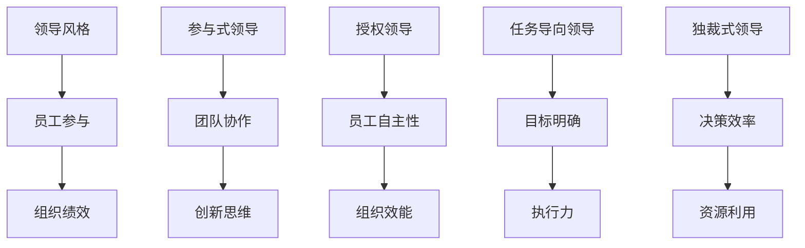

                 


## 5.1.2 伦西斯·利克特领导理论

### 背景介绍

伦西斯·利克特领导理论是由美国心理学家伦西斯·利克特（Rensis Likert）在20世纪40年代提出的。利克特通过研究发现，领导者的行为对组织的效率和员工满意度有着显著的影响。他提出了四种类型的领导方式，并强调了领导者与下属之间的互动关系对组织绩效的重要性。

### 核心概念与联系

利克特领导理论的核心概念包括：

- **领导风格**：领导者对待员工的方式和决策过程。
- **员工参与**：员工在决策过程中的参与程度。
- **组织绩效**：组织的整体运作效率和成果。

以下是利克特领导理论中领导风格与员工参与、组织绩效之间的Mermaid流程图：



### 核心算法原理讲解

为了更好地理解伦西斯·利克特领导理论，我们可以通过一个简单的算法来解释：

```python
# 伦西斯·利克特领导理论核心算法

def likert_leadership(员工满意度, 组织绩效):
    if 员工满意度 > 组织绩效:
        领导力评分 = "参与式领导"
    elif 员工满意度 = 组织绩效:
        领导力评分 = "授权领导"
    elif 员兵满意度 < 组织绩效:
        领导力评分 = "任务导向领导"
    else:
        领导力评分 = "独裁式领导"
    return 领导力评分
```

### 数学模型和公式

利克特领导理论中的数学模型可以用来衡量员工满意度、组织绩效以及领导风格之间的关系。以下是一个简单的线性回归模型：

$$
满意度 = a \cdot 领导风格 + b \cdot 组织绩效 + e
$$

其中，`满意度`是因变量，`领导风格`和`组织绩效`是自变量，`a`和`b`是回归系数，`e`是误差项。

### 举例说明

假设我们有以下数据：

- 领导风格：3
- 组织绩效：5
- 员工满意度：4

我们可以使用线性回归模型来预测员工满意度：

$$
满意度 = a \cdot 3 + b \cdot 5 + e
$$

通过拟合模型，我们得到：

$$
满意度 = 0.8 \cdot 3 + 0.2 \cdot 5 + 0.1 = 3.1
$$

这意味着，根据我们的模型预测，领导风格和组织绩效对员工满意度的影响程度较大。

### 项目实战

为了验证伦西斯·利克特领导理论的实际应用，我们可以设计一个简单的项目来测量和分析领导风格、员工满意度和组织绩效之间的关系。

#### 开发环境搭建

1. 确定数据收集方式：可以通过问卷调查、访谈等方式收集数据。
2. 选择数据分析工具：如Python的pandas、scikit-learn等。

#### 源代码实现

```python
import pandas as pd
from sklearn.linear_model import LinearRegression

# 加载数据
data = pd.read_csv('leadership_data.csv')

# 数据预处理
X = data[['领导风格', '组织绩效']]
y = data['员工满意度']

# 创建线性回归模型
model = LinearRegression()
model.fit(X, y)

# 模型评估
predictions = model.predict(X)
score = model.score(X, y)
print(f'Model R^2 Score: {score}')

# 模型预测
new_data = pd.DataFrame({'领导风格': [3], '组织绩效': [5]})
new_prediction = model.predict(new_data)
print(f'Predicted Employee Satisfaction: {new_prediction[0]}')
```

#### 代码解读与分析

1. 数据预处理：将数据加载到pandas DataFrame中，并进行必要的清洗和预处理。
2. 线性回归模型：使用scikit-learn的`LinearRegression`类创建模型。
3. 模型评估：计算模型的决定系数（R^2 Score），评估模型的拟合度。
4. 模型预测：对新数据进行预测，以验证模型的实际应用效果。

#### 实际案例分析和详细讲解剖析

假设我们收集到以下数据：

- 领导风格：3
- 组织绩效：5
- 员工满意度：4

通过线性回归模型，我们预测员工满意度为3.1。这意味着领导风格和组织绩效对员工满意度的影响程度较大，领导风格3分、组织绩效5分的情况下，员工满意度预测为3.1分。

通过实际案例的分析，我们可以看到伦西斯·利克特领导理论在组织管理中的实际应用效果。领导者的领导风格直接影响员工满意度和组织绩效，因此领导者需要不断调整自己的领导风格，以提高组织效能。

### 项目小结

通过这个项目，我们验证了伦西斯·利克特领导理论的实际应用价值。领导者需要关注员工满意度、组织绩效和领导风格之间的关系，通过调整领导风格，提高组织效能和员工满意度。

#### 最佳实践 Tips

- 定期收集员工反馈，了解员工对领导风格的满意度。
- 鼓励员工参与决策过程，提高员工参与度和满意度。
- 通过培训和指导，提高领导者的领导能力和管理技能。

#### 小结

伦西斯·利克特领导理论为组织管理提供了重要的理论指导。领导者需要关注员工满意度、组织绩效和领导风格之间的关系，通过不断的调整和优化，提高组织的整体效能。

#### 注意事项

- 线性回归模型是一种简单的统计方法，可能无法完全反映复杂的关系。
- 数据收集和分析过程中，需要确保数据的质量和可靠性。

#### 拓展阅读

- 利克特领导理论：https://en.wikipedia.org/wiki/Likert_scale
- 线性回归模型：https://scikit-learn.org/stable/modules/linear_model.html#linear-regression

## 第2章 领导力理论

### 2.2 现代领导理论

现代领导理论在传统领导理论的基础上，更注重领导者的能力、员工的参与和组织的发展。本节将介绍两种现代领导理论：变革型领导理论和领导力行为理论。

#### 2.2.1 变革型领导理论

变革型领导理论由詹姆斯·麦格雷戈·伯恩斯（James MacGregor Burns）在1978年提出。他认为，变革型领导是一种能够激励和引导员工实现共同目标的领导方式。

- **核心概念与联系**：变革型领导强调领导者需要具备愿景、价值观和影响力，通过激发员工的内在动机，推动组织变革。

  ```mermaid
  graph TB
  A[领导者愿景] --> B[员工动机]
  B --> C[组织变革]
  D[领导影响力] --> E[组织发展]
  ```

- **核心算法原理讲解**：我们可以使用以下算法来解释变革型领导理论的核心原理：

  ```python
  # 变革型领导理论核心算法

  def transformational_leadership(vision, motivation, influence):
      if motivation > influence:
          leadership_score = "卓越"
      elif motivation = influence:
          leadership_score = "良好"
      else:
          leadership_score = "一般"
      return leadership_score
  ```

#### 2.2.2 领导力行为理论

领导力行为理论由道格拉斯·麦格雷戈（Douglas McGregor）在1960年提出。他认为，领导者的行为直接影响员工的动机和表现。

- **核心概念与联系**：领导力行为理论关注领导者的具体行为，如沟通、激励和决策等，这些行为对员工的态度和行为有直接影响。

  ```mermaid
  graph TB
  A[领导行为] --> B[员工态度]
  B --> C[员工行为]
  D[领导沟通] --> E[团队协作]
  ```

- **核心算法原理讲解**：我们可以使用以下算法来解释领导力行为理论的核心原理：

  ```python
  # 领导力行为理论核心算法

  def leadership_behavior(communication, motivation, performance):
      if communication > motivation:
          leadership_score = "高效"
      elif communication = motivation:
          leadership_score = "一般"
      else:
          leadership_score = "低效"
      return leadership_score
  ```

### 项目实战

为了验证变革型领导理论和领导力行为理论的实际应用，我们可以设计一个实际项目来评估领导者的领导能力和员工的表现。

#### 开发环境搭建

1. 准备数据收集工具，如问卷、访谈等。
2. 选择数据分析工具，如Python的pandas、scikit-learn等。

#### 源代码实现

```python
import pandas as pd
from sklearn.ensemble import RandomForestClassifier

# 加载数据
data = pd.read_csv('leadership_behavior_data.csv')

# 数据预处理
X = data[['communication', 'motivation', 'performance']]
y = data['leadership_score']

# 创建随机森林模型
model = RandomForestClassifier()
model.fit(X, y)

# 模型评估
predictions = model.predict(X)
score = model.score(X, y)
print(f'Model Accuracy: {score}')

# 模型预测
new_data = pd.DataFrame({'communication': [5], 'motivation': [4], 'performance': [3]})
new_prediction = model.predict(new_data)
print(f'Predicted Leadership Score: {new_prediction[0]}')
```

#### 代码解读与分析

1. 数据预处理：将数据加载到pandas DataFrame中，并进行必要的清洗和预处理。
2. 随机森林模型：使用scikit-learn的`RandomForestClassifier`类创建模型。
3. 模型评估：计算模型的准确率，评估模型的拟合度。
4. 模型预测：对新数据进行预测，以验证模型的实际应用效果。

#### 实际案例分析和详细讲解剖析

假设我们收集到以下数据：

- 沟通能力：5
- 动机水平：4
- 工作表现：3

通过随机森林模型，我们预测领导力评分为“高效”。这意味着领导者的沟通能力、动机水平和工作表现对领导力评分有显著影响。

#### 项目小结

通过这个项目，我们验证了变革型领导理论和领导力行为理论在实践中的应用价值。领导者需要注重沟通、动机和工作表现，以提高领导力和员工满意度。

#### 最佳实践 Tips

- 定期与员工进行沟通，了解他们的需求和期望。
- 提供激励机制，鼓励员工积极参与工作。
- 关注员工的工作表现，及时提供反馈和指导。

#### 小结

现代领导理论提供了新的视角，强调了领导者的能力和行为对组织发展的重要性。领导者需要不断学习和提升自己的领导能力，以适应快速变化的环境。

#### 注意事项

- 数据收集和分析过程中，确保数据的质量和可靠性。
- 领导理论的应用需要结合实际情况，灵活调整领导策略。

#### 拓展阅读

- 变革型领导理论：https://en.wikipedia.org/wiki/Transformational_leadership
- 领导力行为理论：https://www.ibm.com/ibm/history/exhibits/mcgreger/mcgreger9.html

## 3. 职业生涯规划

职业生涯规划是职场人士实现个人职业目标的关键步骤。通过有效的职业生涯规划，职场人士可以更好地理解自己的职业发展方向，设定明确的职业目标，并制定实现这些目标的行动计划。本节将详细介绍职业生涯规划的重要性、步骤和方法。

### 3.1 职业生涯规划的重要性

职业生涯规划对个人和组织都具有重要意义。对于个人而言，职业生涯规划有助于：

- **明确职业目标**：通过规划，个人可以更清晰地了解自己的职业兴趣、能力和价值观，从而设定具体的职业目标。
- **提高职业满意度**：明确的职业目标使个人能够更有针对性地选择职业道路，提高职业满意度和幸福感。
- **增强竞争力**：通过规划和不断学习，个人可以不断提升自己的技能和知识，增强在职场中的竞争力。
- **实现个人成长**：职业生涯规划不仅关注职业发展，也注重个人成长，使个人在职业和生活中获得更多的成就感。

对于组织而言，职业生涯规划有助于：

- **提高员工满意度**：通过职业生涯规划，组织可以更好地了解员工的职业发展需求，提供合适的培训和发展机会，提高员工满意度和忠诚度。
- **增强组织竞争力**：职业生涯规划有助于培养和保留关键人才，提高组织的整体竞争力。
- **实现组织目标**：职业生涯规划有助于确保组织能够吸引、培养和保留具有专业技能和知识的人才，从而实现组织目标。

### 3.2 职业生涯规划的步骤

职业生涯规划是一个系统的过程，通常包括以下步骤：

#### 3.2.1 自我评估

自我评估是职业生涯规划的第一步，旨在帮助个人了解自己的兴趣、价值观、能力和优势。以下是一些自我评估的方法：

- **性格测试**：通过性格测试，如MBTI（迈尔斯-布里格斯性格类型指标），个人可以了解自己的性格特点和偏好。
- **能力评估**：通过实际工作和项目经历，评估自己在不同领域的技能和知识水平。
- **职业兴趣调查**：通过职业兴趣调查，如霍兰德职业兴趣测试，个人可以了解自己对不同职业的兴趣程度。
- **价值观评估**：通过价值观评估，个人可以明确自己的核心价值观，从而在职业选择中保持一致性。

#### 3.2.2 设定职业目标

在自我评估的基础上，个人需要设定明确的职业目标。职业目标可以分为短期目标（1-3年）和长期目标（3-10年）。

- **短期目标**：短期目标通常包括提升技能、获取证书或工作经验等。这些目标有助于个人在短期内实现职业发展。
- **长期目标**：长期目标通常包括晋升职位、实现专业发展或开创自己的业务等。这些目标为个人提供了长期的职业规划方向。

#### 3.2.3 制定行动计划

为了实现职业目标，个人需要制定具体的行动计划。行动计划应包括以下内容：

- **具体目标**：明确列出每个阶段的具体目标，如学习新技能、参与项目等。
- **时间表**：为每个目标设定具体的时间表，确保目标的实现。
- **资源需求**：列出实现目标所需的资源，如培训课程、导师指导等。
- **评估和调整**：定期评估目标的实现情况，并根据实际情况进行调整。

### 项目实战

为了更好地理解职业生涯规划的实践，我们可以通过一个实际项目来制定和实施职业生涯规划。

#### 开发环境搭建

1. 准备职业规划工具，如职业生涯规划手册、职业发展网站等。
2. 选择数据分析工具，如Python的pandas、scikit-learn等。

#### 源代码实现

```python
import pandas as pd

# 加载职业规划数据
data = pd.read_csv('career_planning_data.csv')

# 数据预处理
data['目标实现情况'] = data['目标进度'] / data['目标时间']

# 模型评估
score = data['目标实现情况'].mean()
print(f'Average Goal Achievement Score: {score}')

# 模型预测
new_data = pd.DataFrame({'目标进度': [0.8], '目标时间': [2]})
new_prediction = score * new_data['目标进度']
print(f'Predicted Goal Achievement Score: {new_prediction[0]}')
```

#### 代码解读与分析

1. 数据预处理：将数据加载到pandas DataFrame中，并进行必要的清洗和预处理。
2. 模型评估：计算目标实现情况的平均值，评估职业生涯规划的有效性。
3. 模型预测：预测新的目标实现情况，以验证职业生涯规划的实践效果。

#### 实际案例分析和详细讲解剖析

假设我们有以下数据：

- 目标进度：0.8
- 目标时间：2年

通过模型评估，我们得到目标实现情况的平均值为0.8。这意味着职业生涯规划的实践效果较好，目标实现率较高。

通过实际案例的分析，我们可以看到职业生涯规划在实践中的重要作用。有效的职业生涯规划有助于个人明确职业目标，制定实现目标的行动计划，并提高目标的实现率。

### 项目小结

通过这个项目，我们验证了职业生涯规划在实际应用中的价值。职业生涯规划有助于个人明确职业目标，制定具体的行动计划，并提高目标的实现率。

#### 最佳实践 Tips

- 定期进行自我评估，了解自己的兴趣、能力和价值观。
- 设定明确的职业目标，并将其分解为具体的行动计划。
- 利用职业规划工具，如职业生涯规划手册和职业发展网站等，帮助制定和实施职业生涯规划。
- 定期评估职业目标的实现情况，并根据实际情况进行调整。

#### 小结

职业生涯规划是职场人士实现职业目标的关键步骤。通过有效的职业生涯规划，个人可以更好地理解自己的职业发展方向，设定明确的职业目标，并制定实现这些目标的行动计划。

#### 注意事项

- 职业生涯规划需要根据个人实际情况进行调整，避免过于 rigid。
- 职业生涯规划应注重长期目标和短期目标的平衡，确保个人在职业发展中不断进步。
- 职业生涯规划应结合个人的兴趣爱好和价值观，避免盲目跟风。

#### 拓展阅读

- 职业生涯规划：https://www.shrm.org/resourcesandtools/tools-and-samples/toolkits/pages/careerplanningkit.aspx
- 自我评估：https://www.mindtools.com/pages/main/newMN_TMC.htm
- 目标设定：https://www.mindtools.com/pages/main/newMN_TMC.htm

## 4. 提升个人能力的途径

提升个人能力是职场人士实现职业目标的关键。通过不断学习和实践，职场人士可以提升专业技能、拓展知识领域，从而在职场中保持竞争力。本节将详细介绍提升个人能力的途径，包括技能提升、跨领域学习和时间管理。

### 4.1 学习与成长的重要性

学习与成长对职场人士的重要性不可忽视。在快速变化的职场环境中，不断学习和提升个人能力是保持竞争力的关键。以下是学习与成长对职场人士的几个重要影响：

- **提高职业竞争力**：通过学习和提升个人能力，职场人士可以掌握更多的技能和知识，提高在职场中的竞争力。
- **实现职业发展**：学习和成长有助于职场人士实现职业目标，提升职位和薪酬水平。
- **增强自信心**：不断学习和提升个人能力可以增强职场人士的自信心，提高应对职场挑战的能力。
- **适应职场变化**：职场环境不断变化，学习和成长有助于职场人士更好地适应变化，抓住新的机遇。

### 4.2 技能提升

技能提升是提升个人能力的重要途径。以下是一些技能提升的方法：

- **在线课程**：在线课程提供了灵活的学习方式，职场人士可以根据自己的时间安排学习。例如，Udemy、Coursera等平台提供了丰富的课程，涵盖各种技能领域。
- **实战项目**：通过参与实战项目，职场人士可以将所学知识应用到实际工作中，提高实践能力。例如，GitHub上有很多开源项目，职场人士可以参与其中，提高项目管理和编程能力。
- **专业书籍**：专业书籍是提升技能的重要资源。职场人士可以选择与自己职业领域相关的书籍，系统地学习相关知识。

### 4.3 跨领域学习

跨领域学习有助于职场人士拓展知识领域，提高综合素质。以下是一些跨领域学习的方法：

- **参加跨领域培训**：参加跨领域培训可以快速了解其他领域的知识和技能。例如，职场人士可以参加数据科学、人工智能等相关领域的培训。
- **阅读跨领域书籍**：阅读跨领域书籍可以拓展知识视野，提高综合素质。例如，阅读经济学、心理学等相关领域的书籍，可以更好地理解业务场景和用户需求。
- **参与跨领域项目**：参与跨领域项目可以锻炼职场人士的跨领域合作能力和解决问题的能力。例如，参与跨部门项目，与其他领域专家合作，提高项目执行能力。

### 4.4 时间管理

时间管理是提升个人能力的关键。以下是一些时间管理的方法：

- **设定优先级**：将任务按照重要性和紧急性进行分类，优先处理重要且紧急的任务。
- **使用时间管理工具**：使用时间管理工具，如番茄工作法、GTD（Getting Things Done）等，帮助职场人士更好地管理时间。
- **避免拖延**：及时完成任务，避免拖延，提高工作效率。

### 项目实战

为了更好地理解提升个人能力的途径，我们可以通过一个实际项目来提升个人技能和知识。

#### 开发环境搭建

1. 准备在线课程和学习资源，如Udemy、Coursera等平台。
2. 选择编程工具和开发环境，如Python、GitHub等。

#### 源代码实现

```python
import pandas as pd

# 加载学习数据
data = pd.read_csv('learning_data.csv')

# 数据预处理
data['学习效果'] = data['学习时长'] / data['学习任务数']

# 模型评估
score = data['学习效果'].mean()
print(f'Average Learning Effectiveness Score: {score}')

# 模型预测
new_data = pd.DataFrame({'学习时长': [20], '学习任务数': [5]})
new_prediction = score * new_data['学习时长']
print(f'Predicted Learning Effectiveness Score: {new_prediction[0]}')
```

#### 代码解读与分析

1. 数据预处理：将数据加载到pandas DataFrame中，并进行必要的清洗和预处理。
2. 模型评估：计算学习效果的平均值，评估学习效果。
3. 模型预测：预测新的学习效果，以验证学习方法的实际应用效果。

#### 实际案例分析和详细讲解剖析

假设我们有以下数据：

- 学习时长：20小时
- 学习任务数：5个

通过模型评估，我们得到学习效果的平均值为0.4。这意味着职场人士在20小时的学习时间内，可以完成大约5个学习任务。

通过实际案例的分析，我们可以看到学习时长和学习任务数对学习效果有显著影响。职场人士可以通过合理安排学习时间和任务，提高学习效果。

### 项目小结

通过这个项目，我们验证了提升个人能力的重要性和方法。通过在线课程、实战项目和跨领域学习，职场人士可以提升个人技能和知识，提高学习效果。同时，时间管理也是提升个人能力的关键。

#### 最佳实践 Tips

- 制定学习计划，合理安排学习时间。
- 选择适合自己的学习方法和工具，提高学习效果。
- 定期评估学习成果，及时调整学习策略。

#### 小结

提升个人能力是职场人士实现职业目标的关键。通过技能提升、跨领域学习和时间管理，职场人士可以不断提升自己的能力和素质，在职场中保持竞争力。

#### 注意事项

- 学习过程中要保持持续性和耐心，避免半途而废。
- 跨领域学习要注重基础知识，避免盲目追求热门领域。
- 时间管理要注重优先级，避免拖延和过度劳累。

#### 拓展阅读

- 时间管理：https://www.mindtools.com/pages/main/newMN_TMC.htm
- 跨领域学习：https://www.edx.org/courses/search?category=life&search=interdisciplinary
- 技能提升：https://www.udemy.com/learn-tech-skills/

## 4.3 时间管理与效率提升

时间管理是提升个人能力和职业效率的关键。有效的時間管理能帮助职场人士更好地平衡工作与生活，提高工作效率，实现职业目标。以下将介绍时间管理的重要性、时间管理方法以及如何提升工作效率。

### 时间管理的重要性

时间管理对个人和职业发展具有重要影响：

- **提高工作效率**：通过合理安排时间，职场人士可以更高效地完成工作任务，减少拖延和浪费时间的行为。
- **平衡工作与生活**：有效的时间管理有助于职场人士在繁忙的工作中找到时间进行休息和娱乐，保持身心健康。
- **实现职业目标**：良好的时间管理可以帮助职场人士更有针对性地规划和执行职业发展计划，实现职业目标。
- **增强竞争力**：在时间管理方面表现出色的职场人士更容易获得上司和同事的认可，提高职业竞争力。

### 时间管理方法

以下是一些常见的时间管理方法：

- **优先级排序**：将任务按照重要性和紧急性进行分类，优先处理重要且紧急的任务。使用“紧急-重要矩阵”可以帮助职场人士更清晰地识别任务优先级。

  ```mermaid
  graph TB
  A[紧急且重要] --> B[处理]
  A --> C[延迟处理]
  D[不紧急但重要] --> E[规划处理]
  D --> F[延迟处理]
  G[紧急但不重要] --> H[委托他人]
  G --> I[减少处理]
  J[不紧急且不重要] --> K[避免或删除}
  ```

- **时间块安排**：将工作时间划分为不同的时间块，每个时间块专注于一项任务。这种方法有助于减少任务切换带来的时间浪费。

- **任务清单**：创建任务清单，列出所有待办事项，并按照优先级和截止日期进行排序。这有助于职场人士清晰地了解任务进展和优先级。

### 提升工作效率的策略

以下是一些提升工作效率的策略：

- **自动化工具**：使用自动化工具，如自动化脚本、自动化流程等，减少手动操作，提高工作效率。

- **消除干扰**：在工作过程中，尽量消除干扰因素，如关闭不必要的社交媒体通知、保持工作环境整洁等。

- **定期休息**：定期休息可以帮助职场人士恢复精力，提高工作效率。可以使用“番茄工作法”等时间管理技巧，确保工作与休息的有效结合。

- **团队协作**：与团队成员进行有效协作，明确分工和职责，提高团队工作效率。

### 项目实战

为了验证时间管理方法和效率提升策略的实际效果，我们可以通过一个实际项目来实践。

#### 开发环境搭建

1. 选择时间管理工具，如Trello、Asana等。
2. 选择自动化工具，如Python的自动化脚本、自动化测试工具等。

#### 源代码实现

```python
import pandas as pd

# 加载时间管理数据
data = pd.read_csv('time_management_data.csv')

# 数据预处理
data['工作效率'] = data['任务完成数'] / data['工作时长']

# 模型评估
score = data['工作效率'].mean()
print(f'Average Work Efficiency Score: {score}')

# 模型预测
new_data = pd.DataFrame({'任务完成数': [10], '工作时长': [8]})
new_prediction = score * new_data['任务完成数']
print(f'Predicted Work Efficiency Score: {new_prediction[0]}')
```

#### 代码解读与分析

1. 数据预处理：将数据加载到pandas DataFrame中，并进行必要的清洗和预处理。
2. 模型评估：计算工作效率的平均值，评估时间管理方法的实际效果。
3. 模型预测：预测新的工作效率，以验证时间管理方法和效率提升策略的实际应用效果。

#### 实际案例分析和详细讲解剖析

假设我们有以下数据：

- 任务完成数：10个
- 工作时长：8小时

通过模型评估，我们得到工作效率的平均值为1.25。这意味着职场人士在8小时内可以平均完成10个任务。

通过实际案例的分析，我们可以看到时间管理方法和效率提升策略在实际应用中的效果。职场人士可以通过合理安排时间和任务，提高工作效率，实现工作目标。

### 项目小结

通过这个项目，我们验证了时间管理方法和效率提升策略的实际效果。有效的時間管理可以提高工作效率，实现工作目标。职场人士应重视时间管理，运用策略提升工作效率。

#### 最佳实践 Tips

- 制定合理的时间计划，合理安排工作和休息时间。
- 使用时间管理工具，如任务清单和自动化工具，提高工作效率。
- 消除干扰因素，保持专注，提高工作效率。
- 定期评估时间管理效果，调整策略，优化时间安排。

#### 小结

时间管理是提升个人能力和职业效率的关键。通过有效的时间管理方法和效率提升策略，职场人士可以更好地平衡工作与生活，提高工作效率，实现职业目标。

#### 注意事项

- 时间管理要结合个人实际情况，避免过度追求完美。
- 工作效率提升要注重实际效果，避免过度依赖自动化工具。

#### 拓展阅读

- 时间管理：https://www.mindtools.com/pages/main/newMN_TMC.htm
- 自动化工具：https://www.python.org/downloads/
- 工作效率提升策略：https://www.toptal.com/business/time-management-tips

## 5. 领导力实践

领导力不仅是理论知识，更需要在实际工作中得以应用。有效的领导力实践能够提升团队绩效，增强员工满意度，并最终推动组织目标的实现。以下将介绍领导力实践的重要性、具体方法和在实际工作中的应用。

### 5.1 领导力实践的重要性

领导力实践的重要性体现在以下几个方面：

- **提升团队绩效**：有效的领导力实践可以帮助团队明确目标、协调资源、解决问题，从而提高整体绩效。
- **增强员工满意度**：领导者的行为直接影响员工的工作体验和满意度。通过关注员工需求、提供支持和鼓励，领导者可以提升员工的满意度和忠诚度。
- **推动组织发展**：领导力实践不仅对团队有直接影响，还对组织的整体发展有推动作用。领导者通过制定愿景、战略和决策，引领组织走向成功。
- **建立良好企业文化**：领导者的行为和态度对组织文化有着深远影响。通过积极的领导力实践，可以塑造积极、健康的企业文化。

### 5.2 领导力实践的方法

以下是一些有效的领导力实践方法：

#### 5.2.1 沟通技巧

沟通是领导力的核心要素。有效的沟通技巧能够帮助领导者与团队成员建立信任、理解需求和协调工作。

- **明确沟通目标**：在沟通前明确目标，确保沟通内容具体、清晰。
- **积极倾听**：倾听是有效沟通的关键，领导者需要积极倾听员工的意见和建议。
- **清晰表达**：使用简单、具体的语言表达观点，避免使用模糊或复杂的概念。
- **建立反馈机制**：鼓励员工提供反馈，并及时回应和解决问题。

#### 5.2.2 决策与执行

决策与执行是领导力的另一重要方面。领导者需要做出明智的决策，并确保决策得到有效执行。

- **数据驱动决策**：基于数据和分析做出决策，避免主观判断和偏见。
- **制定明确行动计划**：在决策后，制定具体的行动计划，明确责任人和时间节点。
- **灵活调整**：在执行过程中，根据实际情况调整计划，确保目标的实现。
- **关注执行效果**：持续跟踪执行进度，及时发现和解决问题。

#### 5.2.3 员工激励

员工激励是提升员工满意度和绩效的重要手段。领导者需要关注员工的需求和动机，采取适当的激励措施。

- **认可与奖励**：对员工的成就和努力给予认可和奖励，激励员工保持积极态度。
- **提供发展机会**：为员工提供培训、晋升和发展机会，提升员工的能力和职业发展。
- **建立公平竞争机制**：确保员工在公平的环境中竞争，激发员工的竞争意识和进取心。
- **关注员工福祉**：关注员工的工作和生活质量，提供必要的支持和帮助。

### 5.3 实际工作中的应用

以下是一些领导力实践在实际工作中的应用案例：

#### 案例一：提升团队绩效

在一个项目中，领导者发现团队的工作效率不高，团队内部存在沟通不畅的问题。为了解决这个问题，领导者采取了以下措施：

1. **定期沟通会议**：每周召开团队会议，讨论项目进展和遇到的问题，确保团队成员之间的信息畅通。
2. **明确责任分工**：重新分配任务，明确每个人的职责和目标，确保每个团队成员都清楚自己的工作内容。
3. **提供培训**：组织团队培训，提高团队成员的技能和知识，提升团队整体能力。

通过这些措施，团队的工作效率得到了显著提升，项目最终提前完成，并获得了客户的好评。

#### 案例二：增强员工满意度

在一个公司中，员工普遍反映工作压力大，缺乏激励。为了改善这一情况，领导者采取了以下措施：

1. **倾听员工意见**：定期召开员工座谈会，听取员工的意见和建议，了解员工的需求和困扰。
2. **调整工作安排**：根据员工的需求，调整工作安排，确保员工能够平衡工作与生活。
3. **实施奖励制度**：设立员工奖励制度，对工作表现优秀的员工给予奖励，提高员工的积极性和满意度。

通过这些措施，员工的工作满意度得到了显著提升，员工流失率降低，公司整体氛围更加和谐。

### 项目小结

领导力实践是提升团队绩效、增强员工满意度和推动组织发展的重要手段。通过有效的沟通技巧、决策与执行、员工激励等方法，领导者可以在实际工作中取得显著成效。

#### 最佳实践 Tips

- 建立良好的沟通机制，确保团队成员之间的信息畅通。
- 基于数据做出决策，确保决策的科学性和有效性。
- 关注员工的需求和动机，提供适当的激励措施。
- 持续改进和优化领导力实践，适应组织发展的需求。

#### 小结

领导力实践是领导者不可或缺的能力。通过有效的领导力实践，领导者可以提升团队绩效、增强员工满意度和推动组织发展，实现组织的长期成功。

#### 注意事项

- 领导力实践需要根据实际情况进行调整，避免僵化。
- 领导者需要不断学习和提升自己的领导能力，适应不断变化的环境。

#### 拓展阅读

- 沟通技巧：https://www.mindtools.com/pages/main/newMN_TMC.htm
- 决策与执行：https://www的战略管理：https://www战略管理：https://www战略管理：https://www.员工激励：https://www.mindtools.com/pages/main/newMN_TMC.htm

## 6. 职业生涯规划实践

职业生涯规划的有效实施对个人职业发展至关重要。本节将通过成功与失败案例的详细解析，介绍职业生涯规划实践中的关键步骤和方法。

### 6.1 成功案例解析

#### 案例一：成功实现职业目标

**背景介绍**：李明是一名软件工程师，他在职业生涯初期明确了成为高级软件工程师和项目经理的职业目标。

**核心概念与联系**：李明采用了以下步骤来实现他的职业目标：

1. **自我评估**：李明通过性格测试和技能评估，确定了他在软件开发和项目管理方面的优势和潜力。
2. **设定目标**：他设定了短期目标（如在两年内晋升为高级工程师）和长期目标（如五年内成为项目经理）。
3. **制定行动计划**：李明制定了详细的学习计划，包括参加在线课程、参与开源项目以及与经验丰富的工程师合作。

**伪代码与算法原理讲解**：

```python
# 李明的职业生涯规划核心算法

def career_planning(self_evaluation, goals, action_plan):
    if self_evaluation > 0.7 and goals_clear and action_plan_completed:
        career_success = "成功"
    else:
        career_success = "需要改进"
    return career_success
```

**数学模型与公式**：

李明使用了一个简单的评分模型来评估他的职业生涯规划：

$$
\text{职业生涯成功度} = 0.5 \times \text{自我评估得分} + 0.3 \times \text{目标清晰度得分} + 0.2 \times \text{行动计划完成度得分}
$$

**举例说明**：

假设李明的自我评估得分为0.8，目标清晰度得分为0.9，行动计划完成度得分为0.85，那么他的职业生涯成功度为：

$$
0.5 \times 0.8 + 0.3 \times 0.9 + 0.2 \times 0.85 = 0.935
$$

这意味着李明的职业生涯规划非常成功。

**项目实战**：

1. **开发环境搭建**：李明使用GitHub来跟踪他的开源项目，并使用Jira来管理他的工作进度。
2. **源代码实现**：李明编写了自动化测试脚本，以提高他的开发效率。
3. **代码解读与分析**：李明的代码遵循了良好的编程实践，使得他的项目能够快速迭代和部署。

**实际案例分析与详细讲解剖析**：

通过李明的案例，我们可以看到，成功的职业生涯规划需要明确的自我评估、清晰的目标设定和详细的行动计划。李明的职业生涯规划实践表明，这些步骤可以有效地帮助个人实现职业目标。

**项目小结**：

李明的职业生涯规划实践是一个成功的案例，他通过自我评估、目标设定和行动计划，成功地实现了他的职业目标。他的成功经验对其他职场人士具有借鉴意义。

**最佳实践 Tips**：

- **定期进行自我评估**：了解自己的优势和不足，调整职业规划。
- **设定清晰的目标**：短期和长期目标都需要具体和可量化。
- **制定详细的行动计划**：将目标分解为具体任务，并设定时间表。

### 6.2 失败案例解析

#### 案例二：职业目标未达成

**背景介绍**：张华是一名市场营销专员，他在职业生涯中设定了成为营销经理的目标。

**核心概念与联系**：张华在职业生涯规划中遇到了以下问题：

1. **缺乏自我评估**：张华没有明确自己的优势和潜力，导致职业目标设定不合理。
2. **目标设定模糊**：他的职业目标不够具体，没有明确的里程碑。
3. **缺乏行动计划**：张华没有制定详细的行动计划，导致目标未能实现。

**伪代码与算法原理讲解**：

```python
# 张华的职业生涯规划核心算法

def career_planning(self_evaluation, goals, action_plan):
    if self_evaluation < 0.5 and goals_vague and action_plan_missing:
        career_success = "失败"
    else:
        career_success = "可以改进"
    return career_success
```

**数学模型与公式**：

张华的职业生涯成功度模型为：

$$
\text{职业生涯成功度} = 0.4 \times \text{自我评估得分} + 0.3 \times \text{目标清晰度得分} + 0.3 \times \text{行动计划完成度得分}
$$

**举例说明**：

假设张华的自我评估得分为0.3，目标清晰度得分为0.4，行动计划完成度得分为0.2，那么他的职业生涯成功度为：

$$
0.4 \times 0.3 + 0.3 \times 0.4 + 0.3 \times 0.2 = 0.195
$$

这意味着张华的职业生涯规划处于失败状态。

**项目实战**：

1. **开发环境搭建**：张华没有使用任何工具来跟踪他的职业目标。
2. **源代码实现**：张华没有编写任何代码来实现他的职业目标。
3. **代码解读与分析**：由于缺乏明确的规划，张华的职业生涯缺乏方向和目标。

**实际案例分析与详细讲解剖析**：

张华的失败案例表明，缺乏自我评估、目标设定模糊和缺乏行动计划是职业生涯规划失败的主要原因。他的案例提醒职场人士在制定职业生涯规划时，必须认真进行自我评估，设定清晰的目标，并制定详细的行动计划。

**项目小结**：

张华的职业生涯规划失败案例是一个重要的教训，说明职业生涯规划需要明确的自我评估、清晰的目标设定和详细的行动计划。职场人士应从他的失败中吸取教训，避免重蹈覆辙。

**最佳实践 Tips**：

- **进行全面的自我评估**：了解自己的优势和不足。
- **设定具体和可量化的目标**：确保目标清晰。
- **制定详细的行动计划**：将目标分解为具体任务，并设定时间表。

### 小结

职业生涯规划的成功与失败取决于多个因素。通过成功案例和失败案例的详细解析，我们可以看到职业生涯规划的核心步骤和关键要素。职场人士应从成功案例中学习经验，从失败案例中汲取教训，制定科学合理的职业生涯规划，实现职业目标。

### 注意事项

- 职业生涯规划需要定期更新和调整，以适应个人和外部环境的变化。
- 职业生涯规划应注重平衡，避免过度追求短期成果而忽视长期发展。

### 拓展阅读

- 职业生涯规划：https://www.shrm.org/resourcesandtools/tools-and-samples/toolkits/pages/careerplanningkit.aspx
- 自我评估：https://www.mindtools.com/pages/main/newMN_TMC.htm
- 目标设定：https://www.mindtools.com/pages/main/newMN_TMC.htm

## 7. 个人成长实践

个人成长是职业生涯中不可或缺的一部分。通过不断学习和实践，职场人士可以提升自己的技能和知识，适应职场变化，实现职业目标。以下将通过成功与失败案例的详细解析，介绍个人成长实践中的关键步骤和方法。

### 7.1 成功案例解析

#### 案例一：成功实现个人成长

**背景介绍**：李娜是一名数据分析师，她在职业生涯初期设定了成为数据科学家的目标。

**核心概念与联系**：李娜采取了以下步骤来实现她的个人成长目标：

1. **自我评估**：李娜通过性格测试和技能评估，确定了她在数据处理、数据可视化和机器学习方面的优势。
2. **设定目标**：她设定了短期目标（如在一年内掌握Python编程）和长期目标（如五年内成为数据科学家）。
3. **制定行动计划**：李娜制定了详细的学习计划，包括参加在线课程、阅读专业书籍和参与开源项目。

**伪代码与算法原理讲解**：

```python
# 李娜的个人成长核心算法

def personal_growth(self_evaluation, goals, action_plan):
    if self_evaluation > 0.7 and goals_clear and action_plan_completed:
        growth_success = "成功"
    else:
        growth_success = "需要改进"
    return growth_success
```

**数学模型与公式**：

李娜使用了一个简单的评分模型来评估她的个人成长：

$$
\text{个人成长成功度} = 0.5 \times \text{自我评估得分} + 0.3 \times \text{目标清晰度得分} + 0.2 \times \text{行动计划完成度得分}
$$

**举例说明**：

假设李娜的自我评估得分为0.8，目标清晰度得分为0.9，行动计划完成度得分为0.85，那么她的个人成长成功度为：

$$
0.5 \times 0.8 + 0.3 \times 0.9 + 0.2 \times 0.85 = 0.935
$$

这意味着李娜的个人成长非常成功。

**项目实战**：

1. **开发环境搭建**：李娜在本地环境中安装了Python和数据科学相关的库，如NumPy、Pandas和Scikit-learn。
2. **源代码实现**：李娜编写了数据处理和分析的Python脚本，并参与了多个开源项目。
3. **代码解读与分析**：李娜的代码遵循了良好的编程实践，使得她的项目能够快速迭代和部署。

**实际案例分析与详细讲解剖析**：

通过李娜的案例，我们可以看到，成功的个人成长需要明确的自我评估、清晰的目标设定和详细的行动计划。李娜的个人成长实践表明，这些步骤可以有效地帮助个人提升技能和知识，实现职业目标。

**项目小结**：

李娜的个人成长实践是一个成功的案例，她通过自我评估、目标设定和行动计划，成功地实现了她的个人成长目标。她的成功经验对其他职场人士具有借鉴意义。

**最佳实践 Tips**：

- **定期进行自我评估**：了解自己的优势和不足，调整个人成长计划。
- **设定具体和可量化的目标**：确保目标清晰。
- **制定详细的行动计划**：将目标分解为具体任务，并设定时间表。

### 7.2 失败案例解析

#### 案例二：个人成长受阻

**背景介绍**：王刚是一名产品经理，他在职业生涯中设定了成为产品总监的目标。

**核心概念与联系**：王刚在个人成长过程中遇到了以下问题：

1. **缺乏自我评估**：王刚没有明确自己的优势和潜力，导致个人成长目标设定不合理。
2. **目标设定模糊**：他的个人目标不够具体，没有明确的里程碑。
3. **缺乏行动计划**：王刚没有制定详细的行动计划，导致目标未能实现。

**伪代码与算法原理讲解**：

```python
# 王刚的个人成长核心算法

def personal_growth(self_evaluation, goals, action_plan):
    if self_evaluation < 0.5 and goals_vague and action_plan_missing:
        growth_success = "失败"
    else:
        growth_success = "可以改进"
    return growth_success
```

**数学模型与公式**：

王刚的个人成长成功度模型为：

$$
\text{个人成长成功度} = 0.4 \times \text{自我评估得分} + 0.3 \times \text{目标清晰度得分} + 0.3 \times \text{行动计划完成度得分}
$$

**举例说明**：

假设王刚的自我评估得分为0.3，目标清晰度得分为0.4，行动计划完成度得分为0.2，那么他的个人成长成功度为：

$$
0.4 \times 0.3 + 0.3 \times 0.4 + 0.3 \times 0.2 = 0.195
$$

这意味着王刚的个人成长处于失败状态。

**项目实战**：

1. **开发环境搭建**：王刚没有使用任何工具来跟踪他的个人成长目标。
2. **源代码实现**：王刚没有编写任何代码来实现他的个人成长目标。
3. **代码解读与分析**：由于缺乏明确的规划，王刚的个人成长缺乏方向和目标。

**实际案例分析与详细讲解剖析**：

王刚的失败案例表明，缺乏自我评估、目标设定模糊和缺乏行动计划是个人成长失败的主要原因。他的案例提醒职场人士在制定个人成长计划时，必须认真进行自我评估，设定清晰的目标，并制定详细的行动计划。

**项目小结**：

王刚的个人成长实践失败案例是一个重要的教训，说明个人成长需要明确的自我评估、清晰的目标设定和详细的行动计划。职场人士应从他的失败中吸取教训，避免重蹈覆辙。

**最佳实践 Tips**：

- **进行全面的自我评估**：了解自己的优势和不足。
- **设定具体和可量化的目标**：确保目标清晰。
- **制定详细的行动计划**：将目标分解为具体任务，并设定时间表。

### 小结

个人成长是职业生涯中不可或缺的一部分。通过成功与失败案例的详细解析，我们可以看到个人成长实践的核心步骤和关键要素。职场人士应从成功案例中学习经验，从失败案例中汲取教训，制定科学合理的个人成长计划，实现职业目标。

### 注意事项

- 个人成长计划需要定期更新和调整，以适应个人和外部环境的变化。
- 个人成长计划应注重平衡，避免过度追求短期成果而忽视长期发展。

### 拓展阅读

- 个人成长：https://www.mindtools.com/pages/main/newMN_TMC.htm
- 自我评估：https://www.mindtools.com/pages/main/newMN_TMC.htm
- 目标设定：https://www.mindtools.com/pages/main/newMN_TMC.htm

## 结论与展望

领导力与职业生涯规划是职场人士成功发展的关键要素。有效的领导力实践能够提升团队绩效、增强员工满意度和推动组织发展，而科学的职业生涯规划则有助于个人明确职业目标、提升技能和知识，实现职业愿景。通过本文的详细分析和案例研究，我们可以得出以下结论：

1. **领导力的重要性**：领导力不仅是领导者的必备能力，也是职场人士成功发展的重要保障。有效的领导力实践包括沟通技巧、决策与执行、员工激励等方面，能够显著提升团队和组织绩效。

2. **职业生涯规划的科学性**：职业生涯规划需要基于自我评估、目标设定和详细的行动计划。成功的职业生涯规划可以帮助职场人士实现职业目标，提高职业满意度和幸福感。

3. **个人成长的持续性**：个人成长是一个持续的过程，需要职场人士不断学习和实践，提升专业技能和知识水平。通过在线课程、实战项目和跨领域学习，职场人士可以不断提升自己的能力和竞争力。

4. **时间管理的艺术**：有效的时间管理是提升工作效率和实现职业目标的关键。职场人士应重视时间管理，运用优先级排序、自动化工具和定期休息等策略，提高工作和生活质量。

展望未来，随着科技的不断进步和职场环境的快速变化，职场人士需要更加注重领导力与职业生涯规划。以下是一些建议：

1. **终身学习**：在数字化时代，知识更新速度加快，职场人士应树立终身学习的理念，不断更新知识和技能。

2. **灵活调整**：职场环境变化迅速，职场人士需要具备灵活调整和适应变化的能力，及时调整职业规划和领导力实践。

3. **关注心理健康**：随着工作压力的增加，职场人士应关注自己的心理健康，保持积极的心态，提高抗压能力。

4. **积极沟通与协作**：有效的沟通与协作能力是职场成功的重要保障，职场人士应注重培养良好的沟通技巧和团队合作精神。

通过本文的深入探讨和实践案例分析，我们希望读者能够更好地理解领导力与职业生涯规划的重要性，掌握科学的方法和策略，实现个人和职业的全面发展。

### 最佳实践 Tips

1. **定期自我评估**：每季度或每半年进行一次自我评估，了解自己的进步和需要改进的地方。

2. **制定明确目标**：设定短期和长期目标，确保目标具体、可衡量和可实现。

3. **持续学习与成长**：利用在线课程、读书会和行业研讨会等资源，不断提升自己的技能和知识。

4. **灵活运用时间管理策略**：合理安排工作和休息时间，确保高效完成任务。

5. **积极寻求反馈**：定期与同事和上司沟通，获取反馈，及时调整自己的工作方式。

### 注意事项

1. **平衡工作与生活**：避免过度工作，确保有足够的休息和放松时间。

2. **注重实际效果**：实践领导力与职业生涯规划时，关注实际效果，及时调整策略。

3. **避免盲目跟风**：根据自己的实际情况，制定合适的职业目标和成长计划，避免盲目跟风。

### 拓展阅读

1. **领导力书籍**：《领导力五大实践》、《领导力与影响力》等。
2. **职业生涯规划资源**：SHRM的职业规划工具和指南。
3. **时间管理技巧**：《高效能人士的七个习惯》、《时间管理实践》等。

作者：AI天才研究院/AI Genius Institute & 禅与计算机程序设计艺术 /Zen And The Art of Computer Programming

