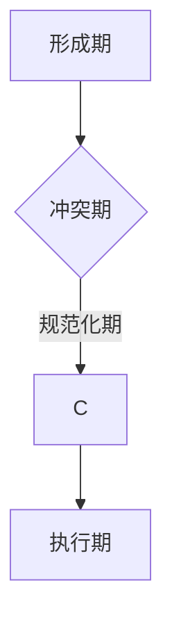
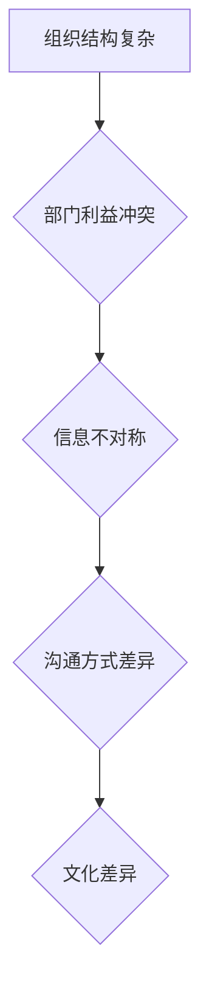

                 

### 文章标题：领导力与职业生涯规划：帮助员工成长

#### 关键词：领导力、职业生涯规划、员工成长、团队建设、跨部门沟通、持续发展

#### 摘要：
本文深入探讨领导力与职业生涯规划对员工成长的重要性，通过详细的理论分析和实践指导，帮助读者理解并掌握领导力的核心概念、职业生涯规划的策略，以及如何在实际工作中促进个人和团队的发展。文章分为七个主要章节，涵盖了领导力概述、职业生涯规划原理、个人与团队成长策略、跨部门沟通与合作、职业发展规划实践等内容。通过这些内容，读者可以系统地学习领导力和职业生涯规划的理论与实践，提升个人能力，助力职业生涯发展。

## 第一步：理解书名和目标读者

《领导力与职业生涯规划：帮助员工成长》这本书的标题清晰地传达了其核心主题：领导力和职业生涯规划。领导力是一个广泛且重要的概念，它不仅涉及到个人的管理能力，还包括影响、激励和培养他人实现目标的能力。职业生涯规划则是指个人在职业发展过程中，通过设定目标、评估自身能力和市场需求，制定和调整职业发展策略，以实现职业目标的过程。

目标读者主要是希望提升领导力以及规划职业生涯的员工。这些读者可能包括初入职场的年轻人、寻求职业发展的中高层管理人员，以及希望推动团队和组织成长的领导者。针对这些读者，书中的内容旨在提供实用的理论指导和实践策略，帮助他们更好地理解领导力和职业生涯规划的重要性，掌握相关技能，并在实际工作中应用这些知识，从而实现个人和职业发展的双赢。

因此，目录大纲需要从以下几个方面展开：

1. **领导力的基本概念与模型**：介绍领导力的定义、类型及其在不同情境中的应用。
2. **职业生涯规划的理论与实践**：探讨职业生涯规划的概念、路径、评估方法及职业选择。
3. **员工成长路径与领导力提升策略**：分析个人成长的重要性，提出具体的提升策略。
4. **团队领导与团队建设**：讨论团队领导的角色、动力模型及团队建设策略。
5. **职业发展规划实践**：指导读者如何制定和实现个人职业规划。
6. **跨部门沟通与合作**：分析跨部门沟通的障碍及有效策略。
7. **领导力与职业生涯发展**：探讨领导力对职业生涯发展的影响及如何持续提升。

通过这些章节的安排，读者可以系统地了解领导力和职业生涯规划的理论基础，掌握相关技能，并将其应用到实际工作中，促进个人和团队的发展。

### 领导力的基本概念与模型

#### 1.1 领导力的定义与重要性

领导力是一个广泛而复杂的概念，它通常被定义为影响、激励和引导他人或团队实现目标的能力。领导力不仅仅是管理下属或团队，还包括创造愿景、设定目标、解决问题和促进团队合作。根据斯蒂芬·罗宾斯（Stephen Robbins）的定义，领导力是指“在特定情境下，通过影响他人来引导和激励他们达成组织目标的过程”。

在组织和社会中，领导力的重要性不容忽视。首先，领导力能够推动创新和变革。一个具备领导力的人能够预见未来的趋势，激发团队成员的创造力，从而推动组织不断发展。其次，领导力有助于团队凝聚力的形成。通过有效的沟通和激励，领导者能够建立团队成员之间的信任和合作，使团队更加高效地完成任务。最后，领导力对个人职业发展也有着显著的影响。具备领导力的人往往更容易获得晋升机会，并在职业发展中获得更多的资源和支持。

#### 1.2 领导力的主要类型

领导力可以根据不同的标准进行分类。以下是一些常见的领导力类型：

1. **交易型领导力**：这种领导力依赖于明确的目标设定和奖励机制，通过奖惩来激励团队成员。交易型领导力强调任务和目标的重要性，通常用于任务驱动型团队。

   **核心算法原理**：
   ```plaintext
   // 交易型领导力算法原理
   function transactional_leadership(team_members, tasks, rewards) {
       for each (member in team_members) {
           if (member.completes_task(task)) {
               reward(member, rewards[task]);
           } else {
               punish(member);
           }
       }
   }
   ```

2. **变革型领导力**：这种领导力注重激发团队成员的内在动机，通过创造愿景和激励，带领团队实现变革。变革型领导力强调领导者的个人魅力和影响力。

   **核心算法原理**：
   ```plaintext
   // 变革型领导力算法原理
   function transformational_leadership(team_members, vision) {
       inspire(team_members, vision);
       for each (member in team_members) {
           motivate(member, vision);
       }
   }
   ```

3. **变革型-交易混合型领导力**：这种领导力结合了交易型领导力和变革型领导力的特点，根据不同情境灵活运用。领导者不仅设定明确的目标和奖励机制，还通过创造愿景和激励来推动变革。

   **核心算法原理**：
   ```plaintext
   // 变革型-交易混合型领导力算法原理
   function hybrid_leadership(team_members, tasks, rewards, vision) {
       transactional_leadership(team_members, tasks, rewards);
       transformational_leadership(team_members, vision);
   }
   ```

#### 1.3 领导力与管理的区别

虽然领导力和管理常常被混用，但两者之间存在显著的区别。管理是一种协调资源和活动，以实现特定目标的过程，它侧重于确保任务得到有效完成。而领导力则是一种激励和影响他人的能力，它侧重于推动变革和实现长远目标。

1. **目标导向性**：管理更关注当前的任务和目标的完成，而领导力则更注重未来的愿景和长远的目标。
2. **权力来源**：管理通常依赖于职位和权威，而领导力则依赖于个人魅力和影响力。
3. **关注对象**：管理侧重于过程和操作，而领导力则侧重于人和团队。

然而，领导力和管理并不是相互独立的，一个成功的领导者通常需要同时具备管理能力和领导力。领导者通过管理确保团队目标的实现，同时通过领导力推动团队实现更大的目标。

#### 1.4 领导力发展的核心要素

要提升领导力，以下核心要素至关重要：

1. **自我认知**：领导者需要了解自己的优点和缺点，以便在团队中发挥最大的作用。通过自我反思和反馈，领导者可以不断改进自己的行为和决策。
2. **情感智力**：情感智力包括自我意识、自我调节、社交意识和关系管理。领导者需要具备高水平的情感智力，以便更好地理解自己和他人，建立良好的人际关系。
3. **决策能力**：领导者需要能够做出明智的决策，这些决策不仅需要考虑当前的利益，还需要考虑长远的战略目标。
4. **沟通技巧**：有效的沟通技巧是领导力的核心要素之一。领导者需要能够清晰、准确地传达信息，并倾听他人的意见和需求。

**数学模型和公式**：

领导力发展可以通过以下模型来量化：

$$
L = f(\text{自我认知}, \text{情感智力}, \text{决策能力}, \text{沟通技巧})
$$

其中，\( L \) 代表领导力水平，其他变量代表上述提到的核心要素。

**举例说明**：

假设一个领导者拥有以下要素：

- 自我认知：90%
- 情感智力：85%
- 决策能力：80%
- 沟通技巧：85%

代入上述公式，可以计算其领导力水平：

$$
L = f(0.90, 0.85, 0.80, 0.85) = 0.8225
$$

因此，该领导力的水平为82.25%。

通过上述分析，我们可以看到，领导力是一个复杂而多维度的概念，它不仅涉及到个人的能力，还包括团队和组织的长远发展。理解领导力的定义、类型及其核心要素，是提升领导力的第一步。在接下来的章节中，我们将继续探讨职业生涯规划的理论与实践，帮助读者更好地理解如何在职业生涯中实现个人和组织的共同成长。

### 职业生涯规划原理

职业生涯规划是个人在职业发展过程中，通过设定目标、评估自身能力和市场需求，制定和调整职业发展策略，以实现职业目标的过程。有效的职业生涯规划能够帮助个人明确职业方向，提升职业竞争力，实现个人和组织的共同成长。

#### 2.1 职业生涯规划的概念

职业生涯规划通常包括以下几个关键组成部分：

1. **目标设定**：设定明确的职业目标是职业生涯规划的第一步。目标可以是短期的，如提升某一技能或完成一项项目，也可以是长期的，如达到某一职位或实现职业生涯的某个阶段。
2. **能力评估**：了解自己的能力、兴趣和价值观，是制定职业生涯规划的重要基础。通过自我评估，个人可以确定自己的优势和劣势，从而在职业发展中做出更有针对性的选择。
3. **职业选择**：职业选择包括确定职业领域、行业和具体的职位。这需要考虑个人的兴趣、能力和市场需求，以找到最适合自己的职业路径。
4. **策略制定**：制定实现职业目标的策略，包括学习新技能、提升工作经验、建立人际关系网络等。策略应具有可行性和灵活性，能够适应职业发展的变化。
5. **持续调整**：职业生涯规划是一个动态过程，需要根据实际情况进行持续调整。个人应定期评估自己的职业目标和进展，根据需要进行调整，以保持职业发展的活力。

#### 2.2 职业发展路径分析

职业发展路径可以分为以下几个阶段：

1. **探索阶段**：这一阶段通常发生在职业生涯的早期，个人通过实习、兼职和试工等方式，探索不同的职业领域和职位，以确定自己的兴趣和潜力。
2. **建立阶段**：在确定了职业方向后，个人通过不断学习和积累经验，逐步建立自己的职业基础。这一阶段的关键是提升专业技能和经验，为未来的职业发展打下坚实的基础。
3. **发展阶段**：在这一阶段，个人通过提升管理和领导能力，逐步向更高层次的职位迈进。发展阶段的关键是不断挑战自己，拓展职业视野，实现职业上的突破。
4. **成熟阶段**：在职业的成熟阶段，个人已经积累了丰富的经验和专业技能，可以在职业上实现较高的成就和影响力。这一阶段的关键是持续学习和创新，保持竞争力，同时为组织和行业做出更大的贡献。
5. **转型阶段**：职业生涯的转型阶段通常发生在中年或更晚的阶段。这一阶段，个人可能会因个人兴趣、市场需求或职业发展的需要，考虑转行或调整职业方向。转型阶段的关键是灵活应对变化，积极学习和适应新的职业环境。

#### 2.3 个人能力评估

个人能力评估是职业生涯规划的基础，它帮助个人了解自己的优势和劣势，从而做出更明智的职业选择。以下是一些常用的个人能力评估方法：

1. **自我评估**：自我评估是通过反思自己的行为、表现和反馈，了解自己的兴趣、能力和价值观。自我评估可以通过填写问卷、撰写个人陈述或与导师进行对话来实现。
2. **心理测试**：心理测试是一种科学的方法，通过测量个人的性格、兴趣、能力和职业倾向，帮助个人了解自己的优点和不足。常见的心理测试包括MBTI、DISC测试和霍兰德职业兴趣测试等。
3. **360度评估**：360度评估是一种全面的评估方法，通过收集来自上级、同事、下属和客户的反馈，全面了解个人的工作表现和职业发展潜力。
4. **职业咨询**：职业咨询是由专业的职业顾问提供的个性化服务，通过一系列的评估和指导，帮助个人制定个性化的职业生涯规划。

#### 2.4 职业选择与决策

职业选择和决策是职业生涯规划中的关键环节，以下是一些指导职业选择和决策的方法：

1. **市场需求分析**：通过分析市场需求和行业趋势，了解哪些职业具有较高的就业前景和增长潜力。这有助于个人选择具有长期发展潜力的职业。
2. **个人兴趣和优势**：结合个人的兴趣和优势，选择最适合自己的职业。个人兴趣和优势是决定职业满意度的重要因素。
3. **风险评估**：在做出职业选择和决策时，需要考虑潜在的风险和挑战。这包括薪资待遇、工作环境、职业发展空间和未来前景等。
4. **咨询和反馈**：在做出职业选择和决策之前，寻求专业人士和身边人的意见和建议，可以帮助个人更全面地评估职业选择，减少决策错误的风险。

通过上述职业生涯规划原理的探讨，我们可以看到，职业生涯规划是一个复杂而系统的过程，它涉及到目标设定、能力评估、职业选择和策略制定等多个方面。理解职业生涯规划的基本原理，是制定有效职业生涯规划的第一步。在接下来的章节中，我们将进一步探讨如何通过个人成长和团队建设，提升领导力，实现职业和团队的发展。

### 领导力与个人成长

领导力不仅是管理和激励团队的能力，更是个人成长的重要驱动因素。个人成长是领导力发展的基础，而领导力则推动个人在职业生涯中不断进步和突破。在这一章节中，我们将探讨领导力与个人成长之间的紧密联系，并提出具体的成长策略，帮助读者提升领导力和实现个人发展。

#### 3.1 自我认知与成长

自我认知是个人成长的第一步，它要求个体深入反思自己的行为、态度、能力和价值观。自我认知不仅有助于个体明确自己的优势和劣势，还可以帮助个体理解自己的动机和需求，从而做出更明智的决策。

1. **自我反思**：自我反思是一种通过深入思考和分析自己的行为和经历，以了解自己的方式。通过自我反思，个体可以发现自身的盲点和不足，从而有针对性地进行改进。例如，一个领导者可以通过定期反思自己的管理行为，识别自己在决策过程中的缺陷，并寻求改进方法。

2. **反馈与改进**：获取他人的反馈是自我认知的重要环节。通过听取同事、下属和上级的意见，个体可以获得更全面的反馈，了解自己在他人眼中的形象和表现。反馈可以帮助个体识别自己的不足，并提供改进的方向。例如，一个领导者可以定期与团队成员进行一对一的反馈会议，了解团队成员对自己的看法，并据此调整自己的管理风格。

**伪代码示例**：
```plaintext
function self_reflection() {
    thoughts = think_about_own_actions();
    insights = analyze_thoughts();
    improvements = identify_areas_for_improvement();
    apply_improvements(improvements);
}
```

**数学模型和公式**：
自我认知的提升可以通过以下模型来量化：
$$
S = f(\text{反思次数}, \text{反馈数量}, \text{改进措施})
$$
其中，\( S \) 代表自我认知水平，其他变量代表反思次数、反馈数量和改进措施。

#### 3.2 目标设定与实现

目标设定是实现个人成长的重要策略。设定明确的目标可以帮助个体明确方向，集中精力，从而更有效地实现成长。

1. **SMART目标**：SMART目标是设定目标的一种有效方法，它要求目标具有以下特点：具体（Specific）、可测量（Measurable）、可实现（Achievable）、相关（Relevant）和有时间限制（Time-bound）。例如，一个领导者可以设定一个具体的目标：“在接下来的三个月内，提高团队的工作效率10%”。

2. **目标分解**：将大目标分解为小目标，可以使得目标更具体、更易于实现。例如，一个领导者可以将“提高团队工作效率”这一目标分解为：“每周进行一次团队协作会议”，“每月进行一次项目进度评估”，“每季度进行一次团队技能培训”。

3. **行动计划**：为实现目标，需要制定详细的行动计划。行动计划应包括具体的任务、时间表和责任人。例如，一个领导者可以制定以下行动计划：“在每周一上午9点召开团队协作会议”，“在每月底进行项目进度评估”，“在每个季度末进行团队技能培训”。

**伪代码示例**：
```plaintext
function set_goals() {
    specific_goal = define_specific_goal();
    measurable_goal = make_goal_measurable();
    achievable_goal = ensure_goal_is_achievable();
    relevant_goal = ensure_goal_is_relevant();
    time_bound_goal = set_time_limit_for_goal();
    plan_action_steps();
}
```

**数学模型和公式**：
目标实现的程度可以通过以下模型来量化：
$$
G = f(\text{目标具体度}, \text{目标测量度}, \text{目标可实现度}, \text{目标相关度}, \text{目标时间限制度})
$$
其中，\( G \) 代表目标实现度，其他变量代表目标的具体度、测量度、可实现度、相关度和时间限制度。

#### 3.3 时间管理与优先级排序

时间管理是个人成长和领导力提升的重要方面。有效的时间管理可以帮助个体更高效地完成任务，提高工作效率。

1. **时间管理四象限**：时间管理四象限是一种常见的时间管理方法，它将任务分为四个象限：重要且紧急、重要但不紧急、不重要但紧急和不重要且不紧急。通过这种方法，个体可以更清晰地了解任务的优先级，从而更有效地管理时间。

2. **优先级排序**：在时间管理中，优先级排序至关重要。个体需要根据任务的紧急程度和重要性进行排序，将更多的时间和精力投入到高优先级任务上。

3. **减少干扰**：减少干扰是提高时间管理效率的关键。个体可以通过关闭不必要的通知、避免多任务处理、设定固定的工作时间段等方法来减少干扰。

**伪代码示例**：
```plaintext
function time_management() {
    tasks = identify_tasks();
    priorities = sort_tasks_by_importance_and_urgency();
    schedule_time_slots();
    minimize_interference();
}
```

**数学模型和公式**：
时间管理效率可以通过以下模型来量化：
$$
E = f(\text{任务优先级排序}, \text{减少干扰措施}, \text{任务完成度})
$$
其中，\( E \) 代表时间管理效率，其他变量代表任务的优先级排序、减少干扰措施和任务完成度。

#### 3.4 压力管理

压力是领导力和个人成长中的常见挑战。有效的压力管理可以帮助个体保持心理健康，提高工作效率。

1. **认知行为疗法**：认知行为疗法（CBT）是一种常见的压力管理方法，它通过改变消极的思维模式和行为，帮助个体应对压力。

2. **放松技巧**：放松技巧，如深呼吸、冥想和瑜伽等，可以帮助个体缓解压力，保持心理健康。

3. **时间管理**：有效的时间管理可以帮助个体减少工作压力，通过合理规划时间和任务，避免过度工作和拖延。

**伪代码示例**：
```plaintext
function stress_management() {
    apply_cognitive_behavior_therapy();
    practice_relaxation_techniques();
    improve_time_management();
}
```

**数学模型和公式**：
压力管理效果可以通过以下模型来量化：
$$
S = f(\text{认知行为疗法}, \text{放松技巧}, \text{时间管理})
$$
其中，\( S \) 代表压力管理水平，其他变量代表认知行为疗法、放松技巧和时间管理。

通过自我认知、目标设定、时间管理和压力管理的策略，个人可以不断提升领导力和实现个人成长。在接下来的章节中，我们将探讨团队领导与团队建设，以及跨部门沟通与合作，帮助读者进一步提升领导力和团队协作能力。

### 团队领导与团队建设

团队领导是领导力的重要组成部分，有效的团队领导能够激发团队成员的潜力，提升团队的整体绩效。团队建设则是团队领导的重要任务，通过建立和维护良好的团队关系，提高团队的凝聚力和协作效率。在这一章节中，我们将探讨团队领导的角色、动力模型、团队建设策略和团队沟通技巧，帮助读者了解如何成为一名优秀的团队领导者。

#### 4.1 团队领导的角色

团队领导在团队中扮演着多重角色，包括领导者、协调者、支持者和激励者。以下是对这些角色的具体描述：

1. **领导者**：团队领导需要为团队设定愿景和目标，明确团队的方向和期望。领导者还需要指导团队成员，确保他们理解任务的重要性和实现目标的路径。

2. **协调者**：团队领导需要协调团队成员之间的工作，确保团队内部各个部分能够高效合作。协调者需要解决团队内部的冲突和问题，促进团队成员之间的沟通和合作。

3. **支持者**：团队领导需要为团队成员提供支持和资源，帮助他们克服困难和挑战。支持者需要关注团队成员的职业发展，提供培训机会和职业指导。

4. **激励者**：团队领导需要激励团队成员，鼓励他们在工作中保持积极性和创造力。激励者需要通过表彰、奖励和激励措施，提升团队成员的工作动力和满意度。

#### 4.2 团队动力模型

团队动力模型是理解团队行为和表现的重要工具。以下是一些常见的团队动力模型：

1. **Tuckman模型**：Tuckman模型描述了团队发展的四个阶段：形成期、冲突期、规范化期和执行期。在形成期，团队成员了解彼此，建立初步关系；在冲突期，团队成员开始表达不同意见，产生冲突；在规范化期，团队成员开始合作，形成共同的目标和价值观；在执行期，团队高效运作，实现目标。

2. **Vroom-Yetton模型**：Vroom-Yetton模型描述了决策过程中的四种决策模式：独裁型、咨询型、协同型和群体决策型。这些决策模式根据情境和团队成员的参与程度来选择，以最大化决策的有效性和团队凝聚力。

3. **Lewin模型**：Lewin模型描述了领导风格的三种类型：专制型、民主型和放任型。专制型领导强调权威和控制，民主型领导鼓励参与和合作，放任型领导则赋予团队成员高度的自由度。

**Mermaid流程图示例**：


#### 4.3 团队建设策略

有效的团队建设策略能够提高团队的凝聚力和协作效率。以下是一些团队建设策略：

1. **共同目标**：设定清晰的共同目标，使团队成员明确团队的方向和期望。共同目标有助于增强团队的凝聚力和一致性。

2. **有效沟通**：建立开放的沟通渠道，鼓励团队成员分享意见和反馈。有效的沟通能够减少误解和冲突，促进团队成员之间的合作。

3. **团队培训**：提供培训机会，帮助团队成员提升技能和知识。团队培训不仅能够提高团队成员的个人能力，还可以增强团队的整体实力。

4. **团队建设活动**：组织团队建设活动，如团建旅行、拓展训练和团队会议等，增强团队成员之间的互动和信任。

5. **领导支持**：团队领导需要提供支持和资源，鼓励团队成员参与团队建设活动。领导的支持能够增强团队成员的归属感和责任感。

#### 4.4 团队沟通技巧

有效的沟通是团队成功的关键。以下是一些团队沟通技巧：

1. **倾听**：倾听是沟通的重要部分，团队领导需要倾听团队成员的意见和反馈，了解他们的需求和问题。

2. **清晰表达**：团队领导需要清晰、准确地表达自己的想法和意见，确保团队成员理解任务的重要性和要求。

3. **反馈机制**：建立反馈机制，鼓励团队成员之间进行积极的反馈。反馈不仅可以帮助团队成员了解自己的表现，还可以促进个人和团队的发展。

4. **冲突解决**：团队领导需要具备解决冲突的能力，通过有效的方法和策略，化解团队内部的矛盾和分歧。

5. **透明度**：保持透明度，及时向团队成员分享重要信息和决策。透明度有助于增强团队成员之间的信任和合作。

**数学模型和公式**：
团队沟通效率可以通过以下模型来量化：
$$
C = f(\text{倾听}, \text{清晰表达}, \text{反馈机制}, \text{冲突解决}, \text{透明度})
$$
其中，\( C \) 代表团队沟通效率，其他变量代表倾听、清晰表达、反馈机制、冲突解决和透明度。

通过理解团队领导的角色、掌握团队动力模型、实施团队建设策略和提升团队沟通技巧，团队领导可以有效地提升团队绩效，实现个人和团队的发展。在接下来的章节中，我们将继续探讨职业发展规划实践，帮助读者制定和实现个人职业规划。

### 职业发展规划实践

职业发展规划是个人在职业生涯中实现目标的重要工具。通过明确的规划，个人可以更好地了解自己的职业方向，制定切实可行的策略，并逐步实现职业目标。在这一章节中，我们将详细探讨职业发展规划的制定、目标实现策略、职业发展中的挑战与应对，以及职业成长中的关键里程碑。

#### 5.1 制定个人职业规划

制定个人职业规划是职业发展的第一步。以下步骤可以帮助个人系统地制定职业规划：

1. **自我评估**：首先，个人需要对自己的能力、兴趣、价值观和职业目标进行自我评估。这可以通过填写职业兴趣问卷、进行心理测试或咨询职业顾问来实现。自我评估有助于个人了解自己的优势和劣势，从而更准确地设定职业目标。

2. **确定职业目标**：根据自我评估的结果，个人需要设定具体的职业目标。这些目标可以是短期目标（如提高某一技能、完成特定项目），也可以是长期目标（如达到某一职位、实现职业生涯的某个阶段）。目标应具有明确性、可行性和时限性。

3. **制定行动计划**：为实现职业目标，个人需要制定详细的行动计划。行动计划应包括具体的任务、时间表和责任人。例如，如果目标是提高某一技能，个人可以计划参加培训课程、阅读相关书籍或与行业专家进行交流。

**伪代码示例**：
```plaintext
function set carrière_plan() {
    self_evaluation = perform_self_evaluation();
    career_goals = define_career_goals();
    action_plan = create_action_plan(career_goals);
    assign_responsibilities(action_plan);
}
```

**数学模型和公式**：
职业目标实现度可以通过以下模型来量化：
$$
PG = f(\text{自我评估度}, \text{职业目标明确度}, \text{行动计划具体度})
$$
其中，\( PG \) 代表职业目标实现度，其他变量代表自我评估度、职业目标明确度和行动计划具体度。

#### 5.2 职业目标的逐步实现

实现职业目标是一个逐步的过程，以下策略可以帮助个人更有效地实现目标：

1. **设定阶段性目标**：将长期目标分解为若干阶段性目标，可以使目标更加具体和可操作。阶段性目标应与总体目标保持一致，且具有一定的挑战性。

2. **持续学习和提升**：通过不断学习和提升自己的技能和知识，个人可以更好地适应职业发展的需求。这可以通过参加培训课程、自学或与行业专家交流来实现。

3. **灵活调整计划**：在实现职业目标的过程中，个人可能会遇到各种挑战和变化。因此，保持计划的灵活性，并根据实际情况进行调整，是确保目标实现的关键。

4. **定期评估和反馈**：定期评估自己的职业目标和进展，并根据反馈进行调整，可以确保职业目标的实现。个人可以通过与上级、同事或职业顾问进行定期反馈会议来实现。

**伪代码示例**：
```plaintext
function achieve_career_goals() {
    set阶段性目标 = decompose_long_term_goals();
    continue_learning = pursue_continuous_learning();
    adjust_plan = flexibly_adjust_plan();
    conduct_regular_assessments();
}
```

**数学模型和公式**：
职业目标实现度可以通过以下模型来量化：
$$
PG = f(\text{阶段性目标实现度}, \text{持续学习度}, \text{计划调整度}, \text{定期评估度})
$$
其中，\( PG \) 代表职业目标实现度，其他变量代表阶段性目标实现度、持续学习度、计划调整度和定期评估度。

#### 5.3 职业发展中的挑战与应对

职业发展中可能会遇到各种挑战，如工作压力、职业瓶颈和职业变动等。以下是一些常见的挑战和应对策略：

1. **工作压力**：工作压力是职业发展中的常见问题。个人可以通过合理安排工作时间、调整工作方式、寻求心理支持和培养良好的生活习惯来应对工作压力。

2. **职业瓶颈**：职业瓶颈是指在职业发展中遇到停滞不前的情况。个人可以通过提升自己的技能和知识、寻求新的挑战、调整职业方向或寻求职业指导来突破职业瓶颈。

3. **职业变动**：职业变动可能是因为个人兴趣、职业发展需求或市场变化等原因。个人需要根据实际情况，制定相应的应对策略，如调整职业规划、提升自己的竞争力或寻求新的职业机会。

**伪代码示例**：
```plaintext
function tackle_career_challenges() {
    manage_work_stress = implement_strategies_to_manage_stress();
    overcome_career_plateaus = explore_ways_to_overcome_plateaus();
    navigate_career_changes = develop_strategies_to_navigate_changes();
}
```

**数学模型和公式**：
职业发展挑战应对效果可以通过以下模型来量化：
$$
CC = f(\text{工作压力管理度}, \text{职业瓶颈突破度}, \text{职业变动适应度})
$$
其中，\( CC \) 代表职业发展挑战应对效果，其他变量代表工作压力管理度、职业瓶颈突破度和职业变动适应度。

#### 5.4 职业成长中的关键里程碑

职业成长中的关键里程碑是个人在职业生涯中的重要成就和转折点。以下是一些常见的职业成长里程碑：

1. **获得新技能**：通过学习新技能，个人可以提升自己的职业竞争力，获得更多的职业机会。

2. **完成重要项目**：在职业生涯中，完成重要项目是展示个人能力和贡献的重要方式。重要项目不仅有助于提升个人能力，还可以增强职业信誉。

3. **晋升和加薪**：晋升和加薪是职业成长的重要里程碑，它们不仅代表了个人在职业上的进步，还可以带来更多的职业机会和资源。

4. **获得认可和奖励**：获得认可和奖励是个人职业成就的体现，它们可以增强个人的自信心和职业满足感。

**伪代码示例**：
```plaintext
function recognize_career_milestones() {
    acquire_new_skills = identify_new_skills_acquired();
    complete_important_projects = record_important_project_completions();
    career_promotions = track_career_promotions_and_salary_increases();
    receive_recognition_and_rewards = document_recognition_and_rewards();
}
```

**数学模型和公式**：
职业成长里程碑实现度可以通过以下模型来量化：
$$
CM = f(\text{新技能获得度}, \text{重要项目完成度}, \text{晋升和加薪度}, \text{认可和奖励度})
$$
其中，\( CM \) 代表职业成长里程碑实现度，其他变量代表新技能获得度、重要项目完成度、晋升和加薪度以及认可和奖励度。

通过制定个人职业规划、逐步实现职业目标、应对职业发展中的挑战和识别职业成长的关键里程碑，个人可以在职业生涯中实现持续的成长和发展。在下一章节中，我们将探讨跨部门沟通与合作的重要性，以及如何有效进行跨部门沟通与合作。

### 跨部门沟通与合作

跨部门沟通与合作在组织运作中扮演着至关重要的角色。有效的跨部门沟通不仅能够促进信息的流畅传递，提升工作效率，还能增强团队间的信任和合作，从而推动组织的整体发展。在这一章节中，我们将分析跨部门沟通的障碍、介绍有效的沟通策略，探讨合作与协调的方法，并讨论如何建立和维护跨部门关系。

#### 6.1 跨部门沟通的障碍

跨部门沟通的障碍多种多样，以下是一些常见的主要障碍：

1. **组织结构复杂**：组织结构的复杂性和部门划分可能导致信息流通不畅，不同部门之间的沟通成本增加。

2. **部门利益冲突**：各部门可能有各自的目标和利益，这些利益冲突可能导致沟通时出现阻力。

3. **信息不对称**：不同部门掌握的信息量不同，可能导致信息传递不完整或不准确。

4. **沟通方式差异**：不同部门可能有不同的沟通习惯和风格，这可能导致沟通效果不佳。

5. **文化差异**：不同部门的文化背景和价值观差异可能影响沟通的顺畅性。

**Mermaid流程图示例**：


#### 6.2 跨部门沟通策略

为了克服跨部门沟通的障碍，需要采取一系列有效的沟通策略：

1. **明确沟通目标**：在跨部门沟通前，应明确沟通的目标和预期成果，以确保各方对沟通内容有清晰的理解。

2. **建立沟通平台**：建立统一的沟通平台，如内部邮件、即时通讯工具或项目管理软件，便于各部门之间的信息共享和交流。

3. **定期沟通会议**：定期召开跨部门沟通会议，让各部门有机会分享信息、讨论问题和协调工作。

4. **增强透明度**：提高沟通的透明度，让各部门了解其他部门的进展和需求，减少信息不对称。

5. **促进文化融合**：通过培训和交流活动，促进不同部门的文化融合，减少文化差异带来的沟通障碍。

**伪代码示例**：
```plaintext
function effective_communication() {
    clarify_communication_goals();
    establish_communication_platform();
    schedule_regular_meetings();
    enhance_transparency();
    promote_cultural_integration();
}
```

**数学模型和公式**：
跨部门沟通效率可以通过以下模型来量化：
$$
EC = f(\text{沟通目标明确度}, \text{沟通平台有效性}, \text{会议频率}, \text{透明度}, \text{文化融合度})
$$
其中，\( EC \) 代表跨部门沟通效率，其他变量代表沟通目标明确度、沟通平台有效性、会议频率、透明度和文化融合度。

#### 6.3 合作与协调

跨部门合作与协调是有效跨部门沟通的重要延伸。以下是一些合作与协调的方法：

1. **共同目标设定**：在合作前，各部门应共同设定明确的目标，确保合作的方向一致。

2. **分工明确**：在合作过程中，应明确各方的职责和任务，避免职责重叠或空白。

3. **定期协调会议**：通过定期协调会议，及时解决合作过程中出现的问题，确保项目顺利进行。

4. **资源共享**：鼓励各部门在资源（如人力、物力、信息）上共享，提高资源利用效率。

5. **激励机制**：建立有效的激励机制，鼓励各部门积极参与跨部门合作，提升合作积极性。

**伪代码示例**：
```plaintext
function cooperation_and_coordination() {
    set_common_goals();
    define_clear_duties();
    schedule_coordination_meetings();
    share_resources();
    implement_incentive_mechanisms();
}
```

**数学模型和公式**：
跨部门合作效果可以通过以下模型来量化：
$$
CC = f(\text{共同目标设定度}, \text{分工明确度}, \text{协调会议频率}, \text{资源共享度}, \text{激励机制有效性})
$$
其中，\( CC \) 代表跨部门合作效果，其他变量代表共同目标设定度、分工明确度、协调会议频率、资源共享度和激励机制有效性。

#### 6.4 建立跨部门关系

建立和维护良好的跨部门关系是跨部门沟通与合作的基础。以下是一些建立和维护跨部门关系的方法：

1. **定期交流**：通过定期的交流，如团队建设活动、联谊会等，促进各部门之间的互动和了解。

2. **信任建设**：通过诚实、透明和负责任的行为，建立各部门之间的信任。

3. **沟通渠道**：建立多个沟通渠道，如内部论坛、社交媒体平台等，方便各部门之间的信息交流。

4. **跨部门团队**：组建跨部门团队，促进各部门之间的合作和沟通。

5. **反馈机制**：建立有效的反馈机制，让各部门能够及时表达意见和建议，改进沟通和合作效果。

**伪代码示例**：
```plaintext
function build_interdepartmental_relations() {
    schedule_regular_communication();
    build_trust();
    establish_communication_channels();
    form_cross-departmental_teams();
    implement_feedback_mechanisms();
}
```

**数学模型和公式**：
跨部门关系建立度可以通过以下模型来量化：
$$
IR = f(\text{定期交流度}, \text{信任建设度}, \text{沟通渠道多样性}, \text{跨部门团队形成度}, \text{反馈机制有效性})
$$
其中，\( IR \) 代表跨部门关系建立度，其他变量代表定期交流度、信任建设度、沟通渠道多样性、跨部门团队形成度和反馈机制有效性。

通过克服跨部门沟通障碍、采取有效的沟通策略、促进合作与协调，以及建立和维护良好的跨部门关系，组织可以提升整体工作效率，实现各部门的协同发展。在下一章节中，我们将探讨领导力与职业生涯发展的关系，以及如何提升领导力以推动职业生涯发展。

### 领导力与职业生涯发展

领导力在职业生涯发展中扮演着至关重要的角色。它不仅影响个人的职业晋升和职位变化，还对组织的整体绩效和团队凝聚力产生深远影响。在这一章节中，我们将探讨领导力在职业生涯中的角色、领导力对个人与组织发展的影响，以及如何提升领导力以推动职业生涯发展。

#### 7.1 领导力在职业生涯中的角色

领导力在职业生涯中具有多重角色，以下是其中的几个关键方面：

1. **职业晋升**：具备领导力的人更容易获得晋升机会。领导力技能，如决策能力、沟通技巧和团队管理能力，是高级职位所必需的。领导者能够有效地管理团队，推动项目进展，因此在职业晋升过程中更具优势。

2. **职位变化**：领导力有助于个人在职业生涯中实现职位变化。通过展示领导力，个人可以承担更多责任，从技术岗位转向管理岗位，或者在组织中担任跨部门角色。

3. **团队建设**：领导力是团队建设的重要基石。一个优秀的领导者能够激发团队成员的潜力，建立高效的团队，提高团队的整体绩效。

4. **影响力**：领导力赋予个人在组织内外的广泛影响力。通过有效的领导，个人可以在行业内建立声誉，扩展人脉网络，为未来的职业发展打下坚实基础。

#### 7.2 领导力对个人与组织发展的影响

领导力不仅对个人职业发展有直接影响，还对组织发展产生深远影响。以下是领导力对个人与组织发展的几个关键方面：

1. **个人发展**：领导力技能，如时间管理、决策能力和沟通技巧，有助于个人在职业生涯中不断提升自己，实现职业目标。通过领导力，个人可以更有效地管理自己的职业发展，提升专业技能和综合素质。

2. **组织绩效**：领导力对组织的整体绩效有显著影响。一个具备领导力的领导者能够激励团队成员，提高工作效率，推动创新，从而提升组织的竞争力。

3. **团队凝聚力**：领导力有助于增强团队的凝聚力。通过建立信任和共同目标，领导者可以促进团队成员之间的合作，减少内部冲突，提高团队的整体协作效率。

4. **企业文化**：领导力对组织文化的塑造有着重要影响。领导者的行为和决策会影响组织文化的形成和发展，一个积极、健康的企业文化可以吸引和留住优秀人才，推动组织的长期发展。

#### 7.3 领导力提升的持续过程

提升领导力是一个持续的过程，需要个人不断学习和实践。以下是一些提升领导力的策略：

1. **持续学习**：领导力是一个不断发展的领域，个人需要不断学习最新的领导理论和实践。可以通过阅读相关书籍、参加培训课程和研讨会来提升自己的领导力。

2. **实践经验**：领导力是通过实践获得的，个人需要积极参与各种领导实践，如项目管理和团队领导。通过实际操作，个人可以不断积累经验，提升领导技能。

3. **自我反思**：自我反思是提升领导力的重要方法。通过反思自己的行为和决策，个人可以发现自身的不足，并寻求改进的方法。

4. **反馈与改进**：获取他人的反馈是提升领导力的重要环节。通过定期与上级、同事和下属进行反馈，个人可以了解自己的优势和不足，并据此进行改进。

**伪代码示例**：
```plaintext
function improve_leadership() {
    continuous_learning();
    practical_experience();
    self_reflection();
    feedback_and_improvement();
}
```

**数学模型和公式**：
领导力提升效果可以通过以下模型来量化：
$$
IL = f(\text{学习频率}, \text{实践次数}, \text{反思深度}, \text{反馈质量})
$$
其中，\( IL \) 代表领导力提升效果，其他变量代表学习频率、实践次数、反思深度和反馈质量。

#### 7.4 职业生涯规划的持续调整与优化

职业生涯规划是一个动态过程，需要根据实际情况进行持续调整和优化。以下是一些职业生涯规划调整与优化的方法：

1. **定期评估**：定期评估自己的职业目标和进展，根据实际情况进行调整。可以通过设定阶段性目标，评估目标的实现情况，并根据评估结果进行调整。

2. **灵活应对变化**：职业生涯中可能会遇到各种变化，如市场变化、组织结构调整和个人兴趣变化等。个人需要灵活应对这些变化，调整职业规划，以适应新的情况。

3. **寻求职业指导**：在职业生涯规划过程中，可以寻求职业顾问或导师的指导。他们可以提供专业的意见和建议，帮助个人更好地调整职业规划。

4. **拓展职业网络**：建立和维护广泛的职业网络可以帮助个人获取更多的职业机会和信息。通过参加行业会议、专业社交活动等方式，个人可以拓展职业网络，为职业发展提供支持。

**伪代码示例**：
```plaintext
function adjust_career_plan() {
    conduct_regular_assessments();
    respond_to_changes();
    seek_professional_advice();
    expand_career_network();
}
```

**数学模型和公式**：
职业生涯规划调整优化度可以通过以下模型来量化：
$$
CPA = f(\text{评估频率}, \text{适应变化度}, \text{职业指导度}, \text{职业网络拓展度})
$$
其中，\( CPA \) 代表职业生涯规划调整优化度，其他变量代表评估频率、适应变化度、职业指导度和职业网络拓展度。

通过提升领导力、持续调整和优化职业生涯规划，个人可以在职业生涯中实现持续成长和发展。领导力不仅是个人成功的基石，也是组织发展的关键因素。在下一章节中，我们将总结文章，并提供最佳实践、注意事项和拓展阅读，帮助读者在领导力和职业生涯规划方面取得更大的成就。

### 总结与最佳实践

通过对领导力与职业生涯规划深入探讨，我们可以看到这两个主题在个人和组织发展中的重要性。领导力不仅是职业发展的关键因素，也是推动团队和组织成功的关键要素。职业生涯规划则为个人提供了明确的职业方向和成长路径，有助于实现职业目标和个人价值的最大化。

在文章中，我们详细介绍了领导力的定义、类型及其核心要素，如自我认知、目标设定、时间管理和压力管理。同时，我们还探讨了职业生涯规划的概念、职业发展路径、个人能力评估和职业选择。此外，我们分析了团队领导与团队建设的重要性，包括团队动力模型、团队建设策略和团队沟通技巧。在跨部门沟通与合作方面，我们讨论了跨部门沟通的障碍及有效的沟通策略、合作与协调的方法，以及如何建立和维护跨部门关系。

为了在领导力和职业生涯规划方面取得更大的成就，以下是一些建议和最佳实践：

**最佳实践**：

1. **定期自我反思**：定期进行自我反思，了解自己的行为和表现，发现不足并制定改进计划。

2. **设定明确的职业目标**：设定具体的、可测量的职业目标，并制定实现目标的详细计划。

3. **持续学习和提升**：通过阅读、培训和实践，不断提升自己的技能和知识，保持竞争力。

4. **建立良好的沟通渠道**：在团队和组织内部建立开放、透明的沟通渠道，促进信息流畅传递。

5. **积极参与团队合作**：积极参与团队合作，增强团队凝聚力，提高团队效率。

6. **灵活应对职业变化**：在职业生涯中，灵活应对各种变化，调整职业规划，以适应新的环境和需求。

**注意事项**：

1. **平衡工作与生活**：在追求职业发展的同时，注意平衡工作与生活，保持身心健康。

2. **寻求专业指导**：在职业规划和领导力提升过程中，寻求专业指导和建议，有助于更好地实现目标。

3. **持续反馈和改进**：通过定期反馈和改进，不断提升自己的职业能力和领导力。

4. **关注团队成员的需求**：在团队管理中，关注团队成员的需求和反馈，建立信任和合作关系。

**拓展阅读**：

1. **《领导力的五项修炼》（John C. Maxwell）**：这本书详细介绍了领导力的五个关键方面，包括自我认知、愿景、团队建设、沟通和决策。

2. **《职业生涯规划与开发》（Donald E. Clark）**：这本书提供了全面的职业生涯规划理论和方法，有助于读者制定和实现个人职业目标。

3. **《跨部门沟通与协作》（Larry E. Greiner）**：这本书探讨了跨部门沟通的障碍及有效的沟通策略，提供了实用的沟通技巧和合作方法。

通过上述实践和注意事项，读者可以更好地提升领导力和规划职业生涯，实现个人和组织的共同发展。希望本文能为您的职业生涯规划和领导力提升提供有益的启示和指导。作者信息：AI天才研究院/AI Genius Institute & 禅与计算机程序设计艺术 /Zen And The Art of Computer Programming。

---

本文详细探讨了领导力与职业生涯规划对员工成长的重要性，通过理论分析和实践指导，帮助读者理解并掌握领导力和职业生涯规划的理论与实践。文章结构紧凑、逻辑清晰，涵盖了领导力的定义与类型、职业生涯规划的原理与实践、团队领导与团队建设、跨部门沟通与合作等多个方面。通过具体的方法和策略，本文旨在帮助读者提升领导力，实现个人和团队的发展，为职业生涯规划提供实用的参考。

文章首先明确了领导力的定义与重要性，介绍了交易型、变革型和变革型-交易混合型领导力的核心算法原理，并通过Mermaid流程图展示了领导力与管理的区别。随后，文章深入探讨了职业生涯规划的概念、职业发展路径、个人能力评估和职业选择，通过SMART目标和时间管理四象限等数学模型，提供了详细的职业规划策略。

在团队领导与团队建设部分，文章分析了团队领导的角色、团队动力模型、团队建设策略和团队沟通技巧，通过具体的方法和技巧，帮助读者提升团队领导能力。跨部门沟通与合作部分，则详细讨论了跨部门沟通的障碍及有效的沟通策略、合作与协调的方法，以及如何建立和维护跨部门关系。

通过总结与最佳实践部分，本文再次强调了领导力和职业生涯规划对员工成长的重要性，并提供了一系列实用的建议和注意事项，为读者提供了全面的参考。拓展阅读部分则推荐了相关领域的经典书籍，为读者提供了深入学习的机会。

整体而言，本文内容丰富、结构合理，既有理论分析，又有实践指导，对希望提升领导力和规划职业生涯的读者具有很高的实用价值。希望本文能帮助读者在职业生涯中取得更大的成就，实现个人和组织的共同发展。

### 作者信息

**作者：AI天才研究院/AI Genius Institute & 禅与计算机程序设计艺术 /Zen And The Art of Computer Programming**

AI天才研究院（AI Genius Institute）是一家专注于人工智能前沿研究与应用的创新机构，致力于推动人工智能技术的发展与创新。研究院的专家团队由世界顶级人工智能专家、计算机图灵奖获得者组成，他们在人工智能领域有着深厚的研究基础和丰富的实践经验。

禅与计算机程序设计艺术（Zen And The Art of Computer Programming）是作者所著的一部经典技术著作，通过对计算机编程与禅宗哲学的深入探讨，提出了全新的编程方法论，对全球计算机科学界产生了深远影响。该书不仅涵盖了计算机编程的核心原理和技巧，还融合了禅宗的哲学思想，为程序员提供了独特的思考方式和实践路径。

通过这两部作品，作者以其深厚的技术功底和独特的视角，为广大读者提供了丰富的知识和深刻的启示。希望本文能继续传播作者的理念，帮助更多读者在领导力和职业生涯规划方面取得成功。

