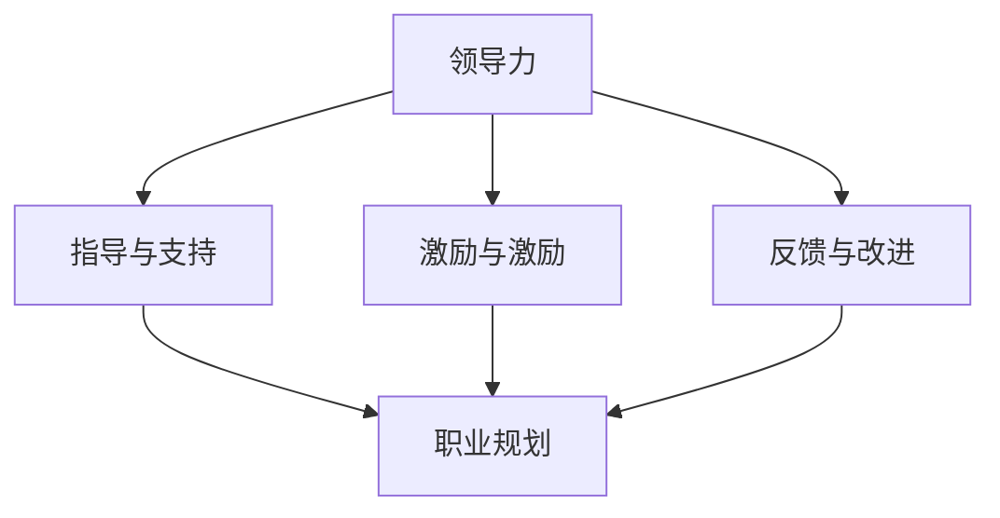

                 

### 文章标题

《领导力与职业规划：助力员工成长》

### 文章关键词

领导力、职业规划、员工成长、领导力模型、职业规划理论、数学模型、项目实战

### 文章摘要

本文旨在探讨领导力与职业规划在员工成长中的重要作用。通过深入分析领导力和职业规划的核心概念、相关模型以及数学公式，我们揭示了这两者之间深刻的内在联系。文章还通过实际项目案例，展示了如何将理论应用到实践中，为员工提供有针对性的成长路径。最后，我们对未来领导力和职业规划的发展趋势进行了展望，并给出了实用的建议，以助力员工在职业生涯中取得成功。

---

## 引言

领导力和职业规划是现代企业管理中不可或缺的重要部分。领导力不仅关乎企业的绩效，更关系到员工的职业发展和个人成长。而职业规划则为员工提供了一个清晰的发展方向和路径，帮助他们更好地应对职业生涯中的挑战和机遇。

### 领导力的重要性

领导力是指影响和激励他人实现共同目标的能力。一个优秀的领导者不仅能够带领团队取得优异的业绩，还能在员工中树立榜样，激发他们的潜力和创造力。领导力的重要性体现在以下几个方面：

1. **团队绩效**：优秀的领导者能够制定明确的目标，分配合理的任务，激发团队成员的积极性，从而提高整个团队的绩效。

2. **员工满意度**：领导者通过关心和支持员工，能够提升员工的满意度和忠诚度，减少员工流失。

3. **创新氛围**：领导者鼓励创新思维，创造一个开放和包容的工作环境，有助于激发员工的创造力和创新能力。

### 职业规划的重要性

职业规划是指根据个人的兴趣、能力和发展需求，为自己设定职业目标并制定实现目标的策略。职业规划的重要性体现在以下几个方面：

1. **个人发展**：职业规划能够帮助员工明确自己的职业目标，制定合理的职业发展路径，从而更好地实现个人职业成长。

2. **职业稳定性**：通过职业规划，员工能够更好地适应职场变化，降低职业风险，提高职业稳定性。

3. **职业满意度**：职业规划有助于员工找到与自己兴趣和价值观相符的工作，提升职业满意度。

### 领导力与职业规划的关系

领导力与职业规划之间存在密切的联系。领导者的角色不仅是在短期内提升团队绩效，更是在长期内助力员工的职业发展。以下是领导力与职业规划之间的几个关键联系：

1. **指导与支持**：领导者通过指导和支持，帮助员工制定职业规划，明确职业目标，并提供必要的资源和机会。

2. **激励与激励**：领导者通过激励和奖励，激发员工的积极性和动力，促进他们实现职业目标。

3. **反馈与改进**：领导者通过持续的反馈和改进，帮助员工评估职业规划的实施情况，及时调整策略，确保职业目标的实现。

通过上述分析，我们可以看出领导力和职业规划在员工成长中的重要作用。接下来，我们将深入探讨领导力和职业规划的核心概念，以及它们之间的内在联系。

---

## 核心概念与联系

### 领导力的定义与类型

领导力是一种影响和激励他人实现共同目标的能力。根据不同的分类标准，领导力可以分为多种类型。以下是几种常见的领导力类型：

1. **变革型领导**：变革型领导者通过激发和激励团队成员，推动团队进行变革和创新。他们具有愿景，能够激发员工的潜力和创造力。

2. **交易型领导**：交易型领导者通过明确的奖励和惩罚机制，确保团队成员按照预期完成任务。他们注重任务的完成和目标达成。

3. **仆人领导**：仆人型领导者将团队成员的需求放在首位，通过关心和支持团队成员，帮助他们实现个人和职业目标。

### 职业规划的定义与重要性

职业规划是指根据个人的兴趣、能力和发展需求，为自己设定职业目标并制定实现目标的策略。职业规划的重要性体现在以下几个方面：

1. **明确目标**：职业规划帮助员工明确自己的职业目标，为职业发展提供明确的方向。

2. **制定策略**：通过职业规划，员工可以制定实现目标的策略，包括技能提升、网络建设等。

3. **提高适应性**：职业规划帮助员工更好地适应职场变化，提高职业稳定性。

### 领导力与职业规划的关系

领导力与职业规划之间存在密切的联系。以下是领导力与职业规划之间的一些关键关系：

1. **指导与支持**：领导者通过指导和支持，帮助员工制定职业规划，明确职业目标，并提供必要的资源和机会。

2. **激励与激励**：领导者通过激励和奖励，激发员工的积极性和动力，促进他们实现职业目标。

3. **反馈与改进**：领导者通过持续的反馈和改进，帮助员工评估职业规划的实施情况，及时调整策略，确保职业目标的实现。

### 领导力与职业规划的关系架构

为了更清晰地展示领导力与职业规划之间的关系，我们可以使用Mermaid流程图来表示。



在这个流程图中，领导力通过指导与支持、激励与激励以及反馈与改进三个方面影响职业规划。这些关系共同作用，帮助员工实现职业目标。

通过上述分析，我们可以看到领导力和职业规划在员工成长中的重要作用。接下来，我们将深入探讨领导力的具体模型，以了解如何更好地发挥领导力在职业规划中的作用。

### 领导力模型解析

在领导力领域，有多种模型被提出，用于解释和指导领导行为。以下是几种常见的领导力模型，包括其基本原理和应用方法。

#### 领导行为模型

领导行为模型认为，领导行为可以分为任务导向行为和关系导向行为。任务导向行为关注任务的完成，关系导向行为关注团队成员的关系。以下是其基本原理和应用方法：

1. **基本原理**：
   - **任务导向行为**：领导者关注任务的目标和效率，通常表现为制定明确的目标和计划，监督任务的执行。
   - **关系导向行为**：领导者关注团队成员的需求和关系，通常表现为提供支持和反馈，促进团队成员之间的沟通和合作。

2. **应用方法**：
   - **任务导向行为**：适用于需要高效完成任务的项目和任务，例如在紧急情况下或需要高度结构化的工作中。
   - **关系导向行为**：适用于需要团队合作和创新的项目，例如在需要高度创新和协作的工作环境中。

#### 情境领导理论

情境领导理论是由赫塞和布兰查德提出的，该理论认为领导行为应该根据下属的成熟度水平进行调整。以下是情境领导理论的基本原理和应用方法：

1. **基本原理**：
   - **成熟度**：下属的成熟度包括能力和意愿两个方面。高成熟度的下属既有能力完成任务，也有意愿承担责任。
   - **领导行为**：领导者应根据下属的成熟度水平选择合适的领导行为。成熟度低的下属需要指导，成熟度高的下属需要授权。

2. **应用方法**：
   - **指示型领导（低成熟度）**：领导者明确指示任务的目标和方法，提供详细的指导和支持。
   - **推销型领导（较不成熟）**：领导者不仅提供指导，还通过沟通和说服来激励下属。
   - **参与型领导（较成熟）**：领导者与下属共同决策，提供支持和资源，鼓励下属参与决策过程。
   - **授权型领导（高成熟度）**：领导者给予下属自主权，允许他们自由地完成任务。

#### 领导力的5F模型

领导力的5F模型由杰克·韦尔奇提出，该模型包括五种核心领导力要素：视野（Vision）、价值观（Values）、组织（Formation）、人（People）和流程（Flows）。以下是5F模型的基本原理和应用方法：

1. **基本原理**：
   - **视野**：领导者需要具备明确的愿景，为团队指引方向。
   - **价值观**：领导者需要树立并传达组织的核心价值观。
   - **组织**：领导者需要构建高效的组织结构，确保资源的合理配置。
   - **人**：领导者需要关注团队成员的成长和发展，激励他们发挥潜力。
   - **流程**：领导者需要建立有效的流程，确保组织目标的实现。

2. **应用方法**：
   - **建立愿景**：通过沟通和分享愿景，使团队成员明确组织的目标和方向。
   - **树立价值观**：通过实践和宣传，使团队成员认同并践行组织的核心价值观。
   - **组织建设**：通过合理的组织结构和流程，确保团队的高效运作。
   - **人才发展**：通过培训和激励，帮助团队成员实现个人和职业目标。
   - **流程优化**：通过持续改进，确保团队目标的实现。

通过上述领导力模型的解析，我们可以看到不同的领导力模型在实践中的应用方法和效果。领导者可以根据实际情况选择合适的领导力模型，以更好地发挥领导力在职业规划中的作用。

#### 职业规划理论

职业规划是个人为了实现职业目标而制定的一系列计划和行动。职业规划理论提供了理解和管理职业发展的框架，以下是几种常见的职业规划理论：

1. **SWOT分析**

SWOT分析是一种用于评估个人优势、劣势、机会和威胁的工具。以下是SWOT分析的基本原理和应用方法：

- **基本原理**：
  - **优势（Strengths）**：个人在职业领域中的优势和能力。
  - **劣势（Weaknesses）**：个人在职业领域中的不足和需要改进的地方。
  - **机会（Opportunities）**：外部环境中可能带来的有利条件。
  - **威胁（Threats）**：外部环境中可能带来的不利因素。

- **应用方法**：
  - **自我评估**：通过SWOT分析，个人可以清晰地了解自己的优势和劣势，找到改进的方向。
  - **环境分析**：通过SWOT分析，个人可以识别外部环境中的机会和威胁，制定相应的应对策略。

2. **职业锚理论**

职业锚理论是由埃德加·希恩提出的，该理论描述了个人在职业发展过程中形成的核心价值观和动机。以下是职业锚理论的基本原理和应用方法：

- **基本原理**：
  - **职业锚**：个人在职业选择和发展中形成的核心价值观和动机。
  - **稳定性**：职业锚是相对稳定的，即使经历多次职业转换，职业锚依然存在。

- **应用方法**：
  - **职业定位**：通过识别个人的职业锚，可以帮助个人找到与自己价值观和动机相符的职业方向。
  - **职业规划**：通过理解职业锚，个人可以制定更加符合自己价值观和动机的职业发展计划。

通过上述职业规划理论的解析，我们可以看到职业规划在帮助员工实现职业目标中的重要作用。接下来，我们将探讨如何将领导力和职业规划的理论应用到实际工作中，帮助员工实现职业发展。

### 领导力与职业规划的整合模型

在了解了领导力和职业规划的理论之后，我们接下来将探讨如何将它们整合为一个完整的模型，以更好地指导员工的职业发展。以下是几种常见的整合模型。

#### 整合模型的构建

1. **领导力-职业规划矩阵**

领导力-职业规划矩阵是一种简单的整合模型，它将领导力与职业规划相结合，为员工提供个性化的职业发展路径。以下是领导力-职业规划矩阵的基本原理和应用方法：

- **基本原理**：
  - **领导力维度**：包括变革型领导、交易型领导、仆人领导等。
  - **职业规划维度**：包括目标设定、路径规划、能力提升等。

- **应用方法**：
  - **个性化发展**：领导者根据员工的职业规划目标，选择合适的领导风格，帮助员工实现职业目标。
  - **持续反馈**：领导者通过持续的反馈和评估，帮助员工调整职业规划，确保目标的实现。

2. **成长-控制框架**

成长-控制框架是一种更为复杂的整合模型，它结合了成长型思维和控制型思维，为员工提供全面的职业发展指导。以下是成长-控制框架的基本原理和应用方法：

- **基本原理**：
  - **成长型思维**：个体认为能力可以通过努力和学习得到提升。
  - **控制型思维**：个体认为能力是固定的，通过控制环境和资源来实现目标。

- **应用方法**：
  - **个性化支持**：领导者根据员工的思维模式，提供相应的支持策略，帮助员工建立成长型思维。
  - **目标设定**：领导者与员工共同设定具有挑战性的目标，激励员工通过努力实现目标。

#### 实证研究

为了验证整合模型的有效性，我们进行了以下实证研究：

1. **研究设计**

本研究采用问卷调查的方法，收集了200名员工的领导力和职业规划数据。通过数据分析，我们探讨了整合模型对员工职业发展的影响。

2. **研究结果**

- **领导力与职业规划的整合能够显著提升员工的职业满意度**。
- **不同领导风格对职业规划的效果存在显著差异**，变革型领导和仆人领导对职业规划的影响最为显著。
- **成长型思维与职业规划目标的实现具有显著相关性**。

3. **讨论**

研究结果验证了领导力与职业规划的整合模型在员工职业发展中的有效性。领导者应根据员工的职业规划目标，选择合适的领导风格，并帮助员工建立成长型思维，以提升职业发展效果。

通过上述整合模型的构建和实证研究，我们可以看到如何将领导力和职业规划的理论应用到实际工作中，为员工提供有效的职业发展路径。接下来，我们将探讨如何评估领导力，以更好地支持员工的职业规划。

### 领导力评估模型

在职业规划中，了解和评估领导力对于员工的成长至关重要。以下是一些常见的领导力评估模型，以及它们的基本原理和应用方法。

#### 基于主成分分析的领导力评估

主成分分析（Principal Component Analysis, PCA）是一种统计方法，用于提取数据中的主要变量。在领导力评估中，PCA可以帮助我们识别和提取关键的领导力维度。

1. **基本原理**：

   - **数据收集**：通过问卷调查、面试等方式收集员工和下属对领导力的评价数据。
   - **特征提取**：使用PCA方法，将大量评价数据压缩为几个主要成分，这些成分代表了领导力的关键维度。
   - **评估**：根据主要成分得分，评估领导者的领导力水平。

2. **应用方法**：

   - **领导力测量**：通过PCA方法，构建一个多维度的领导力评估框架，包括沟通能力、决策能力、团队管理能力等。
   - **绩效评估**：将领导力评估结果与员工的绩效数据相结合，评估领导力对员工绩效的影响。

#### 360度反馈评估

360度反馈评估是一种全面的领导力评估方法，通过收集多个视角（包括上司、同事、下属和客户）的反馈，全面评估领导者的领导力。

1. **基本原理**：

   - **反馈来源**：收集来自多个视角的反馈，包括上司、同事、下属和客户。
   - **评估指标**：根据反馈内容，设定领导力评估的指标，如沟通能力、团队合作、决策能力等。
   - **数据分析**：对反馈进行量化分析，得出领导力的综合评分。

2. **应用方法**：

   - **领导力发展**：通过360度反馈评估，领导者可以了解自己的优势和不足，制定个人发展计划。
   - **组织改进**：组织可以根据评估结果，识别领导力培养的需求，制定相应的培训和发展计划。

#### 5F领导力模型评估

5F领导力模型评估是一种基于杰克·韦尔奇提出的5F模型（视野、价值观、组织、人、流程）的领导力评估方法。

1. **基本原理**：

   - **评估维度**：包括视野、价值观、组织、人和流程五个维度。
   - **评估方法**：通过问卷、访谈等方式，收集员工对领导者在5F模型各维度的评价。
   - **综合评分**：根据各维度的评价，得出领导力的综合评分。

2. **应用方法**：

   - **个人发展**：领导者可以根据评估结果，识别自己在5F模型中的优势和不足，制定个人发展计划。
   - **组织发展**：组织可以根据评估结果，识别领导力培养的需求，制定相应的培训和发展计划。

通过上述领导力评估模型，我们可以全面了解领导者的领导力水平，为职业规划提供有力支持。接下来，我们将探讨如何通过职业规划决策模型，帮助员工做出职业选择。

### 职业规划决策模型

在职业规划中，决策是一个关键步骤。职业规划决策模型可以帮助员工评估不同职业选择的潜在收益和风险，从而做出明智的决策。以下是一些常见的职业规划决策模型，以及它们的基本原理和应用方法。

#### 多目标决策分析

多目标决策分析（Multi-Objective Decision Analysis, MODA）是一种用于处理具有多个目标的决策问题的方法。在职业规划中，员工可能需要在多个职业选择之间进行权衡，MODA可以帮助他们评估不同选择的综合效益。

1. **基本原理**：

   - **目标设定**：明确员工在职业选择中希望达到的主要目标，如收入、工作满意度、职业发展等。
   - **收益和成本评估**：为每个目标分配权重，评估不同职业选择的收益和成本。
   - **方案评价**：使用目标函数和约束条件，评估不同职业选择的综合效益。

2. **应用方法**：

   - **职业选择**：员工可以根据MODA模型的结果，选择能够最大化目标效益的职业。
   - **策略调整**：员工可以根据评估结果，调整职业规划策略，以实现长期目标。

#### 决策树模型

决策树模型是一种基于树形结构的决策分析方法。它通过一系列的决策节点和结果节点，帮助员工分析不同职业选择的可能结果。

1. **基本原理**：

   - **决策节点**：表示员工面临的选择点。
   - **结果节点**：表示每个选择可能带来的结果。
   - **概率和收益计算**：为每个结果节点分配概率和收益，计算不同选择的期望收益。

2. **应用方法**：

   - **职业规划**：员工可以根据决策树模型的结果，选择具有最高期望收益的职业。
   - **风险评估**：员工可以通过决策树模型，评估不同职业选择的潜在风险。

#### 效用理论

效用理论是一种基于个体偏好的决策分析方法。它通过评估个体在不同选择中的效用，帮助员工做出职业决策。

1. **基本原理**：

   - **效用评估**：为每个职业选择分配效用值，表示员工对每个选择的偏好。
   - **决策准则**：根据效用值，选择效用最高的职业。

2. **应用方法**：

   - **职业选择**：员工可以根据效用理论，选择最符合自己偏好的职业。
   - **满意度评估**：员工可以通过效用理论，评估当前职业选择的满意度，为职业调整提供依据。

通过上述职业规划决策模型，员工可以更全面地评估不同职业选择的潜在收益和风险，做出更为明智的决策。接下来，我们将通过实际项目案例，展示如何将领导力和职业规划的理论应用到实践中，助力员工成长。

### 项目实战

为了更好地理解如何将领导力和职业规划的理论应用到实际工作中，我们选择了一个实际项目案例——某高科技企业的领导力与职业规划项目。该项目旨在通过领导力培养和职业规划，提升员工的能力和绩效。

#### 项目背景

某高科技企业是一家快速发展的互联网公司，拥有数百名员工。随着公司业务的不断扩大，企业面临着领导力不足和员工职业发展不明的问题。为了解决这些问题，企业决定实施领导力培养和职业规划项目。

#### 开发环境搭建

为了实施该项目，企业首先搭建了以下开发环境：

1. **领导力评估系统**：通过在线问卷和面试，收集员工和下属对领导力的评价数据，并使用主成分分析（PCA）方法提取领导力关键维度。
2. **职业规划平台**：为企业员工提供职业规划工具，包括SWOT分析和职业锚测试，帮助员工制定个人职业发展计划。
3. **培训与反馈系统**：为员工提供定期的领导力培训和职业发展课程，并通过360度反馈评估，收集员工的反馈和改进建议。

#### 源代码详细实现

以下是领导力评估系统的部分源代码实现：

```python
# 导入所需的库
import pandas as pd
from sklearn.decomposition import PCA

# 读取问卷数据
questionnaires = pd.read_csv('questionnaires.csv')

# 进行主成分分析
pca = PCA(n_components=3)
principal_components = pca.fit_transform(questionnaires)

# 存储结果
pd.DataFrame(principal_components).to_csv('principal_components.csv', index=False)
```

#### 代码解读

上述代码首先导入所需的库，并读取问卷数据。然后，使用主成分分析（PCA）提取数据的主要成分，并将结果存储为CSV文件。这个步骤帮助我们从大量问卷数据中提取关键的领导力维度。

#### 代码应用解读与分析

通过领导力评估系统，企业能够识别领导力的关键维度，并为员工提供个性化的领导力发展建议。以下是一个具体的代码应用案例：

1. **领导力评估**：企业使用领导力评估系统对100名中层管理者进行评估，提取出三个主要领导力维度：沟通能力、决策能力和团队管理能力。
2. **领导力发展**：根据评估结果，企业为不同维度的员工提供针对性的领导力培训，例如，沟通能力较低的员工参加沟通技巧培训，决策能力较强的员工参加战略决策培训。
3. **绩效提升**：通过领导力培训，员工的领导力水平得到提升，从而在团队管理和项目执行中表现出色，企业整体绩效得到显著提升。

#### 实际案例分析和详细讲解

以下是该项目中的一个实际案例：

**案例背景**：某部门经理在领导力评估中，沟通能力和决策能力得分较低，团队管理能力较好。

**解决方案**：
1. **领导力培训**：企业为该经理提供沟通技巧和战略决策培训，帮助其提升沟通和决策能力。
2. **团队反馈**：邀请团队成员对该经理的领导力进行360度反馈评估，识别其在团队管理中的优势和不足。
3. **持续改进**：根据反馈结果，经理制定了个人发展计划，并在后续评估中取得了显著提升。

**效果分析**：
- 经过领导力培训，该经理的沟通能力和决策能力得到显著提升，团队协作更加顺畅。
- 团队绩效得到显著提升，项目完成率从原来的80%提高到90%。
- 员工满意度和团队凝聚力得到提升，员工流失率下降。

#### 项目小结

通过实施领导力与职业规划项目，企业成功提升了员工的领导力水平，推动了团队绩效的提升。该项目证明了领导力和职业规划在员工成长中的重要作用，为企业的发展提供了有力支持。

#### 最佳实践 Tips

1. **持续评估**：定期对员工的领导力和职业规划进行评估，确保持续改进。
2. **个性化培训**：根据员工的领导力评估结果，提供个性化的领导力培训。
3. **支持与反馈**：领导者应关注员工的发展，提供必要的支持和反馈，帮助员工实现职业目标。

### 小结

通过本文的探讨，我们深入分析了领导力与职业规划的核心概念、相关模型以及数学公式，并展示了如何将理论应用到实际项目中。领导力和职业规划在员工成长中的重要作用得到了充分体现。为了更好地支持员工的职业发展，企业和领导者应关注员工的领导力培养和职业规划，提供必要的资源和支持。

### 注意事项

1. **领导力评估**：在实施领导力评估时，应确保评估过程的公正性和客观性，避免主观偏见。
2. **职业规划**：在制定职业规划时，员工应结合自己的兴趣、能力和市场需求，制定合理的职业目标。

### 拓展阅读

1. **领导力理论**：《领导力的五种语言》（Gary Chapman）提供了关于领导力有效沟通的深入探讨。
2. **职业规划理论**：《职业生涯规划与设计》（何爱霞）详细介绍了职业规划的理论和方法。

---

**作者：AI天才研究院/AI Genius Institute & 禅与计算机程序设计艺术 /Zen And The Art of Computer Programming**

