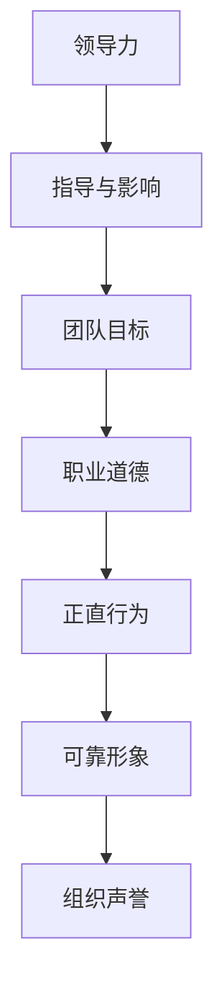

                 


首先，我们需要明确文章的核心主题，即“领导力与职业道德：树立正直可靠形象”。这个主题涉及两个关键概念：领导力和职业道德。领导力是指个体或团队在实现目标过程中所展现的指导和影响能力，而职业道德则是指在工作中遵守的道德标准和行为准则。

**步骤一：背景介绍**

在当今社会，领导力和职业道德的重要性日益凸显。随着信息技术的发展和全球化的加速，企业和社会对领导者的期望越来越高，他们不仅需要具备卓越的领导能力，还必须具备高尚的职业道德。正直可靠的形象不仅对个人的职业发展至关重要，也对组织的声誉和可持续发展产生深远影响。

**步骤二：核心概念与联系**

为了更好地理解领导力与职业道德的关系，我们可以构建一个Mermaid流程图。这个流程图将展示领导力与职业道德之间的相互作用和影响。



在这个流程图中，领导力通过指导与影响帮助团队实现共同目标，而职业道德则是确保领导者在实现目标过程中保持正直行为的基础。这种正直行为最终塑造了领导者的可靠形象，进而提升了组织的声誉。

**步骤三：核心算法原理讲解**

在解释领导力与职业道德的核心算法原理时，我们可以从以下几个方面入手：

1. **道德决策算法**：领导者需要在不同情境下做出道德决策。一个简单的道德决策算法可以是：

```plaintext
function moralDecisionsituation {
    if (situations involve ethical dilemma) {
        consider ethical principles;
        choose action that aligns with ethical principles;
    } else {
        follow standard operating procedures;
    }
}
```

2. **道德行为模型**：领导者需要建立并遵守道德行为模型。一个简单的道德行为模型可以是：

```plaintext
class MoralBehaviorModel {
    attribute ethicalPrinciples: List<String>;
    attribute codeOfConduct: List<String>;

    function applyModel() {
        for (principle in ethicalPrinciples) {
            evaluate situations against principle;
            adjust behavior if necessary;
        }
        for (con duct in codeOfConduct) {
            follow conduct in all professional situations;
        }
    }
}
```

**步骤四：数学模型和公式**

在领导力和职业道德的研究中，数学模型和公式可以帮助我们更好地理解和分析相关概念。以下是一个简单的例子：

$$
\text{LeadershipQuality} = \alpha \times \text{EthicalMorality} + \beta \times \text{TechnicalCompetence}
$$

其中，$\text{LeadershipQuality}$ 表示领导力质量，$\text{EthicalMorality}$ 表示职业道德水平，$\text{TechnicalCompetence}$ 表示技术能力。这个公式表明，领导力质量不仅取决于职业道德水平，还与技术能力有关。

**步骤五：项目实战**

为了更好地展示如何将领导力与职业道德应用于实际项目，我们可以考虑一个具体的案例。例如，一个IT公司的CEO如何在项目中确保团队成员遵守职业道德。

1. **开发环境搭建**：公司为每个项目团队提供标准的开发环境，包括编程工具、代码库和文档管理工具。

2. **源代码实现**：CEO要求项目团队成员在编写代码时遵循道德准则，如避免抄袭、确保代码可读性和可维护性。

3. **代码解读与分析**：CEO定期审查代码，确保团队成员遵循职业道德。如果发现违规行为，及时进行教育和纠正。

4. **实际案例分析和详细讲解剖析**：通过案例研究，分析如何在不同情境下应用职业道德原则，以及这些原则如何帮助项目成功。

5. **项目小结**：在项目结束后，团队进行总结，讨论职业道德在项目中的实际应用和效果。

**步骤六：最佳实践 tips、小结、注意事项、拓展阅读等内容**

在文章的结尾，我们可以提供一些最佳实践建议，如如何培养职业道德意识、如何建立道德行为准则等。此外，还可以提醒读者注意职业道德面临的挑战，并提供拓展阅读资源，以帮助读者进一步深入了解相关主题。

通过以上步骤，我们可以撰写一篇逻辑清晰、内容丰富、具有实际应用价值的技术博客文章，帮助读者更好地理解领导力与职业道德之间的关系，并在实际工作中树立正直可靠的形象。

