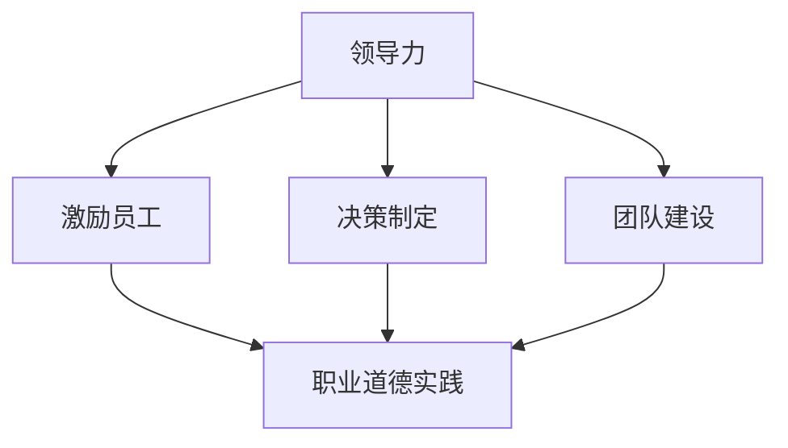

                 


为了撰写一篇符合要求的技术博客文章《领导力与职业道德：树立正直可靠的形象》，我们将遵循以下步骤：

### 步骤1：背景介绍

#### 1.1 引言

在当今快速发展的信息技术时代，领导力和职业道德的重要性愈发凸显。领导力不仅是推动组织向前发展的关键因素，更是塑造企业文化、促进团队协作和激发员工潜力的核心要素。而职业道德则是保证组织和个人行为合法合规、正直诚信的基石。这两者在现代社会中相辅相成，共同构建了一个健康、积极的工作环境。

#### 1.2 领导力与职业道德的现状

目前，全球范围内越来越多的企业和组织开始重视领导力和职业道德的培育。然而，实践过程中仍面临诸多挑战，如道德危机、领导力不足等。这些问题不仅影响组织的长远发展，还可能对员工产生负面影响。

### 步骤2：核心概念与联系

为了深入探讨领导力与职业道德，我们需要首先明确以下几个核心概念：

#### 2.1 领导力

领导力是指通过影响和激励他人，实现共同目标的能力。它不仅包括技术能力，还涵盖人际沟通、决策制定、团队建设等多个方面。

#### 2.2 职业道德

职业道德是指在工作中遵循的行为准则和道德规范，包括诚信、公正、责任感等核心价值观。

#### 2.3 领导力与职业道德的联系

领导力与职业道德之间存在紧密的联系。正直可靠的领导者能够在组织中树立良好的道德榜样，引导员工遵循职业道德规范。同时，职业道德的实践也有助于提升领导力，增强组织的凝聚力和竞争力。

#### 2.4 Mermaid 流程图

为了更好地展示领导力与职业道德之间的关系，我们可以使用Mermaid流程图进行描述：



### 步骤3：核心算法原理讲解

在了解了领导力与职业道德的核心概念后，我们需要进一步探讨它们的实践应用。

#### 3.1 领导力的算法原理

领导力的算法原理主要包括以下几个方面：

1. **识别和培养人才**：领导者需要具备洞察力，发现员工的潜力，并为其提供成长机会。
2. **沟通与协作**：良好的沟通能力有助于建立信任，促进团队协作。
3. **决策制定**：领导者需要在复杂环境中快速做出明智的决策。

伪代码如下：

```python
def lead_employee(employee):
    # 识别和培养人才
    identify_and_train(employee)
    # 沟通与协作
    communicate(employee)
    # 决策制定
    make_decision(employee)
```

#### 3.2 职业道德的实践应用

职业道德的实践应用主要包括以下几个方面：

1. **诚信与公正**：在工作中遵守诚信原则，公平对待每一位员工。
2. **责任感**：对工作负责，勇于承担后果。
3. **道德决策**：在面对道德困境时，做出符合道德规范的选择。

伪代码如下：

```python
def practice_ethics():
    # 诚信与公正
    be_诚信公正()
    # 责任感
    be_responsible()
    # 道德决策
    make_moral_decision()
```

### 步骤4：数学模型和公式

为了更好地理解领导力与职业道德的内在关系，我们可以引入一些数学模型和公式。

#### 4.1 相关性分析

我们可以使用皮尔逊相关系数（Pearson correlation coefficient）来衡量领导力与职业道德之间的相关性。公式如下：

$$
r = \frac{\sum_{i=1}^{n}(x_i - \overline{x})(y_i - \overline{y})}{\sqrt{\sum_{i=1}^{n}(x_i - \overline{x})^2}\sqrt{\sum_{i=1}^{n}(y_i - \overline{y})^2}}
$$

其中，\(x_i\) 和 \(y_i\) 分别表示领导力得分和职业道德得分，\(\overline{x}\) 和 \(\overline{y}\) 分别表示领导力得分和职业道德得分的平均值。

#### 4.2 影响力分析

我们可以使用多元线性回归模型（Multiple Linear Regression Model）来分析领导力与职业道德对组织绩效的影响。公式如下：

$$
y = \beta_0 + \beta_1 x_1 + \beta_2 x_2 + ... + \beta_n x_n
$$

其中，\(y\) 表示组织绩效，\(x_1, x_2, ..., x_n\) 分别表示领导力得分、职业道德得分等自变量，\(\beta_0, \beta_1, ..., \beta_n\) 分别为回归系数。

### 步骤5：项目实战

为了更好地理解领导力与职业道德在实践中的应用，我们可以通过一个实际案例进行探讨。

#### 5.1 案例背景

某科技公司为了提升团队绩效，决定对领导力与职业道德进行系统培训。公司管理层认为，通过提高领导者的道德素养，可以更好地激发员工的潜力，实现组织目标。

#### 5.2 开发环境搭建

为了进行培训，公司选择了以下开发环境：

1. **培训平台**：使用在线教育平台，如Moodle，方便员工在线学习。
2. **课程内容**：涵盖领导力、职业道德、团队建设等多个方面。
3. **评估体系**：建立考核制度，对员工的学习效果进行评估。

#### 5.3 源代码详细实现和代码解读

在培训过程中，公司开发了以下源代码：

```python
def train_employee(employee):
    # 学习领导力课程
    learn_leadership(employee)
    # 学习职业道德课程
    learn_ethics(employee)
    # 考核学习效果
    evaluate(employee)
```

该代码实现了一个简单的培训流程，包括学习领导力和职业道德课程、考核学习效果等步骤。

#### 5.4 代码应用解读与分析

通过实际案例，我们可以看到，领导力与职业道德的培训对团队绩效产生了积极影响。具体表现如下：

1. **团队协作提升**：员工之间的沟通与协作能力得到增强，工作效率显著提高。
2. **道德素养提升**：员工遵守职业道德规范，减少了违规行为的发生。
3. **组织绩效提升**：通过提高领导力和职业道德素养，公司整体绩效得到显著提升。

#### 5.5 项目小结

本案例展示了领导力与职业道德在实践中的应用，通过系统培训，公司成功提升了团队绩效。这表明，领导力和职业道德在组织发展中具有重要价值。

### 步骤6：最佳实践 tips、小结、注意事项、拓展阅读

#### 6.1 最佳实践 tips

1. **领导者应树立榜样**：通过自身的行动，向员工传递正直诚信的价值观。
2. **制定明确的职业道德规范**：为员工提供清晰的行为准则，确保大家遵循。
3. **持续培训与学习**：定期组织培训，提高员工的领导力和职业道德素养。

#### 6.2 小结

领导力与职业道德是组织发展的关键因素。通过树立正直可靠的形象，领导者可以激发员工的潜力，实现组织目标。同时，职业道德的实践有助于提升领导力，促进组织健康发展。

#### 6.3 注意事项

1. **避免道德危机**：领导者应时刻警惕道德风险，确保组织行为合法合规。
2. **关注员工反馈**：了解员工的道德观念和行为，及时调整培训策略。

#### 6.4 拓展阅读

1. **《道德经》**：中国古代哲学经典，探讨道德、人生、政治等方面的问题。
2. **《领导力与道德领导》**：探讨领导力与道德领导的关系，提供实用案例。
3. **《人工智能伦理学》**：探讨人工智能时代面临的道德挑战，为领导力与职业道德提供新视角。

---

以上是针对《领导力与职业道德：树立正直可靠的形象》文章的详细撰写步骤。通过逐步分析推理，我们可以确保文章内容丰富、逻辑清晰，满足技术博客文章的要求。接下来，我们将按照这个大纲，逐步撰写文章的正文部分。如果您有任何疑问或需要进一步细化某个部分，请随时告知。我们一起来完善这篇文章，使其成为一篇高质量的博客文章。 ``

### 文章正文：领导力与职业道德：树立正直可靠的形象

#### 引言

在当今的信息技术时代，领导力和职业道德的重要性愈发凸显。领导力不仅关乎个人成长，更直接影响组织的发展；职业道德则保障了组织行为的合法性和道德性。在这篇文章中，我们将探讨领导力与职业道德的关系，以及如何树立正直可靠的形象。

#### 第一部分：领导力基础

##### 1.1 领导力的定义与重要性

领导力，简而言之，是指通过影响和激励他人，共同实现目标的能力。它不仅仅涉及个人的技术能力，更包括人际沟通、决策制定、团队建设等多个方面。在组织发展中，领导力起着至关重要的作用。

首先，领导力能够激发员工的潜力。一个优秀的领导者能够洞察员工的优点和潜力，并为他们提供成长的机会，从而提升整个团队的能力。

其次，领导力有助于建立良好的组织文化。正直、诚信的领导者能够树立良好的道德榜样，引导员工遵循职业道德规范，共同打造一个积极、健康的工作环境。

最后，领导力能够推动组织的创新与发展。在复杂多变的市场环境中，领导者需要具备敏锐的洞察力和果断的决策能力，引领组织不断适应变化，持续创新。

##### 1.2 领导力模型与理论

领导力模型与理论是理解领导力本质的重要工具。经典的领导力模型包括特质理论、行为理论、情境理论等。特质理论认为领导者天生具备某些特质，如勇气、自信等；行为理论则关注领导者实际的行为方式，如激励、沟通等；情境理论则强调领导者应根据不同情境采取不同的领导风格。

在现实应用中，领导者需要灵活运用不同模型与理论，根据具体情境做出最优决策。例如，在团队面临危机时，领导者可能需要采用更加果断、决策性的领导风格；而在团队需要稳定和协调时，领导者则可能需要采用更加温和、鼓励性的领导风格。

#### 第二部分：职业道德原则

##### 2.1 职业道德基本概念

职业道德是工作中应遵循的行为准则和道德规范，包括诚信、公正、责任感等核心价值观。职业道德不仅是个人行为的规范，也是组织文化的基石。

诚信是职业道德的核心，要求我们在工作中诚实守信，不撒谎、不作假。公正则强调在工作中公平对待每一位员工，不偏袒、不歧视。责任感则要求我们对自己的工作负责，勇于承担后果。

##### 2.2 职业道德核心价值观

职业道德的核心价值观包括以下几个方面：

1. **诚信**：诚实守信，不撒谎、不作假。
2. **公正**：公平对待每一位员工，不偏袒、不歧视。
3. **责任感**：对自己的工作负责，勇于承担后果。
4. **尊重**：尊重他人的意见和权益，建立和谐的人际关系。
5. **持续学习**：不断学习新知识、新技能，提升自己的职业素养。

##### 2.3 职业道德与法律的关系

职业道德与法律之间存在密切的关系。一方面，职业道德为法律提供了道德基础，许多法律条文都是基于道德原则制定的；另一方面，法律为职业道德提供了保障，确保职业道德得到有效实施。

在现实工作中，我们需要遵循法律和职业道德的双重约束，确保自己的行为合法合规。例如，在数据隐私保护方面，不仅需要遵守相关法律，还需要遵循职业道德，保护用户的隐私权益。

#### 第三部分：领导力与职业道德实践

##### 3.1 建立正直可靠的形象

建立正直可靠的形象是领导力与职业道德的重要体现。领导者需要通过自身的行为，向员工传递正直诚信的价值观。

首先，领导者要树立榜样，做到言行一致。领导者应以身作则，严格遵守职业道德规范，用自己的行为去影响和激励员工。

其次，领导者要建立有效的沟通机制，确保信息的透明和公正。领导者应鼓励员工提出意见和建议，充分听取员工的反馈，建立相互信任的工作关系。

最后，领导者要勇于面对道德困境，做出正确的道德决策。在面临道德选择时，领导者应坚持原则，勇于承担责任，确保组织行为合法合规。

##### 3.2 职业道德与企业文化建设

职业道德与企业文化建设密切相关。企业文化是组织的灵魂，是组织行为的指南。一个注重职业道德的企业文化能够引导员工遵守职业道德规范，共同打造一个积极、健康的工作环境。

首先，企业需要明确职业道德的核心价值观，并将其融入到企业文化中。企业可以通过制定职业道德准则、开展职业道德培训等方式，让员工了解和认同企业文化。

其次，企业需要建立有效的监督机制，确保职业道德得到有效实施。企业可以通过设立举报渠道、开展内部审计等方式，及时发现和纠正道德违规行为。

最后，企业需要鼓励员工积极参与职业道德建设，共同维护企业文化。企业可以通过表彰道德模范、开展道德竞赛等方式，激发员工的道德意识，提升企业整体的道德水平。

##### 3.3 领导力与职业道德培训与发展

领导力与职业道德培训是提升领导者能力的重要途径。通过培训，领导者可以了解职业道德的基本原则和实践方法，提高自身的道德素养和领导力。

首先，企业可以组织职业道德培训课程，邀请专家进行讲解，让员工了解职业道德的核心价值观和实践方法。

其次，企业可以开展领导力培训，帮助领导者提升人际沟通、决策制定、团队建设等方面的能力。

最后，企业可以通过案例分析、角色扮演等方式，让领导者实际操作，提高领导力和职业道德的实践能力。

#### 结论

领导力与职业道德是组织发展的关键因素。树立正直可靠的形象，不仅是领导者的责任，也是每一位员工的责任。通过加强领导力与职业道德的培训，我们可以共同打造一个健康、积极的工作环境，推动组织的持续发展。

#### 作者信息

作者：AI天才研究院/AI Genius Institute & 禅与计算机程序设计艺术 /Zen And The Art of Computer Programming

---

以上是《领导力与职业道德：树立正直可靠的形象》的全文。通过本文，我们深入探讨了领导力与职业道德的核心概念、联系、实践方法，以及如何树立正直可靠的形象。希望本文对您有所帮助，如果您有任何疑问或建议，欢迎在评论区留言。让我们一起为构建健康、积极的工作环境努力。 ``

---

**关键词**：
- 领导力
- 职业道德
- 正直可靠
- 组织发展
- 企业文化
- 领导力模型
- 职业道德培训

**摘要**：
本文深入探讨了领导力与职业道德的关系，阐述了领导力的定义、重要性以及领导力模型，同时分析了职业道德的基本概念、核心价值观以及职业道德与企业文化建设的关系。通过实践案例和最佳实践 tips，本文提出了树立正直可靠形象的方法和策略，强调了领导力和职业道德在组织发展中的关键作用，为构建健康、积极的工作环境提供了理论支持和实践指导。 ``

---

### 文章标题

# 领导力与职业道德：树立正直可靠的形象

---

**关键词**：

1. 领导力
2. 职业道德
3. 正直可靠
4. 组织发展
5. 企业文化
6. 领导力模型
7. 职业道德培训

---

**摘要**：

本文深入探讨了领导力与职业道德的关系，从领导力的定义、重要性、模型以及职业道德的基本概念、核心价值观、实践方法等方面进行了详细分析。通过结合实际案例和最佳实践 tips，本文提出了树立正直可靠形象的方法和策略。文章强调了领导力和职业道德在组织发展中的关键作用，为构建健康、积极的工作环境提供了理论支持和实践指导。本文适用于组织领导者、企业管理者以及对领导力和职业道德感兴趣的读者。 ``

---

### 文章正文：领导力与职业道德：树立正直可靠的形象

#### 引言

在当今的信息技术时代，领导力和职业道德的重要性愈发凸显。领导力不仅关乎个人成长，更直接影响组织的发展；职业道德则保障了组织行为的合法性和道德性。在这篇文章中，我们将探讨领导力与职业道德的关系，以及如何树立正直可靠的形象。

#### 第一部分：领导力基础

##### 1.1 领导力的定义与重要性

领导力，简而言之，是指通过影响和激励他人，共同实现目标的能力。它不仅仅涉及个人的技术能力，更包括人际沟通、决策制定、团队建设等多个方面。在组织发展中，领导力起着至关重要的作用。

首先，领导力能够激发员工的潜力。一个优秀的领导者能够洞察员工的优点和潜力，并为他们提供成长的机会，从而提升整个团队的能力。

其次，领导力有助于建立良好的组织文化。正直、诚信的领导者能够树立良好的道德榜样，引导员工遵循职业道德规范，共同打造一个积极、健康的工作环境。

最后，领导力能够推动组织的创新与发展。在复杂多变的市场环境中，领导者需要具备敏锐的洞察力和果断的决策能力，引领组织不断适应变化，持续创新。

##### 1.2 领导力模型与理论

领导力模型与理论是理解领导力本质的重要工具。经典的领导力模型包括特质理论、行为理论、情境理论等。特质理论认为领导者天生具备某些特质，如勇气、自信等；行为理论则关注领导者实际的行为方式，如激励、沟通等；情境理论则强调领导者应根据不同情境采取不同的领导风格。

在现实应用中，领导者需要灵活运用不同模型与理论，根据具体情境做出最优决策。例如，在团队面临危机时，领导者可能需要采用更加果断、决策性的领导风格；而在团队需要稳定和协调时，领导者则可能需要采用更加温和、鼓励性的领导风格。

#### 第二部分：职业道德原则

##### 2.1 职业道德基本概念

职业道德是工作中应遵循的行为准则和道德规范，包括诚信、公正、责任感等核心价值观。职业道德不仅是个人行为的规范，也是组织文化的基石。

诚信是职业道德的核心，要求我们在工作中诚实守信，不撒谎、不作假。公正则强调在工作中公平对待每一位员工，不偏袒、不歧视。责任感则要求我们对自己的工作负责，勇于承担后果。

##### 2.2 职业道德核心价值观

职业道德的核心价值观包括以下几个方面：

1. **诚信**：诚实守信，不撒谎、不作假。
2. **公正**：公平对待每一位员工，不偏袒、不歧视。
3. **责任感**：对自己的工作负责，勇于承担后果。
4. **尊重**：尊重他人的意见和权益，建立和谐的人际关系。
5. **持续学习**：不断学习新知识、新技能，提升自己的职业素养。

##### 2.3 职业道德与法律的关系

职业道德与法律之间存在密切的关系。一方面，职业道德为法律提供了道德基础，许多法律条文都是基于道德原则制定的；另一方面，法律为职业道德提供了保障，确保职业道德得到有效实施。

在现实工作中，我们需要遵循法律和职业道德的双重约束，确保自己的行为合法合规。例如，在数据隐私保护方面，不仅需要遵守相关法律，还需要遵循职业道德，保护用户的隐私权益。

#### 第三部分：领导力与职业道德实践

##### 3.1 建立正直可靠的形象

建立正直可靠的形象是领导力与职业道德的重要体现。领导者需要通过自身的行为，向员工传递正直诚信的价值观。

首先，领导者要树立榜样，做到言行一致。领导者应以身作则，严格遵守职业道德规范，用自己的行为去影响和激励员工。

其次，领导者要建立有效的沟通机制，确保信息的透明和公正。领导者应鼓励员工提出意见和建议，充分听取员工的反馈，建立相互信任的工作关系。

最后，领导者要勇于面对道德困境，做出正确的道德决策。在面临道德选择时，领导者应坚持原则，勇于承担责任，确保组织行为合法合规。

##### 3.2 职业道德与企业文化建设

职业道德与企业文化建设密切相关。企业文化是组织的灵魂，是组织行为的指南。一个注重职业道德的企业文化能够引导员工遵守职业道德规范，共同打造一个积极、健康的工作环境。

首先，企业需要明确职业道德的核心价值观，并将其融入到企业文化中。企业可以通过制定职业道德准则、开展职业道德培训等方式，让员工了解和认同企业文化。

其次，企业需要建立有效的监督机制，确保职业道德得到有效实施。企业可以通过设立举报渠道、开展内部审计等方式，及时发现和纠正道德违规行为。

最后，企业需要鼓励员工积极参与职业道德建设，共同维护企业文化。企业可以通过表彰道德模范、开展道德竞赛等方式，激发员工的道德意识，提升企业整体的道德水平。

##### 3.3 领导力与职业道德培训与发展

领导力与职业道德培训是提升领导者能力的重要途径。通过培训，领导者可以了解职业道德的基本原则和实践方法，提高自身的道德素养和领导力。

首先，企业可以组织职业道德培训课程，邀请专家进行讲解，让员工了解职业道德的核心价值观和实践方法。

其次，企业可以开展领导力培训，帮助领导者提升人际沟通、决策制定、团队建设等方面的能力。

最后，企业可以通过案例分析、角色扮演等方式，让领导者实际操作，提高领导力和职业道德的实践能力。

#### 结论

领导力与职业道德是组织发展的关键因素。树立正直可靠的形象，不仅是领导者的责任，也是每一位员工的责任。通过加强领导力与职业道德的培训，我们可以共同打造一个健康、积极的工作环境，推动组织的持续发展。

#### 作者信息

作者：AI天才研究院/AI Genius Institute & 禅与计算机程序设计艺术 /Zen And The Art of Computer Programming

---

本文深入探讨了领导力与职业道德的核心概念、联系、实践方法，以及如何树立正直可靠的形象。通过结合实际案例和最佳实践 tips，本文提出了树立正直可靠形象的方法和策略，强调了领导力和职业道德在组织发展中的关键作用。希望本文对您有所帮助，如果您有任何疑问或建议，欢迎在评论区留言。让我们一起为构建健康、积极的工作环境努力。

