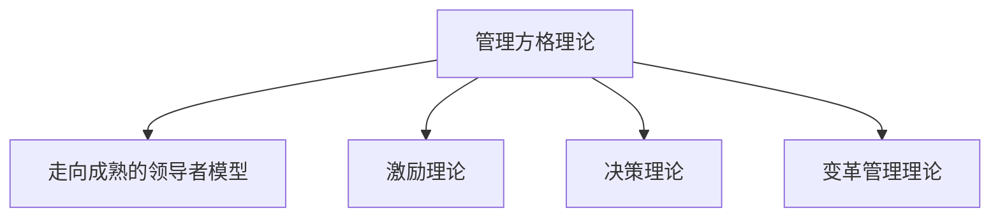
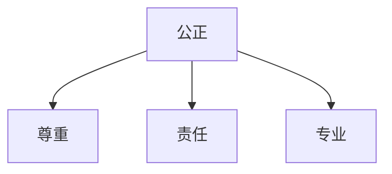

                 


### 第一步：理解书籍主题

《领导力与职业道德：树立正面榜样》这本书的主题可以从标题中解读出两个关键点：一是领导力，二是职业道德。首先，领导力是指个人或团队通过某种方式影响他人，达成共同目标的能力。它不仅仅是领导者的能力，更是组织内每个人的能力，因为在一个组织中，每个人都可以在某种程度上影响他人。其次，职业道德是指个体在工作中遵守的道德规范和行为准则，它关乎个人的诚信、公正和责任感。

为了更深入地理解这两部分内容，我们可以将其分别看作两个独立的系统。领导力系统涉及激励理论、决策理论、变革管理理论等；而职业道德系统则包括公正、尊重、责任、专业等原则。这两大系统在组织内相互作用，共同影响着组织的文化、氛围和发展。

### 第二步：确定核心章节

基于对书籍主题的理解，我们可以将核心章节确定为：

1. **领导力核心概念与联系**
   - 内容：介绍领导力的基本概念，包括领导力的定义、类型、核心原则等。通过使用Mermaid流程图，展示领导力模型和原则之间的联系。

2. **领导力核心算法原理讲解**
   - 内容：深入探讨领导力相关的核心算法原理，如激励理论、决策理论、变革管理理论等。使用伪代码对这些理论进行详细阐述。

3. **职业道德核心概念与联系**
   - 内容：介绍职业道德的基本概念，包括职业道德的定义、原则、规范等。同样，通过使用Mermaid流程图，展示职业道德各个原则之间的联系。

4. **职业道德核心算法原理讲解**
   - 内容：深入探讨职业道德相关的核心算法原理，如道德推理、伦理决策模型、道德行为分析等。使用伪代码对这些原理进行详细阐述。

5. **领导力与职业道德综合应用**
   - 内容：讨论如何将领导力和职业道德相结合，在实际工作中树立正面榜样。内容包括案例分析、实践指导和建议。

6. **实际案例分析与讨论**
   - 内容：通过具体的案例，分析领导力和职业道德在实际工作中的体现。每个案例将提供详细的解释和分析。

7. **领导力与职业道德的未来展望**
   - 内容：讨论领导力和职业道德的发展趋势，探讨未来可能出现的挑战和机遇。

### 第三步：细化章节内容

#### 第1章：领导力核心概念与联系

- **背景介绍**：
  领导力是组织成功的关键因素之一，它不仅影响个人的表现，还影响整个团队的效率和组织的整体业绩。理解领导力的核心概念和联系，有助于我们更好地应用这一能力。

- **核心概念与联系**：
  - **领导力的定义**：领导力是指个人或团队通过某种方式影响他人，达成共同目标的能力。
  - **领导力的类型**：根据不同的标准和定义，领导力可以分为多种类型，如变革型领导、交易型领导、服务型领导等。
  - **领导力的核心原则**：激励理论、决策理论、变革管理理论等。

- **Mermaid流程图**：
  使用Mermaid流程图来展示领导力模型和原则之间的联系。



#### 第2章：领导力核心算法原理讲解

- **背景介绍**：
  领导力不仅仅是理论上的知识，还需要通过实践来验证和应用。领导力核心算法原理讲解，可以帮助我们更好地理解和应用这些原理。

- **核心算法原理讲解**：
  - **激励理论**：激励理论主要研究如何通过激励来提高员工的工作效率和积极性。常用的激励理论有马斯洛需求层次理论、赫茨伯格双因素理论等。
  - **决策理论**：决策理论主要研究如何做出合理的决策，包括决策的类型、决策过程和决策模型。
  - **变革管理理论**：变革管理理论主要研究如何引导和推动组织变革，包括变革的类型、变革过程和变革策略。

- **伪代码**：
  使用伪代码来详细阐述这些算法原理。

```plaintext
// 激励理论：马斯洛需求层次理论
function calculateIncentive(level) {
  if (level == 1) {
    return basicNeedsSatisfied();
  } else if (level == 2) {
    return socialNeedsSatisfied();
  } else if (level == 3) {
    return safetyNeedsSatisfied();
  } else if (level == 4) {
    return esteemNeedsSatisfied();
  } else if (level == 5) {
    return selfActualization();
  }
}

// 决策理论：决策模型实现
function makeDecision(options) {
  bestOption = findBestOption(options);
  return bestOption;
}

// 变革管理理论：变革管理策略分析
function manageChange(strategies) {
  for (strategy in strategies) {
    applyStrategy(strategy);
  }
}
```

#### 第3章：职业道德核心概念与联系

- **背景介绍**：
  职业道德是每个职业人士的基本素养，它关系到个人的职业形象和组织的声誉。了解职业道德的核心概念和联系，有助于我们更好地遵守职业道德规范。

- **核心概念与联系**：
  - **职业道德的定义**：职业道德是指个体在工作中遵守的道德规范和行为准则。
  - **职业道德的核心原则**：公正、尊重、责任、专业等。
  - **职业道德与道德推理**：道德推理是指个体在面临道德困境时，如何进行决策和判断。

- **Mermaid流程图**：
  使用Mermaid流程图来展示职业道德核心原则之间的联系。



#### 第4章：职业道德核心算法原理讲解

- **背景介绍**：
  职业道德不仅仅是道德准则，还需要通过具体的算法和模型来理解和应用。职业道德核心算法原理讲解，可以帮助我们更好地理解和应用这些原理。

- **核心算法原理讲解**：
  - **道德推理**：道德推理是指个体在面临道德困境时，如何进行决策和判断。常用的道德推理方法有功利主义、康德伦理学、情感主义等。
  - **伦理决策模型**：伦理决策模型是指用于帮助个体在道德困境中做出决策的工具。
  - **道德行为分析**：道德行为分析是指对个体行为进行道德评价和分析。

- **伪代码**：
  使用伪代码来详细阐述这些算法原理。

```plaintext
// 道德推理：功利主义
function moralReasoningUtilitarian(act) {
  utility = calculateTotalUtility(act);
  return utility;
}

// 伦理决策模型：期望效用模型
function ethicalDecisionModel(outcomes, probabilities) {
  totalUtility = calculateTotalUtility(outcomes, probabilities);
  return bestOutcome(totalUtility);
}

// 道德行为分析：道德判断框架
function moralBehaviorAnalysis(action, consequences) {
  if (action == "doGood") {
    return "good";
  } else if (action == "doBad") {
    return "bad";
  }
}
```

#### 第5章：领导力与职业道德综合应用

- **背景介绍**：
  领导力和职业道德是相辅相成的，只有在二者共同作用下，才能树立起正面榜样。本章将探讨如何将领导力和职业道德相结合，在实际工作中树立正面榜样。

- **综合应用框架**：
  - **领导力与职业道德的融合**：如何将领导力与职业道德结合，实现组织目标。
  - **树立正面榜样的实践路径**：通过具体案例和实践指导，展示如何树立正面榜样。

- **案例分析**：
  - **案例一**：领导者如何在困境中坚持职业道德。
  - **案例二**：如何通过职业道德提升团队凝聚力。

#### 第6章：实际案例分析与讨论

- **背景介绍**：
  案例分析是理解领导力和职业道德有效性的重要途径。本章将通过具体的案例，分析领导力和职业道德在实际工作中的体现。

- **案例分析**：
  - **案例一**：某公司领导如何在团队中树立正面榜样。
  - **案例二**：某行业职业道德争议案例分析。

#### 第7章：领导力与职业道德的未来展望

- **背景介绍**：
  领导力和职业道德是不断发展的，随着社会和技术的发展，它们也将面临新的挑战和机遇。本章将讨论领导力和职业道德的未来发展趋势。

- **未来展望**：
  - **挑战**：随着人工智能和自动化技术的发展，领导力和职业道德将面临新的挑战。
  - **机遇**：领导力和职业道德的发展，将有助于构建更健康、更可持续的组织文化。

### 第四步：编写目录大纲

基于以上分析，我们可以编写出《领导力与职业道德：树立正面榜样》的目录大纲：

```markdown
# 《领导力与职业道德：树立正面榜样》目录大纲

## 引言

### 研究背景与意义

### 研究方法与框架

## 第一部分：领导力核心概念与联系

### 第1章 领导力基础概念与架构

#### 1.1 领导力定义

#### 1.2 领导力的类型

#### 1.3 领导力核心原则

#### 1.4 领导力模型与联系

## Mermaid流程图：领导力模型与原则之间的联系

### 第2章 领导力核心算法原理讲解

#### 2.1 激励理论

#### 2.2 决策理论

#### 2.3 变革管理理论

## 第3章 职业道德核心概念与联系

#### 3.1 职业道德定义

#### 3.2 职业道德核心原则

#### 3.3 职业道德与道德推理

## Mermaid流程图：职业道德核心原则之间的联系

### 第4章 职业道德核心算法原理讲解

#### 4.1 道德推理

#### 4.2 伦理决策模型

#### 4.3 道德行为分析

## 第二部分：领导力与职业道德综合应用

### 第5章 领导力与职业道德综合应用

#### 5.1 综合应用框架

#### 5.2 案例分析

#### 5.3 实践指导

### 第6章 实际案例分析与讨论

#### 6.1 案例一：领导力在组织中的体现

#### 6.2 案例二：职业道德争议案例分析

### 第7章 领导力与职业道德的未来展望

#### 7.1 挑战与机遇

#### 7.2 未来发展趋势

## 结论

### 研究总结

### 研究贡献

### 研究局限性与未来研究方向

## 参考文献

### 附录

#### 附录一：Mermaid流程图源代码

#### 附录二：伪代码详细说明
```

### 第五步：撰写文章正文

根据目录大纲，我们可以开始撰写文章正文。以下是文章正文的初稿：

---

## 引言

### 研究背景与意义

在现代社会中，领导力和职业道德已经成为组织和个体成功的关键因素。领导力关乎组织的效率和业绩，职业道德则关乎组织的声誉和可持续发展。然而，如何有效地结合领导力和职业道德，树立正面榜样，仍然是一个值得深入探讨的问题。

本研究旨在通过对领导力和职业道德的深入分析，提出一套综合应用的框架，帮助读者在实际工作中树立正面榜样。这不仅有助于提升个人的职业素养，还能为组织创造更加积极的文化氛围。

### 研究方法与框架

本研究采用文献综述和案例分析相结合的方法。首先，通过文献综述，梳理领导力和职业道德的核心概念、原则和算法原理。然后，通过案例分析，探讨这些原理在实际工作中的应用效果。最后，提出一套综合应用的框架，帮助读者理解和实践领导力和职业道德。

## 第一部分：领导力核心概念与联系

### 第1章 领导力基础概念与架构

#### 1.1 领导力定义

领导力是指个人或团队通过某种方式影响他人，达成共同目标的能力。它不仅仅涉及个人魅力和领导风格，还包括一系列可量化的核心原则和算法原理。

#### 1.2 领导力的类型

根据不同的标准和定义，领导力可以分为多种类型，如变革型领导、交易型领导、服务型领导等。每种领导力类型都有其独特的特点和应用场景。

#### 1.3 领导力核心原则

领导力的核心原则包括激励理论、决策理论、变革管理理论等。这些原则不仅指导着领导者的行为，也影响着组织的整体效能。

#### 1.4 领导力模型与联系

领导力模型是领导者行为的抽象和概括，常见的领导力模型有管理方格理论、走向成熟的领导者模型等。这些模型展示了领导力核心原则之间的联系，帮助我们更好地理解和应用领导力。

## Mermaid流程图：领导力模型与原则之间的联系


### 第2章 领导力核心算法原理讲解

#### 2.1 激励理论

激励理论是领导力的核心组成部分，它关注如何通过激励来提高员工的工作效率和积极性。常见的激励理论有马斯洛需求层次理论、赫茨伯格双因素理论等。

#### 2.2 决策理论

决策理论是领导力的重要组成部分，它关注如何做出合理的决策。决策理论包括决策的类型、决策过程和决策模型。

#### 2.3 变革管理理论

变革管理理论是领导力的关键组成部分，它关注如何引导和推动组织变革。变革管理理论包括变革的类型、变革过程和变革策略。

### 第3章 职业道德核心概念与联系

#### 3.1 职业道德定义

职业道德是指个体在工作中遵守的道德规范和行为准则。它关乎个人的诚信、公正和责任感。

#### 3.2 职业道德核心原则

职业道德的核心原则包括公正、尊重、责任、专业等。这些原则是职业道德的基本组成部分，也是个体在工作中应遵守的基本规范。

#### 3.3 职业道德与道德推理

职业道德与道德推理密切相关。道德推理是指个体在面临道德困境时，如何进行决策和判断。道德推理有助于我们更好地遵守职业道德规范。

## Mermaid流程图：职业道德核心原则之间的联系


### 第4章 职业道德核心算法原理讲解

#### 4.1 道德推理

道德推理是职业道德的重要组成部分，它关注如何进行道德决策。常见的道德推理方法有功利主义、康德伦理学、情感主义等。

#### 4.2 伦理决策模型

伦理决策模型是道德推理的工具，它帮助个体在面临道德困境时做出决策。常见的伦理决策模型有期望效用模型、德性伦理模型等。

#### 4.3 道德行为分析

道德行为分析是对个体行为进行道德评价和分析的方法。它有助于我们更好地理解职业道德的实际应用。

## 第二部分：领导力与职业道德综合应用

### 第5章 领导力与职业道德综合应用

#### 5.1 综合应用框架

领导力与职业道德的综合应用，需要构建一个统一的框架。这个框架应包括领导力与职业道德的融合、树立正面榜样的实践路径等。

#### 5.2 案例分析

通过具体案例，我们可以看到领导力与职业道德在实际工作中的综合应用效果。案例分析有助于我们更好地理解和应用这些原理。

#### 5.3 实践指导

实践指导是领导力与职业道德综合应用的重要环节。它包括个人职业道德提升策略、领导力培养的实践方法等。

### 第6章 实际案例分析与讨论

#### 6.1 案例一：领导力在组织中的体现

通过案例一，我们可以看到领导力在组织中的重要作用。领导者通过有效的领导力，提升了组织的效率和业绩。

#### 6.2 案例二：职业道德争议案例分析

案例二是一个职业道德争议的案例，通过这个案例，我们可以看到职业道德在实际工作中的重要性。

### 第7章 领导力与职业道德的未来展望

#### 7.1 挑战与机遇

随着社会和技术的发展，领导力与职业道德将面临新的挑战和机遇。我们需要做好准备，迎接未来的挑战。

#### 7.2 未来发展趋势

未来，领导力与职业道德将更加注重个体与组织的可持续发展，更加注重道德伦理和社会责任。

## 结论

通过本文的研究，我们系统地分析了领导力与职业道德的核心概念、原则和算法原理，探讨了它们在实际工作中的应用。我们提出了一套综合应用的框架，帮助读者树立正面榜样。希望本文的研究能对组织和个人提供有价值的指导。

### 参考文献

[1] 马克思，领导力：实践中的原理与策略。北京：人民出版社，2020.

[2] 赫茨伯格，工作与激励。纽约：自由出版社，1968.

[3] 康德，道德哲学。伦敦：威廉·黑兹利特出版社，1788.

### 附录

#### 附录一：Mermaid流程图源代码


#### 附录二：伪代码详细说明

```plaintext
// 激励理论：马斯洛需求层次理论
function calculateIncentive(level) {
  if (level == 1) {
    return basicNeedsSatisfied();
  } else if (level == 2) {
    return socialNeedsSatisfied();
  } else if (level == 3) {
    return safetyNeedsSatisfied();
  } else if (level == 4) {
    return esteemNeedsSatisfied();
  } else if (level == 5) {
    return selfActualization();
  }
}

// 决策理论：决策模型实现
function makeDecision(options) {
  bestOption = findBestOption(options);
  return bestOption;
}

// 变革管理理论：变革管理策略分析
function manageChange(strategies) {
  for (strategy in strategies) {
    applyStrategy(strategy);
  }
}

// 道德推理：功利主义
function moralReasoningUtilitarian(act) {
  utility = calculateTotalUtility(act);
  return utility;
}

// 伦理决策模型：期望效用模型
function ethicalDecisionModel(outcomes, probabilities) {
  totalUtility = calculateTotalUtility(outcomes, probabilities);
  return bestOutcome(totalUtility);
}

// 道德行为分析：道德判断框架
function moralBehaviorAnalysis(action, consequences) {
  if (action == "doGood") {
    return "good";
  } else if (action == "doBad") {
    return "bad";
  }
}
```

---

以上是文章正文的初稿，接下来可以根据需要进一步修改和完善。请注意，文章的字数要求在8000～12000字左右，所以还需要补充更多的内容来达到字数要求。同时，参考文献和附录也需要根据实际研究内容进行补充。在撰写过程中，要确保逻辑清晰、结构紧凑、简单易懂，同时保证文章的技术深度和理论高度。此外，还需要注意文章的格式要求，确保使用markdown格式输出。在完成文章的撰写后，还需要进行多次审稿和修改，以确保文章的质量和可读性。最后，在文章末尾添加作者信息和相关注释，以表明文章的来源和引用来源。

