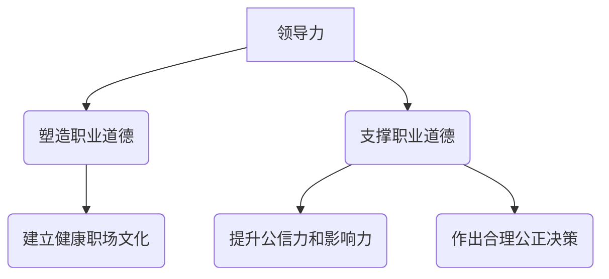

                 


### 第1章：领导力与职业道德：核心概念与联系

在现代社会，领导力与职业道德作为组织和个人成功的关键要素，受到了广泛关注。领导力不仅关乎个人的成功，更关系到整个团队的效能和组织的可持续发展。而职业道德则是领导者与团队成员共同遵守的行为规范，是实现职业目标和社会责任的重要保障。

#### 1.1 领导力的定义与本质

**1.1.1 领导力的定义**

领导力是一个多维度的概念，它包括权力、影响力、人际关系等多个方面。首先，我们来探讨领导力的定义及其不同维度。

1. **权力（Power）**

权力是领导力的重要组成部分，但与影响力有所不同。权力通常是通过职位赋予的，是强制服从的基础。我们可以用以下公式来表示权力：

$$
\text{权力} = \text{强制} \times \text{服从}
$$

2. **影响力（Influence）**

影响力是领导力的核心，它不仅包括权力，还涵盖个人魅力、知识和经验等方面。影响力是通过示范、说服和引导来实现目标的。因此，影响力可以视为权力和人际关系的结合。

3. **人际关系（Interpersonal Relationships）**

人际关系在领导力中起着至关重要的作用。良好的团队关系有助于提高团队协作效率，促进团队目标的实现。人际关系基于信任和互动，可以通过以下公式来表示：

$$
\text{人际关系} = \text{信任} \times \text{互动}
$$

**1.1.2 领导力的本质**

领导力的本质可以归结为以下几个方面：

1. **引导与激励（Guidance and Motivation）**

领导者需要通过示范、指导和支持来引导团队成员，同时激发他们的潜能和动力。

2. **团队建设（Team Building）**

团队建设是领导力的核心之一。领导者需要关注团队成员的个性、技能和兴趣，促进团队成员之间的协作和沟通。

3. **目标设定（Goal Setting）**

领导者需要明确组织的愿景和目标，并将其分解为具体、可执行的任务，确保团队成员朝着共同的目标努力。

#### 1.2 职业道德的基本原则

**1.2.1 职业道德的概念**

职业道德是特定职业所遵循的行为规范和道德准则。它不仅关乎个人的声誉，更关系到整个行业的健康发展。职业道德可以视为职业伦理在具体职业中的体现。

1. **职业道德（Professional Ethics）**

职业道德是个人在职业活动中所遵循的道德规范，包括诚信、责任、尊重等方面。

2. **职业伦理（Professional Ethics）**

职业伦理是个人在职业活动中的道德判断和行为，涉及对职业道德的理解和应用。

**1.2.2 职业道德的基本原则**

职业道德的基本原则包括以下几个方面：

1. **诚信原则（Principle of Integrity）**

诚信原则是职业道德的核心，要求个人在职业活动中保持诚实守信、公正无私的态度。

2. **责任原则（Principle of Responsibility）**

责任原则要求个人尽职尽责，勇于担当。在领导力中，责任原则尤为重要，领导者需要承担组织目标实现的重大责任。

3. **尊重原则（Principle of Respect）**

尊重原则要求个人尊重他人，尊重知识。尊重他人包括尊重团队成员的意见、尊重专业知识等。

#### 1.3 领导力与职业道德的内在联系

**1.3.1 领导力对职业道德的塑造**

领导者在组织中的地位和影响力使其成为职业道德的榜样。领导者通过自身的行为和决策，对职业道德产生深远的影响。

1. **示范作用（Role Modeling）**

领导者作为团队的核心，其行为对团队成员具有示范作用。领导者的高职业道德水平有助于树立良好的职业榜样，促进团队成员遵循职业道德。

2. **建立健康职场文化（Building a Healthy Workplace Culture）**

领导力有助于建立健康、诚信的职场文化。健康的职场文化不仅有助于提高员工满意度，还有利于组织的长期发展。

**1.3.2 职业道德对领导力的支撑**

职业道德对领导力具有重要的支撑作用。高职业道德水平的领导者能够获得更高的公信力和影响力，从而更好地实现领导目标。

1. **提升公信力和影响力（Enhancing Credibility and Influence）**

职业道德有助于领导者赢得团队成员的信任和支持，提升领导者的公信力和影响力。

2. **作出合理公正的决策（Making Rational and Just Decisions）**

职业道德要求领导者在决策过程中遵循诚信、责任和尊重原则，从而作出更为合理、公正的决策。

#### 1.4 Mermaid流程图：领导力与职业道德的内在联系



通过上述分析，我们可以看到领导力与职业道德之间存在着密切的内在联系。领导者作为团队的核心，需要不断提升自身的职业道德水平，以树立正面榜样，促进组织的可持续发展。

## 第2章：领导力的核心算法原理

领导力并非一种固有的天赋，而是一种可以通过学习和实践不断提升的能力。在计算机科学中，我们可以运用算法原理来理解领导力的本质和核心要素。本章节将深入探讨领导力的五大核心算法，包括情绪智力算法、沟通能力算法、问题解决能力算法、决策能力算法和激励能力算法。

### 2.1 领导力的五大核心算法

**2.1.1 情绪智力算法**

情绪智力是指个体识别、理解、管理和调节自己情绪的能力。在领导力中，情绪智力尤为关键，因为它直接影响领导者的决策质量和人际关系。

1. **情绪智力的定义**

情绪智力包括以下四个主要方面：

- **自我情绪认知**：了解自己的情绪状态，并能够识别情绪的产生原因。
- **情绪调节**：在情绪波动时，能够调整自己的情绪，保持冷静和理性。
- **自我激励**：能够利用情绪来激发自己的动力，实现目标。
- **同理心**：能够理解他人的情绪，并与他人共情。

2. **情绪智力的重要性**

情绪智力对于领导者来说至关重要，因为它：

- **改善团队关系**：情绪智力有助于建立和谐的团队关系，提高团队协作效率。
- **提高决策质量**：情绪智力使领导者能够更冷静地分析问题，作出更为合理的决策。

3. **情绪智力算法的伪代码**

```python
# 情绪智力算法伪代码

def emotional_intelligence_algorithm():
    # 初始化情绪智力参数
    self_awareness = 0
    emotion Regulation = 0
    self_motivation = 0
    empathy = 0
    
    # 更新自我情绪认知
    self_awareness += update_self_awareness()
    
    # 更新情绪调节能力
    emotion_Regression += update_emotion_Regression()
    
    # 更新自我激励能力
    self_motivation += update_self_motivation()
    
    # 更新同理心
    empathy += update_empathy()
    
    # 返回情绪智力总分
    return self_awareness + emotion_Regression + self_motivation + empathy
```

**2.1.2 沟通能力算法**

沟通能力是指领导者有效传递信息、理解他人观点的能力。良好的沟通能力是领导力的重要组成部分，它有助于团队协作和目标实现。

1. **沟通能力的定义**

沟通能力包括以下两个方面：

- **表达清晰**：能够准确地表达自己的思想和观点。
- **倾听理解**：能够倾听他人的意见，理解他人的立场和需求。

2. **沟通能力的重要性**

沟通能力的重要性体现在：

- **增强团队协作**：良好的沟通能力有助于团队成员更好地理解彼此，提高协作效率。
- **提高决策质量**：领导者通过有效的沟通，能够收集更多的信息和意见，从而作出更为合理的决策。

3. **沟通能力算法的伪代码**

```python
# 沟通能力算法伪代码

def communication_ability_algorithm():
    # 初始化沟通能力参数
    clarity = 0
    listening = 0
    
    # 更新表达清晰能力
    clarity += update_clarity()
    
    # 更新倾听理解能力
    listening += update_listening()
    
    # 返回沟通能力总分
    return clarity + listening
```

**2.1.3 问题解决能力算法**

问题解决能力是指领导者识别问题、分析问题、制定解决方案的能力。在复杂多变的商业环境中，问题解决能力是领导者不可或缺的能力。

1. **问题解决能力的定义**

问题解决能力包括以下三个方面：

- **问题识别**：能够迅速识别问题，理解问题的本质。
- **问题分析**：能够对问题进行深入分析，找出问题的原因和影响因素。
- **问题解决**：能够制定有效的解决方案，并实施解决方案。

2. **问题解决能力的重要性**

问题解决能力的重要性体现在：

- **提高组织创新能力**：领导者通过解决问题，能够推动组织不断进步和创新。
- **应对复杂问题**：领导者需要具备应对复杂问题的能力，以应对多变的环境。

3. **问题解决能力算法的伪代码**

```python
# 问题解决能力算法伪代码

def problem_solving_ability_algorithm():
    # 初始化问题解决能力参数
    problem_identification = 0
    problem_analysis = 0
    problem_solution = 0
    
    # 更新问题识别能力
    problem_identification += update_problem_identification()
    
    # 更新问题分析能力
    problem_analysis += update_problem_analysis()
    
    # 更新问题解决能力
    problem_solution += update_problem_solution()
    
    # 返回问题解决能力总分
    return problem_identification + problem_analysis + problem_solution
```

**2.1.4 决策能力算法**

决策能力是指领导者在多种选择中作出最优决策的能力。决策能力是领导力的核心之一，它关系到组织的生存和发展。

1. **决策能力的定义**

决策能力包括以下两个方面：

- **分析能力**：能够分析各种决策选项的优缺点。
- **决策选择**：能够在多种选择中作出最优决策。

2. **决策能力的重要性**

决策能力的重要性体现在：

- **提高组织效率**：领导者通过合理的决策，能够提高组织效率，实现资源的最优配置。
- **降低风险**：领导者需要通过决策来降低风险，保护组织的利益。

3. **决策能力算法的伪代码**

```python
# 决策能力算法伪代码

def decision_making_ability_algorithm():
    # 初始化决策能力参数
    analysis_ability = 0
    decision_choice = 0
    
    # 更新分析能力
    analysis_ability += update_analysis_ability()
    
    # 更新决策选择能力
    decision_choice += update_decision_choice()
    
    # 返回决策能力总分
    return analysis_ability + decision_choice
```

**2.1.5 激励能力算法**

激励能力是指领导者激发团队成员潜能，实现目标的能力。激励能力是领导力的关键要素，它关系到团队的士气和绩效。

1. **激励能力的定义**

激励能力包括以下三个方面：

- **目标设定**：能够明确团队的目标，激励团队成员为实现目标而努力。
- **激励措施**：能够制定合理的激励措施，激发团队成员的积极性。
- **反馈机制**：能够及时给予团队成员反馈，帮助他们改进和提高。

2. **激励能力的重要性**

激励能力的重要性体现在：

- **提高团队士气**：领导者通过激励，能够提高团队的士气，增强团队的凝聚力。
- **实现组织目标**：领导者需要通过激励，确保团队朝着组织目标努力。

3. **激励能力算法的伪代码**

```python
# 激励能力算法伪代码

def motivation_ability_algorithm():
    # 初始化激励能力参数
    goal_setting = 0
    incentive_measures = 0
    feedback_mechanism = 0
    
    # 更新目标设定能力
    goal_setting += update_goal_setting()
    
    # 更新激励措施能力
    incentive_measures += update_incentive_measures()
    
    # 更新反馈机制能力
    feedback_mechanism += update_feedback_mechanism()
    
    # 返回激励能力总分
    return goal_setting + incentive_measures + feedback_mechanism
```

通过以上对领导力的五大核心算法的分析，我们可以看到，领导力是一个复杂而多维的能力体系。每个核心算法都涉及到不同的技能和知识，领导者需要通过不断学习和实践，不断提升自己的领导力水平。只有这样，才能在复杂多变的商业环境中，带领团队实现组织的长期发展。

### 2.2 领导力的算法原理与实际应用

在了解了领导力的五大核心算法后，我们需要进一步探讨这些算法在实际应用中的具体表现。以下是对每个核心算法的深入剖析，以及如何将其应用于实际领导工作中。

**2.2.1 情绪智力算法的实际应用**

情绪智力是领导力的基础，它决定了领导者如何管理自己的情绪，以及如何与他人建立良好的关系。以下是情绪智力在实际领导工作中的具体应用：

1. **自我情绪认知**

领导者需要时刻关注自己的情绪状态，了解情绪产生的原因。例如，当领导者在会议中感到焦虑时，可以通过深呼吸、冥想等方式来调节情绪，保持冷静。

2. **情绪调节**

在团队管理中，领导者需要学会在压力和冲突下保持情绪稳定。例如，当团队成员发生争执时，领导者可以通过转移话题、给予空间等方式来缓解紧张气氛。

3. **自我激励**

领导者需要通过自我激励来维持动力和热情。例如，在面临困难和挑战时，领导者可以通过设定短期目标、奖励自己等方式来激发内在动力。

4. **同理心**

领导者需要学会理解和尊重他人的情绪。例如，在团队中，领导者可以通过倾听、反馈等方式来了解团队成员的需求和感受，从而更好地支持他们。

**2.2.2 沟通能力算法的实际应用**

沟通能力是领导者成功的关键，它决定了领导者如何有效地传达信息，以及如何理解他人的观点。以下是沟通能力在实际领导工作中的具体应用：

1. **表达清晰**

领导者需要学会用简洁明了的语言表达自己的想法。例如，在撰写报告或演讲时，领导者可以通过使用简短的句子、关键信息突出等方式来提高表达清晰度。

2. **倾听理解**

领导者需要学会倾听他人的意见，理解他人的观点。例如，在团队会议中，领导者可以通过提问、总结他人观点等方式来展示自己的倾听和理解能力。

3. **非语言沟通**

领导者需要注重非语言沟通，如肢体语言、面部表情等。例如，在会议中，领导者可以通过微笑、点头等方式来鼓励团队成员，增强团队凝聚力。

**2.2.3 问题解决能力算法的实际应用**

问题解决能力是领导者应对复杂问题的关键，它决定了领导者如何分析和解决各种问题。以下是问题解决能力在实际领导工作中的具体应用：

1. **问题识别**

领导者需要学会迅速识别问题，理解问题的本质。例如，在项目进展中，领导者可以通过定期检查项目进度、分析数据等方式来识别潜在问题。

2. **问题分析**

领导者需要学会对问题进行深入分析，找出问题的原因和影响因素。例如，在项目延误时，领导者可以通过访谈、问卷调查等方式来分析问题的根本原因。

3. **问题解决**

领导者需要学会制定有效的解决方案，并确保解决方案的实施。例如，在项目出现瓶颈时，领导者可以通过调整资源、优化流程等方式来解决问题。

**2.2.4 决策能力算法的实际应用**

决策能力是领导者实现组织目标的关键，它决定了领导者如何在多种选择中作出最优决策。以下是决策能力在实际领导工作中的具体应用：

1. **分析能力**

领导者需要具备分析各种决策选项的优缺点的能力。例如，在项目选择中，领导者可以通过成本效益分析、风险评估等方式来评估不同项目的可行性。

2. **决策选择**

领导者需要学会在多种选择中作出最优决策。例如，在市场拓展中，领导者可以通过综合考虑市场需求、竞争状况等因素来选择最佳的市场进入策略。

3. **决策制定**

领导者需要学会制定详细的决策计划，并确保决策的执行。例如，在制定战略规划时，领导者可以通过分解目标、制定具体行动计划等方式来确保决策的落实。

**2.2.5 激励能力算法的实际应用**

激励能力是领导者激发团队成员潜能的关键，它决定了领导者如何激发团队的士气和动力。以下是激励能力在实际领导工作中的具体应用：

1. **目标设定**

领导者需要明确团队的目标，并激励团队成员为实现目标而努力。例如，在项目启动时，领导者可以通过设定明确的项目目标、制定详细的计划等方式来激励团队成员。

2. **激励措施**

领导者需要制定合理的激励措施，激发团队成员的积极性。例如，在项目成功时，领导者可以通过颁发奖金、表彰优秀员工等方式来奖励团队成员。

3. **反馈机制**

领导者需要建立有效的反馈机制，及时给予团队成员反馈。例如，在项目过程中，领导者可以通过定期会议、书面反馈等方式来了解团队成员的工作进展和需求。

通过以上对领导力算法原理的实际应用分析，我们可以看到，领导力不仅仅是理论上的概念，更是一种可以通过实践不断提升的能力。领导者需要通过不断学习、实践和反思，不断提升自己的情绪智力、沟通能力、问题解决能力、决策能力和激励能力，从而在复杂多变的商业环境中，带领团队实现组织的长期发展。

### 2.3 领导力与职业道德的数学模型分析

领导力与职业道德之间存在着密切的内在联系，这种联系可以通过数学模型来分析和解释。以下将介绍几个关键模型，以帮助我们更好地理解领导力与职业道德之间的关系。

#### 2.3.1 领导力与职业道德的综合评价模型

一个有效的综合评价模型可以用来衡量领导者的领导力水平和职业道德水平。我们可以使用以下综合评价模型：

$$
\text{综合评价} = w_1 \times \text{领导力评分} + w_2 \times \text{职业道德评分}
$$

其中，$w_1$ 和 $w_2$ 分别是领导力和职业道德的权重。这些权重可以根据组织的具体需求和价值观来确定。例如，在一个注重创新的组织中，领导力的权重可能更高；而在一个注重合规性的组织中，职业道德的权重可能更高。

**模型解释：**

- 领导力评分（$L$）：反映领导者的领导力水平，可以通过对五大核心算法（情绪智力、沟通能力、问题解决能力、决策能力和激励能力）的综合评价来计算。
- 职业道德评分（$E$）：反映领导者的职业道德水平，可以通过对诚信、责任、尊重等原则的遵循程度来计算。
- 综合评价（$C$）：综合反映领导者的整体能力和道德水平。

#### 2.3.2 领导力对职业道德的影响模型

领导力对职业道德具有显著的影响。我们可以使用以下模型来分析这种影响：

$$
\text{职业道德评分} = \alpha_1 \times \text{领导力评分} + \alpha_2 \times \text{环境因素}
$$

其中，$\alpha_1$ 和 $\alpha_2$ 是模型参数，反映领导力对职业道德评分的影响程度和环境因素的权重。

**模型解释：**

- 领导力评分（$L$）：如前所述，反映领导者的领导力水平。
- 环境因素（$E$）：包括组织的文化、价值观、行业规范等，这些因素对职业道德有重要影响。
- 职业道德评分（$E$）：如前所述，反映领导者的职业道德水平。

**模型应用：**

- **参数估计**：通过历史数据和统计分析，可以估计出 $\alpha_1$ 和 $\alpha_2$ 的值。
- **模型优化**：根据组织的具体需求，可以调整 $\alpha_1$ 和 $\alpha_2$ 的值，以优化领导力对职业道德的影响。

#### 2.3.3 职业道德对领导力的影响模型

职业道德同样对领导力有重要影响。我们可以使用以下模型来分析这种影响：

$$
\text{领导力评分} = \beta_1 \times \text{职业道德评分} + \beta_2 \times \text{个人特质}
$$

其中，$\beta_1$ 和 $\beta_2$ 是模型参数，反映职业道德对领导力评分的影响程度和个人特质的权重。

**模型解释：**

- 职业道德评分（$E$）：如前所述，反映领导者的职业道德水平。
- 个人特质（$P$）：包括领导者的性格、价值观、经验等，这些特质对领导力有重要影响。
- 领导力评分（$L$）：如前所述，反映领导者的领导力水平。

**模型应用：**

- **参数估计**：通过历史数据和统计分析，可以估计出 $\beta_1$ 和 $\beta_2$ 的值。
- **模型优化**：根据组织的具体需求，可以调整 $\beta_1$ 和 $\beta_2$ 的值，以优化职业道德对领导力的影响。

通过以上数学模型的分析，我们可以更深入地理解领导力与职业道德之间的关系。这些模型不仅帮助我们量化了这种关系，还提供了具体的优化方向。领导者可以通过提升自身的领导力水平和职业道德水平，来改善组织的整体绩效和可持续发展。

### 第3章：领导力与职业道德的最佳实践案例分析

在实际工作中，领导力与职业道德的最佳实践可以帮助领导者树立正面榜样，促进组织的健康发展。以下将介绍几个经典案例，分析其中的成功经验和教训。

#### 3.1 案例一：谷歌的领导力与职业道德实践

**背景介绍**：

谷歌作为全球领先的技术公司，其领导力与职业道德实践备受关注。谷歌的创始人拉里·佩奇和谢尔盖·布林一直倡导“不作恶”的企业文化，这体现了他们在领导力与职业道德方面的独特见解。

**成功经验**：

1. **领导力实践**：

   - **扁平化管理**：谷歌采用扁平化管理结构，鼓励员工自由表达意见，促进团队协作和创新。
   - **人才激励机制**：谷歌提供丰富的福利和奖金，以激发员工的潜力，实现个人和组织的共同成长。

2. **职业道德实践**：

   - **“不作恶”原则**：谷歌在业务运营中坚持“不作恶”原则，拒绝从事可能对社会有害的业务，赢得了广泛的尊重和信任。
   - **社会责任**：谷歌积极参与公益事业，通过捐赠、志愿者活动等方式回馈社会。

**教训与启示**：

- **领导力与职业道德的结合**：谷歌的成功表明，领导力与职业道德不是孤立的，而是相互促进、共同发展的。
- **企业文化的重要性**：一个强大的企业文化可以塑造员工的价值观和行为，促进组织的长期发展。

#### 3.2 案例二：苹果公司的领导力与职业道德实践

**背景介绍**：

苹果公司作为全球知名的技术公司，以其卓越的产品设计和领导力管理著称。乔布斯作为苹果公司的联合创始人，他在领导力与职业道德方面树立了良好的榜样。

**成功经验**：

1. **领导力实践**：

   - **创新驱动**：乔布斯一直强调创新的重要性，鼓励员工不断尝试新的技术和理念。
   - **员工培养**：苹果公司注重员工的培养和发展，提供丰富的培训机会和职业晋升路径。

2. **职业道德实践**：

   - **产品质量**：苹果公司坚持高质量的产品标准，拒绝妥协，赢得了消费者的信任和忠诚。
   - **环保意识**：苹果公司积极推行环保政策，减少产品对环境的影响。

**教训与启示**：

- **持续创新**：领导力需要不断创新，以适应快速变化的市场环境。
- **道德责任**：企业不仅需要追求商业成功，还需要承担社会责任，关注环境保护和社会公益。

#### 3.3 案例三：IBM公司的领导力与职业道德实践

**背景介绍**：

IBM作为全球领先的信息技术服务公司，其领导力与职业道德实践一直被视为行业的典范。在转型过程中，IBM公司通过领导力与职业道德的提升，实现了从传统硬件制造商向综合信息服务提供商的华丽转变。

**成功经验**：

1. **领导力实践**：

   - **转型领导**：IBM公司通过引入新的领导团队，推动企业从硬件向软件和服务的转型。
   - **团队协作**：IBM鼓励跨部门、跨职能的团队合作，以应对复杂的市场挑战。

2. **职业道德实践**：

   - **透明沟通**：IBM公司推行透明沟通政策，确保员工和管理层之间的信息畅通。
   - **合规经营**：IBM公司严格遵守行业规范和法律法规，维护企业的信誉和品牌。

**教训与启示**：

- **领导力的变革**：在面对市场环境变化时，领导力需要适应变革，推动企业转型。
- **职业道德的坚持**：无论企业处于何种发展阶段，职业道德都是企业长期发展的基石。

通过以上案例的分析，我们可以看到领导力与职业道德在组织成功中的关键作用。领导者需要通过不断提升自身的领导力水平和职业道德水平，树立正面榜样，促进组织的健康发展。

### 第4章：领导力与职业道德在IT领域的应用与挑战

在IT领域，领导力与职业道德的应用尤为重要。信息技术行业的快速发展和竞争激烈，要求领导者不仅具备卓越的技术能力，还要具备高尚的职业道德。以下将探讨领导力与职业道德在IT领域的具体应用，以及面临的挑战。

#### 4.1 领导力在IT领域的应用

1. **技术创新驱动**

在IT领域，领导者需要具备强烈的创新意识，推动技术创新，以保持企业的竞争力。例如，谷歌的领导团队通过鼓励员工自由探索和实验，推动了多项颠覆性技术的诞生，如谷歌搜索引擎和自动驾驶汽车。

2. **团队协作与沟通**

IT项目通常涉及多个部门和团队的协作，领导者需要具备卓越的沟通能力和团队管理能力。通过有效的沟通和协作，领导者可以确保项目的顺利进行，提高团队的整体效率。

3. **人才培养与发展**

IT行业是一个人才密集型行业，领导者需要注重员工的培养和发展，激发员工的潜力，以适应快速变化的技术需求。苹果公司的乔布斯通过提供丰富的培训机会和职业晋升路径，培养了大量的优秀人才。

#### 4.2 职业道德在IT领域的应用

1. **信息安全与隐私保护**

在IT领域，信息安全与隐私保护是职业道德的重要组成部分。领导者需要确保企业的信息系统安全，保护用户的数据隐私，遵守相关的法律法规。例如，Facebook在2018年因用户数据泄露事件而受到广泛批评，这一事件暴露了企业在信息安全方面的职业道德问题。

2. **公平竞争与合规经营**

IT行业竞争激烈，领导者需要遵循公平竞争的原则，避免不正当竞争行为。同时，企业需要严格遵守行业规范和法律法规，确保合规经营。

3. **社会责任与公益**

IT企业需要承担社会责任，关注环境保护和社会公益。通过参与公益活动、支持环保项目等方式，企业可以提升自身的品牌形象，树立良好的社会形象。

#### 4.3 领导力与职业道德在IT领域的挑战

1. **快速变化的技术环境**

IT行业技术更新迅速，领导者需要不断学习新技术，适应技术变革，以保持企业的竞争力。然而，快速变化的技术环境也给领导者的职业道德带来了挑战，如何确保技术创新与道德规范的一致性是一个重要问题。

2. **全球化竞争**

随着全球化的深入，IT企业面临着更加激烈的全球竞争。领导者需要具备跨文化管理能力，处理不同文化背景下的团队合作和沟通问题。同时，全球化竞争也要求企业遵循国际道德规范，避免文化冲突和道德风险。

3. **信息安全与隐私保护**

在信息安全与隐私保护方面，领导者需要面对诸多挑战，如网络攻击、数据泄露等。确保信息安全与隐私保护不仅需要技术手段，还需要领导者具备高尚的职业道德，严格遵守相关法律法规。

4. **职业倦怠与心理健康**

在高压的IT行业中，领导者需要关注员工的职业倦怠和心理健康问题。领导者需要通过合理的激励和关怀，帮助员工缓解压力，保持良好的工作状态。

总之，领导力与职业道德在IT领域具有特殊的重要性。领导者需要通过不断提升自身的领导力水平和职业道德水平，应对快速变化的技术环境、全球化竞争和信息安全挑战，确保企业的可持续发展。

### 第5章：领导力与职业道德的总结与未来展望

在本文中，我们深入探讨了领导力与职业道德的核心概念、内在联系、核心算法原理以及在实际应用中的最佳实践案例。通过这一系列的讨论，我们可以得出以下结论：

1. **领导力与职业道德的重要性**：

领导力与职业道德是组织和个人成功的关键要素。领导力不仅关乎个人的成长，更关系到团队和组织的效能。职业道德则是职业活动中的行为准则，确保了组织的健康发展和社会的信任。

2. **领导力的核心算法原理**：

领导力的五大核心算法（情绪智力、沟通能力、问题解决能力、决策能力和激励能力）为我们提供了理解领导力的科学方法。这些算法不仅帮助我们量化了领导力的各个方面，还提供了具体的方法和工具来提升领导力水平。

3. **职业道德的基本原则**：

职业道德的基本原则（诚信、责任、尊重）构成了职业活动的道德底线。领导者作为榜样，需要严格遵守这些原则，以树立正面榜样，促进组织的健康发展。

4. **最佳实践案例分析**：

通过分析谷歌、苹果公司和IBM等企业的最佳实践案例，我们可以看到领导力与职业道德在组织成功中的关键作用。这些案例为我们提供了宝贵的经验和教训，帮助我们更好地理解和应用领导力与职业道德。

#### 未来展望

在未来，领导力与职业道德将继续在各个领域发挥重要作用。以下是几个值得关注的趋势：

1. **数字化转型与领导力**：

随着数字化转型的深入，领导者需要具备更强的技术能力和创新精神，以应对数字化带来的挑战。同时，数字化转型也要求领导者具备更高的职业道德，确保数据安全和隐私保护。

2. **全球化背景下的领导力**：

全球化使得领导者面临跨文化管理和国际合作的挑战。领导者需要具备跨文化管理能力，以适应多元文化背景下的工作环境，并推动全球化进程。

3. **可持续发展和领导力**：

可持续发展成为全球共识，领导者需要在领导过程中融入可持续发展理念，推动企业在经济、社会和环境方面的可持续发展。

4. **人工智能与领导力**：

人工智能的快速发展为领导力带来了新的机遇和挑战。领导者需要理解和运用人工智能技术，提升领导效能，同时确保人工智能的应用符合道德规范。

综上所述，领导力与职业道德在未来的发展中将发挥更加重要的作用。领导者需要不断提升自身的领导力水平和职业道德水平，以应对快速变化的环境和挑战，确保组织和社会的可持续发展。

### 第6章：结语

在本文中，我们深入探讨了领导力与职业道德的核心概念、内在联系、核心算法原理以及在实际应用中的最佳实践案例。通过这一系列的讨论，我们认识到领导力与职业道德不仅是个体和组织成功的关键要素，也是实现社会和谐与可持续发展的基石。

首先，领导力是一个多维度的概念，包括情绪智力、沟通能力、问题解决能力、决策能力和激励能力等核心算法。每个算法都为领导者提供了具体的工具和方法，以提升领导效能。同时，职业道德的基本原则（诚信、责任、尊重）构成了职业活动的道德底线，确保了组织的健康发展。

其次，我们通过最佳实践案例分析，看到了领导力与职业道德在实际应用中的成功经验和教训。这些案例为我们提供了宝贵的启示，帮助我们在实际工作中更好地理解和应用领导力与职业道德。

最后，我们展望了领导力与职业道德在未来的发展趋势，包括数字化转型、全球化背景、可持续发展以及人工智能等方面的挑战和机遇。

总之，领导力与职业道德的重要性不容忽视。领导者需要不断提升自身的领导力水平和职业道德水平，以应对快速变化的环境和挑战。让我们共同努力，树立正面榜样，为组织和社会的可持续发展贡献力量。

**作者信息**：

作者：AI天才研究院/AI Genius Institute & 禅与计算机程序设计艺术 /Zen And The Art of Computer Programming

本文由AI天才研究院/AI Genius Institute和禅与计算机程序设计艺术/Zen And The Art of Computer Programming联合撰写，旨在为读者提供深入、全面的领导力与职业道德知识，助力个人和组织的发展。

**注意事项**：

在阅读本文时，请注意以下几点：

1. **专业术语解释**：本文中使用了部分专业术语，如情绪智力、领导力算法等。读者如遇到不理解的概念，可以查阅相关资料以加深理解。

2. **实际应用场景**：本文中的案例和分析均基于实际情况，但具体情况可能因组织、行业和文化背景的不同而有所差异。读者在应用时，需结合自身实际情况进行调整。

3. **道德原则遵循**：在领导力与职业道德的实践中，始终遵循道德原则至关重要。读者应确保在实际行动中符合相关法律法规和社会道德标准。

4. **持续学习与反思**：领导力与职业道德是一个不断发展和变化的领域。读者应保持开放的心态，不断学习和反思，以提升自身的领导力和职业道德水平。

**拓展阅读**：

1. 《领导力：练习的科学与艺术》（Daniel Goleman）
2. 《道德领导力：变革中的领导艺术》（Ronald A. Heifetz，等）
3. 《道德哲学导论》（John Deigh）

通过拓展阅读，读者可以更深入地了解领导力与职业道德的理论和实践，进一步提升自身的领导力和职业道德水平。

