                 

### 文章标题

# 领导力与职场心理学：深入理解团队行为

---

关键词：领导力、职场心理学、团队行为、沟通、协作、动机、绩效、算法、模型、项目实战

---

摘要：本文旨在探讨领导力和职场心理学在团队行为中的重要性，通过深入分析团队合作的背景、核心概念及其相互关系，为读者提供一种全新的视角来理解团队行为。文章将详细介绍领导力的基本概念和理论框架，职场心理学的核心原理，以及两者在团队合作中的实际应用。通过数学模型和具体项目实战的解读，读者将能够全面掌握如何运用这些理论来提升团队绩效和协作效率。最后，本文将总结核心概念与联系，并给出一些实践中的最佳建议，以期为职场中的团队领导者和管理者提供实用的指导。

### 1. 基础概念介绍

#### 1.1.1 领导力

领导力是指个体或群体在组织和团队中引领、激励、指导他人的能力。它是一种多维度的能力，不仅包括战略思维和决策能力，还涵盖人际关系和沟通技巧。以下是领导力的几个关键方面：

- **愿景与目标设定**：领导者需要明确团队的目标和愿景，并能够将这些目标转化为可操作的行动计划。

- **沟通与协调**：有效的沟通是领导力的核心。领导者需要能够清晰、准确地传达信息，并确保团队成员之间信息流畅，减少误解和冲突。

- **决策与判断**：在复杂多变的职场环境中，领导者需要快速做出明智的决策，并承担相应的责任。

- **激励与鼓励**：领导者应具备激励团队成员的能力，鼓励他们在面对挑战时保持积极的态度，发挥出最佳水平。

#### 1.1.2 职场心理学

职场心理学是研究人在职场环境中的心理现象和行为的学科。它关注个体和团队在职场中的心理动态，以及这些心理动态如何影响工作表现和团队协作。以下是职场心理学的一些关键概念：

- **个体心理特征**：包括性格、动机、态度等，这些特征会影响个体的行为和决策。

- **团队心理**：研究团队成员之间的互动、沟通、合作和冲突，以及这些互动如何影响团队的整体表现。

- **组织行为**：涉及组织文化、领导风格、组织结构等对职场行为和组织绩效的影响。

### 1.2 核心概念原理与架构

#### 1.2.1 领导力的理论框架

领导力理论多种多样，但大多数理论都可以归结为以下几个核心模型：

- **领导力五要素模型**：这个模型认为领导力由情境、任务、人际关系、个人特质和价值观五个要素构成。每个要素在不同情境下发挥的作用不同，领导者的有效行为取决于这些要素的组合。

- **情境领导模型**：该模型基于领导者的行为和下属的成熟度，提出四种领导风格：指示型、推销型、参与型和授权型。领导者需要根据下属的成熟度选择适当的领导风格，以实现最佳效果。

#### 1.2.2 职场心理学的理论框架

职场心理学有其独特的理论框架，主要包括以下模型：

- **心理动力模型**：该模型基于心理学中的动力理论，解释职场行为背后的动机和动力。通过分析个体的性格、动机和态度，可以预测其在职场中的行为。

- **社会交换理论**：该理论通过分析职场中的交换关系，解释职场行为和结果。个体在职场中的行为通常是基于所得与付出的权衡，社会交换理论提供了理解这一现象的框架。

### 1.3 数学模型和数学公式

在领导力和职场心理学中，数学模型和数学公式用于量化和分析各种现象。以下是一些常见的数学模型和公式：

#### 1.3.1 领导力模型中的数学公式

- **领导力评分模型**：使用多元线性回归模型来评估领导力对团队绩效的影响。

  $$ \text{绩效} = \beta_0 + \beta_1 \times \text{领导力} + \epsilon $$

- **情境领导模型评分**：使用评分表来评估领导者的领导风格。

  $$ \text{领导风格评分} = \sum_{i=1}^{n} w_i \times \text{领导风格}_i $$

#### 1.3.2 职场心理学模型中的数学公式

- **心理动力模型评分**：使用心理动力学模型来评估个体心理特征。

  $$ \text{心理动力评分} = f(\text{性格}, \text{动机}, \text{态度}) $$

- **社会交换模型评分**：使用社会交换模型来评估职场中的交换关系。

  $$ \text{交换关系评分} = \frac{\text{所得}}{\text{付出}} $$

### 1.4 项目实战

#### 1.4.1 领导力评估项目

- **项目目标**：通过领导力评估，提高团队领导力和团队绩效。

- **项目实施**：使用领导力评分模型进行评估，并提供改进建议。

#### 1.4.2 职场心理学调研项目

- **项目目标**：了解职场心理现象，提高团队协作效果。

- **项目实施**：使用心理动力模型和社会交换模型进行调研，并提出改进措施。

### 1.5 代码实际案例和详细解释说明

#### 1.5.1 领导力评估代码实现

- **开发环境**：Python、Jupyter Notebook

- **代码解读**：详细解读领导力评分模型和情境领导模型评分的实现代码。

#### 1.5.2 职场心理学调研代码实现

- **开发环境**：Python、Jupyter Notebook

- **代码解读**：详细解读心理动力模型和社会交换模型评分的实现代码。

### 1.6 总结

- **核心概念与联系**：通过以上章节的介绍，读者可以全面了解领导力和职场心理学的基本概念、理论框架、数学模型和项目实战。

- **核心算法原理讲解**：通过伪代码和代码实现，读者可以深入理解领导力评估和职场心理学调研的核心算法原理。

- **数学模型和数学公式**：通过详细的讲解和示例，读者可以掌握领导力和职场心理学中的常用数学模型和公式。

- **项目实战**：通过实际项目的实施和代码实现，读者可以了解如何将理论应用到实践中。

- **代码解读与分析**：通过代码的解读和分析，读者可以了解如何使用Python等工具实现领导力和职场心理学的相关算法。

---

### 2.1 团队合作的重要性

在职场中，团队合作是提高工作效率、促进知识共享、增强创新能力和提升组织绩效的关键因素。团队合作的重要性可以从以下几个方面进行深入探讨。

#### 2.1.1 提高工作效率

团队合作能够优化工作流程，减少重复劳动，提高工作效率。通过团队协作，任务可以被分解为多个子任务，每个成员可以根据自己的专长和兴趣负责不同的部分。这样不仅能够提高每个人的工作质量，还能在整体上缩短完成任务的时间。此外，团队合作可以促进信息共享和资源整合，使团队成员能够及时获取所需的信息和资源，从而更快地解决问题和推进项目。

#### 2.1.2 促进知识共享

团队合作提供了一个交流和学习的平台，促进了知识的共享和传播。在团队中，每个成员都有自己的专业技能和经验，通过合作，他们可以相互学习、借鉴和分享。这不仅有助于团队成员个人能力的提升，还能够提高团队整体的知识储备和创新能力。知识共享还可以减少信息孤岛现象，使组织更加灵活和适应变化。

#### 2.1.3 增强创新能力

团队合作是创新的重要推动力。在团队中，不同背景和经验的成员可以提供多样化的视角和想法，激发创新思维。通过团队合作，可以开展头脑风暴、集思广益，从而产生更多的创新解决方案。团队合作还可以促进跨部门、跨领域的合作，打破传统的组织壁垒，推动创新项目的实施。

#### 2.1.4 提升组织绩效

团队合作能够提升组织绩效，实现个人与组织的双赢。通过团队合作，团队可以更好地应对复杂和多变的工作环境，提高解决问题的能力。团队合作还可以促进团队凝聚力的增强，提升团队成员的满意度和忠诚度，从而降低员工流失率。此外，团队合作能够提高组织的整体竞争力，使组织在激烈的市场竞争中占据有利地位。

#### 2.1.5 增进人际关系

团队合作提供了一个人际交往的平台，有助于增进团队成员之间的了解和信任。通过合作，团队成员可以相互支持、共同面对挑战，建立良好的人际关系。这种人际关系不仅有助于提高团队协作效率，还可以为个人提供情感支持和职业发展机会。

总之，团队合作在职场中具有极其重要的作用。它不仅能够提高工作效率、促进知识共享、增强创新能力和提升组织绩效，还能够增进团队成员的人际关系。为了充分发挥团队合作的优势，领导者需要关注团队建设，培养团队成员的协作意识和能力，营造积极、健康的团队氛围。

### 2.2 团队行为的核心概念与联系

在深入探讨团队行为之前，我们需要明确几个核心概念，并理解它们之间的相互关系。这些概念包括团队沟通、团队协作、动机、绩效和领导力等。

#### 2.2.1 团队沟通

团队沟通是团队行为的核心，它涉及团队成员之间信息的传递、理解和互动。有效的沟通能够确保团队成员对任务的理解一致，减少误解和冲突。团队沟通不仅包括口头和书面交流，还包括非语言沟通，如肢体语言和面部表情。良好的沟通能够促进团队协作，提高工作效率。

#### 2.2.2 团队协作

团队协作是指团队成员为了共同目标而共同工作的过程。它包括任务的分配、资源的共享、意见的交流和支持。团队协作需要团队成员具备良好的沟通技巧、团队合作精神和协调能力。通过协作，团队可以整合每个成员的优势，发挥整体效能，实现共同目标。

#### 2.2.3 动机

动机是驱动个体行为的力量，它决定了个体在工作中的积极性、主动性和努力程度。在团队中，动机不仅影响个人的表现，还影响团队的整体绩效。团队动机可以分为内在动机和外在动机。内在动机源于个体对工作本身的兴趣和满足感，而外在动机则来自外部奖励和惩罚。有效的团队领导需要激发和维持团队成员的动机，以提高团队绩效。

#### 2.2.4 绩效

绩效是衡量团队工作成果的标准，它反映了团队在完成任务、实现目标过程中的效率和效果。团队绩效不仅取决于团队成员的个人表现，还取决于团队的整体协作和合作效率。通过评估团队绩效，可以识别团队的优势和不足，为改进团队工作提供依据。

#### 2.2.5 领导力

领导力是团队成功的关键因素之一，它涉及领导者如何引导、激励、组织和协调团队成员，以实现团队目标。领导力不仅包括技术能力，还包括人际沟通和影响力。有效的领导能够建立积极的团队氛围，促进团队协作，提高团队绩效。

### 2.2.6 核心概念之间的关系架构

为了更好地理解这些核心概念之间的联系，我们可以使用Mermaid流程图来展示它们之间的关系：

```mermaid
graph TD
    A[团队沟通] --> B[团队协作]
    A --> C[动机]
    B --> D[绩效]
    C --> D
    E[领导力] --> B
    E --> C
    B --> E
    D --> E
```



在这个流程图中：

- **团队沟通**是团队协作的基础，有助于确保团队成员对任务的理解一致。
- **团队协作**是实现团队目标的关键，它需要团队成员之间的密切合作。
- **动机**驱动团队成员的行动，影响他们的工作态度和表现。
- **绩效**是团队工作的成果，反映了团队的整体效率和效果。
- **领导力**在团队中起到关键的引导和激励作用，影响团队的整体表现。

通过理解这些核心概念之间的相互关系，团队领导者可以更有效地管理团队，提高团队协作和绩效。

### 2.3 领导力的理论框架

领导力是一个复杂且多维度的概念，不同的理论模型从不同的角度解释领导力的本质和作用。以下将介绍几个常见的领导力理论框架，包括领导力五要素模型和情境领导模型。

#### 2.3.1 领导力五要素模型

领导力五要素模型是由罗伯特·豪斯（Robert House）提出的，该模型认为领导力由五个关键要素构成：情境、任务、人际关系、个人特质和价值观。每个要素在不同情境下发挥的作用不同，领导者的有效行为取决于这些要素的组合。

- **情境**：指领导者所处的具体环境和条件，包括组织文化、工作环境和任务难度等。领导者需要根据不同情境调整领导行为。

- **任务**：指领导者需要完成的特定目标和任务。领导者需要明确任务目标，并设计合理的工作流程。

- **人际关系**：指领导者与团队成员之间的互动和关系。有效的领导需要建立良好的人际关系，促进团队合作。

- **个人特质**：指领导者的性格、能力和经验等内在特质。个人特质影响领导者的行为和决策风格。

- **价值观**：指领导者的核心价值观和信仰，包括道德观、责任感等。价值观影响领导者的决策和领导风格。

#### 2.3.2 情境领导模型

情境领导模型由保罗·赫塞（Paul Hersey）和肯尼斯·布兰查德（Kenneth Blanchard）提出，该模型基于领导者的行为和下属的成熟度，提出四种领导风格：指示型、推销型、参与型和授权型。

- **指示型**：适用于下属成熟度低的情况，领导者需要明确指示任务和要求。

  $$ \text{领导行为} = (\text{指示} + \text{任务关注}) $$

- **推销型**：适用于下属成熟度较低但需要额外激励的情况，领导者需要提供更多的支持和鼓励。

  $$ \text{领导行为} = (\text{指示} + \text{关系关注}) $$

- **参与型**：适用于下属成熟度较高但需要更多参与决策的情况，领导者需要与下属进行更多沟通和讨论。

  $$ \text{领导行为} = (\text{参与} + \text{关系关注}) $$

- **授权型**：适用于下属成熟度很高的情况，领导者需要给予下属更多的自主权。

  $$ \text{领导行为} = (\text{授权} + \text{任务关注}) $$

#### 2.3.3 领导力理论框架的应用

领导力理论框架在实际应用中，可以帮助领导者根据不同情境和下属成熟度选择合适的领导风格，从而提高团队绩效和满意度。以下是一个应用情境领导模型的案例：

- **情境**：一个新成立的团队，成员对项目任务不太熟悉，且缺乏信心。

- **领导行为**：领导者选择指示型领导风格，明确任务要求，并提供必要的培训和指导。

  $$ \text{领导行为} = (\text{指示} + \text{任务关注}) $$

- **效果**：通过明确的指示和指导，团队成员逐渐熟悉任务，建立信心。

- **后续调整**：随着团队成员逐渐成熟，领导者可以逐渐采用参与型和授权型领导风格，提高团队成员的参与度和自主性。

  $$ \text{领导行为} = (\text{参与} + \text{关系关注}) $$

  $$ \text{领导行为} = (\text{授权} + \text{任务关注}) $$

通过理解并应用这些领导力理论框架，领导者可以更有效地管理团队，提高团队绩效和满意度。

### 2.4 职场心理学的理论框架

职场心理学是研究人在职场环境中的心理现象和行为的学科，其理论框架涵盖了个体心理特征、团队心理和组织行为等多个方面。以下将介绍几个重要的职场心理学理论框架，包括心理动力模型和社会交换理论。

#### 2.4.1 心理动力模型

心理动力模型基于心理学中的动力理论，试图解释职场行为背后的动机和动力。该模型认为，个体的行为是由内在心理动力驱动的，包括性格、动机和态度等。

- **性格**：个体的性格特征，如内向、外向、情绪稳定性等，影响其在职场中的行为和决策。

- **动机**：个体在工作中的内在驱动力，包括自我实现、成就感和权力等。动机影响个体的工作态度、努力程度和绩效。

- **态度**：个体对工作、团队和组织的态度，包括满意度、忠诚度和归属感等。态度影响个体的工作表现和离职意愿。

心理动力模型的核心公式可以表示为：

$$ \text{心理动力评分} = f(\text{性格}, \text{动机}, \text{态度}) $$

其中，$f$ 是一个综合评价函数，用于评估个体的心理动力。

#### 2.4.2 社会交换理论

社会交换理论通过分析职场中的交换关系，解释职场行为和结果。该理论认为，个体在职场中的行为通常是基于所得与付出的权衡。社会交换理论提供了理解这一现象的框架。

- **所得**：个体在职场中获得的物质和非物质回报，如薪酬、晋升机会和职业发展等。

- **付出**：个体在职场中为组织和工作付出的努力和时间，包括工作时间、工作强度和职业发展机会等。

社会交换模型的核心公式可以表示为：

$$ \text{交换关系评分} = \frac{\text{所得}}{\text{付出}} $$

其中，交换关系评分用于评估个体在职场中的交换关系质量。

#### 2.4.3 职场心理学理论框架的应用

职场心理学理论框架在实际应用中，可以帮助组织和管理者理解员工的心理和行为，提高员工的工作满意度和绩效。以下是一个应用心理动力模型和社会交换理论的案例：

- **情境**：一家公司希望提高员工的工作满意度和绩效。

- **措施**：公司通过心理动力模型分析员工的心理动力，识别出员工的性格、动机和态度特征。同时，公司使用社会交换模型评估员工在职场中的所得与付出，找出可能影响员工工作满意度和绩效的因素。

- **改进**：公司根据分析结果，采取以下措施：

  - **提供职业发展机会**：为员工提供更多的晋升机会和职业发展路径，满足员工的自我实现和成就动机。

  - **改善工作环境**：通过改善工作条件、提供培训和激励，提高员工的工作满意度。

  - **建立良好的沟通机制**：加强员工与领导之间的沟通，确保信息流畅，减少误解和冲突。

  - **实施公平的薪酬制度**：确保员工的付出与所得相符，提高员工的交换关系评分。

通过应用职场心理学理论框架，公司可以更好地理解员工的心理和行为，制定有效的管理策略，提高员工的工作满意度和绩效。

### 2.5 领导力和职场心理学的实际应用

领导力和职场心理学在团队合作中扮演着至关重要的角色。通过合理应用这些理论，团队领导者可以更好地管理团队，提高团队绩效和成员满意度。以下将介绍一些实际应用场景，以及如何通过数学模型和数学公式来分析和优化这些应用。

#### 2.5.1 领导力在团队管理中的应用

在团队管理中，领导力是确保团队高效协作和实现目标的关键因素。以下是一个应用领导力的实际案例：

- **情境**：一个由不同专业背景的成员组成的项目团队，负责完成一个复杂的软件开发项目。

- **目标**：提高团队协作效率，确保项目按时完成。

- **措施**：

  1. **情境领导模型**：根据团队成员的成熟度，采用适当的领导风格。对于经验丰富的成员，可以采用授权型领导风格，给予他们更多的自主权；对于新手成员，可以采用指示型领导风格，提供详细的指导和培训。

  2. **沟通机制**：建立有效的沟通机制，确保信息在团队成员之间畅通无阻。使用领导力评分模型评估沟通效果，根据评估结果调整沟通策略。

  3. **激励机制**：设计合理的激励机制，激发团队成员的工作积极性。使用领导力评分模型中的绩效评分公式，评估团队成员的表现，并根据评估结果进行奖励。

  $$ \text{绩效} = \beta_0 + \beta_1 \times \text{领导力} + \epsilon $$

- **效果评估**：通过定期评估团队绩效和成员满意度，了解领导力应用的效果。如果团队绩效和成员满意度较低，可以进一步调整领导力和沟通策略。

#### 2.5.2 职场心理学在员工激励中的应用

在员工激励中，职场心理学提供了有效的方法来理解和激发员工的行为。以下是一个应用职场心理学的实际案例：

- **情境**：一家公司希望通过提高员工的工作满意度和绩效来降低员工流失率。

- **目标**：提高员工的工作满意度和绩效，降低员工流失率。

- **措施**：

  1. **心理动力模型**：使用心理动力模型评估员工的心理动力，包括性格、动机和态度。根据评估结果，为员工提供个性化的激励方案。

  2. **社会交换理论**：评估员工在职场中的所得与付出，确保员工的付出得到合理的回报。使用社会交换模型中的交换关系评分公式，评估员工的交换关系。

  $$ \text{交换关系评分} = \frac{\text{所得}}{\text{付出}} $$

  3. **职业发展机会**：为员工提供更多的职业发展机会，满足员工的自我实现和成就动机。

  4. **工作环境改善**：通过改善工作环境、提供培训和激励，提高员工的工作满意度。

- **效果评估**：通过定期调查员工满意度、员工绩效和员工流失率，评估职场心理学应用的效果。如果员工满意度、员工绩效和员工流失率有显著提高，说明职场心理学应用是成功的。

#### 2.5.3 数学模型和数学公式的应用

在上述实际应用中，数学模型和数学公式被用来评估和优化团队管理和员工激励。以下是一些常用的数学模型和数学公式：

- **领导力评分模型**：用于评估领导力对团队绩效的影响。

  $$ \text{绩效} = \beta_0 + \beta_1 \times \text{领导力} + \epsilon $$

  其中，$\beta_0$ 和 $\beta_1$ 是模型参数，$\epsilon$ 是误差项。

- **情境领导模型评分**：用于评估领导者的领导风格。

  $$ \text{领导风格评分} = \sum_{i=1}^{n} w_i \times \text{领导风格}_i $$

  其中，$w_i$ 是权重，$\text{领导风格}_i$ 是领导者的领导风格。

- **心理动力模型评分**：用于评估员工的心理动力。

  $$ \text{心理动力评分} = f(\text{性格}, \text{动机}, \text{态度}) $$

  其中，$f$ 是一个综合评价函数。

- **社会交换模型评分**：用于评估员工的交换关系。

  $$ \text{交换关系评分} = \frac{\text{所得}}{\text{付出}} $$

通过这些数学模型和数学公式，团队领导者和管理者可以更科学地评估团队绩效和员工满意度，制定有效的管理策略。

### 2.6 团队行为分析的数学模型和数学公式

在分析团队行为时，使用数学模型和数学公式可以帮助我们量化团队表现，识别问题并提出解决方案。以下是一些常用的数学模型和公式，以及它们在团队行为分析中的应用。

#### 2.6.1 团队绩效评估模型

团队绩效评估是衡量团队工作成果的重要手段。一个简单的团队绩效评估模型可以使用多元线性回归分析来建立。

$$ \text{绩效} = \beta_0 + \beta_1 \times \text{领导力} + \beta_2 \times \text{团队协作} + \beta_3 \times \text{员工满意度} + \epsilon $$

其中，$\beta_0$ 是常数项，$\beta_1, \beta_2, \beta_3$ 分别是领导力、团队协作和员工满意度的系数，$\epsilon$ 是误差项。这个模型可以帮助我们评估领导力、团队协作和员工满意度对团队绩效的影响。

#### 2.6.2 团队沟通效果模型

团队沟通效果对团队行为至关重要。我们可以使用如下模型来评估团队沟通效果：

$$ \text{沟通效果} = \alpha_0 + \alpha_1 \times \text{沟通频率} + \alpha_2 \times \text{沟通质量} + \epsilon $$

其中，$\alpha_0$ 是常数项，$\alpha_1, \alpha_2$ 分别是沟通频率和沟通质量的系数，$\epsilon$ 是误差项。这个模型可以帮助我们评估沟通频率和沟通质量对团队沟通效果的影响。

#### 2.6.3 团队冲突分析模型

团队冲突会影响团队的表现。我们可以使用如下模型来分析团队冲突：

$$ \text{冲突程度} = \gamma_0 + \gamma_1 \times \text{沟通效果} + \gamma_2 \times \text{领导风格} + \epsilon $$

其中，$\gamma_0$ 是常数项，$\gamma_1, \gamma_2$ 分别是沟通效果和领导风格的系数，$\epsilon$ 是误差项。这个模型可以帮助我们评估沟通效果和领导风格对团队冲突程度的影响。

#### 2.6.4 员工满意度模型

员工满意度是团队健康的重要指标。我们可以使用如下模型来评估员工满意度：

$$ \text{满意度} = \delta_0 + \delta_1 \times \text{工作环境} + \delta_2 \times \text{职业发展机会} + \delta_3 \times \text{薪酬福利} + \epsilon $$

其中，$\delta_0$ 是常数项，$\delta_1, \delta_2, \delta_3$ 分别是工作环境、职业发展机会和薪酬福利的系数，$\epsilon$ 是误差项。这个模型可以帮助我们评估工作环境、职业发展机会和薪酬福利对员工满意度的影响。

通过这些数学模型和公式，团队领导者可以更科学地分析和优化团队行为，提高团队绩效和成员满意度。

### 2.7 项目实战：领导力评估与职场心理学调研

#### 2.7.1 领导力评估项目

**项目背景**：

为了提高公司团队的整体领导力，公司决定开展一次领导力评估项目。项目的目标是识别团队中的优秀领导者，分析领导力对团队绩效的影响，并制定针对性的改进措施。

**项目实施**：

1. **评估准备**：

   - **确定评估指标**：根据领导力五要素模型，确定领导力的评估指标，包括情境、任务、人际关系、个人特质和价值观。
   - **设计评估问卷**：设计一份详细的评估问卷，涵盖上述指标，并采用Likert量表进行评分。

2. **数据收集**：

   - **发放问卷**：向团队成员发放问卷，并解释评估的目的和意义。
   - **收集数据**：通过问卷收集团队成员对领导力的评价数据。

3. **数据分析**：

   - **数据清洗**：对收集到的数据进行清洗，确保数据的有效性和准确性。
   - **统计分析**：使用描述性统计分析和多元回归分析，评估领导力对团队绩效的影响。

4. **结果分析**：

   - **识别优秀领导者**：根据评估结果，识别团队中的优秀领导者。
   - **分析领导力不足之处**：分析领导力评估中存在的问题，提出改进建议。

**代码实现**：

以下是使用Python进行领导力评估的示例代码：

```python
import pandas as pd
from sklearn.linear_model import LinearRegression

# 读取评估问卷数据
data = pd.read_csv('leadership_assessment.csv')

# 数据预处理
X = data[['situational', 'task', 'interpersonal', 'personal_trait', 'values']]
y = data['team_performance']

# 建立线性回归模型
model = LinearRegression()
model.fit(X, y)

# 模型评估
score = model.score(X, y)
print(f'Model R-squared: {score:.2f}')

# 输出模型参数
print(f'Model Parameters: {model.coef_}')
```

#### 2.7.2 职场心理学调研项目

**项目背景**：

为了提高团队的工作满意度和绩效，公司决定开展一次职场心理学调研项目。项目的目标是了解团队成员的心理动力、交换关系和工作环境，并根据调研结果提出改进措施。

**项目实施**：

1. **调研准备**：

   - **确定调研指标**：根据心理动力模型和社会交换理论，确定调研指标，包括性格、动机、态度、所得和付出等。
   - **设计调研问卷**：设计一份详细的调研问卷，涵盖上述指标，并采用Likert量表进行评分。

2. **数据收集**：

   - **发放问卷**：向团队成员发放问卷，并解释调研的目的和意义。
   - **收集数据**：通过问卷收集团队成员的心理动力、交换关系和工作环境数据。

3. **数据分析**：

   - **数据清洗**：对收集到的数据进行清洗，确保数据的有效性和准确性。
   - **统计分析**：使用描述性统计分析和多元回归分析，评估心理动力、交换关系和工作环境对工作满意度和绩效的影响。

4. **结果分析**：

   - **识别问题**：根据调研结果，识别团队成员在心理动力、交换关系和工作环境方面存在的问题。
   - **提出改进措施**：根据分析结果，提出针对性的改进措施，如提供职业发展机会、改善工作环境等。

**代码实现**：

以下是使用Python进行职场心理学调研的示例代码：

```python
import pandas as pd
from sklearn.linear_model import LinearRegression

# 读取调研数据
data = pd.read_csv('work_environment_survey.csv')

# 数据预处理
X = data[['personality', 'motivation', 'attitude', 'gain', 'cost']]
y = data['work_satisfaction']

# 建立线性回归模型
model = LinearRegression()
model.fit(X, y)

# 模型评估
score = model.score(X, y)
print(f'Model R-squared: {score:.2f}')

# 输出模型参数
print(f'Model Parameters: {model.coef_}')
```

### 2.7.3 项目小结

通过领导力评估和职场心理学调研项目，公司成功识别了团队中的优秀领导者以及团队成员在心理动力、交换关系和工作环境方面存在的问题。项目实施过程中，使用数学模型和代码实现为数据分析提供了强有力的支持。以下是项目的主要成果和改进建议：

- **成果**：

  - 成功评估了团队中的领导力，识别了优秀领导者。
  - 全面了解了团队成员的心理动力和工作满意度，为改进团队工作环境提供了依据。

- **改进建议**：

  - 对优秀领导者进行进一步的培养和激励，提高其领导力水平。
  - 根据调研结果，采取针对性的措施，改善工作环境，提高员工的工作满意度和绩效。

通过项目的实施，公司不仅提升了团队的整体领导力和工作效率，还为未来的团队管理和员工激励提供了宝贵的经验和数据支持。

### 2.8 代码解读与分析

在上述项目中，代码的实现和解读是项目成功的关键。以下将对领导力评估和职场心理学调研中的关键代码进行详细解读，并分析其实际应用。

#### 2.8.1 领导力评估代码实现

**1. 数据预处理**

```python
import pandas as pd
from sklearn.preprocessing import StandardScaler

# 读取数据
data = pd.read_csv('leadership_data.csv')

# 数据预处理
X = data[['situational', 'task', 'interpersonal', 'personal_trait', 'values']]
y = data['team_performance']

# 数据标准化
scaler = StandardScaler()
X_scaled = scaler.fit_transform(X)
```

**代码解读**：

这段代码首先导入所需库，然后读取领导力评估数据。数据预处理包括将数据分为特征和目标变量，并使用标准化技术处理特征数据，以提高模型的稳定性和准确性。

**2. 模型训练**

```python
from sklearn.linear_model import LinearRegression

# 建立线性回归模型
model = LinearRegression()
model.fit(X_scaled, y)
```

**代码解读**：

这段代码创建了一个线性回归模型，并使用预处理后的数据对其进行训练。线性回归模型假设团队绩效是领导力五个要素的线性组合。

**3. 模型评估**

```python
from sklearn.metrics import mean_squared_error

# 预测
y_pred = model.predict(X_scaled)

# 计算均方误差
mse = mean_squared_error(y, y_pred)
print(f'Mean Squared Error: {mse:.2f}')
```

**代码解读**：

这段代码使用训练好的模型对数据进行预测，并计算均方误差（MSE）来评估模型性能。MSE越小，说明模型预测越准确。

#### 2.8.2 职场心理学调研代码实现

**1. 数据预处理**

```python
import pandas as pd
from sklearn.preprocessing import StandardScaler

# 读取数据
data = pd.read_csv('work_environment_data.csv')

# 数据预处理
X = data[['personality', 'motivation', 'attitude', 'gain', 'cost']]
y = data['work_satisfaction']

# 数据标准化
scaler = StandardScaler()
X_scaled = scaler.fit_transform(X)
```

**代码解读**：

这段代码与领导力评估代码类似，首先导入所需库，然后读取职场心理学调研数据。数据预处理包括将数据分为特征和目标变量，并使用标准化技术处理特征数据。

**2. 模型训练**

```python
from sklearn.linear_model import LinearRegression

# 建立线性回归模型
model = LinearRegression()
model.fit(X_scaled, y)
```

**代码解读**：

这段代码创建了一个线性回归模型，并使用预处理后的数据对其进行训练。线性回归模型假设工作满意度是五个心理动力因素的线性组合。

**3. 模型评估**

```python
from sklearn.metrics import mean_squared_error

# 预测
y_pred = model.predict(X_scaled)

# 计算均方误差
mse = mean_squared_error(y, y_pred)
print(f'Mean Squared Error: {mse:.2f}')
```

**代码解读**：

这段代码使用训练好的模型对数据进行预测，并计算均方误差（MSE）来评估模型性能。MSE越小，说明模型预测越准确。

#### 2.8.3 实际案例分析和详细讲解剖析

以下是一个具体的实际案例，用于分析领导力评估和职场心理学调研的结果，并提供详细的解释。

**案例**：

假设我们有一个团队，其成员的领导力评估和职场心理学调研数据如下：

- **领导力评估**：

  | 成员 | 情境 | 任务 | 人际关系 | 个人特质 | 价值观 | 团队绩效 |
  | ---- | ---- | ---- | -------- | -------- | ------ | -------- |
  | A    | 4    | 5    | 3        | 4        | 5      | 7        |
  | B    | 3    | 4    | 4        | 5        | 4      | 6        |
  | C    | 4    | 5    | 3        | 5        | 5      | 8        |

- **职场心理学调研**：

  | 成员 | 性格 | 动机 | 态度 | 所得 | 付出 | 工作满意度 |
  | ---- | ---- | ---- | ---- | ---- | ---- | ---------- |
  | A    | 3    | 4    | 4    | 5    | 3    | 7          |
  | B    | 4    | 5    | 4    | 4    | 4    | 6          |
  | C    | 4    | 5    | 5    | 5    | 3    | 8          |

**分析**：

1. **领导力评估结果**：

   - 成员C的领导力评估得分最高，团队绩效也最高，表明C是一个优秀的领导者。
   - 成员A的领导力评估得分和团队绩效相对较低，可能需要进一步的培训和指导。

2. **职场心理学调研结果**：

   - 成员C的工作满意度最高，这表明C在职场中的所得与付出达到了较好的平衡。
   - 成员B的性格和动机较好，但工作满意度相对较低，可能需要改善工作环境或提供更多的职业发展机会。

**解释**：

通过这些数据分析，我们可以得出以下结论：

- 成员C是团队中的优秀领导者，具有较高的领导力和工作满意度，对团队绩效有显著贡献。
- 成员A虽然领导力评估得分较低，但在职场心理学调研中表现良好，需要关注其领导力培养和职业发展。
- 成员B需要进一步分析其工作环境，以提升工作满意度和绩效。

通过实际案例的分析，我们可以看到，领导力评估和职场心理学调研结果为团队管理提供了宝贵的参考，帮助识别团队成员的优势和劣势，为改进团队工作提供依据。

### 2.9 最佳实践 tips、小结、注意事项、拓展阅读

#### 2.9.1 最佳实践 tips

1. **培养良好的沟通技巧**：领导者应注重培养团队成员的沟通技巧，确保信息在团队内高效传递。
2. **提供明确的任务和目标**：确保团队成员对任务和目标有清晰的认识，有助于提高工作绩效。
3. **关注员工的心理需求**：领导者应了解员工的心理需求，提供职业发展和培训机会，提高员工的工作满意度。
4. **定期进行团队反馈**：通过定期的团队反馈会议，了解团队成员的工作状态和需求，及时调整管理策略。

#### 2.9.2 小结

本文通过深入探讨领导力和职场心理学在团队合作中的应用，介绍了基础概念、理论框架、数学模型和实际项目实战。读者可以了解到领导力和职场心理学在提升团队绩效和协作效率方面的关键作用，以及如何通过数学模型和代码实现来分析和优化团队行为。

#### 2.9.3 注意事项

1. **数据收集与分析的准确性**：在进行领导力评估和职场心理学调研时，确保数据的准确性和可靠性，避免因数据问题导致的分析偏差。
2. **模型选择与参数调优**：选择合适的数学模型和优化参数，以提高模型的预测准确性和实用性。
3. **持续改进与反馈**：团队管理是一个持续的过程，领导者应根据反馈和评估结果，不断调整管理策略，以适应团队的变化和需求。

#### 2.9.4 拓展阅读

- 《领导力的五项修炼》（作者：肯·布兰克）
- 《职场心理学的应用》（作者：菲利普·Z·鲍尔）
- 《团队协作的艺术》（作者：凯瑟琳·凯利·莫里斯）
- 《Python数据分析》（作者：Wes McKinney）

通过阅读这些书籍，读者可以进一步深入了解领导力、职场心理学和团队协作的理论和实践，提升自身在团队管理和员工激励方面的能力。作者：AI天才研究院/AI Genius Institute & 禅与计算机程序设计艺术 /Zen And The Art of Computer Programming。

