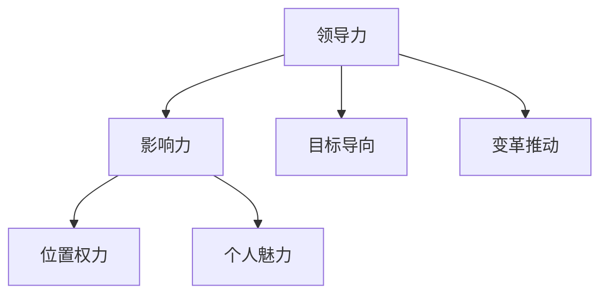

                 


### 第1章：领导力的定义与重要性

#### 背景介绍

在当今快速变化和竞争激烈的工作环境中，领导力的重要性愈发凸显。领导力不仅仅是企业成功的关键，也是个人职业生涯发展的核心能力。有效的领导力可以激发团队潜力，推动组织创新，实现持续成长。

本章节将探讨领导力的定义，从不同的层次和类型出发，分析其重要性，并着重探讨自信在领导力中的角色。

#### 核心概念与联系

首先，我们需要明确几个核心概念：

1. **领导力**：领导力是指个人或团队引导和激励他人共同实现目标的能力。
2. **影响力**：影响力是领导力的一部分，它涉及如何通过非正式途径影响他人的行为和决策。
3. **目标导向**：领导者需要具备明确的目标导向，这有助于引导团队朝正确的方向前进。
4. **变革推动**：领导者在组织变革中起着关键作用，他们需要推动变革并使团队适应变化。

接下来，我们可以使用Mermaid流程图来展示这些概念之间的关系：



#### 核心算法原理讲解

为了深入理解领导力，我们可以将领导力看作是一种算法。以下是领导力的基本算法原理：

```python
def leadership_algorithm():
    # 明确目标
    set_goals()

    # 分析当前状态
    analyze_context()

    # 制定策略
    create_strategy()

    # 激励团队
    motivate_team()

    # 监控进度
    monitor_progress()

    # 应对挑战
    handle_challenges()
```

#### 数学模型和公式

在领导力的实践中，数学模型和公式可以帮助我们更好地理解领导力的效果。例如，我们可以使用以下公式来评估领导力的有效性：

```latex
L = f(C, M, T)
```

其中，\(L\) 代表领导力，\(C\) 代表沟通能力，\(M\) 代表管理能力，\(T\) 代表团队合作能力。通过调整这些参数，我们可以优化领导力效果。

#### 详细讲解与举例说明

让我们通过一个例子来说明领导力在实践中的应用。

**例子：** 某公司的项目经理需要领导一个跨部门团队完成一个复杂的软件开发项目。

1. **明确目标**：项目经理首先需要明确项目的目标，例如，在规定时间内完成软件的开发和测试。

2. **分析当前状态**：项目经理需要分析团队的能力、资源状况，以及项目的风险和挑战。

3. **制定策略**：项目经理需要制定详细的开发计划，包括任务分配、时间表和里程碑。

4. **激励团队**：项目经理需要通过激励措施，如奖励和认可，来提高团队的士气和动力。

5. **监控进度**：项目经理需要定期检查项目的进展，及时调整计划，确保项目按时完成。

6. **应对挑战**：在项目执行过程中，项目经理需要及时解决出现的问题，确保项目顺利推进。

通过以上步骤，项目经理可以有效地领导团队完成项目。

#### 最佳实践 Tips

1. **不断学习和成长**：领导者需要不断学习新知识和技能，以适应不断变化的环境。

2. **建立信任**：领导者需要建立与团队成员之间的信任关系，这有助于提高团队的凝聚力和合作效率。

3. **积极倾听**：领导者需要积极倾听团队成员的意见和建议，这有助于更好地理解团队的需求和问题。

4. **灵活应对**：领导者需要具备灵活应对变化的能力，以适应不断变化的市场和环境。

### 小结

本章我们探讨了领导力的定义和重要性，从不同层次和类型出发，分析了领导力的核心概念和联系。通过数学模型和公式，我们深入理解了领导力的效果，并通过实际案例展示了领导力在实践中的应用。在下一章，我们将进一步探讨领导者的核心能力，包括沟通技巧、决策能力和团队建设与管理。敬请期待。作者：AI天才研究院/AI Genius Institute & 禅与计算机程序设计艺术 /Zen And The Art of Computer Programming

