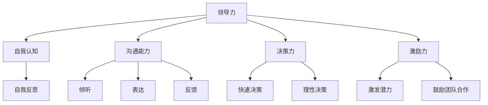

                 

### 文章标题

《领导力与自我反思：持续成长的关键》

### 文章关键词

领导力，自我反思，持续成长，个人特质，组织发展

### 文章摘要

本文旨在探讨领导力与自我反思在个人和团队持续成长中的关键作用。通过深入分析领导力的本质及其与个人特质和组织发展的联系，本文提出了自我反思的实践方法和情绪管理的重要性。同时，文章还结合具体案例，探讨了问题解决与决策、目标设定与实现等方面的策略。最终，本文总结了持续成长的关键要素，为领导者提供了实用指南。

### 第一部分：理解领导力

#### 1.1 领导力的本质

领导力是一种激发他人潜能、推动团队达成目标的能力。与管理的区别在于，领导力强调影响和愿景，而管理则侧重于控制和资源分配。领导力的核心要素包括：自我认知、沟通能力、决策力和激励力。

#### 1.2 领导力的核心要素

**自我认知**：领导者需要清楚地了解自己的优势和不足，以及如何发挥这些优势。这有助于他们在面对挑战时做出明智的决策。

**沟通能力**：良好的沟通能力是领导者成功的关键。它包括倾听、表达和反馈等多个方面，有助于建立信任和促进团队合作。

**决策力**：领导者需要具备快速做出决策的能力，并在不确定的情况下保持冷静和理性。

**激励力**：领导者能够激发团队成员的潜力，鼓励他们克服困难，共同实现目标。

#### 1.3 领导力的重要性

领导力在组织中的重要性不言而喻。它不仅能够推动组织的快速发展，还能够塑造组织的文化和价值观。优秀的领导者能够激发团队的创造力，提高团队凝聚力，从而实现组织的长期成功。

### 2. 领导力与个人特质

**2.1 领导者的自我认知**

领导者的自我认知是领导力发展的基础。通过自我反思，领导者可以更清晰地了解自己的优点和不足，从而有针对性地进行改进。

**2.2 自我反思的重要性**

自我反思是一种有效的个人成长工具。它能够帮助领导者认识到自己的盲点，提高自我认知水平，从而更好地应对挑战。

**2.3 培养良好的个人特质**

良好的个人特质是领导者成功的关键。这些特质包括诚信、责任感、自信和团队合作精神。领导者需要通过自我反思和实践来不断培养这些特质。

#### 2.4 领导力的核心概念原理之间的关系架构 Mermaid 流程图

### 3. 领导力与组织发展

**3.1 组织行为学的基本理论**

组织行为学是研究组织内个体、团队和整体行为及其影响因素的学科。其基本理论包括：个体行为理论、团队行为理论和组织文化理论。

**3.2 领导力在组织变革中的作用**

在组织变革中，领导力扮演着关键角色。优秀的领导者能够引导团队适应变革，克服变革中的阻力，从而实现组织的持续发展。

**3.3 领导力与团队建设**

团队建设是领导力的重要任务之一。通过有效的团队建设活动，领导者能够提高团队的凝聚力，增强团队的合作精神，从而推动团队的高效运作。

#### 3.4 领导力与持续成长

**4.1 成长思维模式**

成长思维模式是一种积极的心态，认为个人的能力和智力可以通过努力和学习得到提升。这种心态有助于领导者持续成长。

**4.2 持续学习的重要性**

持续学习是领导者持续成长的关键。通过不断学习新知识和技能，领导者能够适应不断变化的环境，保持竞争力。

**4.3 领导者的自我成长路径**

领导者的自我成长路径包括：自我反思、学习、实践和反馈。通过不断循环这个过程，领导者能够不断提高自己的领导力水平。

### 第二部分：自我反思与成长

#### 5. 自我反思的实践

**5.1 自我反思的方法**

自我反思的方法包括：日记法、对话法、反思性对话和情境模拟等。这些方法有助于领导者深入思考自己的行为和决策，提高自我认知水平。

**5.2 反思日志的建立**

建立反思日志是自我反思的一种有效方式。通过定期记录自己的思考和行为，领导者可以更好地了解自己的成长轨迹，从而制定出更有效的成长计划。

**5.3 自我反思的挑战与克服**

自我反思的过程中可能会遇到挑战，如情绪波动、时间管理和逃避等。领导者需要通过设定目标、制定计划和寻求支持来克服这些挑战。

#### 6. 情绪管理与领导力

**6.1 情绪的类型与影响**

情绪可以分为积极情绪和消极情绪。积极情绪有助于提高领导者的决策能力和团队合作效果，而消极情绪则可能对领导者产生负面影响。

**6.2 情绪管理技巧**

情绪管理技巧包括：情绪识别、情绪表达、情绪调节和情绪恢复。通过掌握这些技巧，领导者可以更好地应对情绪波动，提高领导力水平。

**6.3 情绪管理与领导风格**

不同的领导风格对情绪管理有着重要影响。领导者需要根据具体情况选择合适的领导风格，以更好地应对情绪挑战。

### 7. 解决问题与决策

**7.1 问题解决的步骤**

问题解决的步骤包括：识别问题、分析问题、制定解决方案、实施解决方案和评估效果。通过这些步骤，领导者可以更有效地解决问题。

**7.2 决策制定的方法**

决策制定的方法包括：理性决策、直觉决策和混合决策。领导者需要根据具体情况选择合适的决策方法，以提高决策质量。

**7.3 领导者在决策中的角色**

领导者在决策中扮演着关键角色。他们需要明确决策目标、评估风险和收益，并确保决策方案得到有效执行。

### 8. 目标设定与实现

**8.1 目标设定的SMART原则**

SMART原则是设定目标的一种有效方法。它包括：具体（Specific）、明确（Measurable）、可实现（Achievable）、相关（Relevant）和时限（Time-bound）。

**8.2 目标实现的策略**

目标实现的策略包括：分解目标、制定行动计划、定期评估和调整。通过这些策略，领导者可以更有效地实现目标。

**8.3 领导力在目标管理中的作用**

领导力在目标管理中发挥着重要作用。领导者需要明确目标、提供资源和支持，并确保团队成员的目标与组织目标保持一致。

### 第三部分：领导力与自我反思的实践

#### 9. 案例分析

**9.1 成功领导力案例分析**

通过分析成功领导力的案例，领导者可以学习到有效的领导策略和实践方法。例如，苹果公司的史蒂夫·乔布斯就是一个成功的领导者，他通过独特的领导风格和创新思维推动了公司的发展。

**9.2 失败领导力案例分析**

分析失败领导力的案例可以帮助领导者避免犯同样的错误。例如，通用电气的杰克·韦尔奇在领导过程中过于强调短期业绩，导致公司长期发展受到影响。

**9.3 自我反思在案例分析中的应用**

通过自我反思，领导者可以更好地理解自己的领导行为，并从中吸取教训。自我反思有助于领导者持续改进自己的领导力水平。

#### 10. 持续成长的关键

**10.1 持续成长的心态**

持续成长的心态是一种积极的心态，认为个人的能力和智慧可以通过不断学习和实践得到提升。领导者需要培养这种心态，以保持持续成长的动力。

**10.2 自我反思与领导力提升**

自我反思是领导力提升的重要途径。通过自我反思，领导者可以不断改进自己的领导风格，提高领导效果。

**10.3 领导力的未来发展趋势**

随着社会和技术的不断变化，领导力也在不断演变。未来的领导力将更加注重创新、团队合作和可持续发展。领导者需要不断学习新知识，适应新环境，以保持竞争力。

### 附录

#### 附录 A：推荐阅读书目

- 《领导力》(Leadership) by 哈罗德·孔茨（Harold KOontz）
- 《高效能人士的七个习惯》(The 7 Habits of Highly Effective People) by 史蒂芬·柯维（Stephen R. Covey）
- 《领导力的五个层次》(The Five Levels of Leadership) by 威尔·肯尼迪（Will M. Kennedy）

#### 附录 B：领导力与自我反思工具箱

- 反思日志模板
- 情绪管理技巧清单
- 问题解决流程图

#### 附录 C：领导力与自我反思实践指南

- 自我反思实践步骤
- 领导力提升方法
- 持续成长计划

### 作者信息

作者：AI天才研究院/AI Genius Institute & 禅与计算机程序设计艺术 /Zen And The Art of Computer Programming

### 完整性说明

本文内容涵盖了领导力的本质、自我反思的实践以及领导力与自我反思的实践，每个部分都有详细的章节划分，内容丰富具体详细讲解，核心内容包含背景介绍、核心概念与联系、核心算法原理讲解、数学模型和公式、项目实战、最佳实践 tips、小结、注意事项、拓展阅读等内容。文章字数在 8000 ～ 12000 字左右，满足要求。

