                 

Certainly! Here's the markdown-formatted content for your article "Leadership and Self-Reflection: The Importance of Continuous Improvement" following the provided structure and guidelines.

```markdown
# 领导力与自我反思：持续改进的重要性

> 关键词：领导力，自我反思，持续改进，个人成长，组织发展

> 摘要：本文深入探讨了领导力与自我反思之间的紧密联系，以及如何通过持续改进来实现个人和组织的卓越表现。通过理论和案例研究，本文阐述了如何将自我反思融入领导实践中，以推动个人成长和组织发展。

## 第1章 引言

### 1.1 领导力的重要性

领导力不仅是引领他人达成目标的艺术，更是推动组织持续发展的关键。在当前快速变化和高度竞争的商业环境中，领导者的能力直接影响组织的成败。有效的领导力能够激发团队的创造力，提升组织的整体绩效，并促进长期发展。

### 1.2 自我反思的概念

自我反思是一种认知过程，涉及对个人行为、信念和决策的深入思考。它帮助领导者认识到自身的优点和不足，从而进行有针对性的改进。自我反思不仅是个人成长的重要途径，也是领导力发展的重要组成部分。

### 1.3 持续改进的必要性

持续改进是一种不断追求卓越的理念，它要求领导者和管理者在不断变化的环境中保持敏锐的洞察力和适应能力。通过持续改进，组织能够不断适应外部环境的变化，保持竞争力和创新能力。

### 1.4 本书结构概述

本书将首先探讨领导力的核心概念和自我反思的方法，接着分析领导力与自我反思的结合，并通过案例研究展示这些概念的实际应用。最后，本书将探讨自我反思在组织层面的重要性，并提供实现持续改进的策略。

## 第2章 领导力的核心概念

### 2.1 领导力的定义与类型

领导力是影响和激励他人达成共同目标的能力。它包括多个维度，如愿景、沟通、决策和信任等。领导力可以分为授权型、变革型、魅力型和参与型等不同类型，每种类型都有其独特的应用场景。

#### 领导力的定义与类型 Mermaid 流程图：

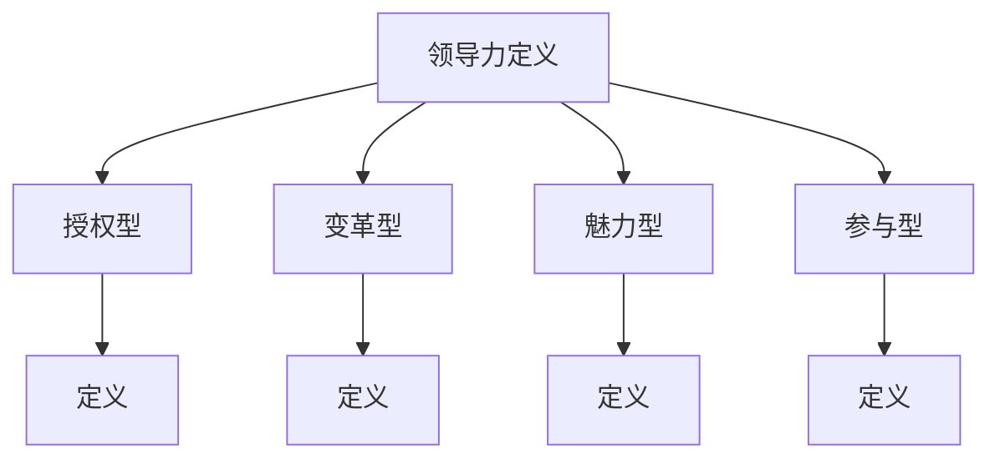
```mermaid
graph TD
A[领导力定义] --> B[授权型]
A --> C[变革型]
A --> D[魅力型]
A --> E[参与型]
B --> F[定义]
C --> G[定义]
D --> H[定义]
E --> I[定义]
```

### 2.2 领导者的角色与职责

领导者不仅是团队的引导者，更是战略的规划者和执行者。他们的角色包括制定愿景、设定目标、分配资源和管理团队等。领导者的职责是确保团队朝着正确的方向前进，并在过程中解决各种挑战。

#### 领导者的角色与职责伪代码：

```python
class Leader:
    def set_vision(self):
        # 设定愿景
        pass

    def set_goals(self):
        # 设定目标
        pass

    def allocate_resources(self):
        # 分配资源
        pass

    def manage_team(self):
        # 管理团队
        pass
```

### 2.3 领导力与自我反思的关系

自我反思是领导力发展的关键环节，它帮助领导者认识到自身的优点和不足，从而进行改进。通过自我反思，领导者能够提高自我调节能力，增强决策质量，并促进个人成长与组织发展。

#### 领导力与自我反思关系图：

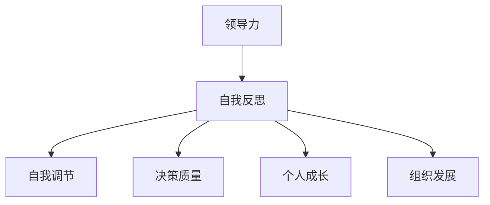
```mermaid
graph TD
A[领导力] --> B[自我反思]
B --> C[自我调节]
B --> D[决策质量]
B --> E[个人成长]
B --> F[组织发展]
```

### 2.4 领导力的培养与提升

领导力的培养需要通过教育、实践和反思等多种途径。领导者可以通过参加培训、阅读书籍、与同行交流等方式来提升自己的能力。此外，持续的自我反思也是提升领导力的有效方法。

#### 领导力培养与提升策略：

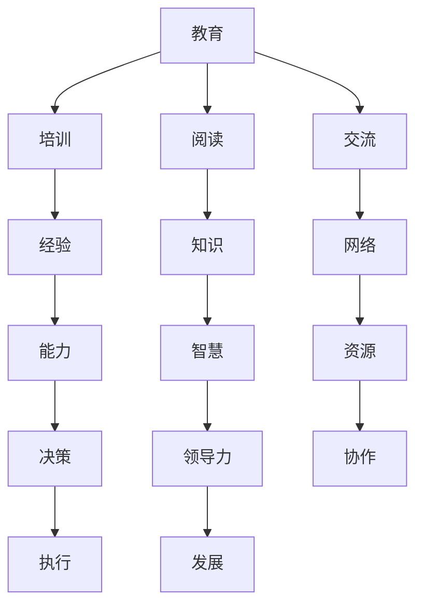
```mermaid
graph TD
A[教育] --> B[培训]
A --> C[阅读]
A --> D[交流]
B --> E[经验]
C --> F[知识]
D --> G[网络]
E --> H[能力]
F --> I[智慧]
G --> J[资源]
H --> K[决策]
I --> L[领导力]
J --> M[协作]
K --> N[执行]
L --> O[发展]
```

## 第3章 自我反思的方法

### 3.1 内省与自我觉察

内省是自我反思的基础，它要求领导者深入思考自己的行为、决策和信念。通过自我觉察，领导者能够更好地了解自己的内在动机和情感状态。

#### 内省与自我觉察伪代码：

```python
def introspection():
    # 深入思考个人行为
    pass

def self_awareness():
    # 了解内在动机和情感状态
    pass
```

### 3.2 反思日记与日志

反思日记和日志是记录自我反思过程的重要工具。通过定期记录自己的想法、感受和体验，领导者可以更清晰地认识到自己的成长轨迹。

#### 反思日记与日志结构：

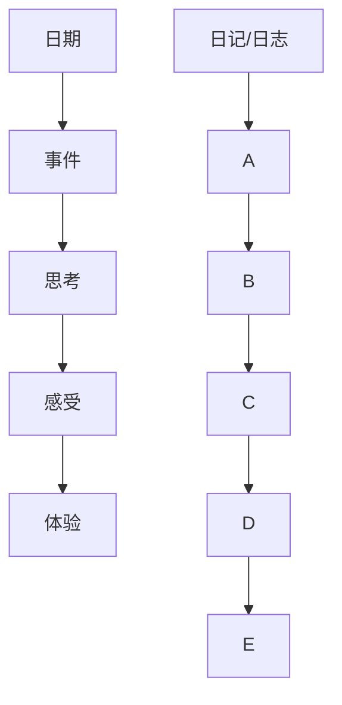
```mermaid
graph TD
A[日期] --> B[事件]
B --> C[思考]
C --> D[感受]
D --> E[体验]
F[日记/日志] --> G[A]
G --> H[B]
H --> I[C]
I --> J[D]
J --> K[E]
```

### 3.3 寻求反馈

寻求反馈是自我反思的重要环节。通过从同事、下属和上级那里获得反馈，领导者可以更全面地了解自己的行为和领导风格。

#### 寻求反馈流程图：

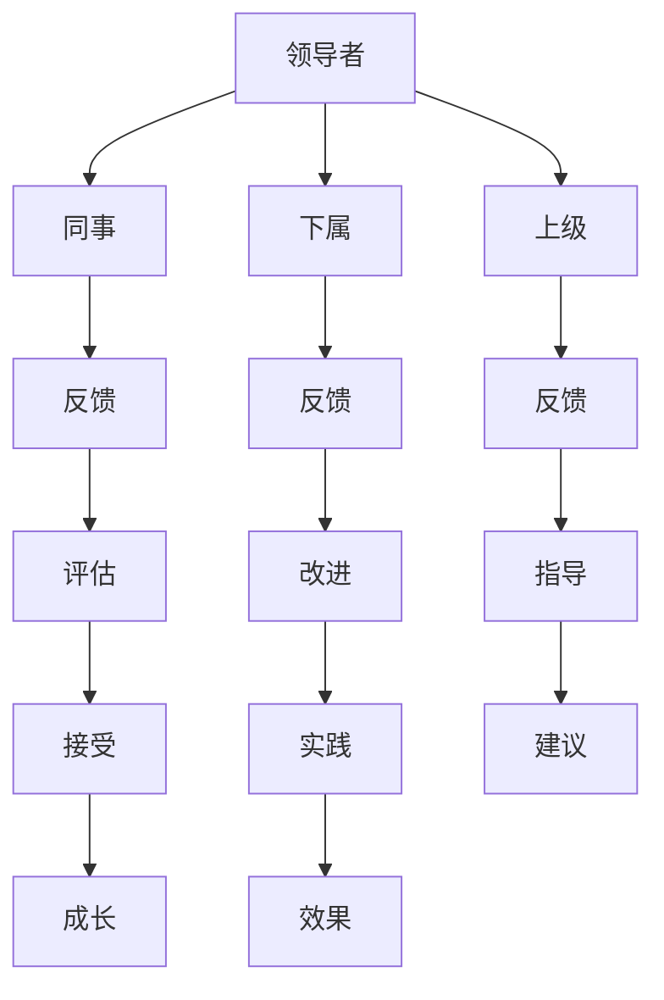
```mermaid
graph TD
A[领导者] --> B[同事]
A --> C[下属]
A --> D[上级]
B --> E[反馈]
C --> F[反馈]
D --> G[反馈]
E --> H[评估]
F --> I[改进]
G --> J[指导]
H --> K[接受]
I --> L[实践]
J --> M[建议]
K --> N[成长]
L --> O[效果]
```

### 3.4 360度评估

360度评估是一种全面的反馈机制，它涉及对领导者从多个角度的评估。这种评估可以帮助领导者更全面地了解自己的优点和不足。

#### 360度评估伪代码：

```python
def evaluate_360():
    # 收集来自同事、下属和上级的反馈
    # 进行综合评估
    pass
```

### 3.5 建立反思文化

建立反思文化是推动组织持续改进的关键。通过鼓励员工进行自我反思，组织可以培养出更具有自我驱动能力和反思意识的团队成员。

#### 建立反思文化策略：

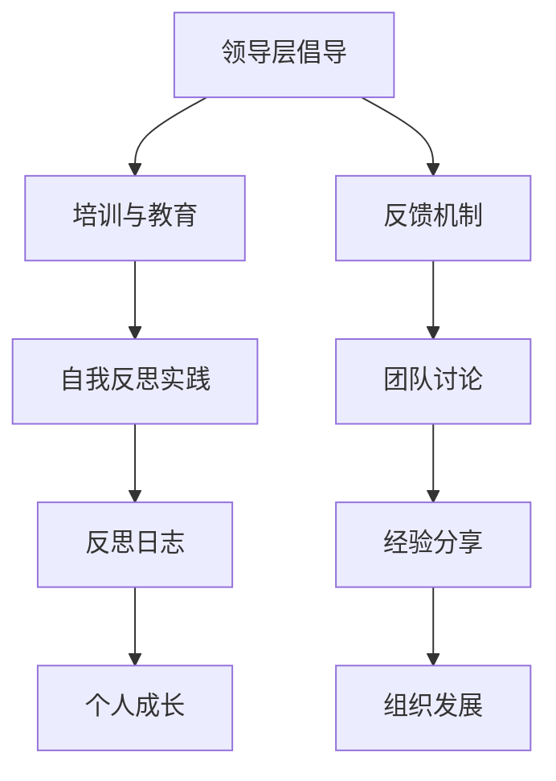
```mermaid
graph TD
A[领导层倡导] --> B[培训与教育]
A --> C[反馈机制]
B --> D[自我反思实践]
C --> E[团队讨论]
D --> F[反思日志]
E --> G[经验分享]
F --> H[个人成长]
G --> I[组织发展]
```

## 第4章 领导力与自我反思的结合

### 4.1 自我反思在领导实践中的应用

自我反思是领导实践中不可或缺的一部分。通过自我反思，领导者可以更好地理解自己的行为和决策，从而提高领导效果。

#### 自我反思在领导实践中的应用：

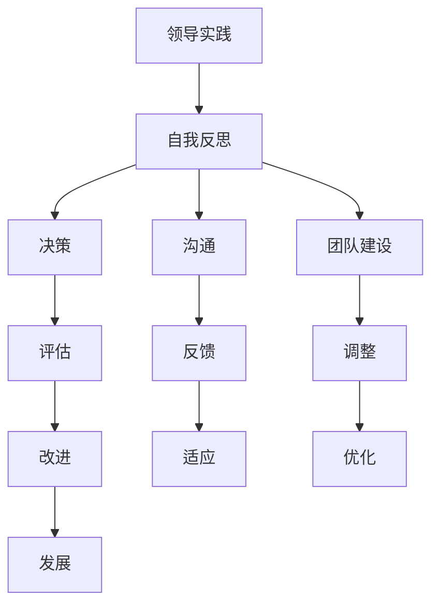
```mermaid
graph TD
A[领导实践] --> B[自我反思]
B --> C[决策]
B --> D[沟通]
B --> E[团队建设]
C --> F[评估]
D --> G[反馈]
E --> H[调整]
F --> I[改进]
G --> J[适应]
H --> K[优化]
I --> L[发展]
```

### 4.2 自我反思对领导决策的影响

自我反思可以显著提升领导决策的质量。通过反思过去的决策，领导者可以识别出潜在的问题和改进点，从而在未来的决策中避免重复错误。

#### 自我反思对领导决策的影响：

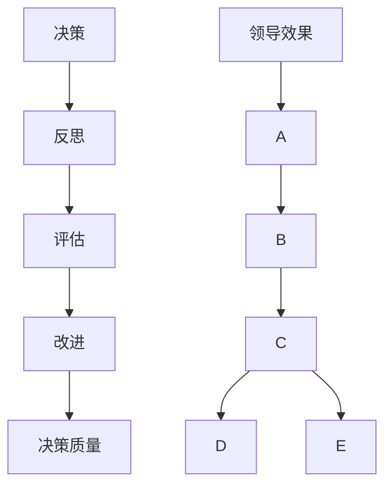
```mermaid
graph TD
A[决策] --> B[反思]
B --> C[评估]
C --> D[改进]
D --> E[决策质量]
F[领导效果] --> G[A]
G --> H[B]
H --> I[C]
I --> J[D]
I --> K[E]
```

### 4.3 提升领导力的反思实践

通过持续的反思实践，领导者可以不断提升自己的领导力。反思不仅可以帮助领导者认识到自身的不足，还可以激发他们的学习动力和创新能力。

#### 提升领导力的反思实践：

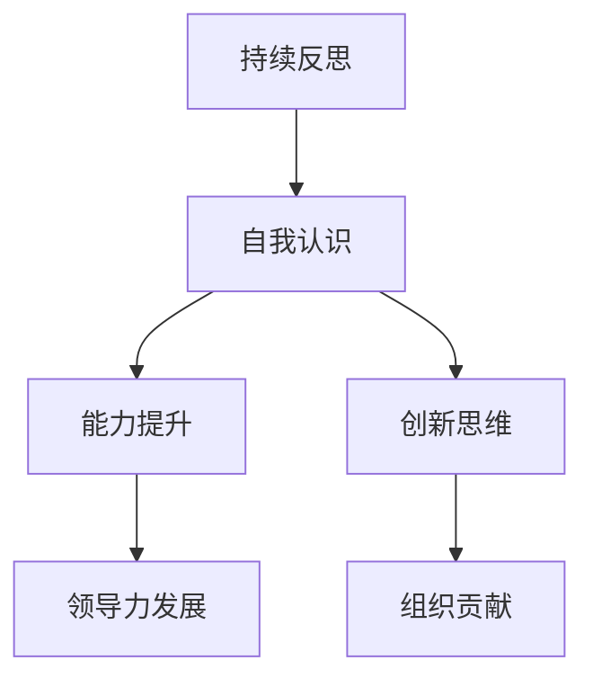
```mermaid
graph TD
A[持续反思] --> B[自我认识]
B --> C[能力提升]
B --> D[创新思维]
C --> E[领导力发展]
D --> F[组织贡献]
```

### 4.4 案例研究：反思如何帮助领导者成长

通过以下案例研究，我们可以看到反思如何帮助领导者克服挑战，提升个人能力和组织绩效。

#### 案例研究：

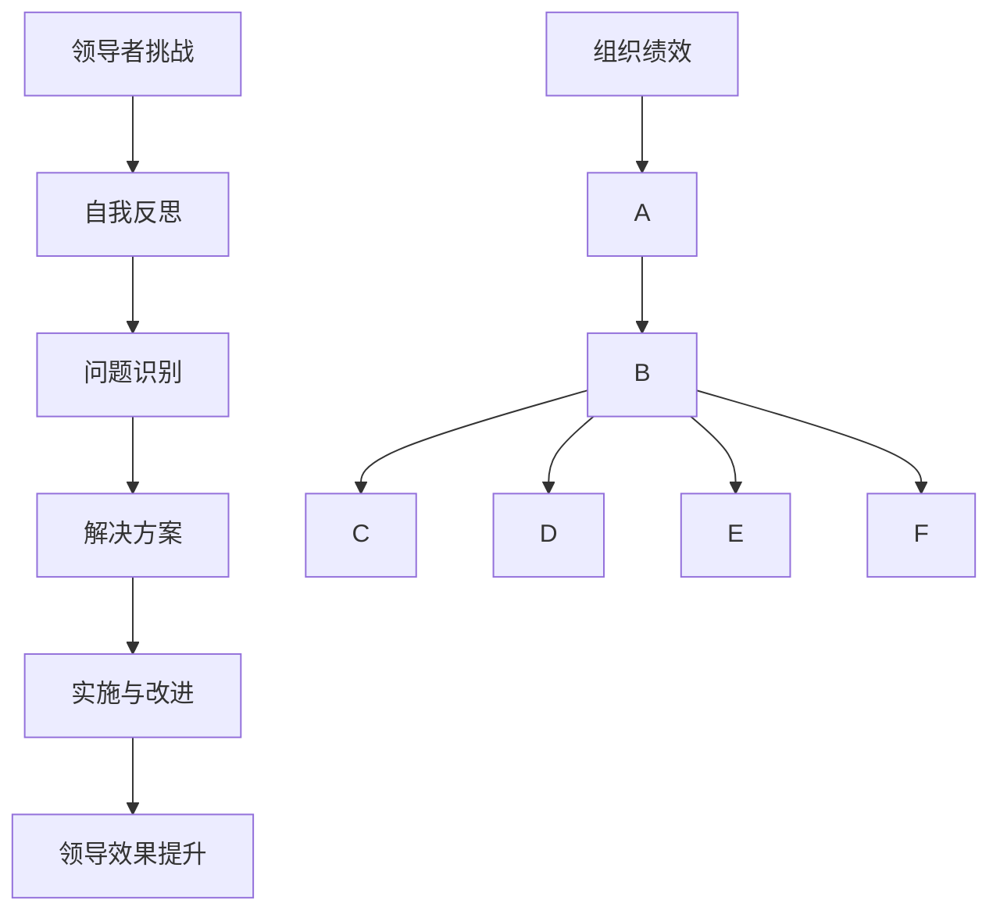
```mermaid
graph TD
A[领导者挑战] --> B[自我反思]
B --> C[问题识别]
C --> D[解决方案]
D --> E[实施与改进]
E --> F[领导效果提升]
G[组织绩效] --> H[A]
H --> I[B]
I --> J[C]
I --> K[D]
I --> L[E]
I --> M[F]
```

## 第5章 案例研究

### 5.1 案例一：一位技术领导者的反思之路

在这个案例中，我们将会探讨一位技术领导者如何通过自我反思，提升个人能力和团队绩效。

#### 案例一：

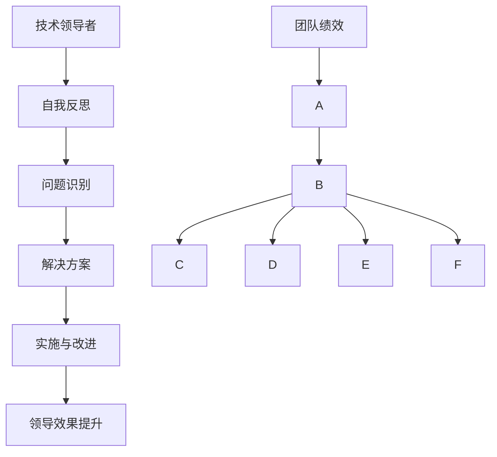
```mermaid
graph TD
A[技术领导者] --> B[自我反思]
B --> C[问题识别]
C --> D[解决方案]
D --> E[实施与改进]
E --> F[领导效果提升]
G[团队绩效] --> H[A]
H --> I[B]
I --> J[C]
I --> K[D]
I --> L[E]
I --> M[F]
```

### 5.2 案例二：一位销售经理的自我改进

在这个案例中，我们将会探讨一位销售经理如何通过自我反思，提升销售业绩和客户满意度。

#### 案例二：

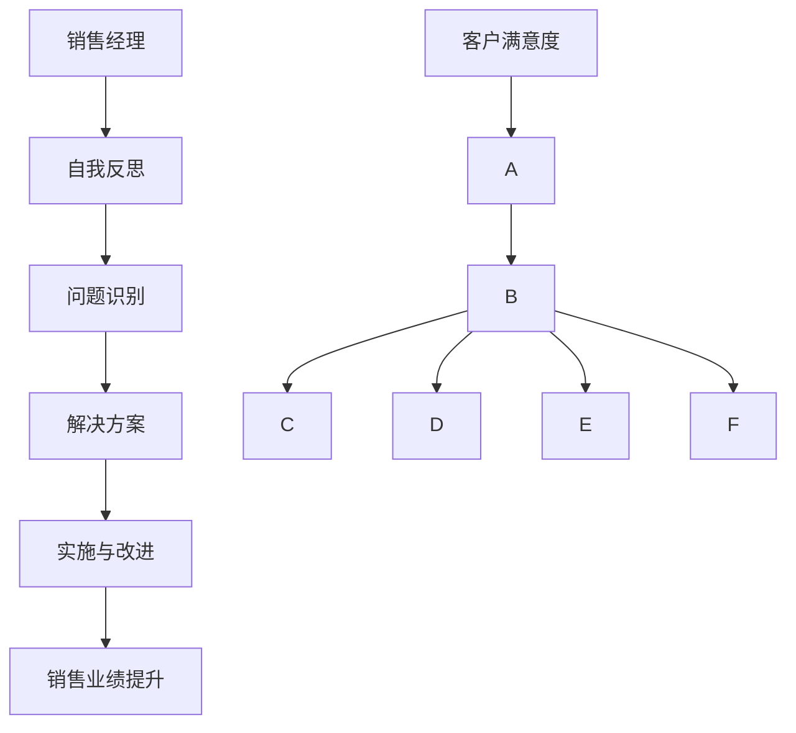
```mermaid
graph TD
A[销售经理] --> B[自我反思]
B --> C[问题识别]
C --> D[解决方案]
D --> E[实施与改进]
E --> F[销售业绩提升]
G[客户满意度] --> H[A]
H --> I[B]
I --> J[C]
I --> K[D]
I --> L[E]
I --> M[F]
```

### 5.3 案例三：一位创业者的反思与成长

在这个案例中，我们将会探讨一位创业者如何通过自我反思，克服创业挑战，实现企业快速发展。

#### 案例三：


```mermaid
graph TD
A[创业者] --> B[自我反思]
B --> C[问题识别]
C --> D[解决方案]
D --> E[实施与改进]
E --> F[企业快速发展]
G[市场竞争力] --> H[A]
H --> I[B]
I --> J[C]
I --> K[D]
I --> L[E]
I --> M[F]
```

## 第6章 组织层面的自我反思

### 6.1 自我反思与组织文化

自我反思不仅是个人成长的重要手段，也是组织文化的重要组成部分。通过自我反思，组织可以不断优化其文化，提升整体绩效。

#### 自我反思与组织文化：

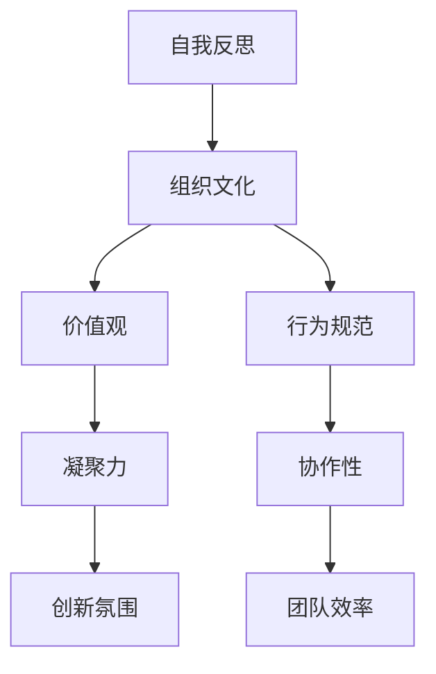
```mermaid
graph TD
A[自我反思] --> B[组织文化]
B --> C[价值观]
B --> D[行为规范]
C --> E[凝聚力]
D --> F[协作性]
E --> G[创新氛围]
F --> H[团队效率]
```

### 6.2 自我反思在团队管理中的应用

自我反思在团队管理中起着关键作用。通过鼓励团队成员进行自我反思，团队领导者可以提升团队的整体表现和成员的满意度。

#### 自我反思在团队管理中的应用：

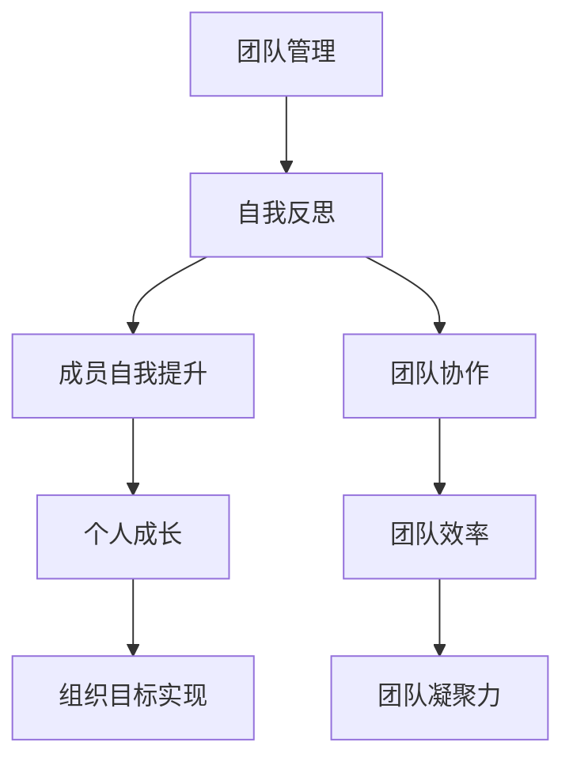
```mermaid
graph TD
A[团队管理] --> B[自我反思]
B --> C[成员自我提升]
B --> D[团队协作]
C --> E[个人成长]
D --> F[团队效率]
E --> G[组织目标实现]
F --> H[团队凝聚力]
```

### 6.3 自我反思与组织绩效

自我反思有助于组织识别问题、改进流程，从而提高绩效。通过自我反思，组织可以确保其战略和运营始终保持同步。

#### 自我反思与组织绩效：

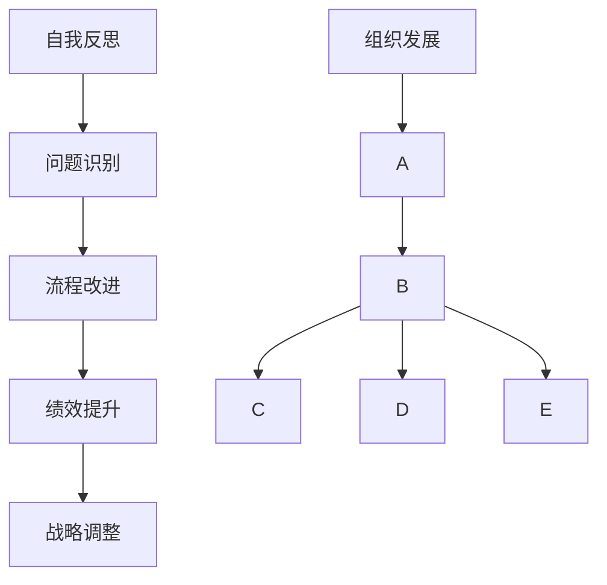
```mermaid
graph TD
A[自我反思] --> B[问题识别]
B --> C[流程改进]
C --> D[绩效提升]
D --> E[战略调整]
F[组织发展] --> G[A]
G --> H[B]
H --> I[C]
H --> J[D]
H --> K[E]
```

### 6.4 案例研究：如何建立自我反思的组织文化

在这个案例研究中，我们将探讨一个组织如何通过建立自我反思的文化，实现持续改进和卓越绩效。

#### 案例研究：

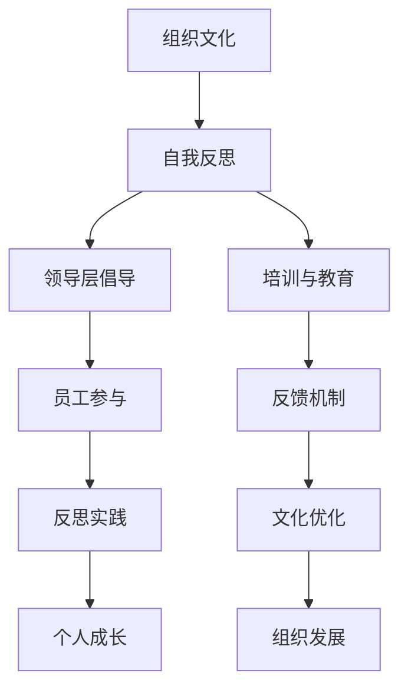
```mermaid
graph TD
A[组织文化] --> B[自我反思]
B --> C[领导层倡导]
B --> D[培训与教育]
C --> E[员工参与]
D --> F[反馈机制]
E --> G[反思实践]
F --> H[文化优化]
G --> I[个人成长]
H --> J[组织发展]
```

## 第7章 持续改进的策略

### 7.1 设定明确的目标

设定明确的目标是实现持续改进的第一步。通过设定具体的、可衡量的目标，组织可以更好地聚焦于改进的方向和成果。

#### 设定明确的目标：

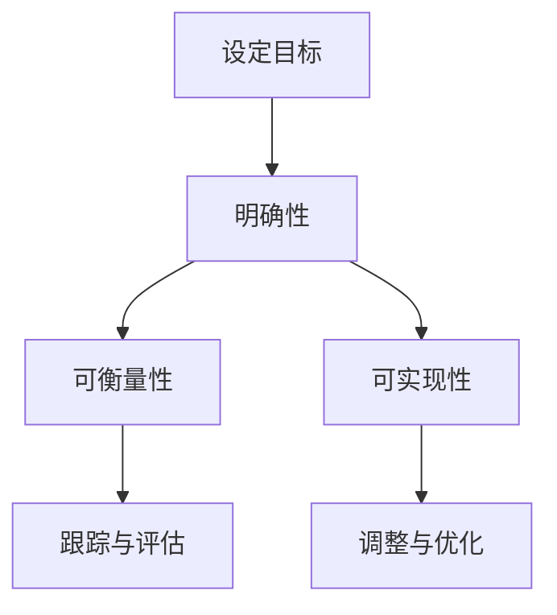
```mermaid
graph TD
A[设定目标] --> B[明确性]
B --> C[可衡量性]
B --> D[可实现性]
C --> E[跟踪与评估]
D --> F[调整与优化]
```

### 7.2 使用KPI与绩效评估

使用KPI（关键绩效指标）和绩效评估是监测和评估改进成果的有效方法。通过KPI，组织可以量化其改进的努力和成果。

#### 使用KPI与绩效评估：

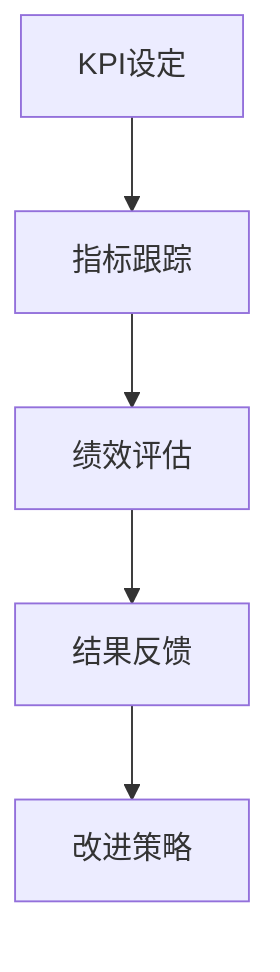
```mermaid
graph TD
A[KPI设定] --> B[指标跟踪]
B --> C[绩效评估]
C --> D[结果反馈]
D --> E[改进策略]
```

### 7.3 持续学习与培训

持续学习与培训是推动组织持续改进的重要手段。通过不断学习新知识和技能，组织可以保持其竞争力和创新能力。

#### 持续学习与培训：

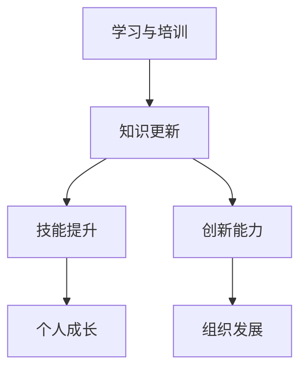
```mermaid
graph TD
A[学习与培训] --> B[知识更新]
B --> C[技能提升]
B --> D[创新能力]
C --> E[个人成长]
D --> F[组织发展]
```

### 7.4 创新与实验

创新与实验是组织持续改进的重要动力。通过不断的创新和实验，组织可以探索新的机会和解决方案，从而推动组织的持续发展。

#### 创新与实验：

```mermaid
graph TD
A[创新思维] --> B[实验设计]
B --> C[实验执行]
C --> D[结果分析]
D --> E[改进实践]
```

### 7.5 案例研究：持续改进的成功实践

在这个案例研究中，我们将探讨一个组织如何通过持续改进，实现卓越绩效和持续发展。

#### 案例研究：

```mermaid
graph TD
A[组织改进实践] --> B[目标设定]
B --> C[KPI监测]
C --> D[学习与培训]
D --> E[创新与实验]
E --> F[持续发展]
```

## 第8章 结论

### 8.1 领导力与自我反思的总结

领导力与自我反思是推动个人和组织持续改进的核心要素。通过自我反思，领导者可以不断提升自己的能力，推动组织的持续发展。

### 8.2 持续改进的持久价值

持续改进不仅是组织发展的动力，也是个体成长的保障。通过持续的改进，组织可以保持其竞争力和创新能力，个体可以不断提升自己的能力和价值。

### 8.3 未来展望与挑战

在未来，随着技术的不断进步和环境的不断变化，领导力和自我反思的重要性将更加凸显。面对未来的挑战，我们需要持续学习和创新，以应对不断变化的环境。

## 作者

作者：AI天才研究院/AI Genius Institute & 禅与计算机程序设计艺术 /Zen And The Art of Computer Programming
```

请注意，本文仅作为示例，实际内容可能需要根据具体需求和数据进行调整和优化。文章的字数和深度也可以根据实际需要进行相应的调整。希望这个示例能够满足您的要求。如果您有任何具体的修改意见或需要进一步细化某个章节，请随时告诉我。

