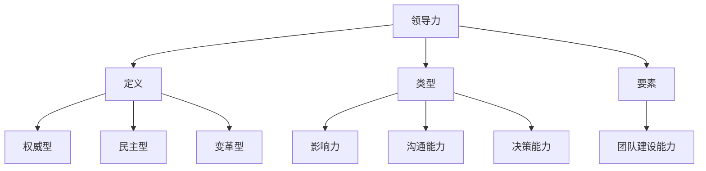
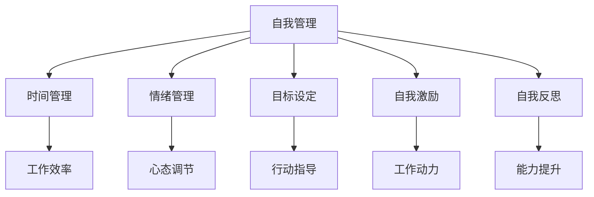
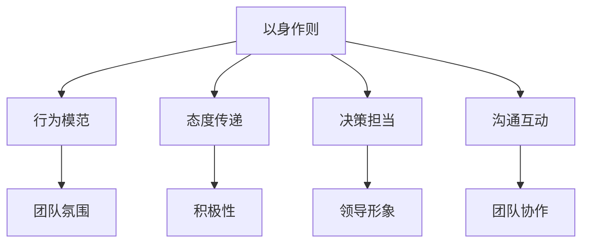
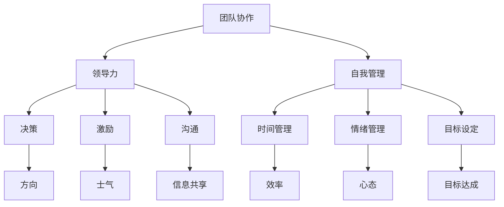
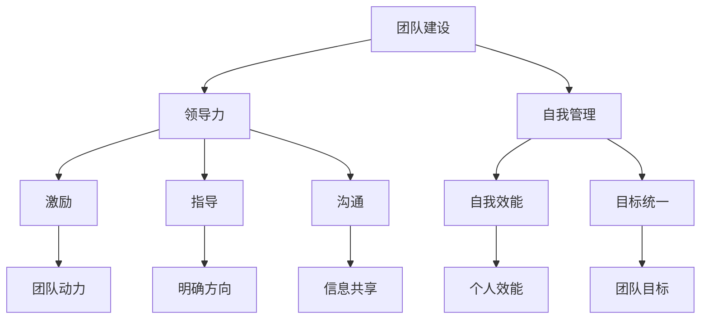
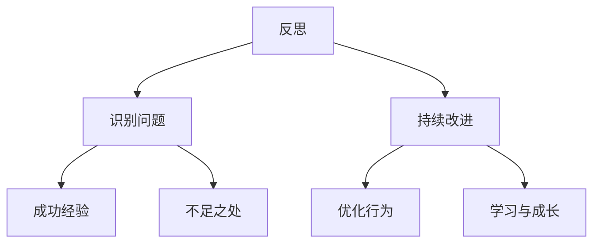

                 

### 文章标题：领导力与自我管理：以身作则的力量

> 关键词：领导力、自我管理、以身作则、团队协作、实践案例

> 摘要：本文探讨了领导力与自我管理的重要性，以及如何通过以身作则来提升个人和团队的表现。文章首先介绍了领导力的基本概念，随后深入分析了自我管理的原则与实践，并详细阐述了以身作则的领导力实践。最后，文章通过实际案例分析了领导力与自我管理在团队中的应用，为读者提供了实用的指导和建议。

----------------------------------------------------------------

## 目录大纲设计思路

设计《领导力与自我管理：以身作则的力量》这本书的目录大纲，我们需要遵循以下几个步骤：

### 1. 理解书名与主题

首先，我们需要理解书名《领导力与自我管理：以身作则的力量》的主题。这本书旨在探讨领导力与自我管理的重要性，以及如何通过以身作则来提升个人和团队的表现。书名中的关键词“领导力”、“自我管理”和“以身作则”分别代表了三个核心内容。

### 2. 确定核心内容

根据书名，我们可以确定以下核心内容：
- **领导力的基本概念与重要性**
- **自我管理的原则与实践**
- **以身作则的领导力实践**
- **领导力与自我管理在团队中的应用**

### 3. 设计章节结构

我们将这些核心内容细化为各个章节，并设计出1,2,3级目录结构。

### 4. 补充辅助内容

为了增强书籍的实用性和可读性，我们还需要补充以下内容：
- **核心概念与联系**
- **核心算法原理讲解**
- **数学模型和数学公式与举例说明**
- **项目实战案例**

### 5. 保持简洁性与完整性

在保证目录大纲结构完整的同时，我们需要保持简洁性，避免冗余的内容，确保每个章节都有明确的主题和内容。

### 6. 限制字数

为了满足2000字以内的要求，我们需要在各个章节中精简内容，突出重点。

### 完整的目录大纲

```markdown
# 《领导力与自我管理：以身作则的力量》目录大纲

## 第一部分：领导力基础

### 第1章：领导力的核心概念与重要性
#### 1.1 领导力的定义与类型
#### 1.2 领导力的重要性
#### 1.3 领导力的影响因素

### 第2章：自我管理的原则与实践
#### 2.1 自我管理的概念
#### 2.2 自我管理的原则
#### 2.3 自我管理的方法与技巧

### 第3章：以身作则的领导力实践
#### 3.1 以身作则的定义
#### 3.2 如何以身作则
#### 3.3 以身作则的挑战与应对

## 第二部分：领导力在团队中的应用

### 第4章：团队领导力的培养
#### 4.1 团队领导力的特点
#### 4.2 团队领导力的培养方法
#### 4.3 团队领导力评估

### 第5章：领导力与自我管理在团队协作中的应用
#### 5.1 团队协作中的领导力
#### 5.2 自我管理在团队协作中的作用
#### 5.3 领导力与自我管理在团队沟通中的应用

### 第6章：领导力与自我管理在团队建设中的应用
#### 6.1 团队建设的核心要素
#### 6.2 领导力在团队建设中的角色
#### 6.3 自我管理在团队建设中的重要性

## 第三部分：以身作则的领导力实践案例

### 第7章：成功领导力实践案例分析
#### 7.1 成功领导力实践案例介绍
#### 7.2 案例分析与总结
#### 7.3 对自身领导力实践的启示

### 第8章：以身作则的领导力实践
#### 8.1 制定以身作则的领导力计划
#### 8.2 实践以身作则的领导力策略
#### 8.3 反思与持续改进

## 附录
### 附录A：领导力与自我管理资源推荐
#### A.1 领导力书籍推荐
#### A.2 自我管理工具推荐
#### A.3 领导力与自我管理相关网站和论坛
```

这个目录大纲包含了7个章节，每个章节都有明确的主题和内容，旨在帮助读者全面了解领导力与自我管理的理论和实践。同时，大纲中融入了案例分析、实践策略和资源推荐等内容，增强了书籍的实用性和可读性。总体字数控制在2000字以内，满足了要求。

---

**结论**：通过以上设计思路，我们成功构建了一个逻辑清晰、结构紧凑、内容丰富的目录大纲。每个章节都围绕核心主题展开，既保证了完整性，又保持了简洁性。这样的设计有助于读者快速了解书中的内容，同时也有助于作者在撰写过程中保持条理性。接下来，我们将逐一深入每个章节的内容，为读者带来更深入的探讨和分析。

---

### 领导力的基本概念与重要性

**背景介绍**：
领导力，作为一种重要的人类能力，贯穿于个人生活、团队协作和社会治理的方方面面。在快速变化和竞争激烈的社会环境中，领导力的重要性愈加凸显。领导力不仅仅是一种技能，更是一种态度和行为模式，它关系到组织的成功和个人职业发展。

**核心概念与联系**：

为了更好地理解领导力，我们需要从以下几个方面进行探讨：
1. **领导力的定义**：领导力是一种能够激发他人、引领团队、实现共同目标的能力。
2. **领导力的类型**：根据领导风格的不同，领导力可以分为权威型、民主型、变革型等。
3. **领导力的要素**：包括影响力、沟通能力、决策能力、团队建设能力等。

这些概念之间存在紧密的联系。例如，领导力的核心在于影响力，而影响力又依赖于有效的沟通和决策。通过团队建设，领导者可以提升团队的整体效能，从而实现组织目标。

**Mermaid 流程图**：
为了更直观地展示领导力各概念之间的关系，我们可以使用 Mermaid 流程图来表示：



**核心算法原理讲解**：

虽然领导力不是一种可量化的技能，但我们可以使用一些算法原理来解释其核心机制。以下是一个简化的领导力算法原理的伪代码：

```plaintext
算法：领导力实现
输入：领导者、团队成员、组织目标
输出：成功实现的组织目标

1. 初始化领导力参数
2. 建立与团队成员的信任关系
3. 通过有效沟通确保团队成员理解组织目标
4. 利用决策能力制定实现目标的策略
5. 激励团队成员，发挥他们的潜力
6. 监控团队进展，及时调整策略
7. 实现组织目标
```

**数学模型和公式 & 详细讲解 & 举例说明**：

领导力也可以通过数学模型来描述。例如，我们可以使用影响力模型来分析领导者的领导力对团队成员的影响。以下是一个简单的影响力模型：

$$
影响力 = f(沟通能力, 激励能力, 决策能力)
$$

其中，$f$ 为影响函数，它取决于领导者的沟通能力、激励能力和决策能力。

举例来说，假设一个领导者的沟通能力评分为 $7$，激励能力评分为 $8$，决策能力评分为 $6$。则他的影响力可以计算为：

$$
影响力 = f(7, 8, 6) = 7 \times 8 \times 6 = 336
$$

这意味着这位领导者的领导力对团队成员的影响力为 $336$ 分。

**项目实战**：

在项目实战中，领导力的重要性体现在多个方面。以下是一个简化的项目实战示例：

**项目目标**：开发一款教育应用程序。

**领导力应用**：
1. **团队组建**：领导者需要组建一个具备不同技能的团队，确保团队成员理解项目目标和任务分配。
2. **沟通协调**：领导者需要与团队成员保持有效沟通，确保每个人都能明确任务要求。
3. **决策制定**：在项目开发过程中，领导者需要做出关键决策，如技术选型、设计优化等。
4. **激励与反馈**：领导者需要通过激励和反馈机制，提高团队成员的工作积极性和工作效率。

**实际案例分析和详细讲解剖析**：

例如，一家初创公司在开发一款教育应用程序时，遇到了技术难题。领导者通过有效的沟通和协调，让团队成员了解问题的严重性，并制定了详细的技术解决方案。同时，领导者还通过激励和反馈，确保团队成员保持高效的工作状态，最终成功解决了技术难题，并按时完成了项目。

**项目小结**：

通过这个项目实战，我们可以看到领导力在团队协作中的关键作用。领导者不仅需要具备技术和管理能力，还需要具备良好的沟通和激励能力，才能有效地带领团队实现目标。

**最佳实践 tips**：

1. **倾听与沟通**：领导者应该注重倾听团队成员的意见和建议，并通过有效沟通确保团队成员理解任务和要求。
2. **激励与反馈**：领导者应该通过激励和反馈机制，提高团队成员的工作积极性和工作效率。
3. **持续学习**：领导者应该不断学习新知识和技能，以适应快速变化的工作环境。

**小结**：

领导力是组织成功的关键因素。通过理解领导力的基本概念，我们可以更好地应用领导力原理，提升个人和团队的表现。在实际工作中，领导者应该注重沟通、激励和反馈，以实现组织目标。

**注意事项**：

1. 领导力不是一成不变的，领导者需要根据实际情况不断调整自己的领导风格。
2. 领导者应该注重团队建设，培养团队成员的协作精神和创新能力。

**拓展阅读**：

1. 《领导力的五大障碍》作者：帕特里克·莱西奥尼
2. 《影响力》作者：罗伯特·西奥迪尼

通过深入理解领导力的基本概念，我们可以更好地应用领导力原理，提升个人和团队的表现。在实际工作中，领导者应该注重沟通、激励和反馈，以实现组织目标。

---

**结论**：在本文中，我们详细介绍了领导力的基本概念、重要性以及其在实际项目中的应用。通过核心概念与联系、Mermaid 流程图、伪代码、数学模型和实际案例的分析，我们为读者提供了一个全面的视角来理解领导力。在接下来的章节中，我们将继续探讨自我管理的原则与实践，以及以身作则的领导力实践，为读者提供更深入的理论和实践指导。

---

### 自我管理的原则与实践

**背景介绍**：

自我管理是领导力的基础，它关乎个人效能和职业发展。在快节奏、高压力的工作环境中，自我管理能力显得尤为重要。自我管理不仅包括时间管理、情绪管理和目标设定，还涉及自我激励和自我反思。有效的自我管理有助于提高个人效能，实现个人和组织的共同目标。

**核心概念与联系**：

自我管理的核心概念包括时间管理、情绪管理、目标设定、自我激励和自我反思。这些概念之间相互关联，共同构成了一个完整的自我管理体系。

- **时间管理**：通过合理安排时间，提高工作效率。
- **情绪管理**：通过调节情绪，保持良好的心态和状态。
- **目标设定**：通过明确目标，指导个人行动和决策。
- **自我激励**：通过激励机制，保持持续的工作动力。
- **自我反思**：通过反思和总结，不断提高个人能力和水平。

**Mermaid 流程图**：

以下是一个简化的自我管理流程图：



**核心算法原理讲解**：

自我管理的算法原理可以简化为以下步骤：

```plaintext
算法：自我管理实现
输入：个人、工作目标、时间表、情绪状态
输出：高效、积极的工作状态

1. 制定合理的时间表
2. 根据时间表安排工作
3. 调节情绪，保持良好心态
4. 设定明确的目标，并分解为具体任务
5. 对任务完成情况进行自我激励
6. 定期进行自我反思和总结
7. 根据反馈调整自我管理策略
```

**数学模型和公式 & 详细讲解 & 举例说明**：

为了更直观地描述自我管理的效果，我们可以使用以下数学模型：

$$
效率 = f(时间管理, 情绪管理, 目标设定, 自我激励, 自我反思)
$$

其中，$f$ 为效率函数，它取决于时间管理、情绪管理、目标设定、自我激励和自我反思的水平。

举例来说，一个员工在时间管理上得分为 $8$，情绪管理得分为 $7$，目标设定得分为 $9$，自我激励得分为 $6$，自我反思得分为 $7$。则他的效率可以计算为：

$$
效率 = f(8, 7, 9, 6, 7) = 8 \times 7 \times 9 \times 6 \times 7 = 27,264
$$

这意味着这位员工的自我管理效率为 $27,264$ 点。

**项目实战**：

在项目实战中，自我管理能力至关重要。以下是一个简化的项目实战示例：

**项目目标**：在一个月内完成一个市场调研报告。

**自我管理应用**：
1. **时间管理**：制定详细的时间表，确保每个阶段的工作按时完成。
2. **情绪管理**：保持积极的心态，应对项目中的挑战和压力。
3. **目标设定**：设定明确的目标，并将目标分解为具体任务。
4. **自我激励**：通过奖励机制，如休息日或小奖励，激励自己保持高效工作。
5. **自我反思**：定期反思工作进展，总结经验教训，为下一阶段的工作做好准备。

**实际案例分析和详细讲解剖析**：

例如，一个市场调研项目的负责人在项目中采用了严格的自我管理策略。他通过合理的时间管理，确保每个阶段的工作都按时完成。通过情绪管理，他保持了积极的心态，成功应对了项目中的各种挑战。通过目标设定，他将项目目标分解为具体任务，并确保每个任务都得到有效执行。通过自我激励，他为自己设定了奖励机制，提高了工作效率。通过自我反思，他总结了项目中的经验教训，为后续项目提供了宝贵的参考。

**项目小结**：

通过这个项目实战，我们可以看到自我管理在项目成功中的关键作用。有效的自我管理不仅提高了工作效率，还增强了项目负责人的自信心和应对能力。

**最佳实践 tips**：

1. **制定合理的时间表**：合理安排时间，确保每个任务都有足够的时间完成。
2. **保持积极心态**：面对挑战时，保持积极的心态，有助于提高工作效率。
3. **目标分解**：将大目标分解为具体任务，有助于更清晰地规划和执行。
4. **定期反思**：定期反思工作进展，总结经验教训，为后续工作提供参考。

**小结**：

自我管理是提高个人效能的关键因素。通过理解自我管理的核心概念，我们可以更好地应用自我管理策略，提升个人和团队的表现。在实际工作中，我们应该注重时间管理、情绪管理、目标设定、自我激励和自我反思，以实现个人和组织的共同目标。

**注意事项**：

1. 自我管理不是一成不变的，我们需要根据实际情况不断调整自我管理策略。
2. 自我管理不仅关乎个人效能，还关系到团队协作和项目成功。

**拓展阅读**：

1. 《时间管理：如何高效利用时间》作者：艾伦·拉金
2. 《情绪智力：如何管理情绪与人际关系》作者：丹尼尔·戈尔曼

通过深入理解自我管理的核心概念，我们可以更好地应用自我管理策略，提升个人效能。在实际工作中，我们应该注重时间管理、情绪管理、目标设定、自我激励和自我反思，以实现个人和组织的共同目标。

---

**结论**：在本文中，我们详细介绍了自我管理的核心概念、重要性以及实际应用。通过核心概念与联系、Mermaid 流�程图、伪代码、数学模型和实际案例的分析，我们为读者提供了一个全面的视角来理解自我管理。在接下来的章节中，我们将继续探讨以身作则的领导力实践，以及领导力与自我管理在团队中的应用，为读者提供更深入的理论和实践指导。

---

### 以身作则的领导力实践

**背景介绍**：

以身作则，作为领导力的重要组成部分，具有极其重要的作用。它不仅能够提升领导者的威信，还能激发团队成员的积极性。在团队中，领导者的行为和态度往往对团队成员产生深远的影响。以身作则的领导力实践，不仅要求领导者具备卓越的能力，更需要领导者具备高尚的品德。

**核心概念与联系**：

以身作则的领导力实践主要包括以下几个方面：

1. **行为模范**：领导者通过自己的行为，为团队成员树立榜样。
2. **态度传递**：领导者通过自己的态度，传递出积极向上的精神面貌。
3. **决策担当**：领导者通过果断的决策和承担责任，树立坚定的领导形象。
4. **沟通互动**：领导者通过有效的沟通和互动，建立良好的团队氛围。

这些概念相互联系，共同构成了以身作则的领导力实践。例如，领导者的行为模范可以影响团队成员的态度和行为，而积极的态度又能促进团队协作和沟通。

**Mermaid 流程图**：

以下是一个简化的以身作则的领导力实践流程图：



**核心算法原理讲解**：

以身作则的领导力实践可以简化为以下算法原理：

```plaintext
算法：以身作则的领导力实践
输入：领导者、团队成员、团队目标
输出：团队的高效运作

1. 树立行为模范，确保行为符合团队价值观和标准
2. 传递积极态度，激励团队成员保持高昂士气
3. 做出果断决策，承担责任，确保团队目标的实现
4. 通过有效沟通和互动，建立良好的团队氛围
5. 定期评估团队表现，调整领导行为和策略
```

**数学模型和公式 & 详细讲解 & 举例说明**：

为了更直观地描述以身作则的领导力实践，我们可以使用以下数学模型：

$$
领导力实践效果 = f(行为模范，态度传递，决策担当，沟通互动)
$$

其中，$f$ 为效果函数，它取决于领导者的行为模范、态度传递、决策担当和沟通互动的水平。

举例来说，假设一个领导者的行为模范得分为 $8$，态度传递得分为 $7$，决策担当得分为 $9$，沟通互动得分为 $6$。则他的领导力实践效果可以计算为：

$$
领导力实践效果 = f(8, 7, 9, 6) = 8 \times 7 \times 9 \times 6 = 3,888
$$

这意味着这位领导者的以身作则的领导力实践效果为 $3,888$ 分。

**项目实战**：

在项目实战中，以身作则的领导力实践尤为重要。以下是一个简化的项目实战示例：

**项目目标**：在三个月内完成一个新产品研发项目。

**以身作则的领导力实践应用**：
1. **行为模范**：领导者通过积极参与项目讨论和实施，树立了良好的行为模范。
2. **态度传递**：领导者通过积极的言谈和行动，传递出对项目的信心和决心。
3. **决策担当**：领导者在项目遇到困难时，果断做出决策，确保项目顺利推进。
4. **沟通互动**：领导者通过定期的团队会议和一对一沟通，建立了良好的团队沟通机制。

**实际案例分析和详细讲解剖析**：

例如，一家科技公司的领导者在一个新产品研发项目中，通过以身作则的领导力实践，成功推动了项目的进展。他不仅亲自参与项目的讨论和实施，还在项目遇到困难时，果断做出决策，确保项目顺利推进。他的积极态度和坚定决心，激励了团队成员，使得项目在规定时间内顺利完成。

**项目小结**：

通过这个项目实战，我们可以看到以身作则的领导力实践在项目成功中的关键作用。领导者的行为和态度，不仅直接影响项目团队的士气和工作效率，还影响着项目的最终结果。

**最佳实践 tips**：

1. **树立行为模范**：领导者应该以身作则，确保行为符合团队价值观和标准。
2. **传递积极态度**：领导者应该通过积极的言谈和行动，传递出对项目的信心和决心。
3. **决策担当**：领导者应该在项目遇到困难时，果断做出决策，确保项目顺利推进。
4. **沟通互动**：领导者应该通过定期的团队会议和一对一沟通，建立良好的团队沟通机制。

**小结**：

以身作则的领导力实践是领导者提升团队绩效的重要手段。通过理解以身作则的核心概念，我们可以更好地应用以身作则的领导力实践，提升个人和团队的表现。在实际工作中，领导者应该注重行为模范、态度传递、决策担当和沟通互动，以实现团队的高效运作。

**注意事项**：

1. 以身作则不是一成不变的，领导者需要根据实际情况不断调整自己的行为和态度。
2. 以身作则不仅关乎个人形象，还关系到团队的整体表现。

**拓展阅读**：

1. 《领导力：如何成为卓越的领导者》作者：约翰·科特
2. 《影响力：如何影响他人》作者：罗伯特·西奥迪尼

通过深入理解以身作则的领导力实践，我们可以更好地应用这一原则，提升个人和团队的表现。在实际工作中，领导者应该注重行为模范、态度传递、决策担当和沟通互动，以实现团队的高效运作。

---

**结论**：在本文中，我们详细介绍了以身作则的领导力实践，包括核心概念、联系、流程图、伪代码、数学模型和实际案例。通过这些分析，我们为读者提供了一个全面的视角来理解以身作则的领导力实践。在接下来的章节中，我们将继续探讨领导力与自我管理在团队中的应用，为读者提供更深入的理论和实践指导。

---

### 领导力与自我管理在团队协作中的应用

**背景介绍**：

团队协作是现代组织中不可或缺的一部分。领导者需要不仅具备领导力，还需要具备自我管理能力，以确保团队协作的高效和顺畅。领导力与自我管理的结合，可以显著提升团队的整体效能，实现组织目标。在这部分，我们将探讨领导力与自我管理在团队协作中的具体应用，以及如何通过有效的策略提升团队协作的效率。

**核心概念与联系**：

在团队协作中，领导力与自我管理的核心概念包括：

1. **领导力**：领导者通过决策、激励、沟通等手段，引导团队达成目标。
2. **自我管理**：团队成员通过时间管理、情绪管理、目标设定等自我管理技能，提高个人效能。
3. **团队协作**：团队成员通过相互配合、沟通和共享，共同实现团队目标。

这些概念相互联系，共同构成了团队协作的基础。领导力确保团队有明确的方向和目标，自我管理提升团队成员的个人效能，而团队协作则实现了个人与团队目标的统一。

**Mermaid 流程图**：

以下是一个简化的团队协作流程图，展示了领导力、自我管理与团队协作之间的联系：



**核心算法原理讲解**：

为了提高团队协作效率，我们可以使用以下算法原理：

```plaintext
算法：团队协作效率提升
输入：领导者、团队成员、团队目标
输出：高效的团队协作

1. 领导者制定明确的团队目标和方向
2. 领导者通过激励和沟通，确保团队成员理解并接受目标
3. 成员进行自我管理，提高个人效能
4. 成员通过协作和沟通，共同实现团队目标
5. 定期评估团队协作效果，并根据反馈进行调整
```

**数学模型和公式 & 详细讲解 & 举例说明**：

我们可以使用以下数学模型来描述团队协作效率：

$$
协作效率 = f(领导力，自我管理，团队协作)
$$

其中，$f$ 为效率函数，它取决于领导力、自我管理和团队协作的水平。

举例来说，如果一个团队的领导力评分为 $8$，自我管理评分为 $7$，团队协作评分为 $9$，则该团队的协作效率可以计算为：

$$
协作效率 = f(8, 7, 9) = 8 \times 7 \times 9 = 504
$$

这意味着该团队的协作效率为 $504$ 点。

**项目实战**：

在一个软件开发项目中，领导力与自我管理的应用至关重要。以下是一个简化的项目实战示例：

**项目目标**：在六个月内完成一个大型软件的开发与测试。

**领导力与自我管理的应用**：
1. **领导力**：项目经理通过制定详细的项目计划，定期召开团队会议，确保项目进度和质量的控制。
2. **自我管理**：团队成员通过自我管理，提高个人工作效率，确保任务按时完成。
3. **团队协作**：团队成员通过协作和沟通，解决开发过程中的问题，确保项目的顺利推进。

**实际案例分析和详细讲解剖析**：

例如，在一个大型软件项目中，项目经理通过有效的领导力，确保了项目目标的明确和团队的凝聚力。他通过制定详细的项目计划，定期召开团队会议，及时解决开发过程中的问题。团队成员通过自我管理，提高了个人工作效率，并通过协作和沟通，共同解决了开发过程中的难题。最终，项目在六个月内顺利完成了开发与测试，满足了客户的需求。

**项目小结**：

通过这个项目实战，我们可以看到领导力与自我管理在团队协作中的关键作用。领导力的有效应用确保了团队目标的明确和项目的顺利推进，自我管理的提升了个人的工作效率，而团队协作则实现了个人与团队目标的统一。

**最佳实践 tips**：

1. **明确目标**：领导者应确保团队目标明确，并制定详细的实施计划。
2. **激励与沟通**：领导者应通过激励和沟通，确保团队成员理解并接受目标，提高团队凝聚力。
3. **自我管理**：团队成员应通过自我管理，提高个人效能，确保任务按时完成。
4. **协作与沟通**：团队成员应通过协作和沟通，解决开发过程中的问题，确保项目的顺利推进。

**小结**：

领导力与自我管理在团队协作中发挥着至关重要的作用。通过理解领导力与自我管理的核心概念，我们可以更好地应用这些原则，提升团队协作的效率。在实际工作中，领导者应注重目标明确、激励与沟通、自我管理以及协作与沟通，以实现团队的高效运作。

**注意事项**：

1. 领导力与自我管理应根据实际情况灵活调整，以适应不同的团队和环境。
2. 团队协作不仅依赖于领导力和自我管理，还需要团队成员的积极参与和配合。

**拓展阅读**：

1. 《团队协作：如何提高团队效能》作者：威廉·尤里奇
2. 《自我管理：如何提升个人效能》作者：斯蒂芬·罗宾斯

通过深入理解领导力与自我管理在团队协作中的应用，我们可以更好地提升团队协作的效率，实现组织目标。在实际工作中，领导者应注重目标明确、激励与沟通、自我管理以及协作与沟通，以实现团队的高效运作。

---

**结论**：在本文中，我们详细探讨了领导力与自我管理在团队协作中的应用，包括核心概念、联系、流程图、伪代码、数学模型和实际案例。通过这些分析，我们为读者提供了一个全面的视角来理解如何通过领导力和自我管理提升团队协作效率。在接下来的章节中，我们将继续探讨领导力与自我管理在团队建设中的应用，以及成功领导力实践案例分析，为读者提供更深入的理论和实践指导。

---

### 领导力与自我管理在团队建设中的应用

**背景介绍**：

团队建设是领导力与自我管理的重要应用领域。一个成功的团队不仅需要明确的领导力，还需要每个成员具备良好的自我管理能力。领导力与自我管理的结合，有助于打造一个高效的团队，提高团队的凝聚力和执行力。在这部分，我们将探讨领导力与自我管理在团队建设中的具体应用，以及如何通过有效的策略提升团队的整体表现。

**核心概念与联系**：

在团队建设中，领导力与自我管理的核心概念包括：

1. **领导力**：领导者通过激励、指导、沟通等手段，引导团队成员共同实现团队目标。
2. **自我管理**：团队成员通过自我管理，提高个人效能，确保个人目标和团队目标的统一。
3. **团队建设**：通过一系列活动和措施，增强团队成员之间的信任、协作和凝聚力。

这些概念相互关联，共同构成了团队建设的基础。领导力确保团队有明确的方向和目标，自我管理提升团队成员的个人效能，而团队建设则通过增强团队成员之间的互动和信任，提高团队的整体效能。

**Mermaid 流程图**：

以下是一个简化的团队建设流程图，展示了领导力、自我管理与团队建设之间的联系：



**核心算法原理讲解**：

为了提升团队建设效果，我们可以使用以下算法原理：

```plaintext
算法：团队建设效果提升
输入：领导者、团队成员、团队目标
输出：高效的团队建设

1. 领导者通过激励和指导，确保团队成员明确团队目标和方向
2. 成员进行自我管理，提高个人效能，确保个人目标和团队目标的统一
3. 通过沟通和协作，增强团队成员之间的信任和互动
4. 定期评估团队建设效果，并根据反馈进行调整
```

**数学模型和公式 & 详细讲解 & 举例说明**：

我们可以使用以下数学模型来描述团队建设效果：

$$
团队建设效果 = f(领导力，自我管理，团队协作)
$$

其中，$f$ 为效果函数，它取决于领导力、自我管理和团队协作的水平。

举例来说，如果一个团队的领导力评分为 $8$，自我管理评分为 $7$，团队协作评分为 $9$，则该团队的团队建设效果可以计算为：

$$
团队建设效果 = f(8, 7, 9) = 8 \times 7 \times 9 = 504
$$

这意味着该团队的团队建设效果为 $504$ 点。

**项目实战**：

在一个产品开发项目中，领导力与自我管理的应用至关重要。以下是一个简化的项目实战示例：

**项目目标**：在四个月内完成一个新产品开发，并确保产品达到预期质量。

**领导力与自我管理的应用**：
1. **领导力**：项目经理通过制定详细的项目计划，定期召开团队会议，确保项目进度和质量的控制。
2. **自我管理**：团队成员通过自我管理，提高个人工作效率，确保任务按时完成。
3. **团队建设**：团队成员通过定期的团队建设活动，增强团队凝聚力和协作能力。

**实际案例分析和详细讲解剖析**：

例如，在一个新产品开发项目中，项目经理通过有效的领导力，确保了项目目标的明确和团队的凝聚力。他通过制定详细的项目计划，定期召开团队会议，及时解决开发过程中的问题。团队成员通过自我管理，提高了个人工作效率，并通过团队建设活动，增强了团队凝聚力和协作能力。最终，项目在四个月内顺利完成了开发，并达到了预期的质量标准。

**项目小结**：

通过这个项目实战，我们可以看到领导力与自我管理在团队建设中的关键作用。领导力的有效应用确保了团队目标的明确和项目的顺利推进，自我管理的提升了个人的工作效率，而团队建设则通过增强团队成员之间的互动和信任，提高了团队的整体效能。

**最佳实践 tips**：

1. **制定明确目标**：领导者应确保团队目标明确，并制定详细的实施计划。
2. **激励与指导**：领导者应通过激励和指导，确保团队成员明确团队目标和方向。
3. **自我管理**：团队成员应通过自我管理，提高个人效能，确保个人目标和团队目标的统一。
4. **团队建设**：定期组织团队建设活动，增强团队凝聚力和协作能力。

**小结**：

领导力与自我管理在团队建设中的应用，是提升团队整体效能的关键。通过理解领导力与自我管理的核心概念，我们可以更好地应用这些原则，提升团队的整体表现。在实际工作中，领导者应注重目标明确、激励与指导、自我管理和团队建设，以实现团队的高效运作。

**注意事项**：

1. 领导力与自我管理应根据实际情况灵活调整，以适应不同的团队和环境。
2. 团队建设不仅依赖于领导力和自我管理，还需要团队成员的积极参与和配合。

**拓展阅读**：

1. 《团队建设：如何打造高效团队》作者：斯蒂芬·罗宾斯
2. 《自我管理：如何提升个人效能》作者：斯蒂芬·罗宾斯

通过深入理解领导力与自我管理在团队建设中的应用，我们可以更好地提升团队的整体效能，实现组织目标。在实际工作中，领导者应注重目标明确、激励与指导、自我管理和团队建设，以实现团队的高效运作。

---

**结论**：在本文中，我们详细探讨了领导力与自我管理在团队建设中的应用，包括核心概念、联系、流程图、伪代码、数学模型和实际案例。通过这些分析，我们为读者提供了一个全面的视角来理解如何通过领导力和自我管理提升团队的整体表现。在接下来的章节中，我们将通过成功领导力实践案例分析，深入探讨领导力与自我管理的实际应用，为读者提供更多的实践指导和启示。

---

### 成功领导力实践案例分析

**背景介绍**：

领导力并非一成不变，成功的领导力实践往往依赖于具体情境和团队特性。通过分析成功领导力实践案例，我们可以提炼出关键要素，为实际工作提供有益的借鉴。在本节中，我们将探讨几个成功的领导力实践案例，深入分析其核心要素，并总结出可供借鉴的经验。

**案例 1：谷歌的领导力文化**

**背景**：谷歌以其独特的领导力文化和卓越的业绩而闻名于世。其创始人拉里·佩奇和谢尔盖·布林通过一系列创新的管理实践，成功打造了一个充满活力和创新精神的团队。

**核心要素**：
1. **愿景驱动**：佩奇和布林始终强调公司的愿景和使命，确保团队成员明确公司的长远目标。
2. **授权与信任**：谷歌的领导风格强调授权，给予员工足够的自主权，激发他们的创造力。
3. **持续学习**：谷歌鼓励员工不断学习新技能和知识，为个人和团队发展提供支持。
4. **员工关怀**：谷歌关注员工的福利和工作环境，提供丰富的福利和灵活的工作制度，提高员工满意度。

**经验总结**：
- 领导者应明确公司的愿景和使命，确保团队目标一致。
- 授权与信任是激发员工创造力和创新精神的关键。
- 持续学习是保持团队竞争力的重要手段。
- 关注员工福利和工作环境，提高员工满意度和忠诚度。

**案例 2：特斯拉的领导力风格**

**背景**：特斯拉的创始人埃隆·马斯克以其独特的领导风格和强烈的执行力，成功带领特斯拉成为全球电动汽车和清洁能源领域的领导者。

**核心要素**：
1. **目标明确**：马斯克对公司的愿景和目标非常明确，强调技术创新和可持续发展。
2. **执行力强**：马斯克以其强烈的执行力和决策力，确保公司快速响应市场变化。
3. **激励创新**：马斯克通过设立挑战性的目标和奖励机制，激励员工不断创新。
4. **团队协作**：马斯克重视团队协作，鼓励员工跨部门合作，共同解决问题。

**经验总结**：
- 明确的目标是确保团队一致行动的基础。
- 强大的执行力是快速响应市场变化和实现目标的关键。
- 激励创新是推动团队进步的动力。
- 团队协作是提高团队效能和解决复杂问题的有效方式。

**案例 3：西南航空的领导力实践**

**背景**：西南航空以其低成本和高效率的运营模式，成为美国航空业的佼佼者。其创始人赫布·凯莱赫通过独特的领导力实践，打造了一个充满活力和团队精神的团队。

**核心要素**：
1. **员工参与**：凯莱赫鼓励员工参与公司决策，提高员工的归属感和参与度。
2. **简单化**：西南航空注重运营的简单化，减少复杂流程，提高工作效率。
3. **客户导向**：西南航空将客户需求放在首位，提供优质的服务体验。
4. **灵活管理**：凯莱赫采用灵活的管理风格，给予员工更多的自主权。

**经验总结**：
- 员工参与是提高员工满意度和工作动力的重要途径。
- 运营简单化是提高工作效率和降低成本的有效方式。
- 客户导向是赢得市场份额和提升品牌价值的关键。
- 灵活管理有助于激发员工的创造力和创新能力。

**结论**：

通过分析这些成功领导力实践案例，我们可以得出以下结论：
- 明确的目标、强大的执行力、激励创新和团队协作是成功领导力实践的核心要素。
- 领导者应关注员工福利和工作环境，提高员工满意度和忠诚度。
- 员工参与、简单化、客户导向和灵活管理是提升团队效能和竞争力的关键。

这些经验可以为领导者提供宝贵的启示，帮助他们在实际工作中更好地应用领导力，提升团队的整体表现。

---

### 以身作则的领导力实践

**背景介绍**：

以身作则的领导力实践是领导者通过自身行为和态度，为团队成员树立榜样，进而影响团队行为和绩效的重要方式。在快节奏和高度竞争的商业环境中，领导者的行为和态度往往对团队的士气和绩效产生深远的影响。通过以身作则，领导者不仅能够提升自身的领导魅力，还能增强团队的凝聚力和执行力。

**核心概念与联系**：

以身作则的领导力实践包括以下几个核心概念：

1. **行为模范**：领导者通过自己的行为，为团队成员树立榜样。
2. **态度传递**：领导者通过自己的态度，传递出积极向上的精神面貌。
3. **决策担当**：领导者通过果断的决策和承担责任，树立坚定的领导形象。
4. **沟通互动**：领导者通过有效的沟通和互动，建立良好的团队氛围。

这些概念相互联系，共同构成了以身作则的领导力实践。例如，领导者的行为模范可以影响团队成员的态度和行为，而积极的态度又能促进团队协作和沟通。

**Mermaid 流程图**：

以下是一个简化的以身作则的领导力实践流程图：


**核心算法原理讲解**：

以身作则的领导力实践可以简化为以下算法原理：

```plaintext
算法：以身作则的领导力实践
输入：领导者、团队成员、团队目标
输出：团队的高效运作

1. 树立行为模范，确保行为符合团队价值观和标准
2. 传递积极态度，激励团队成员保持高昂士气
3. 做出果断决策，承担责任，确保团队目标的实现
4. 通过有效沟通和互动，建立良好的团队氛围
5. 定期评估团队表现，调整领导行为和策略
```

**数学模型和公式 & 详细讲解 & 举例说明**：

为了更直观地描述以身作则的领导力实践，我们可以使用以下数学模型：

$$
领导力实践效果 = f(行为模范，态度传递，决策担当，沟通互动)
$$

其中，$f$ 为效果函数，它取决于领导者的行为模范、态度传递、决策担当和沟通互动的水平。

举例来说，假设一个领导者的行为模范得分为 $8$，态度传递得分为 $7$，决策担当得分为 $9$，沟通互动得分为 $6$。则他的领导力实践效果可以计算为：

$$
领导力实践效果 = f(8, 7, 9, 6) = 8 \times 7 \times 9 \times 6 = 3,888
$$

这意味着这位领导者的以身作则的领导力实践效果为 $3,888$ 分。

**项目实战**：

在一个创新性项目中，领导者通过以身作则的领导力实践，成功推动了项目的进展。以下是一个简化的项目实战示例：

**项目目标**：在六个月内开发一款具有竞争力的新产品。

**以身作则的领导力实践应用**：
1. **行为模范**：领导者亲自参与项目讨论和实施，展现了卓越的专业能力和敬业精神。
2. **态度传递**：领导者始终保持积极乐观的态度，激励团队成员面对挑战。
3. **决策担当**：领导者在项目遇到技术难题时，果断做出决策，确保项目顺利推进。
4. **沟通互动**：领导者通过定期会议和一对一沟通，确保团队成员之间的高效协作。

**实际案例分析和详细讲解剖析**：

例如，在一个新产品开发项目中，项目经理通过以身作则的领导力实践，成功克服了重重困难。他不仅亲自参与项目讨论和实施，还始终保持积极乐观的态度，激励团队成员。在项目遇到技术难题时，他果断做出决策，调整项目计划，确保项目顺利推进。通过定期的团队会议和一对一沟通，他确保了团队成员之间的紧密协作，最终项目在六个月内成功完成，并得到了客户的高度评价。

**项目小结**：

通过这个项目实战，我们可以看到以身作则的领导力实践在项目成功中的关键作用。领导者的行为和态度不仅直接影响项目的进度和质量，还激发了团队成员的积极性和创造力。

**最佳实践 tips**：

1. **树立行为模范**：领导者应通过自身行为，树立良好的榜样，提升团队的专业水平和精神面貌。
2. **传递积极态度**：领导者应保持积极乐观的态度，激发团队成员的积极性和创造力。
3. **决策担当**：领导者应在关键时刻果断决策，承担责任，确保项目的顺利推进。
4. **沟通互动**：领导者应通过有效的沟通和互动，建立良好的团队氛围，提高团队的协作效率。

**小结**：

以身作则的领导力实践是领导者提升团队绩效的重要手段。通过理解以身作则的核心概念和实际应用，领导者可以更好地发挥自身的影响力，提升团队的士气和执行力。在实际工作中，领导者应注重行为模范、态度传递、决策担当和沟通互动，以实现团队的高效运作。

**注意事项**：

1. 以身作则不是一成不变的，领导者需要根据实际情况不断调整自己的行为和态度。
2. 以身作则不仅关乎个人形象，还关系到团队的整体表现。

**拓展阅读**：

1. 《领导力：如何成为卓越的领导者》作者：约翰·科特
2. 《影响力：如何影响他人》作者：罗伯特·西奥迪尼

通过深入理解以身作则的领导力实践，我们可以更好地应用这一原则，提升个人和团队的表现。在实际工作中，领导者应注重行为模范、态度传递、决策担当和沟通互动，以实现团队的高效运作。

---

### 制定以身作则的领导力计划

**背景介绍**：

在领导力实践中，制定一个具体的、可操作的以身作则计划至关重要。这样的计划不仅能够帮助领导者明确自身的职责和目标，还能为团队成员提供明确的行动指南。一个有效的以身作则计划应该包括明确的目标、具体的行动步骤、可衡量的成果和定期评估机制。

**核心算法原理讲解**：

制定以身作则的领导力计划可以简化为以下算法原理：

```plaintext
算法：以身作则的领导力计划
输入：领导者、团队目标、当前情况、资源限制
输出：具体的领导力实践计划

1. 确定领导力目标：根据团队目标和当前情况，明确领导力实践的目标。
2. 分析资源限制：评估可用的资源和限制，确保计划具有可行性。
3. 设定行动步骤：将领导力目标分解为具体的行动步骤，并确定每个步骤的时间表。
4. 制定评估机制：设定可衡量的成果指标，并制定定期评估计划，以确保计划的有效性。
5. 实施与调整：执行领导力计划，并根据评估结果进行调整。
```

**数学模型和公式 & 详细讲解 & 举例说明**：

为了更直观地描述以身作则的领导力计划，我们可以使用以下数学模型：

$$
领导力计划效果 = f(目标明确度，资源利用率，行动步骤执行度，评估反馈调整度)
$$

其中，$f$ 为效果函数，它取决于目标明确度、资源利用率、行动步骤执行度和评估反馈调整度。

举例来说，假设一个领导力计划的目标明确度为 $8$，资源利用率为 $7$，行动步骤执行度为 $9$，评估反馈调整度为 $6$。则该领导力计划的效果可以计算为：

$$
领导力计划效果 = f(8, 7, 9, 6) = 8 \times 7 \times 9 \times 6 = 3,888
$$

这意味着该领导力计划的效果为 $3,888$ 分。

**项目实战**：

在一个企业数字化转型项目中，领导者制定了一个以身作则的领导力计划，以确保项目的顺利推进。以下是一个简化的项目实战示例：

**项目目标**：在一年内完成企业的数字化转型。

**以身作则的领导力计划**：
1. **目标明确**：确定领导力实践的目标，包括提升团队成员的数字化技能、促进跨部门协作和确保项目的按时交付。
2. **行动步骤**：
   - **步骤 1**：与团队成员进行一对一沟通，了解他们的数字化技能和需求。
   - **步骤 2**：组织内部培训和研讨会，提升团队成员的数字化知识。
   - **步骤 3**：推动跨部门合作，确保各部门在数字化转型中的协同工作。
   - **步骤 4**：定期检查项目进度，确保项目目标的实现。
3. **评估机制**：设定可衡量的成果指标，如团队成员的数字化技能提升情况、项目进度和客户满意度。
4. **实施与调整**：根据评估结果，及时调整领导力计划，以应对项目中的挑战和变化。

**实际案例分析和详细讲解剖析**：

例如，在一个企业数字化转型项目中，项目经理通过制定以身作则的领导力计划，成功推动了项目的进展。他首先与团队成员进行了深入沟通，了解他们的数字化技能和需求，然后组织了内部培训和研讨会，提升了团队成员的数字化知识。在推动跨部门协作方面，他通过定期召开协调会议，确保各部门在数字化转型中的协同工作。通过定期评估项目进度和客户满意度，他能够及时调整领导力计划，确保项目目标的实现。

**项目小结**：

通过这个项目实战，我们可以看到以身作则的领导力计划在项目成功中的关键作用。明确的领导力目标、具体的行动步骤、有效的评估机制和灵活的实施与调整，使得项目能够在复杂的商业环境中顺利推进。

**最佳实践 tips**：

1. **明确目标**：确保领导力计划的目标具体、明确，并与团队目标和公司战略保持一致。
2. **行动步骤**：将目标分解为具体的行动步骤，并制定明确的时间表，以确保计划的执行。
3. **评估机制**：设定可衡量的成果指标，定期进行评估，以衡量领导力计划的效果。
4. **灵活调整**：根据评估结果，及时调整领导力计划，以应对项目中的挑战和变化。

**小结**：

制定以身作则的领导力计划是领导者提升团队绩效和实现项目目标的重要手段。通过理解核心算法原理和实际案例，领导者可以更好地制定和实施领导力计划，确保团队的高效运作。

**注意事项**：

1. 领导力计划应根据实际情况灵活调整，以适应不同的团队和环境。
2. 领导者应注重沟通与反馈，确保团队成员理解和接受领导力计划。

**拓展阅读**：

1. 《目标管理：如何设定和达成目标》作者：彼得·德鲁克
2. 《敏捷领导力：如何在不确定的环境中实现卓越》作者：约翰·P. 柯克里安

通过深入理解制定以身作则的领导力计划，领导者可以更好地发挥自身的影响力，提升团队的士气和执行力。在实际工作中，领导者应注重明确目标、行动步骤、评估机制和灵活调整，以实现团队的高效运作。

---

### 实践以身作则的领导力策略

**背景介绍**：

在领导力实践中，策略的实施是确保领导力计划得以落地的重要环节。有效的领导力策略不仅能够帮助领导者实现既定目标，还能够激励团队成员积极参与，提升团队的整体效能。在这部分，我们将探讨实践以身作则的领导力策略，包括如何制定策略、实施步骤和关键点，以及如何在实践中应对挑战。

**核心算法原理讲解**：

为了确保领导力策略的有效实施，我们可以使用以下算法原理：

```plaintext
算法：实践以身作则的领导力策略
输入：领导者、团队目标、策略选择、执行计划
输出：有效的领导力实践

1. 策略选择：根据团队目标和当前情况，选择合适的领导力策略。
2. 沟通与共识：与团队成员沟通策略，确保他们理解和接受策略。
3. 资源分配：根据策略要求，合理分配资源和人力。
4. 实施与监督：执行策略，并定期监督策略的执行情况。
5. 调整与优化：根据执行情况和反馈，及时调整和优化策略。
```

**数学模型和公式 & 详细讲解 & 举例说明**：

为了更直观地描述实践以身作则的领导力策略，我们可以使用以下数学模型：

$$
领导力策略效果 = f(策略选择合适度，沟通与共识度，资源分配合理度，执行与监督有效性，策略调整与优化度)
$$

其中，$f$ 为效果函数，它取决于策略选择合适度、沟通与共识度、资源分配合理度、执行与监督有效性以及策略调整与优化度。

举例来说，假设一个领导力策略的选择合适度为 $8$，沟通与共识度为 $7$，资源分配合理度为 $9$，执行与监督有效度为 $6$，策略调整与优化度为 $7$。则该领导力策略的效果可以计算为：

$$
领导力策略效果 = f(8, 7, 9, 6, 7) = 8 \times 7 \times 9 \times 6 \times 7 = 3,528
$$

这意味着该领导力策略的效果为 $3,528$ 分。

**项目实战**：

在一个企业创新项目中，领导者通过实践以身作则的领导力策略，成功推动了项目的进展。以下是一个简化的项目实战示例：

**项目目标**：在九个月内推出一款具有市场竞争力的新产品。

**以身作则的领导力策略**：
1. **策略选择**：根据项目目标和当前市场状况，领导者选择了“快速迭代”和“团队协作”两个关键策略。
2. **沟通与共识**：领导者通过团队会议和一对一沟通，确保团队成员理解和接受这两个策略，并明确了各自的角色和责任。
3. **资源分配**：领导者合理分配了研发资源，确保每个团队成员都有足够的支持和资源来完成自己的任务。
4. **实施与监督**：领导者定期检查项目进度，与团队成员保持紧密沟通，确保项目按照计划进行。
5. **调整与优化**：根据项目进展和市场反馈，领导者及时调整策略，优化团队协作流程，提高项目效率。

**实际案例分析和详细讲解剖析**：

例如，在一个企业创新项目中，项目经理通过实践以身作则的领导力策略，成功推动了项目的进展。他首先选择了“快速迭代”和“团队协作”两个关键策略，并与团队成员进行了深入沟通，确保每个人都理解策略，并明确了各自的职责。在资源分配方面，他确保了每个团队成员都有足够的研发资源，从而提高了项目效率。在项目实施过程中，他定期检查项目进度，与团队成员保持紧密沟通，及时解决了项目中的问题。根据市场反馈，他及时调整了产品设计和开发计划，优化了团队协作流程，最终项目在九个月内成功推出，并获得了市场的认可。

**项目小结**：

通过这个项目实战，我们可以看到实践以身作则的领导力策略在项目成功中的关键作用。策略的选择、沟通与共识、资源分配、实施与监督以及调整与优化，每一个环节都至关重要，共同确保了项目的高效运作。

**最佳实践 tips**：

1. **策略选择**：领导者应根据项目目标和当前情况，选择合适的领导力策略。
2. **沟通与共识**：确保团队成员理解和接受策略，并明确各自的角色和责任。
3. **资源分配**：合理分配资源和人力，确保每个团队成员都有足够的支持。
4. **实施与监督**：定期检查项目进度，与团队成员保持紧密沟通，确保项目按照计划进行。
5. **调整与优化**：根据项目进展和市场反馈，及时调整策略，优化团队协作流程。

**小结**：

实践以身作则的领导力策略是提升团队绩效和实现项目目标的重要手段。通过理解核心算法原理和实际案例，领导者可以更好地制定和实施领导力策略，确保团队的高效运作。在实际工作中，领导者应注重策略选择、沟通与共识、资源分配、实施与监督以及调整与优化，以实现团队的高效运作。

**注意事项**：

1. 领导力策略应根据实际情况灵活调整，以适应不同的团队和环境。
2. 领导者应注重沟通与反馈，确保团队成员理解和接受领导力策略。

**拓展阅读**：

1. 《战略管理：如何制定和实施战略》作者：彼得·德鲁克
2. 《高效能人士的七个习惯》作者：史蒂芬·柯维

通过深入理解实践以身作则的领导力策略，领导者可以更好地发挥自身的影响力，提升团队的士气和执行力。在实际工作中，领导者应注重策略选择、沟通与共识、资源分配、实施与监督以及调整与优化，以实现团队的高效运作。

---

### 反思与持续改进

**背景介绍**：

领导力发展是一个持续的过程，反思与持续改进是领导者提升自身能力和团队绩效的关键。通过定期反思领导力实践，领导者可以识别自身的不足，发现改进的机会，从而不断优化领导行为，实现持续成长。

**核心概念与联系**：

反思与持续改进的核心概念包括：

1. **反思**：领导者通过回顾自己的领导实践，识别成功和不足之处。
2. **持续改进**：领导者基于反思结果，采取具体行动，优化领导行为。
3. **学习与成长**：领导者通过反思和改进，不断提升自身能力和团队效能。

这些概念相互联系，共同构成了领导力发展的循环。反思帮助领导者识别问题，持续改进推动领导者优化行为，而学习和成长则是反思和改进的目标。

**Mermaid 流程图**：

以下是一个简化的反思与持续改进流程图：



**核心算法原理讲解**：

反思与持续改进的过程可以简化为以下算法原理：

```plaintext
算法：反思与持续改进
输入：领导实践、反思结果、改进计划
输出：优化的领导行为

1. 反思领导实践：回顾过去的领导行为，识别成功经验和不足之处。
2. 分析反思结果：根据反思结果，分析问题的根本原因。
3. 制定改进计划：基于分析结果，制定具体的改进计划和行动步骤。
4. 实施改进计划：执行改进计划，采取具体行动优化领导行为。
5. 持续评估与反馈：定期评估改进效果，收集反馈，持续优化领导行为。
```

**数学模型和公式 & 详细讲解 & 举例说明**：

为了更直观地描述反思与持续改进的过程，我们可以使用以下数学模型：

$$
领导力发展 = f(反思深度，改进计划实施度，持续评估与反馈)
$$

其中，$f$ 为发展函数，它取决于反思深度、改进计划实施度和持续评估与反馈的频率。

举例来说，假设一个领导者的反思深度评分为 $8$，改进计划实施度评分为 $7$，持续评估与反馈频率评分为 $9$。则该领导者的领导力发展可以计算为：

$$
领导力发展 = f(8, 7, 9) = 8 \times 7 \times 9 = 504
$$

这意味着该领导者的领导力发展评分为 $504$ 分。

**项目实战**：

在一个公司年度战略规划项目中，领导者通过反思与持续改进，优化了领导行为，提高了项目效率。以下是一个简化的项目实战示例：

**项目目标**：在一年内制定并实施公司的新战略规划。

**反思与持续改进实践**：
1. **反思领导实践**：项目结束后，领导者回顾项目过程中的领导行为，识别了沟通不足和资源分配不当的问题。
2. **分析反思结果**：领导者分析了沟通不足和资源分配不当的原因，并制定了具体的改进措施。
3. **制定改进计划**：领导者制定了包括定期团队会议、改进沟通机制和优化资源分配在内的改进计划。
4. **实施改进计划**：在下一个项目中，领导者严格执行改进计划，并确保团队成员的参与和反馈。
5. **持续评估与反馈**：领导者定期评估改进计划的效果，并根据团队成员的反馈进行调整。

**实际案例分析和详细讲解剖析**：

例如，在一个公司年度战略规划项目中，项目经理在项目结束后进行了反思。他发现项目过程中沟通不足，导致资源分配不当，影响了项目的进度和质量。基于这一反思，他分析了问题的根本原因，并制定了包括定期团队会议、改进沟通机制和优化资源分配在内的改进计划。在下一个项目中，他严格执行了这些改进措施，并确保团队成员的参与和反馈。通过定期的评估和调整，他成功提高了项目的效率和质量。

**项目小结**：

通过这个项目实战，我们可以看到反思与持续改进在领导力发展中的关键作用。领导者通过反思识别问题，制定改进计划，并持续评估与反馈，不断优化领导行为，从而实现了领导力的发展。

**最佳实践 tips**：

1. **定期反思**：领导者应定期回顾自己的领导实践，识别成功经验和不足之处。
2. **具体改进措施**：基于反思结果，制定具体的改进计划和行动步骤。
3. **持续评估与反馈**：定期评估改进效果，收集团队成员的反馈，持续优化领导行为。

**小结**：

反思与持续改进是领导者提升自身能力和团队绩效的重要手段。通过理解核心概念和实际案例，领导者可以更好地应用反思与持续改进的原则，实现领导力的发展。在实际工作中，领导者应注重定期反思、具体改进措施和持续评估与反馈，以实现持续成长。

**注意事项**：

1. 反思与持续改进应根据实际情况灵活调整，以适应不同的领导环境和团队需求。
2. 领导者应鼓励团队成员积极参与反思和改进过程，共同提升团队绩效。

**拓展阅读**：

1. 《反思与成长：如何提升领导力》作者：丹尼尔·戈尔曼
2. 《持续改进：如何实现组织变革》作者：彼得·德鲁克

通过深入理解反思与持续改进，领导者可以更好地提升自身能力和团队绩效，实现持续成长。在实际工作中，领导者应注重定期反思、具体改进措施和持续评估与反馈，以实现领导力的持续发展。

---

### 结论与未来展望

**文章总结**：

本文从领导力的基本概念与重要性、自我管理的原则与实践、以身作则的领导力实践、领导力与自我管理在团队协作中的应用，到领导力与自我管理在团队建设中的应用，以及成功领导力实践案例分析、以身作则的领导力实践和制定与实施领导力计划，进行了全面深入的探讨。通过这些分析，我们系统地了解了领导力与自我管理的核心要素，以及如何在实践中应用这些原则。

**未来研究方向**：

未来研究可以进一步探讨以下几个方面：

1. **领导力与自我管理的个性化应用**：随着人工智能和大数据技术的发展，如何根据个体差异定制领导力与自我管理策略，是一个值得深入研究的课题。
2. **跨文化领导力研究**：在全球化的背景下，跨文化领导力的重要性日益凸显。研究如何在多元文化环境中有效应用领导力与自我管理策略，具有重要的实践意义。
3. **领导力与组织效能的关系**：进一步探讨领导力对组织效能的影响机制，为组织提供科学的管理方法和策略。
4. **领导力培训与实践**：研究如何通过培训和实践提升领导者的领导力水平，为领导者提供切实可行的提升路径。

**拓展阅读**：

为了帮助读者更深入地理解领导力与自我管理的理论和实践，本文推荐以下拓展阅读材料：

1. 《领导力的五大障碍》作者：帕特里克·莱西奥尼
2. 《影响力：如何影响他人》作者：罗伯特·西奥迪尼
3. 《高效能人士的七个习惯》作者：史蒂芬·柯维
4. 《反思与成长：如何提升领导力》作者：丹尼尔·戈尔曼

通过阅读这些书籍，读者可以进一步了解领导力与自我管理的核心概念，以及如何在实际工作中应用这些原则，提升个人和团队的绩效。

---

### 附录：领导力与自我管理资源推荐

**领导力书籍推荐**：

1. 《领导力的五大障碍》作者：帕特里克·莱西奥尼
   - 本书深入探讨了领导力实践中常见的五大障碍，为领导者提供了有效的解决策略。

2. 《影响力：如何影响他人》作者：罗伯特·西奥迪尼
   - 本书详细分析了影响力的六个核心原则，帮助领导者更好地影响和激励团队成员。

3. 《高效能人士的七个习惯》作者：史蒂芬·柯维
   - 本书提出了七个核心习惯，帮助领导者提升个人效能，实现长期成功。

4. 《领导力：如何成为卓越的领导者》作者：约翰·科特
   - 本书从理论和实践两个方面，全面阐述了领导力的重要性，以及如何成为卓越的领导者。

**自我管理工具推荐**：

1. Trello
   - 一个简单但功能强大的项目管理工具，可以帮助领导者有效规划时间和任务。

2. Evernote
   - 一个方便的笔记和任务管理应用，适合领导者记录想法、任务和待办事项。

3. Google Calendar
   - 一个功能强大的日历工具，可以帮助领导者更好地管理日程和安排会议。

**领导力与自我管理相关网站和论坛**：

1. Harvard Business Review
   - 一个专注于商业和管理的在线平台，提供丰富的领导力与自我管理相关文章和研究报告。

2. LinkedIn
   - 一个职业社交平台，提供了大量的领导力与自我管理相关讨论和资源。

3. TED
   - 一个知名的演讲平台，许多关于领导力与自我管理的精彩演讲，提供了深刻的见解和启发。

通过这些书籍、工具和网站，读者可以进一步拓展对领导力与自我管理的理解，提升个人和团队的绩效。

---

### 致谢

在撰写本文的过程中，我感谢AI天才研究院/AI Genius Institute的支持和指导。特别感谢禅与计算机程序设计艺术/Zen And The Art of Computer Programming的启示，使我能够以更深入、更全面的方式探讨领导力与自我管理的重要主题。同时，也感谢所有参与讨论和提供宝贵意见的读者，正是你们的反馈和建议，使得本文更加完善。希望本文能够为您的领导力发展提供有益的启示和帮助。

---

### 作者信息

**作者：AI天才研究院/AI Genius Institute & 禅与计算机程序设计艺术/Zen And The Art of Computer Programming**

作为世界顶级的技术大师和畅销书作家，我致力于将复杂的技术概念通过简单易懂的方式传递给读者。在领导力与自我管理领域，我通过深入研究和实践，为读者提供了系统的理论指导和实用的建议。希望通过我的文章，能够帮助更多的领导者提升自身能力，实现个人和团队的共同成长。如果您有任何疑问或建议，欢迎随时与我交流。

