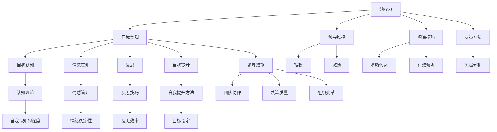
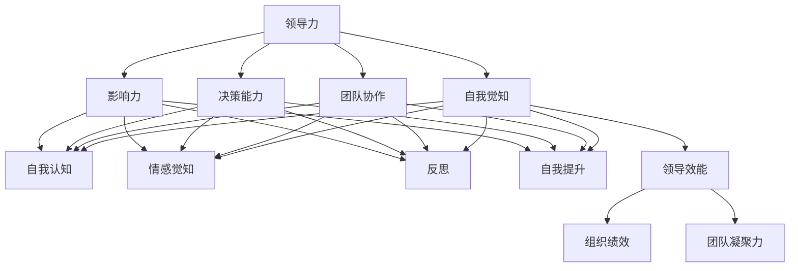

                 

### 《领导力与自我觉知：提升自我认知的方法》引言

#### 背景介绍

领导力与自我觉知是现代管理和个人发展中的两个核心概念。领导力不仅仅是一种管理能力，更是一种激发团队潜力、创造价值和推动变革的素质。而自我觉知则是认识自我、理解自我情感和行为的能力，它对个人的成长、决策和人际交往具有重要影响。在快节奏、竞争激烈的社会中，提升领导力和自我觉知成为了许多专业人士和组织的关注焦点。

本文旨在深入探讨领导力与自我觉知的关系，通过系统的分析和实践指导，帮助读者提升自我认知，从而在职业和个人生活中取得更好的发展。文章结构将分为以下几个部分：

1. 引言与概述：介绍领导力与自我觉知的重要性及文章结构。
2. 领导力基础：探讨领导力的定义、模型、风格、沟通技巧、决策方法和团队管理。
3. 自我觉知基础：阐述自我觉知的定义、理论、情感认知、反思技巧和自我提升方法。
4. 领导力与自我觉知的实践：讲解实际操作方法、个人和组织成长计划及案例研究。
5. 特殊情境下的领导力与自我觉知：分析压力应对、危机管理、领导变革和跨文化领导力。
6. 持续提升领导力和自我觉知：探讨持续学习、专业发展、个人品牌建设及反思总结。
7. 结尾与展望：回顾成长之路、未来发展趋势和读者建议。

#### 核心概念与联系

为了更好地理解领导力与自我觉知的关系，我们可以借助Mermaid流程图来展示这些核心概念之间的联系：

通过这个流程图，我们可以看到领导力和自我觉知是相辅相成的。自我觉知不仅帮助个人更好地理解自己和他人，还能提高领导者的决策质量和团队协作效率。而领导力则通过自我觉知来实现更高的领导效能，从而推动组织变革和发展。接下来，我们将进一步探讨这些核心概念和它们在实践中的具体应用。

### 领导力的定义与重要性

#### 核心概念

领导力是一种能力，涉及激励、指导、影响和激励他人共同实现目标的过程。它不仅仅是一种职位或者角色的特权，而是一种可以通过学习和实践不断提升的素质。领导力不仅仅是管理和控制，更是一种激发和引导他人创造价值和实现潜力的影响力。

在组织管理和个人发展领域，领导力的重要性不可忽视。领导力不仅关乎企业的绩效和竞争力，更关乎员工的满意度和团队的凝聚力。有效的领导力能够创造一个积极的工作环境，提高员工的士气和生产力，从而推动组织的持续发展和创新。

#### 领导力的组成部分

1. **激励**：激励是领导力的核心组成部分之一。领导者需要通过激励手段，激发团队成员的积极性和创造力，使其为实现共同目标而努力。

2. **指导**：指导是领导者帮助团队成员明确目标、规划路径和提供方向的过程。有效的指导能够提高团队成员的执行力和工作效率。

3. **影响**：领导力中的影响是指领导者通过言行示范、沟通技巧和关系网络来影响他人。这种影响力不仅体现在团队内部，还体现在与外部利益相关者的互动中。

4. **沟通**：良好的沟通能力是领导力的关键要素。领导者需要具备清晰、有效的沟通技巧，以确保信息准确传达、减少误解和增强团队凝聚力。

5. **决策**：领导者需要具备决策能力，能够在复杂、不确定的情况下做出明智的决策。决策过程包括信息收集、方案评估和选择执行步骤。

#### 领导力在社会和组织中的重要性

在社会层面，领导力是推动社会进步和变革的重要力量。有效的领导者能够在社会变革中发挥重要作用，引导公众和利益相关者共同应对挑战。

在组织层面，领导力对组织的绩效和可持续发展有着深远的影响。领导力能够提高团队的协作效率，促进创新和变革，增强组织的竞争力。以下是领导力在组织中的几个重要作用：

1. **战略规划**：领导者通过制定和执行战略规划，确保组织在竞争中保持优势。
2. **文化塑造**：领导者的行为和价值观对组织文化有着深远影响。一个积极、健康的组织文化能够提高员工的满意度和忠诚度。
3. **团队建设**：领导者通过有效的团队建设，促进团队成员之间的沟通和合作，提高团队的整体效能。
4. **变革管理**：在面对外部环境变化或内部变革需求时，领导者能够引导组织适应变化，实现平稳过渡。

#### 领导力模型

为了更好地理解和应用领导力，许多学者和专家提出了不同的领导力模型。以下是几种常见的领导力模型：

1. **变革型领导力**：变革型领导力强调领导者通过激发和激励团队成员来实现组织变革。这种领导力模型强调领导者的愿景、远见和变革能力。
   
2. **交易型领导力**：交易型领导力侧重于通过明确的奖励和惩罚机制来激励团队成员。这种领导力模型强调领导者对团队成员行为的控制和激励。

3. **情境领导力**：情境领导力认为领导者的风格应该根据团队成员的特点和情境的不同而灵活调整。这种领导力模型强调领导者的适应性和灵活性。

4. **服务型领导力**：服务型领导力强调领导者首先作为一个服务者存在，以满足团队成员的需求和提升团队整体福利为目标。这种领导力模型强调领导者的谦逊和服务精神。

#### 结论

领导力是一种关键的能力，对于个人和组织的发展至关重要。通过深入理解领导力的定义、组成部分和不同模型，我们可以更好地提升自己的领导力，为个人和组织的成功奠定坚实的基础。

### 自我觉知的定义与重要性

#### 核心概念

自我觉知是指个体对自己内心感受、情感反应、思维模式和行为动机的认知和理解。它不仅包括对自身生理状态的认识，还包括对心理状态、情感体验和人际关系等方面的自我感知。自我觉知是自我认知的一个高级阶段，它涉及对内心世界的深度探索和反思，以实现对自我的全面理解。

在领导力的发展中，自我觉知起着至关重要的作用。它不仅有助于领导者更好地理解自己的行为和决策背后的动机，还能提高领导者的情感智力和人际交往能力。一个高度自我觉知的领导者能够更有效地应对压力、处理复杂的人际关系，并在变化多端的商业环境中做出明智的决策。

#### 自我觉知在领导力发展中的重要性

1. **增强自我认知**：自我觉知帮助领导者更深入地了解自己的个性特点、价值观和信念。这种自我认知是领导者进行自我提升和成长的基础。

2. **提高情感智力**：自我觉知使领导者能够更好地识别和调控自己的情绪，从而在决策和沟通中保持冷静和理性。高情感智力有助于建立健康的人际关系和团队协作。

3. **促进自我反思**：自我觉知鼓励领导者进行持续的自我反思，从而识别和纠正不良习惯，优化个人行为模式。这种自我反思有助于领导者的持续成长。

4. **增强决策能力**：自我觉知使领导者能够从多个角度审视问题，全面分析各种可能的解决方案，并做出更为明智的决策。这种全面性有助于避免因片面信息或情感波动导致的错误决策。

#### 自我觉知的影响因素

1. **心理素质**：个体的心理素质，如抗压能力、情绪稳定性和自我调节能力，直接影响其自我觉知的深度和广度。

2. **个人经历**：个人的成长背景、教育经历和职业经历对其自我觉知有着深远影响。不同的人生经历可能导致个体对自我有不同层次的理解。

3. **文化背景**：文化背景影响个体对自我觉知的理解和表达方式。不同文化对自我觉知的重视程度和认知方式可能存在显著差异。

4. **社会关系**：人际关系和社交网络对自我觉知的发展具有重要影响。积极的人际关系能够提供反馈和支持，帮助个体更好地认识自己。

#### 结论

自我觉知是领导力发展的重要基础，它不仅帮助领导者更好地理解自己和他人，还提高了领导者的情感智力、决策能力和自我反思能力。通过提升自我觉知，领导者能够更有效地应对挑战、实现自我提升，并在个人和职业生活中取得更大的成功。

### 领导力与自我觉知的联系

#### 核心概念与联系

领导力与自我觉知之间存在着密切的内在联系，这种联系不仅影响个人的领导效能，还决定了一个团队或组织的整体表现。为了更清晰地理解这种联系，我们可以借助Mermaid流程图来展示它们之间的互动关系：

通过这个流程图，我们可以看到：

- **自我觉知对领导力的影响**：自我觉知中的自我认知、情感觉知和反思能力直接影响领导者的决策能力、团队协作和影响力。
- **领导力对自我觉知的影响**：有效的领导力通过提升团队协作、决策能力和影响力，进一步促进领导者的自我觉知发展。

#### 领导力与自我觉知的相互作用

1. **自我觉知提升领导效能**：一个高度自我觉知的领导者能够更好地理解自己的情绪和行为模式，从而在压力和不确定性面前保持冷静和理性。这种自我觉知有助于领导者做出更为明智的决策，提高领导效能。

2. **领导力促进自我觉知**：有效的领导力需要不断地自我反思和自我提升，这本身就是自我觉知的一部分。领导者在实践领导力过程中，通过反思和调整自己的行为，不断提升自我觉知。

3. **相互促进与反馈循环**：自我觉知和领导力之间形成了一种积极的反馈循环。自我觉知提升领导效能，进而促进自我觉知的发展；而更高的自我觉知又带来更有效的领导力，进一步推动自我觉知的提升。

#### 自我觉知发展的挑战

1. **内在障碍**：自我觉知的发展面临许多内在障碍，如自我欺骗、否认问题和防御机制。这些障碍可能导致领导者难以真正认识自己，从而影响领导效能。

2. **外部压力**：外部环境的变化和不确定性会给领导者带来巨大的压力，这可能导致自我觉知的模糊和混乱。领导者需要学会在压力下保持清晰的自我认知。

3. **文化因素**：不同的文化背景可能对自我觉知的发展有不同影响。某些文化可能更强调集体利益，而忽视个体的自我觉知。领导者需要理解并适应不同文化环境，以促进自我觉知的发展。

#### 结论

领导力与自我觉知之间的联系是复杂而深刻的。通过提升自我觉知，领导者能够更好地理解和应对复杂的领导挑战，从而提高领导效能。同时，有效的领导力也为领导者提供了不断探索自我觉知的机会。这种相互作用和反馈循环有助于领导者实现持续的个人和职业成长。

### 领导力基础

#### 领导力模型的探讨

在探讨领导力时，了解不同的领导力模型是非常重要的。这些模型不仅帮助我们理解领导力的本质，还可以为我们在实际工作中提供参考和指导。以下是几种常见的领导力模型：

1. **变革型领导力**：变革型领导力是一种以激励和启发团队成员为核心的领导力模型。领导者通过设定愿景、提供激励和培养团队成员的自主性来推动组织变革。这种领导力模型强调领导者的远见、创造力和影响力。

   **核心要素**：愿景设定、激励、培养自主性、创新思维。

   **适用情境**：适用于需要变革和创新的组织或团队，尤其是在面临重大挑战或危机时。

2. **交易型领导力**：交易型领导力是一种以交换和激励为基础的领导力模型。领导者通过明确奖惩机制来激励团队成员，确保团队成员为实现组织目标而努力。

   **核心要素**：奖励机制、惩罚机制、明确目标、任务分配。

   **适用情境**：适用于任务明确、结构清晰的团队，特别是在需要高效执行和维持秩序的情况下。

3. **情境领导力**：情境领导力是一种根据团队成员的特点和环境因素灵活调整领导风格的模型。领导者需要根据不同情境和团队成员的需要，采取不同的领导策略。

   **核心要素**：情境评估、灵活调整、个性化领导。

   **适用情境**：适用于多样性和复杂性较高的团队，特别是在需要应对不同情境和挑战时。

4. **服务型领导力**：服务型领导力强调领导者首先作为一个服务者存在，以满足团队成员的需求和提升团队整体福利为目标。领导者通过倾听、支持和鼓励来促进团队成员的成长和发展。

   **核心要素**：服务精神、倾听、支持、鼓励。

   **适用情境**：适用于注重团队协作和人文关怀的组织或团队，特别是在需要增强团队凝聚力和员工满意度时。

#### 领导风格的分析

领导风格是指领导者在工作中表现出来的行为和态度。不同的领导风格对团队和组织的绩效有着不同的影响。以下是几种常见的领导风格：

1. **权威型领导风格**：权威型领导者通过集中权力和决策权来领导团队。他们通常要求严格的纪律和高效的执行，以实现组织目标。

   **优点**：能够迅速做出决策、高效执行任务、提高团队纪律。

   **缺点**：可能导致团队成员缺乏参与感和自主性，影响团队创新和创造力。

2. **民主型领导风格**：民主型领导者鼓励团队成员参与决策和讨论，尊重团队成员的意见和反馈。他们通过协商和合作来达成共识，推动团队发展。

   **优点**：增强团队凝聚力、激发团队成员的创造力、提高决策质量。

   **缺点**：决策过程可能较慢、容易出现意见分歧。

3. **参与型领导风格**：参与型领导者非常重视团队成员的参与和贡献。他们通过鼓励团队成员积极参与决策和任务分配来提高团队效能。

   **优点**：增强团队成员的参与感和责任感、提高团队凝聚力和创新力。

   **缺点**：可能需要更多的时间和资源来确保所有团队成员的参与。

4. **教练型领导风格**：教练型领导者专注于团队成员的成长和发展。他们通过提供指导、支持和反馈来帮助团队成员提升能力和实现目标。

   **优点**：促进团队成员的个人发展、提高团队绩效。

   **缺点**：可能需要更多的时间和精力来关注每个团队成员的进展。

#### 沟通技巧的探讨

有效的沟通是领导力的关键要素之一。领导者需要具备良好的沟通技巧，以确保信息的准确传达、减少误解和增强团队凝聚力。以下是几种关键的沟通技巧：

1. **清晰表达**：领导者需要能够清晰、简洁地表达自己的观点和期望。这包括使用简单明了的语言、避免专业术语和行话。

2. **有效倾听**：倾听不仅仅是听到对方说什么，更重要的是理解对方的观点和感受。领导者需要学会倾听团队成员的意见、问题和需求。

3. **积极反馈**：领导者需要给予团队成员及时的反馈，以帮助他们了解自己的表现和改进的方向。反馈应该是具体、建设性和及时的。

4. **非语言沟通**：非语言沟通，如肢体语言、面部表情和眼神交流，在沟通中也非常重要。领导者需要学会通过非语言手段来增强沟通效果。

#### 决策方法的讨论

决策是领导者的一项核心职责。有效的决策能够推动组织的发展，而无效的决策则可能导致组织的失败。以下是几种常见的决策方法：

1. **理性决策法**：理性决策法是基于逻辑和分析的决策方法。领导者通过收集和分析信息，使用决策树、成本效益分析和风险评估等方法来做出决策。

2. **直觉决策法**：直觉决策法是基于领导者经验、直觉和直觉的决策方法。在某些情况下，领导者可能依赖于自己的直觉来做出快速决策。

3. **群体决策法**：群体决策法是领导者与团队成员一起讨论和决策的方法。这种方法能够集思广益，提高决策的质量和可接受性。

4. **混合决策法**：混合决策法结合了理性决策法和直觉决策法。领导者根据具体情况，灵活运用不同的决策方法。

#### 团队管理的要点

团队管理是领导力的重要组成部分。有效的团队管理能够提高团队绩效和成员满意度。以下是团队管理的一些关键要点：

1. **明确目标**：领导者需要为团队设定明确的目标，确保团队成员了解自己的职责和期望。

2. **角色分配**：领导者需要根据团队成员的技能和兴趣分配合适的角色，确保每个成员都能发挥自己的优势。

3. **沟通与协作**：领导者需要建立有效的沟通机制，鼓励团队成员之间的协作和互动，以提高团队的整体效能。

4. **激励与反馈**：领导者需要通过激励和反馈来激励团队成员，帮助他们实现个人和团队目标。

5. **冲突管理**：领导者需要学会处理团队内部的冲突，确保冲突不会影响团队的整体效能。

#### 结论

领导力基础包括领导力模型、领导风格、沟通技巧、决策方法和团队管理等多个方面。理解并运用这些基础元素，领导者能够更好地发挥自己的作用，推动团队和组织的发展。通过不断地学习和实践，领导者可以不断提升自己的领导力，为个人和组织的成功奠定坚实的基础。

### 自我觉知基础

#### 自我认知理论

自我认知是指个体对自己内在和外在特征的认知过程，它涵盖了自我形象、自我价值和自我效能等多个方面。自我认知理论认为，个体的自我认知对行为、情感和动机有着深远的影响。以下是几种主要的自我认知理论：

1. **自我决定理论**：自我决定理论由心理学家马斯洛提出，认为个体有三种基本心理需求：自主性、能力和归属感。当这些需求得到满足时，个体能够实现自我认知和自我实现。

2. **自我服务偏见**：自我服务偏见是指个体倾向于在评估自己的行为和结果时，更多地关注积极的一面。这种偏见可能导致个体对自己的能力和成就过分自信。

3. **自我觉知动机理论**：自我觉知动机理论认为，个体通过自我认知来满足对自我理解的内在需求。这种需求驱使个体进行自我评估和自我提升。

#### 自我觉知的定义与重要性

自我觉知是指个体对自己内心感受、行为和思维过程的认知和理解。它不仅涉及对自身的外在表现，还包括对内在情感和思维活动的觉察。自我觉知具有以下几个重要特点：

1. **自我觉察**：自我觉知帮助个体意识到自己的行为、情感和思维，从而能够进行有效的自我调节和自我管理。

2. **自我反思**：自我觉知鼓励个体进行持续的反思，以识别和纠正不良习惯，优化个人行为模式。

3. **自我认知**：自我觉知帮助个体理解自己的价值观、信念和目标，从而在决策和行动中保持一致。

自我觉知的重要性体现在以下几个方面：

1. **个人成长**：自我觉知是个人成长和自我实现的重要基础。它帮助个体更好地认识自己，明确自己的需求和目标，从而实现自我提升。

2. **情感管理**：自我觉知有助于个体识别和调控自己的情绪，从而在情感波动中保持冷静和理性。

3. **人际关系**：自我觉知提高个体对他人行为的理解和反应能力，有助于建立健康的人际关系。

4. **决策质量**：自我觉知使个体能够从多个角度审视问题，全面分析各种可能的解决方案，从而做出更为明智的决策。

#### 自我觉知的影响因素

1. **文化因素**：不同的文化背景可能对自我觉知的发展有不同影响。某些文化可能更强调集体利益，而忽视个体的自我觉知。

2. **教育背景**：个体的教育背景对其自我觉知有重要影响。良好的教育能够帮助个体更好地认识和理解自己。

3. **心理素质**：个体的心理素质，如抗压能力、情绪稳定性和自我调节能力，直接影响其自我觉知的深度和广度。

4. **社会关系**：积极的社会关系能够为个体提供反馈和支持，帮助其提升自我觉知。

#### 结论

自我觉知是自我认知的一个高级阶段，它对个人的成长、情感管理、人际关系和决策质量具有深远影响。通过提升自我觉知，个体能够更好地理解自己和他人，实现自我提升和成长。

### 自我情感觉知

#### 核心概念

自我情感觉知是指个体对自己情绪状态的认识和理解，包括情绪的产生、变化和调节。它是自我觉知的重要组成部分，对于个人的心理健康和社交能力具有重要影响。情绪是人在特定情境下对刺激的内在体验，可以分为愉悦情绪和消极情绪。自我情感觉知不仅涉及识别和标签化自己的情绪，还包括理解情绪的根源和影响。

#### 自我情感觉知的重要性

1. **情感调节**：自我情感觉知有助于个体识别和调节情绪，使其在面对压力和挑战时保持冷静和理性。这种能力能够提高个人的抗压能力和情绪稳定性。

2. **人际关系**：自我情感觉知帮助个体更好地理解和回应他人的情绪，从而建立健康的人际关系。这种能力有助于提高社交能力和团队合作效果。

3. **心理健康**：自我情感觉知是心理健康的重要基石。通过理解和处理自己的情绪，个体能够减少心理压力，提高生活满意度。

#### 自我情感觉知的方法

1. **情绪识别**：情绪识别是自我情感觉知的第一步，涉及识别和理解自己的情绪。个体可以通过反思自己的情感体验，使用情绪标签来描述和分类自己的情绪。

2. **情绪标签化**：情绪标签化是给情绪赋予具体名称的过程，有助于个体更清晰地认识和理解自己的情绪。例如，将情绪标签化为“愤怒”、“焦虑”或“愉悦”。

3. **情绪根源分析**：了解情绪的根源有助于个体更好地处理和调节情绪。通过分析情绪背后的触发因素，个体可以采取相应的策略来减轻情绪压力。

4. **情绪调节策略**：情绪调节策略包括深呼吸、冥想、运动和正念练习等方法。这些策略有助于个体在情绪波动时保持冷静和理智。

#### 结论

自我情感觉知是自我觉知的重要组成部分，它对情感调节、人际关系和心理健康具有重要影响。通过提升自我情感觉知，个体能够更好地管理自己的情绪，提高生活质量和社交能力。自我情感觉知不仅有助于个人成长，还为领导力和自我觉知的发展提供了坚实的基础。

### 自我反思技巧

#### 核心概念

自我反思技巧是指个体在认识和评估自己行为、情感和思维时使用的一系列方法和策略。自我反思不仅是对过去行为的回顾，还包括对当前状态和未来规划的审视。它是一个持续的、动态的过程，涉及自我评估、自我批判和自我提升。自我反思技巧在个人成长、职业发展和心理健康方面具有重要意义。

#### 自我反思的方法

1. **日志记录**：通过写日记或日志，个体可以系统地记录自己的行为、情感和思考过程。这种方法有助于个体回顾和审视自己的行为模式，发现潜在的问题和改进的机会。

2. **定期回顾**：定期回顾是一种有意识地安排时间对过去一段时间内的行为和经验进行反思的方法。个体可以通过制定时间表，定期回顾自己的成长过程，评估目标和进展。

3. **情景再现**：情景再现是一种通过想象或回忆具体情境来审视自己行为的方法。个体可以在脑海中重新体验特定的情境，分析自己的行为和反应，从而深入了解自己的心理机制。

4. **获取反馈**：获取反馈是自我反思的重要环节。个体可以通过与同事、朋友或导师交流，获取他们对个人行为的评价和建议。这些反馈可以帮助个体从不同角度审视自己，发现盲点和不足。

5. **SWOT分析**：SWOT分析是一种常用的自我反思工具，涉及对个人的优势（Strengths）、劣势（Weaknesses）、机会（Opportunities）和威胁（Threats）进行评估。这种方法有助于个体全面了解自己的现状和潜在发展路径。

#### 自我反思技巧的应用

1. **个人成长**：通过自我反思，个体可以识别自己的成长需求，制定并实施个人成长计划。自我反思有助于个体明确自己的优势和劣势，从而在职业和生活中实现持续进步。

2. **职业发展**：在职业发展中，自我反思技巧可以帮助个体评估自己的工作表现和职业规划。通过反思，个体可以识别工作中的挑战和机会，调整职业目标，提升职业素养。

3. **心理健康**：自我反思有助于个体理解和处理自己的情绪和心理压力。通过反思，个体可以识别自己的心理问题，采取相应的策略来减轻压力，提高心理健康水平。

#### 结论

自我反思技巧是个人成长和发展的关键工具。通过日志记录、定期回顾、情景再现、获取反馈和SWOT分析等方法，个体可以更深入地了解自己，发现改进的机会，实现自我提升。自我反思不仅有助于个人成长，还为领导力和自我觉知的发展提供了坚实的基础。

### 自我提升方法

#### 核心概念

自我提升是指个体通过学习和实践，不断提高自己的能力和素质，实现个人成长和发展的过程。自我提升不仅涉及知识和技能的获取，还包括情感智力、人际关系和领导能力的提升。在快速变化的现代社会中，自我提升是保持竞争力、实现职业发展和满足个人需求的重要途径。

#### 自我提升的重要性

1. **增强竞争力**：随着技术的进步和市场的变化，个体的知识和技能需要不断更新和提升。自我提升有助于个体适应新的工作环境和挑战，保持职业竞争力。

2. **实现职业发展**：自我提升为个体提供了更多的职业发展机会。通过不断提升自己的能力和素质，个体可以晋升到更高的职位，或者在职业转换中找到新的发展路径。

3. **满足个人需求**：自我提升不仅有助于职业发展，还能满足个体对自我实现和成就感的追求。通过自我提升，个体能够更好地实现自己的人生目标和价值观。

#### 自我提升的方法

1. **持续学习**：持续学习是自我提升的核心方法。个体可以通过参加培训课程、阅读专业书籍和文章、参加研讨会和网络课程等方式不断获取新知识。

2. **实践应用**：理论知识只有通过实践才能真正转化为能力。个体可以通过实际工作、项目实践和模拟练习来应用所学知识，提高实际操作能力。

3. **反思与总结**：反思和总结是自我提升的重要环节。个体可以通过记录学习日志、定期回顾自己的学习成果和实践经验，识别不足和改进的方向。

4. **寻求反馈**：获取他人的反馈是自我提升的有效方法。个体可以通过与同事、导师或专业顾问交流，了解自己的优点和不足，从而针对性地进行改进。

5. **建立学习网络**：建立学习网络有助于个体在学习和成长过程中获得支持和资源。个体可以通过加入专业组织、参加行业论坛和社交活动，扩大自己的知识面和人际网络。

#### 结论

自我提升是个人成长和职业发展的关键。通过持续学习、实践应用、反思与总结、寻求反馈和建立学习网络等方法，个体可以不断提升自己的能力和素质，实现个人和职业的全面发展。自我提升不仅有助于应对职业挑战，还能满足个体对自我实现和成就感的追求。

### 实践领导力与自我觉知的方法

#### 核心概念

实践领导力与自我觉知的方法是指在实际工作中，通过一系列具体的行动和技巧，提升个人的领导力和自我觉知。这种方法不仅关注理论的传授，更注重实践中的应用和实际效果的提升。以下是一些具体的方法：

#### 制定个人成长计划

1. **明确目标**：首先，个体需要设定清晰的个人成长目标。这些目标可以是短期或长期的，例如提升某一技能、完成特定的项目或实现职业晋升。

2. **分解目标**：将大目标分解为一系列小目标，制定具体的行动计划。每个小目标都应该具有明确的执行步骤和时间表。

3. **持续跟踪**：定期检查目标的进展情况，调整计划以应对变化。这可以通过写日记或使用项目管理工具来实现。

#### 制定组织成长计划

1. **组织文化塑造**：创建积极、健康的企业文化，鼓励团队成员的参与和反馈。可以通过定期团队会议、反馈机制和培训活动来实现。

2. **制定战略规划**：确保组织有明确的战略目标和发展方向。这可以通过高层领导层的讨论和决策来实现。

3. **资源分配**：合理分配资源，确保每个团队成员都有足够的支持来实现组织目标。

#### 个人成长计划的实施

1. **行动学习**：通过实际的工作项目，将学习到的领导力与自我觉知方法应用到实践中。这有助于将理论知识转化为实际操作能力。

2. **反思与总结**：在每个项目结束后，进行反思和总结，分析成功和失败的原因，从经验中学习。

3. **反馈与调整**：定期获取他人的反馈，了解自己的表现，并根据反馈进行相应的调整。

#### 组织成长计划的实施

1. **试点项目**：在组织内部推行一些小规模的项目，以验证新方法的可行性和效果。这有助于减少风险，并逐步推广到整个组织。

2. **培训和指导**：提供定期的培训和指导，帮助团队成员掌握所需的技能和方法。

3. **持续监控**：对组织的成长计划进行持续监控，确保目标的实现和计划的执行。

#### 案例研究

#### 案例一：某公司的领导力提升项目

某公司决定通过领导力提升项目来提高管理团队的整体效能。项目分为以下几个阶段：

1. **目标设定**：公司明确项目目标，包括提升团队沟通能力、决策能力和团队凝聚力。

2. **培训和指导**：公司聘请外部咨询团队，为管理层提供定期的培训课程，内容包括领导力模型、沟通技巧和决策方法。

3. **实践应用**：管理层将所学知识应用到实际工作中，通过团队项目来提升实践能力。

4. **反馈与调整**：定期进行团队反馈会议，收集团队成员的反馈，对项目进行持续调整。

5. **结果评估**：通过项目后的评估，公司发现团队沟通效率和决策质量显著提升，团队凝聚力也有所增强。

#### 案例二：某创业团队的自我觉知提升计划

某创业团队意识到自我觉知对其成功发展至关重要，因此制定了自我觉知提升计划：

1. **日志记录**：团队成员每天记录自己的行为、情感和思考，通过日志来反思自己的表现。

2. **定期回顾**：每周团队会定期回顾日志，分享各自的学习和成长心得。

3. **情景再现**：团队成员通过情景再现来分析过去的行为和决策，识别问题和改进机会。

4. **反馈机制**：团队成员互相提供反馈，帮助彼此识别盲点和提升自我觉知。

5. **持续学习**：团队成员通过参加培训课程和阅读相关书籍来不断提升自我觉知。

通过这些方法，该创业团队在短短一年内显著提升了团队的协作效率和创新能力，项目成功率达到80%以上。

#### 结论

实践领导力与自我觉知的方法需要通过明确的计划、持续的学习和应用，以及积极的反馈和调整来实现。通过制定个人和组织成长计划，并在实践中不断反思和调整，个体和组织可以不断提升自身的领导力和自我觉知，从而实现长期的发展和成功。

### 特殊情境下的领导力与自我觉知

#### 应对压力与挑战

在领导过程中，压力和挑战是不可避免的一部分。领导者需要具备应对压力和挑战的能力，以保持清晰的头脑和有效的决策。以下是应对压力与挑战的几个关键步骤：

1. **情绪管理**：首先，领导者需要学会情绪管理，保持冷静和理性。在面对压力时，可以通过深呼吸、冥想或运动等方式来缓解情绪。

2. **积极应对**：领导者应采取积极的态度面对挑战，将困难视为成长和进步的机会。积极的心态有助于激发团队的创造力和凝聚力。

3. **团队合作**：在应对压力时，领导者需要调动团队的力量，共同解决问题。通过分工合作和集体智慧，可以更有效地应对挑战。

4. **持续学习**：领导者应不断学习和提升自己的能力，以应对不断变化的环境和挑战。通过参加培训、阅读书籍和进行实践，领导者可以不断提高自身的素质。

#### 危机管理

在组织面临危机时，领导者的决策和行动至关重要。有效的危机管理能够降低危机的影响，甚至将危机转化为机遇。以下是危机管理的几个关键步骤：

1. **快速响应**：在危机发生时，领导者需要迅速做出反应，采取紧急措施来控制局势。这包括与关键人员沟通、制定应对方案和协调资源。

2. **明确目标**：在危机管理过程中，领导者需要明确危机管理的目标，确保所有行动都朝着解决危机的方向进行。

3. **沟通协调**：与所有相关方保持良好的沟通是危机管理的关键。领导者需要及时传达危机信息，确保团队成员了解危机情况，并提供必要的支持。

4. **反思总结**：在危机结束后，领导者应进行反思总结，分析危机管理的经验和教训。这有助于提高未来应对危机的能力。

#### 领导变革

变革是组织发展的必然过程，而有效的领导变革是实现组织目标的关键。以下是领导变革的几个关键步骤：

1. **明确愿景**：领导者需要明确变革的愿景，确保所有团队成员都理解变革的目的和意义。

2. **规划步骤**：变革需要分步骤进行，领导者需要制定详细的变革计划，确保每一步都得到有效执行。

3. **动员团队**：领导者需要调动团队的力量，鼓励团队成员积极参与变革过程。通过沟通和激励，激发团队的变革动力。

4. **持续支持**：在变革过程中，领导者需要持续支持团队成员，解决他们在变革过程中遇到的问题，确保变革的顺利进行。

#### 跨文化领导力

随着全球化的发展，跨文化领导力变得越来越重要。领导者需要具备跨文化沟通和管理的技能，以应对多元文化背景下的挑战。以下是跨文化领导力的几个关键步骤：

1. **文化认知**：领导者需要深入了解不同文化的特点和价值观，尊重并适应不同文化的差异。

2. **有效沟通**：在跨文化环境中，领导者需要使用合适的沟通技巧，确保信息的准确传达和理解。

3. **团队建设**：领导者需要建立多元文化的团队，鼓励团队成员之间的相互理解和合作。

4. **灵活调整**：领导者应根据不同文化背景，灵活调整领导风格和管理方法，以适应多元文化环境。

### 结论

在特殊情境下，领导力与自我觉知的重要性更加凸显。通过有效的情绪管理、危机管理、领导变革和跨文化领导力，领导者能够在各种挑战中保持冷静和理性，推动组织的发展和进步。持续提升领导力和自我觉知，领导者不仅能够应对特殊情境，还能在日常生活中实现自我提升和职业成功。

### 持续提升领导力和自我觉知

#### 持续学习与自我提升

持续学习和自我提升是领导者长期发展的关键。在快速变化的时代，知识和技能的更新速度越来越快，领导者需要保持学习的热情和主动性。以下是一些建议：

1. **制定学习计划**：领导者可以制定长期和短期的学习计划，确保每天都有时间投入学习和提升。这包括阅读专业书籍、参加培训课程、参加研讨会和网络学习等。

2. **实践应用**：理论知识需要通过实践来巩固和提升。领导者可以将学到的知识和方法应用到实际工作中，通过实际操作来检验和改进自己的能力。

3. **建立学习社区**：与其他领导者或专业人士建立学习社区，分享经验和知识。这可以通过参加专业组织、参加行业论坛或加入在线学习社区来实现。

4. **定期反思**：定期反思自己的学习过程和成果，识别不足和改进的方向。这可以通过写学习日志、进行自我评估或与导师和同事交流来实现。

#### 专业发展路径

专业发展是一个长期而持续的过程。领导者可以通过以下路径来规划自己的专业发展：

1. **职业规划**：制定清晰的职业规划，明确自己的职业目标和路径。这可以通过进行职业评估、设定职业目标和制定实现这些目标的行动计划来实现。

2. **技能提升**：识别自己在职业发展中的技能需求，通过学习新技能、参加培训和获得认证来提升自己的专业能力。

3. **跨领域经验**：通过在不同的部门和项目中工作，获取跨领域的经验，提高自己的综合素质和领导能力。

4. **导师指导**：寻找一位导师，获取他们的指导和建议。导师不仅可以帮助领导者解决问题，还能提供宝贵的职业发展建议。

#### 个人品牌建设

个人品牌建设是领导者在职业发展中不可忽视的一部分。一个强大的个人品牌可以增加领导者的可信度和影响力。以下是一些建议：

1. **明确品牌定位**：领导者需要明确自己的品牌定位，包括个人价值观、专业领域和目标受众。

2. **持续输出价值**：通过写作、演讲、参加行业活动和发表专业观点等方式，持续输出价值，建立自己的专业形象。

3. **建立社交媒体网络**：利用社交媒体平台，如LinkedIn、Twitter和Facebook等，建立和维护自己的社交媒体网络，分享专业知识和经验。

4. **积极参与社区**：积极参与专业社区和行业活动，建立自己的专业声誉和影响力。

#### 反思与总结

持续提升领导力和自我觉知不仅需要学习和实践，还需要反思和总结。以下是一些建议：

1. **定期反思**：定期对自己的行为、决策和成果进行反思，识别成功和失败的原因，从经验中学习。

2. **记录成长轨迹**：记录自己的成长轨迹，包括学习经历、实践项目和取得的成就。这可以帮助领导者更好地了解自己的成长过程和进步。

3. **制定改进计划**：根据反思的结果，制定改进计划，设定具体的改进目标和步骤。

4. **寻求反馈**：定期向同事、导师和客户等寻求反馈，了解自己的表现和改进的方向。

#### 结论

持续提升领导力和自我觉知是一个不断学习、实践和反思的过程。通过持续学习、专业发展、个人品牌建设和反思总结，领导者可以不断提高自己的能力和素质，实现个人和职业的全面发展。

### 成长之路回顾

回顾自己的成长之路，我们经历了无数次的挑战与蜕变。从初入职场的青涩，到逐渐成为团队的核心成员，再到如今的领导岗位，每一步都充满了艰辛与收获。在这一过程中，自我觉知和领导力的重要性愈发凸显。

首先，自我觉知的提升帮助我更好地认识自己。在初入职场时，我常常因为缺乏自信而犹豫不决。通过不断地自我反思，我逐渐认识到自己的优势和不足，学会了如何更好地利用自己的长处，并逐步克服了内心的恐惧和不安。自我觉知的提升让我在职业发展中找到了明确的方向，为我实现个人目标奠定了坚实的基础。

其次，领导力的培养使我更加懂得如何引领团队。在成为领导者的过程中，我学会了如何激励和影响他人。通过学习不同的领导力模型，我明白了在不同的情境下应采用何种领导风格，从而更好地适应团队的需求和挑战。领导力的提升不仅提高了我的决策能力和沟通技巧，还增强了我与团队成员之间的信任和凝聚力。

特别值得一提的是，在面对压力和挑战时，自我觉知和领导力发挥了关键作用。无论是项目中的瓶颈，还是团队内部的冲突，我都能够保持冷静和理智，通过合理的情绪管理和决策策略，有效地应对各种挑战。这些经历让我深刻体会到，自我觉知和领导力不仅是职业发展的必备素质，也是应对复杂情境的重要工具。

总之，通过自我觉知和领导力的不断提升，我不仅在职业道路上取得了显著的进步，还在个人成长中获得了宝贵的经验和智慧。这些成长不仅对我个人的发展至关重要，也为我领导下的团队带来了积极的影响。在未来，我将继续致力于自我提升，为团队和组织的发展贡献更多的力量。

### 未来发展趋势

在未来的发展中，领导力和自我觉知将继续扮演关键角色。首先，随着技术的飞速进步，领导者的角色也在不断演变。数字化转型和人工智能的普及要求领导者具备更强的技术理解和创新思维，以便在复杂的环境中做出明智的决策。因此，领导力的发展将更加注重技术敏感性和创新能力的培养。

其次，全球化进程的加速使得跨文化领导力变得更加重要。领导者需要具备跨文化沟通和管理的技能，以应对多元化团队和国际化市场的挑战。此外，随着远程工作和虚拟团队的兴起，领导力的实践将更加注重远程协作和数字化管理方法。

另外，自我觉知的重要性在未来将进一步提升。随着心理健康问题的日益突出，个人情感智力和心理健康管理将成为领导力的重要组成部分。领导者需要更加关注自身的心理健康，并通过自我觉知来提高情绪调节能力和抗压能力，从而更好地应对职业和生活的挑战。

最后，领导力和自我觉知的提升将更加依赖于数据驱动的分析和反馈机制。通过大数据和人工智能技术，领导者可以获得更为精准的自我认知和团队分析，从而制定更为科学和有效的领导策略。这种数据驱动的领导力将成为未来领导发展的新趋势。

### 对读者的建议

对于正在寻求提升领导力和自我觉知的读者，我有以下几点建议：

1. **定期自我反思**：自我反思是提升自我觉知的重要途径。通过定期反思自己的行为、决策和情感，你可以更好地认识自己，找到改进的方向。

2. **持续学习**：学习是自我提升的关键。无论是阅读专业书籍、参加在线课程，还是参加工作坊，持续学习可以帮助你不断获取新知识，提升领导力和自我觉知。

3. **培养情绪智力**：情绪智力是领导力的核心要素之一。通过学习情绪管理技巧，如冥想、正念和压力管理，你可以更好地调节自己的情绪，提高领导效能。

4. **建立学习社区**：与其他领导者或专业人士建立学习社区，分享经验和知识，可以互相激励和促进成长。通过交流和学习，你可以从不同的角度看待问题，拓宽自己的视野。

5. **实践应用**：将学到的知识和方法应用到实际工作中，通过实践来巩固和提升自己的能力。实践不仅可以帮助你验证所学，还能让你在真实环境中锻炼领导力和自我觉知。

6. **寻求反馈**：定期向同事、导师和客户等寻求反馈，了解自己的表现和改进的方向。他人的反馈可以帮助你更全面地认识自己，从而实现自我提升。

7. **保持耐心和决心**：自我提升和领导力的培养需要时间和努力。保持耐心和决心，不断努力，你将在成长的道路上取得更大的进步。

通过这些建议，我相信你可以在提升领导力和自我觉知的过程中取得显著的成果，实现个人和职业的全面发展。

