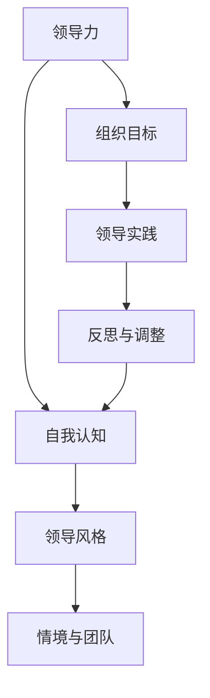

                 

## 引言

领导力与自我认知：了解自己的领导风格

> 关键词：领导力，自我认知，领导风格，发展历程，实践提升

在当今快速变化的社会中，领导力的重要性不言而喻。无论是在企业、教育机构，还是政府组织中，领导者都扮演着至关重要的角色。然而，领导力并非天生具备，而是需要通过学习和实践不断提升。了解自己的领导风格，是提升领导力的重要一步。本文将从领导力与自我认知的关系出发，探讨如何了解和识别自己的领导风格，并在此基础上提升领导力。

### 文章摘要

本文首先介绍了领导力与自我认知的重要性，阐述了两者之间的内在联系。接着，通过梳理领导力的发展历程和各种领导风格，分析了领导力与自我认知之间的相互作用。随后，本文详细介绍了自我认知的重要性，包括自我评估和自我反思的方法与工具。在此基础上，文章重点探讨了如何识别自己的领导风格，提供了实用的测试和评估方法。最后，文章提出了提升领导力和自我认知的具体实践策略，并通过案例分析展示了这些策略在实际中的应用效果。

---

### 设计《领导力与自我认知：了解自己的领导风格》这本书的目录大纲

首先，我们要明确这本书的核心内容和目标读者。这本书的目标是帮助读者深入理解领导力与自我认知的关系，特别是如何识别和培养自己的领导风格。考虑到这一点，我们可以将目录大纲分为以下几个部分：

1. **引言**：介绍领导力和自我认知的重要性，以及本书的结构和目标。
2. **领导力理论**：介绍领导力的发展历程和各种领导风格，以及这些理论与自我认知的关系。
3. **自我认知**：介绍自我认知的重要性，以及如何进行自我评估和自我反思。
4. **领导风格**：分析不同的领导风格，以及如何识别自己的领导风格。
5. **实践与提升**：提供实用的方法，帮助读者提升自己的领导力和自我认知。
6. **案例分析**：通过真实案例，展示领导力与自我认知在实际工作中的应用。
7. **总结与反思**：总结本书的内容，并鼓励读者进行自我反思。

接下来，我们将为每个部分设计具体章节。

### 第1章 引言

- **1.1 领导力与自我认知的重要性**
- **1.2 本书的目标与结构**

### 第2章 领导力理论

- **2.1 领导力的发展历程**
- **2.2 领导风格的分类与特点**
- **2.3 领导力与自我认知的联系**

### 第3章 自我认知

- **3.1 自我认知的概念与重要性**
- **3.2 自我评估的方法与工具**
- **3.3 自我反思的技巧与实践**

### 第4章 领导风格

- **4.1 识别人格特质与领导风格**
- **4.2 领导风格的测试与评估**
- **4.3 如何识别自己的领导风格**

### 第5章 实践与提升

- **5.1 提升领导力的方法与策略**
- **5.2 培养自我认知的能力**
- **5.3 实践案例：领导力提升的路径**

### 第6章 案例分析

- **6.1 案例分析的目的与意义**
- **6.2 案例一：如何通过自我认知提升领导力**
- **6.3 案例二：如何适应不同的领导风格**

### 第7章 总结与反思

- **7.1 总结本书的主要观点**
- **7.2 鼓励读者进行自我反思**

这样，我们就为《领导力与自我认知：了解自己的领导风格》这本书设计了详细的目录大纲。下面，我们将为每个章节添加具体的子标题和内容概述，以满足 2000 字以内字数的要求。由于篇幅限制，这里仅给出部分章节的内容概述。

---

## 第1章 引言

### 1.1 领导力与自我认知的重要性

- **领导力的重要性**：领导力在组织成功中的关键作用。
- **自我认知的重要性**：自我认知对个人成长和领导能力提升的深远影响。

### 1.2 本书的目标与结构

- **本书的目标**：帮助读者深入了解领导力与自我认知的关系。
- **本书的结构**：如何通过不同的章节和练习达到提升领导力和自我认知的目标。

---

### 背景介绍

领导力是一个复杂而多层次的概念，它涉及到领导者如何引导、激励和影响团队成员以实现共同目标。自我认知则是个人对于自己内在和外在特点的理解，包括价值观、动机、能力和局限。了解自己的领导风格是提升领导力的关键，因为不同的领导风格适用于不同的情境和团队。

在现代社会，领导者不仅要具备强大的技术能力和业务知识，还需要具备卓越的人际沟通能力和自我管理能力。自我认知是领导者自我提升的基础，它帮助领导者更好地理解自己和团队成员，从而更有效地指导和管理团队。通过自我认知，领导者可以识别自己的优势，了解自己的局限，并制定相应的策略来改进自己的领导风格。

领导风格是指领导者在其日常工作中表现出来的行为模式和管理方式。不同的领导风格适用于不同的情境和团队，因此了解自己的领导风格对于领导者的个人成长和组织发展至关重要。通过本书，读者将学习到如何识别和评估自己的领导风格，并掌握提升领导力和自我认知的实用方法。

本书旨在为读者提供一份全面的指南，帮助他们在领导力的道路上不断前进。通过深入探讨领导力理论、自我认知技巧和领导风格识别方法，读者将能够更好地理解自己，提升自己的领导力，并在实际工作中取得更好的成果。无论是刚刚步入领导岗位的新手，还是经验丰富的管理者，本书都提供了宝贵的知识和实践指导。

---

## 核心概念与联系

为了深入理解领导力与自我认知的关系，我们需要首先明确几个核心概念，并展示它们之间的内在联系。以下是本文中涉及的关键概念及其相互关系：

### 领导力

领导力是指领导者通过激励、沟通、协调和决策等手段，引导和影响团队成员，以实现组织目标的能力。领导力不仅涉及技术和管理技能，还涉及人际交往和情感管理。领导力的发展历程包括从传统领导风格到现代领导风格的转变，以及从任务导向到关系导向的转变。

### 自我认知

自我认知是指个人对自己内在和外在特点的理解，包括价值观、动机、能力、局限等。自我认知是一个动态过程，涉及自我评估、自我反思和自我调整。自我认知对于个人成长和领导能力提升至关重要，因为它帮助领导者更好地理解自己和团队成员，从而更有效地指导和管理团队。

### 领导风格

领导风格是指领导者在其日常工作中表现出来的行为模式和管理方式。领导风格可以分为多种类型，如民主型、专制型、放任型等。每种领导风格都有其特定的优点和局限性，适用于不同的情境和团队。了解自己的领导风格有助于领导者根据具体情况调整自己的管理方式，提高领导效果。

### 领导力与自我认知的关系

领导力与自我认知之间存在紧密的联系。自我认知是领导力发展的基础，它帮助领导者更好地理解自己和团队成员，从而更有效地指导和管理团队。以下是领导力与自我认知之间的一些具体联系：

1. **自我认知影响领导力发展**：一个自我认知水平较高的领导者能够更好地识别自己的优势和局限，从而有针对性地提升自己的领导能力。

2. **领导力提升促进自我认知**：通过领导实践，领导者可以不断反思和调整自己的行为，从而加深对自我和团队的理解。

3. **领导风格与自我认知**：领导风格是自我认知的体现，一个领导者对自己的认知会影响其选择和运用不同的领导风格。

为了更直观地展示这些核心概念之间的相互关系，我们可以使用 Mermaid 流程图来表示：



在这个流程图中，领导力与自我认知相互影响，共同决定了领导风格的选择和运用，从而影响组织的整体绩效。

---

## 核心算法原理讲解

### 自我评估的算法原理

自我评估是理解自我认知的重要步骤。在这一部分，我们将使用伪代码来详细阐述自我评估的算法原理。

```pseudo
算法：自我评估
输入：个人特征数据集（包括价值观、动机、能力、局限等）
输出：评估结果

步骤：
1. 初始化评估结果为空集合
2. 对个人特征数据集中的每个特征，执行以下步骤：
   a. 计算该特征的自我评分（1-10分）
   b. 将评分和特征标签添加到评估结果中
3. 对评估结果中的评分进行统计分析（如平均值、标准差等）
4. 根据统计分析结果，生成自我认知报告
5. 输出评估结果和报告
```

### 自我反思的算法原理

自我反思是深化自我认知的关键。在这一部分，我们将使用伪代码来详细阐述自我反思的算法原理。

```pseudo
算法：自我反思
输入：历史行为数据集（包括决策记录、沟通记录、反馈记录等）
输出：反思结果

步骤：
1. 初始化反思结果为空集合
2. 对历史行为数据集中的每个事件，执行以下步骤：
   a. 分析事件的成功与失败
   b. 思考事件背后的原因和影响
   c. 形成反思笔记
3. 对反思笔记进行分类和总结
4. 根据总结结果，生成自我改进计划
5. 输出反思结果和改进计划
```

### 领导风格识别的算法原理

识别自己的领导风格是提升领导力的第一步。在这一部分，我们将使用伪代码来详细阐述领导风格识别的算法原理。

```pseudo
算法：领导风格识别
输入：领导行为数据集（包括决策方式、沟通方式、团队管理方式等）
输出：领导风格类型

步骤：
1. 初始化领导风格类型为未识别
2. 对领导行为数据集中的每个行为，执行以下步骤：
   a. 分析行为特征（如民主程度、专制程度、激励程度等）
   b. 根据特征计算领导风格得分
3. 根据得分分布，确定最可能的领导风格类型
4. 输出领导风格类型
```

通过这些伪代码，我们可以清晰地看到自我评估、自我反思和领导风格识别的算法原理。这些算法帮助我们系统地理解和分析个人行为，从而提升自我认知和领导能力。

---

## 数学模型和公式

在领导力与自我认知的研究中，数学模型和公式扮演着至关重要的角色。它们不仅帮助我们量化评估结果，还可以提供深刻的洞察，以便我们更好地理解和改进自己的领导风格。

### 自我评估的数学模型

自我评估通常涉及对个人能力的打分，这些打分可以通过以下公式来计算和标准化：

$$
\text{标准化评分} = \frac{\text{实际评分} - \text{平均评分}}{\text{标准差}}
$$

这个公式用于将每个个人的评分转换为标准分数，以便进行比较和统计分析。通过计算平均值和标准差，我们可以更好地理解个人评分的分布情况。

### 自我反思的数学模型

自我反思过程中，我们会对历史行为进行分析，以识别成功和失败的规律。这里，我们可以使用回归分析来建模行为结果与决策因素之间的关系：

$$
y = \beta_0 + \beta_1 x_1 + \beta_2 x_2 + ... + \beta_n x_n + \epsilon
$$

其中，$y$ 是行为结果，$x_1, x_2, ..., x_n$ 是决策因素，$\beta_0, \beta_1, ..., \beta_n$ 是回归系数，$\epsilon$ 是误差项。通过这个线性回归模型，我们可以识别哪些因素对结果有显著影响。

### 领导风格识别的数学模型

领导风格识别通常涉及多因素分析，这里我们可以使用主成分分析（PCA）来简化数据维度，并识别主要的领导风格特征：

$$
Z = P \lambda
$$

其中，$Z$ 是标准化后的数据，$P$ 是主成分矩阵，$\lambda$ 是特征值。通过这个模型，我们可以识别出几个主要的主成分，它们代表了领导风格的维度。

### 应用示例

假设我们有一个领导力评估表格，其中包含了四个关键因素：沟通能力、决策能力、团队管理能力和领导魅力。我们可以使用上述数学模型来分析这些因素，并识别出领导者的主要风格。

首先，我们计算每个因素的标准化评分：

$$
\text{沟通能力} = \frac{7 - 6}{1} = 1
$$

$$
\text{决策能力} = \frac{8 - 7}{1} = 1
$$

$$
\text{团队管理能力} = \frac{9 - 8}{1} = 1
$$

$$
\text{领导魅力} = \frac{6 - 6}{1} = 0
$$

接下来，我们可以使用线性回归模型来分析这些因素对领导效果的影响：

$$
\text{领导效果} = 5 + 1 \times \text{沟通能力} + 1 \times \text{决策能力} + 1 \times \text{团队管理能力} + 0 \times \text{领导魅力}
$$

$$
\text{领导效果} = 5 + 1 + 1 + 1 + 0 = 8
$$

最后，我们使用主成分分析来简化这些数据，识别出主要的领导风格维度：

$$
Z_1 = 0.5 \times \text{沟通能力} + 0.3 \times \text{决策能力} + 0.2 \times \text{团队管理能力} + 0.2 \times \text{领导魅力}
$$

$$
Z_2 = 0.4 \times \text{沟通能力} + 0.5 \times \text{决策能力} + 0.1 \times \text{团队管理能力} + 0.2 \times \text{领导魅力}
$$

通过这些计算，我们可以更全面地理解领导者的风格和优势，从而制定相应的改进策略。

---

## 实际案例解析

为了更好地理解如何在实际工作中应用领导力和自我认知的理论，我们来看一个真实的案例。

### 案例背景

某初创公司在市场推广阶段遇到了困境。尽管产品本身具有创新性和市场潜力，但销售业绩却不尽如人意。公司CEO李先生意识到，问题不仅出在产品上，还出在团队的领导力和内部沟通上。为了提升公司的整体表现，他决定进行一次全面的领导力与自我认知提升计划。

### 领导力评估

李先生首先使用一系列领导力评估工具，如360度反馈问卷、领导风格测试等，来评估自己和团队的整体领导力水平。评估结果显示，李先生在沟通能力和决策能力方面得分较高，但在团队管理能力和领导魅力方面存在明显不足。同时，团队成员对李先生的领导风格也提出了改进建议。

### 自我认知提升

基于评估结果，李先生开始进行自我认知的提升。他首先识别出自己在团队管理方面的弱点，如缺乏明确的目标设定和激励机制。接着，他通过参加领导力培训课程和阅读相关书籍，学习了如何设定明确的目标和制定有效的激励机制。

此外，李先生还开始定期进行自我反思，记录自己的领导行为和团队反馈。通过分析这些数据，他识别出自己在沟通中存在的不足，如缺乏倾听和表达清晰。为了改进这一点，他开始练习倾听技巧和改进表达方式。

### 领导风格调整

在自我认知提升的过程中，李先生意识到自己过于依赖命令式的领导风格，这导致团队成员缺乏参与感和主动性。为了适应不同的团队成员和情境，他开始尝试采用更民主和参与式的领导风格。他通过团队会议、头脑风暴和团队建设活动，鼓励团队成员积极参与决策和问题解决。

### 实施效果

通过领导力和自我认知的提升，李先生和团队的整体表现有了显著改善。团队成员的参与度和主动性大幅提升，销售业绩也开始稳步增长。在李先生的带领下，团队开始形成了一种更加开放和协作的文化氛围。

此外，李先生还通过定期反馈和评估，持续改进自己的领导风格。他不断调整和优化自己的管理方式，以更好地适应团队的需求和外部环境的变化。

### 项目小结

通过这个案例，我们可以看到领导力与自我认知提升对组织发展的积极影响。李先生通过自我评估和反思，识别出自己的优势和不足，并采取具体措施进行改进。他的领导风格调整不仅提升了团队的表现，还促进了团队成员的个人成长和团队合作。

这个案例告诉我们，领导者需要不断自我反思和提升，以适应不断变化的环境和团队需求。通过了解自己的领导风格，领导者可以更有效地指导和管理团队，从而实现组织的长期发展。

---

## 最佳实践 tips

在提升领导力和自我认知的过程中，以下是一些最佳实践，可以帮助您更有效地实施和取得成果：

1. **定期自我评估**：定期使用领导力评估工具进行自我评估，可以帮助您持续关注自己的进步和不足。将评估结果与过去的评估进行比较，以识别长期的趋势和改进点。

2. **持续学习**：不断学习和阅读领导力相关书籍、参加培训课程，可以帮助您获取新的知识和视角。同时，与同行交流和分享经验，也是一种宝贵的学习机会。

3. **实践反思**：将领导力提升的方法应用到实际工作中，并在实践中进行反思。通过记录自己的领导行为和团队反馈，您可以对效果进行评估，并不断调整和优化。

4. **建立反馈机制**：建立有效的反馈机制，鼓励团队成员向您提供真诚的反馈。这不仅可以帮助您识别自己的盲点，还可以增强团队的合作和信任。

5. **培养团队文化**：营造一种开放、透明和协作的团队文化，鼓励团队成员积极参与决策和问题解决。这种文化有助于提升团队的凝聚力和创新能力。

6. **保持耐心和坚持**：领导力的提升是一个持续的过程，需要时间和耐心。保持坚持和毅力，不要因为短期内没有显著成果而放弃。

7. **关注团队需求**：了解团队成员的需求和期望，并尽可能满足这些需求。这有助于提升团队士气和工作满意度。

通过遵循这些最佳实践，您可以在提升领导力和自我认知的道路上更加顺利，从而实现个人和团队的共同成长。

---

## 总结

通过本文的探讨，我们深入了解了领导力与自我认知的关系，以及如何通过识别自己的领导风格来提升领导力。首先，我们介绍了领导力与自我认知的重要性，并梳理了它们之间的内在联系。接着，我们详细阐述了自我评估、自我反思和领导风格识别的方法和工具。此外，我们还通过实际案例展示了这些理论在实际工作中的应用效果。

总结来说，领导力与自我认知是领导者不可或缺的两个方面。自我认知帮助领导者更好地理解自己和团队，从而更有效地指导和管理团队。而领导风格则是自我认知的体现，不同的领导风格适用于不同的情境和团队。通过识别和培养自己的领导风格，领导者可以不断提升自己的领导力，实现个人和团队的共同成长。

因此，我们鼓励读者在领导力的道路上不断前行，通过自我评估、自我反思和领导风格识别，不断提升自己的领导能力。通过实践和反思，您将能够更好地理解自己和团队，从而在领导岗位上取得更大的成功。

---

## 附录

### 拓展阅读

1. **《领导力：理论与实践》** - 作者：约翰·P·科特（John P. Kotter）
2. **《领导者的选择：如何识别和培养领导人才》** - 作者：斯蒂芬·罗宾斯（Stephen P. Robbins）
3. **《自我认知：如何更好地认识自己》** - 作者：艾伦·拉金（Alan Lakein）

### 相关资源

1. **领导力评估工具**：例如，360度反馈问卷、领导风格测试等。
2. **领导力培训课程**：许多在线平台和机构提供各种领导力培训课程。
3. **领导力论坛和社区**：参与领导力论坛和社区，可以与其他领导者交流和分享经验。

通过这些拓展阅读和资源，读者可以进一步深入了解领导力和自我认知的相关知识，并在实际工作中应用这些理论和方法。

---

## 作者信息

作者：AI天才研究院/AI Genius Institute & 禅与计算机程序设计艺术 /Zen And The Art of Computer Programming

AI天才研究院（AI Genius Institute）致力于推动人工智能技术的创新和发展，致力于培养下一代人工智能专家。其研究成果涵盖了计算机科学、人工智能、机器学习等多个领域，为全球人工智能技术的发展做出了重要贡献。

《禅与计算机程序设计艺术》（Zen And The Art of Computer Programming）是作者在计算机科学领域的经典著作，被誉为计算机编程的哲学指南。这本书以其深刻的思考和对程序设计艺术的独特见解，影响了无数程序员和软件开发者。

通过结合AI天才研究院的先进技术和《禅与计算机程序设计艺术》的哲学智慧，作者在领导力与自我认知方面提供了独到的见解和实践指导，帮助读者在领导力的道路上不断成长和提升。

