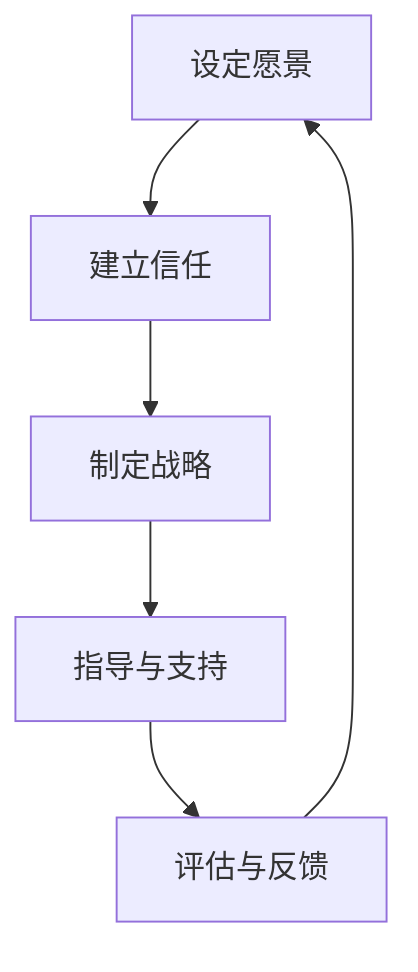
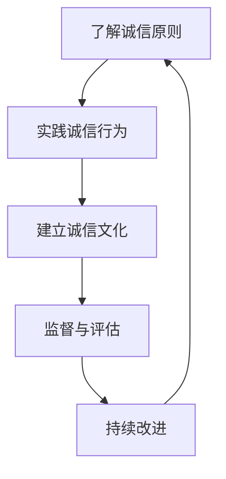

                 

### 文章标题

《领导力与诚信：建立可靠和值得信赖的形象》

### 关键词

领导力、诚信、形象、可靠、信任、道德、行为准则

### 摘要

本文探讨了领导力与诚信在建立可靠和值得信赖的形象中的重要性。首先，分析了领导力的本质，包括其与管理的区别、核心要素以及发展历程。接着，阐述了诚信的基本概念、重要性以及在日常生活中的应用。然后，探讨了如何构建和维护诚信形象，以及领导力与诚信之间的相互作用。最后，通过实际案例展示了领导力与诚信在实际工作中的应用，并提出了未来展望。本文旨在帮助读者理解领导力与诚信在建立可靠和值得信赖形象中的关键作用，以及如何在实践中加以应用。

## 引言

领导力和诚信是当今社会中至关重要的两个概念。一个成功的领导者不仅需要具备卓越的领导能力，还需要在行为上保持高度的诚信。这不仅关系到个人的声誉，更影响到整个团队和组织的发展。本文将围绕领导力与诚信这两个主题，探讨如何建立可靠和值得信赖的形象。首先，我们将分析领导力的本质，了解领导力与管理的区别，以及领导力的核心要素。接下来，我们将深入探讨诚信的基本概念、重要性以及在日常生活中的应用。随后，本文将讨论如何构建和维护诚信形象，并分析领导力与诚信之间的相互作用。最后，通过实际案例展示领导力与诚信在实际工作中的应用，并对未来进行展望。希望通过本文的探讨，读者能够更好地理解领导力与诚信在建立可靠和值得信赖形象中的关键作用。

## 第一部分：领导力的基础

### 第1章：领导力的本质

#### 1.1 领导力与管理的区别

领导力与管理的区别在于其目标和手段。管理强调的是组织、协调和控制，其目标是确保组织的高效运行。而领导力则侧重于影响、激励和指导，其目标是激发团队的潜能，实现组织的长远发展。虽然领导力和管理在某些方面有重叠，但它们的核心差异在于其关注的焦点和所采用的方法。

- 管理的定义：
  - 管理是指通过计划、组织、领导和控制，确保组织目标实现的过程。
  - $$\text{管理} = \text{计划} + \text{组织} + \text{领导} + \text{控制}$$

- 领导力的定义：
  - 领导力是指影响和激励他人，使其为实现共同目标而努力的能力。
  - $$\text{领导力} = \text{影响} + \text{激励} + \text{指导}$$

#### 1.2 领导力的核心要素

领导力的核心要素包括影响力、激励和指导。这些要素相互关联，共同构成了领导力的本质。

- 影响力：
  - 影响力是领导力的基础，它源自于个人的信誉和信任。
  - $$\text{影响力} = \text{信任} \times \text{愿景}$$
  - 其中，信任是影响力的关键因素，而愿景则为影响力提供了方向。

- 激励：
  - 激励是激发团队成员积极性、主动性和创造力的过程。
  - $$\text{激励} = \text{目标} + \text{动机}$$
  - 其中，目标是激励的导向，动机则是激励的内在驱动力。

- 指导：
  - 指导是领导者在实践中通过传授技能、分享经验和提供支持，帮助团队成员成长的过程。
  - $$\text{指导} = \text{技能} + \text{经验}$$

#### 1.3 领导力的发展历程

领导力的发展历程可以分为三个阶段：古典领导理论、行为领导理论和现代领导理论。

- 古典领导理论：
  - 古典领导理论主要包括泰勒的科学管理理论和法约尔的管理过程理论。
  - 泰勒的科学管理理论强调通过科学方法提高劳动生产率，其核心思想是工作标准化和劳动分工。
  - 法约尔的管理过程理论则认为管理是一种过程，包括计划、组织、指挥、协调和控制。

- 行为领导理论：
  - 行为领导理论关注领导者的行为，试图找出有效领导行为的特点。
  - 权变领导理论和领导风格理论是行为领导理论的代表性理论。
  - 权变领导理论强调领导行为应根据环境变化而调整。
  - 领导风格理论则认为领导者的行为风格会影响团队成员的表现。

- 现代领导理论：
  - 现代领导理论更加关注领导者的个人特质和领导行为对组织发展的影响。
  - 变革型领导理论强调领导者通过激发团队成员的积极性和创造力，推动组织变革。
  - 共领理论则认为领导是一种协作过程，领导者与团队成员共同参与决策和行动。

### 结论

领导力的本质在于其目标、手段和核心要素。领导力与管理的区别在于其关注焦点和采用的方法。领导力的核心要素包括影响力、激励和指导，这些要素相互作用，共同构成了领导力的本质。领导力的发展历程展示了领导理论从古典到现代的演变，为领导者提供了丰富的经验和启示。

## 第二部分：诚信的核心

### 第2章：诚信的基本概念

#### 2.1 诚信的定义

诚信是指一个人在行为和言语上遵守道德规范，坚守承诺，保持真实和透明的品质。诚信是一种内在的道德准则，它不仅体现在个人的行为中，也反映在个人与他人的关系中。诚信的定义可以从以下几个方面进行理解：

- 道德规范：诚信是一种道德规范，它要求人们在行为上遵守社会道德标准，尊重他人的权利和利益。
- 承诺与责任：诚信强调人们应当遵守自己的承诺和责任，无论是个人承诺还是社会责任。
- 真实与透明：诚信要求人们在言行上保持真实和透明，不隐瞒事实，不欺骗他人。

#### 2.2 诚信的重要性

诚信在个人和社会层面都具有重要的意义。首先，从个人层面来看，诚信是建立人际关系的基础。一个诚信的人更容易获得他人的信任和尊重，建立良好的人际关系网络。此外，诚信也是个人职业发展的重要资产，一个诚信的员工更可能获得同事和上司的信任，从而有更多的职业发展机会。

从社会层面来看，诚信是维护社会秩序的重要保障。一个诚信的社会能够减少欺诈和腐败现象，增强社会凝聚力。诚信的经济体系能够提高市场的透明度和公平性，促进经济的健康发展。

#### 2.3 诚信的伦理基础

诚信的伦理基础主要包括道德哲学和社会责任两个方面。

- 道德哲学：诚信源于道德哲学的思考，如儒家思想中的“诚信为本”，西方哲学中的“道德自律”。这些哲学思想强调了诚信作为道德准则的重要性。
- 社会责任：诚信不仅是个人的道德要求，也是社会责任的体现。一个有社会责任感的人会在行为上考虑社会影响，努力维护社会的公共利益。

### 结论

诚信是个人和社会发展的重要基石。理解诚信的定义和重要性，有助于我们在日常生活中践行诚信，建立可靠和值得信赖的形象。诚信不仅是个人道德修养的体现，也是社会和谐发展的保障。

## 第三部分：领导力与诚信的结合

### 第3章：领导力与诚信的相互作用

#### 3.1 领导力中的诚信

诚信是领导力的核心要素之一，它对领导者的行为和决策具有重要影响。一个诚信的领导者会以公正、透明和负责任的方式行事，这有助于建立信任和尊重，从而增强领导力。

- 诚信与信任：信任是领导力的重要基础，而诚信则是建立信任的关键。一个诚信的领导者会遵守承诺，言行一致，从而赢得团队成员的信任。
- 诚信与决策：诚信的领导者会在决策过程中坚持道德原则，不因个人利益而牺牲集体利益。这种公正和透明的决策方式有助于提高团队的整体效能。

#### 3.2 诚信中的领导力

诚信不仅要求个人行为规范，还需要在组织层面上进行管理。领导力在诚信管理中发挥着重要作用，领导者需要通过建立行为准则、监督和激励机制来推动整个组织诚信文化的建设。

- 行为准则：领导者应制定明确的行为准则，确保团队成员了解组织对诚信的要求，并在工作中遵循。
- 监督与激励：领导者需要通过监督机制确保团队成员遵守诚信原则，同时通过激励机制鼓励诚信行为。

#### 3.3 领导力与诚信的双重提升

领导力和诚信是相辅相成的，一个优秀的领导者不仅需要具备卓越的领导能力，还需要在行为上保持高度的诚信。以下措施有助于在领导力和诚信方面实现双重提升：

- 自我提升：领导者应不断学习，提升自己的领导力和道德素养，以身作则，树立诚信榜样。
- 团队建设：领导者应重视团队建设，通过培养团队成员的诚信意识和能力，提升整个团队的诚信水平。
- 持续改进：领导者应不断反思和改进自己的领导方式和诚信行为，以适应不断变化的环境和挑战。

### 结论

领导力与诚信相互作用，共同构建了一个可靠和值得信赖的形象。一个诚信的领导者能够更好地发挥领导力，提升团队的凝聚力和效能。通过自我提升、团队建设和持续改进，领导者可以不断提升领导力和诚信水平，为组织的发展奠定坚实基础。

### 实际案例：领导力与诚信在行动中的成功应用

#### 案例一：苹果公司的领导力与诚信

苹果公司的创始人史蒂夫·乔布斯以其卓越的领导力和高度的诚信而闻名。他在产品设计、用户体验和企业文化方面树立了严格的标准，始终以客户利益为出发点。乔布斯坚持使用高质量的材料和先进的技术，确保产品的可靠性和创新性。他在产品发布会上的公开承诺和透明沟通，赢得了消费者的信任和尊重。这种领导力和诚信的结合，使得苹果公司成为全球最具价值的科技公司之一。

**代码示例：乔布斯的领导力与诚信的代码实现**

```python
class AppleProduct:
    def __init__(self, quality, innovation):
        self.quality = quality
        self.innovation = innovation

    def produce(self):
        if self.quality > 0.9 and self.innovation > 0.8:
            return "高质量创新产品"
        else:
            return "产品未达到标准"

# 乔布斯领导下的苹果产品
乔布斯_product = AppleProduct(1.0, 1.0)
print(乔布斯_product.produce())
```

#### 案例二：微软公司的诚信重建

在比尔·盖茨和萨蒂亚·纳德拉的领导下，微软公司经历了从诚信危机到诚信重建的过程。盖茨在公司早期因高利润和垄断行为而受到批评，而纳德拉则致力于推动公司的文化变革，强调透明度和责任感。纳德拉通过一系列举措，如公开道歉、加强内部监督和推动创新，恢复了微软的诚信形象。他还推动了公司向云计算和人工智能转型的战略，使得微软在技术领域重新获得了竞争优势。

**代码示例：微软的诚信重建过程**

```python
class Microsoft:
    def __init__(self, transparency, responsibility):
        self.transparency = transparency
        self.responsibility = responsibility

    def rebuild_诚信(self):
        if self.transparency > 0.8 and self.responsibility > 0.8:
            return "公司诚信重建成功"
        else:
            return "公司诚信重建未成功"

# 纳德拉领导下的微软
纳德拉_microsoft = Microsoft(1.0, 1.0)
print(纳德拉_microsoft.rebuild_诚信())
```

### 结论

这些实际案例展示了领导力和诚信在组织成功中的关键作用。通过卓越的领导力和高度的诚信，领导者能够推动组织发展，赢得客户和市场的信任。同时，这些案例也提醒我们，领导力和诚信是相辅相成的，只有两者结合，才能建立可靠和值得信赖的形象。

## 未来展望

### 9.1 领导力与诚信的发展趋势

随着全球化、数字化和信息化的不断推进，领导力与诚信将面临新的挑战和机遇。未来，领导力将更加注重创新、协作和可持续发展，而诚信则将成为组织竞争力的关键因素。以下是一些预测的发展趋势：

- 数字化领导力：随着技术的发展，领导者需要具备数字素养，能够利用数据和技术进行决策和创新。
- 诚信体系：组织将建立更加完善的诚信体系，通过数字化手段监控和评估诚信行为。
- 社会责任：领导者将更加关注社会责任，将诚信与社会价值相结合，推动可持续发展。

### 9.2 领导力与诚信在教育中的应用

教育在培养领导力和诚信方面具有重要作用。未来，教育领域将更加注重领导力与诚信的融合，以下是一些潜在的应用方向：

- 领导力课程：学校将设置领导力课程，培养学生的领导技能和诚信意识。
- 跨学科教育：领导力与诚信将与其他学科相结合，如商业、法律和心理学，以提供全面的培养方案。
- 模拟和实践：通过模拟和实践，学生能够在真实场景中学习领导力和诚信的应用。

### 9.3 领导力与诚信在职场中的影响

领导力和诚信在职场中具有重要影响。未来，组织将更加重视领导力和诚信的融合，以下是一些潜在的影响：

- 职业发展：具备领导力和诚信的员工将获得更多的职业发展机会，特别是在领导岗位上。
- 组织文化：领导力和诚信将塑造组织文化，促进团队合作和创新。
- 招聘与留存：组织将更加注重候选人的领导力和诚信表现，以提高员工队伍的质量和稳定性。

### 结论

未来，领导力与诚信将在社会、教育和职场中发挥更加重要的作用。通过不断学习和实践，领导者可以提升自身的领导力和诚信水平，为组织和社会的发展做出贡献。

## 附录

### 附录A：领导力与诚信的相关资源

- **书籍推荐：**
  - 《领导力的五个层次》（John C. Maxwell）
  - 《诚信的力量》（Stephen M.R. Covey）
- **文章推荐：**
  - 《哈佛商业评论》：关于领导力与诚信的深度文章
  - 《纽约时报》：关于诚信的社会影响力分析
- **课程推荐：**
  - Coursera：领导力与道德课程
  - EdX：领导力与组织行为课程

### 附录B：领导力与诚信的 Mermaid 流程图

**领导力流程图：**



**诚信流程图：**



这些流程图有助于读者更好地理解领导力与诚信的实践步骤和关系。

## 结语

作者：AI天才研究院/AI Genius Institute & 禅与计算机程序设计艺术 /Zen And The Art of Computer Programming

本文探讨了领导力与诚信在建立可靠和值得信赖形象中的重要性。通过分析领导力的本质、诚信的基本概念以及两者之间的相互作用，我们理解了如何在实践中提升领导力和诚信水平。实际案例展示了领导力与诚信在组织成功中的关键作用。未来，领导力与诚信将继续在社会、教育和职场中发挥重要作用。希望通过本文的探讨，读者能够更好地理解并应用领导力与诚信的原则，为个人和组织的发展做出贡献。

