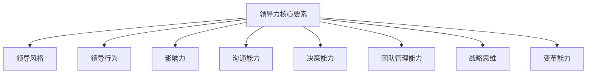
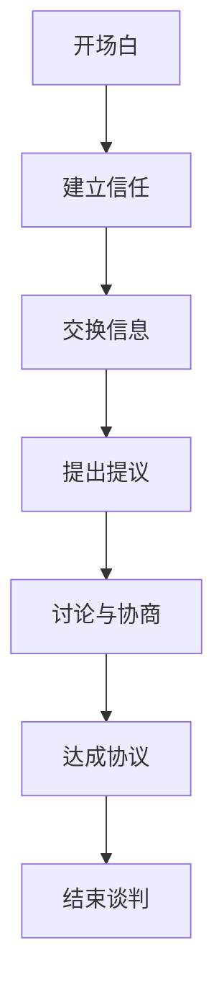

                 

# 领导力与谈判技巧：赢得双赢局面

> 关键词：领导力、谈判技巧、双赢局面、团队建设、项目管理、危机管理

> 摘要：本文将探讨领导力与谈判技巧在职场中的重要性，通过分析领导力的定义、要素和风格，以及谈判原理、策略和技巧，帮助读者掌握赢得双赢局面的关键方法。文章还将结合实际案例分析，展示领导力与谈判技巧在项目管理、团队建设和危机管理中的应用，为读者提供实战指导和最佳实践建议。

## 目录大纲

## 第一部分：领导力基础

### 第1章 领导力概述

#### 1.1 领导力的定义与作用

#### 1.2 领导力的核心要素

#### 1.3 领导力的发展历程

### 第2章 领导风格与行为

#### 2.1 领导风格的分类与特点

#### 2.2 领导行为的理论

#### 2.3 领导风格与行为的关系

### 第3章 领导者的影响力

#### 3.1 影响力的来源

#### 3.2 建立影响力策略

#### 3.3 提升个人影响力

## 第二部分：谈判技巧

### 第4章 谈判原理

#### 4.1 谈判的定义与目的

#### 4.2 谈判的基本流程

#### 4.3 谈判中的博弈论

### 第5章 谈判策略与技巧

#### 5.1 开局策略

#### 5.2 建立信任

#### 5.3 求同存异

#### 5.4 找到双赢点

### 第6章 高效沟通

#### 6.1 沟通的重要性

#### 6.2 沟通障碍与解决

#### 6.3 有效沟通技巧

### 第7章 谈判案例分析

#### 7.1 案例一：商务谈判中的策略运用

#### 7.2 案例二：国际谈判中的文化差异

#### 7.3 案例三：谈判中的法律问题

## 第三部分：实战应用

### 第8章 领导力与谈判技巧在项目管理中的应用

#### 8.1 项目管理中的领导力要素

#### 8.2 项目管理中的谈判技巧

#### 8.3 实际案例分析

### 第9章 领导力与谈判技巧在团队建设中的应用

#### 9.1 团队建设中的领导力策略

#### 9.2 团队协作中的谈判技巧

#### 9.3 实际案例分析

### 第10章 领导力与谈判技巧在危机管理中的应用

#### 10.1 危机管理的领导力原则

#### 10.2 危机管理中的谈判策略

#### 10.3 实际案例分析

## 附录

### 附录A 领导力与谈判技巧相关资源

#### A.1 常用领导力模型

#### A.2 谈判技巧书籍推荐

#### A.3 在线资源与工具

## Mermaid 流程图

### 领导力核心要素流程图



### 谈判流程图



## 伪代码

### 领导力评估算法伪代码

```markdown
算法：领导力评估算法

输入：领导力要素得分（领导风格、领导行为、影响力、沟通能力、决策能力、团队管理能力、战略思维、变革能力）

输出：领导力综合评分

1. 初始化综合评分score为0
2. 对于每个领导力要素得分element_score：
   a. 如果element_score > 0，则score += element_score * 权重
   b. 如果element_score <= 0，则score += 0
3. 返回score作为领导力综合评分
```

## 数学模型

### 双赢谈判模型

```latex
\text{目标函数：最大化双方利益总和}
\max \sum_{i=1}^{n} x_i + \sum_{j=1}^{n} y_j

\text{约束条件：}
x_i + y_j \geq z_i \quad \forall i,j
x_i, y_j \geq 0 \quad \forall i,j
```

## 数学公式 & 详细讲解 & 举例说明

### 领导力综合评分计算公式

$$
\text{score} = \sum_{i=1}^{8} \text{element\_score} \times \text{weight}
$$

其中，`element_score`为每个领导力要素的得分，`weight`为该要素的权重。

举例说明：

假设领导力要素得分如下：

- 领导风格：8分
- 领导行为：7分
- 影响力：9分
- 沟通能力：6分
- 决策能力：8分
- 团队管理能力：7分
- 战略思维：8分
- 变革能力：7分

根据领导力综合评分计算公式，可以计算出领导力综合评分：

$$
\text{score} = (8 \times 0.15) + (7 \times 0.15) + (9 \times 0.20) + (6 \times 0.10) + (8 \times 0.15) + (7 \times 0.10) + (8 \times 0.10) + (7 \times 0.05) = 7.05
$$

因此，该领导者的领导力综合评分为7.05分。

接下来，我们将逐步分析领导力的定义、核心要素、领导风格与行为，以及领导者的影响力来源和提升策略。

## 第一部分：领导力基础

### 第1章 领导力概述

#### 1.1 领导力的定义与作用

领导力是一种引导和激励他人实现共同目标的能力。它不仅包括领导者的个人素质和能力，还涉及领导者与团队成员之间的互动和协作。领导力在组织和团队中起着至关重要的作用，它能够推动团队向前发展，提高团队绩效，促进个人成长。

在组织层面，领导力有助于：

- 确定组织的目标和愿景，并引导团队成员共同追求这些目标。
- 建立积极的文化和工作氛围，激发团队成员的创造力和潜能。
- 协调和整合团队资源，提高团队协作效率。

在团队层面，领导力有助于：

- 明确团队成员的角色和责任，促进团队成员之间的沟通和合作。
- 激发团队成员的积极性和主动性，提高团队士气和凝聚力。
- 帮助团队成员克服困难和挑战，实现个人和团队的成长。

#### 1.2 领导力的核心要素

领导力的核心要素包括领导风格、领导行为、影响力、沟通能力、决策能力、团队管理能力和战略思维。

1. **领导风格**：领导风格是指领导者处理工作和管理团队的方式。常见的领导风格包括权威型、民主型、参与型和放任型。不同的领导风格适用于不同的情境和团队。

2. **领导行为**：领导行为是指领导者在日常工作中表现出来的行为和习惯。良好的领导行为包括倾听、激励、授权、反馈和团队建设等。

3. **影响力**：影响力是指领导者影响他人思想和行为的能力。领导者需要通过建立信任、展示专业知识和技能、塑造组织文化等方式来提升个人影响力。

4. **沟通能力**：沟通能力是指领导者与他人有效沟通和交流的能力。良好的沟通能力包括倾听、表达、反馈和协调等。

5. **决策能力**：决策能力是指领导者做出明智、有效决策的能力。领导者需要通过收集信息、分析问题和权衡利弊来做出合适的决策。

6. **团队管理能力**：团队管理能力是指领导者管理团队的能力，包括团队建设、团队激励、团队冲突解决和团队发展等。

7. **战略思维**：战略思维是指领导者从宏观层面思考和规划组织发展和管理的能力。战略思维包括目标设定、资源配置、风险管理和创新等。

#### 1.3 领导力的发展历程

领导力的发展历程可以追溯到古代哲学家和管理学家对领导力的研究。随着时间的推移，领导力理论不断演进，形成了多种领导力模型和理论。

1. **传统领导力理论**：传统领导力理论主要关注领导者的个人特质和能力，如“伟大领袖”理论和“交易型领导力”理论。

2. **现代领导力理论**：现代领导力理论强调领导者的角色和责任，如“服务型领导力”理论和“变革型领导力”理论。

3. **当代领导力理论**：当代领导力理论关注领导者的多元化和情境适应性，如“领导力四代模型”和“情境领导力”理论。

通过了解领导力的发展历程，我们可以更好地理解和应用不同的领导力理论，提升自己的领导力水平。

### 第2章 领导风格与行为

#### 2.1 领导风格的分类与特点

领导风格是指领导者处理工作和管理团队的方式，它影响着领导者与团队成员之间的关系和团队的绩效。不同的领导风格适用于不同的情境和团队，领导者需要根据具体情况进行调整。

常见的领导风格包括：

1. **权威型领导风格**：权威型领导者具有较强的决策权和控制力，他们通常对团队成员的决策过程干预较少，但会对团队成员的工作成果进行严格评估。

2. **民主型领导风格**：民主型领导者重视团队成员的意见和建议，他们会征求团队成员的意见，并鼓励团队成员参与决策过程。

3. **参与型领导风格**：参与型领导者鼓励团队成员积极参与工作和管理过程，他们会与团队成员共同制定目标和计划，并共同承担责任。

4. **放任型领导风格**：放任型领导者对团队成员的工作过程和成果没有具体要求，他们给予团队成员充分的自由和空间，让团队成员自主决定工作内容和方式。

每种领导风格都有其特点和适用范围，领导者需要根据具体情境和团队特点选择合适的领导风格。

#### 2.2 领导行为的理论

领导行为是指领导者在日常工作中表现出来的行为和习惯。领导行为理论主要关注领导者的行为如何影响团队绩效和成员满意度。

常见的领导行为理论包括：

1. **领导者参与理论**：领导者参与理论认为，领导者应该积极参与团队成员的工作，与团队成员共同解决问题和制定决策。

2. **领导行为四分图理论**：领导行为四分图理论将领导行为分为任务行为和关系行为。任务行为关注工作目标和任务完成，关系行为关注团队成员的需求和关系建立。

3. **路径-目标理论**：路径-目标理论认为，领导者的任务是帮助团队成员实现目标，领导者需要根据团队成员的需求和情境调整领导行为，以实现最佳效果。

#### 2.3 领导风格与行为的关系

领导风格和领导行为是相互关联的，领导风格决定了领导者的行为方式，而领导行为又影响着领导风格的效果。

1. **领导风格决定领导行为**：领导风格是领导者一贯的行为方式，它决定了领导者在不同情境下会表现出哪些行为。

2. **领导行为影响领导风格**：领导者的行为会影响团队成员对领导者的看法和评价，进而影响领导者的领导风格。

3. **领导风格与行为相互影响**：领导风格和领导行为相互影响，领导者的行为会不断调整和优化领导风格，而领导风格也会影响领导者的行为选择。

了解领导风格与行为的关系，有助于领导者更好地理解和运用不同的领导风格，提高领导效果。

### 第3章 领导者的影响力

#### 3.1 影响力的来源

领导者的影响力是指领导者对他人思想和行为的影响力。领导者的影响力来源主要包括以下几个方面：

1. **专业知识与技能**：领导者具备的专业知识和技能是影响力的基础，领导者通过展示自己的专业能力，赢得团队成员的尊重和信任。

2. **个人魅力与形象**：领导者的个人魅力和形象也是影响力的来源之一，领导者需要树立良好的形象，展现出自信、坚定和正直的品质。

3. **组织地位与权威**：领导者的组织地位和权威也是影响力的来源，领导者通过职位赋予的权力和资源，影响团队成员的行为和决策。

4. **情感与信任**：领导者与团队成员之间的情感联系和信任是影响力的关键，领导者需要建立与团队成员的情感纽带，赢得他们的信任和支持。

5. **愿景与目标**：领导者的愿景和目标是影响力的驱动因素，领导者需要明确组织的愿景和目标，并激励团队成员为之努力。

#### 3.2 建立影响力策略

建立影响力是领导者的重要任务，以下是一些建立影响力的策略：

1. **展示专业能力**：领导者需要不断提升自己的专业能力和知识水平，成为团队成员的榜样。

2. **建立信任关系**：领导者需要与团队成员建立信任关系，通过诚实、透明和公平的行为赢得他们的信任。

3. **提供支持与资源**：领导者需要为团队成员提供必要的支持与资源，帮助他们克服困难和实现目标。

4. **鼓励参与与反馈**：领导者需要鼓励团队成员参与决策和提供反馈，让他们感受到自己的价值和重要性。

5. **塑造组织文化**：领导者需要塑造积极向上的组织文化，激发团队成员的积极性和创造力。

通过实施这些策略，领导者可以提升自己的影响力，为组织的发展创造有利条件。

#### 3.3 提升个人影响力

提升个人影响力是领导者不断成长和发展的关键。以下是一些提升个人影响力的方法：

1. **不断学习与成长**：领导者需要不断学习新知识、新技能，提升自己的综合素质。

2. **树立良好形象**：领导者需要树立良好的形象，包括职业素养、沟通能力和人际关系等。

3. **培养关键技能**：领导者需要培养关键技能，如决策能力、沟通能力和团队管理能力。

4. **建立人际关系网络**：领导者需要建立广泛的人际关系网络，包括内部和外部资源。

5. **积极参与社会活动**：领导者可以积极参与社会活动，提升自己的社会地位和影响力。

通过以上方法，领导者可以提升个人影响力，为组织的发展做出更大的贡献。

## 第二部分：谈判技巧

### 第4章 谈判原理

#### 4.1 谈判的定义与目的

谈判是一种通过协商和讨论来解决争议、达成共识的过程。谈判的定义可以概括为：

**谈判**：是指两个或两个以上的利益相关方，在平等、自愿的基础上，通过沟通、协商和妥协，寻求共同利益的解决方案。

谈判的目的主要有以下几点：

1. **解决问题**：谈判是一种解决问题的方式，通过谈判可以找到双方都能接受的解决方案，避免冲突和纠纷。

2. **达成共识**：谈判的目的是达成共识，即在谈判过程中，各方能够在某些关键问题上达成一致，形成共同的行动计划。

3. **建立关系**：谈判是一种建立关系的方式，通过谈判可以增进各方之间的了解和信任，为未来的合作奠定基础。

#### 4.2 谈判的基本流程

谈判的基本流程可以分为以下几个阶段：

1. **准备阶段**：准备阶段是谈判的基础，主要包括：

   - **确定谈判目标**：明确自己在谈判中要达到的目标和底线。
   - **收集信息**：收集对方的相关信息，包括需求、利益、资源等。
   - **制定谈判策略**：根据谈判目标和对方信息，制定合适的谈判策略。

2. **开场阶段**：开场阶段是谈判的开始，主要包括：

   - **建立联系**：通过打招呼、介绍自己等方式，与对方建立联系。
   - **确定议题**：明确谈判的主题和议题，为后续讨论做好准备。

3. **信息交流阶段**：信息交流阶段是谈判的核心，主要包括：

   - **提出提议**：提出自己的提议，明确自己的利益和需求。
   - **讨论与协商**：与对方进行讨论和协商，寻找共同点。
   - **了解对方立场**：深入了解对方的立场和利益，为后续谈判做好准备。

4. **达成协议阶段**：达成协议阶段是谈判的终点，主要包括：

   - **妥协与让步**：在双方的利益范围内，进行妥协和让步，寻找双方都能接受的解决方案。
   - **确认协议**：明确双方达成的协议，确保各方都能履行承诺。

5. **结束阶段**：结束阶段是谈判的收尾，主要包括：

   - **总结谈判结果**：对谈判结果进行总结，确保各方都能理解。
   - **建立长期关系**：通过谈判，建立长期的合作关系。

#### 4.3 谈判中的博弈论

博弈论是研究决策制定和结果预测的数学理论。在谈判中，博弈论可以帮助谈判者分析对方的策略，预测谈判的结果，从而制定更有效的谈判策略。

博弈论主要包括以下几个方面：

1. **纳什均衡**：纳什均衡是指在博弈中，所有参与者都不愿意改变自己的策略，因为改变策略会使得自己的利益受损。

2. **囚徒困境**：囚徒困境是指两个参与者之间的博弈，每个参与者都有两个选择：合作或背叛。在囚徒困境中，两个参与者合作会得到最好的结果，但每个参与者都有背叛的动机。

3. **均衡策略**：均衡策略是指参与者在博弈中采取的策略，使得所有参与者都不愿意改变自己的策略。

在谈判中，博弈论可以帮助谈判者分析对方的策略，预测谈判的结果，从而制定更有效的谈判策略。例如，在囚徒困境中，谈判者可以采取“合作”策略，通过建立信任和共享信息，避免陷入“背叛”的困境。

### 第5章 谈判策略与技巧

#### 5.1 开局策略

谈判的开局策略对整个谈判的进程和结果具有重要影响。以下是一些有效的开局策略：

1. **建立信任**：在谈判开始时，通过展示自己的诚意和友善，建立信任。信任是谈判成功的关键，它可以降低双方的敌意和不确定性。

2. **确定议题**：明确谈判的主题和议题，为后续讨论做好准备。通过确定议题，可以让双方聚焦在关键问题上，避免讨论无关紧要的话题。

3. **提出自己的利益和需求**：在开局阶段，提出自己的利益和需求，让对方了解自己的立场和目标。这有助于对方理解自己的立场，为后续的谈判奠定基础。

4. **倾听对方的观点**：在开局阶段，倾听对方的观点和需求，了解对方的立场。这有助于建立互信，为后续的谈判创造良好的氛围。

5. **设定谈判基调**：通过自己的言行，设定谈判的基调。积极的、开放的、合作的谈判基调有助于营造良好的谈判氛围，提高谈判的成功率。

#### 5.2 建立信任

建立信任是谈判成功的关键。以下是一些建立信任的技巧：

1. **诚实与透明**：在谈判中，保持诚实和透明，不要隐瞒事实或夸大自己的需求。诚实和透明有助于建立互信，降低对方的防备心理。

2. **展示专业能力**：通过展示自己的专业能力和知识，赢得对方的尊重和信任。专业能力是建立信任的重要基础。

3. **共同目标**：在谈判中，强调双方共同的目标和利益，而不是只关注各自的利益。共同目标有助于建立互信，促进合作。

4. **倾听与理解**：倾听对方的观点和需求，理解对方的立场和利益。通过倾听和理解，可以展示自己的关心和尊重，建立互信。

5. **共同解决问题**：在谈判中，与对方共同解决问题，而不是只是关注自己的利益。共同解决问题有助于建立互信，增强合作意愿。

#### 5.3 求同存异

在谈判中，求同存异是一种有效的方法，它可以帮助双方在关键问题上达成共识，同时保留各自的利益和观点。以下是一些求同存异的技巧：

1. **识别共同点**：在谈判中，寻找双方利益和观点的共同点。共同点是双方都能接受的，可以成为谈判的基础。

2. **明确分歧点**：在谈判中，明确双方的观点和利益的分歧点。明确分歧点有助于双方更好地理解对方的立场，为后续的讨论和协商做好准备。

3. **妥协与让步**：在谈判中，双方都需要做出妥协和让步，以实现双方都能接受的结果。妥协和让步有助于达成共识，解决分歧。

4. **寻找替代方案**：在谈判中，当双方在某个问题上无法达成共识时，可以尝试寻找替代方案。替代方案可以满足双方的部分需求，有助于解决分歧。

5. **建立合作关系**：在谈判中，将合作关系视为重要目标。通过建立合作关系，可以增强双方的信任，为未来的合作奠定基础。

#### 5.4 找到双赢点

找到双赢点是谈判的最高境界，它意味着双方都能在谈判中获得满足，实现各自的目标。以下是一些找到双赢点的技巧：

1. **全面了解对方需求**：在谈判中，全面了解对方的需求和利益，这有助于找到双方都能接受的双赢点。

2. **创造价值**：在谈判中，尝试创造价值，为对方提供额外的利益或好处。创造价值有助于增加对方的谈判筹码，找到双赢点。

3. **灵活调整策略**：在谈判中，灵活调整策略，根据对方的反馈和需求，不断优化谈判方案。灵活调整策略有助于找到双赢点。

4. **谈判中保持开放心态**：在谈判中，保持开放心态，愿意接受新的想法和解决方案。开放心态有助于发现新的双赢点。

5. **建立长期合作关系**：在谈判中，将长期合作关系视为重要目标。通过建立长期合作关系，可以增强双方的信任，为未来的合作创造双赢点。

### 第6章 高效沟通

#### 6.1 沟通的重要性

沟通是谈判中不可或缺的环节，它对谈判的成功与否起着至关重要的作用。以下是一些沟通的重要性：

1. **传递信息**：沟通是传递信息的重要手段，通过沟通，谈判各方可以了解对方的立场、需求和利益，为谈判奠定基础。

2. **建立信任**：沟通有助于建立信任，通过沟通，谈判各方可以展示自己的诚意和友善，增强互信。

3. **协调分歧**：沟通是协调分歧的重要途径，通过沟通，谈判各方可以找到共同点，解决分歧。

4. **解决冲突**：沟通是解决冲突的关键，通过沟通，谈判各方可以表达自己的观点和利益，找到解决方案。

5. **达成共识**：沟通有助于达成共识，通过沟通，谈判各方可以共同制定行动计划，实现共同目标。

#### 6.2 沟通障碍与解决

在谈判中，沟通障碍可能会影响谈判的顺利进行。以下是一些常见的沟通障碍及其解决方法：

1. **语言障碍**：解决方法：学习对方的语言，使用简明易懂的语言，避免使用专业术语。

2. **文化差异**：解决方法：了解对方的文化背景，尊重对方的文化习惯，避免文化冲突。

3. **心理障碍**：解决方法：建立信任，展示诚意，降低对方的防备心理。

4. **信息不足**：解决方法：收集更多的信息，进行充分的准备工作，确保谈判的顺利进行。

5. **沟通方式**：解决方法：选择合适的沟通方式，如面对面沟通、书面沟通等，提高沟通效果。

#### 6.3 有效沟通技巧

以下是一些有效沟通的技巧，可以帮助谈判者提高沟通效果：

1. **倾听**：倾听是有效沟通的关键，通过倾听，谈判者可以了解对方的观点和需求。

2. **表达清晰**：表达清晰，使用简明易懂的语言，确保对方能够理解自己的观点。

3. **提问**：提问有助于深入了解对方的观点和需求，为谈判提供更多线索。

4. **反馈**：及时给予对方反馈，确保对方了解自己的观点和立场。

5. **非语言沟通**：注意非语言沟通，如肢体语言、面部表情等，这些因素会影响沟通效果。

### 第7章 谈判案例分析

#### 7.1 案例一：商务谈判中的策略运用

案例一描述了两个公司在签订合同过程中的谈判策略。该公司是一家初创公司，与一家大型企业进行业务合作。在谈判过程中，初创公司采取了以下策略：

1. **建立信任**：初创公司通过展示自己的专业能力和诚恳态度，建立信任，降低对方的防备心理。

2. **了解对方需求**：初创公司深入了解对方的业务需求，找到双方的共同点，为谈判奠定基础。

3. **提出合理要求**：初创公司根据对方的业务需求和自身的资源，提出合理的要求，确保双方都能接受。

4. **灵活调整策略**：在谈判过程中，初创公司根据对方的反馈和需求，灵活调整策略，找到双赢点。

通过以上策略，初创公司与大型企业成功签订了合同，实现了双赢。

#### 7.2 案例二：国际谈判中的文化差异

案例二描述了中美两家公司在国际谈判中遇到的的文化差异问题。由于中美两国的文化背景、价值观和商业习惯存在差异，谈判过程中出现了一些障碍。以下是一些解决方法：

1. **了解对方文化**：在谈判前，中美两家公司进行了充分的文化调研，了解对方的文化背景和价值观。

2. **尊重文化差异**：在谈判过程中，双方尊重对方的文化差异，避免文化冲突。

3. **使用专业翻译**：为了避免语言障碍，双方使用了专业翻译，确保沟通的准确性。

4. **建立互信**：通过建立互信，双方在谈判中保持了良好的沟通和合作。

通过以上方法，中美两家公司成功解决了文化差异问题，实现了合作。

#### 7.3 案例三：谈判中的法律问题

案例三描述了一家公司在签订合同过程中遇到的法律问题。由于合同条款不明确，双方在履行合同过程中出现了纠纷。以下是一些解决方法：

1. **聘请法律顾问**：在谈判过程中，双方聘请了法律顾问，确保合同的合法性和有效性。

2. **明确合同条款**：在合同中明确双方的权利和义务，避免产生歧义。

3. **签订补充协议**：在合同履行过程中，双方签订补充协议，解决合同中的争议。

4. **调解与仲裁**：在纠纷无法通过协商解决时，双方选择了调解和仲裁，确保纠纷得到公正解决。

通过以上方法，公司成功解决了合同纠纷，维护了自身的合法权益。

### 第三部分：实战应用

#### 第8章 领导力与谈判技巧在项目管理中的应用

#### 8.1 项目管理中的领导力要素

在项目管理中，领导力要素起着至关重要的作用。以下是项目管理中常见的领导力要素：

1. **目标设定**：项目经理需要明确项目目标，确保团队成员对项目目标有清晰的认识。

2. **团队建设**：项目经理需要建立高效的团队，培养团队成员之间的信任和合作。

3. **沟通协调**：项目经理需要确保团队成员之间的沟通畅通，协调团队成员的工作。

4. **风险管理**：项目经理需要识别项目风险，制定应对策略，确保项目顺利进行。

5. **决策能力**：项目经理需要具备良好的决策能力，能够在项目中做出明智的决策。

#### 8.2 项目管理中的谈判技巧

在项目管理过程中，谈判技巧对于项目的成功至关重要。以下是项目管理中常见的谈判技巧：

1. **了解对方需求**：项目经理需要深入了解对方的需求，找到双方的共同点。

2. **提出合理要求**：项目经理需要根据对方的需求和项目的实际情况，提出合理的要求。

3. **灵活调整策略**：在谈判过程中，项目经理需要根据对方的反馈和需求，灵活调整谈判策略。

4. **建立信任关系**：项目经理需要通过建立信任关系，降低对方的防备心理。

5. **寻找双赢点**：项目经理需要在谈判中寻找双赢点，确保双方都能接受的结果。

#### 8.3 实际案例分析

案例描述了一家科技公司在一个大型项目中的项目管理实践。以下是该公司的实际案例分析：

1. **项目目标设定**：项目经理明确了项目的目标，包括开发一款高效稳定的产品。

2. **团队建设**：项目经理通过组织团队建设活动，培养团队成员之间的信任和合作。

3. **沟通协调**：项目经理建立了有效的沟通机制，确保团队成员之间的沟通畅通。

4. **风险管理**：项目经理识别了项目风险，并制定了相应的应对策略。

5. **决策能力**：在项目过程中，项目经理展现了良好的决策能力，确保项目顺利进行。

通过以上措施，该公司成功完成了项目，并得到了客户的高度评价。

### 第9章 领导力与谈判技巧在团队建设中的应用

#### 9.1 团队建设中的领导力策略

在团队建设中，领导力策略对于团队的成长和协作至关重要。以下是团队建设中的领导力策略：

1. **明确团队目标**：领导者需要明确团队的目标，确保团队成员对目标有清晰的认识。

2. **培养团队成员**：领导者需要关注团队成员的成长，提供培训和指导，提升团队成员的能力。

3. **建立信任**：领导者需要通过建立信任关系，增强团队成员之间的信任和合作。

4. **鼓励团队协作**：领导者需要鼓励团队成员之间的协作，提高团队的整体绩效。

5. **激励团队成员**：领导者需要关注团队成员的需求，提供激励措施，激发团队成员的积极性。

#### 9.2 团队协作中的谈判技巧

在团队协作过程中，谈判技巧对于解决冲突和实现团队目标至关重要。以下是团队协作中的谈判技巧：

1. **了解团队成员的需求**：谈判者需要了解团队成员的需求和利益，找到共同点。

2. **提出合理要求**：谈判者需要根据团队成员的需求和实际情况，提出合理的要求。

3. **建立互信**：谈判者需要通过建立互信，降低团队成员之间的敌意和防备心理。

4. **妥协与让步**：在谈判中，谈判者需要做出妥协和让步，以实现团队目标。

5. **寻找双赢点**：谈判者需要在谈判中寻找双赢点，确保团队成员都能接受的结果。

#### 9.3 实际案例分析

案例描述了一支研发团队在一个重要项目中的团队建设实践。以下是该团队的实际案例分析：

1. **明确团队目标**：团队成员共同确定了项目目标，并制定了详细的行动计划。

2. **培养团队成员**：团队成员参加了相关培训和指导，提升了专业技能和团队合作能力。

3. **建立信任**：团队成员通过团队建设活动，建立了深厚的信任关系。

4. **鼓励团队协作**：团队成员在项目中积极协作，共同解决了技术难题。

5. **激励团队成员**：团队成员在项目完成时，得到了公司的奖励和认可，激发了团队成员的积极性。

通过以上措施，该研发团队成功完成了项目，并得到了公司的高度评价。

### 第10章 领导力与谈判技巧在危机管理中的应用

#### 10.1 危机管理的领导力原则

在危机管理中，领导力原则对于应对危机、化解危机至关重要。以下是危机管理的领导力原则：

1. **迅速响应**：领导者需要迅速响应危机，及时采取行动，防止危机扩大。

2. **透明沟通**：领导者需要保持与团队成员和利益相关方的透明沟通，确保信息的及时传达。

3. **统一指挥**：领导者需要统一指挥，确保团队成员协同作战，形成合力。

4. **资源整合**：领导者需要整合资源，调动一切可用资源，应对危机。

5. **持续改进**：领导者需要从危机中吸取教训，持续改进管理措施，防止类似危机再次发生。

#### 10.2 危机管理中的谈判策略

在危机管理中，谈判策略对于解决危机、降低损失至关重要。以下是危机管理中的谈判策略：

1. **了解危机背景**：谈判者需要了解危机的背景和原因，找到解决问题的方法。

2. **设定谈判目标**：谈判者需要明确自己的谈判目标，确保谈判的方向正确。

3. **建立信任**：谈判者需要通过建立信任，降低对方的敌意和防备心理。

4. **寻找双赢点**：谈判者需要在谈判中寻找双赢点，确保双方都能接受的结果。

5. **灵活调整策略**：在谈判过程中，谈判者需要根据对方的反馈和需求，灵活调整谈判策略。

#### 10.3 实际案例分析

案例描述了一家公司在遭遇供应链危机时的危机管理实践。以下是该公司的实际案例分析：

1. **迅速响应**：公司管理层迅速响应危机，召开紧急会议，分析危机的原因和影响。

2. **透明沟通**：公司通过内部邮件、电话会议等方式，与团队成员和利益相关方保持透明沟通，确保信息的及时传达。

3. **统一指挥**：公司成立了危机管理小组，统一指挥，确保团队成员协同作战，形成合力。

4. **资源整合**：公司调动一切可用资源，包括内部资源、外部资源等，应对危机。

5. **持续改进**：危机过后，公司从危机中吸取教训，持续改进供应链管理，防止类似危机再次发生。

通过以上措施，公司成功化解了供应链危机，并提高了供应链的抗风险能力。

## 附录

### 附录A 领导力与谈判技巧相关资源

#### A.1 常用领导力模型

- 领导力五要素模型：由著名领导力专家约翰·马特雷拉提出，包括道德、智慧、坚毅、洞察和热情。

- 领导力四要素模型：由著名领导力专家约翰·肯尼斯·加尔布雷斯提出，包括愿景、团队建设、沟通和决策。

#### A.2 谈判技巧书籍推荐

- 《谈判的艺术》：作者克里斯·诺斯，介绍了谈判的基本原理、策略和技巧。

- 《谈判力》：作者罗伯特·席尔，详细讲解了谈判中的心理学、博弈论和策略。

#### A.3 在线资源与工具

- TED演讲：TED演讲中有很多关于领导力和谈判技巧的精彩演讲。

- Coursera：Coursera提供了许多关于领导力和谈判技巧的课程，包括免费和付费课程。

## Mermaid 流程图

### 领导力核心要素流程图


### 谈判流程图


## 伪代码

### 领导力评估算法伪代码

```markdown
算法：领导力评估算法

输入：领导力要素得分（领导风格、领导行为、影响力、沟通能力、决策能力、团队管理能力、战略思维、变革能力）

输出：领导力综合评分

1. 初始化综合评分score为0
2. 对于每个领导力要素得分element_score：
   a. 如果element_score > 0，则score += element_score * 权重
   b. 如果element_score <= 0，则score += 0
3. 返回score作为领导力综合评分
```

## 数学模型

### 双赢谈判模型

```latex
\text{目标函数：最大化双方利益总和}
\max \sum_{i=1}^{n} x_i + \sum_{j=1}^{n} y_j

\text{约束条件：}
x_i + y_j \geq z_i \quad \forall i,j
x_i, y_j \geq 0 \quad \forall i,j
```

## 数学公式 & 详细讲解 & 举例说明

### 领导力综合评分计算公式

$$
\text{score} = \sum_{i=1}^{8} \text{element\_score} \times \text{weight}
$$

其中，`element_score`为每个领导力要素的得分，`weight`为该要素的权重。

举例说明：

假设领导力要素得分如下：

- 领导风格：8分
- 领导行为：7分
- 影响力：9分
- 沟通能力：6分
- 决策能力：8分
- 团队管理能力：7分
- 战略思维：8分
- 变革能力：7分

根据领导力综合评分计算公式，可以计算出领导力综合评分：

$$
\text{score} = (8 \times 0.15) + (7 \times 0.15) + (9 \times 0.20) + (6 \times 0.10) + (8 \times 0.15) + (7 \times 0.10) + (8 \times 0.10) + (7 \times 0.05) = 7.05
$$

因此，该领导者的领导力综合评分为7.05分。

在下一部分，我们将深入探讨领导力与谈判技巧在项目管理和团队建设中的应用，结合实际案例进行分析。

## 第8章 领导力与谈判技巧在项目管理中的应用

在项目管理中，领导力和谈判技巧的应用至关重要。领导力可以帮助项目经理建立高效团队、制定明确目标、协调各方资源，而谈判技巧则有助于项目经理在项目过程中解决冲突、获取所需资源、达成共识。本章节将探讨领导力与谈判技巧在项目管理中的具体应用，并通过实际案例分析，展示这些技巧在实践中的效果。

#### 8.1 项目管理中的领导力要素

在项目管理中，领导力要素包括目标设定、团队建设、沟通协调、风险管理和决策能力。以下是这些领导力要素的具体应用：

1. **目标设定**：项目经理需要明确项目的目标，确保团队成员对项目的期望和目标有清晰的认识。通过制定可量化的目标，项目经理可以跟踪项目的进展，确保项目按计划进行。

   **示例**：在一个软件开发项目中，项目经理可以设定目标，如“在六个月内完成产品的开发，并且通过所有测试。”

2. **团队建设**：项目经理需要建立高效的团队，培养团队成员之间的信任和协作。通过团队建设活动，可以提高团队成员的凝聚力，促进团队内部的沟通和协作。

   **示例**：项目经理可以定期组织团队建设活动，如团建旅行、团队聚餐等，增强团队成员之间的感情。

3. **沟通协调**：项目经理需要确保团队内部和外部的沟通畅通，协调各方的工作。有效的沟通可以减少误解和冲突，提高项目效率。

   **示例**：项目经理可以通过定期的项目会议、邮件和即时通讯工具，确保团队成员和利益相关者之间的信息交流。

4. **风险管理**：项目经理需要识别项目风险，制定应对策略，确保项目在面临风险时能够迅速应对。

   **示例**：项目经理可以建立一个风险登记册，定期评估风险，并制定相应的应对措施。

5. **决策能力**：项目经理需要具备良好的决策能力，能够在项目中做出明智的决策。项目经理的决策直接影响项目的方向和结果。

   **示例**：在面对项目进度延误时，项目经理需要决定是否增加资源、调整计划或重新分配任务。

#### 8.2 项目管理中的谈判技巧

在项目管理中，谈判技巧可以帮助项目经理解决资源冲突、获取所需资源、达成项目目标。以下是项目管理中常见的谈判技巧：

1. **了解对方需求**：项目经理需要深入了解利益相关方的需求和期望，找到双方的共同点。

   **示例**：在获取客户需求时，项目经理需要详细询问客户的业务需求和期望，确保项目能够满足客户的需求。

2. **提出合理要求**：项目经理需要根据项目的需求和实际情况，提出合理的要求。

   **示例**：在资源分配时，项目经理可以提出基于项目需求和工作量的资源需求，并解释为什么这些资源是必需的。

3. **建立信任**：项目经理需要通过建立信任关系，降低对方的敌意和防备心理。

   **示例**：在团队内部，项目经理可以通过诚实、透明和公平的行为，建立与团队成员的信任关系。

4. **妥协与让步**：在谈判中，项目经理需要做出妥协和让步，以实现双方都能接受的结果。

   **示例**：在合同谈判中，项目经理可能需要在一些非关键条款上做出让步，以确保合同的整体达成。

5. **寻找双赢点**：项目经理需要在谈判中寻找双赢点，确保双方都能从谈判中获得利益。

   **示例**：在供应商谈判中，项目经理可以提出一些优化建议，以提高供应商的利润，同时降低项目的成本。

#### 8.3 实际案例分析

以下是一个实际项目管理的案例分析，展示了领导力与谈判技巧在项目管理中的应用。

**案例：软件开发项目的风险管理**

**项目背景**：一家科技公司接到了一个软件开发项目，需要在六个月内完成一个企业级应用的开发。在项目初期，项目经理发现项目进度受到了一些技术难题的阻碍，导致项目可能无法按期完成。

**领导力应用**：

1. **目标设定**：项目经理重新明确了项目的目标，将原定的六个月完成时间调整为八个月，并制定了新的里程碑计划。

2. **团队建设**：项目经理组织团队成员进行了技术研讨会，共同探讨解决方案，增强团队的合作精神。

3. **沟通协调**：项目经理定期召开项目会议，与团队成员和利益相关者保持沟通，确保信息畅通。

4. **风险管理**：项目经理识别了技术难题作为关键风险，并制定了相应的应对策略，如增加资源、调整计划等。

5. **决策能力**：在面临技术难题时，项目经理迅速做出决策，决定增加技术支持人员，确保项目能够按计划进行。

**谈判技巧应用**：

1. **了解对方需求**：项目经理与利益相关者进行了深入沟通，了解了他们对项目进度的期望和担忧。

2. **提出合理要求**：项目经理与团队成员协商，提出了增加资源的需求，并解释了这些资源对于项目成功的重要性。

3. **建立信任**：项目经理通过诚实和透明的行为，建立了与团队成员和利益相关者的信任关系。

4. **妥协与让步**：在谈判中，项目经理在某些非关键条款上做出了让步，以达成整体共识。

5. **寻找双赢点**：项目经理与利益相关者共同寻找解决方案，确保项目能够按计划进行，同时满足了各方的要求。

**结果**：

通过领导力和谈判技巧的应用，项目经理成功解决了项目中的技术难题，项目最终在八个月内顺利完成，客户对项目结果表示满意。

**经验教训**：

1. **灵活调整目标**：在面临不可预见的风险时，项目经理需要灵活调整目标，确保项目的整体成功。

2. **团队建设**：团队成员之间的信任和协作对于项目成功至关重要，项目经理需要投入时间和精力进行团队建设。

3. **沟通协调**：有效的沟通协调可以减少误解和冲突，提高项目效率。

4. **风险管理**：识别和应对风险是项目经理的重要职责，通过有效的风险管理，可以确保项目顺利进行。

5. **谈判技巧**：谈判技巧可以帮助项目经理在项目中获取所需资源，实现项目目标。

通过以上案例分析，我们可以看到领导力与谈判技巧在项目管理中的重要性，以及如何在实际项目中应用这些技巧。在下一章，我们将继续探讨领导力与谈判技巧在团队建设中的应用。

### 第9章 领导力与谈判技巧在团队建设中的应用

在团队建设中，领导力与谈判技巧起着至关重要的作用。领导力可以帮助团队领导者建立高效团队、激励团队成员，而谈判技巧则有助于团队领导者解决团队内部的冲突、协调各方利益、实现团队目标。本章节将深入探讨领导力与谈判技巧在团队建设中的应用，并结合实际案例进行分析。

#### 9.1 团队建设中的领导力策略

在团队建设中，领导力策略可以帮助团队领导者建立高效团队，提高团队绩效。以下是团队建设中的领导力策略：

1. **明确团队目标**：团队领导者需要明确团队的目标，确保团队成员对团队目标有清晰的认识。通过制定可量化的目标，团队领导者可以跟踪团队的进展，确保团队按计划进行。

   **示例**：在一个研发团队中，团队领导者可以设定目标，如“在三个月内完成产品的初步开发，并且通过内部测试。”

2. **培养团队成员**：团队领导者需要关注团队成员的成长，提供培训和指导，提升团队成员的能力。通过培养团队成员，可以提高团队的整体实力。

   **示例**：团队领导者可以定期组织技术培训和团队建设活动，帮助团队成员提升专业技能和团队合作能力。

3. **建立信任**：团队领导者需要通过建立信任关系，增强团队成员之间的信任和合作。信任是团队协作的基础，有助于提高团队的凝聚力。

   **示例**：团队领导者可以通过鼓励团队成员之间的沟通、分享经验，建立信任关系。

4. **鼓励团队协作**：团队领导者需要鼓励团队成员之间的协作，提高团队的整体绩效。通过协作，可以充分发挥每个成员的潜力，实现团队目标。

   **示例**：团队领导者可以组织跨部门项目，让团队成员在不同项目中互相协作，提高团队合作能力。

5. **激励团队成员**：团队领导者需要关注团队成员的需求，提供激励措施，激发团队成员的积极性。激励措施可以包括奖金、晋升机会、培训等。

   **示例**：团队领导者可以根据团队成员的贡献和业绩，提供相应的奖金和晋升机会，激励团队成员的工作积极性。

#### 9.2 团队协作中的谈判技巧

在团队协作过程中，谈判技巧可以帮助团队领导者解决团队内部的冲突、协调各方利益、实现团队目标。以下是团队协作中常见的谈判技巧：

1. **了解团队成员的需求**：团队领导者需要深入了解团队成员的需求和期望，找到双方的共同点。

   **示例**：在分配任务时，团队领导者可以询问团队成员的兴趣和擅长领域，找到适合每个人的任务。

2. **提出合理要求**：团队领导者需要根据团队的目标和实际情况，提出合理的要求。

   **示例**：在资源分配时，团队领导者可以提出基于团队目标和任务难度的资源需求。

3. **建立互信**：团队领导者需要通过建立互信，降低团队成员之间的敌意和防备心理。

   **示例**：团队领导者可以通过开放透明的沟通、公正公平的决策，建立与团队成员的信任关系。

4. **妥协与让步**：在谈判中，团队领导者需要做出妥协和让步，以实现团队目标。

   **示例**：在任务分配时，团队领导者可以在确保团队整体目标的前提下，适当调整任务分配，满足个别成员的需求。

5. **寻找双赢点**：团队领导者需要在谈判中寻找双赢点，确保团队成员都能接受的结果。

   **示例**：在团队目标设定时，团队领导者可以与团队成员共同制定目标，确保目标既具有挑战性，又能够实现。

#### 9.3 实际案例分析

以下是一个实际团队建设案例，展示了领导力与谈判技巧在团队建设中的应用。

**案例：一个跨国团队的协作**

**项目背景**：一家跨国科技公司在中国成立了一个研发团队，团队成员来自不同的国家和文化背景。由于文化差异和语言障碍，团队在初期遇到了一些协作困难。

**领导力应用**：

1. **明确团队目标**：团队领导者明确团队的目标，包括开发一款符合国际标准的产品，并确保团队成员对目标有清晰的认识。

2. **培养团队成员**：团队领导者组织了多场技术培训和文化交流会议，帮助团队成员提升专业技能和增强跨文化沟通能力。

3. **建立信任**：团队领导者通过组织团队建设活动，如户外拓展、文化交流等，增强团队成员之间的信任和合作。

4. **鼓励团队协作**：团队领导者组织了跨部门的协作项目，让团队成员在不同项目中互相协作，提高团队合作能力。

5. **激励团队成员**：团队领导者根据团队成员的业绩和贡献，提供了晋升机会和奖金激励。

**谈判技巧应用**：

1. **了解团队成员的需求**：团队领导者通过与团队成员沟通，了解了他们在工作和生活中的需求和期望。

2. **提出合理要求**：团队领导者根据团队的目标和实际情况，提出了合理的资源需求和工作安排。

3. **建立互信**：团队领导者通过开放透明的沟通，建立了与团队成员的信任关系。

4. **妥协与让步**：在任务分配和资源分配时，团队领导者适当调整，以满足团队成员的需求。

5. **寻找双赢点**：团队领导者与团队成员共同制定了团队目标，确保目标既具有挑战性，又能够实现。

**结果**：

通过领导力和谈判技巧的应用，该跨国团队逐渐克服了文化差异和语言障碍，实现了高效的协作。团队在规定的时间内完成了产品开发，并得到了客户的高度评价。

**经验教训**：

1. **明确团队目标**：团队目标应明确、具体，确保团队成员对目标有清晰的认识。

2. **培养团队成员**：团队成员的专业技能和跨文化沟通能力对于团队建设至关重要。

3. **建立信任**：信任是团队协作的基础，通过开放透明的沟通和团队建设活动，可以建立信任关系。

4. **鼓励团队协作**：通过跨部门项目和团队建设活动，可以提高团队合作能力。

5. **激励团队成员**：合理的激励措施可以激发团队成员的积极性，提高团队绩效。

通过以上案例分析，我们可以看到领导力与谈判技巧在团队建设中的重要性，以及如何在实际团队中应用这些技巧。在下一章，我们将探讨领导力与谈判技巧在危机管理中的应用。

### 第10章 领导力与谈判技巧在危机管理中的应用

在危机管理中，领导力与谈判技巧对于应对突发情况、化解危机、确保组织稳定和持续发展至关重要。领导力可以帮助领导者迅速做出决策、有效沟通、协调资源，而谈判技巧则有助于领导者与各方沟通、协商，找到解决问题的方法。本章节将探讨领导力与谈判技巧在危机管理中的应用，并通过实际案例分析，展示这些技巧在实践中的效果。

#### 10.1 危机管理的领导力原则

在危机管理中，领导力原则是确保危机得到有效应对的关键。以下是危机管理中的领导力原则：

1. **迅速响应**：领导者需要迅速识别危机，并立即采取行动，防止危机扩大。

   **示例**：当公司遭遇数据泄露事件时，领导者需要立即启动应急响应计划，采取措施保护数据，并与相关方面沟通。

2. **统一指挥**：领导者需要统一指挥，确保各方协同作战，形成合力。

   **示例**：在地震救援行动中，领导者需要统一指挥救援队伍，确保救援行动有序、高效地进行。

3. **透明沟通**：领导者需要保持与团队成员、利益相关者和公众的透明沟通，确保信息的及时传达。

   **示例**：在疫情爆发期间，领导者需要定期发布疫情信息，回应公众关切，增强公众信心。

4. **资源整合**：领导者需要整合各方资源，调动一切可用资源，应对危机。

   **示例**：在火灾救援中，领导者需要协调消防、医疗、交通等资源，确保救援行动顺利进行。

5. **持续改进**：领导者需要从危机中吸取教训，持续改进管理措施，防止类似危机再次发生。

   **示例**：在事故调查结束后，领导者需要总结事故原因，提出改进措施，加强安全管理。

#### 10.2 危机管理中的谈判策略

在危机管理中，谈判策略对于解决问题、减轻损失、恢复组织声誉至关重要。以下是危机管理中常见的谈判策略：

1. **了解危机背景**：领导者需要深入了解危机的背景和原因，找到解决问题的方法。

   **示例**：在产品召回事件中，领导者需要了解产品缺陷的原因，制定相应的解决方案。

2. **设定谈判目标**：领导者需要明确自己的谈判目标，确保谈判的方向正确。

   **示例**：在劳资谈判中，领导者需要设定合理的目标，如提高员工福利、稳定员工队伍。

3. **建立信任**：领导者需要通过建立信任，降低对方的敌意和防备心理。

   **示例**：在危机公关中，领导者需要通过真诚沟通，建立与公众的信任关系。

4. **寻找双赢点**：领导者需要在谈判中寻找双赢点，确保各方都能接受的结果。

   **示例**：在债务重组中，领导者需要与债权人协商，找到既能满足债权人的利益，又能让公司持续经营的双赢方案。

5. **灵活调整策略**：在谈判过程中，领导者需要根据对方的反馈和需求，灵活调整谈判策略。

   **示例**：在危机应对中，领导者需要根据危机发展的态势，适时调整应对措施。

#### 10.3 实际案例分析

以下是一个实际危机管理案例，展示了领导力与谈判技巧在危机管理中的应用。

**案例：一家企业遭遇疫情冲击**

**项目背景**：一家大型企业在疫情爆发期间遭遇了严重冲击，销售额大幅下降，生产成本上升，员工士气低落。

**领导力应用**：

1. **迅速响应**：公司高层立即召开紧急会议，启动应急响应计划，确保公司运营不受影响。

2. **统一指挥**：公司高层统一指挥，协调各部门资源，确保危机应对措施得到有效执行。

3. **透明沟通**：公司通过内部邮件、电话会议等方式，与员工保持透明沟通，及时传达危机应对措施和公司政策。

4. **资源整合**：公司整合内部资源，如调整生产线、减少开支等，降低运营成本。

5. **持续改进**：公司从危机中吸取教训，改进管理措施，如加强员工培训、提高员工福利等，提高员工士气。

**谈判技巧应用**：

1. **了解危机背景**：公司高层深入了解疫情对公司的影响，制定相应的应对策略。

2. **设定谈判目标**：公司高层设定合理的目标，如减少运营成本、保持员工队伍稳定。

3. **建立信任**：公司通过真诚沟通，建立与员工的信任关系。

4. **寻找双赢点**：公司与员工协商，制定灵活的工作安排，如远程办公、弹性工作时间等，确保员工的生活和工作需求得到满足。

5. **灵活调整策略**：在疫情形势变化时，公司灵活调整应对措施，如增加线上营销、调整产品结构等，以适应市场变化。

**结果**：

通过领导力与谈判技巧的应用，该公司成功应对了疫情冲击，保持了运营稳定，员工士气也得到了提升。公司逐步恢复了销售额，并在疫情结束后实现了增长。

**经验教训**：

1. **迅速响应**：在危机爆发时，迅速采取行动是关键，可以降低危机的影响。

2. **统一指挥**：确保危机应对措施得到有效执行，需要统一指挥，形成合力。

3. **透明沟通**：保持与各方沟通，增强信任，有助于危机应对。

4. **资源整合**：整合内部资源，降低运营成本，是应对危机的有效手段。

5. **灵活调整策略**：根据危机发展态势，灵活调整应对措施，可以更好地应对危机。

通过以上案例分析，我们可以看到领导力与谈判技巧在危机管理中的重要性，以及如何在实际危机中应用这些技巧。在下一章，我们将总结本文的主要观点，并给出最佳实践建议。

## 总结与最佳实践

### 总结

本文通过深入探讨领导力与谈判技巧，揭示了它们在职场中的重要性。首先，我们介绍了领导力的定义、核心要素和发展历程，强调了领导风格、领导行为、影响力、沟通能力、决策能力、团队管理能力和战略思维对领导效果的影响。接着，我们探讨了谈判原理、策略和技巧，包括开场策略、建立信任、求同存异和找到双赢点，以及高效沟通的技巧。

在实战应用部分，我们详细分析了领导力与谈判技巧在项目管理、团队建设和危机管理中的应用，通过实际案例分析，展示了这些技巧在解决实际问题中的效果。最后，我们总结了领导力与谈判技巧的关键要素和最佳实践，为读者提供了实用的指导。

### 最佳实践

1. **领导力最佳实践**：
   - **明确目标**：确保团队成员对目标有清晰的认识。
   - **培养团队**：提供培训、指导，提升团队成员的能力。
   - **建立信任**：通过诚实、透明和公平的行为建立信任。
   - **鼓励协作**：组织跨部门项目，促进团队合作。
   - **激励员工**：提供奖金、晋升机会等激励措施。

2. **谈判技巧最佳实践**：
   - **了解对方需求**：深入沟通，找到共同点。
   - **提出合理要求**：基于实际情况提出要求。
   - **建立互信**：通过真诚沟通建立信任。
   - **妥协与让步**：在确保团队目标的前提下，适当调整。
   - **寻找双赢点**：确保双方都能接受的结果。

### 注意事项

- **灵活应对**：根据实际情况灵活调整策略。
- **持续学习**：不断更新知识和技能，以适应不断变化的环境。
- **沟通与反馈**：保持与团队成员的沟通，及时给予反馈。
- **风险管理**：识别和应对潜在风险，确保项目顺利进行。

### 拓展阅读

- **领导力书籍**：《领导力五要素》、《领导者的挑战》。
- **谈判技巧书籍**：《谈判的艺术》、《谈判力》。
- **项目管理书籍**：《项目管理知识体系指南》、《敏捷项目管理》。

通过以上总结和最佳实践，我们希望读者能够更好地理解领导力与谈判技巧，并在实际工作中应用这些技巧，提升个人和团队的表现。

### 附录

#### 附录A 领导力与谈判技巧相关资源

- **领导力模型**：
  - 领导力五要素模型
  - 领导力四要素模型

- **谈判技巧书籍**：
  - 《谈判的艺术》
  - 《谈判力》

- **在线资源与工具**：
  - TED演讲：关于领导力和谈判技巧的精彩演讲。
  - Coursera：提供领导力和谈判技巧相关课程。

### Mermaid 流程图

#### 领导力核心要素流程图


### 伪代码

#### 领导力评估算法伪代码

```markdown
算法：领导力评估算法

输入：领导力要素得分（领导风格、领导行为、影响力、沟通能力、决策能力、团队管理能力、战略思维、变革能力）

输出：领导力综合评分

1. 初始化综合评分score为0
2. 对于每个领导力要素得分element_score：
   a. 如果element_score > 0，则score += element_score * 权重
   b. 如果element_score <= 0，则score += 0
3. 返回score作为领导力综合评分
```

### 数学模型

#### 双赢谈判模型

```latex
\text{目标函数：最大化双方利益总和}
\max \sum_{i=1}^{n} x_i + \sum_{j=1}^{n} y_j

\text{约束条件：}
x_i + y_j \geq z_i \quad \forall i,j
x_i, y_j \geq 0 \quad \forall i,j
```

### 数学公式 & 详细讲解 & 举例说明

#### 领导力综合评分计算公式

$$
\text{score} = \sum_{i=1}^{8} \text{element\_score} \times \text{weight}
$$

其中，`element_score`为每个领导力要素的得分，`weight`为该要素的权重。

举例说明：

假设领导力要素得分如下：

- 领导风格：8分
- 领导行为：7分
- 影响力：9分
- 沟通能力：6分
- 决策能力：8分
- 团队管理能力：7分
- 战略思维：8分
- 变革能力：7分

根据领导力综合评分计算公式，可以计算出领导力综合评分：

$$
\text{score} = (8 \times 0.15) + (7 \times 0.15) + (9 \times 0.20) + (6 \times 0.10) + (8 \times 0.15) + (7 \times 0.10) + (8 \times 0.10) + (7 \times 0.05) = 7.05
$$

因此，该领导者的领导力综合评分为7.05分。

通过这些附录内容，读者可以进一步深入了解领导力与谈判技巧的相关理论和方法，为实际应用提供有力支持。

