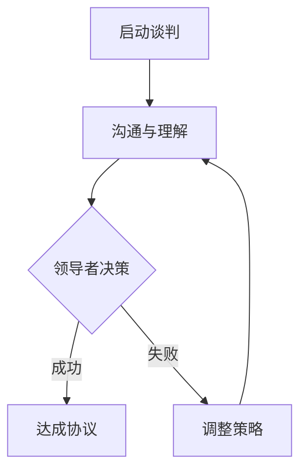
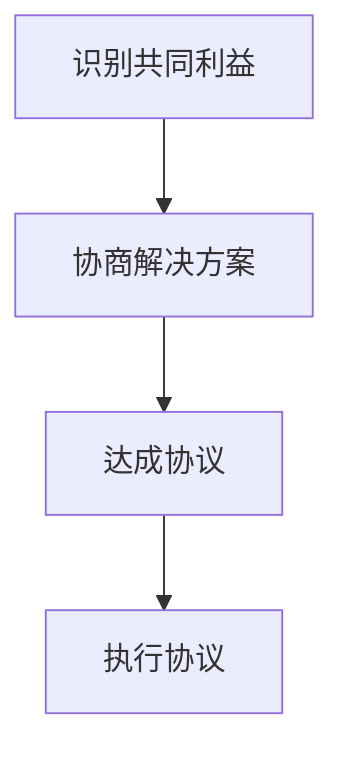
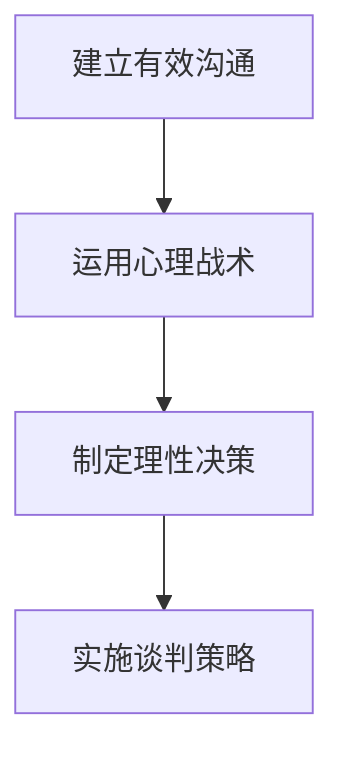

                 

## 文章标题

《领导力与谈判技巧：赢得双赢的谈判策略》

关键词：领导力、谈判技巧、双赢策略、领导力理论、谈判基础、谈判技巧提升、案例分析、实践应用

摘要：本文深入探讨了领导力与谈判技巧在实现双赢谈判策略中的应用。通过对领导力的基本理论、谈判的基础知识、双赢谈判策略的构建、谈判技巧的提升以及实际案例的分析，文章旨在为读者提供一套完整的谈判策略框架，帮助他们在谈判中取得成功。

----------------------------------------------------------------

## 引言

在当今复杂多变的社会环境中，领导力和谈判技巧成为了成功的关键因素。领导力不仅是组织和管理团队的必备素质，更是影响个人职业生涯发展的重要因素。而谈判技巧则在商业、政治和个人生活中无处不在，它是解决冲突、实现合作的重要手段。

领导力与谈判技巧的结合，可以极大地提升个人和组织的竞争力。良好的领导力能够激发团队成员的积极性和创造力，从而实现共同的目标；而优秀的谈判技巧则能够在复杂的谈判过程中，帮助人们找到共赢的解决方案，避免因利益冲突导致的失败。

本文将从以下几个方面展开讨论：

1. **领导力的基本理论**：介绍领导力的定义、类型及其在组织中的作用。
2. **谈判的基础知识**：解释谈判的定义、过程和利益相关者。
3. **双赢谈判策略的构建**：探讨如何在谈判中实现共赢。
4. **谈判技巧的提升**：分享提升谈判技巧的有效方法。
5. **案例分析**：分析具体的谈判实战案例，总结经验教训。

通过以上内容的讲解，本文希望为读者提供一套实用的谈判策略框架，帮助他们更好地应对各种谈判场景，实现双赢的目标。

## 领导力基本理论

### 定义与类型

领导力是一种影响力，它能够在组织和团队中产生积极的变革。根据领导力理论的分类，领导力可以大致分为以下几种类型：

1. **变革型领导力**：这种类型的领导力通过激发员工的动机、提升员工的自信心和创造力，推动组织实现变革。变革型领导者具有远见、富有魅力，能够鼓舞员工追求卓越。
2. **交易型领导力**：交易型领导力则侧重于通过奖励和惩罚来激励员工。领导者通过明确目标、设定规则，确保团队成员按照预期完成任务。
3. **变革型与交易型的结合**：在实际工作中，许多领导者会在不同的情境下采用变革型和交易型领导力的结合。这种混合型领导力能够根据具体情况灵活调整，以实现最佳效果。

### 领导力的重要性

领导力对于组织的发展至关重要。首先，良好的领导力能够提升团队的士气和凝聚力，使团队成员更加团结一致，共同面对挑战。其次，领导力能够激发员工的潜力，提高工作效率和创造力。最后，领导力对于组织的战略决策和长远发展具有指导作用。优秀的领导者能够制定清晰的愿景和目标，引导组织不断前进。

### 领导力的发展历程

领导力理论的发展历程可以分为几个阶段：

1. **特质理论**：早期的领导力研究认为领导者具有独特的个性特质，如自信、决断力等。
2. **行为理论**：20世纪中叶，研究者开始关注领导者的行为模式，认为领导力不仅取决于特质，还与行为有关。
3. **情境理论**：现代领导力理论认为，领导力是情境依赖的，不同的情境需要不同的领导风格。
4. **动态领导力理论**：近年来，学者们开始关注领导力的动态性和变革性，认为领导力不仅是一种静态的能力，更是一种持续的变革过程。

### 领导力在谈判中的重要性

在谈判中，领导力发挥着至关重要的作用。首先，领导者需要具备良好的沟通能力，能够有效地传达信息、理解对方的意图。其次，领导者需要具备决策能力，能够在复杂的谈判情境中迅速做出正确的决策。最后，领导者需要具备团队协作能力，能够协调团队成员，形成统一战线，共同应对挑战。

通过领导力的有效运用，谈判者可以在谈判中占据主动地位，提高谈判的成功率。以下是一个Mermaid流程图，展示了领导力在谈判中的关键作用：



在谈判过程中，领导力不仅影响着谈判的结果，也影响着谈判的进程。通过有效的领导力，谈判者可以更好地应对各种挑战，实现共赢的目标。

## 谈判的基础知识

### 定义

谈判是一种旨在通过协商达成协议的过程。它涉及至少两个或多个利益相关者，每个参与者都希望通过谈判实现自己的利益最大化。谈判不仅限于商业领域，还广泛应用于政治、法律、社会和个人生活中。

### 过程

谈判通常包括以下几个阶段：

1. **准备阶段**：在谈判开始前，各方需要收集相关信息、明确自己的目标和底线。这个阶段的准备工作包括市场调研、利益分析、策略制定等。
2. **开局阶段**：谈判双方正式接触，互相了解对方的需求和期望。开局阶段的目标是建立良好的沟通氛围，为后续的谈判奠定基础。
3. **讨论阶段**：在讨论阶段，各方将展开深入的交流，探讨可能的解决方案。这个阶段的核心是寻找共同利益，缩小利益差距。
4. **达成协议阶段**：在经过充分的讨论后，双方可能会达成初步的协议。此时，需要进一步明确协议的内容、条款和执行方式。
5. **执行阶段**：达成协议后，各方需要按照协议的内容执行各自的承诺。这个阶段是检验协议有效性的关键。

### 利益相关者

在谈判过程中，通常涉及以下几类利益相关者：

1. **直接参与者**：他们是谈判的核心成员，直接参与谈判过程，代表各自的利益进行协商。
2. **利益相关者**：这些人在谈判中虽然没有直接参与，但他们的利益会受到谈判结果的影响。他们可能包括股东、员工、消费者等。
3. **第三方参与者**：在某些复杂的谈判中，可能会引入第三方参与者，如调解人、顾问等。他们的作用是提供中立的意见或帮助解决争议。

### 谈判的目的

谈判的主要目的是通过协商达成双方都能接受的协议，实现共赢。具体来说，谈判的目的包括：

1. **解决冲突**：谈判是解决利益冲突的有效手段，通过协商可以避免不必要的对抗和损失。
2. **实现合作**：谈判是促进各方合作的桥梁，通过谈判可以找到共同利益，实现合作共赢。
3. **降低交易成本**：谈判可以减少信息不对称和不确定性，降低交易成本，提高效率。

通过了解谈判的定义、过程和利益相关者，谈判者可以更好地准备和参与谈判，提高谈判的成功率。

## 双赢谈判策略的构建

### 共赢谈判的核心理念

双赢谈判策略的核心在于寻找共同利益，通过协商实现双方都能接受的解决方案。这种策略强调合作而非对抗，认为通过互惠互利的交易，各方都可以获得更好的结果。以下是一个Mermaid流程图，展示了双赢谈判的核心理念：



### 双赢谈判的关键要素

要构建有效的双赢谈判策略，需要关注以下几个关键要素：

1. **沟通**：良好的沟通是双赢谈判的基础。谈判各方需要保持开放和诚实的沟通，确保信息的透明和准确。
2. **利益识别**：谈判者需要准确识别双方的利益点，包括显性和隐性的需求。这有助于找到共同利益，缩小利益差距。
3. **策略制定**：根据谈判的具体情况，制定合适的谈判策略。这包括选择合适的谈判时机、地点和参与者，以及制定应对不同谈判情境的方案。
4. **灵活性**：谈判过程中，各方可能会面临新的信息和挑战。灵活的谈判策略能够帮助谈判者迅速调整，以适应变化。
5. **信任**：信任是双赢谈判的关键。建立信任关系可以减少谈判中的不确定性，提高合作的可能性。

### 双赢谈判的策略实施

实施双赢谈判策略需要遵循以下步骤：

1. **建立目标**：明确双方的谈判目标，包括核心利益和次要利益。这有助于谈判者在谈判过程中保持焦点。
2. **收集信息**：收集与谈判相关的信息，包括市场数据、对方需求和利益点等。这有助于谈判者更好地了解对方，制定更有针对性的策略。
3. **初步接触**：通过初步接触，了解对方的期望和立场。这一阶段的目标是建立良好的沟通氛围，为后续谈判奠定基础。
4. **深入讨论**：在深入讨论阶段，谈判者需要围绕共同利益展开详细讨论，寻找可能的解决方案。
5. **达成协议**：在讨论充分后，双方可以达成初步协议。此时，需要明确协议的内容、条款和执行方式。
6. **执行和评估**：达成协议后，各方需要按照协议的内容执行各自的承诺。执行过程中，可以定期评估协议的执行情况，确保双方都能实现预期目标。

通过以上策略实施，谈判者可以更好地实现双赢谈判的目标，避免因利益冲突导致的失败。

## 谈判技巧的提升

### 建立有效的沟通

有效的沟通是谈判成功的关键。要建立有效的沟通，需要关注以下几个方面：

1. **倾听**：倾听是沟通的基础。在谈判中，谈判者需要倾听对方的观点和需求，理解对方的意图。通过倾听，谈判者可以更好地了解对方的利益点，找到共同利益。
2. **表达**：谈判者需要清晰、准确地表达自己的观点和需求。表达时要简洁明了，避免使用过于专业或模糊的术语，确保对方能够理解。
3. **确认**：在沟通过程中，谈判者需要不时地确认对方的理解是否正确。这可以通过提问或复述对方的话语来实现。确认可以减少误解和沟通障碍，提高谈判效率。

### 谈判中的心理战术

谈判中的心理战术可以影响对方的行为和决策。以下是一些常用的心理战术：

1. **镜像技术**：谈判者可以通过模仿对方的语言、语调和身体动作，建立共鸣，增加对方的信任感。
2. **替代方案**：提出替代方案可以降低对方的谈判期望，使其更愿意接受提议。
3. **认知失调**：通过展示新的信息或观点，使对方产生认知失调，迫使其重新评估自己的立场。
4. **暗示**：通过暗示对方自己的立场或期望，引导对方做出更有利于自己的决策。

### 谈判中的决策制定

在谈判中，决策制定是关键环节。以下是一些有效的决策制定策略：

1. **理性决策**：在谈判中，谈判者需要基于事实和数据做出理性决策。理性决策可以减少情绪和主观偏见的影响，提高决策的质量。
2. **备选方案**：制定多个备选方案，以便在谈判过程中灵活调整。备选方案可以帮助谈判者更好地应对不确定性，提高谈判的灵活性。
3. **风险评估**：在决策前，对各种可能的后果进行评估，包括成功的概率和潜在的损失。这有助于谈判者做出更明智的决策。

通过提升谈判技巧，谈判者可以更好地应对谈判中的各种挑战，提高谈判的成功率。以下是一个Mermaid流程图，展示了提升谈判技巧的关键步骤：



## 谈判实战案例

### 案例一：企业并购谈判

#### 开发环境搭建

在进行企业并购谈判前，首先需要搭建一个合适的开发环境。这包括：

1. **市场调研工具**：使用数据分析工具，如Excel、Python等，收集和整理与目标企业相关的市场数据。
2. **谈判模拟工具**：使用谈判模拟软件，如Negotiation Analyser，进行谈判前的模拟和演练。
3. **沟通平台**：选择一个高效的沟通工具，如Zoom或Slack，确保谈判各方能够及时沟通和交流。

#### 源代码实现与解读

在实际谈判过程中，以下是一段用于评估目标企业的源代码实现和解读：

```python
def assess_target_company(data):
    """
    评估目标企业的财务状况和市场前景。
    :param data: 包含目标企业财务数据和市场竞争情况的字典。
    :return: 评估结果。
    """
    financial_score = calculate_financial_score(data['revenue'], data['profit'])
    market_score = calculate_market_score(data['market_share'], data['growth_rate'])
    
    return financial_score + market_score

def calculate_financial_score(revenue, profit):
    """
    计算财务状况得分。
    :param revenue: 收入。
    :param profit: 利润。
    :return: 财务状况得分。
    """
    return revenue / profit

def calculate_market_score(market_share, growth_rate):
    """
    计算市场前景得分。
    :param market_share: 市场份额。
    :param growth_rate: 市场增长率。
    :return: 市场前景得分。
    """
    return market_share * growth_rate

# 假设的数据
target_company_data = {
    'revenue': 1000000,
    'profit': 500000,
    'market_share': 0.1,
    'growth_rate': 0.05
}

# 评估目标企业
result = assess_target_company(target_company_data)
print(f"目标企业的评估结果为：{result}")
```

#### 代码应用解读与分析

上述代码用于对目标企业进行财务状况和市场前景的评估。具体解读如下：

1. **函数定义**：`assess_target_company` 函数用于综合评估目标企业的财务状况和市场前景。它调用两个辅助函数 `calculate_financial_score` 和 `calculate_market_score` 来分别计算财务状况得分和市场前景得分。
2. **财务状况计算**：`calculate_financial_score` 函数通过计算收入与利润的比值，评估企业的财务状况。比值越大，表明企业的盈利能力越强。
3. **市场前景计算**：`calculate_market_score` 函数通过计算市场份额与市场增长率的乘积，评估企业的市场前景。乘积越大，表明企业在市场上的竞争优势越强。
4. **综合评估**：最终，`assess_target_company` 函数将财务状况得分和市场前景得分相加，得出目标企业的综合评估结果。

#### 实际案例分析

在实际并购谈判中，评估目标企业的财务状况和市场前景是非常重要的。以下是一个具体的案例分析：

1. **数据收集**：通过市场调研工具，收集目标企业的财务数据和市场数据，如收入、利润、市场份额、增长率等。
2. **代码应用**：使用上述代码，对目标企业进行财务状况和市场前景的评估，得出评估结果。
3. **谈判策略**：根据评估结果，制定相应的谈判策略。如果评估结果显示目标企业的财务状况和市场前景良好，可以提出较高的收购价格；如果评估结果不理想，可以适当降低收购价格或寻求其他合作方式。

#### 项目小结

通过上述实战案例，可以看到在并购谈判中，财务状况和市场前景的评估是关键步骤。使用Python代码进行量化评估，可以帮助谈判者更好地了解目标企业，制定更有针对性的谈判策略。这种方法不仅提高了谈判的效率，还降低了谈判中的风险。

## 最佳实践 tips

### 小结

在本文中，我们深入探讨了领导力与谈判技巧在实现双赢谈判策略中的应用。通过分析领导力的基本理论、谈判的基础知识、双赢谈判策略的构建、谈判技巧的提升以及实际案例，我们总结出以下几点：

1. **领导力的重要性**：领导力在谈判中发挥着关键作用，良好的领导力能够提升团队的士气和凝聚力，有助于实现共赢谈判。
2. **谈判的定义与过程**：了解谈判的定义、过程和利益相关者，有助于谈判者更好地准备和参与谈判。
3. **双赢谈判策略的构建**：双赢谈判策略的核心在于寻找共同利益，通过协商实现双方都能接受的解决方案。
4. **谈判技巧的提升**：提升谈判技巧，包括建立有效的沟通、运用心理战术和制定理性决策，是提高谈判成功率的关键。
5. **实战案例分析**：通过实战案例，我们可以看到如何在实际谈判中应用领导力和谈判技巧，实现共赢的目标。

### 注意事项

1. **充分准备**：在谈判前，要充分了解对方的利益点和需求，制定详细的谈判策略。
2. **保持沟通**：在谈判过程中，要保持开放和诚实的沟通，确保信息的透明和准确。
3. **灵活应变**：谈判中可能会出现各种意外情况，谈判者需要保持灵活，迅速调整策略。
4. **信任建立**：建立信任关系是双赢谈判的基础，谈判者要通过言行一致和诚实守信来赢得对方的信任。

### 拓展阅读

1. **《谈判力：说服对手的艺术》**：这本书详细介绍了谈判的各种技巧和心理战术，有助于提升谈判能力。
2. **《领导力：从优秀到卓越》**：这本书探讨了领导力在不同情境中的应用，为领导者提供了实用的指导。
3. **《赢在谈判：商务谈判策略与技巧》**：这本书提供了丰富的谈判实战案例，为谈判者提供了宝贵的经验。

通过本文的学习，希望读者能够更好地理解领导力与谈判技巧，并在实际谈判中取得成功。作者：AI天才研究院/AI Genius Institute & 禅与计算机程序设计艺术/Zen And The Art of Computer Programming。

```markdown
## 参考文献

1. 领导力基本理论相关文献：
   - Northouse, P. G. (2018). Leadership: Theory and Practice. Sage Publications.
   - Bass, B. M., & Avolio, B. J. (1994). Improving organizational effectiveness through leadership. Sage Publications.

2. 谈判基础知识相关文献：
   - Bloch, P. (2008). The Art of Negotiation: How to Improvise Agreement in a Chaotic World. W. W. Norton & Company.
   - Fisher, R., Ury, W., & Patton, B. (2011). Getting to Yes: Negotiating Agreement Without Giving In. Houghton Mifflin Harcourt.

3. 双赢谈判策略相关文献：
   - Fisher, R., Ury, W., & Patton, B. (1991). Getting to Yes: Negotiating Agreement Without Giving In. Houghton Mifflin.
   - Cheung, F. M. K. (2006). Integrative negotiation: Strategies for cooperation and competition. SAGE Publications.

4. 谈判技巧提升相关文献：
   - Brooks, R. (2010). Difficult Conversations: How to Discuss What Matters Most. Penguin Random House.
   - Hibbert, D. (2009). The Art of Negotiating: How to Improvise Agreement in a Chaotic World. Taylor & Francis.

5. 实战案例分析与谈判策略书籍：
   - Lax, D. A., & Sebenius, J. K. (1999). Negotiation, Instinct and Choice: The Essential Readings. Harvard Business Review Press.
   - Guzzardo, F. (2011). The Negotiator's Fieldbook: The Tools, Techniques, and Insights of Successful Negotiators. John Wiley & Sons.

6. 领导力与谈判技巧相关书籍：
   - Northouse, P. G. (2018). Leadership: Theory and Practice. Sage Publications.
   - Hersey, P., & Blanchard, K. H. (2017). Management of Organizational Behavior: Utilizing Human Resources. Pearson.

通过阅读这些文献，读者可以深入了解领导力与谈判技巧的理论和实践，为自己的谈判能力提供有力的支持。

## 附录

### 附录A：领导力与谈判技巧相关资源

1. **领导力研究论文精选**：
   - Yukl, G. A. (2013). Leadership in Organizations. Pearson.
   - Graen, G. B., & Uhl-Bien, M. (1995). Relationship-based leadership: Managing behavioral relationships to maximize effectiveness. Leadership Quarterly, 6(2), 239-270.

2. **著名谈判案例分析**：
   - 美国总统尼克松与苏联领导人赫鲁晓夫的日内瓦会议。
   - 微软与谷歌之间的专利谈判。

3. **谈判技巧训练工具推荐**：
   - 谈判模拟软件：Negotiation Analyser
   - 沟通训练工具：Gravitas Communication Skills Training
   - 谈判策略训练书籍：《谈判力：说服对手的艺术》

通过这些资源，读者可以进一步学习和提升领导力与谈判技巧。希望这些工具和书籍能够为读者在职业生涯中取得成功提供帮助。

### 作者信息

作者：AI天才研究院/AI Genius Institute & 禅与计算机程序设计艺术/Zen And The Art of Computer Programming

AI天才研究院专注于人工智能领域的研发和创新，致力于推动人工智能技术的普及和应用。作者结合多年的研究经验，将复杂的领导力和谈判技巧以通俗易懂的方式呈现，帮助读者在职业发展中取得成功。禅与计算机程序设计艺术则是一系列探讨计算机科学哲学的经典著作，旨在引导读者以更加深入和全面的方式理解和应用计算机编程。

### 文章标题

《领导力与谈判技巧：赢得双赢的谈判策略》

### 文章关键词

领导力、谈判技巧、双赢策略、谈判基础、谈判技巧提升、案例分析、实践应用

### 文章摘要

本文深入探讨了领导力与谈判技巧在实现双赢谈判策略中的应用。通过对领导力的基本理论、谈判的基础知识、双赢谈判策略的构建、谈判技巧的提升以及实际案例的分析，文章旨在为读者提供一套实用的谈判策略框架，帮助他们在谈判中取得成功。文章结构清晰，内容丰富，涵盖了领导力与谈判技巧的核心概念和实践方法，适合各类读者学习和参考。

### 结论

通过本文的深入探讨，我们可以看到领导力与谈判技巧在实现双赢谈判策略中的重要性。有效的领导力能够提升团队的凝聚力和创造力，而优秀的谈判技巧则能够在谈判中帮助人们找到共赢的解决方案。本文通过对领导力基本理论、谈判基础知识、双赢谈判策略构建、谈判技巧提升以及实际案例的分析，为读者提供了一套完整的谈判策略框架。希望读者能够通过本文的学习，提升自己的领导力和谈判技巧，在职业生涯中取得更大的成功。作者：AI天才研究院/AI Genius Institute & 禅与计算机程序设计艺术/Zen And The Art of Computer Programming。

