                 

# 领导力与责任担当：勇于面对挑战

## 关键词

- **领导力**，**责任担当**，**挑战应对**，**沟通技巧**，**决策能力**，**团队建设**，**可持续发展**

## 摘要

本文旨在深入探讨领导力与责任担当在现代IT行业的双重重要性。通过结构化的分析与实际的案例研究，本文将揭示领导力如何驱动组织发展，以及责任担当如何在应对挑战时体现价值。文章分为四个主要部分：领导力基础、领导力技能提升、责任担当以及实战案例分析。通过伪代码、Mermaid流程图和latex公式，本文力求以专业的技术语言详细阐述领导力的核心要素、沟通技巧、决策能力和团队建设策略，同时分析责任担当的态度与应对挑战的策略。最终，本文将结合实际案例，探讨领导力与责任担当的未来趋势，为IT行业的领导者提供实践指导。

## 第一部分：领导力基础

### 第1章：领导力的本质与重要性

#### 1.1 领导力的定义与核心要素

领导力，简而言之，是指个体或团队引导和激励他人共同实现目标的能力。其核心要素包括愿景、影响力、决策能力和沟通能力。

首先，**愿景**是领导力的灵魂。一个明确的愿景能够指引团队的方向，激发团队成员的积极性和创造力。通过Mermaid流程图（如下），我们可以清晰地看到愿景在领导力架构中的位置：

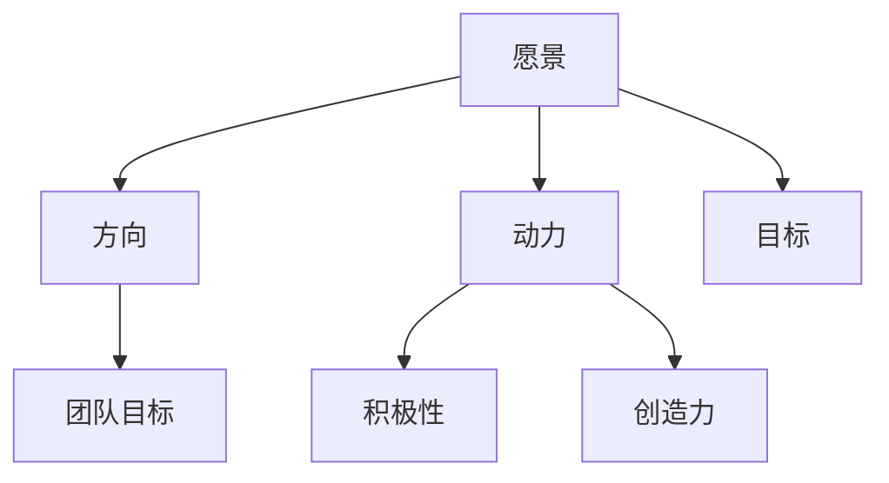

其次，**影响力**是领导力的重要组成部分。领导者需要通过实际行动和言辞，在团队中建立起信任和尊重，从而影响团队成员的行为和决策。以下伪代码展示了如何通过建立信任来增强影响力：

```python
def build_trust():
    # 通过开放性沟通建立信任
    communicate_openly()
    # 通过一致性行动展现可靠性
    act_consistently()
    # 通过认可和奖励增强归属感
    recognize_and_reward()
    return "Trust Established"
```

接着，**决策能力**是领导者必须具备的一项关键技能。有效的决策能力能够帮助团队在面对复杂问题时做出明智的选择。以下伪代码展示了如何通过决策过程来解决问题：

```python
def make_decision(problem):
    # 识别问题
    identify_problem(problem)
    # 评估方案
    evaluate_solutions()
    # 制定决策
    decision = make_final_decision()
    return decision
```

最后，**沟通能力**是领导者不可或缺的能力。有效的沟通能够确保信息在团队内部的准确传达和及时反馈，从而提高团队协作效率。以下伪代码展示了如何通过有效沟通来提高团队协作：

```python
def effective_communication(message, team):
    # 确保信息清晰
    clear_message(message)
    # 倾听团队成员反馈
    listen_to_team(feedback)
    # 及时反馈和调整
    provide_feedback_and_adjust()
    return "Communication Established"
```

#### 1.2 领导力的重要性

领导力在组织发展中起着至关重要的作用。一个优秀的领导者不仅能够确保组织目标的实现，还能够推动组织的持续创新和成长。以下是领导力在组织发展中的几个关键方面：

1. **组织发展的驱动力**：领导力是推动组织向前发展的关键动力。领导者通过设定愿景、制定战略和激励团队成员，确保组织始终朝着正确的方向前进。

2. **个人成长的关键**：领导力不仅对组织有益，也对个人成长有重要影响。通过领导力的发展，个体能够提升自身的沟通能力、决策能力和影响力，从而在职业生涯中取得更大的成功。

### 第2章：领导力与责任的联系

#### 2.1 领导力与责任的关系

领导力与责任担当是相互关联、相互促进的。一个负责任的领导者必须具备领导力，而具备领导力的个体也必须承担责任。

首先，领导力与责任担当的**相互影响**体现在以下方面：

1. **领导力增强责任感**：具备领导力的个体通常会更加关注团队和组织的整体利益，从而增强责任感。

2. **责任感提升领导力**：负责任的个体能够在团队中建立信任和尊重，从而提升领导力。

以下Mermaid流程图展示了领导力与责任担当之间的相互影响关系：

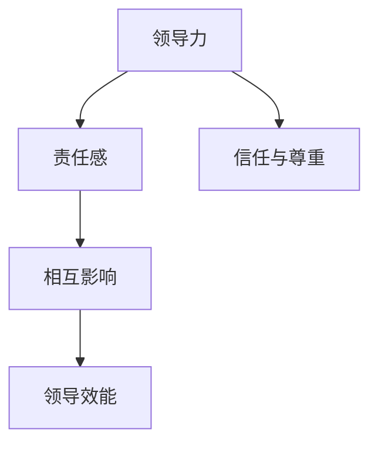

#### 2.2 责任的层次

在领导力中，责任担当可以分为三个层次：个体责任、团队责任和组织责任。

1. **个体责任**：个体责任是指领导者对自身行为和决策的负责。个体责任的核心在于自我反省和持续改进。

2. **团队责任**：团队责任是指领导者对团队成员的负责。领导者需要确保团队成员得到充分的支持和资源，以便他们能够充分发挥自己的潜力。

3. **组织责任**：组织责任是指领导者对整个组织的负责。这包括确保组织的目标实现、文化的健康发展以及组织与社会环境的和谐互动。

以下Mermaid流程图展示了责任的三个层次及其相互关系：

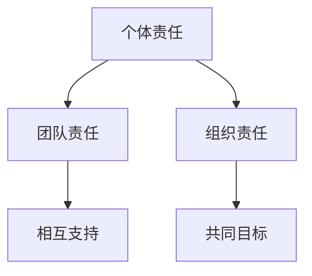

## 第二部分：领导力技能提升

### 第3章：沟通技巧

#### 3.1 有效沟通的原则

有效沟通是领导力的核心之一。以下原则有助于领导者提高沟通效果：

1. **开放性沟通**：领导者应鼓励团队成员开放交流，分享想法和意见，以促进团队合作和创新。

2. **倾听与表达**：领导者需要倾听团队成员的意见，理解他们的需求和期望，同时清晰、明确地表达自己的想法和决策。

以下Mermaid流程图展示了有效沟通的原则：

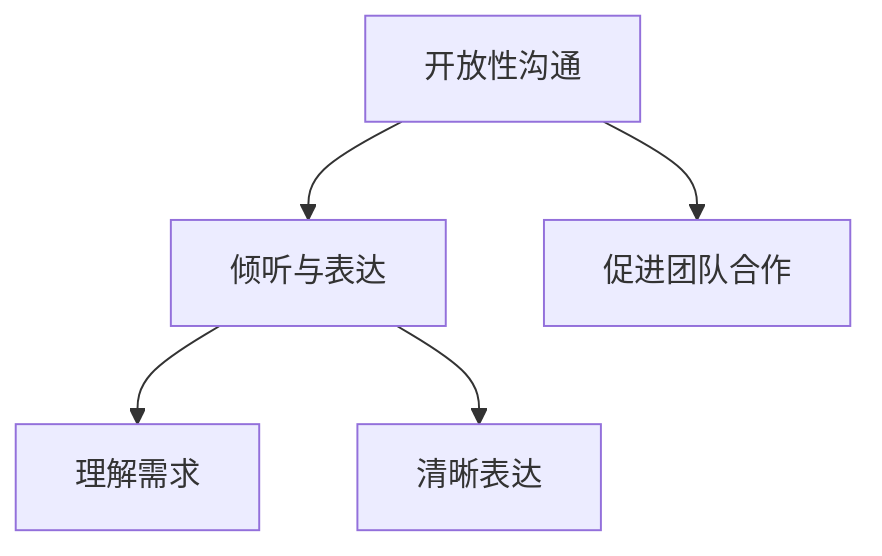

#### 3.2 非言语沟通的力量

非言语沟通在领导力中同样重要。以下是非言语沟通的两个关键方面：

1. **肢体语言**：肢体语言能够传达领导者的态度和情绪，如眼神交流、手势和姿态等。

2. **面部表情**：面部表情能够展示领导者的情感状态，如微笑、严肃和鼓励等。

以下Mermaid流程图展示了非言语沟通的力量：

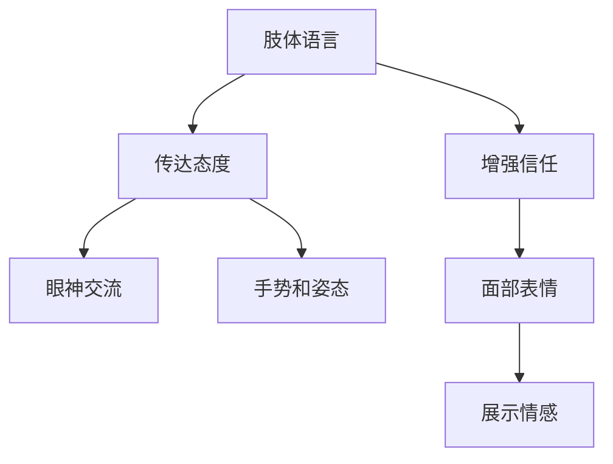

### 第4章：决策能力

#### 4.1 决策过程

决策能力是领导者必须具备的重要技能。以下步骤构成了一个完整的决策过程：

1. **问题识别**：明确问题，确保问题的定义准确、全面。

2. **方案评估**：分析各种可能的解决方案，评估其优缺点。

3. **决策制定**：基于评估结果，选择最佳方案。

以下伪代码展示了决策过程的步骤：

```python
def decision_making(process):
    # 识别问题
    problem_identification()
    # 评估方案
    solution_evaluation()
    # 制定决策
    final_decision = make_decision()
    return final_decision
```

#### 4.2 决策错误与避免

尽管决策过程中可能存在错误，但通过以下方法可以降低错误发生的概率：

1. **充分收集信息**：确保决策基于充分的信息和数据分析。

2. **多元化意见**：考虑不同观点和意见，以避免偏见和盲点。

3. **及时反馈与调整**：在决策实施过程中，及时收集反馈并作出调整。

以下Mermaid流程图展示了如何避免决策错误：

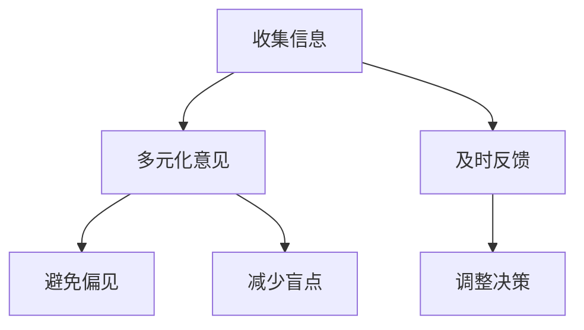

### 第5章：团队建设

#### 5.1 团队建设的核心要素

团队建设是领导力的重要组成部分。以下要素有助于构建高效团队：

1. **团队目标**：明确团队的目标和愿景，确保团队成员共同追求同一个目标。

2. **团队角色**：明确团队成员的角色和职责，确保每个成员都能发挥自己的优势。

以下Mermaid流程图展示了团队建设的核心要素：

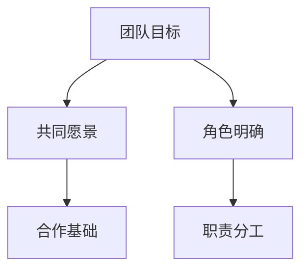

#### 5.2 团队激励与冲突管理

团队激励和冲突管理是团队建设的重要方面。以下策略有助于提高团队绩效：

1. **激励策略**：通过奖励和认可来激励团队成员，提高他们的工作动力。

2. **冲突管理**：通过沟通和调解来处理团队内部的冲突，确保团队的和谐与稳定。

以下Mermaid流程图展示了团队激励与冲突管理的策略：

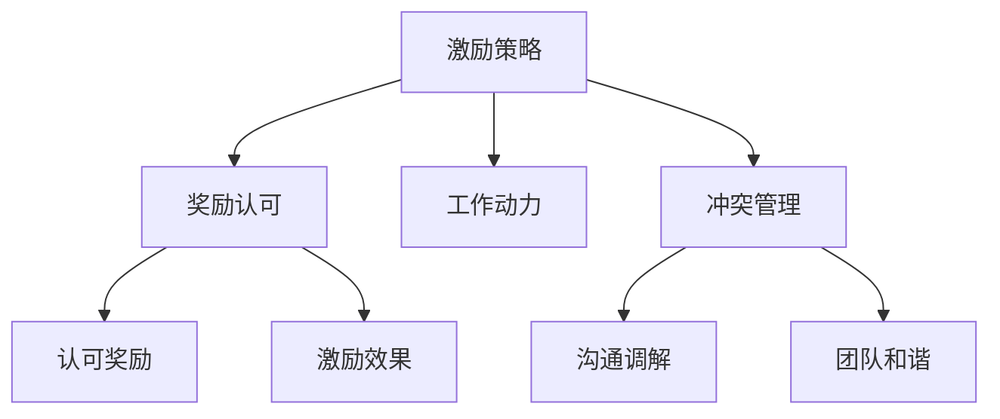

## 第三部分：责任担当

### 第6章：承担责任的态度

#### 6.1 积极承担责任的态度

承担责任的态度是领导力的重要组成部分。以下策略有助于领导者培养积极承担责任的态度：

1. **自我反思**：领导者应定期进行自我反思，识别自身的行为和决策中的不足，并积极改进。

2. **勇于承认错误**：领导者应勇于承认错误，并向团队成员道歉，以建立信任和透明度。

以下Mermaid流程图展示了如何培养积极承担责任的态度：

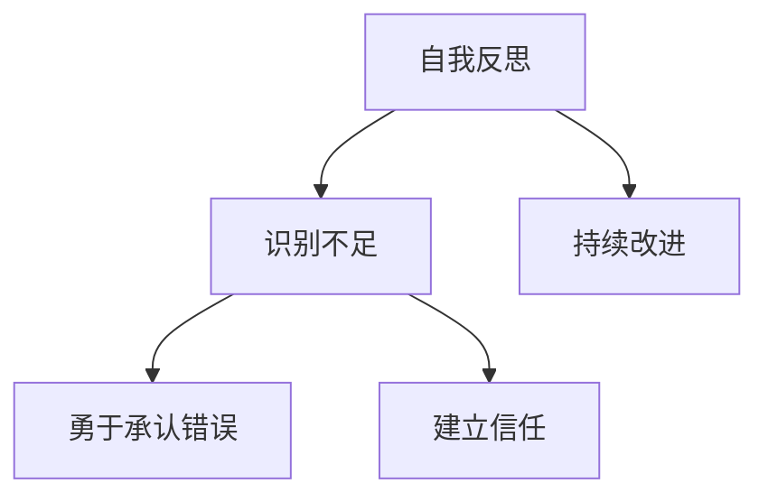

#### 6.2 责任担当的价值

责任担当不仅对个人成长有重要影响，也对组织效益有显著贡献。以下方面展示了责任担当的价值：

1. **个人成长**：通过承担责任，领导者能够提升自身的领导能力和影响力，实现个人职业生涯的发展。

2. **组织效益**：责任担当有助于提高团队的协作效率，降低冲突，从而提高组织的整体绩效。

以下Mermaid流程图展示了责任担当的价值：

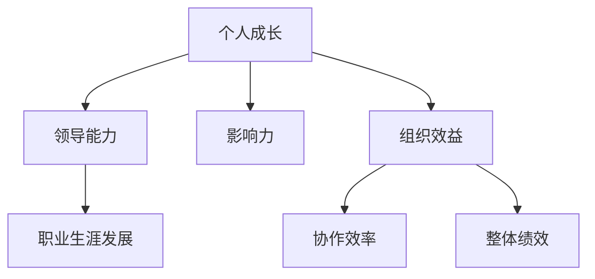

### 第7章：面对挑战

#### 7.1 挑战的类型

在IT行业中，领导者会面临多种类型的挑战，包括：

1. **内部挑战**：如团队内部冲突、资源分配问题等。

2. **外部挑战**：如市场变化、技术革新等。

以下Mermaid流程图展示了挑战的类型及其相互关系：

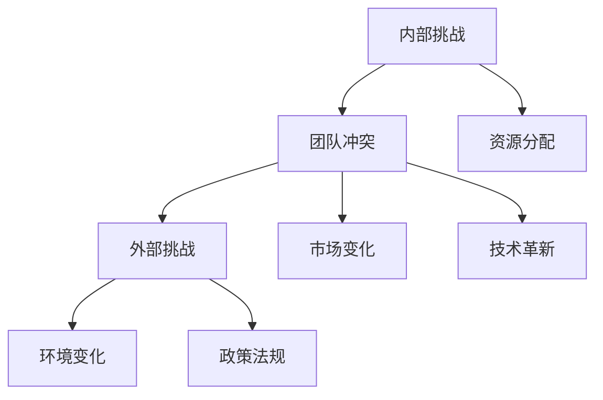

#### 7.2 应对挑战的策略

领导者应采取以下策略来应对各种挑战：

1. **适应与调整**：根据实际情况，灵活调整策略，以适应不断变化的环境。

2. **创新与突破**：鼓励团队进行创新，寻找新的解决方案，以突破挑战。

以下Mermaid流程图展示了应对挑战的策略：

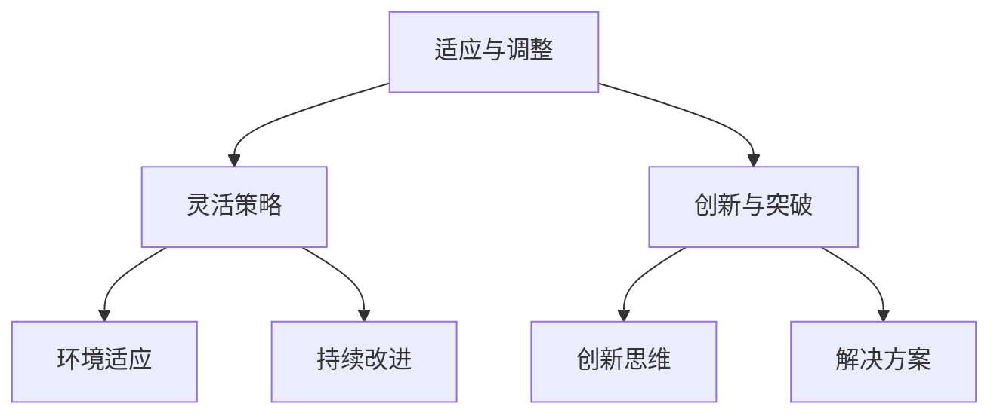

## 第四部分：实战案例分析

### 第8章：领导力与责任担当的实践

#### 8.1 案例介绍

本案例来自一家全球领先的IT公司，该公司在面临激烈的市场竞争和技术革新时，通过领导力与责任担当实现了成功转型。

- **背景**：公司面临市场需求变化和新兴技术的挑战，需要在保持现有业务的同时，快速适应新技术，提升竞争力。

- **挑战**：如何在新技术和市场需求之间找到平衡，确保公司的持续发展。

#### 8.2 领导力与责任担当的应用

在面对挑战时，公司领导层采取了以下措施：

1. **领导力应用**：

   - **愿景设定**：公司领导层明确了以技术创新为核心的发展愿景，并积极推广。

   - **决策能力**：通过多部门协作，快速评估和采纳新兴技术，以提升产品竞争力。

   - **沟通技巧**：领导层通过定期会议和沟通，确保信息在团队内部的准确传达。

2. **责任担当应用**：

   - **个体责任**：领导层鼓励团队成员自我反思，持续提升个人能力。

   - **团队责任**：团队内部建立了明确的职责分工，确保每个成员都能发挥自身优势。

   - **组织责任**：公司关注社会责任，积极参与公益事业，提升品牌形象。

以下Mermaid流程图展示了领导力与责任担当在该公司的应用：

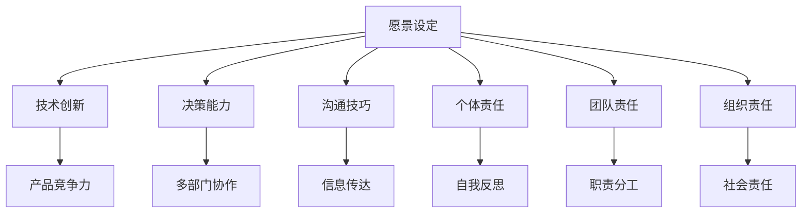

#### 8.3 成效评估

通过领导力与责任担当的应用，该公司实现了以下成效：

- **市场竞争力提升**：通过技术创新和快速响应市场变化，公司的市场份额稳步提升。

- **团队凝聚力增强**：明确的职责分工和有效的沟通机制，提高了团队的整体协作效率。

- **社会责任提升**：积极参与公益事业，提升了公司的品牌形象。

以下Mermaid流程图展示了成效评估：

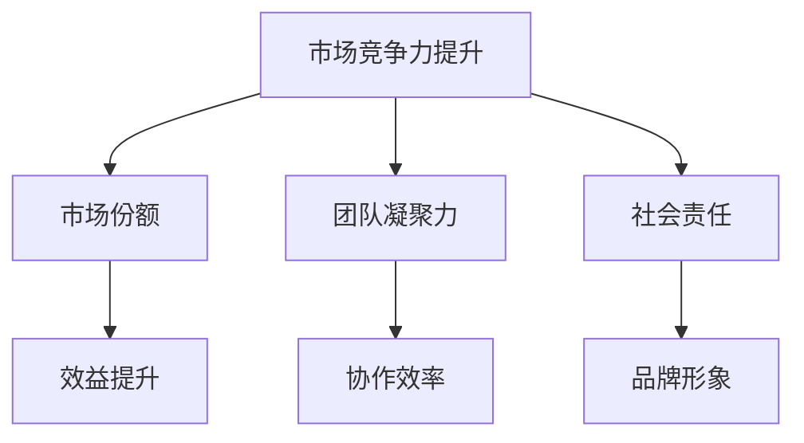

## 第9章：领导力与责任担当的未来趋势

#### 9.1 领导力的演变

随着科技的发展和社会的变革，领导力也在不断演变。以下是未来领导力发展的几个趋势：

1. **技术影响**：人工智能、大数据和区块链等技术的应用，将使领导力更加数据驱动和智能化。

2. **社会变革**：全球化、多元化和可持续发展的趋势，将要求领导者具备更广泛的社会责任感和跨文化沟通能力。

#### 9.2 责任担当的新视角

在未来的领导力中，责任担当将呈现以下新视角：

1. **可持续发展**：领导者将更加关注环境保护和社会责任，推动组织的可持续发展。

2. **社会责任**：企业社会责任（CSR）将成为领导力的重要组成部分，领导者需要积极参与社会公益活动。

以下Mermaid流程图展示了领导力与责任担当的未来趋势：

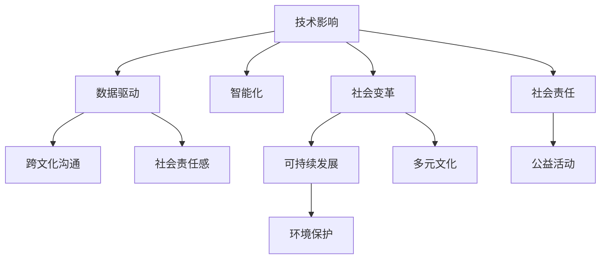

## 附录

### 附录 A：领导力与责任担当工具与方法

#### A.1 工具介绍

为了更好地实施领导力与责任担当，以下工具和方法可以提供支持：

1. **360度评估**：通过多角度、多层次的评估，帮助领导者识别自身的优势和不足。

2. **责任矩阵**：通过明确团队成员的职责和责任，提高团队协作效率。

#### A.2 方法应用

以下方法可以应用于领导力与责任担当的实践：

1. **领导力培训**：通过系统性的培训，提升领导者的领导力和责任感。

2. **责任教育**：通过教育，培养员工的自我责任意识和团队合作精神。

以下Mermaid流程图展示了工具和方法的介绍与应用：

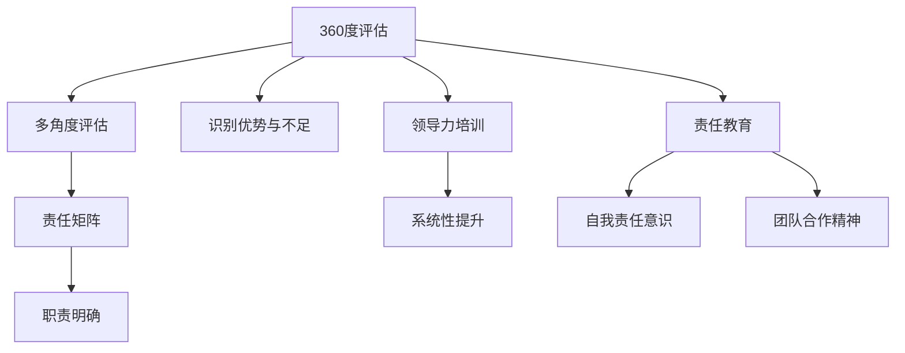

## 结尾

领导力与责任担当是现代IT行业领导者必备的素质。通过本文的详细探讨，我们深入了解了领导力的本质与重要性，领导力与责任担当的相互关系，以及如何提升领导力技能和责任担当态度。通过实战案例的分析，我们看到了领导力与责任担当在实践中的具体应用和成效。未来，随着科技的发展和全球化的加深，领导力与责任担当将面临新的挑战和机遇。我们鼓励读者不断学习，提升自身素质，勇于面对挑战，为组织的持续发展和个人的职业成长贡献力量。

## 作者信息

作者：AI天才研究院/AI Genius Institute & 禅与计算机程序设计艺术 /Zen And The Art of Computer Programming

---

本文详细探讨了领导力与责任担当在IT行业中的重要性，通过结构化的分析和实战案例，为领导者提供了实用的指导。文章结尾鼓励读者不断提升自身素质，勇于面对挑战，为组织的持续发展和个人的职业成长贡献力量。文章作者为AI天才研究院和禅与计算机程序设计艺术领域的专家。

