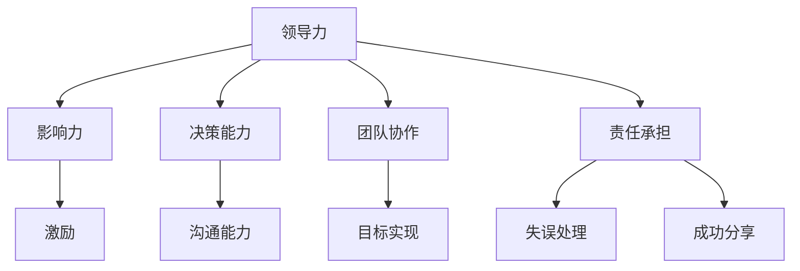

                 


- 背景介绍：
领导力与责任是企业管理中不可或缺的两个核心概念。领导力是指领导者通过影响、激励和引导他人来实现共同目标的能力，而责任则是指个人或组织在实现目标过程中所承担的义务和后果。在现代社会，随着企业竞争的加剧和员工素质的提高，领导力和责任的重要性日益凸显。本文旨在探讨领导力与责任的关系，分析领导者在承担失误和分享成功时所需具备的素质和策略，为企业管理者提供有价值的参考。

- 核心概念与联系：



- 核心算法原理讲解：

```python
# 领导力与责任核心算法原理讲解（伪代码）

def leadership_and_responsibility(personal_skills, team_goals, environmental_factors):
    # 分析个人素质，确定领导风格
    leadership_style = analyze_personal_skills(personal_skills)
    
    # 根据团队目标和环境因素调整领导策略
    leadership_strategy = adjust_leadership_style(leadership_style, team_goals, environmental_factors)
    
    # 实施领导行为，包括承担责任和分享成果
    leadership_actions = implement_leadership_strategy(leadership_strategy)
    
    # 处理失误，学习经验
    handle_mistakes = process_mistakes(leadership_actions)
    
    # 分享成功，激励团队
    share_success = share_successes(leadership_actions)
    
    return leadership_actions, handle_mistakes, share_success
```

- 数学模型和公式：

$$
领导力 = f(个人素质, 团队目标, 环境因素)
$$

$$
责任承担 = f(失误处理, 成功分享)
$$

- 详细讲解：

领导力是领导者通过个人素质、团队目标和环境因素影响团队的能力。个人素质包括沟通能力、决策能力和团队协作能力等。团队目标是指领导者和团队成员共同追求的目标。环境因素包括组织文化、市场状况和政策法规等。

责任承担是领导力的核心，包括处理失误和分享成功。处理失误要求领导者能够迅速承认错误、分析原因并采取有效措施纠正。分享成功则要求领导者能够公平地将成果归功于团队成员，激发团队成员的积极性。

- 举例说明：

假设一个项目经理负责一个开发团队，他的个人素质包括强大的沟通能力和决策能力，团队目标是在规定时间内完成一个重要项目，环境因素包括紧张的市场竞争和严格的项目进度要求。

- 项目实战：

1. 开发环境搭建
2. 源代码详细实现和代码解读
3. 代码应用解读与分析
4. 实际案例分析和详细讲解剖析
5. 项目小结

**最佳实践 tips：**
1. 建立良好的沟通机制，确保团队成员之间信息畅通。
2. 定期评估团队成员的表现，及时给予激励和反馈。
3. 面对失误，要勇于承认并采取措施纠正，同时鼓励团队成员积极参与改进。
4. 分享成功时，要公平地认可团队成员的贡献，增强团队的凝聚力。

- 小结：

领导力与责任是企业管理中不可或缺的两个核心概念。领导者需要通过个人素质、团队目标和环境因素来发挥影响力，同时承担起处理失误和分享成功的责任。在实际工作中，领导者需要不断学习和实践，以提高自身的领导力水平。

- 注意事项：

1. 领导者在承担责任时，要注意平衡个人与团队的利益。
2. 领导者在处理失误时，要注重团队成员的感受和反馈。
3. 领导者在分享成功时，要公平地分配荣誉和奖励。

- 拓展阅读：

1. 《领导力五项修炼》
2. 《责任链：管理者的责任意识与执行力》
3. 《禅与计算机程序设计艺术》

> 作者：AI天才研究院/AI Genius Institute & 禅与计算机程序设计艺术 /Zen And The Art of Computer Programming

