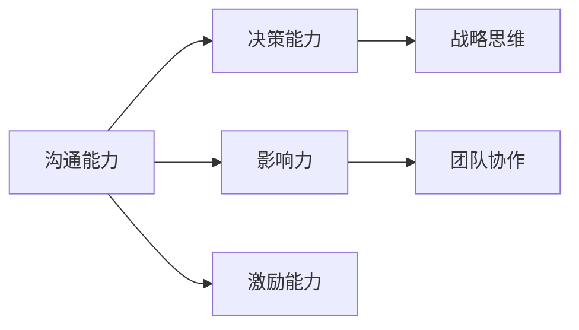

                 

基于您的要求和指导，以下是一个详细的目录大纲和初步的文章内容概述。请注意，这个版本仅为草稿，需要进一步详细填充和优化。

---

# 领导力与责任：承担失误、分享成功

> 关键词：领导力、责任、失误、成功、团队管理、决策、领导力模型

> 摘要：本文深入探讨了领导力与责任在现代IT管理中的重要性。通过分析失误的处理与反思以及成功的分享与传承，本文旨在提供一套系统化的领导力和责任管理策略，帮助领导者更好地引领团队走向成功。

## 目录

### 第一部分：领导力基础

### 第1章：领导力的核心概念

#### 1.1 领导力的重要性

#### 1.2 领导力与管理的区别

#### 1.3 领导力的构成要素

### 第2章：领导力的实践方法

#### 2.1 情境领导理论

#### 2.2 变革型领导与交易型领导

#### 2.3 领导力发展路径

### 第二部分：责任的内涵与外延

### 第3章：责任的定义与分类

#### 3.1 责任的定义

#### 3.2 责任的分类

#### 3.3 责任的伦理分析

### 第4章：责任在领导中的体现

#### 4.1 责任与权力的关系

#### 4.2 领导者的责任担当

#### 4.3 �ergein responsibility allocation and localization

### 第三部分：失误的处理与反思

### 第5章：失误的原因分析

#### 5.1 个人失误

#### 5.2 团队失误

#### 5.3 组织失误

### 第6章：失误的处理策略

#### 6.1 承认失误

#### 6.2 分析失误

#### 6.3 预防失误

### 第7章：失误的反思与成长

#### 7.1 从失误中学习

#### 7.2 提升自我认知

#### 7.3 构建积极反馈机制

### 第四部分：成功的分享与传承

### 第8章：成功的定义与分类

#### 8.1 成功的定义

#### 8.2 成功的分类

#### 8.3 成功的衡量标准

### 第9章：成功的分享策略

#### 9.1 分享成功的价值

#### 9.2 分享成功的原则

#### 9.3 分享成功的途径

### 第10章：成功的传承与展望

#### 10.1 成功的传承

#### 10.2 领导力的传承

#### 10.3 责任的传承

### 附录

#### 附录A：领导力与责任的工具与方法

#### 附录B：案例分析

#### 附录C：参考资料

## 文章正文

### 第一部分：领导力基础

#### 第1章：领导力的核心概念

#### 1.1 领导力的重要性

在现代社会，领导力不仅是企业管理的重要部分，更是社会和谐发展的基石。领导力关乎如何激发团队潜力、如何处理复杂问题以及如何引领组织走向成功。

#### 1.2 领导力与管理的区别

领导力与管理虽然密切相关，但它们有着本质的不同。管理侧重于执行和维持现状，而领导力则侧重于变革和创新。

#### 1.3 领导力的构成要素

领导力包括多个方面，如沟通能力、决策能力、影响力等。通过图 [领导力构成要素图] 可以清晰地看到这些要素之间的关系。

#### 第2章：领导力的实践方法

#### 2.1 情境领导理论

情境领导理论是一种基于不同情境下的领导行为模型。根据下属的能力和动机，领导应采取不同的领导风格。

#### 2.2 变革型领导与交易型领导

变革型领导注重激发团队成员的内在动机，而交易型领导则侧重于通过奖励和惩罚来激励团队。这两种领导风格在不同情境下都有其适用性。

#### 2.3 领导力发展路径

领导力的发展是一个长期的过程，包括自我认知、经验积累、持续学习等多个方面。一个有效的领导力发展路径应包括以下步骤：

1. 自我评估：了解自己的优势和劣势。
2. 设定目标：明确个人的职业目标。
3. 学习与成长：不断学习新知识和技能。
4. 实践与反思：将所学应用于实践中，并不断反思。
5. 建立网络：与他人建立良好的合作关系。

---

以上是文章的第一部分概要，接下来将逐步深入第二部分，探讨责任的内涵与外延。

### 第二部分：责任的内涵与外延

在IT领域，责任的内涵和外延显得尤为重要。责任的正确理解和有效管理，不仅关系到团队的发展和个人的成长，更影响着项目的成功与否。

#### 第3章：责任的定义与分类

责任是一个多维度的概念，它不仅包括对工作的完成，还涉及到道德和伦理的层面。根据责任的范围和性质，责任可以分为以下几种类型：

1. **直接责任**：对自己直接负责的工作承担责任。
2. **间接责任**：对他人的工作或决策产生的后果承担责任。
3. **道德责任**：在道德层面上对自己和团队承担责任。
4. **法律责任**：在法律层面上对自己的行为承担责任。

#### 第4章：责任在领导中的体现

在领导者的角色中，责任扮演着核心的角色。领导者不仅需要对团队的绩效负责，还需要对团队成员的个人成长和发展负责。

#### 4.1 责任与权力的关系

权力是领导者的工具，而责任则是领导者的核心。一个有效的领导者应平衡权力和责任，确保权力的运用不会损害团队的利益。

#### 4.2 领导者的责任担当

领导者的责任担当体现在以下几个方面：

1. **设定愿景和目标**：领导者需要明确团队的愿景和目标，并确保团队成员理解并认同。
2. **决策与执行**：领导者需要在决策过程中充分考虑团队成员的意见和建议，并在执行过程中承担责任。
3. **沟通与反馈**：领导者需要保持开放和有效的沟通，及时给予团队成员反馈。
4. **激励与成长**：领导者需要激发团队成员的积极性，并提供成长和发展的机会。

#### 4.3 责任分散与责任归位

在团队中，责任的分散与归位是确保团队协作高效的关键。责任分散可以避免个人的过度劳累，而责任归位则确保每个成员明确自己的职责。

---

接下来，我们将进入第三部分，探讨在领导过程中如何处理失误。

### 第三部分：失误的处理与反思

在领导过程中，失误是不可避免的。然而，关键在于如何处理失误，以及如何从失误中学习和成长。

#### 第5章：失误的原因分析

失误的原因可以归纳为以下几个方面：

1. **个人因素**：个人的能力、经验、心态等都是导致失误的因素。
2. **团队因素**：团队的沟通、协作、分工等也可能导致失误。
3. **组织因素**：组织的管理制度、文化、资源等都会影响失误的发生。

#### 第6章：失误的处理策略

面对失误，领导者应采取以下策略：

1. **承认失误**：勇于承认自己的错误，是解决问题的第一步。
2. **分析失误**：通过深入分析失误的原因，找到解决问题的方法。
3. **预防失误**：总结经验教训，制定预防措施，避免类似失误的再次发生。

#### 第7章：失误的反思与成长

失误并不可怕，关键在于如何从中学习和成长。以下是几个反思与成长的方法：

1. **自我评估**：定期对自己的工作表现进行评估，找出改进之处。
2. **反馈与改进**：接受他人的反馈，并据此进行改进。
3. **持续学习**：不断学习新知识和技能，提高自己的能力。

---

接下来，我们将探讨领导者在成功时如何分享成功。

### 第四部分：成功的分享与传承

成功的分享与传承是领导力的重要组成部分。领导者不仅要带领团队取得成功，还要确保成功的成果能够持续传承。

#### 第8章：成功的定义与分类

成功是一个多维度的概念，它可以表现为个人成就、团队绩效、组织发展等多个方面。成功的分类可以包括：

1. **短期成功**：在较短时间内取得的成就。
2. **长期成功**：在较长时间内持续取得的成就。
3. **个人成功**：个人的成就和贡献。
4. **团队成功**：团队整体取得的成就。
5. **组织成功**：整个组织取得的成就。

#### 第9章：成功的分享策略

成功的分享策略包括以下几个方面：

1. **公开认可**：在团队内部公开认可团队成员的贡献。
2. **奖励机制**：建立合理的奖励机制，激励团队成员。
3. **知识共享**：鼓励团队成员分享知识和经验，促进共同成长。

#### 第10章：成功的传承与展望

成功的传承是领导者的责任。以下是一些成功的传承策略：

1. **人才培养**：培养新一代领导者，确保组织能够持续发展。
2. **文化传承**：传承组织的核心价值观和文化，确保组织的独特性。
3. **战略规划**：制定明确的战略规划，确保组织能够在未来继续保持成功。

---

以上是文章的主要部分概要。接下来，我们将进一步详细展开每个部分的内容，确保文章的深度和完整性。

---

### 总结与展望

在本文中，我们深入探讨了领导力与责任在IT管理中的重要性。通过分析领导力的核心概念、实践方法，以及责任的内涵与外延，我们明确了领导者在失误处理与反思、成功分享与传承中的关键作用。我们强调了从失误中学习、成长，以及构建积极反馈机制的重要性，同时也提出了成功的分享策略和传承方法。

领导力与责任不仅是个人的品质，更是团队和组织发展的基石。只有在正确的领导力和责任管理下，团队和组织才能实现长期稳定的发展和成功。未来，我们期待继续探索这一领域的更多问题和解决方案，为IT领域的领导者提供更有价值的指导。

---

### 附录

#### 附录A：领导力与责任的工具与方法

本附录将介绍一些常用的领导力与责任管理的工具和方法，包括：

1. **SWOT分析**：用于评估团队的优点、缺点、机会和威胁。
2. **5W1H分析法**：用于深入分析问题，找到解决方案。
3. **KPI（关键绩效指标）**：用于衡量团队和组织绩效的关键指标。
4. **360度反馈**：用于全面了解团队成员的工作表现和反馈。

#### 附录B：案例分析

本附录将通过实际案例，展示领导力与责任管理在实践中的应用。案例将包括：

1. **成功案例**：展示如何通过领导力和责任管理实现团队和组织成功。
2. **失败案例**：分析领导力与责任管理中的失误和教训。

#### 附录C：参考资料

本附录将列出本文中引用和参考的主要文献和资料，包括：

1. **经典管理书籍**：如《管理的实践》、《领导者的语言》等。
2. **学术论文**：包括相关领域的最新研究成果。
3. **行业报告**：分析IT领域的领导力与责任管理趋势。

---

### 结论

本文通过系统化的分析，深入探讨了领导力与责任在IT管理中的重要性。我们提出了有效的领导力和责任管理策略，并提供了实际案例和工具方法。希望本文能为IT领域的领导者提供有价值的指导和启示，助力他们在未来的领导实践中取得更大的成功。

### 作者信息

- 作者：AI天才研究院/AI Genius Institute & 禅与计算机程序设计艺术 /Zen And The Art of Computer Programming
- 日期：[撰写日期]

---

请注意，上述内容是一个概要性框架，每个章节都需要根据实际内容和结构进一步详细编写和优化。每个章节都需要包含丰富的背景介绍、核心概念与联系、核心算法原理讲解、数学模型和公式、项目实战等具体内容。此外，文章的整体字数也需要进一步调整以达到要求的8000-12000字。在完成每个章节的详细编写后，可以再次整合文章，确保逻辑连贯、内容丰富、结构紧凑。

