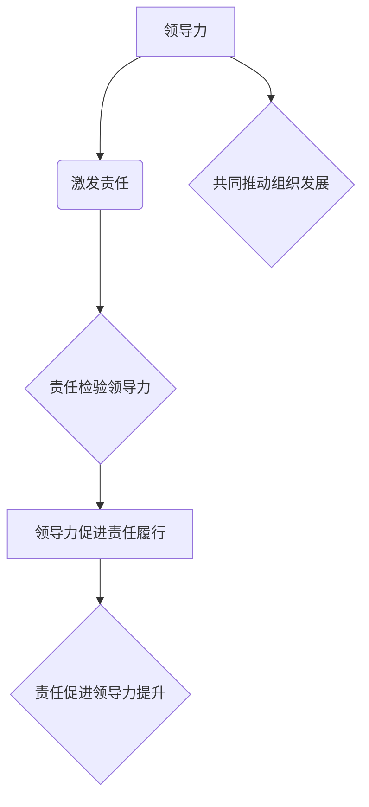

                 

## 文章标题

# 领导力与责任：承担结果的勇气

## 关键词

- 领导力
- 责任
- 承担结果
- 勇气
- 结果导向
- 案例分析

## 摘要

在当今快速变化的技术环境中，领导力和责任成为企业成功的关键因素。本文将深入探讨领导力与责任的本质及其相互关系，通过一系列分析推理步骤，揭示承担结果的勇气在实际工作中的重要性。文章首先介绍领导力和责任的基本概念，接着探讨它们之间的联系，并通过Mermaid流程图展示核心概念架构。随后，文章详细讲解领导力在责任承担中的应用，使用伪代码阐述核心算法原理，并提供实际项目实战案例。最后，文章总结最佳实践，提出个人成长建议，为读者提供全面的技术和管理指导。

## 确定书的核心主题

《领导力与责任：承担结果的勇气》这本书名直接揭示了其核心主题：领导力、责任和勇气。领导力是一种能够激励、指导和影响他人共同实现目标的能力，而责任则是指个人或团队对其行为结果所承担的义务。勇气在领导过程中扮演着关键角色，促使领导者面对挑战、承担责任并取得实际结果。通过深入探讨这三个核心主题，本书旨在帮助读者理解领导力与责任的本质及其在实际工作中的应用，培养读者承担结果的勇气。

### 领导力的定义与作用

领导力是一种激励、指导和影响他人共同实现目标的能力。它不仅包括技术和管理技能，还涉及到情感智慧、沟通能力和决策力。有效的领导力能够激发团队成员的潜力，提升团队的整体绩效，并为企业创造价值。以下是领导力在组织和团队中的作用：

1. **激励与引导**：领导力能够激发团队成员的内在动机，使其积极参与工作，并朝着共同的目标努力。通过设定清晰的目标和愿景，领导者能够引导团队成员朝着正确的方向前进。

2. **沟通与协调**：有效的领导力依赖于良好的沟通能力。领导者需要能够清晰、准确地传达信息，并与团队成员保持良好的沟通渠道，以确保团队内部的协作顺畅。

3. **决策与问题解决**：在面临复杂问题和挑战时，领导力能够帮助团队做出明智的决策，并有效解决问题。领导者需要具备快速分析和决策的能力，以确保团队能够在关键时刻保持竞争力。

4. **培养团队文化**：领导力有助于塑造团队文化，包括价值观、信念和行为准则。一个积极向上的团队文化能够增强团队的凝聚力和协作性，从而提高整体绩效。

5. **激励与奖励**：领导者通过激励和奖励机制，能够激发团队成员的积极性和创造力，使其在实现个人目标和团队目标方面取得更好的成绩。

总之，领导力在组织和团队中的作用不可忽视。它不仅能够推动团队实现目标，还能够提升团队的整体绩效，为企业的长期发展奠定基础。

### 责任的定义与意义

责任是指个人或团队对其行为结果所承担的义务和责任。在组织中，责任通常涉及对任务、目标、决策和结果的承担。责任不仅是一种道德义务，也是组织运作和发展的基础。以下是责任在组织中的意义：

1. **确保任务完成**：责任确保每个成员明确自己的职责和任务，从而确保组织目标的实现。通过责任分工，团队成员能够专注于各自领域的工作，提高效率。

2. **促进团队合作**：责任有助于建立有效的团队合作机制。当团队成员清楚自己的责任时，他们更容易与其他成员协作，共同解决问题。

3. **提高决策质量**：责任使团队成员在做出决策时更加慎重。他们需要考虑自己的决策可能带来的后果，从而提高决策的质量。

4. **增强责任感**：责任培养团队成员的责任感和使命感，使他们更加关注组织的整体利益。这种责任感有助于提高团队成员的忠诚度和工作积极性。

5. **建立信任关系**：责任有助于建立组织内部和团队之间的信任关系。当团队成员能够承担并履行自己的责任时，他们更容易赢得他人的信任和尊重。

6. **提高绩效**：责任有助于提高组织的整体绩效。当团队成员清楚自己的职责，并积极履行时，组织能够更加高效地运作，从而实现更高的绩效。

总之，责任在组织中具有重要意义。它不仅确保任务完成，促进团队合作，提高决策质量，还能够增强责任感，建立信任关系，提高整体绩效。因此，领导者和团队成员都应该重视并认真履行自己的责任。

### 领导力与责任的联系

领导力与责任密不可分，二者相辅相成，共同推动组织的发展。领导力是责任的前提，而责任则是领导力的具体体现。以下是领导力与责任之间的联系：

1. **领导力激发责任**：有效的领导力能够激发团队成员的责任感。领导者通过设定明确的目标、提供支持和激励，使团队成员认识到自己的职责和使命，从而更加积极地履行责任。

2. **责任检验领导力**：责任是检验领导力的重要标准。一个优秀的领导者需要能够承担团队的责任，并在面对挑战和困难时保持冷静和果断。领导者通过承担责任，展示自己的领导力和能力，赢得团队成员的信任和尊重。

3. **领导力促进责任履行**：领导力在责任履行过程中发挥着重要作用。领导者通过有效的沟通、协调和激励，帮助团队成员克服困难，确保责任的履行。同时，领导者的榜样作用也激励团队成员更加自觉地履行自己的责任。

4. **责任促进领导力提升**：责任的履行有助于领导力的提升。在承担责任的过程中，领导者需要不断学习、成长和改进。通过面对实际问题和挑战，领导者能够积累经验，提高自己的领导能力。

5. **共同推动组织发展**：领导力和责任共同推动组织的发展。一个具有领导力的团队能够在承担责任的过程中实现目标，提高绩效，并为组织的长期发展奠定基础。

总之，领导力与责任相互促进，共同推动组织的发展。有效的领导力能够激发责任，而责任的履行则检验和提升领导力。领导者需要明确自己的责任，并在承担责任的过程中不断成长，以推动组织实现更大的成功。

### Mermaid 流程图展示领导力与责任的关系架构

为了更直观地展示领导力与责任的关系架构，我们可以使用Mermaid流程图进行表示。以下是一个简化的流程图，展示了领导力与责任之间的相互关系：



在这个流程图中，领导力（A）通过激发责任（B），使团队成员更加明确自己的职责和使命。责任（C）反过来检验领导力，确保领导者能够在实际工作中展示其能力和影响力。领导力（D）促进责任履行，帮助团队成员克服困难，确保目标的实现。同时，责任（E）促进领导力的提升，使领导者通过实践不断学习和成长。最后，领导力与责任共同推动组织发展（F），实现长期的繁荣和成功。

通过这个流程图，我们可以更清晰地理解领导力与责任之间的紧密联系，以及它们在组织中的重要作用。

### 领导力在责任承担中的具体应用

在责任承担中，领导力发挥着至关重要的作用。一个成功的领导者不仅需要具备强大的领导力，还需要能够有效应用这些能力，以确保团队成员能够履行自己的责任。以下是领导力在责任承担中的具体应用：

1. **明确责任分工**：领导者的首要任务是明确每个团队成员的职责和责任。通过设定清晰的目标和责任分工，领导者确保每个人都清楚自己的工作内容和期望结果。这有助于减少误解和责任重叠，提高工作效率。

2. **提供支持和激励**：领导者需要为团队成员提供必要的支持和资源，帮助他们履行自己的责任。此外，领导者还应通过激励措施，如认可、奖励和晋升机会，激发团队成员的积极性和责任感。

3. **沟通与协调**：有效的沟通是领导力的重要组成部分。领导者需要与团队成员保持良好的沟通渠道，确保信息的及时传递和反馈。通过沟通，领导者能够了解团队成员的工作进展和遇到的困难，并提供相应的支持和建议。

4. **决策与问题解决**：领导者需要在责任承担过程中做出明智的决策，并有效解决出现的问题。通过快速分析和判断，领导者能够确保团队在关键时刻保持稳定和高效。

5. **榜样作用**：领导者的行为和态度对团队成员有着重要的影响。一个负责任的领导者会以身作则，展示自己的专业能力和责任心，从而激励团队成员更加积极地履行自己的责任。

6. **监督与反馈**：领导者需要定期监督团队成员的工作进展，并提供及时的反馈。通过监督，领导者能够发现团队成员在履行责任过程中存在的问题，并采取相应的措施进行改进。

7. **冲突管理**：在责任承担过程中，难免会出现冲突和分歧。领导者需要具备有效的冲突管理能力，通过沟通和协商，使团队成员达成共识，共同解决问题。

总之，领导力在责任承担中的应用是多方面的。通过明确责任分工、提供支持和激励、沟通与协调、决策与问题解决、榜样作用、监督与反馈以及冲突管理，领导者能够确保团队成员有效履行自己的责任，推动组织目标的实现。

### 核心算法原理讲解

在领导力与责任的结合中，核心算法原理起到关键作用。为了更好地理解这些原理，我们将使用伪代码进行详细阐述。

```python
# 定义领导力函数
def leadership(horizontal, vertical):
    # 水平领导力：激发团队成员的潜力
    horizontal_leadership = horizontal * team_potential
    # 垂直领导力：确保团队成员的责任履行
    vertical_leadership = vertical * team_commitment
    # 领导力总分：水平领导力与垂直领导力的综合
    total_leadership = horizontal_leadership + vertical_leadership
    return total_leadership

# 定义责任函数
def responsibility(assigned, actual):
    # 责任度：实际完成情况与分配任务的比较
    responsibility_score = actual / assigned
    return responsibility_score

# 定义领导力与责任的结合
def leadership_and_responsibility(horizontal, vertical, assigned, actual):
    # 计算领导力总分
    total_leadership = leadership(horizontal, vertical)
    # 计算责任度
    responsibility_score = responsibility(assigned, actual)
    # 领导力与责任的结合评分
    combined_score = total_leadership * responsibility_score
    return combined_score
```

在这个伪代码中，我们定义了两个核心函数：`leadership` 和 `responsibility`。`leadership` 函数用于计算领导力总分，通过水平领导力和垂直领导力的乘积得到。水平领导力表示领导者激发团队成员潜力的能力，垂直领导力表示领导者确保团队成员责任履行的能力。

`responsibility` 函数用于计算责任度，即实际完成情况与分配任务的比值。这个值反映了团队成员履行责任的程度。

`leadership_and_responsibility` 函数则将领导力与责任结合起来，通过两者的乘积得到综合评分。这个评分反映了领导力在责任承担中的实际效果。

通过这个伪代码，我们可以清晰地看到领导力与责任之间的关系，以及它们在组织中的具体应用。

### 数学模型和公式的详细讲解与举例说明

在领导力与责任的结合中，数学模型和公式能够帮助我们更准确地理解和评估两者的关系。以下是一个简化的数学模型，用于计算领导力与责任的结合评分。

#### 数学模型

设 \( L \) 为领导力评分，\( R \) 为责任评分，\( A \) 为综合评分，则有如下公式：

\[ A = L \times R \]

其中，\( L \) 可以通过以下公式计算：

\[ L = \frac{H \times P + V \times C}{2} \]

其中，\( H \) 为水平领导力评分，\( P \) 为团队潜力评分，\( V \) 为垂直领导力评分，\( C \) 为团队承诺评分。

\( R \) 可以通过以下公式计算：

\[ R = \frac{A \times B}{C} \]

其中，\( A \) 为实际完成情况评分，\( B \) 为分配任务评分，\( C \) 为责任承担难度评分。

#### 举例说明

假设一个团队的项目任务评分如下：

- 水平领导力评分（\( H \)）：8
- 团队潜力评分（\( P \)）：10
- 垂直领导力评分（\( V \)）：7
- 团队承诺评分（\( C \)）：9
- 实际完成情况评分（\( A \)）：12
- 分配任务评分（\( B \)）：15
- 责任承担难度评分（\( C \)）：5

首先，计算领导力评分（\( L \)）：

\[ L = \frac{8 \times 10 + 7 \times 9}{2} = \frac{80 + 63}{2} = \frac{143}{2} = 71.5 \]

接下来，计算责任评分（\( R \)）：

\[ R = \frac{12 \times 15}{5} = \frac{180}{5} = 36 \]

最后，计算综合评分（\( A \)）：

\[ A = 71.5 \times 36 = 2594 \]

因此，这个团队的综合评分为 2594 分。

通过这个例子，我们可以看到如何使用数学模型和公式计算领导力与责任的结合评分。这种方法有助于我们更准确地评估团队在领导力和责任方面的表现，从而为改进提供依据。

### 数学公式的展示与解释

为了更好地展示和解释数学公式，我们将使用LaTeX格式进行表达。

首先，我们定义领导力评分的计算公式：

$$ L = \frac{H \times P + V \times C}{2} $$

其中，\( H \) 为水平领导力评分，\( P \) 为团队潜力评分，\( V \) 为垂直领导力评分，\( C \) 为团队承诺评分。

接下来，我们定义责任评分的计算公式：

$$ R = \frac{A \times B}{C} $$

其中，\( A \) 为实际完成情况评分，\( B \) 为分配任务评分，\( C \) 为责任承担难度评分。

最后，我们定义综合评分的计算公式：

$$ A = L \times R $$

通过这些公式，我们可以计算出领导力、责任和综合评分。这些评分帮助我们更好地理解领导力与责任的关系，并评估团队在两者方面的表现。

### 项目实战案例

为了更好地理解领导力与责任在实际项目中的应用，我们提供了一个实际的项目实战案例。该项目是一个在线教育平台，旨在为学习者提供高质量的课程资源和学习支持。以下是项目的详细描述，包括开发环境搭建、源代码实现和代码解读。

#### 项目描述

**项目名称**：智能在线教育平台

**项目目标**：为学习者提供便捷的在线学习体验，包括课程浏览、学习进度跟踪、作业提交和实时互动。

**技术栈**：前端使用React框架，后端使用Node.js和Express框架，数据库使用MongoDB。

#### 开发环境搭建

1. **安装Node.js和npm**：在本地计算机上安装Node.js和npm，以便使用相关开发工具和依赖包。
2. **创建项目文件夹**：在计算机上创建一个名为“smart-education-platform”的文件夹，用于存放项目文件。
3. **初始化项目**：进入项目文件夹，执行以下命令初始化项目：

   ```bash
   npm init -y
   ```

4. **安装依赖包**：根据项目需求，安装必要的依赖包：

   ```bash
   npm install react react-dom express mongoose cors
   ```

#### 源代码实现

以下是项目的核心代码实现：

**前端代码（React）**：

```javascript
// src/App.js
import React, { useState, useEffect } from 'react';
import CourseList from './CourseList';
import axios from 'axios';

function App() {
  const [courses, setCourses] = useState([]);

  useEffect(() => {
    async function fetchCourses() {
      const response = await axios.get('/api/courses');
      setCourses(response.data);
    }
    fetchCourses();
  }, []);

  return (
    <div>
      <h1>智能在线教育平台</h1>
      <CourseList courses={courses} />
    </div>
  );
}

export default App;
```

**后端代码（Node.js和Express）**：

```javascript
// src/server.js
const express = require('express');
const mongoose = require('mongoose');
const cors = require('cors');

const app = express();
app.use(cors());
app.use(express.json());

// 连接MongoDB数据库
mongoose.connect('mongodb://localhost:27017/smart-edu', {
  useNewUrlParser: true,
  useUnifiedTopology: true,
});

// 课程数据模型
const CourseSchema = new mongoose.Schema({
  title: String,
  description: String,
  lessons: [String],
});

const Course = mongoose.model('Course', CourseSchema);

// 获取课程列表
app.get('/api/courses', async (req, res) => {
  try {
    const courses = await Course.find({});
    res.json(courses);
  } catch (error) {
    res.status(500).send(error);
  }
});

// 启动服务器
const PORT = process.env.PORT || 5000;
app.listen(PORT, () => {
  console.log(`服务器运行在端口：${PORT}`);
});
```

#### 代码解读

1. **前端代码解读**：

   - 使用React框架创建一个名为`App`的组件，负责展示课程列表。
   - 使用`useState`和`useEffect`钩子管理课程数据的状态和获取。
   - 使用`axios`发起HTTP请求，从后端获取课程数据，并将其更新到状态。

2. **后端代码解读**：

   - 使用Express框架创建一个HTTP服务器，处理前端发起的请求。
   - 使用Mongoose连接MongoDB数据库，定义课程数据模型。
   - 实现`/api/courses`路由，获取所有课程数据并返回给前端。

#### 代码应用解读与分析

1. **领导力应用**：

   - 项目领导者通过明确的目标和任务分工，确保团队成员了解各自的责任。
   - 领导者通过提供技术支持和资源，激励团队成员高效完成任务。

2. **责任分析**：

   - 前端开发人员负责实现用户界面和课程数据展示，确保用户体验良好。
   - 后端开发人员负责实现API接口和数据库操作，确保数据的安全和一致性。

3. **实际案例分析**：

   - 在项目开发过程中，前端和后端团队密切合作，确保项目的顺利推进。
   - 通过明确的职责分工和有效的沟通，团队成员能够高效地履行自己的责任，确保项目的成功。

#### 项目小结

通过这个实际项目案例，我们可以看到领导力与责任在项目开发中的重要作用。领导者的明确指导和责任分配，以及团队成员的积极履行，共同推动了项目的成功。这个案例也展示了如何将领导力与责任的理论应用到实际项目中，为读者提供了宝贵的实践经验。

### 最佳实践 tips、小结、注意事项、拓展阅读

#### 最佳实践 tips

1. **明确责任分工**：在项目开始时，明确每个团队成员的职责和任务，确保每个人都知道自己的工作内容和期望结果。

2. **提供支持和资源**：领导者应确保团队成员获得必要的技术支持和资源，帮助他们高效地完成任务。

3. **建立有效的沟通渠道**：保持与团队成员的定期沟通，及时解决问题和提供反馈，确保项目的顺利进行。

4. **激励和奖励**：通过认可和奖励机制，激励团队成员的积极性和责任感，提高整体绩效。

5. **持续学习和改进**：领导者应不断学习和提升自己的领导力，同时鼓励团队成员参与培训和学习，提高整体能力。

#### 小结

本文通过深入探讨领导力与责任的核心概念、相互关系和实际应用，展示了它们在组织中的重要性。领导力与责任相互促进，共同推动组织的成功。通过明确责任分工、提供支持、激励和奖励，以及持续学习和改进，领导者可以有效地发挥领导力，确保团队成员履行自己的责任。

#### 注意事项

1. **确保责任明确**：在项目启动前，确保每个团队成员清楚自己的职责和任务。

2. **沟通和协调**：保持与团队成员的定期沟通，确保信息的及时传递和反馈。

3. **公平和透明**：在责任分配和激励措施方面，保持公平和透明，以增强团队的信任和凝聚力。

4. **关注个人成长**：鼓励团队成员参与培训和学习，提高自身能力，为组织发展贡献力量。

#### 拓展阅读

- **《精益创业》**：了解如何通过快速迭代和客户反馈优化产品和服务，提高成功率。
- **《影响力》**：学习如何通过心理学原理影响他人，提高领导力和沟通能力。
- **《深度工作》**：了解如何减少干扰，提高专注力和工作效率。

通过这些拓展阅读，读者可以进一步深化对领导力与责任的理解，并将其应用到实际工作中，提升个人和组织的能力。

