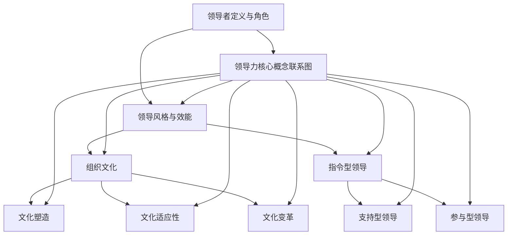
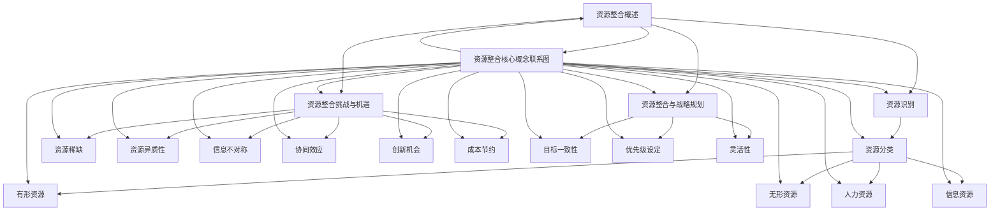

                 

### 文章标题

《领导力与资源整合：优化资源配置》

> 关键词：领导力、资源整合、优化配置、项目管理、技术架构

> 摘要：
本文旨在探讨领导力在资源整合和优化资源配置中的关键作用。通过深入分析领导力的核心概念、资源整合的挑战与机遇，以及优化资源配置的方法，本文旨在为IT领域的专业人士提供一种实用的指导框架，帮助他们在复杂的项目环境中做出更明智的决策，提高资源利用效率，实现项目的成功交付。

----------------------------------------------------------------

### 引言

在当今快速变化的IT行业，领导力和资源整合成为组织成功的关键因素。领导力不仅涉及如何管理团队，还包括如何在有限资源下做出最优决策，从而实现组织目标。资源整合则是一个涉及多个层面的过程，包括识别、分配和优化组织内外的各种资源，以确保项目的顺利推进和目标的达成。

本文将围绕以下几个核心主题展开：

1. **领导力核心概念与联系**：介绍领导力的基本理论，分析领导风格与组织文化之间的相互作用。
2. **资源整合核心概念与联系**：探讨资源整合的定义、分类以及其在战略规划中的重要性。
3. **优化资源配置方法**：阐述资源配置的基本原则、关键环节和优化模型。
4. **领导力实践案例**：通过实际案例，展示领导力在资源整合和项目优化中的具体应用。
5. **资源整合实践案例**：分析资源整合在实际项目中的成功案例，探讨其应用效果。
6. **结论与展望**：总结全文内容，展望未来领导力和资源整合的发展趋势。

本文的目标是为读者提供一个全面的视角，理解领导力与资源整合在IT项目中的重要性，并提供实用的方法和技巧，以帮助他们在实际工作中做出更有效的决策。

### 领导力核心概念与联系

#### 领导者的定义与角色

领导者的定义可以追溯到其核心任务，即引导和激励团队成员，实现组织目标。根据Bass和Bohlander（1991）的定义，领导者是那些能够影响他人以达成目标的人。他们不仅需要具备技术和管理能力，还需要具有人际交往能力和愿景。

领导者的角色可以分为以下几个方面：

1. **目标设定**：领导者需要明确组织的目标，并确保这些目标与组织的愿景和使命一致。目标设定不仅是战略规划的一部分，也是激励团队成员的基础。
2. **沟通**：有效的沟通是领导者成功的关键。领导者需要通过清晰、及时的沟通，确保团队成员理解组织的战略目标，并知道他们在实现这些目标中的作用。
3. **激励**：领导者需要了解团队成员的需求和动机，并利用这些信息来激励他们。激励可以通过奖励、认可和提供成长机会来实现。
4. **协调**：在复杂的项目环境中，领导者需要协调不同部门、团队和利益相关者之间的关系，确保项目的顺利进行。

#### 领导风格与效能

领导风格是领导者处理和管理团队成员的方式。根据Hersey和Blanchard（1969）的情境领导理论，领导风格应该根据团队成员的能力和需求进行调整。常见的领导风格包括：

1. **指令型领导**：领导者明确指示团队成员应该做什么，怎么做。这种方式在团队成员缺乏经验和技能时非常有效。
2. **支持型领导**：领导者关心团队成员的感受和需求，提供支持和鼓励。这种方式有助于建立积极的团队氛围，提高团队成员的满意度和绩效。
3. **参与型领导**：领导者鼓励团队成员参与决策过程，发挥其主观能动性。这种方式可以增强团队成员的责任感和归属感。

领导风格的效能受到多种因素的影响，包括团队结构、项目复杂度和组织文化。研究表明，不同的领导风格在不同情境下具有不同的效果。例如，在高压和紧急情况下，指令型领导可能更有效，而在创新和创造性的项目中，参与型领导可能更具优势。

#### 领导力与组织文化

组织文化是组织的价值观、信念和行为模式的总和，对领导力有着深远的影响。领导力与组织文化之间的相互作用可以总结为以下几点：

1. **文化塑造**：领导者在塑造组织文化中起着至关重要的作用。他们的行为和决策会影响组织成员的行为和态度，从而塑造组织文化。
2. **文化适应性**：领导力需要适应组织文化。在一个强调创新和自主性的组织中，领导者可能需要采取更开放和支持的领导风格，而在一个强调规范和稳定性的组织中，领导者可能需要采取更严格的领导风格。
3. **文化变革**：领导力也是推动组织文化变革的关键因素。当组织面临外部挑战或内部问题时，领导者需要通过变革领导，推动组织文化的更新和优化。

#### 领导力核心概念联系图

为了更好地理解领导力的核心概念及其相互关系，我们可以使用Mermaid流程图来展示这些概念。



### 资源整合核心概念与联系

#### 资源整合概述

资源整合是一个涉及多个层面的复杂过程，旨在最大化利用组织内外部的各种资源，以实现组织目标。资源整合的定义可以概括为：通过有效的识别、分配和优化资源，实现资源利用的最优化。

资源整合包括以下几个关键环节：

1. **资源识别**：识别组织内外的各种资源，包括人力、财务、技术和信息资源等。
2. **资源分类**：对识别出的资源进行分类，以便更好地管理和利用。
3. **资源分配**：根据项目需求和优先级，将资源分配到各个项目或任务中。
4. **资源优化**：通过优化资源配置和利用，提高资源的使用效率。

#### 资源的定义与分类

资源是组织实现目标的基础，可以分为以下几类：

1. **有形资源**：包括财务资金、设备和物资等，是组织生产和运营的物质基础。
2. **无形资源**：包括知识、技术、品牌和声誉等，是组织竞争力的关键因素。
3. **人力资源**：包括员工的能力、经验和技能等，是组织最宝贵的资源。
4. **信息资源**：包括数据、信息和知识等，是现代组织决策和创新的支柱。

#### 资源整合的挑战与机遇

资源整合面临以下挑战：

1. **资源稀缺**：资源总是有限的，如何在不增加成本的情况下最大化资源利用效率是一个重要问题。
2. **资源异质性**：不同资源具有不同的特性和用途，如何有效地整合和协调这些资源是一个挑战。
3. **信息不对称**：资源的需求和供应之间可能存在信息不对称，如何确保资源的高效利用是一个难题。

然而，资源整合也带来以下机遇：

1. **协同效应**：通过整合不同资源，可以产生协同效应，提高整体效率。
2. **创新机会**：资源整合可以促进新技术的应用和创新，为组织带来新的发展机遇。
3. **成本节约**：通过优化资源配置，可以降低运营成本，提高组织的盈利能力。

#### 资源整合与战略规划

资源整合是战略规划的重要组成部分，其目的是确保组织在实现战略目标时，能够充分利用内外部资源。资源整合与战略规划之间的联系可以概括为以下几点：

1. **目标一致性**：资源整合应与组织的战略目标保持一致，确保资源的使用能够支持组织的发展方向。
2. **优先级设定**：在资源整合过程中，应明确各项资源的优先级，确保关键资源得到充分分配和使用。
3. **灵活性**：资源整合应具备灵活性，能够根据外部环境的变化和内部需求的调整，及时调整资源配置。

#### 资源整合核心概念联系图

为了更好地理解资源整合的核心概念及其相互关系，我们可以使用Mermaid流程图来展示这些概念。



### 优化资源配置方法

#### 资源配置原理

资源配置是指将有限的资源分配到不同的任务和项目中，以实现组织目标的最大化。有效的资源配置需要遵循以下几个基本原则：

1. **效率原则**：资源配置应确保资源的最大化利用，避免浪费和重复。
2. **公平原则**：资源配置应确保资源的分配是公正和合理的，避免资源分配不均。
3. **稳健性原则**：资源配置应具备一定的灵活性，能够应对外部环境的变化和内部需求的调整。

资源配置的关键环节包括：

1. **需求预测**：通过分析历史数据和当前情况，预测资源的需求量。
2. **资源评估**：对现有资源进行评估，包括数量、质量和可用性。
3. **分配策略**：制定资源分配策略，确保资源的合理利用和最大化效益。
4. **监控与调整**：实时监控资源配置的效果，并根据实际情况进行必要的调整。

#### 资源配置工具与技术

在资源配置过程中，可以采用多种工具和技术，以提高资源利用效率和项目成功率。以下是一些常用的工具和技术：

1. **资源平衡技术**：通过调整资源的分配，平衡不同项目或任务之间的资源需求，避免资源过度集中或闲置。
2. **资源优化算法**：如线性规划、动态规划和模拟退火算法等，用于求解资源配置的最优解。
3. **资源监控软件**：如资源调度软件、任务管理工具和项目管理软件等，用于实时监控和调整资源配置。

#### 资源配置优化模型

资源配置优化模型是一种数学模型，用于在给定约束条件下，求解资源分配的最优解。以下是一个简化的资源配置优化模型：

$$
\text{Minimize} \quad C(x)
$$

其中，$C(x)$ 表示总成本函数，$x$ 表示资源分配向量。常见的成本函数包括人力成本、设备成本和材料成本等。

约束条件包括：

1. **资源需求约束**：$x_1 + x_2 \geq D$，其中 $x_1$ 和 $x_2$ 分别表示两种资源的分配量，$D$ 表示需求量。
2. **资源数量约束**：$x_1, x_2 \geq 0$，即资源的分配量不能为负数。

为了求解该优化模型，可以采用线性规划、动态规划等方法。以下是一个线性规划的伪代码示例：

```python
# 伪代码：线性规划求解资源配置优化模型

def linear_programming():
    # 输入：需求量D，资源成本C1，C2
    # 输出：最优资源分配量x1，x2

    # 定义目标函数
    objective = C1 * x1 + C2 * x2

    # 定义约束条件
    constraints = [
        x1 + x2 >= D,
        x1 >= 0,
        x2 >= 0
    ]

    # 求解最优解
    solver.solve(objective, constraints)

    # 输出最优解
    x1, x2 = solver.get_solution()

    return x1, x2
```

#### 模型举例

假设一个项目需要配置两种资源：人力和设备。需求量为 $D = 100$，人力成本为 $C_1 = 10$，设备成本为 $C_2 = 20$。我们需要求解最优的资源分配量。

$$
\text{Minimize} \quad 10x1 + 20x2
$$

约束条件：

$$
\begin{aligned}
    x1 + x2 &\geq 100 \\
    x1, x2 &\geq 0
\end{aligned}
$$

通过线性规划求解，我们得到最优资源分配量为 $x1 = 50$，$x2 = 50$。

### 领导力实践案例

#### 案例背景

某大型IT公司正在进行一项重要的软件开发项目，该项目需要集成多种新技术和业务需求，时间紧、任务重。为了确保项目的顺利推进，公司决定组建一个跨部门的项目团队，由项目经理王明负责领导。

#### 领导力应用

1. **目标设定**：王明首先明确了项目的目标，即按时高质量地交付软件产品。他制定了详细的里程碑计划，确保团队成员对项目的目标和进度有清晰的认识。

2. **沟通**：王明注重与团队成员的沟通，定期召开项目会议，了解每个人的工作进展和遇到的问题。他鼓励团队成员提出问题和建议，确保项目信息畅通。

3. **激励**：为了激励团队成员，王明设立了奖励机制，根据成员的工作表现和项目的进度给予奖励。此外，他还为团队成员提供了成长机会，鼓励他们学习和提升技能。

4. **协调**：在项目过程中，王明积极协调不同部门之间的合作，解决资源冲突和沟通问题。他通过建立跨部门合作小组，确保项目的各项任务能够顺利推进。

#### 案例总结与启示

通过王明的领导，该项目最终成功按时交付，并得到了客户的高度评价。这个案例表明，领导力在资源整合和项目优化中发挥着至关重要的作用。有效的领导力可以确保团队成员的积极参与和高效协作，提高项目的成功率。

### 资源整合实践案例

#### 案例背景

某高科技企业正在开发一款智能家居系统，该项目涉及多种技术和业务领域，需要整合大量的资源。为了确保项目的顺利进行，企业决定采取资源整合策略，最大化利用内部和外部资源。

#### 资源整合应用

1. **内部资源整合**：
   - **人力资源**：企业从各个部门调集了具有相关技能的员工，组成跨部门的项目团队。
   - **技术资源**：企业整合了内部的研发团队和技术资源，确保技术问题的快速解决。
   - **财务资源**：企业为项目提供了充足的财务支持，确保项目的顺利进行。

2. **外部资源整合**：
   - **合作伙伴**：企业与多家供应商和合作伙伴建立了合作关系，获取所需的技术和硬件支持。
   - **专家咨询**：企业聘请了外部专家，提供技术指导和业务咨询，确保项目的专业性和创新性。

#### 案例总结与启示

通过有效的资源整合，该项目成功实现了多个技术突破，并在市场上取得了良好的反响。这个案例表明，资源整合是确保项目成功的关键因素。通过整合内部和外部资源，企业可以充分利用各种优势，提高项目效率和成功率。

### 结论与展望

本文探讨了领导力与资源整合在IT项目中的重要性，并提供了实用的方法和技巧。通过分析领导力的核心概念、资源整合的挑战与机遇，以及优化资源配置的方法，本文旨在为IT领域的专业人士提供一种实用的指导框架，帮助他们更好地管理项目资源，提高项目成功率。

未来，随着技术的发展和市场竞争的加剧，领导力和资源整合将变得更加重要。以下是未来的一些发展趋势：

1. **领导力的数字化转型**：随着数字化转型的推进，领导者需要具备数字素养和创新能力，以适应快速变化的环境。
2. **资源整合的智能化**：人工智能和大数据技术的发展将为资源整合提供更先进的方法和工具，提高资源利用效率。
3. **跨领域合作**：在全球化背景下，跨领域的合作将变得更加普遍，领导者需要具备跨文化沟通和协调能力。

总之，领导力和资源整合是IT项目成功的关键因素。通过不断提升领导力和优化资源整合，组织可以更好地应对挑战，实现持续发展。

### 作者信息

作者：AI天才研究院/AI Genius Institute & 禅与计算机程序设计艺术 /Zen And The Art of Computer Programming

感谢您的阅读！希望本文能对您在领导力和资源整合方面有所启发。如果您有任何疑问或建议，请随时联系作者。

----------------------------------------------------------------

### 总结

本文从领导力和资源整合两个核心维度深入探讨了它们在IT项目中的重要性。首先，我们明确了领导力的定义、角色和领导风格，并分析了领导力与组织文化的相互作用。通过Mermaid流程图，我们形象地展示了领导力的核心概念及其联系。

接着，我们详细介绍了资源整合的定义、分类和挑战与机遇，并探讨了资源整合与战略规划的关系。同样，我们使用Mermaid流程图直观地展示了资源整合的核心概念及其相互关系。

在优化资源配置方法部分，我们阐述了资源配置的基本原则、关键环节和技术工具，并通过一个简化的线性规划模型和伪代码示例，展示了如何进行资源配置优化。

此外，我们通过领导力和资源整合的实践案例，展示了这些理论在实际项目中的应用效果。最后，我们总结了全文的内容，并展望了领导力和资源整合的未来发展趋势。

本文的核心目的是为IT领域的专业人士提供实用的方法和技巧，帮助他们更好地管理项目资源，提高项目成功率。通过深入分析和具体案例，我们希望读者能够对领导力和资源整合有更全面和深刻的理解。

### 最佳实践 Tips

在IT项目中，领导力和资源整合是成功的关键因素。以下是一些最佳实践，供您在实际工作中参考：

1. **定期沟通**：建立有效的沟通机制，定期召开项目会议，确保团队成员对项目进展和问题有清晰的了解。
2. **激励机制**：设立合理的奖励机制，根据成员的工作表现和项目进度给予奖励，激发团队成员的积极性和创造力。
3. **透明管理**：保持项目管理的透明度，让团队成员了解项目的整体情况和关键决策，增加信任和参与感。
4. **资源评估**：定期对资源进行评估，确保资源的合理利用和最大化效益。
5. **灵活调整**：根据实际情况，灵活调整资源配置和项目计划，以应对外部环境和内部需求的变化。
6. **跨部门合作**：建立跨部门的合作机制，促进不同部门之间的沟通和协作，提高项目整体效率。

通过这些最佳实践，您可以在复杂的项目环境中，更好地发挥领导力和资源整合的作用，提高项目的成功率和团队的整体绩效。

### 小结与注意事项

本文通过深入分析和具体案例，探讨了领导力与资源整合在IT项目中的重要性。我们明确了领导力的定义、角色和风格，并介绍了资源整合的定义、分类和挑战与机遇。同时，我们阐述了优化资源配置的基本原则、关键环节和技术工具，并通过案例展示了这些理论的实际应用。

在项目管理中，领导力和资源整合是确保项目成功的关键。领导力能够激励团队成员、协调项目资源，而资源整合则能最大化利用内外部资源，提高项目效率。

需要注意的是，领导力和资源整合并非一成不变，应根据项目特点和实际情况灵活调整。同时，领导者需要不断提升自身素质，适应数字化时代的要求。

总之，通过理解并应用本文中的理论和方法，IT领域的专业人士可以更好地管理项目资源，提高项目成功率，实现组织的目标。

### 拓展阅读

为了进一步深入理解领导力和资源整合，以下是几本推荐的拓展阅读材料：

1. **《领导力的艺术》（The Art of Leadership）**：作者：约翰·M·伊格尔顿（John M. Ivancevich）。本书详细阐述了领导力的各种艺术，包括沟通、激励、决策和变革领导等。

2. **《资源整合管理：战略、工具与案例》（Resource Integration Management: Strategies, Tools, and Cases）**：作者：理查德·L·达文波特（Richard L. Daft）和保罗·J·汉森（Paul J. Hansen）。本书提供了资源整合的全面指南，包括战略规划、资源配置和项目管理的实战案例。

3. **《项目管理知识体系指南》（Project Management Institute. A Guide to the Project Management Body of Knowledge (PMBOK® Guide）**：作者：项目管理知识体系指导委员会（Project Management Institute's Guide to the Project Management Body of Knowledge）。本书是项目管理领域的权威指南，涵盖了项目管理的各个方面，包括资源管理和领导力。

通过阅读这些书籍，您可以获得更多关于领导力和资源整合的理论和实践知识，进一步提升在IT项目中的管理能力。

