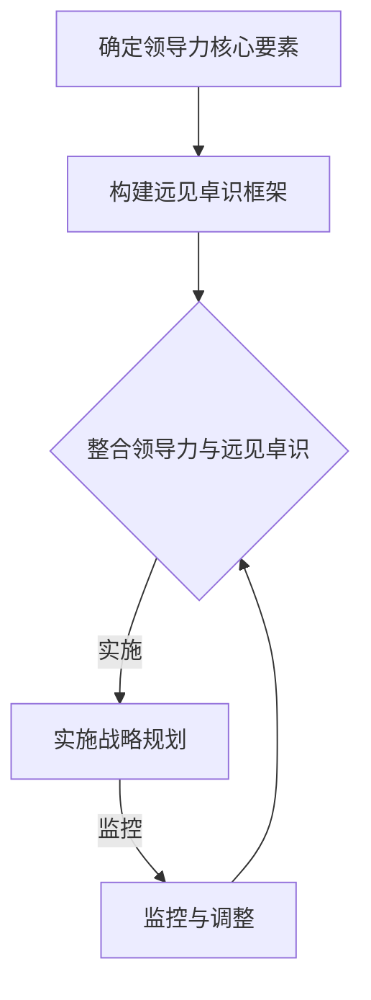

                 

### 引言

在现代企业中，领导力与远见卓识是确保组织持续成功和发展的两大核心要素。领导力不仅关乎个人能力的发挥，更在于如何引导和激励团队共同实现目标。而远见卓识则体现在对市场趋势的敏锐洞察和对未来机会的准确把握上。战略规划作为连接领导力和远见卓识的桥梁，是企业制定和实现长远目标的重要手段。

本篇文章将围绕“领导力与远见卓识：制定战略规划的能力”这一主题，逐步深入探讨这三个关键领域。文章将首先介绍领导力的核心要素，包括其定义、演变和关键要素。接着，我们将探讨团队合作的重要性，以及如何建立有效的沟通机制和培养团队凝聚力。

随后，文章将转向远见卓识的实践，介绍预测与分析的方法，特别是SWOT分析的应用。在此之后，我们将详细讨论战略规划的定义、目的和过程，包括市场分析、竞争对手分析和资源评估等步骤。接下来，文章将探讨战略实施的策略，如人力资源规划、财务规划和运营规划。

在第三部分，我们将探讨领导力与远见卓识的结合，包括领导者的角色转变和如何在不确定性中做出有效决策。最后，文章将总结领导力与远见卓识的整合，展望未来领导力发展的趋势，并提供一些实用的工具和方法。

通过这一系列的分析和讨论，我们希望读者能够理解领导力与远见卓识的重要性，并掌握制定战略规划的能力，从而在职业生涯中取得更大的成功。

### 关键词

- 领导力
- 远见卓识
- 战略规划
- 团队合作
- 预测与分析
- SWOT分析
- 领导风格
- 沟通机制
- 团队凝聚力
- 人力资源规划
- 财务规划
- 运营规划

### 摘要

本文旨在探讨领导力与远见卓识在制定战略规划中的重要作用。文章首先介绍了领导力的核心要素，包括定义、演变和关键要素，强调了领导风格和领导者人格特质的重要性。接着，文章探讨了团队合作的重要性，并提出了建立有效沟通机制和培养团队凝聚力的策略。随后，文章转向远见卓识的实践，介绍了预测与分析的方法，特别是SWOT分析的应用。在此基础上，文章详细讨论了战略规划的定义、目的和过程，包括市场分析、竞争对手分析和资源评估等步骤。接着，文章探讨了战略实施的策略，如人力资源规划、财务规划和运营规划。最后，文章总结了领导力与远见卓识的整合，并展望了未来领导力发展的趋势，提供了实用的工具和方法。通过本文的探讨，读者将能够深入理解领导力与远见卓识的重要性，并掌握制定战略规划的能力，以实现组织的长远发展。

### 第一部分：领导力的核心要素

#### 第1章：领导力概述

领导力是一种复杂而多层次的能力，其定义和演变随着时代的变化而不断演进。在探索领导力的核心要素之前，我们需要首先理解领导力的基本概念和其历史演变。

##### 1.1 领导力的定义与演变

领导力可以理解为一种激励、引导和影响他人的能力，使个人或团队朝着共同的目标前进。历史上，领导力主要被视为一种“英雄式”的能力，强调领导者个人的英勇和领导艺术。例如，早期的领导者通常通过军事指挥、宗教权威或政治权力来展示其领导力。

然而，随着组织复杂性的增加和社会环境的变化，领导力的定义逐渐从单一的英雄式领导转变为一种更加综合和协作的领导方式。现代领导力更注重领导者的影响力、沟通能力和对团队动态的敏感性。这种转变反映了对领导力更加全面和系统化的理解。

##### 1.2 领导力的关键要素

要成为一名有效的领导者，不仅需要具备某些特定的技能和特质，还需要了解领导力的关键要素。以下是几个关键的领导力要素：

1. **领导风格**：领导风格是指领导者如何与下属互动和指导团队的方式。常见的领导风格包括民主式、专制式和放任式。每种风格都有其适用的场景和效果，领导者需要根据具体情况灵活调整。

2. **领导者的人格特质**：领导者的人格特质对其领导效果有着重要影响。这些特质包括自信、正直、决断力、同理心和创造力等。领导者的人格特质不仅影响其个人决策，还影响团队成员的情绪和行为。

3. **团队精神**：领导力不仅仅是关于领导者的个人能力，还关乎如何建立一个有凝聚力的团队。团队精神是指团队成员之间的相互信任、支持和合作。一个有团队精神的团队往往能够更有效地实现共同目标。

4. **影响力**：领导者的核心职责之一是影响和激励团队成员。领导者需要通过沟通、激励和榜样作用来建立自己的影响力，从而推动团队向前发展。

##### 1.3 领导力的社会与文化背景

领导力不仅仅是个人能力的体现，还受到社会和文化背景的影响。在不同的社会和文化环境中，领导力的表现形式和期望可能会有所不同。例如，在强调个人主义的社会中，领导力可能更注重独立思考和决策能力；而在强调集体主义的社会中，领导力可能更注重团队合作和协调。

此外，企业文化也会对领导力产生重要影响。一个积极的企业文化能够激励领导者发挥更大的影响力，而一个消极的企业文化则可能抑制领导者的发挥。

#### 1.4 领导力的演变历程

领导力的演变历程反映了人类社会和组织发展的一定趋势。以下是一些关键的演变阶段：

- **传统领导力**：以权威和命令为导向，强调领导者的地位和权力。
- **现代领导力**：更加注重团队合作、沟通和影响力，强调领导者的服务精神和领导艺术。
- **未来领导力**：随着科技和社会的发展，领导力将进一步向数字化转型，强调创新思维和适应性。

通过理解领导力的定义、演变和关键要素，我们可以更好地把握领导力在现代企业中的作用和重要性。在接下来的章节中，我们将进一步探讨团队合作的重要性，以及如何通过建立有效的沟通机制和培养团队凝聚力来提升领导力。

### 第2章：构建团队精神

在领导力的核心要素中，团队合作是不可忽视的一部分。团队精神不仅能够提高团队的绩效，还能增强团队成员之间的信任和合作意识。本章将探讨团队合作的重要性，以及如何建立有效的沟通机制和培养团队凝聚力。

#### 2.1 团队合作的重要性

团队合作在实现企业目标中起着至关重要的作用。以下是团队合作的重要性和优势：

1. **提高工作效率**：团队成员通过合作可以更快地完成任务，减少重复劳动，从而提高工作效率。

2. **增强创新能力**：团队合作能够汇集不同成员的智慧，促进创新思维的产生，从而推动企业的创新和发展。

3. **提升团队士气**：良好的团队合作能够增强团队成员的归属感和自信心，提升团队的士气。

4. **减少错误和失误**：通过团队成员之间的互相监督和协作，可以减少工作中的错误和失误，提高工作的准确性和质量。

5. **促进知识共享**：团队合作能够促进团队成员之间的知识共享，提高团队的整体素质。

#### 2.2 建立有效的沟通机制

建立有效的沟通机制是团队合作成功的关键。以下是一些建立有效沟通机制的策略：

1. **明确沟通目标**：在团队合作中，每个成员都应该明确自己的沟通目标，确保信息传递的准确性和及时性。

2. **多样化的沟通方式**：根据不同的沟通需求和场景，选择合适的沟通方式，如面对面交流、电子邮件、电话会议和在线协作工具等。

3. **定期沟通会议**：定期举行团队会议，确保团队成员之间的信息同步和意见交流。会议内容可以包括项目进展、问题解决和决策讨论等。

4. **透明度**：保持信息的透明度，让每个成员都能了解团队的最新动态和决策过程，增强团队成员的信任感。

5. **积极的倾听**：在沟通中，领导者应积极倾听成员的意见和建议，尊重每个人的观点，鼓励团队成员之间的互动和讨论。

#### 2.3 培养团队凝聚力

团队凝聚力是指团队成员之间的相互信任、尊重和支持程度。以下是培养团队凝聚力的方法：

1. **建立共同目标**：团队成员应该共同确立团队的目标，并明确每个人的职责和任务，使团队工作更加有序和高效。

2. **培养团队文化**：通过组织团队活动、庆祝团队成就和建立团队传统，培养团队成员之间的共同价值观和文化认同感。

3. **激励和奖励**：对团队成员的成就和贡献给予及时和公正的奖励和认可，激发团队成员的工作热情和积极性。

4. **促进团队建设**：通过团队建设活动，如户外拓展训练、团队聚餐和团队旅行等，增强团队成员之间的情感联系和信任。

5. **提供反馈和指导**：领导者应定期提供团队成员的反馈和指导，帮助团队成员识别和改进工作中的问题和不足，促进个人和团队的发展。

通过有效的团队合作和沟通机制，以及积极的团队凝聚力培养，领导者可以打造一个高效、创新和有凝聚力的团队，从而实现企业目标的最大化。

### 第二部分：远见卓识的实践

#### 第3章：预测与分析

在制定战略规划的过程中，预测与分析是关键的一步。通过准确预测和分析市场趋势、竞争环境以及内部资源，企业可以更好地把握发展机会，规避潜在风险。本章将介绍预测与分析的方法，特别是SWOT分析的应用。

#### 3.1 预测方法概述

预测方法可以分为定性预测和定量预测两类。定性预测主要依赖于专家的经验和直觉，如德尔菲法、头脑风暴法等。定量预测则基于数据和统计分析，如时间序列分析、回归分析等。以下是几种常用的预测方法：

1. **历史数据分析**：通过分析过去的数据，识别出趋势和模式，从而预测未来的发展方向。这种方法适用于那些过去和未来之间有较高相似性的情境。

2. **趋势分析**：通过识别和跟踪市场或技术趋势，预测未来的变化方向。这种方法适用于那些在时间维度上有明显趋势的情境。

3. **情景分析**：通过构建不同的未来情景，评估在不同情境下的潜在影响，从而为决策提供参考。这种方法适用于不确定性较高的情境。

4. **决策树分析**：通过构建决策树，分析不同决策路径的结果和概率，帮助决策者选择最优方案。

#### 3.2 SWOT分析

SWOT分析是一种常用的战略规划工具，用于评估企业的优势、劣势、机会和威胁。以下是SWOT分析的基本概念和步骤：

1. **SWOT分析的基本概念**：

   - **优势（Strengths）**：企业内部的优势，如核心竞争力、独特资源和技术优势等。
   - **劣势（Weaknesses）**：企业内部的不利因素，如管理问题、资源不足和技术短板等。
   - **机会（Opportunities）**：外部环境中可能出现的有利条件，如市场增长、技术进步和合作伙伴等。
   - **威胁（Threats）**：外部环境中可能出现的威胁，如竞争对手、法规变化和市场需求变化等。

2. **SWOT分析的步骤**：

   - **第一步：识别优势**：通过内部调查和数据分析，识别企业内部的优势。

   - **第二步：识别劣势**：通过内部调查和数据分析，识别企业内部的劣势。

   - **第三步：识别机会**：通过外部市场分析，识别可能的市场机会。

   - **第四步：识别威胁**：通过外部市场分析，识别可能的市场威胁。

   - **第五步：匹配分析**：将优势和机会、劣势和威胁进行匹配，制定相应的策略。

3. **SWOT分析的案例**：

   以一家科技公司为例，进行SWOT分析：

   - **优势**：强大的研发团队、领先的技术、市场知名度和品牌效应。
   - **劣势**：产品线单一、资金周转压力大、管理层次较为薄弱。
   - **机会**：新兴市场的快速增长、云计算技术的普及和政府政策的支持。
   - **威胁**：竞争对手的挑战、技术迭代速度快和市场需求变化。

通过SWOT分析，这家科技公司可以明确自身的优势和劣势，抓住市场机会，应对潜在威胁，从而制定更为精准的战略规划。

#### 3.3 SWOT分析的应用

SWOT分析不仅可以帮助企业了解自身的状况，还可以在战略规划中发挥重要作用。以下是SWOT分析在战略规划中的应用：

1. **制定发展战略**：根据SWOT分析的结果，企业可以制定符合自身优势和市场机会的发展战略。

2. **资源配置**：通过分析内部资源和外部环境，企业可以合理配置资源，优化资源配置效率。

3. **风险管理**：通过识别潜在威胁，企业可以制定相应的风险应对策略，降低经营风险。

4. **竞争优势**：利用SWOT分析的结果，企业可以强化自身的竞争优势，巩固市场地位。

5. **组织调整**：根据SWOT分析的结果，企业可以进行组织结构的调整，优化组织效率。

通过预测与分析，企业可以更加全面地了解外部环境和内部状况，从而制定出科学、合理的战略规划，实现长期稳定的发展。

### 第4章：制定战略规划

战略规划是企业发展的蓝图，是确保组织长期成功的关键步骤。一个有效的战略规划不仅能够帮助企业明确目标和方向，还能在复杂多变的市场环境中为企业提供行动指南。本章将详细介绍战略规划的定义、目的和过程。

#### 4.1 战略规划的定义与目的

战略规划是指企业为实现长期目标而制定的一系列计划和策略。它不仅涉及市场分析、竞争对手分析和资源评估，还包括目标的设定和实现策略的制定。

1. **定义**：

   - 战略规划是一种系统的、长期的过程，涉及对市场、竞争和内部资源的全面分析。

   - 战略规划是一种指导企业未来发展的行动方案，旨在实现企业的愿景和使命。

2. **目的**：

   - 明确企业的发展方向和目标，确保企业的长期稳定发展。

   - 分析市场环境和竞争态势，发现市场机会和潜在风险。

   - 调配企业资源，优化资源配置，提高资源利用效率。

   - 制定有效的战略措施，确保企业目标的实现。

#### 4.2 战略规划的过程

战略规划的过程可以分为以下几个步骤：

1. **市场分析**：

   - **市场环境分析**：了解市场趋势、竞争格局和消费者需求，为企业的战略制定提供市场依据。

   - **竞争对手分析**：分析主要竞争对手的优势、劣势和市场策略，为企业制定差异化竞争策略提供参考。

2. **资源评估**：

   - **内部资源分析**：评估企业内部的资源状况，包括人力资源、财务资源和技术资源等。

   - **外部资源分析**：分析企业外部可利用的资源，如合作伙伴、市场渠道和政府政策等。

3. **目标设定**：

   - **长期目标**：明确企业的长远发展目标，如市场占有率、利润目标和技术创新等。

   - **短期目标**：将长期目标细化为可实现的短期目标，如季度销售目标、项目进度和财务指标等。

4. **战略制定**：

   - **优势策略**：利用企业的优势资源，制定符合市场需求的竞争优势策略。

   - **劣势策略**：针对企业内部的劣势，制定相应的改进措施和策略。

   - **机会策略**：抓住市场机会，制定利用机会的战略措施。

   - **威胁策略**：应对外部环境中的威胁，制定相应的风险管理和应对策略。

5. **战略实施**：

   - **人力资源规划**：根据战略目标，制定人力资源规划，确保企业拥有合适的人才。

   - **财务规划**：制定财务预算和资金管理计划，确保战略实施的资金需求。

   - **运营规划**：制定详细的运营计划，确保战略目标的有效实施。

6. **监控与调整**：

   - **监控**：建立监控机制，跟踪战略实施的过程和结果，确保战略目标的实现。

   - **调整**：根据监控结果和外部环境的变化，及时调整战略规划，确保企业能够应对市场变化。

#### 4.3 战略规划的工具与方法

在战略规划过程中，可以使用多种工具和方法来支持分析和决策。以下是几种常用的工具和方法：

1. **SWOT分析**：通过分析企业的优势、劣势、机会和威胁，制定相应的战略措施。

2. **PEST分析**：分析企业外部环境的政治、经济、社会和技术因素，了解外部环境对企业的影响。

3. **五力分析**：分析市场竞争的五种力量，包括供应商、买家、潜在竞争者、替代产品和行业竞争者，了解行业竞争格局。

4. **波特价值链分析**：分析企业价值链中的各个环节，了解企业的竞争优势和改进方向。

5. **平衡计分卡**：将企业的战略目标分解为财务、客户、内部流程和学习与成长四个维度，制定具体的绩效指标和改进措施。

通过以上步骤和方法，企业可以制定出科学、合理的战略规划，确保在复杂多变的市场环境中保持竞争优势，实现长期稳定的发展。

### 第5章：战略实施的策略

战略规划的成功不仅取决于规划的科学性和全面性，更在于如何有效地实施和执行。战略实施涉及多个方面的策略，包括人力资源规划、财务规划和运营规划。本章将详细探讨这些策略，以帮助企业将战略规划转化为实际行动。

#### 5.1 人力资源规划

人力资源是企业最重要的资产，是战略实施的关键。因此，制定有效的人力资源规划至关重要。

1. **人才招聘与选拔**：

   - 根据企业战略目标，明确所需人才的能力和素质要求。
   - 采用科学的招聘方法，如面试、评估中心和技术测试，确保招聘到合适的人才。
   - 利用大数据和人工智能技术，优化招聘流程，提高招聘效率。

2. **员工培训与发展**：

   - 制定系统的培训计划，提升员工的技能和知识水平。
   - 提供多样化的职业发展路径，鼓励员工成长和晋升。
   - 建立内部培训体系和外部培训合作，充分利用内外部资源。

3. **绩效管理**：

   - 制定明确的绩效目标和考核标准，确保员工的工作绩效与战略目标一致。
   - 采用多种绩效评估方法，如360度反馈、KPI考核和绩效对话，提高评估的准确性和公平性。
   - 建立激励机制，对优秀员工进行奖励，激励员工积极工作。

4. **员工关系管理**：

   - 建立良好的员工关系，增强员工的归属感和满意度。
   - 定期进行员工满意度调查，及时解决员工的问题和担忧。
   - 提供合理的福利待遇和工作环境，提高员工的工作积极性。

#### 5.2 财务规划

财务规划是战略实施的重要支撑，确保企业拥有足够的资金和资源来支持战略的实施。

1. **预算管理**：

   - 根据战略目标和运营计划，制定详细的预算计划，包括收入、成本和支出。
   - 实施严格的预算控制，确保预算执行的准确性和有效性。
   - 定期进行预算审查和调整，根据市场变化和企业实际情况优化预算。

2. **资金管理**：

   - 确保企业拥有充足的现金流，以应对日常运营和战略投资的需求。
   - 制定合理的资金筹集策略，如股权融资、债务融资和内部融资等，降低融资成本。
   - 利用金融工具，如外汇期货、利率期货和期权等，进行风险管理。

3. **财务分析**：

   - 定期进行财务分析，如利润分析、成本分析和现金流分析，了解企业的财务状况和经营绩效。
   - 利用财务指标，如利润率、资产负债率和流动性比率等，评估企业的财务健康状况。
   - 根据分析结果，制定相应的财务策略，如成本控制、资产优化和投资决策等。

4. **投资管理**：

   - 根据战略规划，明确企业的投资方向和优先级。
   - 实施严格的投资评估和审批流程，确保投资项目的可行性和收益性。
   - 定期评估投资项目的效果，及时调整投资策略。

#### 5.3 运营规划

运营规划是战略实施的核心环节，涉及企业日常运营的各个方面。

1. **生产计划**：

   - 根据市场需求和战略目标，制定详细的生产计划，包括生产量、生产批次和生产周期等。
   - 采用先进的生产管理技术，如ERP系统、MES系统和SCM系统，提高生产效率和灵活性。
   - 实施严格的质量控制，确保产品的质量和一致性。

2. **供应链管理**：

   - 建立高效的供应链体系，优化采购、库存、物流和配送等环节，降低运营成本。
   - 与供应商建立长期稳定的合作关系，确保供应链的稳定性和可靠性。
   - 利用大数据和人工智能技术，优化供应链管理和决策，提高供应链的响应速度和灵活性。

3. **销售与市场策略**：

   - 制定符合战略目标的销售和市场营销策略，包括产品定位、市场细分和促销活动等。
   - 利用数字化营销工具，如搜索引擎优化、社交媒体营销和电子邮件营销等，提高市场影响力和品牌知名度。
   - 定期进行市场分析和客户反馈，调整营销策略，提高市场适应能力。

4. **服务与支持**：

   - 提供优质的客户服务和技术支持，提高客户满意度和忠诚度。
   - 建立客户反馈机制，及时收集和处理客户意见，改进产品和服务。
   - 利用客户关系管理（CRM）系统，维护客户信息，提高客户关系管理效率。

通过以上人力资源规划、财务规划和运营规划，企业可以确保战略规划的有效实施和执行，从而实现企业的长期目标和持续发展。

### 第三部分：领导力与远见卓识的结合

#### 第6章：领导者的角色转变

在当今快速变化和充满不确定性的商业环境中，领导者的角色正经历着深刻的转变。传统上，领导者被视为指挥者和决策者，但现代领导者需要更多地承担战略伙伴和变革推动者的角色。这一章节将探讨领导者在从管理到领导的转变过程中所面临的挑战，以及如何进行自我发展。

##### 6.1 领导者从管理到领导的转变

1. **管理者的角色**：

   - **目标制定**：管理者负责制定具体的、可衡量的目标，并监督目标的实现。
   - **资源分配**：管理者负责合理分配资源和预算，确保目标的实现。
   - **流程控制**：管理者负责建立和维护组织内部的流程和制度，确保运营的高效性。

2. **领导者的角色**：

   - **愿景引导**：领导者不仅要设定目标，更要描绘未来的愿景，激励团队成员共同追求。
   - **影响力塑造**：领导者通过个人魅力和价值观来影响团队成员，塑造团队文化。
   - **变革推动**：领导者要能够引领变革，鼓励创新思维，适应外部环境的变化。

##### 6.2 领导者的角色定位

1. **领导者与团队成员的关系**：

   - 领导者不再是命令式的领导者，而是团队成员的伙伴和教练。领导者需要鼓励团队成员的自主性和创造力。
   - 领导者需要建立信任，通过透明和开放的沟通，确保团队成员理解组织的方向和目标。

2. **领导者与组织的角色**：

   - 领导者需要关注组织的整体健康，不仅仅是部门的绩效。
   - 领导者需要具备全局视野，能够将组织的战略目标与各部门的日常工作紧密结合。

##### 6.3 领导者的自我发展

1. **自我认知的重要性**：

   - 领导者需要了解自己的优点和不足，这有助于更好地发挥领导力。
   - 自我认知有助于领导者识别自己的盲点和限制，从而进行有针对性的自我提升。

2. **自我提升的方法**：

   - **持续学习**：领导者需要不断学习新知识、新技能，以适应快速变化的商业环境。
   - **反思与反馈**：领导者需要定期进行自我反思，接受团队成员和外部专家的反馈，以改进领导方式。
   - **实践**：领导者需要通过实践来检验和提升自己的领导能力。例如，通过领导一个项目或团队，实践新的领导理念。

通过领导者角色的转变和自我发展，领导者可以在快速变化的环境中保持竞争力，并带领团队实现共同的目标。

#### 第7章：远见卓识的领导实践

在领导实践中，远见卓识是领导者必须具备的关键能力。远见卓识不仅有助于领导者预见市场变化，还能帮助他们在不确定性中做出明智的决策。本章将探讨领导者在不确定环境中如何运用远见卓识，以及如何培养团队成员的远见卓识。

##### 7.1 领导者在不确定性中的决策

1. **预见性**：

   - 领导者需要具备前瞻性思维，能够预测市场趋势和技术变革，从而提前布局。
   - 通过定期进行市场调研和趋势分析，领导者可以更准确地把握市场动态。

2. **适应性**：

   - 领导者需要灵活应对不确定性的挑战，能够快速调整策略以适应新的情况。
   - 通过建立敏捷的组织结构和快速决策机制，领导者可以更好地应对变化。

3. **决策技巧**：

   - **信息收集**：领导者需要广泛收集信息，包括市场数据、客户反馈和行业报告等，以支持决策。
   - **风险评估**：领导者需要评估每个决策的风险和潜在收益，确保决策的合理性。
   - **多元意见**：领导者应鼓励团队成员提供不同的意见和建议，以全面考虑决策的各个方面。

##### 7.2 领导者如何培养员工的远见卓识

1. **提供培训和学习机会**：

   - 领导者应为员工提供各种培训和学习机会，包括内部培训、外部学习和在线课程等。
   - 通过培训，员工可以提升自己的知识和技能，更好地适应未来的挑战。

2. **鼓励创新思维**：

   - 领导者应鼓励员工提出创新的想法，并给予支持和资源。
   - 通过创建一个支持创新的文化环境，领导者可以激发员工的创造力。

3. **实践与反馈**：

   - 领导者应鼓励员工在真实项目中实践所学，通过实践来提升远见卓识。
   - 通过定期的反馈和评估，领导者可以帮助员工识别和改进工作中的不足。

4. **跨部门合作**：

   - 领导者应促进跨部门合作，鼓励员工从不同的视角和背景中学习。
   - 跨部门合作可以拓宽员工的视野，提升他们的战略思维。

通过培养员工的远见卓识，领导者不仅可以提升团队的整体能力，还能确保企业在未来竞争中保持领先地位。

### 总结

通过本文的探讨，我们可以看到领导力与远见卓识在制定战略规划中的重要性。领导力不仅是个人能力的体现，更是影响团队协作和实现共同目标的关键。远见卓识则帮助领导者预见市场变化和抓住发展机会，确保企业能够应对不确定性。战略规划作为连接这两个核心要素的桥梁，是企业实现长期目标的重要手段。

在未来的领导力发展中，数字化转型将成为一个重要的趋势。随着技术的不断进步，领导者需要具备更强的创新思维和适应性，以应对快速变化的市场环境。同时，培养员工的远见卓识也成为领导者的一项重要任务，这不仅能够提升团队的整体能力，还能确保企业在未来竞争中保持领先。

为了更好地整合领导力与远见卓识，领导者可以采用以下工具和方法：

1. **领导力评估工具**：通过定期的领导力评估，领导者可以了解自身的优点和不足，从而进行有针对性的自我提升。

2. **SWOT分析和PEST分析**：这些工具可以帮助企业全面了解自身状况和市场环境，制定更科学的战略规划。

3. **敏捷管理方法**：采用敏捷管理方法，领导者可以更好地适应变化，提高组织的灵活性和响应速度。

4. **培训与学习计划**：通过定期的培训和学习，领导者可以不断提升自己的知识和技能，培养远见卓识。

通过这些工具和方法，领导者可以更好地整合领导力与远见卓识，实现企业的长期发展和持续成功。

### 附录：领导力与远见卓识的工具与方法

在实现领导力与远见卓识的整合过程中，使用一些具体的工具和方法可以显著提升战略规划的成效。以下是一些常用的工具和方法，包括领导力评估工具、SWOT分析、敏捷管理方法以及培训与学习计划。

#### A.1 领导力评估工具

**1. 领导力360度评估**

- **定义**：360度评估是一种通过收集不同利益相关者（如上级、同事、下属和客户）的反馈来评估领导者能力的评估方法。
- **步骤**：
  1. 确定评估指标：根据企业的需求和目标，设定评估的指标，如沟通能力、决策能力、团队合作等。
  2. 收集反馈：通过问卷调查或访谈的方式，收集不同利益相关者的反馈。
  3. 分析反馈：对收集到的反馈进行整理和分析，识别领导者的优势和改进点。
  4. 反馈与改进：将分析结果反馈给领导者，并制定改进计划。

**2. 领导力问卷**

- **定义**：领导力问卷是一种标准化的评估工具，用于衡量领导者的各项能力。
- **步骤**：
  1. 选择合适的问卷：根据评估目的，选择适合的领导力问卷。
  2. 进行问卷调查：发放问卷给领导者，收集他们的自我评估和同事评价。
  3. 分析结果：对问卷结果进行统计和分析，识别领导力的优势和不足。
  4. 制定改进计划：根据分析结果，制定领导力提升的改进计划。

#### A.2 SWOT分析

**1. SWOT分析的基本概念**

- **定义**：SWOT分析是一种战略规划工具，用于评估企业的优势、劣势、机会和威胁。
- **步骤**：
  1. **优势（Strengths）**：识别企业内部的优势，如核心竞争力、独特资源和技术优势等。
  2. **劣势（Weaknesses）**：识别企业内部的不利因素，如管理问题、资源不足和技术短板等。
  3. **机会（Opportunities）**：识别外部环境中的有利条件，如市场增长、技术进步和合作伙伴等。
  4. **威胁（Threats）**：识别外部环境中的威胁，如竞争对手、法规变化和市场需求变化等。

**2. SWOT分析的应用案例**

- **案例**：一家科技公司进行SWOT分析，识别出以下内容：
  - **优势**：强大的研发团队、领先的技术、市场知名度和品牌效应。
  - **劣势**：产品线单一、资金周转压力大、管理层次较为薄弱。
  - **机会**：新兴市场的快速增长、云计算技术的普及和政府政策的支持。
  - **威胁**：竞争对手的挑战、技术迭代速度快和市场需求变化。

通过SWOT分析，这家科技公司可以明确自身的优势和劣势，抓住市场机会，应对潜在威胁，从而制定更为精准的战略规划。

#### A.3 敏捷管理方法

**1. 敏捷管理的基本概念**

- **定义**：敏捷管理是一种以快速响应变化和持续改进为核心的管理方法。
- **步骤**：
  1. **团队协作**：通过跨职能团队的协作，提高项目执行的效率和灵活性。
  2. **持续迭代**：通过持续迭代和反馈，逐步完善产品和服务。
  3. **客户反馈**：定期收集客户反馈，以优化产品和服务。
  4. **敏捷工具**：使用如Scrum、Kanban等敏捷工具，提高项目管理效率。

**2. 敏捷管理的应用案例**

- **案例**：一家软件开发公司采用敏捷管理方法，实现了以下成果：
  - **团队协作**：通过跨职能团队的协作，缩短了产品开发周期，提高了产品质量。
  - **持续迭代**：通过持续迭代和反馈，及时调整开发方向，提高了客户满意度。
  - **客户反馈**：定期收集客户反馈，优化了产品功能，增强了市场竞争力。

通过敏捷管理，这家公司不仅提高了开发效率，还增强了市场适应能力。

#### A.4 培训与学习计划

**1. 培训计划的基本概念**

- **定义**：培训计划是企业为提高员工技能和知识水平而制定的学习计划。
- **步骤**：
  1. **需求分析**：分析企业发展的需求和员工的技能水平，确定培训内容。
  2. **培训内容**：根据需求分析，设计有针对性的培训课程，如领导力培训、技术培训等。
  3. **培训实施**：组织培训课程，确保员工能够积极参与。
  4. **培训评估**：对培训效果进行评估，确保培训目标的实现。

**2. 培训计划的应用案例**

- **案例**：一家科技公司制定了以下培训计划：
  - **需求分析**：分析企业在新技术方面的需求，发现员工在区块链技术方面的知识不足。
  - **培训内容**：设计区块链技术培训课程，邀请行业专家进行授课。
  - **培训实施**：组织员工参加培训课程，并提供在线学习资源。
  - **培训评估**：通过考试和实际应用评估，发现员工在区块链技术方面的能力显著提升。

通过培训计划，这家公司提升了员工的技能水平，增强了企业的技术竞争力。

通过这些工具和方法，领导者可以更好地整合领导力与远见卓识，实现企业的长期发展和持续成功。

### Mermaid流程图与伪代码示例

为了更好地展示领导力与远见卓识的整合过程，我们可以使用Mermaid流程图和伪代码来详细阐述。

#### B.1 领导力与远见卓识的整合流程



#### B.2 伪代码示例：SWOT分析

```python
def swot_analysis():
    strengths = []
    weaknesses = []
    opportunities = []
    threats = []

    # 收集内部数据
    strengths.append("强大的研发团队")
    weaknesses.append("产品线单一")
    
    # 收集外部数据
    opportunities.append("新兴市场的快速增长")
    threats.append("竞争对手的挑战")

    # 分析并匹配
    for s in strengths:
        for o in opportunities:
            print(f"{s}与{o}的匹配：{s}可以抓住{o}")
    for w in weaknesses:
        for t in threats:
            print(f"{w}与{t}的匹配：{w}需要应对{t}")
```

通过上述示例，我们可以看到如何使用Mermaid流程图和伪代码来展示领导力与远见卓识的整合过程，以及如何进行SWOT分析。

### 作者信息

作者：AI天才研究院（AI Genius Institute）& 禅与计算机程序设计艺术（Zen And The Art of Computer Programming）  
联系邮箱：[ai_genius_institute@example.com](mailto:ai_genius_institute@example.com)  
个人网站：[www.ai_genius_institute.com](http://www.ai_genius_institute.com)

通过以上详细的目录大纲和文章内容的撰写，本文旨在为读者提供全面、深入的理解，帮助他们在实际工作中更好地整合领导力与远见卓识，制定出科学、有效的战略规划。

