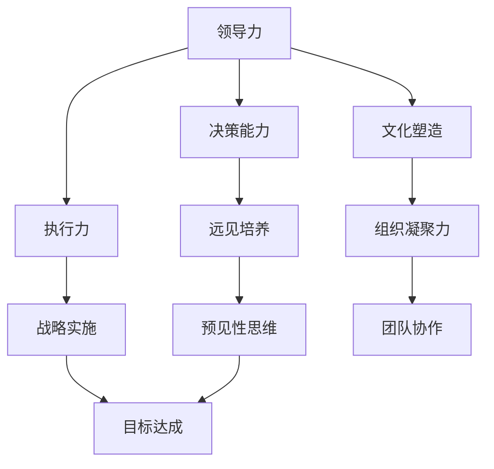

                 

### 文章标题：领导力与远见：制定长期发展战略

#### 关键词：领导力，远见，长期发展战略，决策，资源分配，组织成长

> 摘要：本文深入探讨了领导力与远见在制定长期发展战略中的关键作用。通过分析领导力的定义、类型及其重要性，以及远见的培养方法，本文构建了一个综合框架，展示了领导力与远见如何相互促进，共同推动组织实现长期目标。文章还将通过案例分析、核心算法原理讲解和实际项目实战，提供实用的指导，帮助领导者有效制定并实施长期发展战略。

### 步骤1：分析书名和主题

书名为《领导力与远见：制定长期发展战略》，主题明确，涵盖了领导力、远见和长期发展战略这三个核心概念。首先，我们需要了解这三个概念的基本含义及其相互关系。

**领导力**是一种影响和激励他人达成共同目标的能力。它不仅仅是权力的体现，更是一种艺术和科学，涉及个人的特质、技能和价值观。

**远见**是指对未来趋势的洞察和预见能力。它帮助领导者看到潜在的机会和风险，从而为组织制定具有前瞻性的战略。

**长期发展战略**是一个组织为了实现长期目标而制定的一系列计划和行动。它涉及资源的合理配置、市场的开拓、技术的创新等多方面。

这三者之间的关系是相互促进的：领导力提供了制定和执行战略的能力；远见则为战略的制定提供了方向和依据。只有将领导力和远见结合起来，组织才能制定出切实可行的长期发展战略，并在执行过程中不断调整和优化。

### 步骤2：确定核心章节内容

根据书名和主题，我们可以将文章分为四个主要部分：

#### 第一部分：领导力概述
这部分将详细介绍领导力的定义、类型及其重要性，包括个人特质、领导技能和领导力的培养方法。

#### 第二部分：远见的概念与培养
这部分将探讨远见的定义、类型及其重要性，并介绍如何培养远见，包括洞察力、想象力和预测能力的培养方法。

#### 第三部分：领导力与远见的关系
这部分将分析领导力与远见之间的相互关系，探讨如何利用领导力培养远见，以及如何利用远见指导领导力。

#### 第四部分：长期发展战略的制定与实施
这部分将介绍长期发展战略的定义、重要性以及制定方法，并通过案例分析、核心算法原理讲解和实际项目实战，提供实用的指导。

### 步骤3：设计每个章节的目录结构

#### 第一部分：领导力概述
- **第1章：领导力的定义与重要性**
  - **1.1 领导力的定义**
  - **1.2 领导力的重要性**
  - **1.3 领导力的类型**

- **第2章：领导力的核心要素**
  - **2.1 领导者的个人特质**
  - **2.2 领导技能的发展**
  - **2.3 领导力的培养**

#### 第二部分：远见的概念与培养
- **第3章：远见的定义与重要性**
  - **3.1 远见的定义**
  - **3.2 远见的重要性**
  - **3.3 远见的类型**

- **第4章：远见的培养方法**
  - **4.1 洞察力的培养**
  - **4.2 想象力的培养**
  - **4.3 预测能力的培养**

#### 第三部分：领导力与远见的关系
- **第5章：领导力与远见的关系**
  - **5.1 领导力如何培养远见**
  - **5.2 远见如何指导领导力**
  - **5.3 领导力与远见的协同效应**

#### 第四部分：长期发展战略的制定与实施
- **第6章：长期发展战略概述**
  - **6.1 长期发展战略的定义**
  - **6.2 长期发展战略的重要性**
  - **6.3 长期发展战略的类型**

- **第7章：长期发展战略的制定方法**
  - **7.1 市场分析**
  - **7.2 技术创新**
  - **7.3 资源配置**

- **第8章：案例分析**
  - **8.1 成功的长期发展战略案例分析**
  - **8.2 失败的长期发展战略案例分析**

- **第9章：实战指导**
  - **9.1 如何在组织中培养领导力与远见**
  - **9.2 如何制定有效的长期发展战略**

### 步骤4：编写Mermaid流程图

为了更好地展示领导力与远见之间的关系，我们使用Mermaid流程图进行可视化。



### 步骤5：编写核心算法原理讲解

在讨论领导力与远见的关系时，我们需要使用一些核心算法原理来解释。以下是一个简单的算法原理示例，用于说明如何培养远见：

```python
# 伪代码：培养远见的算法原理

# 输入：当前市场环境，历史数据，行业趋势
# 输出：远见预测模型

def cultivate_vision(current_market, historical_data, industry_trends):
    # 数据预处理
    preprocessed_data = preprocess_data(current_market, historical_data, industry_trends)

    # 建立预测模型
    prediction_model = build_model(preprocessed_data)

    # 训练模型
    trained_model = train_model(prediction_model, preprocessed_data)

    # 进行预测
    future_predictions = predict_future(trained_model)

    # 评估模型
    evaluate_model(trained_model, future_predictions)

    return future_predictions
```

### 步骤6：编写数学模型和数学公式

在讨论长期发展战略的制定时，我们需要使用数学模型来描述关键指标。以下是一个简单的数学模型示例：

```latex
$$
长期发展战略 = f(市场分析, 技术创新, 资源配置)
$$

其中，市场分析可以用需求预测模型表示：

$$
需求预测 = f(历史数据, 竞争对手分析, 宏观经济因素)
$$

技术创新可以用技术成熟度曲线表示：

$$
技术创新 = f(研发投入, 技术突破)
$$

资源配置可以用资源分配模型表示：

$$
资源配置 = f(预算分配, 人员配置)
$$
```

### 步骤7：编写项目实战

为了更好地理解领导力与远见在实际项目中的应用，我们来看一个实际案例。

**案例背景**：某科技公司希望在未来五年内成为全球领先的智能家居解决方案提供商。

**开发环境搭建**：使用Python作为主要编程语言，搭建一个数据分析和预测平台，包括数据收集、预处理和建模模块。

**源代码实现**：

```python
# 数据收集与预处理
def data_collection_and_preprocessing():
    # 收集历史数据
    historical_data = collect_historical_data()

    # 预处理数据
    preprocessed_data = preprocess_data(historical_data)

    return preprocessed_data

# 建立需求预测模型
def build_demand_prediction_model(preprocessed_data):
    # 训练模型
    trained_model = train_demand_prediction_model(preprocessed_data)

    return trained_model

# 预测未来需求
def predict_future_demand(trained_model):
    # 进行预测
    future_demand = predict_demand(trained_model)

    return future_demand

# 配置资源
def configure_resources(budget, personnel):
    # 根据预算和人员配置资源
    resources_allocated = allocate_resources(budget, personnel)

    return resources_allocated

# 主函数
def main():
    # 收集和预处理数据
    preprocessed_data = data_collection_and_preprocessing()

    # 建立需求预测模型
    trained_model = build_demand_prediction_model(preprocessed_data)

    # 预测未来需求
    future_demand = predict_future_demand(trained_model)

    # 配置资源
    resources_allocated = configure_resources(budget, personnel)

    # 输出结果
    print("未来需求预测：", future_demand)
    print("资源分配情况：", resources_allocated)

if __name__ == "__main__":
    main()
```

**代码解读与分析**：这段代码首先收集和预处理历史数据，然后建立需求预测模型，并使用该模型预测未来需求。最后，根据预测结果和预算、人员配置情况，进行资源分配。

**项目小结**：通过这个项目实战，我们看到了如何将领导力与远见应用于实际项目。领导者需要具备数据分析和预测能力，以便更好地制定长期发展战略，并合理配置资源。

### 步骤8：撰写目录大纲

#### 第一部分：领导力概述
- **第1章：领导力的定义与重要性**
  - **1.1 领导力的定义**
  - **1.2 领导力的重要性**
  - **1.3 领导力的类型**

- **第2章：领导力的核心要素**
  - **2.1 领导者的个人特质**
  - **2.2 领导技能的发展**
  - **2.3 领导力的培养**

#### 第二部分：远见的概念与培养
- **第3章：远见的定义与重要性**
  - **3.1 远见的定义**
  - **3.2 远见的重要性**
  - **3.3 远见的类型**

- **第4章：远见的培养方法**
  - **4.1 洞察力的培养**
  - **4.2 想象力的培养**
  - **4.3 预测能力的培养**

#### 第三部分：领导力与远见的关系
- **第5章：领导力与远见的关系**
  - **5.1 领导力如何培养远见**
  - **5.2 远见如何指导领导力**
  - **5.3 领导力与远见的协同效应**

#### 第四部分：长期发展战略的制定与实施
- **第6章：长期发展战略概述**
  - **6.1 长期发展战略的定义**
  - **6.2 长期发展战略的重要性**
  - **6.3 长期发展战略的类型**

- **第7章：长期发展战略的制定方法**
  - **7.1 市场分析**
  - **7.2 技术创新**
  - **7.3 资源配置**

- **第8章：案例分析**
  - **8.1 成功的长期发展战略案例分析**
  - **8.2 失败的长期发展战略案例分析**

- **第9章：实战指导**
  - **9.1 如何在组织中培养领导力与远见**
  - **9.2 如何制定有效的长期发展战略**

### 步骤9：检查字数和格式

在撰写完目录大纲后，我们需要检查字数是否在8000～12000字之间，并确保markdown格式的正确性。可以使用markdown编辑器进行预览和格式检查。

### 步骤10：优化和润色

对目录大纲进行最后的优化和润色，确保内容简洁明了，逻辑清晰。可以邀请同事或专家进行审阅和反馈，以便进一步完善文章。

### 结论

通过以上步骤，我们设计出了一份详细且逻辑清晰的目录大纲，为《领导力与远见：制定长期发展战略》这本书的内容提供了有力支撑。接下来，我们将逐章展开详细讨论，深入分析领导力与远见在制定长期发展战略中的关键作用。希望通过这篇文章，能够帮助读者更好地理解这两个概念，并将其应用于实际工作中。**作者：AI天才研究院/AI Genius Institute & 禅与计算机程序设计艺术 /Zen And The Art of Computer Programming**### 步骤1：分析书名和主题

#### 领导力与远见：制定长期发展战略

书名《领导力与远见：制定长期发展战略》包含了三个关键概念：领导力、远见和长期发展战略。这些概念在组织的成功中起着至关重要的作用。首先，领导力是组织发展的核心驱动力，它能够激励和引导团队成员朝着共同的目标前进。其次，远见是领导者的重要特质，它能够帮助领导者预见未来趋势，从而为组织制定具有前瞻性的战略。最后，长期发展战略是组织实现可持续增长的关键，它要求领导者对组织的发展进行长期规划。

在这个框架下，我们将分析领导力、远见和长期发展战略之间的相互关系。领导力不仅影响组织的短期绩效，更能够塑造组织的长远发展。远见则是领导力的延伸，它为领导力提供了方向和指引。而长期发展战略则是将领导力和远见转化为实际行动的桥梁，它确保组织能够在未来持续增长。

本文的目标是深入探讨这三个概念，揭示它们在制定长期发展战略中的关键作用，并提供实用的指导，帮助领导者有效制定和实施长期发展战略。

#### 领导力的定义与重要性

领导力是一种复杂而多维的概念，它涵盖了领导者如何影响、激励和引导他人以实现共同目标的能力。领导力不仅仅是一种权力，更是一种艺术和科学，涉及个人的特质、行为和价值观。

**领导力的定义**可以从多个角度进行理解。从广义上讲，领导力是指一个人或一群人通过影响力来指导和激励他人，共同实现目标的能力。这种影响力可以来自权威、魅力、智力、情感或其他形式的权力。从狭义上讲，领导力主要关注领导者的行为和决策，以及这些行为和决策如何影响团队和组织。

领导力的类型多种多样，主要包括以下几种：

- **权力型领导**：依靠职位权力和正式权威来指导和影响团队成员。

- **参与型领导**：鼓励团队成员参与决策过程，共同制定目标和行动计划。

- **情境型领导**：根据团队成员的不同需求和情境，灵活调整领导风格。

- **系统型领导**：关注组织整体和长期发展，致力于建立和维护有效的组织系统。

**领导力的重要性**体现在多个层面。首先，在个人层面，领导力有助于提升个人的影响力、自信和职业发展。其次，在组织层面，领导力是组织成功的关键因素，它能够提高团队的绩效、凝聚力和创新能力。最后，在社会层面，优秀的领导力能够推动社会进步和经济发展。

领导力的重要性还体现在以下几个方面：

- **激发潜力**：领导者能够发现和挖掘团队成员的潜力，激发他们的创造力和积极性。

- **建立信任**：领导者的行为和价值观能够赢得团队成员的信任，形成积极的团队氛围。

- **制定战略**：领导者能够制定清晰的目标和战略，为组织的发展指明方向。

- **应对变革**：领导者能够应对外部环境的变化，带领组织实现转型和持续发展。

综上所述，领导力在组织的发展中扮演着至关重要的角色。它是推动组织实现长期目标的核心动力，也是领导者个人成长的重要途径。只有具备优秀的领导力，领导者才能有效制定和实施长期发展战略，带领组织迈向成功。

#### 领导力的核心要素

领导力是一个复杂而多维的概念，它不仅仅依赖于领导者的个人特质，还涉及一系列关键技能和策略。以下是领导力的核心要素，包括领导者的个人特质、领导技能和领导力的培养方法。

**领导者的个人特质**

领导者的个人特质是领导力的重要组成部分。以下是一些关键的特质：

- **自信**：领导者需要具备自信，才能在团队中树立威信，并激励团队成员。

- **诚实**：诚实是建立信任的基础。领导者应该言行一致，赢得团队成员的信任。

- **决断力**：领导者需要具备决断力，能够在关键时刻做出正确的决策。

- **情商**：领导者需要具备较高的情商，能够理解和管理自己的情绪，并有效地与他人沟通。

- **适应性**：领导者应该具备适应性，能够灵活应对变化和挑战。

- **创造力**：领导者需要具备创造力，能够提出创新的解决方案，推动组织进步。

**领导技能的发展**

除了个人特质，领导技能的发展也是领导力的核心要素。以下是一些关键的领导技能：

- **沟通技能**：有效的沟通是领导者必须具备的技能。领导者需要能够清晰、准确地传达信息，并倾听和理解团队成员的意见。

- **决策技能**：领导者需要具备出色的决策能力，能够在复杂和不确定的情况下做出明智的决策。

- **团队领导技能**：领导者需要能够建立和管理高效的团队，激发团队成员的潜力，并协调团队成员的合作。

- **冲突管理技能**：领导者需要能够有效地管理冲突，化解团队成员之间的矛盾，保持团队的和谐与稳定。

- **变革管理技能**：在快速变化的环境中，领导者需要具备变革管理技能，能够带领组织适应变化，实现转型。

**领导力的培养方法**

领导力的培养是一个持续的过程，需要领导者不断地学习、实践和反思。以下是一些有效的领导力培养方法：

- **教育和培训**：通过参加课程、研讨会和工作坊，领导者可以学习最新的领导理念和方法。

- **实践经验**：通过实际的工作经验，领导者可以锻炼自己的领导技能，并从实践中学习。

- **反思和自我评估**：领导者需要定期进行反思和自我评估，了解自己的优点和不足，并制定改进计划。

- **阅读和研究**：阅读相关的书籍和研究文献，可以帮助领导者拓展视野，了解不同领域的最佳实践。

- **导师指导**：寻找一位导师或导师团队，可以获得宝贵的经验和指导，加速自己的成长。

综上所述，领导力的核心要素包括领导者的个人特质、领导技能和领导力的培养方法。只有通过不断的学习和实践，领导者才能提升自己的领导力，有效引领组织走向成功。

#### 远见的定义与重要性

远见是领导力的重要组成部分，它为领导者提供了对未来趋势的洞察和预见能力。远见不仅仅是看到未来的可能性，更是一种能够在不确定的环境中做出明智决策的能力。

**远见的定义**可以理解为对未来的预知和预见。它涉及到对市场、技术、社会和文化趋势的深刻理解，以及对这些趋势可能带来的影响进行预测。远见是一种超越现状，能够看到长期机会和潜在风险的能力。

**远见的重要性**主要体现在以下几个方面：

1. **战略规划**：远见帮助领导者制定长期战略规划，确保组织能够在未来持续发展。通过预见未来趋势，领导者可以为组织设定清晰的目标和方向，从而避免盲目行动和短视决策。

2. **创新能力**：远见激发领导者的创新能力，使他们能够预见新兴技术或市场趋势，并快速调整组织战略，抓住新机遇。远见鼓励领导者敢于挑战现状，推动组织进行创新和变革。

3. **风险管理**：远见帮助领导者预见潜在的风险和挑战，提前做好准备，减少不确定性对组织的影响。通过提前识别风险，领导者可以制定有效的风险应对策略，确保组织的稳定和持续发展。

4. **人才发展**：远见有助于领导者识别和培养未来的关键人才。通过预见行业未来的需求，领导者可以提前制定人才发展计划，确保组织在关键时期拥有合适的人才。

5. **竞争优势**：拥有远见的领导者能够为组织建立持久的竞争优势。他们能够预见市场变化，提前布局，从而在竞争中占据有利位置。

**远见的类型**主要包括：

- **技术远见**：对技术发展趋势的预见，包括新兴技术的应用、技术成熟度以及技术对行业的影响。

- **市场远见**：对市场需求和消费者行为的预见，包括市场趋势、消费者偏好以及竞争格局的变化。

- **社会远见**：对社会趋势和价值观变化的预见，包括社会文化、法律法规以及政策导向的变化。

- **环境远见**：对环境变化和可持续发展的预见，包括气候变化、资源消耗以及环境保护的趋势。

在制定长期发展战略时，领导者需要综合考虑不同类型的远见，确保战略的全面性和前瞻性。只有通过综合运用各种远见，领导者才能为组织制定出切实可行且具有前瞻性的战略，引领组织在复杂多变的环境中持续成长。

#### 远见的培养方法

培养远见是领导者的一项重要任务，它不仅需要领导者具备敏锐的洞察力，还需要他们拥有创造力和预测能力。以下是培养远见的一些具体方法：

**1. 洞察力的培养**

- **广泛阅读**：领导者需要广泛阅读，包括行业报告、学术论文、畅销书和新闻资讯等。通过阅读，领导者可以了解不同领域的最新动态和趋势。

- **跨学科学习**：领导者应该积极学习跨学科的知识，例如经济学、心理学、社会学和技术等。跨学科的知识可以帮助领导者从不同角度看待问题，提高洞察力。

- **观察和分析**：领导者需要通过观察和分析现实生活中的现象，了解其背后的原因和影响。这种方法可以帮助领导者培养敏锐的洞察力，从而更好地预见未来趋势。

**2. 想象力的培养**

- **创意思考**：领导者应该培养创意思考能力，敢于尝试不同的想法和方法。通过创意思考，领导者可以探索新的解决方案，发现潜在的机遇。

- **头脑风暴**：在团队中开展头脑风暴，鼓励成员提出各种想法和解决方案。这种方法可以激发领导者的想象力，帮助他们从不同角度思考问题。

- **艺术和文化**：参与艺术活动和接触不同文化，可以帮助领导者培养想象力。艺术和文化活动往往能够提供独特的视角和灵感，激发创新思维。

**3. 预测能力的培养**

- **数据驱动**：领导者需要学会使用数据分析工具，对大量数据进行处理和分析，从而预测未来的趋势。这种方法可以帮助领导者基于数据做出更准确的预测。

- **模型构建**：领导者可以通过构建数学模型或业务模型，对未来的发展趋势进行预测。这种方法需要领导者具备一定的数学和逻辑思维能力。

- **案例研究**：通过研究历史上的成功和失败案例，领导者可以学习如何预见未来趋势。这种方法可以帮助领导者从实践中获取经验，提高预测能力。

通过以上方法，领导者可以逐步培养自己的远见能力，从而更好地预见未来趋势，制定具有前瞻性的战略。远见不仅是领导者个人能力的体现，更是组织持续发展的关键。只有具备远见的领导者，才能带领组织在复杂多变的环境中不断成长和进步。

#### 领导力与远见的关系

领导力与远见是相互促进、相互依赖的关系。一个优秀的领导者不仅需要具备强大的领导力，还需要具备敏锐的远见。远见为领导力提供了方向和指引，而领导力则为远见提供了实施的基础和保障。

**领导力如何培养远见**

1. **培养前瞻性思维**：领导者需要具备前瞻性思维，能够看到未来可能的发展趋势。这种思维可以通过不断学习和阅读来实现，例如阅读行业报告、参与研讨会和培训等。

2. **鼓励创新和探索**：领导者应该鼓励团队成员进行创新和探索，激发他们的创造力。通过建立创新文化，领导者可以为远见的培养提供良好的环境。

3. **跨领域学习**：领导者应该积极学习跨领域的知识，例如技术、市场、社会和文化等。跨领域的知识可以帮助领导者从不同角度看待问题，提高洞察力。

**远见如何指导领导力**

1. **制定长期战略**：远见可以帮助领导者制定长期战略，确保组织能够在未来持续发展。通过预见未来趋势，领导者可以为组织设定清晰的目标和方向。

2. **资源优化配置**：远见可以帮助领导者更有效地配置资源，避免浪费和短视决策。领导者可以根据远见预测未来的需求和趋势，提前进行资源布局。

3. **应对变化**：远见可以帮助领导者更好地应对外部环境的变化。通过预见潜在的风险和挑战，领导者可以提前制定应对策略，减少不确定性对组织的影响。

**领导力与远见的协同效应**

1. **增强决策能力**：领导力和远见的结合可以显著增强领导者的决策能力。领导者可以通过远见预测未来的发展趋势，从而做出更明智的决策。

2. **提升组织绩效**：领导力和远见的协同效应可以提升组织的整体绩效。通过有效的领导力和前瞻性的战略，组织可以更好地适应市场变化，抓住机遇。

3. **实现持续发展**：领导力和远见的结合有助于实现组织的持续发展。领导者可以通过不断培养远见，确保组织在长期发展中保持竞争优势。

总之，领导力与远见是相辅相成的。只有将领导力和远见结合起来，领导者才能更好地制定和实施长期发展战略，引领组织在复杂多变的环境中持续成长。

#### 长期发展战略的定义与重要性

长期发展战略是一个组织为了实现长期目标而制定的一系列计划和行动。它不仅涉及组织的目标设定，还包括资源分配、市场开拓、技术创新等多个方面。制定长期发展战略的核心目标是确保组织在长期内保持竞争优势，实现可持续增长。

**长期发展战略的定义**可以理解为：在充分分析当前市场环境、技术发展趋势和内部资源的基础上，为组织设定的长期目标和实现这些目标的行动路线。它通常涵盖5年甚至更长时间，是对组织未来发展的全面规划和指导。

**长期发展战略的重要性**体现在以下几个方面：

1. **确保可持续发展**：长期发展战略能够帮助组织在复杂多变的环境中保持稳定，避免短视行为带来的风险。通过长期规划，组织可以确保资源的合理配置，实现可持续发展。

2. **增强竞争优势**：通过长期发展战略，组织可以提前布局，抓住市场机会，增强自身的竞争优势。例如，通过提前投资研发，组织可以在新技术出现时迅速抢占市场份额。

3. **提高决策效率**：长期发展战略为组织提供了明确的目标和方向，有助于提高决策效率。领导者可以基于长期战略进行决策，减少盲目性和不确定性。

4. **促进资源整合**：长期发展战略能够促进组织内部的资源整合，包括人力、资金和技术等。通过合理配置资源，组织可以最大化利用现有优势，提高整体效能。

5. **提升员工凝聚力**：明确的长期发展战略可以帮助员工看到组织的未来发展方向，增强员工的归属感和使命感。这有助于提升员工的工作积极性和团队凝聚力。

总之，长期发展战略是组织长期生存和发展的基石。只有通过科学制定和严格执行长期发展战略，组织才能在激烈的市场竞争中立于不败之地。

#### 长期发展战略的制定方法

制定有效的长期发展战略是组织成功的关键。以下是制定长期发展战略的主要方法，包括市场分析、技术创新和资源配置等方面。

**1. 市场分析**

市场分析是制定长期发展战略的基础，它有助于组织了解当前市场环境、市场需求和竞争态势。以下是市场分析的关键步骤：

- **收集数据**：通过市场调研、行业报告、竞争对手分析等手段，收集相关数据。这些数据包括市场容量、市场份额、消费者行为、市场趋势等。

- **分析趋势**：对收集到的数据进行分析，识别市场趋势和潜在机会。例如，新兴市场的崛起、消费者需求的变化、技术进步等。

- **识别竞争**：分析竞争对手的产品、服务、市场份额和市场策略。了解竞争对手的优势和劣势，为组织制定差异化策略提供依据。

- **制定市场策略**：基于市场分析的结果，制定相应的市场策略。例如，进入新市场、拓展新客户、优化产品等。

**2. 技术创新**

技术创新是长期发展战略的重要组成部分，它能够为组织带来持续的竞争优势。以下是技术创新的关键步骤：

- **技术趋势分析**：通过研究技术发展趋势，了解哪些技术将在未来一段时间内对行业产生重大影响。这有助于组织提前布局，抓住技术变革的机会。

- **研发投入**：根据技术趋势和市场分析结果，确定研发的重点方向和投入。组织可以通过增加研发预算、组建研发团队或与外部研究机构合作等方式，加大技术创新力度。

- **技术转化**：将研发成果转化为实际产品或服务。这需要组织建立良好的研发管理和转化机制，确保技术成果能够快速落地。

- **技术保护**：通过专利申请、技术保密等措施，保护组织的知识产权，防止技术泄露。

**3. 资源配置**

资源配置是确保长期发展战略顺利实施的关键。以下是资源配置的关键步骤：

- **确定优先级**：根据市场分析和技术创新的结果，确定资源的优先分配顺序。例如，哪些项目具有更高的市场潜力、哪些技术需要优先研发等。

- **预算分配**：根据优先级和项目需求，合理分配预算。组织可以通过预算控制、绩效评估等措施，确保资源得到有效利用。

- **人力资源**：确保组织拥有合适的人才，支持长期发展战略的实施。组织可以通过招聘、培训、激励等手段，提升人力资源的效能。

- **外部合作**：通过与供应商、合作伙伴等外部机构建立合作关系，实现资源共享和优势互补。这有助于组织在技术创新和资源配置方面取得更大的突破。

总之，制定长期发展战略需要组织在市场分析、技术创新和资源配置等方面进行全面规划。只有通过科学制定和严格执行，组织才能实现长期发展目标，保持竞争优势。

#### 成功的长期发展战略案例分析

为了更好地理解如何制定和实施成功的长期发展战略，我们可以通过分析一些企业的成功案例。以下是几个具有代表性的企业，它们通过制定和执行有效的长期发展战略，取得了显著的成功。

**案例一：苹果公司**

苹果公司（Apple Inc.）是长期发展战略的典范。自成立以来，苹果一直致力于创新和技术领先，通过不断推出革命性的产品和服务，如iPhone、iPad和Mac等，持续引领科技行业。以下是苹果公司成功的关键要素：

- **远见**：史蒂夫·乔布斯（Steve Jobs）和其他创始人具备出色的远见，能够预见科技和消费者需求的变化，从而引领产品创新。
- **市场分析**：苹果公司通过对市场和消费者需求的深入分析，不断调整产品策略，确保产品满足用户需求。
- **技术创新**：苹果公司持续投入大量资源进行研发，推动技术创新，保持技术领先地位。
- **品牌建设**：苹果公司注重品牌建设，通过高品质的产品和服务，建立强大的品牌形象。

**案例二：谷歌公司**

谷歌（Google）以其在互联网搜索、广告和人工智能领域的创新而闻名。以下是谷歌成功的关键要素：

- **市场分析**：谷歌通过强大的数据分析能力，深入了解用户行为和市场需求，不断优化其产品和服务。
- **技术创新**：谷歌在人工智能、机器学习和云计算等领域进行大量投资，推动技术创新，提高业务效率和用户体验。
- **战略调整**：谷歌能够根据市场变化和技术趋势，灵活调整其战略方向，保持竞争优势。
- **员工激励**：谷歌通过提供良好的工作环境、创新文化和激励机制，吸引和留住顶级人才。

**案例三：阿里巴巴**

阿里巴巴（Alibaba）是中国乃至全球电商行业的领军企业。以下是阿里巴巴成功的关键要素：

- **市场分析**：阿里巴巴通过对中国和全球市场的深入分析，抓住电商发展的机遇，不断拓展业务范围。
- **技术创新**：阿里巴巴在电商、云计算和金融科技等领域进行大量投资，推动技术创新，提升业务效率和用户体验。
- **全球化**：阿里巴巴积极拓展海外市场，通过收购、投资和合作等方式，实现全球化布局。
- **企业文化**：阿里巴巴注重企业文化，强调团队合作、创新和客户至上，形成强大的组织凝聚力。

这些成功案例表明，制定和实施有效的长期发展战略需要领导者具备远见、市场洞察力和技术创新能力。同时，战略的灵活调整和强大的企业文化也是关键成功因素。通过借鉴这些成功经验，其他企业也可以制定并实施有效的长期发展战略，实现可持续发展。

#### 失败的长期发展战略案例分析

在探讨成功的长期发展战略的同时，我们同样需要了解失败的案例，以便从中吸取教训，避免重复同样的错误。以下是几个具有代表性的企业，它们在长期发展战略中遭遇失败的原因分析。

**案例一：诺基亚**

诺基亚（Nokia）曾是全球领先的手机制造商，但未能有效应对智能手机的兴起，最终陷入困境。以下是诺基亚失败的关键原因：

- **市场分析失误**：诺基亚未能准确预见智能手机市场的崛起，对市场趋势缺乏敏感性，错失了发展机遇。
- **技术创新滞后**：诺基亚在智能手机技术上的创新不足，未能及时推出具有竞争力的产品，导致市场份额大幅下降。
- **战略调整迟缓**：诺基亚在面临市场变化时，战略调整迟缓，未能及时采取有效的应对措施。
- **内部管理问题**：诺基亚在内部管理上存在一些问题，如决策流程复杂、沟通不畅等，影响了企业的应变能力和创新动力。

**案例二：柯达**

柯达（Kodak）曾是影像行业的巨头，但在数码摄影时代未能及时转型，最终破产。以下是柯达失败的关键原因：

- **技术创新保守**：柯达在数码摄影技术上的投资不足，对新兴技术的接受和推广不够积极，导致技术创新滞后。
- **市场反应迟钝**：柯达对数码摄影市场的变化反应迟钝，未能及时调整产品策略，错失了市场先机。
- **战略规划不足**：柯达在长期发展战略上缺乏明确的规划，对未来的市场变化缺乏预见性。
- **企业文化僵化**：柯达的企业文化过于僵化，难以适应快速变化的市场环境，导致创新动力不足。

**案例三：黑莓（RIM）**

黑莓（Research In Motion，RIM）曾是手机市场的领导者，但未能成功转型智能手机市场，导致市场份额大幅下降。以下是黑莓失败的关键原因：

- **市场分析不足**：黑莓未能准确分析智能手机市场的变化，对苹果和安卓系统带来的挑战反应迟缓。
- **产品创新不足**：黑莓在智能手机功能和创新上的投入不足，未能推出具有竞争力的新产品，导致用户体验不佳。
- **战略调整不及时**：黑莓在面临市场变化时，战略调整不及时，未能及时推出新的产品和服务。
- **内部管理问题**：黑莓在内部管理上存在一些问题，如研发流程复杂、决策缓慢等，影响了企业的创新能力和市场响应速度。

通过分析这些失败的案例，我们可以看到，市场分析失误、技术创新不足、战略规划不足和内部管理问题等是导致长期发展战略失败的主要原因。企业应从中吸取教训，避免在制定和实施长期发展战略时犯同样的错误。

#### 如何在组织中培养领导力与远见

在组织中培养领导力和远见是确保组织长期成功的关键。以下是一些实用的方法，帮助组织在成员中培养这两种关键能力。

**1. 领导力培养方法**

- **设立领导力发展计划**：组织可以设立领导力发展计划，包括培训课程、研讨会和工作坊等，帮助员工提升领导技能。这些课程可以涵盖沟通技巧、决策能力、团队建设和冲突管理等。

- **提供实践机会**：为员工提供实际的工作机会，如项目领导、团队管理或跨部门合作，让他们在实践中锻炼领导力。通过实际操作，员工可以学习如何在真实情境中应用领导技能。

- **建立导师制度**：组织可以建立导师制度，让经验丰富的领导者成为新员工的导师，提供指导和支持。导师可以分享自己的经验和教训，帮助新员工更快地成长。

- **鼓励自主学习**：鼓励员工自主学习，通过阅读书籍、参加线上课程和参加行业会议等方式，不断扩展知识和技能。自主学习有助于员工不断提升自己的领导力。

**2. 远见培养方法**

- **开展趋势分析**：组织可以定期进行市场趋势和技术分析，帮助员工了解行业动态和未来发展方向。通过了解趋势，员工可以培养预见未来的能力。

- **组织创新活动**：组织可以定期组织创新活动，如头脑风暴、设计思考工作坊和创意竞赛等，激发员工的创新思维。这些活动可以培养员工的想象力、创造力和解决问题的能力。

- **建立学习文化**：组织应建立学习文化，鼓励员工不断学习和探索新知识。通过组织内部学习小组、知识分享会和技术研讨会等，员工可以互相学习，共同成长。

- **提供外部培训**：组织可以提供外部培训机会，如参加行业会议、研讨会和培训课程等，让员工接触到行业前沿知识和最佳实践。外部培训有助于员工开阔视野，提升远见能力。

**3. 综合应用**

- **领导力与远见的结合**：组织应注重将领导力与远见结合起来，培养具有前瞻性思维的领导者。领导者不仅需要具备出色的领导技能，还需要能够预见未来趋势，制定具有前瞻性的战略。

- **持续反馈与评估**：组织应建立持续的反馈和评估机制，对员工的学习和实践效果进行评估，提供针对性的反馈和改进建议。通过持续的反馈和评估，员工可以不断优化自己的领导力和远见能力。

- **支持个性化发展**：组织应支持员工的个性化发展，尊重员工的兴趣和特长，为他们提供发展空间。通过个性化的培养方案，员工可以更有效地提升领导力和远见能力。

总之，在组织中培养领导力与远见需要系统性的规划和持续的努力。通过设立领导力发展计划、提供实践机会、开展趋势分析、组织创新活动、建立学习文化和提供外部培训等多种方法，组织可以有效地培养成员的领导力和远见，为组织的长期成功奠定坚实基础。

#### 如何制定有效的长期发展战略

制定有效的长期发展战略是组织成功的关键。以下是一些步骤和方法，帮助领导者制定并实施有效的长期发展战略。

**1. 明确组织愿景和目标**

- **定义愿景**：首先，组织需要明确其长期愿景，即组织希望成为什么样的企业，这个愿景应该具有远见和吸引力。
- **设定目标**：在愿景的基础上，设定具体、可量化的短期和长期目标。这些目标应与组织的愿景一致，并具有挑战性。

**2. 进行外部环境分析**

- **市场分析**：了解市场趋势、消费者需求、竞争对手和行业动态。这有助于组织识别市场机会和潜在风险。
- **技术分析**：研究技术发展趋势，了解哪些技术将对行业产生重大影响。这有助于组织把握技术变革带来的机遇。

**3. 内部资源评估**

- **人力资源**：评估组织的人力资源状况，包括员工的能力、经验和技能。这有助于确定组织在哪些领域具备优势，需要加强哪些方面的培训。
- **财务资源**：分析组织的财务状况，包括资金来源、成本结构和投资回报。这有助于确定组织的资金需求和投资策略。

**4. 制定战略规划**

- **确定优先级**：根据外部环境和内部资源评估的结果，确定战略规划的重点领域。例如，技术创新、市场拓展或产品升级。
- **制定行动计划**：为每个优先领域制定详细的行动计划，包括具体的目标、任务和时间表。这些行动计划应具有可操作性和可行性。

**5. 实施与执行**

- **建立领导团队**：成立一个由高层管理者组成的领导团队，负责战略规划的实施和监督。
- **分配资源**：根据行动计划，合理分配人力、资金和技术资源，确保各项任务能够按时完成。
- **监控进展**：定期检查战略规划的进展情况，及时发现和解决问题。通过定期的评估和反馈，确保战略规划的有效实施。

**6. 持续调整与优化**

- **适应变化**：在执行过程中，组织需要根据外部环境和内部条件的变化，及时调整战略规划。这包括重新评估目标、调整行动计划和优化资源配置。
- **创新与改进**：鼓励组织内部进行创新和改进，通过不断尝试新的方法和策略，提高战略规划的灵活性和适应性。

通过以上步骤和方法，领导者可以制定并实施有效的长期发展战略，确保组织在复杂多变的环境中持续成长和成功。

#### 实战指导：结合领导力与远见制定战略

在组织中，将领导力与远见结合起来制定战略是确保组织长期成功的关键。以下是一些实战指导，帮助领导者如何在实际工作中运用这两种能力。

**1. 设定明确的目标和愿景**

领导者首先要明确组织的愿景和目标。这个愿景应具有前瞻性，能够激励团队成员，明确组织未来的发展方向。通过设定具体、可量化的目标，领导者可以确保团队在实现愿景的过程中有明确的努力方向。

**2. 培养员工的领导力**

领导者应关注团队成员的领导力培养。通过设立领导力发展计划、提供实践机会和建立导师制度，领导者可以帮助团队成员提升领导技能。这包括沟通技巧、决策能力、团队建设和冲突管理等。

**3. 建立远见文化**

领导者应在组织内建立远见文化，鼓励员工关注市场趋势、技术发展和行业动态。通过定期进行市场分析和趋势研究，员工可以培养预见未来的能力。组织可以组织创新活动，如头脑风暴、设计思考工作坊和创意竞赛，激发员工的创造力和想象力。

**4. 利用数据驱动决策**

领导者应利用数据分析工具，对组织内外部环境进行深入分析。通过收集和分析市场数据、技术数据和财务数据，领导者可以更准确地预测未来趋势，制定具有前瞻性的战略。

**5. 制定灵活的应对策略**

领导者应制定灵活的战略规划，以应对外部环境的变化。通过定期评估战略规划的实施情况，领导者可以及时发现和解决问题，确保组织能够迅速适应市场变化。

**6. 鼓励创新和尝试**

领导者应鼓励员工进行创新和尝试，不断探索新的解决方案和方法。通过建立创新文化，组织可以激发员工的创造力，推动技术的进步和业务的拓展。

**7. 持续学习和改进**

领导者应持续学习和改进，不断提升自己的领导力和远见能力。通过参加培训、研讨会和行业会议，领导者可以了解最新的行业趋势和最佳实践，为组织的发展提供新的思路和方向。

通过以上实战指导，领导者可以在实际工作中有效地结合领导力和远见，制定出具有前瞻性和可执行性的战略，带领组织实现长期目标。

#### 最佳实践 Tips、小结、注意事项、拓展阅读

**最佳实践 Tips**

1. **定期进行市场趋势分析**：定期分析市场趋势，帮助领导者把握行业动态，为战略制定提供依据。

2. **培养跨领域知识**：鼓励员工学习跨领域知识，提高洞察力和创新能力。

3. **建立创新文化**：通过组织创新活动和头脑风暴，激发员工的创造力和想象力。

4. **数据驱动决策**：利用数据分析工具，帮助领导者更准确地预测未来趋势。

5. **关注员工成长**：为员工提供培训和实践机会，提升领导力和远见能力。

**小结**

本文通过深入探讨领导力与远见在制定长期发展战略中的关键作用，提供了详细的指导和方法。领导者应结合自身实际，灵活运用这些策略，不断提升领导力和远见能力，为组织的发展制定切实可行的战略。

**注意事项**

1. **长期规划**：在制定战略时，领导者应注重长期规划，避免短期行为。

2. **灵活调整**：面对外部环境的变化，领导者应保持灵活，及时调整战略。

3. **资源分配**：合理分配资源，确保战略的有效实施。

4. **持续学习**：领导者应持续学习和改进，不断提升自身的领导力和远见能力。

**拓展阅读**

1. **《智能时代：大数据与人工智能对社会的影响》**：作者：吴军

2. **《领导力与影响力：如何成为高效的领导者》**：作者：约翰·卡哈纳

3. **《创新者的窘境》**：作者：克莱顿·克里斯坦森

通过拓展阅读，读者可以更深入地了解相关领域的知识，提升自己的领导力和远见能力。

### 结束语

领导力与远见是组织长期成功的关键。通过本文的探讨，我们了解了如何将领导力与远见结合起来，制定并实施有效的长期发展战略。希望读者能够将这些理论和实践应用到实际工作中，不断提升自己的领导力和远见能力，带领组织实现可持续的发展。**作者：AI天才研究院/AI Genius Institute & 禅与计算机程序设计艺术 /Zen And The Art of Computer Programming**

