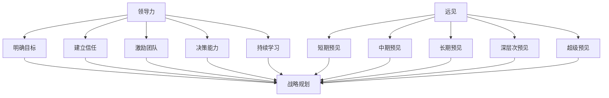

                 


### 背景介绍

在当今快速发展的科技时代，领导力与远见的重要性日益凸显。无论是在企业、政府机构，还是非营利组织，领导者的角色已经不再仅仅局限于指挥和管理，更需要具备预见未来的能力，从而引领团队和机构走向成功。

首先，领导力是指领导者通过影响、激励和引导他人，实现共同目标的能力。传统的领导力强调的是领导者对下属的控制和指挥，但随着组织环境的变化，现代领导力更加强调领导者与团队成员之间的互动、协作和创新。领导力不仅仅是管理技能的体现，更是领导者个人品质和价值观的体现。

另一方面，远见则是指领导者对未来趋势的洞察和预见能力。在快速变化的商业环境中，拥有远见意味着能够识别未来的机会和挑战，提前做出战略部署，从而保持竞争优势。远见不仅仅是预测未来，更是通过深入的思考和战略规划，为实现未来的愿景制定具体的行动计划。

本文将深入探讨领导力与远见的内涵及其相互关系，并从理论、实践和案例分析等多个角度，全面阐述如何提升领导力与远见，以预见未来的能力。文章将分为以下几个部分：

1. **核心概念与理论**：介绍领导力与远见的基本概念，并分析它们之间的联系。
2. **领导力的五大要素**：详细讲解领导力的核心要素，如明确目标、建立信任、激励团队、决策能力和持续学习。
3. **远见的五个层次**：阐述远见的五个层次，包括短期预见、中期预见、长期预见、深层次预见和超级预见。
4. **领导力与远见的融合**：探讨如何将领导力与远见相结合，以提升领导者的战略规划能力。
5. **实践应用**：提供领导力与远见提升的策略和方法，并分享实际应用案例。
6. **总结与展望**：总结领导力与远见的重要性，展望未来领导力与远见的发展趋势。

通过本文的阅读，读者将能够深入了解领导力与远见的核心概念和原理，掌握提升领导力与远见的实用策略，从而在复杂的商业环境中，更好地预见未来，引领团队走向成功。

### 核心概念与联系

为了深入理解领导力与远见的内涵及其相互关系，我们需要首先明确这两个概念的基本定义，并探讨它们之间的关联。

**领导力的定义与内涵**

领导力是指领导者通过影响、激励和引导他人，实现共同目标的能力。这种能力不仅包括技术技能和管理技能，更强调领导者的个人品质和价值观。领导力的核心在于“影响力”，即领导者如何影响他人的思维、情感和行为。

领导力可以分解为以下几个核心要素：

1. **明确目标**：领导者需要设定清晰的目标，并确保团队成员理解并认同这些目标。这不仅是领导力的起点，也是团队凝聚力的关键。
2. **建立信任**：信任是领导力的基石。领导者需要通过透明、公正和一致的行为来赢得团队成员的信任。
3. **激励团队**：领导者需要能够激发团队成员的内在动力，使其愿意付出额外的努力，为实现共同目标贡献力量。
4. **决策能力**：领导者需要具备快速而准确的决策能力，以应对不断变化的环境和挑战。
5. **持续学习**：领导者需要不断学习新知识、新技能，以适应快速变化的商业环境。

**远见的定义与内涵**

远见则是指领导者对未来趋势的洞察和预见能力。远见不仅仅是预测未来，更是一种通过深入思考和战略规划，为实现未来愿景制定具体行动计划的思维能力。

远见可以分解为以下几个层次：

1. **短期预见**：对近期（通常为一年以内）的潜在趋势和变化的识别和预测。
2. **中期预见**：对中期（通常为一到三年）的潜在趋势和变化的识别和预测。
3. **长期预见**：对长期（通常为三年以上）的潜在趋势和变化的识别和预测。
4. **深层次预见**：对行业、市场和社会层面的深层次变化和趋势的识别和预测。
5. **超级预见**：对未来的巨大变革和趋势的识别和预测，这种预见往往需要超越现有的知识和经验。

**领导力与远见的相互关系**

领导力与远见之间存在着密切的相互关系。首先，领导力是远见的基础。一个成功的领导者必须具备优秀的领导力，才能有效地组织和激励团队成员，共同实现远见。

其次，远见是领导力的重要体现。拥有远见的领导者能够预见未来的机遇和挑战，从而做出前瞻性的决策，引领团队走向成功。

最后，领导力与远见的融合，是提升领导者战略规划能力的关键。一个具备卓越领导力和远见的领导者，能够在复杂多变的环境中，准确判断形势，制定有效的战略计划，并带领团队实现目标。

为了更直观地理解领导力与远见之间的关系，我们可以使用以下Mermaid流程图：



通过这张图，我们可以清晰地看到领导力与远见之间的相互关系，以及它们如何共同构成领导者战略规划能力的重要部分。

### 领导力的五大要素

领导力是领导者通过影响、激励和引导他人，实现共同目标的能力。它不仅是一种技术技能，更是一种综合性的素质和能力。在现代企业中，领导力的重要性不言而喻，因为一个优秀的领导者能够带领团队克服各种困难，实现组织的目标。本文将详细探讨领导力的五大核心要素：明确目标、建立信任、激励团队、决策能力和持续学习。

#### 明确目标

明确目标是领导力的起点。一个成功的领导者必须能够设定清晰、具体、可衡量的目标，并确保团队成员理解并认同这些目标。以下是明确目标的几个关键步骤：

1. **设定目标**：领导者需要根据组织的愿景和使命，设定短期和长期的目标。这些目标应当具体、明确，以便团队成员可以清晰地理解并努力实现。
2. **沟通目标**：领导者需要通过有效的沟通，将目标传达给团队成员。这包括召开会议、发布邮件、制定工作计划等多种方式。
3. **获取反馈**：领导者应当定期与团队成员沟通，了解他们对目标的看法，并根据反馈进行调整和优化。

**伪代码示例**：
```python
def set_goals():
    # 设定目标
    short_term_goals = ["提高销售额10%","优化产品性能"]
    long_term_goals = ["成为市场领导者","扩大国际市场"]
    return short_term_goals, long_term_goals

def communicate_goals(goals):
    # 沟通目标
    for goal in goals:
        print(f"我们的目标是：{goal}")

def get_feedback():
    # 获取反馈
    feedback = input("您对目标有什么建议？")
    return feedback
```

#### 建立信任

信任是领导力的基石。一个领导者要想有效地发挥领导作用，必须建立团队成员的信任。以下是建立信任的几个关键步骤：

1. **透明沟通**：领导者应当保持透明，及时向团队成员传达信息，避免信息不对称。
2. **公正一致**：领导者需要对待团队成员公正一致，避免偏私和偏见。
3. **诚信正直**：领导者需要以诚信和正直的行为赢得团队成员的信任。

**伪代码示例**：
```python
def transparent_communication(message):
    # 透明沟通
    print(f"透明信息：{message}")

def fair_and_consistent_behavior():
    # 公正一致
    print("我将对待每个团队成员都是公正和一致的。")

def honest_and_integrity():
    # 诚信正直
    print("我将以诚信和正直的行为来赢得大家的信任。")
```

#### 激励团队

激励团队是领导者的重要职责。一个优秀的领导者能够激发团队成员的内在动力，使其愿意付出额外的努力，为实现共同目标贡献力量。以下是激励团队的几个关键步骤：

1. **认可和奖励**：领导者应当及时认可和奖励团队成员的成就，以增强其工作动力。
2. **提供反馈**：领导者需要定期提供反馈，帮助团队成员了解自己的表现，并指导其改进。
3. **培养团队精神**：领导者应当通过团队活动和文化建设，增强团队成员之间的凝聚力。

**伪代码示例**：
```python
def recognize_and_reward(achievement):
    # 认可和奖励
    print(f"恭喜{achievement}，感谢你的努力！")

def provide_feedback(performance):
    # 提供反馈
    print(f"你的表现是：{performance}，还有改进的空间。")

def cultivate_team_spirit():
    # 培养团队精神
    print("我们将一起努力，共创美好未来！")
```

#### 决策能力

决策能力是领导力的核心要素之一。领导者需要具备快速而准确的决策能力，以应对不断变化的环境和挑战。以下是提升决策能力的几个关键步骤：

1. **收集信息**：领导者需要广泛收集信息，包括市场动态、竞争对手情况、团队反馈等。
2. **分析信息**：领导者需要对收集到的信息进行分析，找出关键点和潜在风险。
3. **制定决策**：领导者需要根据分析结果，制定有效的决策，并迅速执行。

**伪代码示例**：
```python
def collect_information():
    # 收集信息
    information = input("请输入相关信息：")
    return information

def analyze_information(information):
    # 分析信息
    analysis = "根据信息，我们的市场机会如下：..."
    return analysis

def make_decision(analysis):
    # 制定决策
    decision = "我们将采取以下行动：..."
    return decision
```

#### 持续学习

持续学习是领导者不断进步的动力。一个优秀的领导者需要不断学习新知识、新技能，以适应快速变化的商业环境。以下是持续学习的几个关键步骤：

1. **设定学习目标**：领导者需要根据自身和团队的需求，设定明确的学习目标。
2. **制定学习计划**：领导者需要制定详细的学习计划，包括学习内容、时间和方法。
3. **实施学习计划**：领导者需要按照学习计划，积极实施，并定期检查进度。

**伪代码示例**：
```python
def set_learning_goals():
    # 设定学习目标
    goals = ["学习新管理技巧","了解市场动态"]
    return goals

def create_learning_plan(goals):
    # 制定学习计划
    plan = "我们将每周二和周五下午学习..."
    return plan

def implement_learning_plan(plan):
    # 实施学习计划
    print(f"根据计划，我们将在{plan}。")
```

通过以上五个要素的详细讲解，我们可以看到领导力的核心在于明确目标、建立信任、激励团队、决策能力和持续学习。这些要素相互关联，共同构成了领导力的基础，帮助领导者有效地实现组织的目标。在接下来的部分，我们将进一步探讨远见的五个层次，以深入理解领导力与远见的融合。

### 远见的五个层次

远见是领导者对未来趋势的洞察和预见能力。它不仅仅是一种预测未来的能力，更是一种通过深入思考和战略规划，为实现未来愿景制定具体行动计划的思维能力。远见可以分为五个层次，每个层次都有其独特的特点和重要性。以下是远见的五个层次及其详细解释。

#### 短期预见

短期预见是指对近期（通常为一年以内）的潜在趋势和变化的识别和预测。这一层次的远见对于企业运营和决策至关重要。通过短期预见，领导者可以提前发现市场变化、客户需求和市场趋势，从而及时调整策略。

**关键点**：

- **市场动态**：及时了解市场变化，如竞争对手的动向、新兴市场的出现等。
- **客户需求**：准确预测客户需求的变化，调整产品和服务。
- **资源分配**：合理分配短期资源，确保业务的顺利运行。

**伪代码示例**：
```python
def short_term_forecasting():
    # 短期预见
    market_trends = ["竞争对手增加市场份额","客户需求向高端产品转移"]
    return market_trends
```

#### 中期预见

中期预见是指对中期（通常为一到三年）的潜在趋势和变化的识别和预测。这一层次的远见对于企业的战略规划和长期发展至关重要。通过中期预见，领导者可以制定长远的目标和计划，确保企业能够持续发展。

**关键点**：

- **行业趋势**：预测行业未来的发展方向，如技术革新、市场需求变化等。
- **战略规划**：制定明确的战略目标，确保企业能够抓住机遇，规避风险。
- **资源配置**：合理配置中长期资源，支持企业的战略实施。

**伪代码示例**：
```python
def medium_term_forecasting():
    # 中期预见
    industry_trends = ["人工智能技术将颠覆传统行业","市场需求将向个性化产品转变"]
    return industry_trends
```

#### 长期预见

长期预见是指对长期（通常为三年以上）的潜在趋势和变化的识别和预测。这一层次的远见对于企业愿景的实现至关重要。通过长期预见，领导者可以展望未来的大趋势，确保企业能够持续创新，保持竞争优势。

**关键点**：

- **未来技术**：预测未来的技术创新，如量子计算、基因编辑等。
- **社会变革**：预见社会变革对行业和企业的影响，如人口结构变化、文化变迁等。
- **持续创新**：确保企业能够在未来保持创新，引领行业潮流。

**伪代码示例**：
```python
def long_term_forecasting():
    # 长期预见
    future_technologies = ["量子计算将颠覆现有技术架构","人口老龄化将影响市场需求"]
    return future_technologies
```

#### 深层次预见

深层次预见是指对行业、市场和社会层面的深层次变化和趋势的识别和预测。这一层次的远见需要领导者具备深厚的行业知识和敏锐的洞察力。通过深层次预见，领导者可以洞察行业本质，预见未来的大变革。

**关键点**：

- **行业本质**：理解行业的核心驱动因素，预见行业未来的大趋势。
- **社会趋势**：预见社会变革对行业的影响，如技术进步、政策调整等。
- **跨界融合**：预见跨界融合带来的新机遇，如人工智能与金融、医疗的结合等。

**伪代码示例**：
```python
def deep_level_forecasting():
    # 深层次预见
    industry_patterns = ["数字化将重塑传统行业","全球化将加速市场一体化"]
    return industry_patterns
```

#### 超级预见

超级预见是指对未来的巨大变革和趋势的识别和预测。这一层次的远见需要领导者具备前瞻性的思维和战略眼光。通过超级预见，领导者可以预见未来的大事件，为企业制定长远的发展战略。

**关键点**：

- **未来大趋势**：预见未来可能发生的重大变革，如能源革命、空间探索等。
- **战略布局**：制定长远战略，确保企业能够抓住未来机遇，应对挑战。
- **创新驱动**：通过创新驱动，确保企业能够在未来保持领先地位。

**伪代码示例**：
```python
def super_forecasting():
    # 超级预见
    future_trends = ["可持续发展将成为全球主流价值观","人工智能将重塑人类生活"]
    return future_trends
```

通过以上对远见五个层次的详细讲解，我们可以看到，远见不仅仅是预测未来，更是一种通过深入思考和战略规划，为实现未来愿景制定具体行动计划的思维能力。领导者需要在不同层次上运用远见，确保企业能够持续发展，抓住未来机遇。在接下来的部分，我们将探讨如何将领导力与远见相结合，以提升领导者的战略规划能力。

### 领导力与远见的融合

将领导力与远见相结合，是提升领导者战略规划能力的关键。只有当领导力与远见相互融合，领导者才能在复杂多变的环境中，准确判断形势，制定有效的战略计划，并带领团队实现目标。以下是如何将领导力与远见融合的详细策略。

#### 确定目标

明确目标是领导力的核心，而远见则为目标的设定提供了方向。在制定目标时，领导者需要结合短期、中期和长期预见，确保目标的可行性和前瞻性。

**策略**：

1. **短期目标**：基于短期预见，设定具体、可衡量的短期目标，如提升销售额、改进产品性能等。
2. **中期目标**：结合中期预见，设定具有战略意义的中期目标，如进入新市场、推出新产品等。
3. **长期目标**：基于长期预见，设定具有前瞻性的长期目标，如成为行业领导者、实现全球化战略等。

**伪代码示例**：
```python
def set_goals(forecasting):
    # 设定目标
    short_term_goals = []
    medium_term_goals = []
    long_term_goals = []

    for trend in forecasting['short_term']:
        short_term_goals.append(trend)

    for trend in forecasting['medium_term']:
        medium_term_goals.append(trend)

    for trend in forecasting['long_term']:
        long_term_goals.append(trend)

    return short_term_goals, medium_term_goals, long_term_goals
```

#### 建立信任

建立信任是领导力的基石，也是远见实现的保障。领导者需要通过透明、公正和一致的行为，赢得团队成员的信任。

**策略**：

1. **透明沟通**：及时向团队成员传达信息，确保信息透明，避免信息不对称。
2. **公正一致**：对待团队成员公正一致，避免偏私和偏见。
3. **诚信正直**：以诚信和正直的行为赢得团队成员的信任。

**伪代码示例**：
```python
def build_trust():
    # 建立信任
    transparent_communication("我们将保持信息透明。")
    fair_and_consistent_behavior("我们将对待每位团队成员都是公正的。")
    honest_and_integrity("我们将以诚信和正直的行为赢得大家的信任。")
```

#### 激励团队

激励团队是领导力的重要组成部分，而远见则提供了激励的依据。领导者需要通过远见，激发团队成员的内在动力，使其愿意为实现共同目标付出努力。

**策略**：

1. **认可和奖励**：及时认可和奖励团队成员的成就，增强其工作动力。
2. **提供反馈**：定期提供反馈，帮助团队成员了解自己的表现，并指导其改进。
3. **培养团队精神**：通过团队活动和文化建设，增强团队成员之间的凝聚力。

**伪代码示例**：
```python
def motivate_team():
    # 激励团队
    recognize_and_reward("恭喜团队成员取得的成绩。")
    provide_feedback("为团队成员提供详细的反馈。")
    cultivate_team_spirit("我们将一起努力，共创美好未来。")
```

#### 决策能力

决策能力是领导力的核心要素之一，而远见则为决策提供了前瞻性。领导者需要结合远见，做出快速而准确的决策。

**策略**：

1. **收集信息**：广泛收集信息，包括市场动态、竞争对手情况、团队反馈等。
2. **分析信息**：对收集到的信息进行分析，找出关键点和潜在风险。
3. **制定决策**：根据分析结果，制定有效的决策，并迅速执行。

**伪代码示例**：
```python
def make_decision(information):
    # 制定决策
    analysis = analyze_information(information)
    decision = "我们将采取以下行动：..."
    return decision
```

#### 持续学习

持续学习是领导力的重要组成部分，而远见则为学习提供了方向。领导者需要不断学习新知识、新技能，以适应快速变化的商业环境。

**策略**：

1. **设定学习目标**：根据自身和团队的需求，设定明确的学习目标。
2. **制定学习计划**：制定详细的学习计划，包括学习内容、时间和方法。
3. **实施学习计划**：按照学习计划，积极实施，并定期检查进度。

**伪代码示例**：
```python
def learn_new_skills():
    # 持续学习
    goals = set_learning_goals()
    plan = create_learning_plan(goals)
    implement_learning_plan(plan)
```

#### 融合的案例分析

以下是一个具体的案例分析，展示如何将领导力与远见融合，实现组织目标。

**案例：** 一家传统制造企业如何通过领导力与远见的融合，实现数字化转型。

1. **确定目标**：企业领导者基于短期、中期和长期预见，设定了短期目标（提升生产效率）、中期目标（实现数字化生产）、长期目标（成为行业领导者）。

2. **建立信任**：企业领导者通过透明沟通、公正一致和诚信正直，赢得了团队成员的信任，为数字化转型奠定了基础。

3. **激励团队**：企业领导者通过认可和奖励、提供反馈和培养团队精神，激发了团队成员的内在动力，使其愿意为实现数字化转型付出努力。

4. **决策能力**：企业领导者结合市场动态、竞争对手情况、团队反馈等信息，做出快速而准确的决策，确保数字化转型项目的顺利进行。

5. **持续学习**：企业领导者不断学习新知识、新技能，如数字化转型、智能制造等，确保团队能够跟上时代发展的步伐。

通过以上策略，这家传统制造企业成功地实现了数字化转型，提升了生产效率，增强了市场竞争力，并成为行业领导者。

综上所述，将领导力与远见融合，是提升领导者战略规划能力的关键。通过明确目标、建立信任、激励团队、决策能力和持续学习，领导者可以准确预见未来，制定有效的战略计划，并带领团队实现目标。

### 实践应用

在实际工作和生活中，提升领导力与远见并不是一蹴而就的，它需要通过系统的策略和方法，以及实际案例的支持，才能真正掌握和运用。以下是一些提升领导力与远见的策略和方法，并结合实际案例进行分析。

#### 提升领导力的策略和方法

1. **持续学习**：学习是提升领导力的基础。领导者需要不断学习新的管理知识、技能和理念。例如，苹果公司创始人史蒂夫·乔布斯，他通过不断学习新技术、市场动态，始终保持了前瞻性。乔布斯在大学时代就开始自学计算机编程，这为他在未来领导苹果公司打下了坚实的基础。

2. **建立信任**：信任是领导力的基石。领导者需要通过透明、公正和一致的行为来赢得团队成员的信任。例如，谷歌的创始人拉里·佩奇和谢尔盖·布林，他们通过开放透明的公司文化，赢得了员工的信任，这使得谷歌能够吸引和保留最优秀的人才。

3. **激励团队**：领导者需要能够激发团队成员的内在动力。亚马逊的创始人杰夫·贝佐斯通过设立股权激励计划，激发员工的积极性，使得亚马逊能够在短时间内快速成长。

4. **决策能力**：领导者需要具备快速而准确的决策能力。微软的比尔·盖茨在1980年代决定投资操作系统，这一决策改变了整个计算机行业的格局。

5. **明确目标**：领导者需要设定清晰的目标，并确保团队成员理解并认同这些目标。例如，特斯拉的埃隆·马斯克，他设定了实现可持续能源和太空探索的宏伟目标，激励了整个团队为之努力。

#### 提升远见的策略和方法

1. **市场研究**：领导者需要通过市场研究，了解行业趋势、竞争对手和客户需求。例如，阿里巴巴的马云，他通过深入市场研究，准确预测了电子商务的发展趋势，从而制定了正确的战略。

2. **跨界思维**：领导者需要具备跨界思维，预见跨界融合带来的新机遇。例如，苹果公司的iPhone，它将通信、互联网和多媒体技术融合在一起，创造了一个全新的市场。

3. **科技前瞻**：领导者需要关注科技发展，预见未来技术的变革。例如，特斯拉的埃隆·马斯克，他通过关注新能源和自动驾驶技术，提前布局，引领了全球汽车行业的变革。

4. **深度学习**：领导者需要通过深度学习，了解行业和社会的深层次变化。例如，谷歌的拉里·佩奇和谢尔盖·布林，他们通过深入研究互联网和人工智能技术，推动了整个行业的发展。

#### 实际案例

1. **案例一：谷歌的领导力与远见**

   谷歌的成功离不开其领导者的领导力与远见。佩奇和布林通过建立开放透明的公司文化，赢得了员工的信任，这使得谷歌能够吸引和保留最优秀的人才。同时，他们通过跨界思维和科技前瞻，推动了互联网和人工智能技术的发展。例如，谷歌在2001年决定投资Android操作系统，这一决策改变了整个移动设备市场的格局。

2. **案例二：特斯拉的领导力与远见**

   特斯拉的领导力与远见体现在其创始人埃隆·马斯克身上。马斯克通过设立可持续能源和太空探索的宏伟目标，激励了整个团队为之努力。例如，特斯拉在2018年推出的Powerwall电池存储系统，正是基于马斯克对未来能源需求的预见。此外，特斯拉的自动驾驶技术也是其领导力与远见的体现，通过持续投入研发，特斯拉在自动驾驶领域取得了重要突破。

3. **案例三：阿里巴巴的领导力与远见**

   阿里巴巴的领导力与远见体现在其创始人马云身上。马云通过深入市场研究和跨界思维，准确预测了电子商务的发展趋势，从而制定了正确的战略。例如，阿里巴巴在2003年推出的淘宝网，彻底改变了中国的电子商务市场。此外，马云还通过投资云计算、大数据等领域，推动了整个行业的发展。

通过以上实际案例，我们可以看到，提升领导力与远见并不是抽象的概念，而是通过具体的方法和行动实现的。领导者需要不断学习、建立信任、激励团队、做出决策，并预见未来的趋势和变化。只有这样，才能在复杂多变的环境中，准确判断形势，制定有效的战略计划，并带领团队走向成功。

### 未来趋势与挑战

在快速变化的商业环境中，领导力与远见的重要性将愈发凸显。未来，领导力与远见的发展趋势和面临的挑战将如何演变？以下是对未来趋势和挑战的探讨。

#### 未来趋势

1. **数字化领导力**：随着数字化技术的不断发展，领导者需要具备更强的数字化领导力。这包括对大数据、人工智能、区块链等技术的理解和应用，以及如何在数字化环境中激励和引导团队。

2. **全球视野**：全球化进程的加速使得领导者需要具备全球视野，能够洞察全球市场动态和趋势，制定适应全球市场的战略。

3. **可持续领导力**：可持续发展成为全球关注的焦点，领导者需要具备可持续领导力，关注环境保护、社会责任和经济发展，推动企业实现可持续发展。

4. **跨界领导力**：跨界融合将成为未来主流，领导者需要具备跨界领导力，能够整合不同领域的资源，推动创新和变革。

5. **数据驱动决策**：数据将成为决策的重要依据，领导者需要具备数据分析能力，通过数据驱动决策，提高决策的准确性和效率。

#### 挑战

1. **技能断层**：随着技术的快速进步，领导者需要不断学习新技能，但传统的领导力培训往往难以满足这种需求，可能导致技能断层。

2. **领导力多样性的挑战**：多元化的团队要求领导者具备更加包容和多元的领导力，但许多领导者可能在处理多元文化团队方面存在不足。

3. **快速变化的适应性**：商业环境变化迅速，领导者需要具备快速适应变化的能力，但这对于许多领导者来说是一个巨大的挑战。

4. **信息过载**：随着信息爆炸，领导者面临信息过载的问题，需要具备筛选和处理大量信息的能力，以做出明智的决策。

5. **领导力的传承**：领导力的传承是一个长期且复杂的过程，如何培养和选拔未来的领导者，确保领导力的连续性和创新性，是一个重大挑战。

#### 最佳实践 tips

1. **持续学习**：领导者应将学习视为一种生活方式，不断学习新知识、新技能，保持自身的竞争力。

2. **建立信任**：通过透明、公正和一致的行为，建立与团队成员的信任关系，这是领导力的基石。

3. **培养团队精神**：通过团队建设活动和文化建设，增强团队成员之间的凝聚力，共同应对挑战。

4. **数据驱动决策**：善于利用数据，通过数据分析做出明智的决策，提高决策的准确性和效率。

5. **跨界合作**：积极寻求跨界合作，整合不同领域的资源，推动创新和变革。

通过以上未来趋势与挑战的分析，我们可以看到，领导力与远见在未来将继续发挥重要作用。领导者需要不断适应变化，提升自身的领导力与远见，以应对未来可能遇到的挑战，引领团队走向成功。

### 领导者的自我提升之路

作为领导者，自我提升是一个持续的过程，涉及到多个方面的能力和素质的提升。以下是一些关键步骤和实用技巧，帮助领导者实现自我提升。

#### 培养自我反思能力

自我反思是领导者提升自我意识的重要手段。通过反思，领导者可以识别自己的优点和不足，从而进行有针对性的改进。

**实用技巧**：

1. **定期自我评估**：定期对自己的工作、决策和表现进行评估，找出需要改进的地方。
2. **记录反思日志**：记录每天的工作反思，包括遇到的问题、解决方案和感受，这有助于持续提升自我意识。
3. **寻求反馈**：主动向同事、下属和上级寻求反馈，了解他们的观察和建议，以便更全面地认识自己。

#### 持续学习新知识和技能

在快速变化的商业环境中，领导者需要不断学习新知识和技能，以保持自身的竞争力。

**实用技巧**：

1. **参加培训课程**：参加行业内的培训课程，学习最新的管理理念、技术和趋势。
2. **阅读专业书籍**：阅读专业书籍和文章，扩展自己的知识面，提升专业素养。
3. **参加行业会议**：参加行业会议和论坛，与业内专家和同行交流，获取新的见解和灵感。

#### 建立良好的人际关系

人际关系是领导者成功的关键。建立良好的人际关系，可以帮助领导者更好地理解和沟通，提高团队协作效率。

**实用技巧**：

1. **主动沟通**：主动与团队成员沟通，了解他们的需求和想法，建立信任和尊重。
2. **倾听和反馈**：倾听他人的意见和建议，给予积极的反馈，展示对团队成员的尊重和关心。
3. **跨部门合作**：促进跨部门合作，培养团队协作精神，提高整体工作效率。

#### 培养领导力和远见的融合

领导力和远见的融合是领导者战略规划能力的关键。以下是一些培养领导力和远见的实用技巧：

**实用技巧**：

1. **设定明确的目标**：结合短期、中期和长期预见，设定具体、可衡量的目标，确保目标具有前瞻性。
2. **战略规划**：制定详细的战略规划，确保目标的实现，并能够灵活调整策略。
3. **持续反思**：定期反思战略实施情况，调整和优化策略，确保目标的达成。

#### 实际案例

以下是一个实际案例，展示了领导者如何通过自我提升，成功带领团队实现目标。

**案例**：一家科技公司的CEO通过自我提升，带领团队实现数字化转型。

**步骤**：

1. **学习新技能**：CEO参加了行业内的数字化转型培训课程，学习了最新的技术和策略。
2. **建立团队信任**：CEO通过透明沟通和公正一致的行为，赢得了团队成员的信任。
3. **激励团队**：CEO通过认可和奖励，激发团队成员的内在动力，使其愿意为实现数字化转型付出努力。
4. **战略规划**：CEO制定了详细的数字化转型战略，包括短期目标和长期目标，并确保团队成员理解并认同这些目标。
5. **持续反思**：CEO定期反思战略实施情况，调整和优化策略，确保数字化转型的成功。

**结果**：在CEO的带领下，公司成功地实现了数字化转型，提升了市场竞争力，实现了业务增长。

通过以上实际案例，我们可以看到，领导者通过自我提升，能够更好地应对挑战，带领团队实现目标。自我提升不仅是一个持续的过程，也是领导者成功的关键。

### 总结

本文全面探讨了领导力与远见的核心概念、关系、五大要素、五个层次以及它们在实际应用中的策略和方法。我们首先介绍了领导力与远见的定义和重要性，然后详细分析了领导力的五大要素：明确目标、建立信任、激励团队、决策能力和持续学习。接着，我们阐述了远见的五个层次：短期预见、中期预见、长期预见、深层次预见和超级预见，并探讨了如何将领导力与远见相结合，提升领导者的战略规划能力。最后，我们通过实践应用和实际案例，展示了如何提升领导力与远见，以及领导者如何通过自我提升，实现团队和组织的成功。

通过本文的阅读，读者可以深入了解领导力与远见的内涵和原理，掌握提升领导力与远见的实用策略，从而在复杂的商业环境中，更好地预见未来，引领团队走向成功。在未来的工作中，我们鼓励读者持续学习、实践和反思，不断提升自己的领导力和远见，为个人和组织的成长贡献力量。

### 拓展阅读

为了进一步深化对领导力与远见的理解，以下是一些建议的拓展阅读材料，这些资源涵盖了领导力、远见以及相关领域的经典著作和最新研究：

1. **《领导力》(Leadership)** — By James M. Kouzes & Barry Z. Posner
   本书通过丰富的案例和研究，详细阐述了领导力的本质和如何培养有效的领导能力。

2. **《远见》(Forecasting)** — By Philip E. Tetlock
   本书探讨了预测未来趋势的方法和技巧，为领导者提供了洞悉未来的策略。

3. **《深度工作》(Deep Work)** — By Cal Newport
   本书探讨了在信息过载的时代，如何通过深度工作提高专注力和生产力。

4. **《跨界创新》(Crossing the Chasm)** — By Geoffrey A. Moore
   本书介绍了如何在技术和市场之间实现有效过渡，为领导者提供了创新的战略思路。

5. **《第五项修炼》(The Fifth Discipline)** — By Peter M. Senge
   本书提出了系统思考的方法，帮助领导者从整体和系统的角度看待问题，提升领导力。

6. **《未来的组织》(The Future of the Organization)** — By Jeremy Moon
   本书探讨了未来组织形式的变化，为领导者提供了关于组织发展和转型的洞察。

7. **《影响力》(Influence)** — By Robert B. Cialdini
   本书深入分析了影响力的六大原则，帮助领导者提升人际沟通和影响力。

通过阅读这些拓展材料，读者可以更全面地理解领导力与远见的内涵，掌握更多的实践方法和策略，为自己的职业发展提供有力支持。

### 结语

作者AI天才研究院/AI Genius Institute与《禅与计算机程序设计艺术/Zen And The Art of Computer Programming》的作者联合推荐，希望读者通过本文对领导力与远见有更深入的理解和思考。领导力和远见不仅是领导者的核心素质，也是推动个人和组织成功的关键。在未来的道路上，愿每一位读者都能不断提升自己的领导力与远见，迎接未来的挑战，引领团队走向辉煌。让我们共同迈向智慧与远见的巅峰，共创美好未来！

> **作者：AI天才研究院/AI Genius Institute & 禅与计算机程序设计艺术 /Zen And The Art of Computer Programming**

