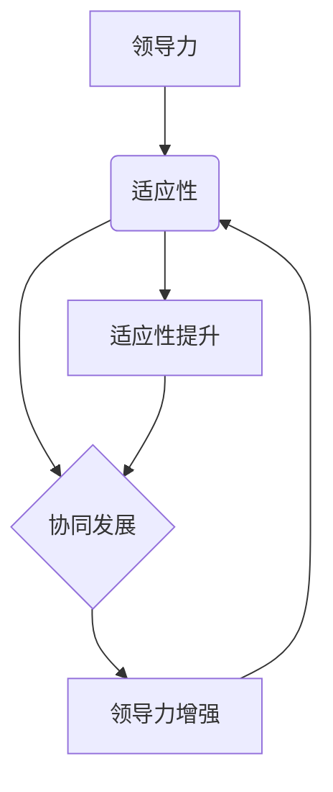
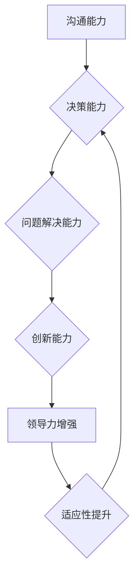
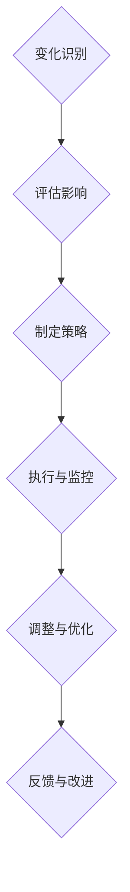
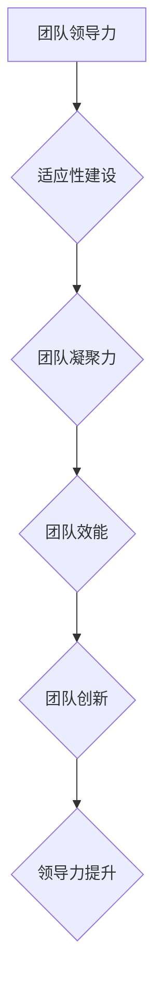
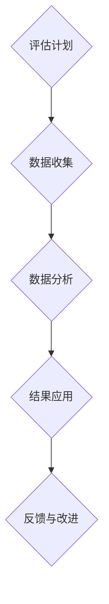

                 

### 第1章: 领导力与适应性的基础理论

#### 1.1 领导力概述

**1.1.1 领导力的定义与作用**

领导力是指一种通过影响和激励他人来实现共同目标的能力。它不仅仅是管理，更是一种领导艺术，涉及到个人魅力、战略思维、沟通能力和决策力等多方面的素质。

领导力在组织中的作用至关重要。首先，领导力能够确立组织的愿景和目标，为团队成员提供清晰的方向和动力。其次，领导力能够激发团队成员的潜能，提高整体团队的凝聚力和工作效率。最后，领导力能够处理复杂问题和冲突，确保组织在变化的环境中保持稳定和持续发展。

**1.1.2 领导力的核心要素**

领导力的核心要素包括：

1. **愿景与目标**：领导者需要具备清晰的愿景和目标，能够将这些愿景和目标转化为具体的行动计划。

2. **战略思维**：领导者需要具备前瞻性的战略思维，能够在复杂的环境中做出正确的决策。

3. **沟通能力**：领导者需要具备良好的沟通能力，能够有效地传达信息，理解团队成员的需求和意见。

4. **决策力**：领导者需要在关键时刻做出决策，并且能够承担责任。

5. **激励能力**：领导者需要能够激励团队成员，提高他们的工作积极性和创造力。

**1.1.3 领导风格与组织文化**

领导风格是指领导者与团队成员互动的方式和态度。常见的领导风格包括专制式、民主式、放任式等。不同的领导风格对组织文化产生不同的影响。

组织文化是指组织内部共同的价值观、信仰和行为规范。优秀的组织文化能够促进领导力的发展，提高组织的整体效能。

#### 1.2 适应性概述

**1.2.1 适应性的定义与重要性**

适应性是指组织或个人在面对外部环境变化时，能够快速调整自身行为和策略，以实现持续发展的能力。适应性是组织生存和发展的关键因素。

在快速变化的环境中，适应性意味着组织能够抓住机遇，迅速应对挑战，保持竞争优势。因此，适应性对于组织的持续发展和长期成功至关重要。

**1.2.2 适应性管理的关键要素**

适应性管理的关键要素包括：

1. **变化识别**：及时识别外部环境的变化，分析其影响。

2. **反应策略**：制定有效的反应策略，快速调整组织行为和策略。

3. **组织学习能力**：培养组织的学习能力，通过不断学习和创新，提高适应性。

4. **反馈机制**：建立有效的反馈机制，及时调整策略和行为。

**1.2.3 适应性在领导力中的应用**

领导力在适应性中起着关键作用。领导者需要具备以下能力：

1. **愿景与目标**：明确组织的目标和愿景，引导团队适应外部变化。

2. **战略思维**：具备前瞻性的战略思维，指导团队制定适应性策略。

3. **沟通能力**：与团队成员保持有效沟通，确保信息传递畅通。

4. **决策力**：在变化中迅速做出决策，指导团队行动。

#### 1.3 领导力与适应性的联系与相互作用

**1.3.1 领导力对适应性的影响**

领导力对适应性有着直接的影响。领导者的决策和行动会直接影响组织的适应性。有效的领导力能够提高组织的适应能力，使其在变化的环境中保持稳定和持续发展。

**1.3.2 适应性对领导力的促进作用**

适应性对领导力也有积极的促进作用。在快速变化的环境中，领导者需要具备强大的适应能力，才能应对各种挑战。这种适应能力会增强领导者的决策力和影响力，提高领导效果。

**1.3.3 领导力与适应性的协同发展**

领导力与适应性的协同发展是组织成功的关键。领导者需要通过不断提升自己的领导力，提高组织的适应能力。同时，组织也需要不断培养成员的适应性，以适应外部环境的变化。

**1.3.4 Mermaid 流程图：领导力与适应性的关系**

下面是一个Mermaid流程图，展示了领导力与适应性的关系：

### 第2章: 核心领导力与适应性能力

#### 2.1 沟通能力

**2.1.1 沟通能力的重要性**

沟通能力是领导力的重要组成部分。有效的沟通能力能够帮助领导者更好地传达信息、理解团队成员的需求和意见，提高团队的整体效能。

在快速变化的环境中，沟通能力尤为重要。领导者需要与团队成员保持紧密沟通，确保信息的及时传递和理解，从而快速调整组织行为和策略。

**2.1.2 提升沟通能力的策略**

提升沟通能力可以从以下几个方面入手：

1. **倾听**：倾听是沟通的基础，领导者需要培养倾听的能力，理解团队成员的意见和需求。

2. **清晰表达**：领导者需要能够清晰、准确地表达自己的想法和意见，避免信息传递的误解和错误。

3. **建立信任**：建立信任是有效沟通的关键，领导者需要通过诚实和透明的方式与团队成员建立信任关系。

4. **使用多种沟通渠道**：领导者需要根据不同的情况，选择合适的沟通渠道，如面对面交流、电子邮件、电话会议等。

**2.1.3 沟通障碍与解决方法**

常见的沟通障碍包括语言障碍、文化差异、信息过载等。解决沟通障碍的方法包括：

1. **明确沟通目标**：在沟通前明确沟通的目标和内容，确保双方都有清晰的理解。

2. **使用简单语言**：使用简单易懂的语言，避免使用专业术语和复杂的句子结构。

3. **建立共识**：在沟通过程中，建立双方的共识，确保信息的传递和理解。

4. **提供反馈**：在沟通后，提供反馈，确认信息的理解和传递效果。

#### 2.2 决策能力

**2.2.1 决策能力的重要性**

决策能力是领导者的重要能力之一。领导者需要在复杂和不确定的环境中做出正确的决策，以实现组织的愿景和目标。

有效的决策能力能够帮助领导者快速应对挑战，抓住机遇，提高组织的适应能力。

**2.2.2 决策过程与方法**

决策过程通常包括以下几个步骤：

1. **问题识别**：识别问题和挑战，明确决策的目标。

2. **信息收集**：收集与决策相关的信息和数据，分析问题的原因和解决方案。

3. **方案评估**：评估不同的解决方案，选择最优方案。

4. **决策执行**：执行决策，监控决策的效果。

常见的决策方法包括：

1. **理性决策**：基于数据和逻辑分析，选择最优方案。

2. **直觉决策**：基于领导者的经验和直觉，快速做出决策。

3. **混合决策**：结合理性决策和直觉决策，提高决策效果。

**2.2.3 提升决策能力的策略**

提升决策能力可以从以下几个方面入手：

1. **扩大信息来源**：增加决策的信息来源，提高信息的多样性和全面性。

2. **培养逻辑思维**：提高逻辑思维能力，提高决策的理性性和科学性。

3. **学习决策技巧**：学习各种决策方法和技巧，提高决策效果。

4. **实践与反思**：通过实践和反思，总结经验教训，提高决策能力。

#### 2.3 问题解决能力

**2.3.1 问题解决能力的重要性**

问题解决能力是领导者的重要能力之一。领导者需要能够快速识别和解决组织中的问题，确保组织的稳定和持续发展。

在快速变化的环境中，问题解决能力尤为重要。领导者需要具备快速反应和解决问题的能力，以应对各种挑战。

**2.3.2 问题解决的步骤与方法**

问题解决的步骤通常包括以下几个步骤：

1. **问题识别**：识别和明确问题，确定问题的性质和影响。

2. **原因分析**：分析问题的原因，找出问题的根源。

3. **方案设计**：设计解决方案，评估不同方案的效果和可行性。

4. **决策与执行**：选择最优方案，执行决策，解决问题。

常见的问题解决方法包括：

1. **头脑风暴**：通过集思广益，产生各种可能的解决方案。

2. **SWOT分析**：分析问题的优势、劣势、机会和威胁，制定相应的解决方案。

3. **过程改进**：通过改进流程和操作方法，解决存在的问题。

**2.3.3 提升问题解决能力的策略**

提升问题解决能力可以从以下几个方面入手：

1. **培养批判性思维**：提高批判性思维能力，从多个角度分析问题，找出问题的根源。

2. **学习解决问题的技巧**：学习各种解决问题的方法和技巧，提高解决问题的效率。

3. **鼓励创新思维**：鼓励团队成员提出创新的解决方案，提高问题解决的多样性和效果。

4. **建立问题解决团队**：建立专门的问题解决团队，集中力量解决复杂的问题。

#### 2.4 创新能力

**2.4.1 创新能力的重要性**

创新能力是领导者的重要能力之一。领导者需要能够推动组织创新，不断创造新的价值和机会。

在快速变化的环境中，创新能力尤为重要。领导者需要具备前瞻性的思维和创新的能力，以应对不断变化的市场和技术。

**2.4.2 创新的步骤与方法**

创新的步骤通常包括以下几个步骤：

1. **需求识别**：识别市场需求和用户需求，确定创新的方向。

2. **创意生成**：通过头脑风暴、思维导图等方法，生成各种可能的创新创意。

3. **方案筛选**：评估创意的可行性，选择最有潜力的创意进行深入开发。

4. **实施与验证**：实施创新方案，验证创新效果，不断优化和改进。

常见的方法包括：

1. **用户研究**：通过用户研究和用户反馈，了解用户需求和期望，指导创新方向。

2. **技术调研**：通过技术调研，了解最新的技术趋势和可能性，为创新提供技术支持。

3. **跨界合作**：与其他领域的专家和团队进行合作，引入外部创新元素。

**2.4.3 提升创新能力的策略**

提升创新能力可以从以下几个方面入手：

1. **鼓励创新思维**：鼓励团队成员提出创新的创意和想法，营造创新的氛围。

2. **提供资源支持**：为创新提供必要的资源支持，包括资金、技术、人才等。

3. **建立创新机制**：建立创新机制，鼓励团队成员参与创新，提供创新的平台和机会。

4. **持续学习**：通过持续学习和培训，提高团队成员的创新能力和专业素养。

**2.4.4 Mermaid 流程图：领导力与适应性能力构建**

下面是一个Mermaid流程图，展示了领导力与适应性能力的构建过程：

### 第3章: 变化管理

#### 3.1 变化管理的概念与原则

**3.1.1 变化的来源与类型**

变化是组织管理中不可避免的现象，其来源可以是内部因素，如组织战略调整、结构重组、技术革新等，也可以是外部因素，如市场变化、法规政策调整、社会环境变化等。

变化可以分为以下几种类型：

1. **渐进式变化**：这种变化通常较为缓慢，影响较小，但长期累积可能会产生显著效果。

2. **革命性变化**：这种变化通常迅速且影响巨大，可能对组织的结构和运作产生深远影响。

3. **持续变化**：这种变化是长期的，可能涉及多个方面，如技术、市场、文化等。

**3.1.2 变化管理的原则与策略**

变化管理需要遵循以下原则和策略：

1. **明确目标**：在变化之前，明确变化的目标和预期效果，确保变化的方向和目的清晰。

2. **充分沟通**：与所有相关方进行充分沟通，确保他们理解变化的必要性和影响，增加接受度。

3. **逐步实施**：将变化分解为多个阶段，逐步实施，减少冲击和阻力。

4. **资源支持**：为变化提供必要的资源，包括人力、资金、技术等。

5. **持续监控**：在变化过程中持续监控变化的效果，及时调整策略和行动。

**3.1.3 变化管理的组织文化**

变化管理不仅需要策略和措施，还需要组织文化的支持。一个开放、创新、包容的组织文化能够促进变化管理的顺利进行，提高组织的适应能力。

1. **鼓励创新**：鼓励员工提出创新的想法和解决方案，为变化提供源源不断的动力。

2. **信任与支持**：建立信任和支持的文化，让员工在变化过程中感到安心和有力量。

3. **持续学习**：鼓励员工持续学习和成长，提高其适应变化的能力。

#### 3.2 变化管理的实践

**3.2.1 变化管理的步骤**

变化管理的实践通常包括以下步骤：

1. **规划与准备**：明确变化的目标和策略，制定详细的计划，为变化做好准备。

2. **沟通与宣传**：与所有相关方进行充分沟通，确保他们理解变化的重要性，增强支持。

3. **实施与执行**：按照计划逐步实施变化，确保每一阶段都按预期进行。

4. **监控与评估**：在变化过程中持续监控变化的效果，及时调整策略和行动。

5. **反馈与改进**：在变化结束后，收集反馈信息，评估变化的成果，总结经验教训，为未来的变化管理提供参考。

**3.2.2 变化管理的工具与方法**

变化管理可以使用以下工具和方法：

1. **SWOT分析**：分析变化的内部优势、劣势和外部机会、威胁，为变化管理提供依据。

2. **BSC（平衡计分卡）**：通过财务、客户、内部流程、学习与成长四个维度，全面评估变化的影响。

3. **流程图**：绘制变化的流程图，明确变化的步骤和关键节点，确保实施过程的清晰。

4. **风险评估**：评估变化可能带来的风险，制定相应的应对策略。

**3.2.3 变化管理中的挑战与应对策略**

变化管理中可能会遇到以下挑战：

1. **阻力与抗拒**：员工可能对变化产生抵触情绪，需要通过沟通和激励来减少阻力。

2. **资源不足**：变化可能需要额外的资源和投入，需要提前规划和管理。

3. **实施难度**：复杂的变化可能难以实施，需要分解为多个阶段，逐步推进。

应对策略包括：

1. **加强沟通**：与所有相关方保持密切沟通，确保信息的透明和一致性。

2. **提供培训**：为员工提供培训和支持，提高其适应变化的能力。

3. **建立激励机制**：通过激励机制，鼓励员工积极参与变化。

**3.2.4 Mermaid 流程图：变化管理实践**

下面是一个Mermaid流程图，展示了变化管理的实践过程：

### 第4章: 团队领导力与适应性

#### 4.1 团队领导力的核心要素

**4.1.1 团队领导力的定义与作用**

团队领导力是指领导者通过影响和激励团队成员，引导团队实现共同目标的能力。它不仅仅涉及管理团队，还包括激发团队的潜能，提高团队的整体效能。

团队领导力的作用主要包括：

1. **明确团队目标**：领导者需要帮助团队明确目标，确保团队成员对目标有清晰的理解和认同。

2. **促进团队协作**：领导者需要建立有效的沟通机制，促进团队成员之间的协作，提高团队的凝聚力。

3. **激励团队成员**：领导者需要能够激励团队成员，激发其工作热情和创造力，提高团队的工作效率。

4. **解决团队问题**：领导者需要能够及时识别和解决团队中的问题，确保团队的稳定和持续发展。

**4.1.2 团队领导力的核心要素**

团队领导力的核心要素包括：

1. **愿景与目标**：领导者需要具备清晰的愿景和目标，能够将这些愿景和目标转化为具体的行动计划。

2. **战略思维**：领导者需要具备前瞻性的战略思维，能够在复杂的环境中做出正确的决策。

3. **沟通能力**：领导者需要具备良好的沟通能力，能够有效地传达信息，理解团队成员的需求和意见。

4. **决策力**：领导者需要在关键时刻做出决策，并且能够承担责任。

5. **激励能力**：领导者需要能够激励团队成员，提高他们的工作积极性和创造力。

**4.1.3 团队领导力与适应性**

团队领导力与适应性密切相关。在快速变化的环境中，领导者需要具备强大的适应能力，才能引导团队应对各种挑战。

团队领导力与适应性的关系可以从以下几个方面理解：

1. **适应性领导力**：领导者需要具备适应性领导力，能够快速调整领导风格和策略，以适应外部环境的变化。

2. **团队适应能力**：领导者需要培养团队的适应能力，使团队能够迅速应对外部变化，保持稳定和持续发展。

3. **协同发展**：领导力与适应性的协同发展是团队成功的关键，领导者需要通过不断提升自己的领导力，提高团队的适应能力。

#### 4.2 团队建设策略

**4.2.1 团队建设的重要性**

团队建设是提高团队效能的重要手段。一个高效的团队能够更好地实现组织的目标，提高组织的竞争力。

团队建设的重要性体现在以下几个方面：

1. **提高团队凝聚力**：通过团队建设活动，增强团队成员之间的信任和合作，提高团队的凝聚力。

2. **促进沟通与协作**：团队建设有助于建立有效的沟通渠道，促进团队成员之间的协作，提高团队的工作效率。

3. **提高团队适应能力**：团队建设可以提高团队成员的适应能力，使团队能够更好地应对外部变化。

4. **增强团队创新能力**：团队建设可以激发团队成员的创造力，提高团队的创新能力。

**4.2.2 团队建设的目标与步骤**

团队建设的目标主要包括：

1. **建立信任**：通过团队建设活动，建立团队成员之间的信任关系，提高团队的凝聚力。

2. **促进沟通**：通过有效的沟通机制，促进团队成员之间的信息交流，提高团队的工作效率。

3. **提高协作能力**：通过团队建设活动，提高团队成员的协作能力，实现团队目标。

4. **培养团队精神**：通过团队建设活动，培养团队成员的团队精神，提高团队的整体效能。

团队建设的步骤包括：

1. **评估当前团队状况**：通过问卷调查、访谈等方式，了解团队成员的期望、需求和问题，为团队建设提供依据。

2. **制定团队建设计划**：根据评估结果，制定具体的团队建设计划，包括活动内容、时间安排、资源需求等。

3. **实施团队建设活动**：按照计划实施团队建设活动，如团队拓展训练、团队沟通工作坊等。

4. **评估与反馈**：在团队建设活动结束后，评估活动的效果，收集团队成员的反馈，为后续的团队建设提供参考。

**4.2.3 提升团队适应性的策略**

提升团队适应性是团队建设的重要目标。以下是一些提升团队适应性的策略：

1. **增强团队学习能力**：通过培训和学习，提高团队成员的专业能力和适应能力。

2. **建立反馈机制**：建立有效的反馈机制，鼓励团队成员提出建议和意见，不断改进团队的工作方式。

3. **促进跨部门协作**：通过跨部门协作，促进团队成员之间的交流和学习，提高团队的适应能力。

4. **鼓励创新思维**：鼓励团队成员提出创新的想法和解决方案，提高团队的创新能力。

#### 4.3 团队领导力与适应性的实践

**4.3.1 团队领导力与适应性案例研究**

以下是几个团队领导力与适应性的成功案例：

1. **案例一：谷歌团队领导力与适应性**

谷歌以其独特的团队文化和领导力而闻名。谷歌的领导者鼓励创新和自由探索，使团队成员能够充分发挥自己的潜力。同时，谷歌建立了完善的反馈机制，鼓励团队成员提出建议和意见，不断改进团队的工作方式。

2. **案例二：特斯拉团队领导力与适应性**

特斯拉的领导者埃隆·马斯克以其强烈的领导力和适应性而著称。马斯克通过明确的愿景和目标，激发团队成员的创造力和创新精神，使特斯拉在电动汽车领域取得了显著的成功。

3. **案例三：阿里巴巴团队领导力与适应性**

阿里巴巴的领导者马云以其独特的领导风格和强大的适应性而闻名。马云能够快速适应市场变化，及时调整战略，使阿里巴巴成为中国电商的领导者。

**4.3.2 团队领导力与适应性的成功实践**

以下是几个团队领导力与适应性的成功实践：

1. **实践一：敏捷开发团队**

敏捷开发团队是一种以适应性为特点的团队模式。敏捷开发团队通过短周期迭代，快速响应需求变化，提高团队的适应能力。同时，敏捷开发团队注重团队成员的协作和沟通，提高团队的整体效能。

2. **实践二：跨部门协作**

跨部门协作是一种提升团队适应性的有效策略。通过跨部门协作，团队成员可以接触到不同的业务领域和思维方式，提高团队的适应能力和创新能力。

3. **实践三：领导力培训**

领导力培训是提升团队领导力和适应性的重要手段。通过领导力培训，团队成员可以学习到有效的领导方法和策略，提高团队的领导力和适应性。

**4.3.3 团队领导力与适应性的失败教训**

以下是几个团队领导力与适应性的失败教训：

1. **教训一：缺乏适应性**

一些团队在面对外部环境变化时，缺乏适应能力，导致团队效能下降。这种情况通常是由于团队缺乏对变化的敏感性和适应性。

2. **教训二：沟通不畅**

团队内部沟通不畅是导致团队领导力与适应性失败的重要原因。如果团队成员之间无法有效沟通，将导致信息传递错误，影响团队决策和行动。

3. **教训三：缺乏领导力**

一些团队在领导力方面存在不足，导致团队缺乏明确的目标和方向，无法有效应对外部变化。

**4.3.4 Mermaid 流程图：团队领导力与适应性实践**

下面是一个Mermaid流程图，展示了团队领导力与适应性实践的过程：

### 第5章: 领导力与适应性评估

#### 5.1 领导力与适应性评估的概念与工具

**5.1.1 领导力与适应性评估的定义**

领导力与适应性评估是指通过一系列方法，对领导者的领导力水平和组织的适应性能力进行系统评估，以识别优势、发现不足，并制定改进策略。

领导力评估主要关注领导者的能力、行为和结果，包括沟通能力、决策能力、团队管理能力等。适应性评估则关注组织在面对外部环境变化时的应对能力，包括变化管理能力、学习能力、创新能力等。

**5.1.2 评估领导力与适应性的重要性**

评估领导力与适应性的重要性体现在以下几个方面：

1. **提高领导力**：通过评估，领导者可以了解自己的优势和不足，有针对性地提升自己的领导力。

2. **提升组织效能**：通过评估，组织可以识别在适应性方面的短板，针对性地进行改进，提高整体效能。

3. **优化决策**：评估结果可以为组织提供决策依据，帮助领导者更好地制定战略和计划。

4. **促进持续改进**：评估是持续改进的基石，通过定期评估，组织可以不断优化领导力与适应性。

**5.1.3 常用的领导力与适应性评估工具**

常用的领导力与适应性评估工具包括：

1. **360度反馈**：通过收集上级、同事、下属和客户的反馈，全面评估领导者的能力和行为。

2. **领导力评估问卷**：使用标准化的问卷，评估领导者的各种领导力要素。

3. **绩效评估**：通过绩效评估，评估领导者的工作表现和成果。

4. **行为观察**：通过直接观察领导者的行为，评估其领导风格和能力。

5. **适应性评估工具**：如变化管理评估工具、学习与成长评估工具等。

#### 5.2 领导力与适应性评估的实施

**5.2.1 评估计划与步骤**

领导力与适应性评估的实施通常包括以下步骤：

1. **确定评估目标**：明确评估的目的和预期成果，确保评估过程有针对性。

2. **制定评估计划**：包括评估的时间、内容、方法、参与人员等，确保评估过程的有序进行。

3. **收集数据**：通过问卷调查、访谈、观察等方式，收集评估所需的数据。

4. **数据分析**：对收集到的数据进行分析，识别领导力和适应性的优势和不足。

5. **反馈与讨论**：将评估结果反馈给领导者，组织讨论改进方案。

6. **制定改进计划**：根据评估结果，制定具体的改进计划，包括培训、改进措施等。

7. **实施改进**：按照改进计划，实施改进措施，提高领导力与适应性。

**5.2.2 评估方法与技巧**

常用的评估方法包括：

1. **定量评估**：使用量化的指标和工具，如问卷、评分表等，评估领导力和适应性。

2. **定性评估**：通过访谈、观察等方式，收集定性数据，深入了解领导力和适应性。

3. **混合评估**：结合定量和定性评估方法，全面评估领导力和适应性。

评估技巧包括：

1. **确保公正性**：避免评估过程中的主观偏见，确保评估结果的客观性。

2. **注重反馈**：在评估过程中，注重与领导者和团队成员的沟通，确保反馈的准确性和有效性。

3. **持续评估**：评估不应是一次性的，而应是一个持续的过程，以持续改进领导力和适应性。

**5.2.3 评估结果分析与应用**

评估结果的分析和应用包括：

1. **识别优势**：分析评估结果，识别领导力和适应性的优势，加强和巩固这些优势。

2. **发现不足**：分析评估结果，识别领导力和适应性的不足，制定针对性的改进方案。

3. **制定改进方案**：根据评估结果，制定具体的改进方案，包括培训计划、改进措施等。

4. **实施改进**：按照改进方案，实施改进措施，提高领导力与适应性。

5. **跟踪评估**：在实施改进措施后，进行跟踪评估，确保改进效果，并根据评估结果进行进一步的调整。

**5.2.4 Mermaid 流程图：领导力与适应性评估实施**

下面是一个Mermaid流程图，展示了领导力与适应性评估的实施过程：

### 第6章: 领导力与适应性的未来趋势

#### 6.1 数字化时代的领导

在数字化时代，领导力与适应性面临新的挑战和机遇。以下是一些关键趋势：

**6.1.1 数字化领导力的特点**

1. **数据驱动决策**：数字化时代，领导者需要具备数据意识和数据素养，通过数据分析做出更科学的决策。

2. **敏捷性**：数字化时代要求领导者具备快速响应变化的能力，采用敏捷管理方法，推动组织的快速迭代和改进。

3. **技术领导**：领导者需要具备对新兴技术的敏感性和理解能力，能够引导组织利用数字化工具提高效率和创新能力。

**6.1.2 数字化对领导力的影响**

1. **沟通方式的转变**：数字化工具使得沟通更加便捷和高效，领导者需要适应这种变化，提高沟通技巧。

2. **工作模式的改变**：远程工作和虚拟团队成为新常态，领导者需要管理跨地域、跨时间的团队，提高远程领导能力。

3. **领导角色的转变**：领导者需要从控制者转变为赋能者，通过数字化工具和平台，激发员工的创造力和自主性。

**6.1.3 数字化领导力的培养策略**

1. **提升数字素养**：通过培训和学习，提高领导者的数字素养，使他们能够熟练使用数字化工具。

2. **建立数字化文化**：推动组织建立数字化文化，鼓励员工积极探索和应用新技术。

3. **加强跨部门协作**：利用数字化工具，促进跨部门协作，提高组织的整体效能。

**6.1.4 数字化时代的适应性领导**

1. **快速学习与适应**：领导者需要具备快速学习和适应新技术的能力，及时调整领导策略。

2. **持续创新**：在数字化时代，领导者需要推动组织持续创新，通过数字化转型保持竞争优势。

3. **人性化管理**：在数字化时代，领导者仍需关注员工的需求和情感，实现人性化管理。

#### 6.2 AI与机器学习对领导力与适应性的影响

**6.2.1 AI在领导力中的应用**

1. **决策支持**：AI可以帮助领导者分析大量数据，提供决策支持，提高决策的科学性和准确性。

2. **人才管理**：AI可以分析员工的表现和行为数据，帮助领导者更好地识别人才，进行人才管理和培养。

3. **工作分析**：AI可以分析工作流程，优化工作流程，提高工作效率。

**6.2.2 机器学习对领导力的影响**

1. **自动化决策**：机器学习可以帮助实现自动化决策，减少人工干预，提高决策效率。

2. **个性化管理**：机器学习可以根据员工的行为数据，提供个性化的管理建议，提高管理效果。

3. **预测性分析**：机器学习可以预测未来趋势，帮助领导者制定更有前瞻性的战略。

**6.2.3 AI与机器学习对适应性领导的要求**

1. **技术与人文结合**：领导者需要将技术与人文相结合，既具备技术洞察力，又关注员工的需求和情感。

2. **持续学习与更新**：领导者需要具备持续学习的能力，不断更新自己的知识和技能，适应新技术的发展。

3. **风险管理**：领导者需要具备风险管理能力，能够识别和应对AI技术可能带来的风险。

#### 6.3 领导力与适应性的未来发展趋势

**6.3.1 人工智能领导力的崛起**

随着AI技术的不断发展，人工智能领导力将成为未来领导力的重要组成部分。领导者需要具备AI思维，能够理解和利用AI技术，提高领导力和组织效能。

**6.3.2 适应性领导力的普及**

在快速变化的环境中，适应性领导力将成为领导者必备的能力。领导者需要具备强大的适应能力，能够迅速应对外部变化，保持组织的持续发展。

**6.3.3 跨界领导力的兴起**

在数字化时代，跨界领导力将成为未来领导力的重要趋势。领导者需要具备跨领域的知识和技能，能够整合不同领域的资源，推动组织的创新和发展。

**6.3.4 智能化领导力的崛起**

智能化领导力是指领导者利用数字化工具和智能技术，提高领导效能和团队绩效的能力。未来，智能化领导力将成为领导力发展的重要方向。

**6.3.5 人本领导力的回归**

尽管技术在不断发展，但人本领导力始终是领导力的核心。未来，领导者需要更加关注员工的需求和情感，实现人性化管理，提高组织的整体效能。

**6.3.6 全球领导力的挑战与机遇**

随着全球化的不断深入，领导者需要具备全球视野和跨文化领导力，能够应对全球市场的挑战和机遇。

**6.3.7 领导力与适应性的融合**

领导力与适应性的融合将成为未来领导力发展的重要趋势。领导者需要将领导力与适应性相结合，提高组织的应变能力和持续发展能力。

### 结论

领导力与适应性是组织持续发展和成功的关键因素。在快速变化的环境中，领导者需要不断提升自己的领导力和适应性，以应对各种挑战和机遇。同时，组织也需要建立适应性文化，培养成员的适应性，提高整体效能。

在未来，领导者需要具备数字化领导力、跨界领导力、智能化领导力等人本领导力，以应对数字化时代的挑战和机遇。通过不断学习和实践，领导者可以不断提升自己的领导力和适应性，为组织的持续发展奠定坚实基础。

**作者：AI天才研究院/AI Genius Institute & 禅与计算机程序设计艺术 /Zen And The Art of Computer Programming**

