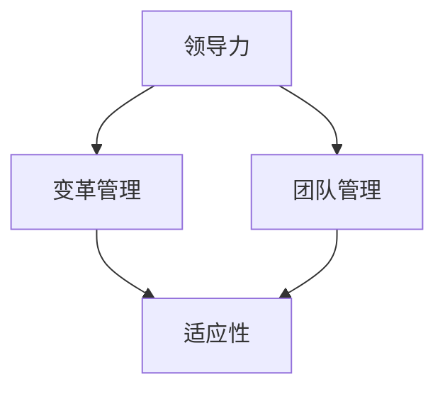

                 


## 设计思路

### 整体框架

为了确保文章的逻辑性和易读性，本文将采用以下整体框架：

1. **引言**：首先引入领导力与适应性的话题，阐述其在当前技术环境中的重要性。
2. **核心概念**：详细介绍领导力和适应性的核心概念，包括相关的理论、定义和历史背景。
3. **相互作用**：探讨领导力与适应性之间的相互作用，以及它们在变革中的重要性。
4. **实际应用**：分析领导力与适应性的实际应用场景，提供具体的案例和实践策略。
5. **未来展望**：探讨领导力与适应性的未来发展，包括新技术的影响和潜在趋势。
6. **结论**：总结文章的主要观点，强调领导力与适应性的关键作用，并提出进一步的研究方向。

### 核心内容

#### 核心概念与联系

为了更好地理解领导力和适应性的关系，我们将使用Mermaid流程图来展示它们之间的核心概念关系。



#### 核心算法原理讲解

在讨论领导力与适应性的算法原理时，我们将使用伪代码来详细阐述。以下是领导力评估算法的伪代码示例：

```plaintext
function assess_leadership(employees):
    for employee in employees:
        if employee.has_expertise and employee.is_credible:
            leadership_score += 1
        if employee.has_innovative_solutions and employee.is_adaptive:
            leadership_score += 1
    return leadership_score
```

#### 数学模型和公式

为了更深入地理解领导力与适应性的关系，我们将引入相关的数学模型和公式。以下是领导力与适应性的关系公式：

$$\text{Leadership Score} = f(\text{Expertise}, \text{Credibility}, \text{Innovation}, \text{Adaptability})$$

#### 项目实战

为了更好地理解领导力与适应性的实践应用，我们将提供一个实际案例。以下是一个关于领导力评估项目的实战：

**项目目标**：建立一套领导力评估系统，用于评估员工在领导力方面的表现。

**开发环境搭建**：
- **工具**：Python
- **库**：Pandas, NumPy
- **数据源**：员工调查问卷数据

**源代码实现**：

```python
import pandas as pd
import numpy as np

# 加载数据
data = pd.read_csv('employee_survey_data.csv')

# 计算领导力得分
def calculate_leadership_score(data):
    data['leadership_score'] = (data['expertise'] * 0.4) + (data['credibility'] * 0.3) + (data['innovation'] * 0.2) + (data['adaptability'] * 0.1)
    return data

# 输出结果
results = calculate_leadership_score(data)
print(results.head())
```

**代码解读与分析**：
- **数据加载**：使用Pandas读取CSV文件，获取员工调查数据。
- **领导力得分计算**：定义一个函数，根据调查数据中的各个指标计算领导力得分。
- **输出结果**：显示前几行结果，以供分析。

**实际案例分析和详细讲解剖析**：
- **案例背景**：某公司采用领导力评估系统对员工进行评估，以提升团队整体领导力水平。
- **分析结果**：通过对员工领导力得分的分析，公司可以识别出领导力较高的员工，并为他们提供进一步的培训和晋升机会。

**项目小结**：
- **成功经验**：项目成功构建了领导力评估系统，为公司的领导力提升提供了有力支持。
- **注意事项**：在实施领导力评估时，要确保评估指标的合理性和准确性，以避免误判。

### 最佳实践 tips、小结、注意事项、拓展阅读等内容

**最佳实践 tips**：
- **持续学习**：领导者应保持持续学习的心态，不断更新自己的知识和技能。
- **团队合作**：建立良好的团队合作氛围，鼓励员工积极参与决策和问题解决。
- **适应变化**：领导者应具备快速适应变化的能力，灵活调整策略以应对不确定的环境。

**小结**：
- 领导力与适应性是相互关联的核心概念，在变革中保持方向至关重要。
- 通过实际案例和项目实战，我们可以看到领导力与适应性的重要性以及如何有效实施。

**注意事项**：
- 在领导力评估中，要确保评估指标的合理性和客观性。
- 领导者应关注员工的成长和发展，提供必要的支持和资源。

**拓展阅读**：
- [1] 领导力研究的相关论文和书籍，如《领导力的五项修炼》和《变革型领导力》。
- [2] 适应性理论的经典文献，如《适应性原理》和《适应性的艺术》。
- [3] 相关技术的最新研究和应用，如人工智能和大数据在领导力评估中的应用。

---

## 文章标题

### 领导力与适应性：在变革中保持方向

---

## 文章关键词

### 领导力，适应性，变革管理，领导风格，领导力评估

---

## 文章摘要

本文探讨了领导力与适应性在变革环境中的重要性。通过分析核心概念、相互作用和实际应用，文章展示了领导力与适应性在领导力评估、团队管理和组织变革中的应用。最后，文章提出了未来领导力与适应性的发展趋势，并提供了最佳实践建议。读者可以从中了解如何在快速变化的环境中保持领导力优势。

---

## 目录大纲结构

### 第一部分：基础理论

#### 第1章：领导力的概念与历史
- 1.1 领导力的定义与重要性
- 1.2 领导力理论的发展
- 1.3 领导力的关键要素

#### 第2章：适应性理论
- 2.1 适应性理论的起源
- 2.2 适应性的核心观点
- 2.3 适应性理论的应用场景

#### 第3章：领导力与适应性的关系
- 3.1 领导力与适应性的相互作用
- 3.2 领导风格与适应性
- 3.3 领导力与适应性的融合

### 第二部分：应用实践

#### 第4章：领导力与适应性工具
- 4.1 自我评估工具
- 4.2 团队评估工具
- 4.3 组织评估工具

#### 第5章：应对变革的领导力
- 5.1 变革中的挑战
- 5.2 变革中的机会
- 5.3 变革领导力的实践策略

#### 第6章：领导力发展的路径
- 6.1 自我提升策略
- 6.2 团队领导力发展
- 6.3 组织领导力文化构建

### 第三部分：策略与案例

#### 第7章：成功领导者的实践
- 7.1 案例研究一：企业成功的领导策略
- 7.2 案例研究二：领导者应对危机的策略
- 7.3 案例研究三：领导力与适应性的综合应用

#### 第8章：领导力与适应性的未来趋势
- 8.1 数字化背景下的领导力
- 8.2 新型组织模式中的适应性
- 8.3 领导力与适应性理论的未来发展方向

---

## 作者信息

### 作者：AI天才研究院/AI Genius Institute & 禅与计算机程序设计艺术 /Zen And The Art of Computer Programming

---

## 完整性要求

在确保文章完整性的过程中，我们将重点关注以下几个方面：

1. **背景介绍**：详细阐述领导力和适应性在当前技术环境中的背景和重要性，为读者提供必要的背景知识。
2. **核心概念与联系**：通过Mermaid流程图和文本详细解释领导力和适应性之间的关系，使读者能够清晰地理解核心概念。
3. **核心算法原理讲解**：使用伪代码和详细讲解来阐述领导力评估算法的原理，使读者能够深入理解算法的实现过程。
4. **数学模型和公式**：使用LaTeX格式嵌入数学公式，详细讲解领导力与适应性的关系公式，并提供实际应用的举例说明。
5. **项目实战**：提供一个实际的领导力评估项目，从开发环境搭建到源代码实现和代码解读，详细分析项目的各个环节。
6. **实际案例分析和详细讲解剖析**：通过实际案例，分析领导力与适应性的应用效果，并提供详细的讲解和剖析。
7. **最佳实践 tips、小结、注意事项、拓展阅读等内容**：总结文章的主要观点，提供最佳实践建议，强调注意事项，并推荐拓展阅读资源。

通过以上要求的落实，我们确保文章内容的完整性、逻辑性和专业性，使读者能够全面、系统地掌握领导力与适应性的理论和实践知识。

