                 

### 引言

在当今快速变化和高度不确定性的商业环境中，领导力和适应性成为组织成功的关键因素。领导力不仅仅是一种管理技能，更是一种塑造组织文化、激发团队潜力和推动创新的能力。而适应性则是领导者在面对市场变化、技术进步和内部挑战时，能够灵活调整策略和领导风格的能力。

本篇文章旨在探讨领导力与适应性的关系，以及如何在变革中保持方向感。我们将首先介绍领导力的核心概念，然后深入分析适应性的重要性，并探讨两者之间的相互联系。接着，我们将讨论如何提升领导力，以及如何在变革中保持适应性。最后，通过实际项目案例，我们将展示领导力与适应性的应用，并给出未来领导者的建议。

### 领导力的核心概念

领导力是一种影响他人并共同实现目标的能力。它可以分为多个层次和类型，包括技术领导力、变革领导力、情感领导力和战略领导力等。技术领导力主要关注专业技能和知识，变革领导力则侧重于推动组织变革，情感领导力强调建立信任和激发团队动力，战略领导力则关注组织的长远规划和目标。

在本章节中，我们将探讨变革领导力和情感领导力。变革领导力强调在组织面临外部压力和内部挑战时，如何推动变革并引导团队适应新的环境。情感领导力则关注如何建立积极的人际关系，激发团队成员的潜力和创造力。

#### 变革领导力

变革领导力是领导者在面对变革时，能够有效推动变革并引导团队适应新环境的能力。以下是变革领导力的一些关键要素：

1. **愿景**：领导者需要明确组织的愿景，并将其转化为具体的行动和目标。
2. **沟通**：领导者需要与团队成员进行有效沟通，确保每个人都理解变革的必要性和目标。
3. **激励**：领导者需要激发团队成员的积极性和创造力，使他们愿意参与并支持变革。
4. **团队建设**：领导者需要建立紧密的团队关系，增强团队协作和凝聚力。

以下是一个Mermaid流程图，展示了变革领导力的关键要素和它们之间的关系：

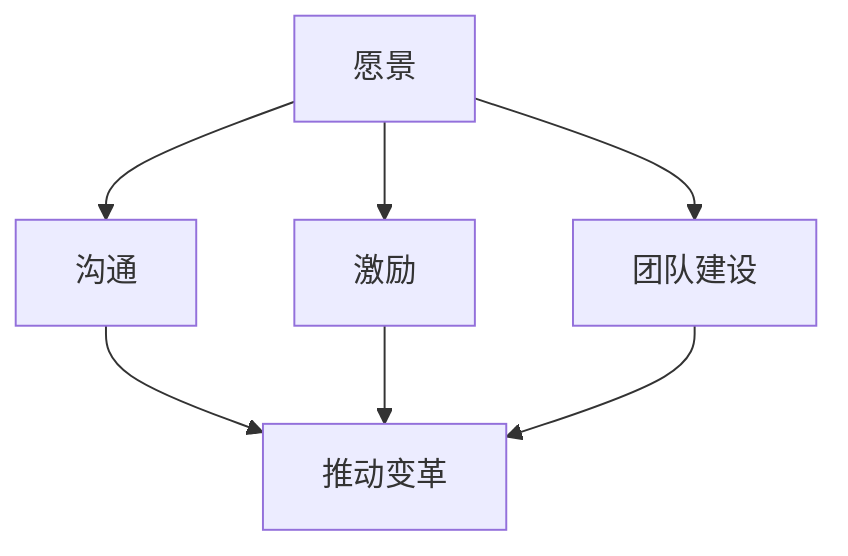

#### 情感领导力

情感领导力是一种关注团队成员情感和心理健康的能力。以下是情感领导力的一些关键要素：

1. **信任**：领导者需要建立信任，使团队成员感到安全和被尊重。
2. **激励**：领导者需要激发团队成员的潜力和创造力，使他们感到被认可和赞赏。
3. **支持**：领导者需要为团队成员提供支持和资源，帮助他们克服困难和挑战。
4. **倾听**：领导者需要倾听团队成员的意见和需求，确保他们感到被关注和理解。

以下是一个Mermaid流程图，展示了情感领导力的关键要素和它们之间的关系：

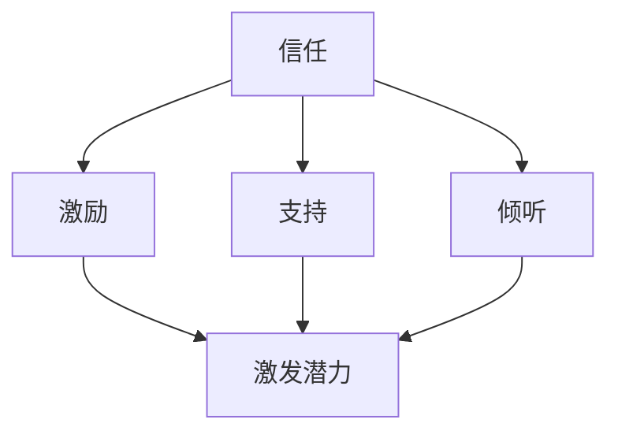

### 适应性的重要性

适应性是领导者成功的关键因素之一。在快速变化的环境中，组织需要能够快速适应新的市场趋势、技术进步和内部挑战。以下是从技术、市场和人员三个方面探讨适应性的重要性：

#### 技术适应性

技术适应性是领导者能够在技术变化中保持组织竞争力的能力。以下是一些关键要素：

1. **持续学习**：领导者需要保持对新技术的关注和学习，以确保组织能够及时掌握和利用新技术。
2. **技术预见**：领导者需要预见技术趋势，并提前规划和部署相关技术，以保持组织的竞争优势。
3. **技术整合**：领导者需要整合组织内部的不同技术，确保它们能够协同工作，提高组织效率。

以下是一个Mermaid流程图，展示了技术适应性的关键要素和它们之间的关系：

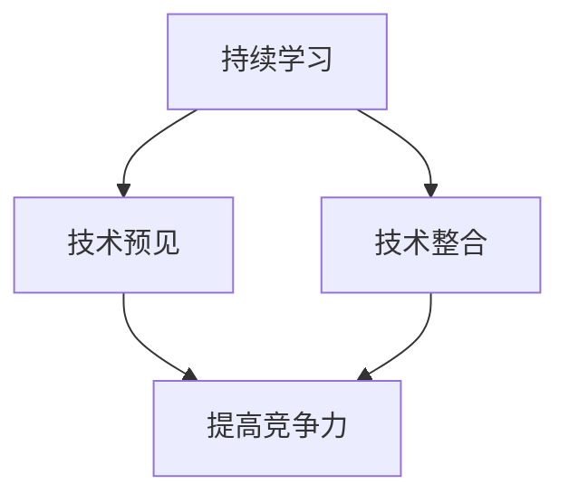

#### 市场适应性

市场适应性是领导者能够在市场变化中保持组织市场地位的能力。以下是一些关键要素：

1. **市场洞察**：领导者需要密切关注市场动态，了解客户需求和市场趋势。
2. **产品创新**：领导者需要推动产品创新，以适应市场变化和满足客户需求。
3. **灵活调整**：领导者需要根据市场变化灵活调整组织策略，确保组织能够迅速适应新的市场环境。

以下是一个Mermaid流程图，展示了市场适应性的关键要素和它们之间的关系：

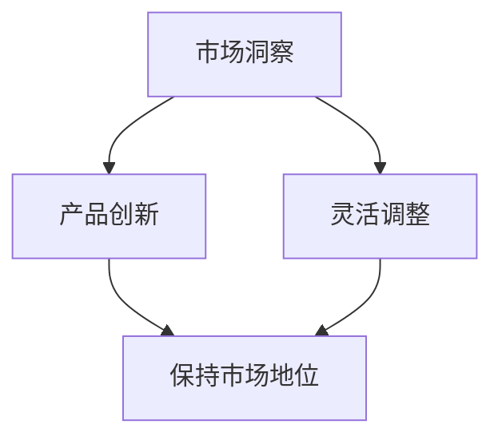

#### 人员适应性

人员适应性是领导者能够在组织内部培养和发展适应性人才的能力。以下是一些关键要素：

1. **员工培训**：领导者需要为员工提供培训和发展机会，提高他们的技能和知识。
2. **人才激励**：领导者需要激发员工的积极性和创造力，使他们愿意适应新环境和接受新的挑战。
3. **团队协作**：领导者需要建立高效的团队协作机制，促进团队成员之间的沟通和合作。

以下是一个Mermaid流程图，展示了人员适应性的关键要素和它们之间的关系：

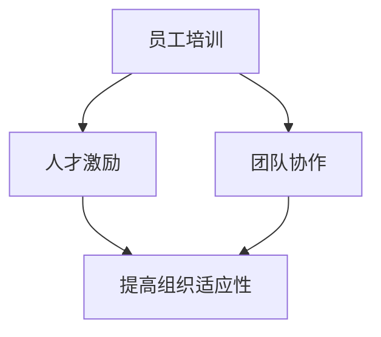

### 领导力与适应性的相互联系

领导力和适应性是相辅相成的。有效的领导力能够为适应性提供方向和动力，而适应性则为领导力提供支持和保障。以下是一个Mermaid流程图，展示了领导力与适应性的相互联系：

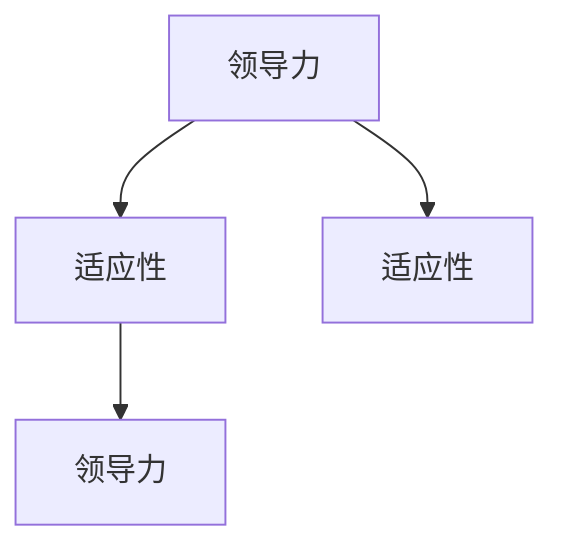

### 如何提升领导力

提升领导力是一个长期的过程，需要领导者不断学习和实践。以下是从自我认知、技能提升和经验积累三个方面讨论如何提升领导力：

#### 自我认知

自我认知是领导力提升的第一步。领导者需要了解自己的优点和不足，明确自己的价值观和目标。以下是一些关键要素：

1. **自我反思**：领导者需要定期进行自我反思，了解自己的行为和决策，识别自己的优点和不足。
2. **价值观识别**：领导者需要明确自己的价值观，并将其融入到领导实践中。
3. **目标设定**：领导者需要设定明确的目标，并制定实现目标的行动计划。

以下是一个Mermaid流程图，展示了自我认知的关键要素和它们之间的关系：

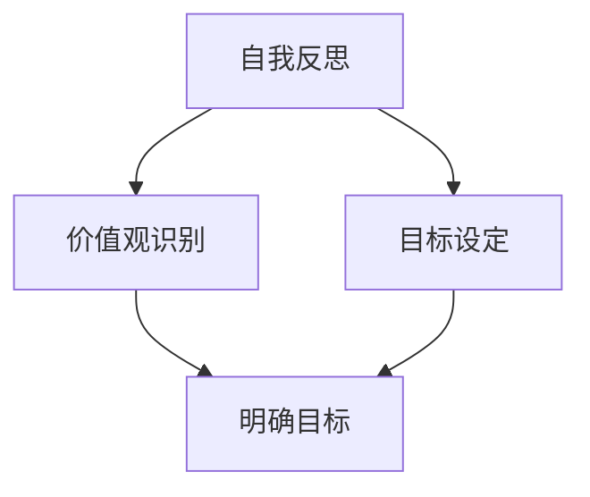

#### 技能提升

技能提升是领导力提升的关键。领导者需要不断提升自己的专业技能和领导技能，以应对不断变化的环境。以下是一些关键要素：

1. **专业培训**：领导者可以参加专业培训课程，学习新的知识和技能。
2. **实践经验**：领导者需要通过实践机会，将理论知识应用到实际工作中。
3. **反思总结**：领导者需要定期进行反思总结，识别自己的不足，并制定改进计划。

以下是一个Mermaid流程图，展示了技能提升的关键要素和它们之间的关系：

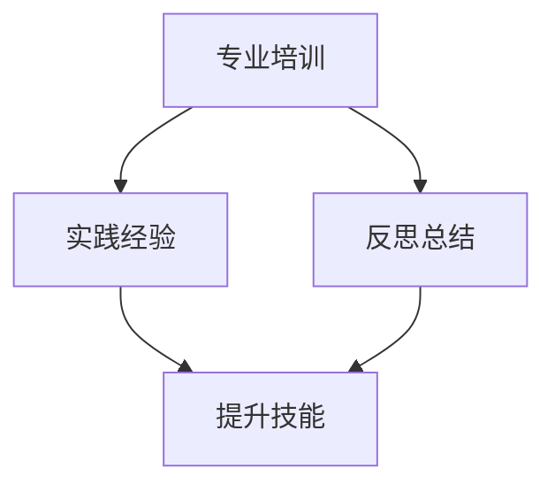

#### 经验积累

经验积累是领导力提升的基础。领导者需要从过去的成功和失败中学习，不断提高自己的领导能力。以下是一些关键要素：

1. **案例学习**：领导者可以通过学习他人的成功案例，了解不同的领导策略和方法。
2. **失败反思**：领导者需要从失败中学习，分析失败的原因，并制定改进措施。
3. **持续学习**：领导者需要保持对新知识和新技能的学习，不断提高自己的领导能力。

以下是一个Mermaid流程图，展示了经验积累的关键要素和它们之间的关系：

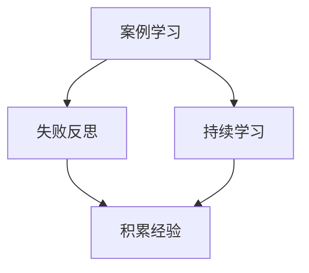

### 如何在变革中保持适应性

在变革中保持适应性是领导者面临的重大挑战。以下是从变革管理、心理准备和领导角色三个方面讨论如何在变革中保持适应性：

#### 变革管理

变革管理是领导者在变革过程中引导团队、确保变革顺利进行的过程。以下是一些关键要素：

1. **明确变革目标**：领导者需要明确变革的目标，并与团队成员进行沟通，确保他们理解并支持变革。
2. **制定变革计划**：领导者需要制定详细的变革计划，包括变革的步骤、时间和资源分配。
3. **领导示范**：领导者需要通过自己的行动，展示对变革的支持和信心，激励团队成员积极参与变革。

以下是一个Mermaid流程图，展示了变革管理的关键要素和它们之间的关系：

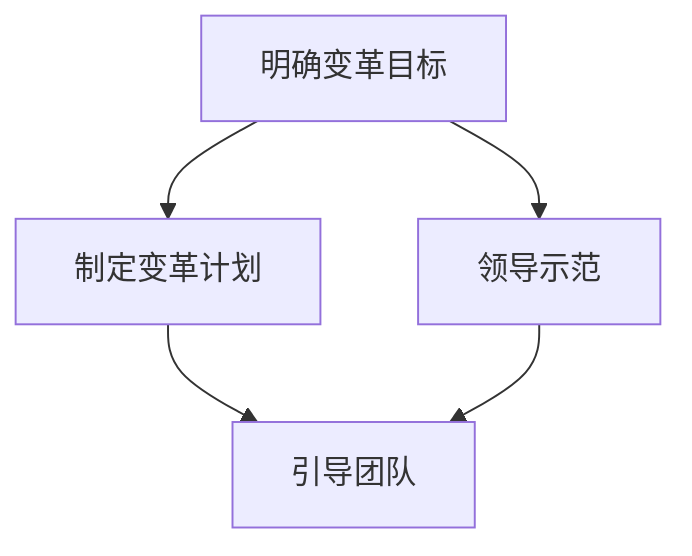

#### 心理准备

在变革过程中，领导者需要具备良好的心理准备，以应对各种挑战和压力。以下是一些关键要素：

1. **积极心态**：领导者需要保持积极的心态，相信变革会给组织带来积极的影响。
2. **情绪管理**：领导者需要学会情绪管理，避免在压力下做出冲动决策。
3. **团队合作**：领导者需要与团队成员建立紧密的团队合作关系，共同应对变革带来的挑战。

以下是一个Mermaid流程图，展示了心理准备的关键要素和它们之间的关系：

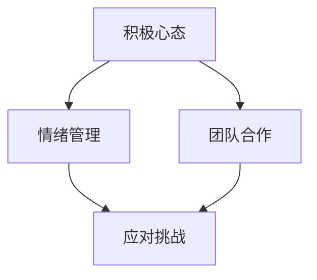

#### 领导角色

在变革过程中，领导者需要扮演多重角色，以引导团队顺利度过变革。以下是一些关键要素：

1. **变革推动者**：领导者需要积极推动变革，确保变革计划得到有效实施。
2. **变革倡导者**：领导者需要成为变革的倡导者，激发团队成员对变革的认同和支持。
3. **变革指导者**：领导者需要为团队成员提供指导和支持，帮助他们适应变革。

以下是一个Mermaid流程图，展示了领导角色的关键要素和它们之间的关系：

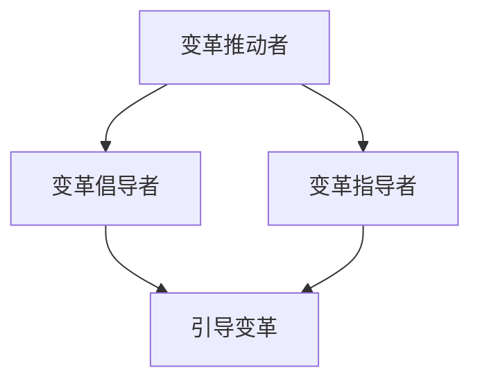

### 项目实践

以下是一个实际项目案例，展示了领导力与适应性的应用。

#### 项目背景

某企业是一家从事软件开发的公司，随着市场竞争的加剧和技术的快速发展，公司面临着巨大的压力。为了保持竞争力，公司决定进行一场全面的业务和技术的变革。

#### 项目目标

1. **提升产品质量**：通过引入新的开发流程和工具，提升产品质量和交付速度。
2. **增强团队协作**：通过优化团队结构和沟通机制，增强团队协作和凝聚力。
3. **适应市场变化**：通过市场调研和产品创新，适应市场变化，提高市场份额。

#### 项目实施

1. **明确变革目标**：公司高层明确了变革的目标，并与全体员工进行了沟通，确保他们理解并支持变革。
2. **制定变革计划**：公司制定了详细的变革计划，包括引入新的开发流程、培训员工、优化团队结构等。
3. **领导示范**：公司领导层通过自己的行动，展示了对变革的支持和信心，激励员工积极参与变革。
4. **心理准备**：公司为员工提供了心理培训和辅导，帮助他们应对变革带来的压力和挑战。
5. **变革推动**：公司领导层积极推动变革，确保变革计划得到有效实施。
6. **团队协作**：公司建立了新的团队协作机制，促进团队成员之间的沟通和合作。

#### 项目成果

1. **产品质量提升**：通过引入新的开发流程和工具，产品质量得到了显著提升，客户满意度提高。
2. **团队协作增强**：通过优化团队结构和沟通机制，团队协作和凝聚力得到了增强，工作效率提高。
3. **市场适应**：通过市场调研和产品创新，公司成功适应了市场变化，市场份额得到提升。

#### 项目小结

通过这个项目实践，我们可以看到领导力与适应性在实际项目中的重要作用。有效的领导力能够为变革提供方向和动力，而适应性则能够帮助组织顺利度过变革，实现目标。

### 未来展望

在未来，领导力和适应性将继续成为组织成功的关键因素。以下是从技术、市场和人员三个方面展望未来领导力与适应性的发展趋势：

#### 技术趋势

1. **数字化转型**：随着数字化技术的快速发展，领导者需要具备数字素养，推动组织的数字化转型。
2. **人工智能和自动化**：人工智能和自动化的广泛应用将改变传统的工作模式，领导者需要适应这些技术变革。
3. **区块链技术**：区块链技术的兴起将改变组织的管理和协作方式，领导者需要了解并利用区块链技术。

#### 市场趋势

1. **全球化和市场多元化**：全球化趋势将继续深化，领导者需要具备跨文化沟通和管理能力，适应多元化的市场环境。
2. **消费者需求变化**：消费者需求的变化将推动产品创新和服务升级，领导者需要关注市场趋势，及时调整战略。
3. **可持续发展**：可持续发展成为全球共识，领导者需要关注环境保护和社会责任，推动组织的可持续发展。

#### 人员趋势

1. **员工多样性**：员工多样性成为组织的重要优势，领导者需要尊重和包容不同的文化和观点，促进团队创新。
2. **终身学习**：终身学习成为员工发展的趋势，领导者需要为员工提供学习和发展机会，帮助他们提升技能和知识。
3. **灵活工作方式**：随着远程工作和灵活工作方式的普及，领导者需要适应新的工作方式，提高团队协作效率。

### 结论与建议

领导力和适应性是领导者成功的关键因素。在快速变化的环境中，领导者需要不断提升自己的领导力，并在变革中保持适应性。以下是一些建议：

1. **持续学习**：领导者需要保持对新知识和新技能的学习，不断提升自己的领导能力。
2. **关注员工**：领导者需要关注员工的需求和成长，建立积极的人际关系，激发员工的潜力和创造力。
3. **灵活应变**：领导者需要具备灵活应变的意识，及时调整策略和领导风格，以适应环境变化。
4. **拥抱变革**：领导者需要积极拥抱变革，推动组织进行创新和转型，以保持竞争力。

通过以上努力，领导者可以在变革中保持方向感，带领组织走向成功。作者：AI天才研究院/AI Genius Institute & 禅与计算机程序设计艺术 /Zen And The Art of Computer Programming。

