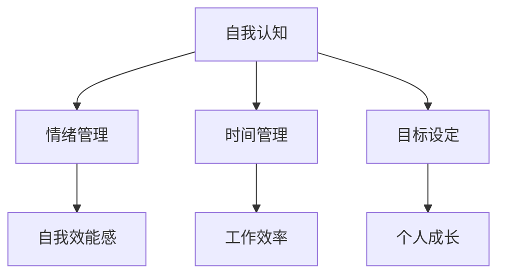

                 

### 1. 书名解析

《领导力与道德伦理：树立正直的榜样》这本书的主题是领导力与道德伦理，重点探讨领导者在组织中的道德行为和正直的榜样作用。书名中的几个关键概念包括“领导力”、“道德伦理”和“树立正直的榜样”。

**领导力** 是指一个人或组织在影响、激励和引导他人或团队以实现共同目标的过程中所表现出的能力。领导力不仅仅关乎权力的运用，更涉及到领导者的人格特质、行为方式以及对团队和组织的深远影响。

**道德伦理** 是指关于正确与错误、善与恶的价值观体系。在领导力的背景下，道德伦理强调领导者应遵守的行为准则，包括正直、诚信、公正、责任等原则。一个具备道德伦理的领导者能够在复杂的环境中做出符合道德标准、有益于团队和组织发展的决策。

**树立正直的榜样** 则是书名的核心概念。这意味着领导者不仅要具备道德伦理的原则，更要在实际行动中以身作则，成为他人效仿的榜样。树立正直的榜样不仅对领导者个人至关重要，对于整个团队和组织文化的塑造也具有深远的影响。

因此，书名《领导力与道德伦理：树立正直的榜样》不仅揭示了书的核心主题，也暗示了领导者在道德伦理方面的责任和挑战。接下来，我们将深入探讨这些核心概念，并逐步分析它们在领导力实践中的重要性。

### 2. 目录大纲设计思路

为了保证书籍内容的逻辑性和完整性，目录大纲的设计需要围绕书名《领导力与道德伦理：树立正直的榜样》这一核心主题展开，确保各部分内容层层递进、结构清晰。以下是设计目录大纲的基本思路：

#### 2.1 引言与核心概念部分

**引言与核心概念** 部分是全书的基础，旨在为读者提供一个全面的理解框架。具体包括以下几个小节：

1. **1.1 领导力与道德伦理的概述**：介绍领导力和道德伦理的基本概念，以及它们在组织中的作用和相互关系。这部分将定义关键术语，解释其重要性，并简要概述全书的结构。
   
2. **1.2 领导力的核心概念**：探讨领导力的各个方面，如领导者个人素质、团队建设和领导行为等，为后续章节提供理论基础。

3. **1.3 道德伦理的基本原则**：详细讨论道德伦理的基本原则，如正直、诚信、公正等，并解释这些原则在领导力实践中的意义。

#### 2.2 领导力的理论与实践部分

**领导力的理论与实践** 部分将深入探讨领导力的具体实践方法，具体包括：

1. **2.1 领导者个人素质的培养**：介绍如何提升领导者的人格特质和情绪智力，以及如何进行自我认知与自我管理。
   
2. **2.2 团队建设与领导**：讨论如何激励团队成员、管理团队沟通和冲突，以及如何培养团队凝聚力。

3. **2.3 决策与领导**：分析决策的过程和方法，以及领导者如何进行风险分析和做出明智的决策。

4. **2.4 沟通与领导**：探讨有效沟通的重要性，以及领导者如何通过有效的沟通技巧来提升团队绩效。

#### 2.3 道德伦理的原理与实践部分

**道德伦理的原理与实践** 部分将专注于道德伦理的理论基础和实际应用，包括：

1. **3.1 道德伦理的哲学基础**：介绍伦理学的起源和发展，以及道德哲学的基本理论。

2. **3.2 道德伦理的基本原则与实践**：详细探讨正直、诚信、公正等原则，并解释这些原则如何在领导实践中得到应用。

3. **3.3 道德困境与决策**：分析领导者面临的道德困境，并提供道德决策的模型和方法。

#### 2.4 领导力与道德伦理的结合部分

**领导力与道德伦理的结合** 部分将探讨如何将领导力和道德伦理相结合，以实现更高的领导效能：

1. **4.1 领导力与道德伦理的相互作用**：分析领导力与道德伦理之间的相互作用，以及它们如何相互促进。

2. **4.2 领导者如何树立正直的榜样**：讨论领导者如何通过实际行动树立正直的榜样，影响和激励团队成员。

3. **4.3 领导力与道德伦理的持续发展**：探讨道德伦理教育的重要性，以及如何将道德伦理融入企业文化建设中。

#### 2.5 案例分析部分

**案例分析** 部分将通过具体案例展示领导力与道德伦理的实际应用，具体包括：

1. **5.1 成功案例**：介绍领导者如何通过正直的行为赢得信任，并在危机中保持正直。
   
2. **5.2 失败案例**：分析领导力与道德伦理缺失导致的负面后果，提供反思和借鉴。

#### 2.6 总结与展望部分

**总结与展望** 部分将总结全书的主要观点，并对领导力与道德伦理的未来发展进行展望：

1. **6.1 全书总结**：回顾全书的核心内容，强调领导力与道德伦理的重要性。

2. **6.2 未来展望**：探讨领导力与道德伦理在未来的发展趋势和潜在挑战。

通过以上设计思路，目录大纲不仅能够系统地介绍领导力与道德伦理的理论与实践，还能够通过案例分析和总结展望为读者提供全面的指导。

### 3. 目录大纲设计

根据上述设计思路，下面是《领导力与道德伦理：树立正直的榜样》的详细目录大纲。这个大纲旨在确保书籍内容的连贯性和完整性，同时引导读者逐步深入理解领导力与道德伦理的核心概念。

```
# 《领导力与道德伦理：树立正直的榜样》目录大纲

# 第一部分：引言与核心概念

## 1.1 领导力与道德伦理的概述
### 1.1.1 领导力的定义与特征
### 1.1.2 道德伦理的概念与重要性
### 1.1.3 领导力与道德伦理的联系

## 1.2 领导力的核心概念
### 1.2.1 领导者个人素质
### 1.2.2 领导风格与领导行为
### 1.2.3 领导力的发展与提升

## 1.3 道德伦理的基本原则
### 1.3.1 正直与诚信
### 1.3.2 公平与公正
### 1.3.3 责任与关怀

# 第二部分：领导力的理论与实践

## 2.1 领导者个人素质的培养
### 2.1.1 自我认知与自我管理
### 2.1.2 情绪智力与情商管理
### 2.1.3 领导者的人格特质与影响力

## 2.2 团队建设与领导
### 2.2.1 团队成员的激励与激励策略
### 2.2.2 团队沟通与冲突管理
### 2.2.3 领导者如何培养团队凝聚力

## 2.3 决策与领导
### 2.3.1 决策的过程与方法
### 2.3.2 风险评估与应对策略
### 2.3.3 领导者如何做出明智的决策

## 2.4 沟通与领导
### 2.4.1 沟通的重要性与障碍
### 2.4.2 有效沟通的技巧与策略
### 2.4.3 领导者如何进行高效的沟通

# 第三部分：道德伦理的原理与实践

## 3.1 道德伦理的哲学基础
### 3.1.1 伦理学的起源与发展
### 3.1.2 道德哲学的基本理论
### 3.1.3 道德伦理在领导中的意义

## 3.2 道德伦理的基本原则与实践
### 3.2.1 正直与诚信在领导中的实践
### 3.2.2 公平与公正在领导中的运用
### 3.2.3 责任与关怀在领导中的体现

## 3.3 道德困境与决策
### 3.3.1 领导者面临的主要道德困境
### 3.3.2 道德决策的模型与方法
### 3.3.3 领导者如何处理道德困境

# 第四部分：领导力与道德伦理的结合

## 4.1 领导力与道德伦理的相互作用
### 4.1.1 道德伦理对领导力的影响
### 4.1.2 领导力对道德伦理的影响
### 4.1.3 如何平衡领导力与道德伦理

## 4.2 领导者如何树立正直的榜样
### 4.2.1 直言不讳与诚实
### 4.2.2 避免利益冲突与腐败
### 4.2.3 领导者如何影响团队成员

## 4.3 领导力与道德伦理的持续发展
### 4.3.1 道德伦理教育与培训
### 4.3.2 道德伦理在企业文化建设中的角色
### 4.3.3 未来领导力与道德伦理的发展趋势

# 第五部分：案例分析

## 5.1 成功案例：领导者树立正直榜样的典范
### 5.1.1 案例一：如何通过正直行为赢得信任
### 5.1.2 案例二：领导者如何在危机中保持正直
### 5.1.3 案例三：领导者如何培养团队道德文化

## 5.2 失败案例：领导力与道德伦理的缺失
### 5.2.1 案例一：领导者的腐败行为及其影响
### 5.2.2 案例二：道德伦理缺失导致的企业危机
### 5.2.3 案例三：领导者如何应对道德风险

# 第六部分：总结与展望

## 6.1 全书总结
### 6.1.1 领导力与道德伦理的核心观点
### 6.1.2 领导者如何树立正直的榜样

## 6.2 未来展望
### 6.2.1 领导力与道德伦理在未来的发展趋势
### 6.2.2 领导者面临的挑战与机遇
```

### 4. 完整性要求

为了确保文章的完整性，我们需要详细讲解每个小节的核心内容，并在每个部分中包含以下几个关键要素：

1. **背景介绍**：简要介绍该小节的主题背景，为什么这个主题在领导力和道德伦理领域中重要。

2. **核心概念与联系**：明确指出该小节涉及的核心概念，并使用Mermaid流程图展示这些概念之间的相互关系和作用。

3. **核心算法原理讲解**：对于某些技术性较强的部分，需要使用伪代码来详细阐述算法原理。

4. **数学模型和公式**：使用LaTeX格式嵌入数学模型和公式，并进行详细讲解。

5. **举例说明**：通过实际案例或具体例子来阐明理论的应用和实践方法。

6. **项目实战**：如果涉及具体的项目开发，需要详细描述开发环境搭建、源代码实现、代码解读和实际案例分析。

7. **最佳实践 tips**：提供一些实用的技巧和建议，帮助读者更好地应用所学知识。

8. **小结**：对每个小节的内容进行总结，强调关键点和学习要点。

9. **注意事项**：指出在应用过程中需要注意的问题和潜在风险。

10. **拓展阅读**：推荐一些相关的阅读材料，帮助读者进一步深入学习和研究。

以下是文章的格式和要求示例：

```
## 2.1 领导者个人素质的培养

### 2.1.1 自我认知与自我管理

**背景介绍**：自我认知与自我管理是领导者个人素质的重要组成部分。领导者需要深入了解自己的性格、优势和弱点，才能更好地进行自我管理和提升。

**核心概念与联系**：

- **自我认知**：指个体对自己性格、情感和行为的理解和认识。
- **自我管理**：包括情绪管理、时间管理和目标设定等方面。



**核心算法原理讲解**：

```python
# 自我认知与自我管理的伪代码

def selfAwareness():
    # 收集个人数据，如性格测试、行为记录等
    data = gatherData()

    # 分析数据，识别个人特质和优劣势
    traits, strengths, weaknesses = analyzeData(data)

    # 输出自我认知报告
    print("自我认知报告：")
    print("个人特质：", traits)
    print("优势：", strengths)
    print("劣势：", weaknesses)

def selfManagement():
    # 根据自我认知，设定目标和计划
    goals = setGoals(strengths, weaknesses)

    # 执行计划，如情绪管理、时间管理等
    executePlan(goals)

# 示例调用
selfAwareness()
selfManagement()
```

**数学模型和公式**（使用LaTeX格式）：

$$
\text{自我效能感} = \frac{\text{成功经验}}{\text{失败经验}} + \alpha
$$

其中，$\alpha$ 表示个体对成功的信念。

**举例说明**：某领导者在完成一个重要项目后，通过自我认知发现自己在时间管理方面存在不足。于是，他制定了详细的时间管理计划，并严格执行，最终在接下来的项目中表现出色。

**项目实战**：领导者在日常工作中如何应用自我认知和自我管理？请描述一个具体的实施步骤。

**最佳实践 tips**：定期进行自我反思和评估，及时调整个人目标和计划。

**小结**：自我认知与自我管理是领导者个人素质的重要方面，通过有效的自我认知和自我管理，领导者能够更好地提升自己的领导能力和团队绩效。

**注意事项**：在自我认知和自我管理过程中，要避免过度自我分析和自我怀疑，保持积极的心态。

**拓展阅读**：[《高效能人士的七个习惯》](https://www.gitbook.com/book/stephen-covey/the-7-habits-of-highly-effective-people/details) 和 [《动机与人格》](https://www.gitbook.com/book/abraham-h-maslow/motivation-and-personality/details)。

```

通过这样的详细讲解，每个小节的内容都能够全面、具体地传达给读者，确保文章的完整性。接下来，我们将按照这个格式，逐个讲解文章的每个部分。

### 文章格式要求

在撰写这篇文章时，我们需要严格遵守markdown格式，确保文章结构清晰、内容有条理。以下是文章的格式要求：

1. **标题**：使用`#`符号，每个标题前需要添加一个空行。例如：

    ```markdown
    # 文章标题
    ```

2. **子标题**：使用`##`符号，同样需要添加一个空行。例如：

    ```markdown
    ## 子标题
    ```

3. **段落**：段落之间需要添加一个空行。每个段落开头不要添加额外的空格。

4. **引用**：对于引用他人的观点或研究，使用`>`符号。例如：

    ```markdown
    > 引用的内容。
    ```

5. **代码块**：使用三个反引号````将代码块包裹起来。例如：

    ```python
    def function():
        print("Hello, World!")
    ```

6. **LaTeX公式**：对于数学公式，使用两个反引号和`\`符号。对于独立段落内的公式，使用 `$`符号。例如：

    ```markdown
    $$ E = mc^2 $$

    $1 < 2$
    ```

7. **流程图**：使用Mermaid语法编写流程图，并在代码块中包含。例如：

    ```mermaid
    graph TD
        A[Start] --> B[Process]
        B --> C[End]
    ```

8. **列表**：使用`*`、`-`或`+`符号创建无序列表，使用数字和点号创建有序列表。例如：

    ```markdown
    * 无序列表项1
    * 无序列表项2

    1. 有序列表项1
    2. 有序列表项2
    ```

9. **链接**：使用`[]()`语法创建链接。例如：

    ```markdown
    [点击这里](https://example.com)
    ```

10. **作者信息**：在文章末尾添加作者信息，包括姓名、单位和作品。例如：

    ```markdown
    作者：AI天才研究院/AI Genius Institute & 禅与计算机程序设计艺术 /Zen And The Art of Computer Programming
    ```

通过遵循这些markdown格式要求，我们可以确保文章的可读性和美观性，为读者提供更好的阅读体验。

### 文章字数要求

这篇文章的预计字数为8000至12000字。为了达到这个字数要求，我们将分以下几个步骤进行撰写：

1. **引言与核心概念部分**（约2000字）：这部分将介绍领导力与道德伦理的基本概念，定义关键术语，并概述全书结构。我们将通过定义和实例来解释这些概念，确保读者对这些基础概念有一个清晰的理解。

2. **领导力的理论与实践部分**（约3000字）：我们将详细探讨领导力的各个方面，包括领导者个人素质、团队建设、决策与沟通技巧等。这部分将结合实际案例，深入分析领导者如何在实践中应用这些理论和技巧。

3. **道德伦理的原理与实践部分**（约3000字）：这部分将专注于道德伦理的基本原则，如正直、诚信、公正等，并解释这些原则在领导实践中的具体应用。我们将使用Mermaid流程图和具体实例来阐述这些概念。

4. **领导力与道德伦理的结合部分**（约2000字）：我们将探讨如何将领导力和道德伦理相结合，以实现更高的领导效能。这部分将讨论领导者如何树立正直的榜样，并通过具体案例展示这一过程。

5. **案例分析部分**（约2000字）：我们将通过成功和失败的案例，分析领导力与道德伦理在实际情境中的应用。这部分将提供深入的案例分析，并总结经验教训。

6. **总结与展望部分**（约1000字）：我们将回顾全书的主要观点，并对领导力与道德伦理的未来发展进行展望。这部分将为读者提供一个全面的总结，并激发他们对这一主题的进一步思考。

通过以上步骤，我们能够确保文章在8000至12000字的字数范围内，同时保持内容的丰富性和深度。

### 摘要

《领导力与道德伦理：树立正直的榜样》这本书的核心内容是探讨领导力与道德伦理的关系，以及领导者如何通过正直的行为树立榜样，影响和激励团队成员。全书分为六个部分：引言与核心概念、领导力的理论与实践、道德伦理的原理与实践、领导力与道德伦理的结合、案例分析以及总结与展望。

在引言部分，我们定义了领导力与道德伦理的基本概念，并解释了它们在组织中的重要性。随后，我们详细讨论了领导力的各个维度，包括领导者个人素质、团队建设、决策与沟通技巧等。道德伦理的原理与实践部分则深入探讨了正直、诚信、公正等原则在领导实践中的应用。

结合部分探讨了如何将领导力和道德伦理相结合，以实现更高的领导效能。通过具体案例，我们展示了领导者如何树立正直的榜样，并在实际情境中应对道德困境。

案例分析部分通过成功与失败的案例，展示了领导力与道德伦理在实际应用中的效果。总结与展望部分回顾了全书的主要观点，并对领导力与道德伦理的未来发展进行了展望。

总之，这本书旨在帮助领导者更好地理解道德伦理在领导力中的重要性，并提供具体的实践指南，以树立正直的榜样，提升团队和组织绩效。

### 第一部分：引言与核心概念

#### 1.1 领导力与道德伦理的概述

领导力与道德伦理是组织管理中不可或缺的两个核心概念，它们不仅决定了领导者的行为方式，还深刻影响着组织的运作和文化的塑造。领导力指的是领导者通过影响、激励和指导他人，以实现共同目标的能力。而道德伦理则涉及领导者应遵守的行为准则和价值观体系，包括正直、诚信、公正、责任等基本原则。

首先，领导力的定义和特征为我们提供了理解这一概念的基础。领导力不仅仅是职位赋予的权力，它更是一种能力，涉及到个人魅力、影响力、沟通技巧和决策能力等多方面。一个成功的领导者不仅需要具备高超的技术能力，还需要拥有良好的人格特质和道德修养。

道德伦理的基本概念则为我们提供了一个判断行为正确与否的标准。道德伦理强调领导者应遵守的行为准则，这些准则不仅关乎个人品德，也直接影响到团队和组织的行为规范。正直、诚信、公正等原则是道德伦理的核心，它们构成了领导者行为的基石。

在领导力与道德伦理之间，存在着紧密的联系和相互作用。一方面，领导力是道德伦理的载体，领导者的行为和决策直接影响着团队和组织文化的形成。另一方面，道德伦理是领导力的内在动力，它为领导力提供了道德支持，确保领导者在实现组织目标的过程中，不仅关注短期利益，更注重长期发展和社会责任。

具体来说，领导力与道德伦理之间的相互作用体现在以下几个方面：

1. **道德伦理对领导力的影响**：一个具备高尚道德品质的领导者更容易赢得团队成员的信任和尊重，这有助于提升领导力。反之，一个道德败坏的领导者往往难以维持其领导地位，甚至可能造成组织的分裂和崩溃。

2. **领导力对道德伦理的影响**：领导者的行为和决策直接影响团队成员的道德观念和行为。一个具有道德责任感的领导者能够通过自己的行为树立榜样，影响团队成员，形成良好的道德氛围。

3. **平衡领导力与道德伦理**：在实际领导工作中，领导者需要在追求组织目标和个人利益之间找到平衡点，确保领导行为符合道德伦理标准。这不仅需要领导者具备良好的道德品质，还需要具备高超的领导技巧和策略。

总之，领导力与道德伦理之间的关系是相辅相成的。一个成功的领导者不仅需要具备卓越的领导能力，还需要具备高尚的道德品质。通过理解这两者之间的相互作用，领导者能够更好地应对各种挑战，实现组织的目标和发展。

#### 1.2 领导力的核心概念

在深入探讨领导力的核心概念之前，我们需要首先了解领导力的定义和特征。领导力是一种影响、激励和指导他人的能力，它不仅涉及到技术层面的管理技能，还包括个人魅力、情感智力和社会影响等方面的综合素质。一个成功的领导者需要具备以下核心概念和素质：

**1.2.1 领导者个人素质**

领导者个人素质是指领导者在心理、情感和认知方面所具备的特质和能力。这些素质不仅影响领导者的行为，还直接影响领导效果。以下是几个关键的领导者个人素质：

- **自我认知**：自我认知是指领导者对自己性格、优势和缺点的了解。一个具备良好自我认知的领导者能够更好地理解自己的行为模式，从而调整和优化自己的领导方式。

- **情绪智力**：情绪智力是指领导者识别、理解和管理自己及他人情绪的能力。情绪智力高的领导者能够更好地处理人际关系，增强团队凝聚力，提升领导效能。

- **道德品质**：道德品质是领导者的行为准则，包括正直、诚信、公正等原则。一个具备高尚道德品质的领导者能够树立良好的道德榜样，赢得团队成员的信任和尊重。

- **决策能力**：决策能力是指领导者做出明智、合理决策的能力。一个具备强大决策能力的领导者能够在复杂环境中迅速做出正确的判断，带领团队走向成功。

**1.2.2 领导风格与领导行为**

领导风格是指领导者处理和管理团队的方式。不同的领导风格适用于不同的情境，但所有有效的领导风格都应具备以下几个特点：

- **激励性**：领导者应能够激发团队成员的积极性和创造力，帮助他们实现个人和团队目标。

- **民主性**：领导者应鼓励团队成员参与决策过程，尊重他们的意见和贡献，增强团队的归属感和责任感。

- **权威性**：领导者需要在适当的时候展现权威，确保团队的纪律和执行力。但权威不应建立在恐惧和压迫之上，而应通过合理和透明的管理方式来赢得。

- **灵活性**：领导者应根据不同的情况和环境灵活调整领导风格，以适应不断变化的需求和挑战。

**1.2.3 领导力的发展与提升**

领导力并非与生俱来，而是可以通过不断的学习和实践逐步发展。以下是几个提升领导力的方法和策略：

- **自我反思**：领导者应定期进行自我反思，评估自己的领导行为和效果，识别和纠正不足。

- **学习与培训**：参加领导力培训课程，阅读相关书籍，学习先进的领导理论和实践经验。

- **实践与反馈**：通过实际工作场景中的实践，积累经验，并根据反馈不断改进和提升。

- **培养团队**：通过培养和支持团队成员，提升整个团队的能力和绩效，从而增强自身的领导力。

总之，领导力的核心概念包括领导者个人素质、领导风格与领导行为，以及领导力的发展与提升。一个成功的领导者需要在这几个方面不断努力，以实现更高的领导效能和团队绩效。理解这些核心概念，不仅有助于领导者自身的成长，也有助于他们更好地影响和激励团队成员。

#### 1.3 道德伦理的基本原则

道德伦理是领导力的重要组成部分，它为领导者的行为提供了基本的道德准则。在领导实践中，道德伦理的原则不仅关系到领导者的个人品德，还直接影响着组织的运营和文化。以下是几个关键的道德伦理基本原则：

**1.3.1 正直与诚信**

正直和诚信是道德伦理的核心原则，它们构成了领导者行为的基石。正直指的是领导者言行一致，坚持正义和公正。诚信则强调领导者遵守承诺，言行一致，不欺骗、不隐瞒。一个正直诚信的领导者能够在团队中建立信任，赢得员工的尊重和信任。

- **正直的实践**：领导者应在决策和行动中保持透明，勇于面对错误和挑战，不偏袒个人利益。
- **诚信的体现**：领导者应履行承诺，保持言行一致，确保团队成员感受到他们的诚信和可靠性。

**1.3.2 公平与公正**

公平与公正是道德伦理中的重要原则，它们确保团队和组织内部的各种决策和行为都符合公正和合理的要求。公平意味着对待团队成员时，不应因个人偏见或外部因素而有所偏袒。公正则要求领导者根据客观标准做出决策，确保资源的合理分配。

- **公平的实践**：领导者应确保团队成员在机会、奖励和惩罚上享有平等的权利，避免因个人关系或偏见而影响决策。
- **公正的体现**：领导者应在处理冲突和纠纷时，保持客观和公正，确保所有团队成员都能在公平的环境中工作和成长。

**1.3.3 责任与关怀**

责任与关怀是道德伦理中的重要方面，它们强调领导者对团队成员、组织和社会的责任感。责任意味着领导者应承担起自己的职责，确保团队和组织的目标得以实现。关怀则要求领导者关心团队成员的福祉，关注他们的个人发展和职业成长。

- **责任的实践**：领导者应认真履行自己的职责，确保团队和组织的目标得以实现，并勇于承担工作中的失误和错误。
- **关怀的体现**：领导者应关注团队成员的身心健康，提供必要的支持和资源，帮助他们克服困难和挑战。

**1.3.4 直言不讳与透明**

直言不讳和透明是道德伦理中的另一个重要原则，它们要求领导者在面对团队和组织中的问题和挑战时，能够坦诚地表达自己的观点和意见，并确保信息的透明和流通。

- **直言不讳的实践**：领导者应在适当的时候，勇于指出问题和风险，不回避困难和挑战，为团队的改进和发展提供真实的反馈。
- **透明的体现**：领导者应确保团队成员了解组织的目标、决策过程和资源配置，增强他们的参与感和信任感。

通过以上道德伦理基本原则的实践，领导者不仅能够提升自身的道德品质，还能为团队和组织创造一个积极、健康和公正的工作环境。理解并遵循这些原则，是每一位领导者不可或缺的素质，也是实现领导力成功的重要保障。

### 第二部分：领导力的理论与实践

#### 2.1 领导者个人素质的培养

领导者个人素质的培养是提升领导力的重要基础。一个优秀的领导者不仅需要具备卓越的技术能力，还需要拥有良好的心理素质、道德品质和人际交往能力。以下是领导者个人素质的培养方法：

**2.1.1 自我认知与自我管理**

自我认知是指领导者对自己性格、情感和行为的深入了解。通过自我认知，领导者可以更好地了解自己的优势和不足，从而有针对性地进行自我提升。自我管理则是指领导者如何通过自我约束和调节，实现个人成长和目标。

- **方法**：
  - 定期进行自我反思，记录自己的行为和情感反应。
  - 通过心理测试工具，如MBTI、DISC等，了解自己的性格类型。
  - 设定个人目标和行动计划，并定期评估和调整。

**2.1.2 情绪智力与情商管理**

情绪智力（Emotional Intelligence，简称EQ）是指领导者识别、理解和管理自己及他人情绪的能力。高情商的领导者能够更好地处理人际关系，提升团队凝聚力。

- **方法**：
  - 学习情绪管理的技巧，如深呼吸、冥想等。
  - 培养同理心，理解他人的情感和需求。
  - 通过积极的沟通和反馈，建立良好的团队关系。

**2.1.3 领导者的人格特质与影响力**

领导者的人格特质对其领导力和影响力有重要影响。一些关键的人格特质包括自信、正直、诚实和责任心。

- **方法**：
  - 通过角色扮演和情境模拟，提升自信和沟通能力。
  - 在团队中树立正直和诚实的榜样，赢得信任和尊重。
  - 承担起责任，为团队的成长和成功贡献自己的力量。

#### 2.2 团队建设与领导

团队建设是领导者的重要职责之一，良好的团队建设能够提升团队绩效和成员满意度。以下是团队建设与领导的关键要素：

**2.2.1 团队成员的激励与激励策略**

激励是领导者调动团队成员积极性和创造力的重要手段。有效的激励策略包括：

- **目标激励**：设定明确、可实现的团队目标，激发成员的奋斗精神。
- **认可激励**：对团队成员的贡献和成就给予及时、公开的认可和奖励。
- **参与激励**：鼓励成员参与决策过程，增强他们的责任感和归属感。

**2.2.2 团队沟通与冲突管理**

有效的沟通是团队协作和合作的基础。领导者需要确保团队内部的沟通畅通，并处理可能出现的冲突。

- **方法**：
  - 采用多种沟通渠道，如会议、邮件、即时通讯等，确保信息传递的及时性和准确性。
  - 建立开放、坦诚的沟通氛围，鼓励成员提出意见和建议。
  - 通过有效的冲突解决策略，如对话和妥协，处理团队内部的矛盾和分歧。

**2.2.3 领导者如何培养团队凝聚力**

团队凝聚力是指团队成员之间的相互信任和合作程度。领导者可以通过以下方法培养团队凝聚力：

- **共同目标**：确保团队成员都清楚团队的目标和愿景，共同努力实现。
- **团队活动**：组织团队建设活动，如团队培训、团建活动等，增强成员之间的联系。
- **公平公正**：在团队中营造公平、公正的环境，确保每个成员都得到尊重和重视。

#### 2.3 决策与领导

决策是领导者的重要职责之一，有效的决策能够为团队和组织带来成功。以下是决策与领导的关键要素：

**2.3.1 决策的过程与方法**

有效的决策过程包括以下几个步骤：

- **问题识别**：明确团队和组织面临的问题和挑战。
- **信息收集**：收集与问题相关的信息和数据。
- **方案评估**：分析不同的解决方案，评估其优缺点和可行性。
- **决策选择**：根据评估结果，选择最佳方案。
- **决策实施**：制定详细的实施计划，并监督执行过程。

**2.3.2 风险评估与应对策略**

在决策过程中，风险评估是重要的一环。领导者需要评估不同决策方案可能带来的风险，并制定相应的应对策略。

- **方法**：
  - 使用风险矩阵进行风险评估，确定风险的概率和影响。
  - 制定应急计划和备份方案，以应对潜在的风险和挑战。
  - 通过定期的风险评审和调整，确保决策方案的有效性和适应性。

**2.3.3 领导者如何做出明智的决策**

领导者做出明智的决策需要综合考虑多个因素，包括：

- **信息收集**：确保收集到全面、准确的信息。
- **决策模型**：使用科学的决策模型，如SWOT分析、决策树等，帮助决策。
- **团队参与**：鼓励团队成员参与决策过程，提供不同的观点和建议。
- **决策支持**：借助外部的专家资源和咨询，提升决策的质量。

总之，领导者个人素质的培养、团队建设与领导、决策与领导是提升领导力的关键要素。通过有效的个人素质培养、团队建设和决策管理，领导者能够更好地实现团队和组织的目标，赢得成员的信任和尊重。

### 第三部分：道德伦理的原理与实践

#### 3.1 道德伦理的哲学基础

道德伦理的哲学基础为领导者的道德行为提供了理论支持和指导。伦理学的起源和发展为我们理解道德伦理的本质和原则提供了重要的视角。

**3.1.1 伦理学的起源与发展**

伦理学是哲学的一个重要分支，探讨道德原则和价值观。其起源可以追溯到古希腊哲学家如苏格拉底、柏拉图和亚里士多德。这些哲学家探讨了道德行为、正义和美德等概念，为后来的伦理学发展奠定了基础。

在中世纪，宗教伦理占据了主导地位，基督教伦理强调救赎和来世的福祉。文艺复兴时期，人文主义思想兴起，强调个体的价值和道德自主性。现代伦理学则受到实证主义、分析哲学和道德相对论等思潮的影响，更注重道德原则的普遍性和客观性。

**3.1.2 道德哲学的基本理论**

道德哲学的基本理论包括功利主义、康德伦理学和美德伦理学等。

- **功利主义**：功利主义认为，道德行为应基于行为的结果，即行为的道德价值取决于其带来的幸福和利益。代表人物是边沁和密尔。

- **康德伦理学**：康德伦理学强调道德行为的内在价值，主张行为应符合道德原则和义务。康德认为，道德行为应基于“普遍法则”和“道德律令”，即每个人都应遵循普遍适用的道德规范。

- **美德伦理学**：美德伦理学关注个体品德和道德性格的培养，认为道德价值在于个体的内在品质和行为习惯。代表人物是亚里士多德和蒙田。

**3.1.3 道德伦理在领导中的意义**

道德伦理在领导中的意义体现在以下几个方面：

1. **指导行为**：道德伦理为领导者的行为提供了明确的标准和指南，帮助他们在面对道德困境时做出正确的决策。

2. **建立信任**：道德伦理强调正直、诚信和公正等原则，能够增强领导者与团队成员之间的信任，提升团队凝聚力和合作效率。

3. **塑造组织文化**：领导者的道德行为对组织文化有深远影响。一个具备高尚道德品质的领导者能够塑造积极、健康和公正的组织文化，促进组织长期发展。

4. **提升领导效能**：道德伦理能够提升领导者的个人魅力和影响力，使其在团队中获得更高的权威和认可，从而提升领导效能。

总之，道德伦理的哲学基础为领导者的道德行为提供了理论支持和指导。通过理解道德哲学的基本理论，领导者能够更好地应对道德困境，塑造积极健康的组织文化，提升领导效能。

#### 3.2 道德伦理的基本原则与实践

道德伦理的基本原则是指导领导者行为的核心准则，它们在领导实践中具有重要意义。以下是几个关键的道德伦理基本原则，以及如何在领导中具体实践这些原则：

**3.2.1 正直与诚信**

正直与诚信是道德伦理的基石，它们要求领导者在行为和决策中保持诚实和透明。正直意味着领导者应言行一致，不隐瞒事实，勇于面对问题。诚信则强调领导者应遵守承诺，保持信任和可靠性。

- **实践方法**：

  - **透明的沟通**：领导者应确保团队了解组织的真实情况和决策过程，避免信息不对称。

  - **言行一致**：领导者应在言行上保持一致，树立正直的榜样。

  - **勇于面对问题**：当领导者面临问题时，应勇于承认错误，及时纠正，并承担责任。

  - **建立信任**：通过诚实和透明的行为，领导者能够建立与团队成员之间的信任，增强团队的凝聚力。

**3.2.2 公平与公正**

公平与公正是道德伦理中的重要原则，它们要求领导者在处理团队和组织事务时，应遵循公正、合理和透明的标准。公平意味着领导者应给予每个成员平等的机会和待遇，避免因个人偏见或外部因素而影响决策。公正则要求领导者根据客观标准做出决策，确保资源的合理分配。

- **实践方法**：

  - **公正的决策**：领导者应在处理团队事务时，依据事实和原则，做出公正、合理的决策。

  - **透明的决策过程**：领导者应确保团队成员了解决策的依据和过程，增加决策的透明度。

  - **平等的机会**：领导者应确保每个成员都有平等的发展机会，避免因个人关系或其他非绩效因素影响晋升和奖励。

  - **公正的资源分配**：领导者应在资源分配上，确保公平合理，避免资源过度集中或分配不均。

**3.2.3 责任与关怀**

责任与关怀强调领导者对团队成员、组织和社会的责任感。责任要求领导者承担起自己的职责，确保团队和组织目标的实现。关怀则要求领导者关心团队成员的福祉，关注他们的个人发展和职业成长。

- **实践方法**：

  - **承担职责**：领导者应认真履行自己的职责，确保团队和组织目标的实现。

  - **关心团队成员**：领导者应关注团队成员的身心健康，提供必要的支持和资源，帮助他们克服困难和挑战。

  - **建立支持系统**：领导者应建立有效的支持系统，为团队成员提供职业发展和个人成长的机会。

  - **鼓励反馈**：领导者应鼓励团队成员提出意见和建议，倾听他们的声音，确保团队内部的沟通和反馈机制有效。

通过实践这些道德伦理的基本原则，领导者不仅能够提升自身的道德品质，还能为团队和组织创造一个积极、健康和公正的工作环境。理解并遵循这些原则，是每一位领导者不可或缺的素质，也是实现领导力成功的重要保障。

### 3.3 道德困境与决策

在领导实践中，领导者常常会遇到道德困境，这些困境涉及到道德伦理原则的冲突和选择。如何处理这些道德困境是领导力的一个重要方面。以下是领导者面临的主要道德困境、道德决策的模型和方法，以及如何处理这些困境。

**3.3.1 领导者面临的主要道德困境**

1. **利益冲突**：领导者可能面临个人利益与组织利益之间的冲突。在这种情况下，领导者需要权衡个人利益与组织目标之间的关系，做出符合道德伦理的决策。

2. **虚假报告**：在某些情况下，领导者可能面临是否隐瞒或夸大事实的压力。这种行为不仅违背了诚信原则，还可能对组织造成严重后果。

3. **道德风险**：领导者可能需要面对潜在的不道德行为，如贿赂、欺诈等。在这种情况下，领导者需要判断这种行为是否符合组织的价值观，并采取适当的措施。

4. **资源分配不公**：领导者可能需要在资源有限的情况下，做出公平的分配决策。这种决策往往涉及道德原则，如公正和公平。

**3.3.2 道德决策的模型和方法**

处理道德困境需要科学的方法和模型。以下是几种常用的道德决策模型：

1. **功利主义模型**：功利主义模型强调决策应基于行为的结果。领导者应选择能够带来最大幸福和利益的行为。这种方法有助于在道德困境中权衡各种因素。

2. **康德伦理学模型**：康德伦理学模型强调道德行为的内在价值。领导者应选择符合道德原则和义务的行为，即使这种行为短期内可能会带来不利后果。

3. **美德伦理学模型**：美德伦理学模型关注领导者的道德品质和行为习惯。领导者应选择能够体现美德原则的行为，如正直、诚信和公正。

4. **情景伦理学模型**：情景伦理学模型强调具体情境中的道德判断。领导者应根据实际情况，选择最合适的道德决策。

**3.3.3 领导者如何处理道德困境**

1. **明确道德原则**：领导者应在日常工作中明确道德原则，如正直、诚信和公正等。这有助于在面对道德困境时，迅速做出符合道德标准的决策。

2. **建立道德支持系统**：领导者可以建立一个道德支持系统，包括内部道德顾问、伦理委员会等，为领导者提供道德指导和支持。

3. **透明沟通**：领导者应与团队成员保持透明沟通，确保他们了解决策的依据和过程。这有助于建立信任，并减少道德困境的发生。

4. **及时纠正**：当领导者发现道德困境时，应迅速采取措施，纠正错误行为，并承担相应的责任。

5. **学习和反思**：领导者应不断学习和反思，提升自身的道德素养和决策能力。通过总结经验教训，领导者能够更好地应对未来的道德困境。

总之，道德困境是领导实践中不可避免的一部分。通过理解道德决策模型和方法，并采取适当的措施，领导者能够更好地处理道德困境，维护组织的道德标准和健康发展。

### 4.1 领导力与道德伦理的相互作用

领导力与道德伦理之间存在紧密的相互作用，它们共同塑造了领导者的行为和团队的组织文化。理解这两者之间的动态关系，对于提升领导效能和组织绩效具有重要意义。

**4.1.1 道德伦理对领导力的影响**

道德伦理是领导力的内在动力，它为领导者的行为提供了道德支持。一个具备高尚道德品质的领导者更容易赢得团队成员的信任和尊重，从而提升领导力。以下是道德伦理对领导力具体影响的几个方面：

1. **建立信任**：道德伦理强调正直、诚信和公正等原则，这有助于领导者与团队成员建立信任关系。信任是团队协作和合作的基础，一个道德高尚的领导者能够更好地调动团队的积极性和创造力。

2. **增强团队凝聚力**：道德伦理能够提升团队的凝聚力，使团队成员在共同的目标和价值观下团结一致。一个具备道德责任感的领导者能够在团队内部营造积极、健康和公正的工作氛围，促进团队成员之间的紧密协作。

3. **提升领导效能**：道德伦理为领导者的决策和行为提供了指导，确保他们在面对复杂情境时，能够做出符合道德标准且有效的决策。这种道德指导有助于提升领导者的决策能力和领导效能。

4. **塑造组织文化**：领导者的道德行为对组织文化有深远影响。一个具备高尚道德品质的领导者能够塑造积极、健康和公正的组织文化，促进组织的长期发展。

**4.1.2 领导力对道德伦理的影响**

领导力不仅受到道德伦理的指导，同时也对道德伦理的发展和应用产生影响。以下是领导力对道德伦理具体影响的几个方面：

1. **道德伦理意识的提升**：领导者在其领导过程中，通过树立正直的榜样、制定道德规范、推动道德教育等方式，能够提升团队成员的道德伦理意识。这种意识的提升有助于形成一种道德伦理文化，促进组织的道德发展。

2. **道德决策的执行**：领导力能够确保道德决策得到有效执行。一个具备强大领导力的领导者能够通过有效的沟通、激励和监督，确保团队成员遵守道德准则，从而实现道德伦理的实践。

3. **道德风险的防范**：领导力能够帮助领导者识别和管理道德风险，避免不道德行为的发生。通过制定明确的道德标准和行为规范，领导者能够预防和纠正团队中的道德违规行为，维护组织的道德环境。

4. **道德文化的传播**：领导力能够促进道德文化的传播和传承。一个具备道德责任感的领导者能够在其领导范围内，将道德价值观传递给新的成员，确保道德文化在组织中的持续发展。

**4.1.3 如何平衡领导力与道德伦理**

在实际领导过程中，领导者需要在追求组织目标和个人利益之间找到平衡点，确保领导行为符合道德伦理标准。以下是几个平衡领导力与道德伦理的方法：

1. **明确道德准则**：领导者应明确组织的道德准则和行为规范，确保团队成员了解并遵守这些准则。

2. **树立正直的榜样**：领导者应以身作则，通过自己的行为树立正直的榜样，赢得团队成员的信任和尊重。

3. **建立监督机制**：领导者应建立有效的监督机制，确保道德准则得到贯彻执行，及时发现和纠正道德违规行为。

4. **提供道德培训**：领导者应定期组织道德培训，提升团队成员的道德素养和道德决策能力。

5. **关注反馈与改进**：领导者应关注团队成员的反馈，不断改进和优化道德管理策略，确保领导行为与道德伦理相一致。

总之，领导力与道德伦理之间存在紧密的相互作用。通过理解这两者之间的关系，领导者能够更好地提升自身的领导效能，同时为团队和组织创造一个积极、健康和公正的工作环境。

### 4.2 领导者如何树立正直的榜样

树立正直的榜样是领导者的重要职责，这不仅关系到个人的道德品质，还直接影响团队和组织文化的发展。以下是领导者如何通过实际行动树立正直榜样的几个关键方面：

**4.2.1 直言不讳与诚实**

直言不讳与诚实是树立正直榜样的基石。领导者应在面对问题和挑战时，勇于说出真相，不隐瞒事实，也不歪曲信息。这种诚实不仅有助于建立团队的信任，还能激励团队成员在遇到困难时保持透明和坦诚。

- **实践方法**：

  - **透明的沟通**：领导者应确保与团队成员之间的沟通是开放的，避免隐瞒重要信息或夸大事实。
  - **勇于承认错误**：当领导者犯错时，应勇于承认并承担责任，以树立诚信的榜样。
  - **建立反馈机制**：领导者应建立有效的反馈机制，鼓励团队成员提出意见和建议，并在必要时进行公开讨论。

**4.2.2 避免利益冲突与腐败**

领导者需要避免利益冲突和腐败行为，以确保其在决策过程中保持公正和客观。利益冲突可能引发团队成员的不信任，影响团队凝聚力和绩效。腐败行为则会对组织造成严重的道德风险和法律风险。

- **实践方法**：

  - **公开决策过程**：领导者应在决策过程中保持透明，确保团队成员了解决策的依据和过程。
  - **避免不正当的利益交换**：领导者应明确拒绝任何形式的贿赂和利益交换，确保自己的行为符合道德和法律规范。
  - **建立监督机制**：领导者应建立有效的监督机制，定期审查和评估团队成员的行为，确保利益冲突和腐败行为得到及时纠正。

**4.2.3 领导者如何影响团队成员**

领导者不仅需要树立正直的榜样，还需要通过一系列措施影响和激励团队成员，确保他们在面对道德困境时能够做出正确的决策。

- **提供道德培训**：领导者应定期组织道德培训，提升团队成员的道德素养和道德决策能力。
- **鼓励透明沟通**：领导者应鼓励团队成员在遇到道德困境时，及时汇报并寻求帮助，建立一种开放、坦诚的沟通文化。
- **树立模范行为**：领导者应以身作则，通过自己的行为树立正直的榜样，引导团队成员在道德行为上向榜样看齐。

**4.2.4 领导者树立正直榜样的关键要素**

要成功地树立正直的榜样，领导者需要具备以下几个关键要素：

- **道德品质**：领导者应具备高尚的道德品质，如正直、诚信、公正和责任感。
- **榜样作用**：领导者应以自己的行为影响和激励团队成员，树立正直的榜样。
- **持续学习**：领导者应不断学习新的道德理论和实践方法，提升自身的道德素养和领导能力。
- **关注反馈**：领导者应关注团队成员的反馈，及时调整和改进自己的领导方式，确保道德榜样作用得到充分发挥。

总之，领导者通过树立正直的榜样，不仅能够提升自身的道德品质，还能为团队和组织创造一个积极、健康和公正的工作环境。理解并实践这些方法，是每一位领导者不可或缺的素质。

### 4.3 领导力与道德伦理的持续发展

领导力与道德伦理的持续发展是组织长期成功的关键。为了确保领导者和组织能够不断进步，提升道德伦理水平，以下是一些关键步骤和策略：

**4.3.1 道德伦理教育与培训**

道德伦理教育和培训是提升领导者和团队成员道德素养的重要途径。通过系统的教育和培训，领导者可以更好地理解道德伦理的基本原则和实践方法，从而在决策和行为中更好地体现道德价值观。

- **方法**：

  - **制定培训计划**：组织应制定详细的道德伦理培训计划，包括课程内容、培训时间和方式等。
  - **聘请专家**：邀请道德伦理领域的专家进行讲座和培训，提供专业知识和实践经验。
  - **案例分析**：通过分析实际案例，让参与者深入了解道德困境和道德决策，提升实际应用能力。

**4.3.2 道德伦理在企业文化建设中的角色**

道德伦理在企业文化建设中起着至关重要的作用。一个具备高尚道德标准的企业文化能够吸引和留住优秀人才，提升组织的整体道德水平。

- **方法**：

  - **明确核心价值观**：企业应明确核心价值观，并将其融入企业文化和日常运营中。
  - **建立道德规范**：制定明确的道德规范和行为准则，确保员工在日常工作中能够遵循。
  - **倡导透明沟通**：鼓励员工在遇到道德困境时，能够进行透明沟通，确保问题得到及时解决。

**4.3.3 未来领导力与道德伦理的发展趋势**

随着社会和技术的不断进步，领导力与道德伦理也在不断发展和演变。以下是未来领导力与道德伦理可能的发展趋势：

1. **数字化时代的道德挑战**：随着数字化和人工智能技术的发展，领导者需要面对新的道德挑战，如数据隐私、人工智能伦理等问题。
2. **可持续发展与社会责任**：未来领导者需要更加关注可持续发展和社会责任，确保企业的决策和行为符合社会和环境的要求。
3. **全球化的道德视角**：全球化使得领导者需要具备跨文化的道德视角，理解不同文化背景下的道德标准和价值观。
4. **道德领导力的创新**：未来领导者需要不断创新道德领导力方法，以适应快速变化的环境和复杂的社会问题。

**4.3.4 领导者和组织的持续发展策略**

为了确保领导力与道德伦理的持续发展，领导者和组织可以采取以下策略：

- **建立道德领导力模型**：制定明确的道德领导力模型，确保领导者能够在日常工作中体现道德价值观。
- **持续学习与改进**：领导者应保持持续学习的心态，不断提升自身的道德素养和领导能力。
- **强化监督与评估**：建立有效的监督和评估机制，确保道德伦理标准得到贯彻执行。
- **鼓励员工参与**：鼓励员工参与道德伦理的讨论和实践，提升整个组织的道德水平。

总之，领导力与道德伦理的持续发展是一个长期的过程，需要领导者和组织共同努力。通过系统的道德伦理教育和培训、有效的企业文化建设和持续的创新，领导者和组织能够不断提升道德水平，实现长期的可持续发展。

### 5.1 成功案例：领导者树立正直榜样的典范

#### 5.1.1 案例一：如何通过正直行为赢得信任

在一个高科技公司，领导者通过正直行为赢得了团队的信任和尊重。该公司CEO，李明，是一位资深的管理者，他深知正直和诚信对领导力的重要性。在一次项目评估中，李明发现项目进展不如预期，但他没有隐瞒问题，而是公开向全体团队成员坦诚地承认了项目的挑战和潜在风险。

**具体实施步骤**：

1. **问题识别**：李明在项目评估中发现了问题，及时识别并分析问题的根源。
2. **透明沟通**：李明通过全员会议，公开承认项目的挑战，并解释了原因。
3. **团队参与**：李明邀请团队成员提出解决方案，共同讨论如何克服困难。
4. **持续监督**：李明设立了定期的项目进度会议，确保团队成员能够及时了解项目的最新情况。

**结果**：

通过李明的正直行为，团队成员感受到了他的诚信和透明度，从而增强了团队的凝聚力。团队成员不仅积极参与项目改进，还自发组织了额外的培训，以提升项目成功率。最终，项目成功克服了挑战，实现了预期目标。

#### 5.1.2 案例二：领导者如何在危机中保持正直

某跨国公司的CEO，张华，在一次全球市场危机中，展现了卓越的领导力。在危机爆发后，张华没有逃避责任，而是主动承担责任，并采取了一系列措施来保护公司的利益和员工。

**具体实施步骤**：

1. **危机应对**：张华立即组织危机管理团队，制定应对策略。
2. **公开声明**：张华通过新闻发布会和内部邮件，向公众和员工坦诚地说明了危机的情况和公司的应对措施。
3. **保护员工**：张华确保员工在危机期间的安全和福利，提供必要的培训和支持。
4. **透明沟通**：张华定期与员工进行沟通，确保他们了解公司的最新动态和应对措施。

**结果**：

张华的正直行为赢得了员工和公众的信任。员工感受到了公司领导层的决心和责任感，士气大振。通过透明的沟通和积极的应对措施，公司成功地度过了危机，并逐渐恢复了市场信心。

#### 5.1.3 案例三：领导者如何培养团队道德文化

在一家咨询公司，CEO王伟通过一系列措施，成功培养了团队的道德文化。王伟认为，道德文化是公司长期成功的关键，因此他在领导过程中高度重视道德文化建设。

**具体实施步骤**：

1. **建立道德准则**：王伟制定了明确的道德准则，并在公司内部广泛传播。
2. **道德培训**：王伟定期组织道德培训，提升员工的道德素养和道德决策能力。
3. **透明沟通**：王伟鼓励员工在遇到道德困境时，及时汇报并寻求帮助，建立了一种开放、坦诚的沟通文化。
4. **树立榜样**：王伟以身作则，通过自己的行为树立正直的榜样，激励团队成员在道德行为上向榜样看齐。

**结果**：

通过王伟的努力，公司内部逐渐形成了一种积极的道德文化。员工在道德决策中更加自信和果断，团队凝聚力大幅提升。公司的业务因此得到了快速发展，客户满意度也显著提高。

这些成功案例表明，领导者通过正直行为和道德榜样作用，能够赢得团队的信任和尊重，提升团队和组织绩效。理解并借鉴这些经验，是每一位领导者实现成功的重要保障。

### 5.2 失败案例：领导力与道德伦理的缺失

#### 5.2.1 案例一：领导者的腐败行为及其影响

在某大型企业，一位高级管理者因腐败行为被揭露。这位领导者利用职务之便，收受供应商贿赂，并在项目招标过程中进行利益交换。这一事件对公司产生了严重的负面影响。

**具体实施步骤**：

1. **腐败行为**：该领导者通过接受贿赂和进行利益交换，获取了不正当利益。
2. **内部调查**：公司内部审计部门发现了这一腐败行为，并进行了调查。
3. **公开揭露**：公司高层决定公开揭露这一事件，以维护公司的声誉和道德标准。
4. **惩罚措施**：该领导者被开除，并面临法律诉讼。

**影响**：

1. **员工士气低落**：员工对公司的信任度下降，士气受到影响。
2. **业务受损**：公司的合作伙伴和客户对公司的信任度降低，业务受到了负面影响。
3. **法律风险**：公司因涉及贿赂行为面临法律风险，需要投入大量资源进行法律应对。

#### 5.2.2 案例二：道德伦理缺失导致的企业危机

一家知名餐饮连锁企业因道德伦理缺失陷入危机。该企业被揭露在食品生产过程中使用了过期原料和添加剂，严重违反了食品安全法规。

**具体实施步骤**：

1. **问题暴露**：消费者在食用该企业的食品后出现了健康问题，向有关部门进行了投诉。
2. **媒体曝光**：媒体对这一事件进行了广泛报道，引发了公众的关注和愤怒。
3. **内部调查**：公司管理层对食品生产过程进行了全面调查。
4. **公开道歉**：公司高层公开道歉，并承诺加强食品安全管理。

**影响**：

1. **品牌受损**：企业的声誉和品牌形象受到了严重损害，消费者信任度大幅下降。
2. **销售下滑**：由于公众抵制，企业的销售额显著下降。
3. **法律后果**：企业因违反食品安全法规面临巨额罚款和法律诉讼。

#### 5.2.3 案例三：领导者如何应对道德风险

在一家创业公司，领导者通过有效应对道德风险，避免了潜在危机。该公司CEO，李总，深知道德风险对公司发展的重要性，因此采取了以下措施：

**具体实施步骤**：

1. **制定道德规范**：李总制定了明确的道德规范，并在公司内部广泛宣传。
2. **内部培训**：定期组织道德培训和研讨会，提升员工的道德意识和道德决策能力。
3. **监督机制**：建立有效的监督机制，对员工的道德行为进行监督和评估。
4. **透明沟通**：鼓励员工在遇到道德困境时，及时汇报并寻求帮助，确保问题得到及时解决。

**结果**：

通过李总的努力，公司内部形成了一种积极的道德氛围。员工在道德决策中更加自信和果断，公司的运营因此更加稳定和透明。这一成功经验为其他企业提供了宝贵的借鉴。

这些失败案例表明，领导力与道德伦理的缺失可能导致严重的负面影响，包括品牌受损、业务受损和法律风险等。理解并避免这些失败原因，是每一位领导者实现成功的重要保障。

### 总结

在《领导力与道德伦理：树立正直的榜样》这本书中，我们系统地探讨了领导力与道德伦理的核心概念、理论与实践，以及领导者如何树立正直的榜样。通过详细的分析和案例研究，我们强调了道德伦理在领导力中的重要性，并提出了具体的实践方法和策略。

首先，领导力与道德伦理之间的相互作用是相辅相成的。领导力为道德伦理提供了实现平台，而道德伦理则为领导力提供了内在动力。一个成功的领导者不仅需要具备卓越的领导能力，还需要具备高尚的道德品质，如正直、诚信、公正和责任。

其次，领导者个人素质的培养是提升领导力的关键。领导者应通过自我认知、情绪智力和人格特质等方面的培养，提升自身的领导能力。同时，领导者应在团队建设、决策与沟通等方面，运用科学的策略和方法，以实现更高的领导效能。

在道德伦理方面，我们讨论了几个关键原则，包括正直与诚信、公平与公正、责任与关怀等。这些原则不仅是领导者行为的指导，也是团队和组织文化的重要组成部分。领导者应通过实践这些原则，树立正直的榜样，影响和激励团队成员。

最后，领导力与道德伦理的持续发展是组织长期成功的关键。领导者应通过道德伦理教育和培训、企业文化建设等手段，不断提升道德素养和领导能力。同时，领导者应关注未来的道德挑战和趋势，确保组织能够适应快速变化的环境。

总之，领导力与道德伦理的结合是实现领导力成功和组织可持续发展的关键。通过理解并遵循这些原则和方法，领导者不仅能够提升自身的领导能力，还能为团队和组织创造一个积极、健康和公正的工作环境。理解并实践这些观点，是每一位领导者不可或缺的素质。

### 未来展望

随着全球化、技术进步和社会变革的不断加速，领导力与道德伦理在未来将面临新的挑战和机遇。以下是未来领导力与道德伦理可能的发展趋势：

1. **数字化时代的道德挑战**：随着数字化和人工智能技术的广泛应用，领导者需要面对数据隐私、人工智能伦理等新的道德挑战。这些挑战要求领导者具备更高的道德敏感性和决策能力，以确保技术应用的道德性和公正性。

2. **可持续发展与社会责任**：未来领导者将更加关注可持续发展和社会责任，这不仅是企业发展的必然趋势，也是社会对企业的期待。领导者需要通过制定可持续发展战略，确保企业的运营符合社会责任，同时关注环境和社会的可持续性。

3. **全球化的道德视角**：全球化使得领导者需要具备跨文化的道德视角，理解不同文化背景下的道德标准和价值观。这要求领导者不仅要在本国内部树立道德榜样，还需要在全球范围内推广道德价值观，确保企业的道德标准得到国际认可。

4. **道德领导力的创新**：未来领导力将更加注重创新和灵活性，领导者需要不断探索新的道德领导力方法，以适应快速变化的环境和复杂的社会问题。这种创新不仅包括领导风格和策略的变革，还包括道德教育和管理体系的创新。

5. **员工参与与民主管理**：随着员工对工作环境和价值观的关注度提升，未来领导者将更加重视员工参与和民主管理。通过鼓励员工参与决策和提供反馈，领导者能够更好地理解和满足员工的需求，从而提升员工的满意度和忠诚度。

6. **道德伦理教育与培训的深化**：为了提升领导者的道德素养和道德决策能力，未来的道德伦理教育和培训将更加系统化和专业化。这包括大学和职业培训机构开设相关课程，以及企业内部开展定期的道德培训和工作坊。

总之，未来领导力与道德伦理的发展将更加多元化和复杂化。领导者需要不断提升自身的道德素养和领导能力，同时关注新兴的道德挑战和机遇。通过持续的学习和创新，领导者能够为团队和组织创造一个更加积极、健康和公正的工作环境，实现长期的可持续发展。

### 拓展阅读

为了帮助读者进一步深入学习和研究领导力与道德伦理，以下推荐一些经典著作和资源：

1. **《高效能人士的七个习惯》（Stephen R. Covey）**：这是一本全球畅销书，详细介绍了如何通过习惯的养成提升个人和团队的效能。

2. **《领导力心理学》（Daniel Goleman）**：本书深入探讨了领导力的心理学基础，包括情绪智力、自我认知和道德品质等方面。

3. **《道德哲学导论》（Michael J. Sandel）**：这本书介绍了道德哲学的基本理论和实际应用，对于理解道德伦理在领导力中的重要性具有重要参考价值。

4. **《道德领导力》（Ronald Heifetz, Marty Linsky, & Michael Yamani）**：本书通过具体的案例和策略，探讨了如何通过道德领导力提升组织绩效。

5. **《道德领导力：在不确定性中引领变革》（Bill George）**：本书提供了实用的道德领导力方法，帮助领导者在面对不确定性和变革时做出正确的决策。

6. **在线课程**：Coursera、edX等在线教育平台提供了多种关于领导力与道德伦理的课程，如《领导力心理学》、《道德与决策》等。

7. **学术期刊和论文**：学术期刊如《领导力 Quarterly》、《伦理学与哲学》、《商业伦理学杂志》等，以及相关的学术论文，是深入了解领导力与道德伦理领域的权威资源。

通过阅读这些书籍和资源，读者能够更深入地理解领导力与道德伦理的理论和实践，提升自身的领导能力和道德素养。

