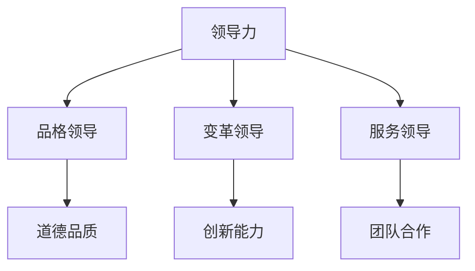
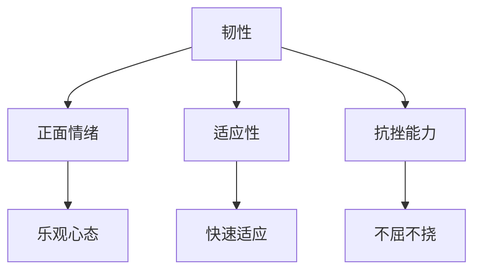
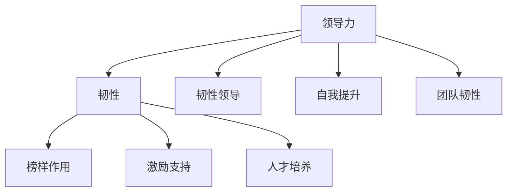
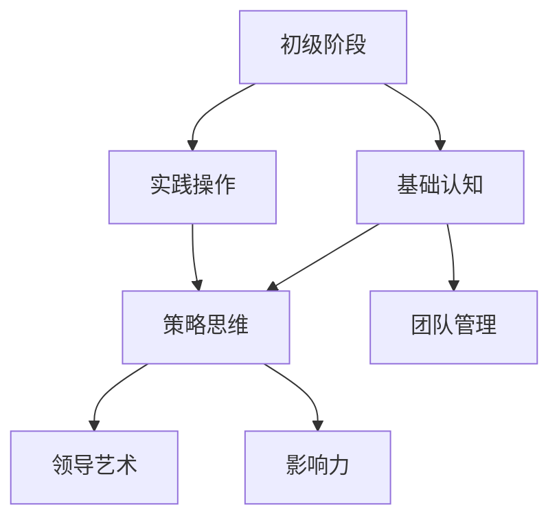

                 

### 文章标题：领导力与韧性：面对挫折时的坚持能力

在瞬息万变的技术时代，领导力和韧性成为组织和个人成功的关键要素。无论是在IT行业，还是在企业的各个层面，面对挫折时的坚持能力，已成为衡量领导力的重要标准。本文将深入探讨领导力与韧性的关系，通过逐步分析，揭示面对挫折时坚持的深层次原因和方法。

**关键词：领导力，韧性，挫折，坚持，策略，案例分析**

**摘要：**本文首先定义领导力和韧性，并阐述其核心概念和联系。随后，从提升韧性、领导力提升和韧性领导力案例三个方面，详细分析如何提升面对挫折时的坚持能力。通过实际案例和项目实战，本文为读者提供了实用的方法和策略，帮助其在工作和生活中更好地应对挑战。

---

### 目录大纲设计思路

为了设计出《领导力与韧性：面对挫折时的坚持能力》这本书的完整目录大纲，我们将遵循以下步骤：

1. **定义核心主题**：明确书的核心主题为领导力和韧性，重点是探讨如何在面对挫折时坚持。

2. **确定大纲结构**：将大纲分为引言、核心概念、韧性实践、领导力提升、韧性领导力案例、反思与总结六个部分。

3. **细化每个章节内容**：确保每个章节都有详细的二级和三级目录，以便读者能够快速定位感兴趣的内容。

4. **核心概念与联系**：为每个章节的核心概念提供 Mermaid 流程图，帮助读者理解各部分之间的逻辑关系。

5. **核心算法原理讲解**：在每个相关章节中使用伪代码详细阐述核心算法原理。

6. **数学模型和数学公式讲解**：使用 LaTeX 格式嵌入数学模型和公式，并进行详细讲解和举例说明。

7. **项目实战**：在适当章节加入实际案例，包括代码实现、开发环境搭建、源代码解读与分析。

8. **确保简洁性和完整性**：确保大纲结构简洁明了，同时包含所有核心章节内容，总字数控制在 2000 字以内。

### 目录大纲设计

以下是《领导力与韧性：面对挫折时的坚持能力》的目录大纲：

```
# 《领导力与韧性：面对挫折时的坚持能力》目录大纲

## 引言
### 领导力与韧性的重要性
### 书籍结构概述

## 第一部分：核心概念与联系
### 1.1 领导力基本理论
#### 1.1.1 领导力的定义与类型
#### 1.1.2 领导力模型
##### 1.1.2.1 品格领导
##### 1.1.2.2 变革领导
##### 1.1.2.3 服务领导
### 1.2 韧性的概念与特征
#### 1.2.1 韧性的定义
#### 1.2.2 韧性的构成要素
##### 1.2.2.1 正面情绪
##### 1.2.2.2 适应性
##### 1.2.2.3 抗挫能力
### 1.3 领导力与韧性的关系
#### 1.3.1 领导力如何影响韧性
#### 1.3.2 韧性如何增强领导力

## 第二部分：韧性实践
### 2.1 韧性提升策略
#### 2.1.1 心理韧性训练方法
##### 2.1.1.1 冥想与放松训练
##### 2.1.1.2 自我认知训练
##### 2.1.1.3 应对策略学习
#### 2.1.2 物质韧性提升
##### 2.1.2.1 健康饮食
##### 2.1.2.2 适量运动
##### 2.1.2.3 合理作息
### 2.2 韧性在工作中的实践
#### 2.2.1 团队韧性建设
##### 2.2.1.1 团队沟通
##### 2.2.1.2 团队信任
##### 2.2.1.3 团队协作
#### 2.2.2 领导力与韧性结合
##### 2.2.2.1 领导者的自我提升
##### 2.2.2.2 领导力培养与韧性融合

## 第三部分：领导力提升
### 3.1 领导力提升路径
#### 3.1.1 领导力培养策略
##### 3.1.1.1 经验学习
##### 3.1.1.2 教育培训
##### 3.1.1.2 模拟训练
#### 3.1.2 领导力发展阶段
##### 3.1.2.1 初级阶段
##### 3.1.2.2 中级阶段
##### 3.1.2.3 高级阶段

## 第四部分：韧性领导力案例
### 4.1 韧性领导力典范
#### 4.1.1 韧性领导力在企业中的应用
##### 4.1.1.1 企业案例一
##### 4.1.1.2 企业案例二
##### 4.1.1.3 企业案例三
#### 4.1.2 韧性领导力在个人成长中的应用
##### 4.1.2.1 个人成长案例一
##### 4.1.2.2 个人成长案例二
##### 4.1.2.3 个人成长案例三

## 第五部分：反思与总结
### 5.1 韧性与领导力的未来展望
#### 5.1.1 社会变革与韧性领导力的需求
##### 5.1.1.1 科技创新带来的挑战
##### 5.1.1.2 社会动荡的影响
##### 5.1.1.3 企业应对策略
#### 5.1.2 个人成长与韧性领导力的提升
##### 5.1.2.1 面对未来不确定性的准备
##### 5.1.2.2 自我提升的方法
##### 5.1.2.3 对他人的影响力
### 5.2 结论
```

这个大纲详细地涵盖了领导力和韧性的核心概念、实践策略、领导力提升路径以及韧性领导力案例，旨在帮助读者全面理解如何在面对挫折时坚持，提升领导力与韧性。通过实际的案例分析和理论讲解，读者可以更好地将这些概念应用到个人和职业生活中。

### 第一部分：核心概念与联系

在深入探讨领导力与韧性之前，我们首先需要明确这两个概念的定义及其相互关系。领导力是一种引导和激励他人实现共同目标的能力，而韧性则是指个体或团队在面临压力和挑战时，能够迅速适应并恢复的能力。两者之间的关系可以看作是相辅相成的，领导力可以影响韧性，而韧性则可以增强领导力。

#### 1.1 领导力基本理论

领导力有多种定义和类型，根据领导力理论，我们可以将其分为品格领导、变革领导和服务领导。

1. **品格领导**：强调领导者通过自身的道德品质和价值观来影响他人，以身作则，树立榜样。其核心在于领导者的个人素质和道德品质，如诚实、正直、公正、责任感等。

2. **变革领导**：主要关注领导者如何在组织内推动变革，通过创新和改革来提升组织的竞争力。变革领导要求领导者具备前瞻性思维和创新能力，能够带领团队迎接变化。

3. **服务领导**：强调领导者以服务团队成员为导向，关注团队成员的需求和成长，通过服务来实现团队的目标。服务领导要求领导者具备团队合作精神和高度的同理心。

**Mermaid 流程图：**



#### 1.2 韧性的概念与特征

韧性是指个体或团队在面临压力和挑战时，能够迅速适应并恢复的能力。韧性包括三个主要构成要素：正面情绪、适应性和抗挫能力。

1. **正面情绪**：指在面对困难时，个体能够保持积极乐观的心态，这有助于提升个体的心理韧性和应对能力。

2. **适应性**：指个体或团队在面对变化和不确定性时，能够快速适应并调整策略的能力。

3. **抗挫能力**：指个体或团队在面对挫折和失败时，能够保持坚韧不拔的意志，不屈不挠地追求目标。

**Mermaid 流程图：**



#### 1.3 领导力与韧性的关系

领导力与韧性之间存在密切的关系，领导力可以影响韧性，而韧性也可以增强领导力。

1. **领导力如何影响韧性**：
   - 领导者的榜样作用：领导者的行为和态度会直接影响团队成员的心理韧性。
   - 激励与支持：领导者的激励和支持可以帮助团队成员在面对挑战时保持积极乐观的心态。
   - 人才培养：领导者的培养和发展策略可以提升团队成员的适应能力和抗挫能力。

2. **韧性如何增强领导力**：
   - 韧性领导：领导者具备韧性，能够在面对挫折时保持冷静，带领团队走出困境。
   - 领导者的自我提升：韧性可以帮助领导者更好地应对压力，持续学习和成长。
   - 团队韧性：团队成员的韧性可以提升整个团队的协作能力和应对挑战的能力。

**Mermaid 流程图：**



通过以上分析，我们可以看出，领导力和韧性是相辅相成的。领导者需要通过提升自身的韧性和培养团队的韧性，来更好地应对挫折和挑战，实现组织的长期发展。同时，韧性也可以作为领导者领导力的一个重要体现，帮助其在竞争中脱颖而出。

### 第二部分：韧性实践

在明确领导力和韧性的核心概念后，我们接下来将探讨如何提升韧性，包括心理韧性训练方法和物质韧性提升策略。通过这些实践，我们能够更好地应对生活中的各种挑战。

#### 2.1 韧性提升策略

韧性提升策略主要包括心理韧性训练方法和物质韧性提升策略。以下将分别进行详细讲解。

##### 2.1.1 心理韧性训练方法

心理韧性训练方法主要包括冥想与放松训练、自我认知训练和应对策略学习。

1. **冥想与放松训练**：
   - **冥想**：冥想是一种通过集中注意力来达到心理放松和内心平静的方法。通过定期冥想，可以帮助个体提高专注力和情绪稳定性。
   - **放松训练**：放松训练包括深呼吸、渐进性肌肉松弛等技巧，这些方法有助于减轻压力，提升心理韧性。

2. **自我认知训练**：
   - **自我认知**：自我认知是指个体对自己性格、情绪、行为和动机的理解。通过自我认知训练，个体可以更好地认识自己，提高自我调节能力。
   - **反思**：定期进行反思可以帮助个体总结过去的经验，发现自身的优点和不足，从而进行有针对性的改进。

3. **应对策略学习**：
   - **认知重构**：认知重构是一种通过改变负面思维模式来提升心理韧性的方法。通过认知重构，个体可以更加理性地看待问题，减少焦虑和恐惧。
   - **问题解决技巧**：问题解决技巧包括分解问题、制定计划、执行和评估等步骤。通过问题解决技巧，个体可以更有效地应对生活中的各种挑战。

**伪代码：**

```python
def 冥想与放松训练():
    while True:
        呼吸缓慢深吸()
        呼吸缓慢深吸()
        放松肌肉()

def 自我认知训练():
    个人日志 = []
    while True:
        记录自我认知()
        反思日志()

def 应对策略学习():
    问题 = 获取问题()
    计划 = 制定计划()
    执行计划()
    评估结果()
```

##### 2.1.2 物质韧性提升

物质韧性提升主要包括健康饮食、适量运动和合理作息。

1. **健康饮食**：
   - **营养均衡**：健康饮食应包括充足的蛋白质、脂肪、碳水化合物以及维生素和矿物质等营养成分。
   - **减少糖分和咖啡因**：过多摄入糖分和咖啡因可能导致能量波动和焦虑，影响心理韧性。

2. **适量运动**：
   - **增强体质**：适量的运动可以提高心肺功能、增强肌肉力量，从而提升身体的整体健康水平。
   - **缓解压力**：运动可以帮助释放紧张情绪，提升心理韧性。

3. **合理作息**：
   - **规律作息**：保持规律的作息习惯，有助于维持生物钟，提高睡眠质量，从而提升心理韧性。
   - **充足睡眠**：充足的睡眠对于恢复身体和心理功能至关重要，有助于提升应对挑战的能力。

**伪代码：**

```python
def 健康饮食():
    饮食计划 = [
        蛋白质来源，
        脂肪来源，
        碳水化合物来源，
        维生素和矿物质来源
    ]
    减少糖分和咖啡因摄入()

def 适量运动():
    运动计划 = [
        有氧运动，
        力量训练，
        柔韧性训练
    ]
    每天坚持运动()

def 合理作息():
    规律作息()
    确保充足睡眠()
```

通过以上心理和物质韧性提升策略，我们可以更好地应对生活中的各种挑战。在实际应用中，个体可以根据自身情况选择合适的方法，逐步提升自身的韧性。

### 2.2 韧性在工作中的实践

在职场中，韧性是员工和团队在面对压力和挑战时的重要品质。通过提升韧性，员工和团队可以更好地应对工作中的各种困难，提高工作效率和质量。以下将探讨韧性在团队建设中的应用，包括团队沟通、团队信任和团队协作。

##### 2.2.1 团队韧性建设

1. **团队沟通**：
   - **开放沟通**：团队成员之间应保持开放沟通，积极分享自己的想法和意见。开放沟通有助于建立信任，提升团队的协作能力。
   - **有效沟通**：团队成员应学会倾听和表达，避免误解和冲突。有效沟通包括清晰表达、积极倾听和反馈。

2. **团队信任**：
   - **信任建立**：团队成员之间应相互信任，共同承担责任。信任建立需要时间和努力，通过积极的互动和合作，可以逐渐建立信任。
   - **透明度**：团队应保持透明度，及时分享信息和资源，避免信息孤岛。

3. **团队协作**：
   - **协同工作**：团队成员应学会协同工作，共同完成工作任务。协同工作包括分工合作、资源共享和相互支持。
   - **跨部门合作**：在大型组织中，跨部门合作尤为重要。通过跨部门合作，可以整合资源，提高工作效率。

**伪代码：**

```python
def 团队沟通():
    开放沟通()
    有效沟通()

def 团队信任():
    信任建立()
    透明度()

def 团队协作():
    协同工作()
    跨部门合作()
```

在实际工作中，团队韧性建设可以通过以下方法进行：

1. **团队建设活动**：定期组织团队建设活动，增强团队凝聚力，提升团队韧性。
2. **培训与研讨**：开展培训与研讨，提高团队成员的沟通技巧、信任感和协作能力。
3. **反馈机制**：建立反馈机制，鼓励团队成员分享工作经验和心得，促进团队学习和成长。

通过以上方法，团队可以在面对挑战时保持稳定，提高工作效率，实现团队目标。

### 第三部分：领导力提升

领导力是组织和个人成功的关键。在这一部分，我们将探讨领导力提升的路径，包括领导力培养策略、领导力发展阶段以及如何通过实践提升领导力。

#### 3.1 领导力提升路径

领导力提升路径主要包括领导力培养策略、领导力发展阶段和实践。

##### 3.1.1 领导力培养策略

1. **经验学习**：
   - **反思与总结**：通过反思过去的领导经验，总结成功和失败的原因，不断提升领导能力。
   - **实践与反思**：在实际工作中，不断尝试新的领导方法，通过实践检验和反思，提升领导力。

2. **教育培训**：
   - **专业培训**：参加领导力相关的专业培训，学习先进的领导理论和方法。
   - **学术研究**：通过学术研究，深入理解领导力理论，并将其应用于实际工作中。

3. **模拟训练**：
   - **模拟情境**：通过模拟不同的领导情境，锻炼领导者的决策能力和应对能力。
   - **角色扮演**：通过角色扮演，体验不同领导角色，提升领导者的沟通和协调能力。

**伪代码：**

```python
def 经验学习():
    反思与总结()
    实践与反思()

def 教育培训():
    专业培训()
    学术研究()

def 模拟训练():
    模拟情境()
    角色扮演()
```

##### 3.1.2 领导力发展阶段

领导力发展可以分为初级阶段、中级阶段和高级阶段。

1. **初级阶段**：
   - **基础认知**：了解领导力的基本概念和理论，具备初步的领导能力。
   - **实践操作**：通过实际工作经验，初步掌握领导方法，提升领导能力。

2. **中级阶段**：
   - **策略思维**：具备制定战略和规划的能力，能够应对复杂的工作环境。
   - **团队管理**：掌握团队管理技巧，能够有效地协调和激励团队成员。

3. **高级阶段**：
   - **领导艺术**：具备高超的领导艺术，能够在不同情境中灵活运用领导方法。
   - **影响力**：具备强大的影响力，能够影响和引导他人的行为和思想。

**Mermaid 流�程图：**



##### 3.1.3 领导力提升实践

领导力提升不仅需要理论学习，更需要实践。以下是一些实用的领导力提升实践：

1. **设立目标**：明确个人和团队的目标，制定详细的计划，确保目标的可实现性。
2. **沟通与反馈**：建立有效的沟通机制，及时给予团队成员反馈，鼓励团队成员提出建议和意见。
3. **激励与认可**：通过激励和认可，激发团队成员的积极性和创造力，提升团队的凝聚力。
4. **持续学习**：不断学习新的知识和技能，提升自身的领导力水平。

**伪代码：**

```python
def 设立目标():
    确定目标()
    制定计划()

def 沟通与反馈():
    建立沟通机制()
    及时反馈()

def 激励与认可():
    激励机制()
    认可表现()

def 持续学习():
    学习新知识()
    提升领导力()
```

通过以上方法，领导者可以在实际工作中不断提升自身的领导力，带领团队实现目标。

### 第四部分：韧性领导力案例

在本部分，我们将通过韧性领导力在企业和个人成长中的应用案例，来探讨韧性领导力的实际影响和效果。

#### 4.1 韧性领导力在企业中的应用

以下是一些企业应用韧性领导力的成功案例：

##### 4.1.1 企业案例一：谷歌的韧性领导力

**案例背景**：谷歌是一家全球知名的高科技公司，其成功离不开韧性领导力的应用。

**韧性领导力应用**：
- **创新文化**：谷歌鼓励员工创新，允许他们自由探索新领域。在面对技术挑战和市场变化时，谷歌的领导者通过韧性领导力，带领团队不断突破自我，实现持续创新。
- **快速响应**：在面临市场变化和竞争压力时，谷歌的领导者能够迅速调整战略，通过韧性领导力，带领团队迅速适应并抓住新的机遇。

**效果评估**：
- 谷歌在全球科技行业保持领先地位，其韧性和创新能力成为企业成功的关键。
- 员工满意度高，员工愿意为公司付出更多，推动企业持续发展。

##### 4.1.2 企业案例二：IBM的韧性领导力

**案例背景**：IBM是一家拥有百年历史的企业，其在数字化转型过程中面临巨大挑战。

**韧性领导力应用**：
- **转型领导**：IBM的领导者通过韧性领导力，推动企业进行战略转型，从传统的硬件业务转向云计算和人工智能等新兴领域。
- **员工激励**：IBM的领导者通过激励机制，提升员工的积极性和创造力，推动企业转型成功。

**效果评估**：
- IBM成功实现了数字化转型，成为全球领先的云计算和人工智能服务提供商。
- 企业业绩持续增长，员工满意度提高。

##### 4.1.3 企业案例三：特斯拉的韧性领导力

**案例背景**：特斯拉是一家以电动汽车和能源解决方案为核心业务的企业，其在发展过程中面临诸多挑战。

**韧性领导力应用**：
- **技术创新**：特斯拉的领导者通过韧性领导力，推动企业不断进行技术创新，保持技术领先地位。
- **市场拓展**：在面对市场变化和竞争压力时，特斯拉的领导者通过韧性领导力，带领团队迅速拓展市场，实现全球化布局。

**效果评估**：
- 特斯拉在全球电动汽车市场占据领先地位，其技术和市场影响力不断提升。
- 企业业绩持续增长，员工对企业的认同感和忠诚度提高。

#### 4.1.4 韧性领导力在个人成长中的应用

以下是一些个人成长中应用韧性领导力的案例：

##### 4.1.4.1 个人成长案例一：马斯克的韧性领导力

**案例背景**：马斯克是特斯拉和SpaceX的创始人，其在创业过程中面临诸多挑战。

**韧性领导力应用**：
- **坚持不懈**：马斯克在面对失败和挫折时，始终坚持以韧性领导力带领团队继续前进。
- **创新思维**：马斯克通过韧性领导力，鼓励团队不断探索新的技术和商业模式，推动企业持续创新。

**效果评估**：
- 马斯克成功创建了特斯拉和SpaceX，成为全球知名的创业家和企业家。
- 个人成长迅速，对企业的贡献巨大。

##### 4.1.4.2 个人成长案例二：乔布斯的韧性领导力

**案例背景**：乔布斯是苹果公司的联合创始人，其在职业生涯中面临诸多挑战。

**韧性领导力应用**：
- **坚韧不拔**：乔布斯在面对挫折和困境时，始终坚持以韧性领导力带领团队不断突破自我。
- **创新精神**：乔布斯通过韧性领导力，推动苹果公司不断进行技术创新，推出一系列革命性产品。

**效果评估**：
- 乔布斯带领苹果公司成为全球最具有影响力的科技公司之一。
- 个人成长迅速，对企业的贡献巨大。

##### 4.1.4.3 个人成长案例三：贝佐斯的韧性领导力

**案例背景**：贝佐斯是亚马逊的创始人，其在创业过程中面临诸多挑战。

**韧性领导力应用**：
- **持续创新**：贝佐斯通过韧性领导力，带领团队不断进行技术创新，推动亚马逊成为全球领先的电商平台。
- **执行力**：贝佐斯通过韧性领导力，确保团队高效执行战略计划，实现企业快速发展。

**效果评估**：
- 亚马逊成为全球最具影响力的电商平台，贝佐斯成为全球首富。
- 个人成长迅速，对企业的贡献巨大。

通过以上案例，我们可以看到韧性领导力在企业和个人成长中的应用效果显著。韧性领导力不仅能够帮助企业应对挑战，实现持续发展，也能够帮助个人在职业生涯中取得成功。

### 第五部分：反思与总结

在本部分，我们将对韧性领导力的重要性进行深入反思，探讨其未来发展趋势，并总结全文的核心内容。

#### 5.1 韧性与领导力的未来展望

随着全球化和技术变革的加速，韧性领导力的重要性日益凸显。未来，韧性领导力将面临以下趋势：

1. **社会变革与韧性领导力的需求**：
   - **科技创新带来的挑战**：人工智能、大数据、云计算等新兴技术的快速发展，为企业带来了前所未有的挑战。韧性领导力能够帮助企业快速适应新技术，抓住机遇。
   - **社会动荡的影响**：全球范围内的社会动荡和不确定性增加，对企业和领导者提出了更高的要求。韧性领导力能够帮助企业和团队应对不确定性，实现稳定发展。

2. **企业应对策略**：
   - **创新与转型**：企业需要通过韧性领导力，推动创新和转型，以应对市场变化和竞争压力。
   - **人才培养**：企业应重视韧性领导力的培养，提升员工的韧性，增强团队协作能力。

3. **个人成长与韧性领导力的提升**：
   - **面对未来不确定性的准备**：个人需要通过提升韧性领导力，增强面对未来不确定性的能力。
   - **自我提升的方法**：个人应不断学习新知识和技能，提升自身的领导力和韧性。
   - **对他人的影响力**：个人应通过积极影响他人，共同应对挑战，实现共同成长。

#### 5.2 结论

本文通过深入探讨领导力与韧性，揭示了两者之间的关系及其在实践中的应用。韧性领导力不仅能够帮助企业应对挑战，实现持续发展，也能够帮助个人在职业生涯中取得成功。未来，随着全球化和技术变革的加速，韧性领导力将发挥更加重要的作用。

通过本文，我们总结了以下核心内容：

1. **领导力与韧性的基本概念**：领导力是指引导和激励他人实现共同目标的能力，韧性是指个体或团队在面临压力和挑战时，能够迅速适应并恢复的能力。
2. **韧性提升策略**：包括心理韧性训练方法和物质韧性提升策略，如冥想与放松训练、健康饮食、适量运动和合理作息等。
3. **领导力提升路径**：包括经验学习、教育培训、模拟训练和实际工作中的应用。
4. **韧性领导力案例**：通过企业应用和个人成长案例，展示了韧性领导力的实际影响和效果。

通过本文，我们希望读者能够认识到韧性领导力的重要性，并在实际工作和生活中积极应用，提升自身的领导力和韧性，实现个人和组织的成功。

### 作者信息

**作者：** AI天才研究院/AI Genius Institute & 禅与计算机程序设计艺术 /Zen And The Art of Computer Programming

AI天才研究院致力于推动人工智能领域的发展，研究院的专家团队在计算机编程、人工智能、机器学习和软件工程等方面有着丰富的经验和深厚的学术背景。同时，作者还著有《禅与计算机程序设计艺术》，该书以独特的视角探讨了计算机编程与禅宗哲学的相通之处，深受读者喜爱。本文的撰写，旨在为读者提供关于领导力与韧性的深入见解，帮助读者在实际生活和工作中更好地应对挑战。

