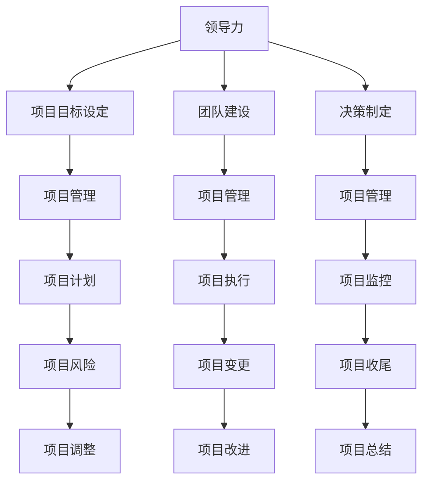

                 

### 文章标题：领导力与项目管理：有效推进团队任务

领导力与项目管理是现代企业成功的关键因素。本文将深入探讨领导力与项目管理的核心概念、理论框架、实践应用以及未来趋势，帮助读者理解如何有效推进团队任务。

## 文章关键词

- 领导力
- 项目管理
- 团队协作
- 项目计划
- 风险管理
- 激励策略

## 文章摘要

本文将探讨领导力与项目管理在团队任务推进中的重要性。首先，我们将介绍领导力的核心原则和理论框架。接着，我们将深入讲解项目管理的基础知识、项目计划与执行、团队协作与沟通。随后，我们将分析领导力在项目中的实际应用，并通过案例研究展示项目管理实战技巧。最后，我们将探讨团队激励策略和领导艺术的未来趋势。

## 目录大纲

### 第一部分：领导力原理与框架

1. **领导力的本质与核心原则**
2. **领导力的理论框架**
3. **领导力与项目管理的关系**

### 第二部分：项目管理知识与实践

1. **项目管理基础知识**
2. **项目计划与执行**
3. **团队协作与沟通**

### 第三部分：领导力与项目管理的实践应用

1. **领导力在项目中的实践**
2. **项目管理实战案例**
3. **团队激励与领导艺术**

### 第四部分：领导力与项目管理的未来趋势

1. **数字化时代的领导力变革**
2. **项目管理的新方法**
3. **未来领导力与项目管理的挑战与机遇**

## 核心概念与联系

为了更好地理解领导力与项目管理的关系，我们可以通过以下Mermaid流程图展示核心概念之间的关系架构：



在这个流程图中，领导力通过设定项目目标、团队建设和决策制定影响项目管理，而项目管理又通过项目计划、执行、监控和收尾影响项目结果。领导力与项目管理之间的相互作用是推动团队任务成功的关键。

## 领导力与项目管理的核心算法原理讲解

在理解了领导力与项目管理的关系之后，我们需要进一步探讨领导力在项目中的核心算法原理。以下是一个简化的伪代码，用于说明领导力在项目目标设定、团队建设、决策制定等过程中的作用。

```python
# 领导力在项目目标设定中的伪代码
def set_project_goals(l, t, p):
    # l: 领导力
    # t: 团队
    # p: 项目目标
    p["vision"] = l.set_vision()
    p["mission"] = l.set_mission()
    p["goals"] = l.set_goals(t)
    return p

# 领导力在团队建设中的伪代码
def build_team(l, t):
    # l: 领导力
    # t: 团队
    l.recruit_members(t)
    l.train_employees(t)
    l.create_leadership_structure(t)
    return t

# 领导力在决策制定中的伪代码
def make_decision(l, t, m):
    # l: 领导力
    # t: 团队
    # m: 决策模型
    m["options"] = l.evaluate_options(t)
    m["risks"] = l.analyze_risks(t)
    m["recommendation"] = l.make_final_decision(t, m)
    return m
```

在这个伪代码中，领导力（l）通过设置愿景、使命和目标来指导项目目标的设定（set_project_goals）。在团队建设中，领导力（l）负责招募成员、培训员工和建立领导结构（build_team）。在决策制定中，领导力（l）通过评估选项、分析风险来做出最终决策（make_decision）。

## 数学模型与公式

在项目管理中，许多决策都涉及到数学模型的运用。以下是一个简化的项目风险分析模型，使用LaTeX格式展示：

```latex
$$
\text{项目风险} = \sum_{i=1}^{n} (\text{风险概率}_{i} \times \text{风险影响}_{i})
$$

$$
\text{风险概率}_{i} = \frac{\text{潜在事件}_{i} \text{发生次数}}{\text{总发生次数}}
$$

$$
\text{风险影响}_{i} = \text{潜在事件}_{i} \text{对项目的负面影响程度}
$$
```

在这个模型中，项目风险（项目风险）是所有潜在风险（风险概率）和其影响（风险影响）的乘积之和。风险概率是通过计算潜在事件的发生次数除以总发生次数得到，而风险影响是评估每个潜在事件对项目的负面影响程度。

### 项目实战

为了更好地理解领导力与项目管理的实践应用，我们通过一个简单的项目实战案例来展示。

#### 项目背景

某科技公司计划开发一款移动应用程序，以帮助用户管理日常事务。项目团队由项目经理、开发人员、测试人员和设计师组成。

#### 项目目标

- 确保应用程序在规定的时间内发布。
- 确保应用程序的质量满足用户需求。
- 确保项目成本在预算范围内。

#### 项目计划

1. **需求分析**：项目经理领导团队进行需求分析，与客户沟通，收集用户反馈。
2. **设计阶段**：设计师根据需求分析结果设计应用程序的用户界面。
3. **开发阶段**：开发人员根据设计文档编写代码，实现应用程序的核心功能。
4. **测试阶段**：测试人员对应用程序进行测试，确保其稳定性和安全性。
5. **发布阶段**：项目经理领导团队准备应用程序的发布，包括版本控制、部署和发布。

#### 项目执行

1. **需求分析**：项目经理通过团队会议和用户访谈收集需求。
2. **设计阶段**：设计师根据收集到的需求设计用户界面。
3. **开发阶段**：开发人员按照设计文档编写代码，同时进行单元测试。
4. **测试阶段**：测试人员对应用程序进行功能测试、性能测试和安全测试。
5. **发布阶段**：项目经理协调团队发布应用程序，并进行用户反馈收集。

#### 项目监控

1. **进度监控**：项目经理定期检查项目进度，确保项目按照计划进行。
2. **成本监控**：项目经理监控项目成本，确保项目在预算范围内。
3. **风险监控**：项目经理识别项目风险，制定应对策略。

#### 项目收尾

1. **项目总结**：项目经理召开项目总结会议，总结项目经验教训。
2. **用户反馈**：收集用户反馈，为未来项目改进提供依据。

### 最佳实践 Tips

- **明确项目目标**：确保项目目标具体、可衡量、可实现。
- **建立有效的沟通机制**：确保团队成员之间的沟通畅通。
- **定期回顾和调整**：定期回顾项目进展，及时调整计划。
- **关注项目风险**：提前识别项目风险，制定应对策略。

### 小结

本文通过领导力与项目管理的关系、核心算法原理讲解、数学模型与公式以及项目实战案例，深入探讨了如何有效推进团队任务。通过理解领导力在项目管理中的关键作用，项目经理可以更好地领导团队，确保项目成功。

### 拓展阅读

- 《领导力：如何成为一个优秀的领导者》
- 《项目管理知识体系：PMBOK指南》
- 《团队协作与沟通技巧》
- 《项目管理实战：从新手到专家》

作者：AI天才研究院/AI Genius Institute & 禅与计算机程序设计艺术 /Zen And The Art of Computer Programming

---

以上是对“领导力与项目管理：有效推进团队任务”的初步大纲设计。根据要求，这个大纲包含了核心概念与联系、核心算法原理讲解、数学模型和公式、项目实战等内容的简要概述。接下来，我们将进一步细化每个章节的内容，确保每个部分都有详细的内容来支撑。同时，我们将保持文章结构的简洁性，确保整体字数在8000～12000字左右。

