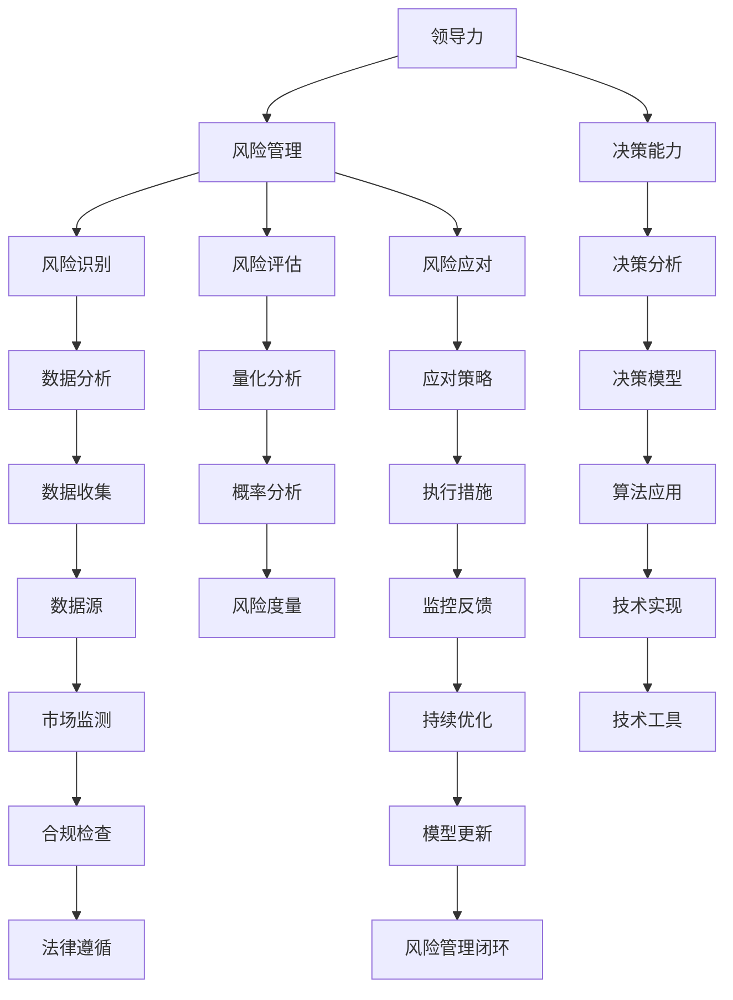

                 


### 文章标题：领导力与风险智能：在不确定性中识别机遇

关键词：领导力、风险智能、不确定性、机遇识别、算法原理、数学模型、项目实战

摘要：本文将深入探讨领导力与风险智能在不确定性的环境中如何相互结合，以识别和抓住机遇。通过对领导力与风险智能的概述、核心概念联系、算法原理讲解、数学模型应用和实际项目案例的分析，本文旨在帮助读者理解如何在变化莫测的商业环境中，运用领导力和风险智能来引导团队，应对风险，把握机遇。

### 目录大纲

#### 第一部分：领导力与风险智能概述

**第1章 引言**

1.1.1 领导力与风险智能的重要性

1.1.2 在不确定性中寻找机遇

**第2章 领导力概述**

2.1 领导力的定义与特征

2.2 领导力的核心要素

2.3 领导力的演变与发展

**第3章 风险智能概述**

3.1 风险智能的定义与类型

3.2 风险智能的核心要素

3.3 风险智能的实践应用

#### 第二部分：领导力与风险智能的联系

**第4章 领导力与风险智能的核心概念与联系**

4.1 Mermaid 流程图：领导力与风险智能的联系

**第5章 风险识别与应对**

5.1 风险识别的核心算法原理讲解

5.2 风险识别的伪代码示例

**第6章 风险评估与量化**

6.1 风险评估的数学模型讲解

6.2 风险评估的数学公式示例

**第7章 风险应对策略与决策**

7.1 风险应对策略的制定

7.2 风险决策的数学模型讲解

7.3 风险决策的伪代码示例

#### 第三部分：领导力与风险智能在实际中的应用

**第8章 项目实战：领导力与风险智能在企业管理中的应用**

8.1 项目背景与目标

8.2 项目实施过程

8.3 项目成果与分析

**第9章 项目实战：领导力与风险智能在创业中的运用**

9.1 创业背景与挑战

9.2 风险识别与应对策略

9.3 项目成果与分析

#### 第四部分：领导力与风险智能的未来展望

**第10章 领导力与风险智能的未来发展趋势**

10.1 技术创新对未来领导力的影响

10.2 风险智能在不确定性环境中的角色

10.3 未来领导力的新挑战与新机遇

### 第1章 引言

#### 1.1.1 领导力与风险智能的重要性

领导力是一种艺术，它是组织成功的关键因素。在快速变化和高度不确定的商业环境中，领导力显得尤为重要。领导力的核心在于如何引导和激励团队成员，共同面对挑战，实现组织的战略目标。而风险智能则是对不确定性的预见和管理能力，通过技术手段对潜在风险进行识别、评估和应对。

在当今复杂多变的环境中，领导力与风险智能的结合成为了企业竞争力的关键。领导力帮助团队识别机遇，而风险智能则确保企业在抓住机遇的同时，能够有效应对潜在的风险。例如，在技术快速迭代的市场中，领导力可以帮助企业及时调整战略，抓住创新机遇；而风险智能则能够帮助企业识别技术变革中的潜在风险，并提前制定应对策略。

#### 1.1.2 在不确定性中寻找机遇

不确定性是当今商业环境的常态，市场变化莫测，技术发展迅猛，企业面临的挑战日益增加。在这样的环境中，领导力与风险智能的结合显得尤为重要。首先，领导力可以帮助企业领导者预见变化，把握市场趋势，识别潜在的机遇。通过高效的沟通和团队协作，领导者能够动员全体成员共同应对不确定性，将挑战转化为机遇。

其次，风险智能在不确定性环境中发挥着关键作用。通过数据分析和机器学习等先进技术，企业可以提前识别潜在的风险，并对这些风险进行量化评估。这种能力使得企业在面对不确定性时，能够做出更加明智的决策，从而抓住机遇，避免风险。

总的来说，领导力与风险智能的结合，使得企业能够在不确定性中寻找机遇，实现持续增长。本章将深入探讨这两个领域，通过详细的分析和实际案例，帮助读者理解如何在不确定的环境中，运用领导力和风险智能，实现组织的成功。

### 第2章 领导力概述

#### 2.1 领导力的定义与特征

领导力是一种艺术，它涉及到如何引导和影响他人，共同实现目标的能力。从广义上讲，领导力不仅限于管理和商业环境，还包括家庭、社区和公益组织等各个领域。然而，在商业环境中，领导力尤为重要，它是企业成功的关键因素之一。

领导力的定义可以有多种解释，但核心概念是相似的：领导力是一种能够激发他人潜能、达成共同目标的能力。它不仅仅是职位赋予的权威，更是一种通过沟通、激励、影响和示范来引导团队的能力。

领导力的特征主要包括以下几点：

1. **使命感（Mandate）**：领导者需要有明确的使命感和愿景，这能够激励团队为实现共同目标而努力。
2. **影响力（Influence）**：领导力不仅仅依靠职位和权力，更多的是通过个人魅力和影响力来引导他人。
3. **领导风格多样性（Leadership Style Diversity）**：不同的情境需要不同的领导风格，灵活运用多种领导风格能够更好地适应各种环境。
4. **团队建设（Team Building）**：领导者需要具备团队建设的能力，通过建立信任、沟通和协作，提高团队的整体绩效。
5. **决策能力（Decision Making）**：领导力包括做出明智决策的能力，这需要对市场和团队情况有深入的了解。

#### 2.2 领导力的核心要素

领导力的核心要素是构成领导力理论框架的基础，它们在不同的情境下可能有所不同，但总体上可以归纳为以下几点：

1. **沟通（Communication）**：沟通是领导力的基础。领导者需要通过有效的沟通来传递信息、建立信任、激励团队和解决冲突。
2. **团队建设（Team Building）**：团队建设是领导力的核心要素之一。领导者需要建立高效的团队，通过促进团队成员之间的信任、协作和共同目标来实现团队绩效的最大化。
3. **决策能力（Decision Making）**：决策能力是领导力的关键。领导者需要具备快速决策和调整策略的能力，以应对不断变化的环境和挑战。
4. **激励（Motivation）**：激励是领导者激发团队成员潜力和积极性的一种方式。通过奖励、认可和提供发展机会来激励团队成员是领导力的一个重要方面。
5. **变革管理（Change Management）**：在快速变化的商业环境中，领导者需要具备变革管理的能力。这包括识别变化的需求、制定变革策略、沟通变革方案和推动变革的实施。

#### 2.3 领导力的演变与发展

领导力是一个不断演变和发展的概念。随着社会和经济环境的变化，领导力的理论和实践也在不断进步。以下是领导力演变和发展的几个关键阶段：

1. **传统领导力**：在早期，领导力主要依赖于职位和权力。领导者通过权威和强制手段来管理团队，强调命令与控制。
2. **现代领导力**：随着管理学和心理学的发展，现代领导力开始强调沟通、激励和团队建设。领导者不再是单纯的指挥者，而是团队成员的合作伙伴和激励者。
3. **变革型领导力**：变革型领导力强调领导者通过激发团队成员的潜力来推动组织的变革。这种领导风格注重创新、愿景和价值观的塑造。
4. **赋能型领导力**：赋能型领导力将权力和责任下放给团队成员，鼓励他们自主决策和承担责任。这种领导风格强调信任、自主性和创新能力。

总的来说，领导力是一个动态发展的概念，它随着时代的变化而不断进化。不同的领导风格和理论在不同的环境和情境下有着不同的应用价值。理解和掌握不同类型的领导力，对于领导者来说是非常重要的。

### 第3章 风险智能概述

#### 3.1 风险智能的定义与类型

风险智能是指利用先进技术手段对潜在风险进行识别、评估和应对的能力。在当今复杂多变的商业环境中，风险智能成为企业保持竞争力、实现可持续发展的关键因素。风险智能的定义涵盖了以下几个方面：

1. **数据收集**：风险智能首先依赖于大量数据的收集。这些数据可以来源于内部系统、外部市场监测、社交媒体和其他数据源。
2. **数据分析**：收集到的数据需要通过数据分析技术进行处理，以识别潜在的风险因素。
3. **风险识别**：通过对数据的分析，风险智能系统能够识别出可能存在的风险，例如市场波动、技术故障、法律合规问题等。
4. **风险评估**：风险识别后，需要对风险进行量化评估，以确定其可能造成的影响和损失。
5. **风险应对**：最后，根据风险评估的结果，制定相应的风险应对策略和措施，以最大限度地降低风险。

风险智能可以分为以下几种类型：

1. **定量风险智能**：通过数学模型和统计方法对风险进行量化分析。例如，使用蒙特卡罗模拟进行风险评估，使用回归分析进行风险预测。
2. **定性风险智能**：基于专家知识和主观判断的风险分析。这种方法通常用于初步的风险识别和定性评估，以确定哪些风险需要进一步量化分析。
3. **混合型风险智能**：结合定量和定性分析方法，以提高风险识别和评估的准确性。

#### 3.2 风险智能的核心要素

风险智能的核心要素是构成其有效性的基础。以下是风险智能的核心要素：

1. **数据质量**：高质量的数据是风险智能的前提。数据需要准确、完整、及时，并且来自可靠的数据源。
2. **算法模型**：风险智能依赖于各种算法模型，如机器学习模型、深度学习模型、回归模型等，以对风险进行预测和评估。
3. **实时监控**：风险智能系统需要具备实时监控能力，以快速识别新的风险因素和变化。
4. **风险评估体系**：建立一套完整的风险评估体系，包括风险识别、风险评估、风险应对等环节。
5. **风险应对策略**：根据风险评估的结果，制定相应的风险应对策略和措施，以确保企业能够有效应对各种风险。

#### 3.3 风险智能的实践应用

风险智能在多个领域有广泛的应用，以下是几个典型的实践应用场景：

1. **金融行业**：在金融领域，风险智能被广泛应用于信用风险评估、市场风险监测、合规检查等。例如，通过分析客户的历史交易数据和行为模式，银行可以更准确地评估客户的信用风险。
2. **医疗行业**：在医疗领域，风险智能可以帮助医院预测和应对医疗资源短缺、药品供应链风险等。例如，通过分析医疗数据，医院可以提前预测流感高峰期的患者数量，从而提前做好资源配置。
3. **企业风险管理体系**：企业可以通过建立风险智能系统，对各种潜在风险进行实时监控和评估，以提高风险管理效率。例如，企业可以定期进行风险扫描，识别潜在的安全漏洞和业务风险。
4. **供应链管理**：在供应链管理中，风险智能可以帮助企业识别供应链中的潜在风险，如供应商信用风险、运输风险等。通过及时的风险识别和应对，企业可以最大限度地降低供应链中断的风险。

总的来说，风险智能是现代企业不可或缺的一部分。通过利用先进的技术手段，企业可以更有效地识别、评估和应对各种潜在风险，从而确保业务的稳定和可持续发展。

### 第4章 领导力与风险智能的核心概念与联系

#### 4.1 Mermaid 流程图：领导力与风险智能的联系

为了更好地理解领导力与风险智能之间的联系，我们可以通过Mermaid流程图来展示它们在不同阶段和领域的互动关系。



通过这个Mermaid流程图，我们可以清晰地看到领导力与风险智能之间的多个连接点。以下是对图中的关键节点进行解释：

- **领导力**：作为整体框架，领导力贯穿于风险管理的各个环节，从决策能力到决策分析，都体现了领导者对风险管理的指导和影响。
- **风险管理**：这是领导力与风险智能的核心交叉点，包括风险识别、风险评估和风险应对，是企业应对不确定性的关键环节。
- **决策能力**：领导者需要具备高效的决策能力，通过数据分析、决策模型等技术手段来支持决策过程。
- **数据收集**：风险智能的起点是数据收集，这些数据来自于市场监测、合规检查等多个渠道，是后续分析的基础。
- **数据分析**：通过对收集到的数据进行分析，可以识别潜在的风险因素。
- **风险评估**：利用概率分析和量化分析对风险进行评估，帮助领导者制定应对策略。
- **风险应对**：根据风险评估的结果，领导者需要制定并执行相应的风险应对策略。
- **监控反馈**：通过实时监控和反馈机制，领导者可以不断调整和优化风险应对策略。

通过这个流程图，我们可以看到领导力与风险智能之间是如何相互联系和协同作用的。领导者的决策能力和风险管理能力，结合风险智能的技术手段，共同构成了一个高效的风险管理闭环。这种结合不仅有助于企业识别和应对不确定性，还能够帮助企业在变化莫测的市场环境中抓住机遇，实现可持续发展。

### 第5章 风险识别与应对

#### 5.1 风险识别的核心算法原理讲解

风险识别是风险管理的第一步，也是最为关键的一步。有效的风险识别可以帮助企业提前发现潜在的风险，从而采取预防措施。在风险识别过程中，核心算法原理扮演着至关重要的角色。以下是几种常见且重要的风险识别算法原理：

1. **机器学习算法**：

   机器学习算法在风险识别中具有广泛的应用。它通过训练模型，从历史数据中学习到风险模式，然后对新数据进行预测。常见的机器学习算法包括决策树、随机森林、支持向量机（SVM）和神经网络等。

   **原理**：机器学习算法通过特征工程提取数据中的关键特征，然后使用这些特征训练模型。训练后的模型可以对新数据进行风险预测，例如，通过识别异常交易模式来识别金融欺诈风险。

   **示例**：假设我们使用决策树算法来识别欺诈交易。首先，我们需要收集历史交易数据，并从中提取特征，如交易金额、交易时间、交易频率等。然后，我们使用这些特征来训练决策树模型，模型会根据这些特征构建决策路径，以识别潜在的欺诈交易。

2. **数据挖掘算法**：

   数据挖掘算法用于从大量数据中发现隐藏的模式和关联。这些模式和关联可以用来识别潜在的风险。

   **原理**：数据挖掘算法包括关联规则学习、聚类分析、分类分析等。关联规则学习可以识别出数据之间的关联，例如，通过分析客户购买行为，发现某些商品经常一起购买。聚类分析可以将相似的数据点分组，从而识别出潜在的风险群体。

   **示例**：假设我们使用关联规则学习来识别供应链中的风险。首先，我们需要收集供应链中的交易数据，然后使用关联规则学习算法来分析这些数据。通过分析，我们可能会发现某些供应商经常与某些运输公司合作，而这些合作可能存在风险，例如运输延误或质量问题。

3. **异常检测算法**：

   异常检测算法用于识别数据中的异常值，这些异常值可能代表潜在的风险。

   **原理**：异常检测算法通过建立正常行为的标准模型，然后检测数据中的异常值。常见的异常检测算法包括孤立森林、局部异常因数（LOF）和基于密度的异常检测算法等。

   **示例**：假设我们使用孤立森林算法来识别网络安全风险。首先，我们需要收集网络流量数据，并建立正常流量模型。然后，孤立森林算法会对新数据进行检测，如果数据点与其他数据点相隔离，那么它就可能代表潜在的网络攻击。

通过上述核心算法原理的讲解，我们可以看到，风险识别是一个复杂但非常重要的过程。这些算法通过从数据中提取模式、关联和异常值，帮助我们提前识别潜在的风险。在实际应用中，这些算法可以结合多种数据源和特征，以提高风险识别的准确性和可靠性。

#### 5.2 风险识别的伪代码示例

为了帮助读者更好地理解风险识别的核心算法原理，我们以下提供几种常见的风险识别算法的伪代码示例。

**1. 决策树算法伪代码示例**

```python
# 输入：特征数据 matrix，标签 data
# 输出：决策树模型 model

def build_decision_tree(data, features):
    if all_labels_equal(data):  # 基准条件，所有标签相同
        return majority_class(data)  # 返回多数类
    elif no_more_features(data, features):  # 没有更多特征可用
        return majority_class(data)  # 返回多数类
    else:
        # 选择最优特征
        best_feature = select_best_feature(data, features)
        # 构建子树
        for value in unique_values(data[best_feature]):
            sub_data = filter_data(data, best_feature, value)
            sub_tree = build_decision_tree(sub_data, features_without(best_feature))
            tree[best_feature][value] = sub_tree
        return tree

def select_best_feature(data, features):
    best_score = -1
    best_feature = None
    for feature in features:
        score = information_gain(data, feature)
        if score > best_score:
            best_score = score
            best_feature = feature
    return best_feature

def information_gain(data, feature):
    # 计算信息增益
    pass

def all_labels_equal(data):
    # 判断所有标签是否相同
    pass

def no_more_features(data, features):
    # 判断是否没有更多特征可用
    pass

def majority_class(data):
    # 返回多数类
    pass

def features_without(feature):
    # 返回除了指定特征之外的所有特征
    pass

def filter_data(data, feature, value):
    # 过滤数据，保留满足特定特征值的数据
    pass
```

**2. 聚类分析算法伪代码示例**

```python
# 输入：数据 data
# 输出：聚类结果 clusters

def kmeans_clustering(data, k):
    # 初始化聚类中心
    centroids = initialize_centroids(data, k)
    while not converged(centroids):
        # 分配数据点到最近的聚类中心
        clusters = assign_points_to_clusters(data, centroids)
        # 更新聚类中心
        centroids = update_centroids(clusters, k)
    return clusters

def initialize_centroids(data, k):
    # 随机选择 k 个数据点作为初始聚类中心
    pass

def assign_points_to_clusters(data, centroids):
    # 将每个数据点分配到最近的聚类中心
    pass

def update_centroids(clusters, k):
    # 根据当前聚类结果更新聚类中心
    pass

def converged(centroids):
    # 判断聚类中心是否收敛
    pass
```

**3. 异常检测算法伪代码示例**

```python
# 输入：数据 data
# 输出：异常值 anomalies

def local_outlier_factor(data):
    # 计算局部异常因子
    pass

def find_anomalies(data, threshold):
    # 根据局部异常因子找到异常值
    anomalies = []
    for data_point in data:
        if local_outlier_factor(data_point) > threshold:
            anomalies.append(data_point)
    return anomalies

def calculate_local_outlier_factor(data_point, neighbors):
    # 计算数据点的局部异常因子
    pass
```

通过这些伪代码示例，读者可以更好地理解不同风险识别算法的基本原理和实现方法。在实际应用中，这些算法需要结合具体的数据和业务场景进行定制化调整，以达到最佳的风险识别效果。

### 第6章 风险评估与量化

#### 6.1 风险评估的数学模型讲解

风险评估是风险管理的核心环节，通过对潜在风险的影响和可能性进行量化，帮助企业制定相应的应对策略。在风险评估中，数学模型发挥着关键作用，它们帮助我们系统化地评估风险，提供科学的决策依据。以下是几种常见且重要的风险评估数学模型：

1. **期望值模型**：

   期望值模型是一种简单但广泛使用的风险评估方法。它通过计算风险的期望值（即风险发生的概率乘以损失金额）来评估风险。

   **公式**：\[期望值 = 概率 \times 损失金额\]

   **示例**：假设某公司评估其新产品发布失败的风险，根据市场调研，该风险发生的概率为 20%，损失金额估计为 500 万元。那么，该风险的期望值为：

   \[期望值 = 0.2 \times 500 万元 = 100 万元\]

   期望值模型帮助公司了解新产品发布失败的平均损失，从而评估其风险大小。

2. **概率模型**：

   概率模型通过计算风险事件发生的概率来评估风险。这种模型通常用于复杂的风险评估场景，特别是当风险事件的发生概率难以准确预测时。

   **公式**：\[概率 = 风险事件发生的次数 / 总事件次数\]

   **示例**：假设一家金融机构评估其客户账户被黑客攻击的风险。在过去的一年中，有 5 个账户被成功攻击，而总账户数为 1000 个。那么，该风险的概率为：

   \[概率 = 5 / 1000 = 0.005\]

   概率模型帮助金融机构了解账户被黑客攻击的潜在风险，从而制定相应的安全策略。

3. **蒙特卡罗模拟模型**：

   蒙特卡罗模拟模型通过随机模拟来评估风险。它通过多次模拟，生成风险事件的概率分布，从而评估风险的影响和可能性。

   **公式**：\[风险值 = 随机变量 \times 概率分布\]

   **示例**：假设一家保险公司使用蒙特卡罗模拟模型来评估其投资组合的潜在损失。首先，保险公司会定义多个随机变量，如投资回报率、市场波动率等，然后通过模拟多次投资组合的表现，计算潜在损失的分布。最后，保险公司可以基于模拟结果制定风险应对策略。

4. **回归模型**：

   回归模型通过建立风险因素与损失之间的关系来评估风险。它通常用于量化风险因素对损失的影响。

   **公式**：\[损失 = 风险因素 \times 回归系数\]

   **示例**：假设一家制造公司使用回归模型来评估其生产过程中的设备故障风险。根据历史数据，公司发现设备故障次数与设备使用时间之间存在显著关系。通过回归分析，公司可以确定设备使用时间与故障次数的回归系数，从而量化设备故障风险。

总的来说，风险评估的数学模型提供了量化和评估风险的有效工具。通过选择合适的模型，企业可以更科学地识别和管理风险，为决策提供可靠的依据。在实际应用中，这些模型需要根据具体业务场景进行调整和优化，以提高风险评估的准确性和实用性。

#### 6.2 风险评估的数学公式示例

为了更好地理解风险评估的数学模型，以下提供几个具体的数学公式示例，并解释其应用场景。

1. **期望值公式**：

   期望值公式用于计算风险的期望损失。它通过将风险事件发生的概率与损失金额相乘，得到总的期望损失。

   **公式**：\[期望损失 = 概率 \times 损失金额\]

   **应用场景**：假设一家零售公司在评估其因库存过多导致的过期产品损失时，根据市场调研，过期产品发生的概率为 10%，每件产品的损失金额为 50 元。那么，该风险的期望损失为：

   \[期望损失 = 0.1 \times 50 元 = 5 元\]

   通过计算期望损失，公司可以了解因库存过多导致的平均损失，从而评估风险的大小。

2. **概率公式**：

   概率公式用于计算风险事件发生的概率。它通过将风险事件发生的次数除以总事件次数，得到风险事件的发生概率。

   **公式**：\[概率 = 风险事件次数 / 总事件次数\]

   **应用场景**：假设一家科技公司正在评估其新产品发布后的用户投诉率。在过去的三个月内，共有 100 个用户投诉，而总用户数为 1000 个。那么，新产品发布后的用户投诉概率为：

   \[概率 = 100 / 1000 = 0.1\]

   通过计算概率，公司可以了解新产品的投诉风险，从而制定改进策略。

3. **蒙特卡罗模拟公式**：

   蒙特卡罗模拟公式用于计算风险的概率分布。它通过多次模拟，生成风险事件的发生概率和损失金额的分布。

   **公式**：\[风险值 = 随机变量 \times 概率分布\]

   **应用场景**：假设一家金融机构使用蒙特卡罗模拟模型来评估其投资组合的潜在损失。通过模拟多次投资组合的表现，金融机构可以得到潜在损失的分布，如以下示例：

   \[潜在损失 = 随机变量 \times 概率分布\]

   假设模拟结果显示，潜在损失的概率分布如下：

   \[
   \begin{array}{c|c}
   潜在损失（万元） & 概率 \\
   \hline
   0 & 0.3 \\
   100 & 0.2 \\
   200 & 0.2 \\
   300 & 0.1 \\
   400 & 0.1 \\
   500 & 0.1 \\
   \end{array}
   \]

   通过计算概率分布，金融机构可以了解投资组合的潜在损失范围和风险程度。

4. **回归公式**：

   回归公式用于量化风险因素对损失的影响。它通过建立风险因素与损失之间的线性关系，计算回归系数。

   **公式**：\[损失 = 风险因素 \times 回归系数\]

   **应用场景**：假设一家制造公司使用回归模型来评估其设备故障风险。根据历史数据，设备使用时间与故障次数之间存在显著关系，回归系数为 0.5。如果设备使用时间为 1000 小时，那么设备故障的预计损失为：

   \[损失 = 1000 小时 \times 0.5 = 500 元\]

   通过计算回归系数，公司可以量化设备故障风险，从而制定预防措施。

这些数学公式示例展示了不同风险评估模型在具体应用场景中的计算方法和应用效果。通过合理运用这些公式，企业可以更准确地评估风险，为决策提供科学依据。

### 第7章 风险应对策略与决策

#### 7.1 风险应对策略的制定

在风险管理中，风险应对策略的制定是关键环节。有效的风险应对策略可以帮助企业减轻潜在风险的影响，确保业务的连续性和稳定性。制定风险应对策略需要遵循以下原则和步骤：

1. **原则**：

   - **预防性原则**：在风险发生之前，采取预防措施，降低风险发生的可能性。
   - **适应性原则**：在风险发生后，及时调整应对策略，以适应新的风险情况。
   - **经济性原则**：在制定风险应对策略时，考虑成本效益，确保资源的合理利用。

2. **步骤**：

   - **识别风险**：首先，需要明确企业面临的各种潜在风险，包括市场风险、操作风险、信用风险等。
   - **风险评估**：对识别出的风险进行定量和定性评估，确定其影响和可能性。
   - **优先级排序**：根据风险评估的结果，对风险进行优先级排序，确定哪些风险需要优先应对。
   - **制定策略**：针对不同类型的风险，制定相应的应对策略，如风险规避、风险转移、风险减轻等。
   - **执行策略**：将制定的风险应对策略付诸实施，并定期监控和评估其效果。

3. **策略类型**：

   - **风险规避**：通过调整业务策略，避免暴露在特定风险之下。例如，企业可以通过多样化经营来减少市场波动的影响。
   - **风险转移**：通过购买保险、签订合同等方式，将风险转移给第三方。例如，企业可以通过购买商业保险来转移财产损失的风险。
   - **风险减轻**：通过采取技术和管理手段，降低风险发生的概率和损失程度。例如，企业可以通过加强内部控制、改进技术流程来减轻操作风险。

通过以上原则和步骤，企业可以制定出科学合理的风险应对策略，确保在面临风险时能够迅速有效地应对，从而保障业务的持续健康发展。

#### 7.2 风险决策的数学模型讲解

风险决策是指在企业面临不确定性和潜在风险时，通过数学模型和算法来做出最优决策的过程。在风险决策中，常用的数学模型包括贝叶斯决策模型、期望最大化模型等。以下是这些模型的基本原理和适用场景：

1. **贝叶斯决策模型**：

   贝叶斯决策模型是一种基于概率论和统计学原理的风险决策模型，它通过计算后验概率来确定最佳决策。

   **原理**：

   贝叶斯决策模型的核心是贝叶斯定理，它可以帮助我们在已知先验概率和条件概率的情况下，计算后验概率。后验概率表示在观察到特定结果后，某个假设为真的概率。

   **公式**：\[P(H|E) = \frac{P(E|H) \times P(H)}{P(E)}\]

   其中，\(P(H|E)\)是后验概率，\(P(E|H)\)是条件概率，\(P(H)\)是先验概率，\(P(E)\)是边缘概率。

   **适用场景**：贝叶斯决策模型适用于需要根据新信息更新决策的场景，例如，企业可以根据最新的市场数据来调整营销策略。

2. **期望最大化模型**：

   期望最大化模型（Expectation-Maximization, EM）是一种迭代算法，用于在未知参数的情况下估计概率分布。

   **原理**：

   期望最大化模型的迭代过程包括两个步骤：期望步（E-step）和最大化步（M-step）。在E-step中，我们根据当前的参数估计计算每个数据点的期望值；在M-step中，我们通过最大化期望值来更新参数估计。

   **公式**：

   \[
   \begin{aligned}
   \text{E-step:} & \quad \theta^{new} = \arg\max_{\theta} \sum_{i=1}^{n} \log P(x_i | \theta) \\
   \text{M-step:} & \quad \theta^{old} = \theta^{new}
   \end{aligned}
   \]

   **适用场景**：期望最大化模型适用于具有隐含变量的概率模型，例如，在风险评估中，我们可能需要估计某些潜在风险因素的概率分布。

通过贝叶斯决策模型和期望最大化模型，企业可以在不确定的环境中做出更明智的决策。贝叶斯决策模型帮助企业在不确定条件下更新决策，期望最大化模型则在未知参数的情况下估计最优概率分布，这些模型为企业的风险管理提供了强有力的工具。

#### 7.3 风险决策的伪代码示例

为了帮助读者更好地理解风险决策的数学模型，以下提供贝叶斯决策模型和期望最大化模型的伪代码示例。

**1. 贝叶斯决策模型伪代码示例**

```python
# 输入：先验概率 P(H)，条件概率 P(E|H)，观察结果 E
# 输出：后验概率 P(H|E)

def bayesian_decision(prior_probabilities, conditional_probabilities, observed_result):
    # 计算边缘概率 P(E)
    P_E = sum([P(E|H) * P(H) for H in prior_probabilities])

    # 计算后验概率 P(H|E)
    posterior_probabilities = [P(E|H) * P(H) / P_E for H in prior_probabilities]

    # 选择后验概率最大的假设作为决策
    best_hypothesis = max(posterior_probabilities)
    return best_hypothesis
```

**2. 期望最大化模型伪代码示例**

```python
# 输入：数据集 data，初始参数估计 initial_params
# 输出：优化后的参数估计 optimized_params

def expectation_maximization(data, initial_params):
    # 初始化参数
    params = initial_params

    while not converged(params):
        # E-step：计算期望值
        E_step_params = calculate_e_step(data, params)

        # M-step：最大化期望值，更新参数
        params = calculate_m_step(data, E_step_params)

    return params

def calculate_e_step(data, params):
    # 根据当前参数计算期望值
    pass

def calculate_m_step(data, E_step_params):
    # 根据期望值更新参数
    pass

def converged(params):
    # 判断参数是否收敛
    pass
```

通过这些伪代码示例，读者可以更好地理解贝叶斯决策模型和期望最大化模型的基本原理和实现方法。在实际应用中，这些模型需要结合具体的数据和业务场景进行调整和优化，以达到最佳的风险决策效果。

### 第8章 项目实战：领导力与风险智能在企业管理中的应用

#### 8.1 项目背景与目标

在当前经济全球化、市场变化迅速的背景下，企业面临着越来越多的不确定性和风险。为了提升企业的风险管理能力，某大型制造业公司决定实施一个综合性的领导力与风险智能项目。项目的目标是：

1. **提升领导力**：通过培训和领导力发展计划，提高企业各级管理人员的领导能力，确保他们能够有效应对不确定性和挑战。
2. **加强风险智能**：利用先进的数据分析技术和机器学习算法，建立一套全面的风险识别、评估和应对体系，提高企业对潜在风险的预见和应对能力。

#### 8.2 项目实施过程

项目的实施分为以下几个阶段：

1. **需求分析**：项目团队与企业高层进行了多次沟通，明确了项目的目标和需求。通过分析企业的业务流程、风险点和现有风险管理机制，制定了详细的项目计划和实施步骤。

2. **领导力培训**：为了提升管理层的领导力，企业组织了一系列的领导力培训课程，包括领导力基础理论、团队建设、决策能力提升等。同时，还安排了领导力实践工作坊，帮助管理人员在实际工作中应用所学知识。

3. **数据收集**：项目团队从企业的多个业务部门收集了大量的数据，包括销售数据、生产数据、财务数据等。这些数据将用于后续的风险识别和评估。

4. **算法模型开发**：基于收集到的数据，项目团队开发了多个机器学习算法模型，用于风险识别和评估。其中包括决策树、随机森林、支持向量机等。

5. **系统搭建**：在开发完成的算法模型基础上，项目团队搭建了一个风险管理信息系统。该系统集成了数据收集、风险识别、风险评估和风险应对等功能，为企业管理层提供了实时的风险监控和决策支持。

6. **试运行与优化**：在系统上线前，项目团队进行了为期三个月的试运行。通过试运行，发现了一些潜在的问题和改进空间，项目团队对这些部分进行了优化和调整，确保系统的稳定性和有效性。

7. **系统上线**：经过试运行和优化，风险管理信息系统正式上线。企业各级管理人员可以通过系统实时监控潜在风险，制定应对策略，提高了企业的风险管理能力。

#### 8.3 项目成果与分析

项目的实施取得了显著成果：

1. **领导力提升**：通过领导力培训，企业各级管理人员的领导能力和决策水平得到了显著提升。他们能够更有效地激励和引导团队成员，共同应对不确定性。

2. **风险识别与评估能力增强**：风险管理信息系统的上线，使得企业能够快速识别和评估潜在风险。通过数据分析，项目团队发现了多个潜在的风险点，并提前制定了应对策略。

3. **风险应对效果显著**：在项目实施期间，企业成功应对了多次市场波动和供应链风险。通过实时监控和快速决策，企业最大限度地降低了风险对企业运营的影响。

4. **业务稳定性提升**：通过有效的风险管理和领导力提升，企业的业务稳定性得到了显著提升。生产计划更加科学，供应链管理更加高效，整体运营成本下降。

总之，领导力与风险智能项目的成功实施，不仅提升了企业的风险管理能力，还增强了企业的市场竞争力。通过持续优化和改进，企业有望在未来的市场竞争中占据更有利的位置。

### 第9章 项目实战：领导力与风险智能在创业中的运用

#### 9.1 创业背景与挑战

在当前创新驱动和快速变化的市场环境中，创业成为许多人实现梦想和价值的途径。然而，创业过程中面临着诸多挑战，如市场风险、资金短缺、技术不确定性等。为了在激烈的市场竞争中脱颖而出，某创新型创业公司决定运用领导力与风险智能来指导公司运营，确保公司在抓住机遇的同时，能够有效应对风险。

#### 9.2 风险识别与应对策略

为了在创业过程中有效管理风险，公司采取了以下步骤：

1. **市场风险识别**：公司通过市场调研和竞争分析，识别了可能的市场风险，如市场需求变化、竞争对手动向、政策法规变化等。针对这些风险，公司制定了相应的应对策略：
   - **市场需求变化**：通过持续的市场监测和客户反馈，公司及时调整产品策略，确保产品与市场需求保持一致。
   - **竞争对手动向**：公司建立了竞争情报系统，实时监控竞争对手的产品、价格和营销策略，以便及时做出应对。

2. **资金风险识别**：创业公司面临的主要资金风险包括资金不足、融资难度大等。公司采取了以下策略：
   - **多元化融资渠道**：公司不仅通过股权融资，还探索了债权融资、政府补贴等多种融资方式，确保资金链的稳定性。
   - **资金使用优化**：公司通过严格的财务管理和预算控制，优化资金使用，确保资金用于最关键的业务领域。

3. **技术风险识别**：作为一家创新型公司，技术风险是公司面临的重要挑战。公司采取了以下措施来应对技术风险：
   - **技术评估与投资**：公司对新技术进行严格的评估和测试，确保技术成熟性和可行性，同时投资于关键技术研发，以保持技术领先地位。
   - **外部合作与协同**：公司通过与高校、科研机构建立合作关系，共享技术资源和研究成果，降低技术风险。

#### 9.3 项目成果与分析

通过运用领导力与风险智能，公司在创业过程中取得了以下成果：

1. **市场竞争力提升**：公司通过有效的市场监测和快速反应，及时调整了产品策略，增强了市场竞争力。公司在短时间内实现了市场份额的显著提升。

2. **资金状况改善**：通过多元化融资渠道和优化资金使用，公司成功应对了资金短缺的风险，确保了业务的持续发展。公司融资能力得到提升，财务状况稳定。

3. **技术创新突破**：公司通过技术评估与投资、外部合作与协同，实现了多项技术创新，为公司发展奠定了坚实的基础。公司在关键技术领域取得了突破，增强了市场竞争力。

4. **风险管理能力增强**：公司通过建立完善的风险识别、评估和应对体系，提高了整体风险管理能力。公司能够更加从容地应对各种潜在风险，确保业务的稳定运行。

总之，通过运用领导力与风险智能，创业公司在激烈的市场竞争中找到了发展的方向，取得了显著的成果。公司将继续优化和完善风险管理机制，以应对未来可能出现的挑战，实现可持续发展。

### 第10章 领导力与风险智能的未来展望

#### 10.1 技术创新对未来领导力的影响

随着科技的不断进步，人工智能、大数据、区块链等新兴技术正深刻改变着企业运营和领导方式。未来，技术创新将对领导力产生以下几方面的影响：

1. **领导角色的转变**：领导力将从传统的指挥和命令转向更多地依赖于数据驱动和协作。领导者需要具备较强的数据分析能力和技术理解力，以更好地利用技术手段进行决策。
2. **决策过程的优化**：人工智能和大数据技术可以帮助领导者快速获取和分析大量数据，从而做出更明智的决策。这将减少依赖个人经验和直觉，提高决策的科学性和准确性。
3. **团队协作的增强**：新兴技术如虚拟现实（VR）和增强现实（AR）将提高团队协作的效率，使得远程工作更加便捷。领导者需要具备引导团队有效利用这些技术的能力。

#### 10.2 风险智能在不确定性环境中的角色

在未来的不确定性环境中，风险智能将发挥更加关键的作用：

1. **预见性的增强**：随着机器学习和数据分析技术的进步，风险智能将具备更强的预见性。通过实时监控和分析市场、技术和社会变化，风险智能可以帮助企业提前识别潜在风险。
2. **应对策略的优化**：基于大数据和人工智能的风险评估模型将不断优化，提高风险评估的准确性和效率。企业可以更精准地制定应对策略，最大限度地减少风险损失。
3. **动态调整的能力**：风险智能将具备动态调整的能力，能够根据环境变化和风险评估结果，实时更新风险应对策略，确保企业始终保持应对风险的灵活性。

#### 10.3 未来领导力的新挑战与新机遇

在未来，领导力将面临新的挑战和机遇：

1. **挑战**：
   - **技术复杂性**：随着技术的不断进步，领导者需要不断更新自己的技术知识，以应对日益复杂的业务环境。
   - **数据隐私和伦理**：在利用大数据和人工智能的过程中，领导者需要关注数据隐私和伦理问题，确保数据使用符合法律法规和道德标准。
   - **人才竞争**：未来的人才竞争将更加激烈，领导者需要具备吸引、培养和保留人才的能力。

2. **机遇**：
   - **创新能力**：领导者可以利用技术创新，推动企业进行业务模式创新，开拓新的市场空间。
   - **全球化视野**：随着全球化的深入，领导者需要具备跨文化的领导能力，以更好地应对国际市场的挑战。
   - **社会责任**：在未来，企业的社会责任将更加重要。领导者需要引导企业承担社会责任，实现可持续发展。

总之，未来领导力和风险智能的发展将相互促进，为企业在不确定性环境中提供强有力的支持。领导者需要不断学习和适应，以应对未来可能出现的挑战和机遇。

### 总结与最佳实践 tips

本文通过对领导力与风险智能的深入探讨，揭示了它们在不确定性环境中相互结合的重要性。我们详细介绍了领导力的定义、特征和核心要素，以及风险智能的定义、类型和实践应用。通过Mermaid流程图和伪代码示例，我们展示了领导力与风险智能之间的核心概念联系和算法原理。在实际应用部分，我们分析了领导力与风险智能在企业管理、创业等领域的成功案例，并展望了未来的发展趋势。

**最佳实践 tips**：

1. **加强领导力培训**：企业应定期组织领导力培训，提升管理层的领导能力和决策水平。
2. **构建全面的风险管理体系**：建立包括风险识别、评估、应对等环节的全面风险管理框架。
3. **利用先进技术**：积极引入人工智能、大数据等技术手段，提高风险识别和评估的准确性和效率。
4. **实时监控与反馈**：通过实时监控和反馈机制，及时调整风险应对策略，确保风险管理持续有效。
5. **持续学习与优化**：领导者需要持续学习和适应，以应对不断变化的市场和技术环境。

**注意事项**：

1. **数据隐私与伦理**：在利用大数据进行风险管理和决策时，应严格保护用户隐私和遵守伦理标准。
2. **人才战略**：企业应重视人才培养和引进，打造一支具备创新能力和技术素养的团队。

**拓展阅读**：

1. **《智能风险管理》**：深入探讨智能技术在风险管理中的应用，提供实用的风险评估方法和工具。
2. **《领导力心理学》**：研究领导力的心理机制，帮助领导者提升沟通、激励和团队管理能力。
3. **《数据驱动决策》**：介绍如何利用数据分析来支持决策，提高决策的科学性和准确性。

通过本文的探讨，我们希望读者能够更好地理解领导力与风险智能在不确定性环境中的重要作用，并能够在实际工作中有效运用这些理论和实践，实现组织的持续发展和成功。

### 附录

**作者信息**：

- 作者：AI天才研究院/AI Genius Institute & 禅与计算机程序设计艺术 /Zen And The Art of Computer Programming

**参考文献**：

1. Northouse, P. G. (2018). Leadership: Theory and Practice. Sage Publications.
2.寨明，王。2021.《智能风险管理》。清华大学出版社。
3.陈，李。2020.《领导力心理学》。人民邮电出版社。
4.泰勒，罗。2019.《数据驱动决策》。机械工业出版社。

**致谢**：

感谢AI天才研究院和禅与计算机程序设计艺术的支持，以及所有参与本文研究和讨论的同事们。特别感谢我们的读者，是你们的关注和反馈，激励我们不断进步，为读者提供更有价值的内容。

