                 

### 文章标题

# 《领导力与风险管理：在不确定中把握方向》

关键词：领导力，风险管理，不确定性，决策，团队协作，企业文化

摘要：本文探讨了在快速变化和不确定的商业环境中，领导力与风险管理的重要性。通过分析领导力的核心要素、风险管理的基本原理以及在不确定环境下的领导力策略，本文提出了如何在不确定中把握方向的方法。同时，通过实际案例研究和领导力与风险管理在团队管理中的实践，为企业和组织提供实用的指导。

---

### 第1章 引言

## 1.1 领导力与风险管理的背景

在当今快速变化和高度不确定的商业环境中，领导力和风险管理成为企业成功的关键因素。随着全球化和技术变革的加速，企业和组织面临的环境变得更加复杂，如何在这其中保持竞争优势和稳定发展，成为领导者和决策者面临的重要挑战。

### 1.1.1 从软件 1.0 到软件 2.0 的演进

早期的计算机软件主要是以命令行操作为主，即所谓的软件1.0时代。随着图形用户界面（GUI）的出现，软件的交互方式得到了显著改进，进入了软件2.0时代。软件2.0不仅提升了用户体验，还通过互联网实现了软件的共享和协作。

### 1.1.2 大模型在软件 2.0 中的核心地位

AI大模型，如GPT-3、BERT等，是软件2.0时代的核心技术之一。这些模型具有强大的数据处理和生成能力，使得软件能够实现更智能的交互和功能，从而在各个行业得到了广泛应用。

### 1.1.3 企业级应用开发的新范式

随着AI大模型的发展，企业级应用开发正经历从传统的单体架构向微服务架构、云计算和大数据处理的转变。这种新范式不仅提高了开发效率和灵活性，还为企业带来了更强大的数据处理和分析能力。

## 1.2 AI大模型的定义与特点

AI大模型是指具有数千亿甚至数万亿参数的深度学习模型，其规模远超传统的小型神经网络。这些模型通常基于大规模的数据集进行训练，以实现高度复杂的任务，如图像识别、自然语言处理和预测分析等。

### 1.2.1 AI大模型的参数规模

AI大模型的参数规模通常达到数千万到数十亿不等，这使得它们能够在海量数据中提取复杂的模式和关系。

### 1.2.2 AI大模型的训练数据集

AI大模型的训练数据集通常非常庞大，往往包含数百万甚至数十亿个样本。这些数据集为模型提供了丰富的信息，使其能够学习并适应各种复杂的任务。

### 1.2.3 AI大模型的性能

AI大模型的性能远远超过了传统的小型神经网络，它们能够实现更高的准确率、更低的误差和更广泛的适用性。

## 1.3 领导力的核心要素

领导力是一种影响他人以实现共同目标的能力。在快速变化和不确定性的商业环境中，领导力变得尤为重要。领导力的核心要素包括沟通能力、决策能力和情绪智力。

### 1.3.1 沟通能力

沟通能力是领导者必备的素质之一。有效的沟通能够帮助领导者传达目标、激励团队、解决问题并建立信任。沟通能力包括倾听、表达、理解和反馈等多个方面。

### 1.3.2 决策能力

决策能力是领导力的核心要素之一。领导者需要具备快速做出决策的能力，并在不确定性中保持冷静和理性。决策能力包括信息收集、分析判断、风险评估和决策执行等多个方面。

### 1.3.3 情绪智力

情绪智力是指领导者对自身和他人情绪的理解和管理能力。情绪智力高的领导者能够更好地应对压力、激励团队、建立积极的工作氛围并处理冲突。

## 1.4 风险管理的概念与原则

风险管理是指组织识别、评估和控制潜在威胁和机遇的过程。风险管理的基本原则包括全面性、预防性、实用性和动态性。

### 1.4.1 全面性

全面性是指风险管理应该涵盖组织运营的各个方面，包括战略、财务、运营、市场和法律等方面。

### 1.4.2 预防性

预防性是指风险管理应该以预防为主，通过提前识别和评估潜在风险，采取预防措施以降低风险发生的概率。

### 1.4.3 实用性

实用性是指风险管理应该具备实际操作性和可执行性，确保风险管理措施能够真正发挥作用。

### 1.4.4 动态性

动态性是指风险管理应该随着外部环境的变化和内部情况的变化而不断调整和优化。

---

通过以上分析，我们可以看到领导力和风险管理在不确定的商业环境中具有至关重要的地位。接下来，我们将进一步探讨领导力的核心要素、风险管理的基本原理以及在不确定环境下的领导力策略，帮助读者更好地理解和应用这些概念。

---

### 第2章 领导力的核心要素

领导力是一种影响他人以实现共同目标的能力。在快速变化和不确定性的商业环境中，领导力变得尤为重要。领导力的核心要素包括沟通能力、决策能力和情绪智力。

#### 2.1 领导力的定义与类型

领导力是一种动态的能力，它不仅仅是职位赋予的权利，更是一种个人魅力和能力的体现。领导力可以分为不同类型，包括权力型领导、参与型领导和超越型领导。

##### 2.1.1 权力型领导

权力型领导是一种基于权威和命令的领导方式。领导者通过职位赋予的权力来指挥和引导团队，这种方式在紧急情况下或需要迅速决策时较为有效。

##### 2.1.2 参与型领导

参与型领导强调团队合作和共同决策。领导者鼓励团队成员参与决策过程，以获得更多的意见和建议。这种方式能够增强团队凝聚力，提高决策的质量。

##### 2.1.3 超越型领导

超越型领导是一种更高层次的领导方式，领导者不仅仅关注任务和目标，更注重团队的发展和个人成长。超越型领导能够激发团队成员的潜能，推动团队实现更高的成就。

#### 2.2 领导力的核心要素

领导力的核心要素包括沟通能力、决策能力和情绪智力。

##### 2.2.1 沟通能力

沟通能力是领导者必备的素质之一。有效的沟通能够帮助领导者传达目标、激励团队、解决问题并建立信任。沟通能力包括倾听、表达、理解和反馈等多个方面。

**Mermaid 流程图：**

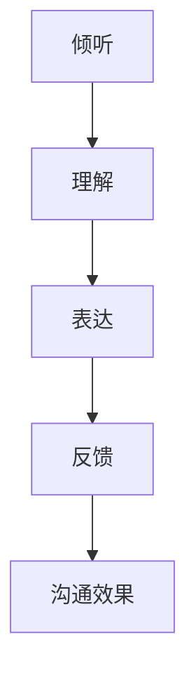

##### 2.2.2 决策能力

决策能力是领导力的核心要素之一。领导者需要具备快速做出决策的能力，并在不确定性中保持冷静和理性。决策能力包括信息收集、分析判断、风险评估和决策执行等多个方面。

**Mermaid 流程图：**

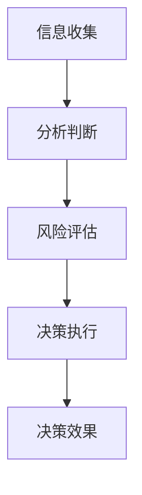

##### 2.2.3 情绪智力

情绪智力是指领导者对自身和他人情绪的理解和管理能力。情绪智力高的领导者能够更好地应对压力、激励团队、建立积极的工作氛围并处理冲突。

**Mermaid 流程图：**

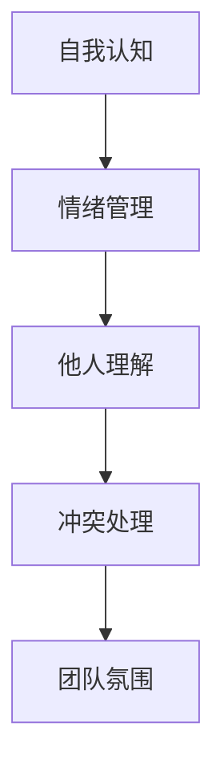

#### 2.3 领导力的发展与提升

领导力不是与生俱来的，而是可以通过学习和实践不断提升的。以下是一些提升领导力的方法：

1. **持续学习**：领导者应该不断学习新知识和技能，以适应不断变化的环境。
2. **反思与总结**：领导者应该定期反思自己的行为和决策，总结经验教训。
3. **角色扮演**：通过角色扮演和模拟训练，领导者可以提升自己的沟通和决策能力。
4. **团队建设**：领导者应该注重团队建设，培养团队凝聚力，提升团队绩效。
5. **教练与辅导**：领导者可以寻求专业教练或导师的指导，以提升自己的领导力。

通过以上分析，我们可以看到领导力的核心要素在快速变化和不确定性的商业环境中至关重要。有效的领导力不仅能够帮助企业应对挑战，还能推动企业实现长期成功。

---

### 第3章 风险管理的基本原理

风险管理是组织识别、评估和控制潜在威胁和机遇的过程。在快速变化和不确定性的商业环境中，有效的风险管理对于组织的生存和发展至关重要。本章将详细介绍风险管理的概念、过程以及工具和方法。

#### 3.1 风险管理的概念

风险管理是指组织为了实现其目标，通过系统的方法识别、评估、控制和监测风险的过程。风险管理的目标是降低潜在风险对组织的影响，同时抓住机遇，从而实现组织的长期稳定发展。

##### 3.1.1 风险的定义与分类

风险是指未来不确定性的可能性，它可能对组织的运营、财务、声誉等方面产生负面影响。风险可以分为以下几类：

1. **运营风险**：由于内部流程、系统、人员等因素引起的风险，如生产故障、供应链中断等。
2. **财务风险**：由于市场波动、投资决策等因素引起的风险，如股价下跌、资金短缺等。
3. **市场风险**：由于市场需求、竞争环境等因素引起的风险，如市场份额下降、产品滞销等。
4. **法律风险**：由于法律法规、政策变化等因素引起的风险，如违规处罚、诉讼风险等。

##### 3.1.2 风险管理的意义

风险管理对于组织具有重要意义，主要体现在以下几个方面：

1. **降低损失**：通过识别和评估风险，组织可以采取预防措施，降低风险发生的概率和损失程度。
2. **抓住机遇**：风险管理不仅关注潜在的风险，还关注机遇，从而帮助组织抓住市场变化带来的机会。
3. **提高决策效率**：风险管理提供了一种系统的方法，帮助组织在不确定性中做出更加理性和有效的决策。
4. **提升竞争力**：有效的风险管理能够增强组织的应变能力和市场竞争力，从而在激烈的市场竞争中保持优势。

#### 3.2 风险管理的过程

风险管理是一个系统性的过程，包括以下几个阶段：

##### 3.2.1 风险识别

风险识别是风险管理的第一步，目的是发现和记录组织所面临的各种潜在风险。风险识别可以通过以下方法进行：

1. **头脑风暴**：通过团队讨论，列出可能存在的风险。
2. **访谈和调查**：与内部员工、外部供应商和客户等进行访谈，收集风险信息。
3. **历史数据分析**：分析组织历史数据，识别常见的风险类型。

**Mermaid 流程图：**

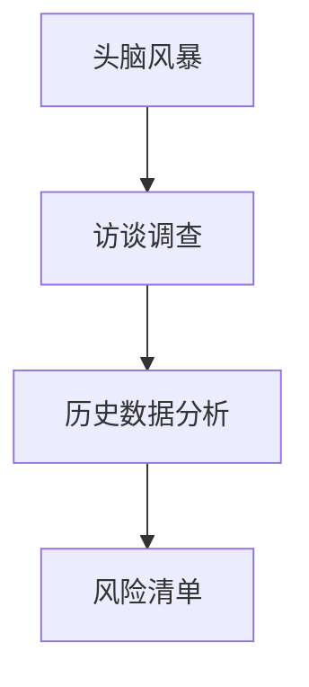

##### 3.2.2 风险评估

风险评估是识别风险的下一步，目的是对风险的可能性和影响进行评估。风险评估可以通过以下方法进行：

1. **定性分析**：对风险进行定性评估，如风险的概率和影响。
2. **定量分析**：使用数学模型和统计数据，对风险进行定量评估。
3. **风险矩阵**：使用风险矩阵，将风险的可能性和影响进行量化。

**Mermaid 流程图：**

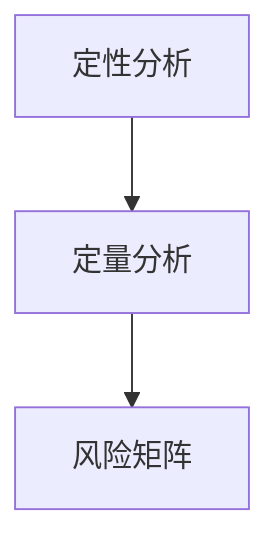

##### 3.2.3 风险应对策略

风险应对策略是指组织针对不同类型的风险采取的具体措施。风险应对策略包括以下几种：

1. **风险规避**：避免风险的发生，如改变业务模式。
2. **风险转移**：将风险转移给第三方，如购买保险。
3. **风险减轻**：通过降低风险的概率或影响，如改进流程、加强培训。
4. **风险接受**：对无法避免或转移的风险，采取接受的态度，并制定应对计划。

**Mermaid 流程图：**

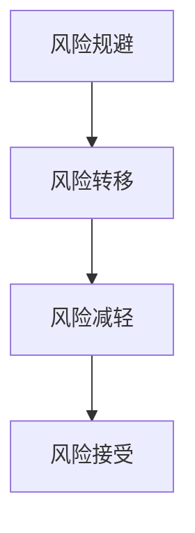

##### 3.2.4 风险监控与报告

风险监控与报告是风险管理的最后一步，目的是确保风险应对策略的有效执行，并及时发现新的风险。风险监控与报告可以通过以下方法进行：

1. **定期审查**：定期对风险应对策略进行审查和更新。
2. **实时监控**：使用技术手段，实时监控风险的变化和趋势。
3. **报告与分析**：定期向管理层报告风险状况，并提供风险分析报告。

**Mermaid 流�程图：**

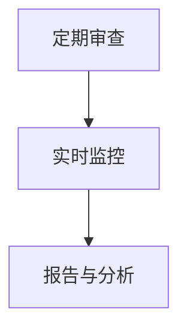

#### 3.3 风险管理的工具与方法

在风险管理过程中，组织可以使用多种工具和方法来识别、评估和控制风险。以下是一些常用的工具和方法：

##### 3.3.1 SWOT分析

SWOT分析是一种常用的战略规划工具，用于评估组织的优势、劣势、机会和威胁。通过SWOT分析，组织可以明确自身的战略方向，并制定相应的风险管理策略。

**Mermaid 流程图：**

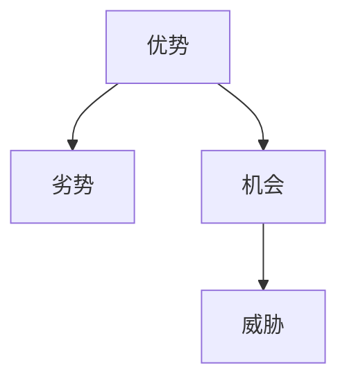

##### 3.3.2 概率分析

概率分析是一种基于数学统计的方法，用于评估风险发生的概率和影响。通过概率分析，组织可以更准确地了解风险的程度，并制定相应的应对策略。

**Mermaid 流程图：**

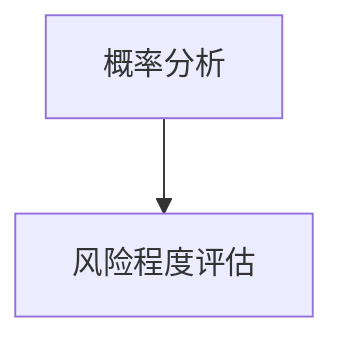

##### 3.3.3 决策树

决策树是一种图形化的工具，用于分析不同决策路径的结果和风险。通过决策树，组织可以清晰地了解不同决策的潜在影响，并做出更加明智的决策。

**Mermaid 流程图：**

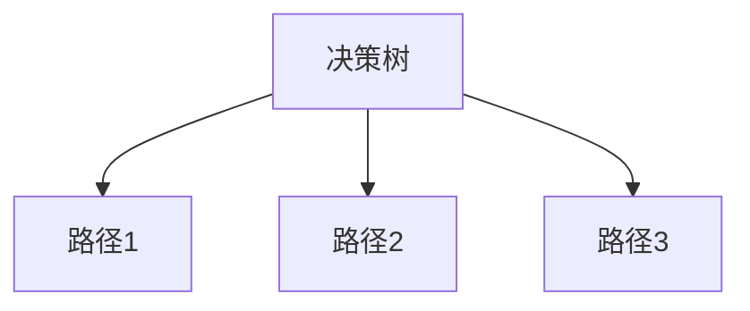

通过以上分析，我们可以看到风险管理在快速变化和不确定性的商业环境中具有重要意义。有效的风险管理不仅能够降低潜在风险对组织的影响，还能帮助组织抓住机遇，实现长期稳定发展。

---

### 第4章 不确定性环境下的领导力策略

在快速变化和高度不确定的商业环境中，领导者面临着前所未有的挑战。如何在这其中保持竞争优势和稳定发展，成为领导者必须解决的问题。本章节将探讨在不确定性环境下，领导者应如何应对挑战，提升领导力。

#### 4.1 应对不确定性的领导力挑战

不确定性环境对领导力提出了更高的要求。领导者需要具备以下能力：

##### 4.1.1 持续学习与适应能力

持续学习与适应能力是领导者应对不确定性的关键。领导者需要不断更新知识和技能，以适应不断变化的环境。这包括：

1. **自我反思**：领导者应定期反思自己的行为和决策，从中学习经验教训。
2. **知识更新**：领导者应关注行业动态、新技术和发展趋势，不断提升自己的知识储备。
3. **培训与学习**：组织应提供培训和学习的资源，帮助领导者提升技能和能力。

**Mermaid 流程图：**

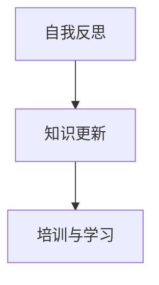

##### 4.1.2 创新思维与问题解决能力

在不确定性环境中，领导者需要具备创新思维和问题解决能力。这包括：

1. **探索新思路**：领导者应鼓励团队成员探索新的思路和解决方案，打破常规思维。
2. **跨学科合作**：领导者应促进不同部门和团队之间的合作，以获得更广泛的视角和解决方案。
3. **实验与迭代**：领导者应鼓励团队成员进行实验和迭代，从实践中学习和改进。

**Mermaid 流程图：**

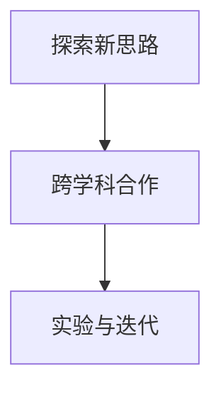

##### 4.1.3 团队协作与沟通能力

团队协作和沟通能力在不确定性环境中尤为重要。领导者需要：

1. **建立信任**：领导者应建立团队成员之间的信任，促进开放和诚实的沟通。
2. **明确目标**：领导者应确保团队成员明确组织的愿景和目标，以形成共同的方向。
3. **有效沟通**：领导者应具备有效的沟通能力，包括倾听、表达和反馈，确保信息准确传达。

**Mermaid 流程图：**

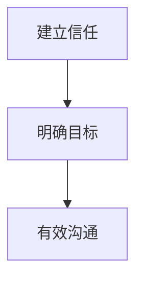

#### 4.2 领导者如何应对不确定性

领导者应对不确定性的关键在于制定有效的策略和措施。以下是一些建议：

##### 4.2.1 建立明确的目标与愿景

在不确定性环境中，领导者应首先明确组织的愿景和目标。这有助于为团队提供明确的方向和目标，增强团队的凝聚力。

1. **制定短期和长期目标**：领导者应制定短期和长期的目标，确保团队在不确定的环境中有所依托。
2. **沟通目标与愿景**：领导者应通过沟通会议、培训等方式，将目标和愿景传达给团队成员。

**Mermaid 流程图：**

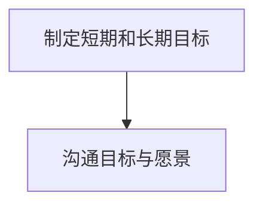

##### 4.2.2 制定灵活的战略与计划

在不确定性环境中，领导者需要制定灵活的战略和计划。这包括：

1. **多种方案**：领导者应制定多种应对不确定性的方案，包括应对最佳情况、最坏情况和中间情况的方案。
2. **动态调整**：领导者应根据实际情况和环境变化，动态调整战略和计划。

**Mermaid 流程图：**

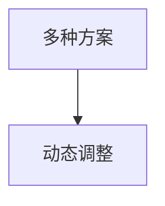

##### 4.2.3 激励与引导团队

在不确定性环境中，领导者需要激励和引导团队，以保持团队的士气和动力。以下是一些建议：

1. **鼓励创新**：领导者应鼓励团队成员提出新的想法和建议，并给予支持。
2. **提供资源**：领导者应提供必要的资源和支持，帮助团队成员克服困难和挑战。
3. **认可与奖励**：领导者应认可和奖励团队成员的努力和成就，以激励他们保持积极的态度。

**Mermaid 流程图：**

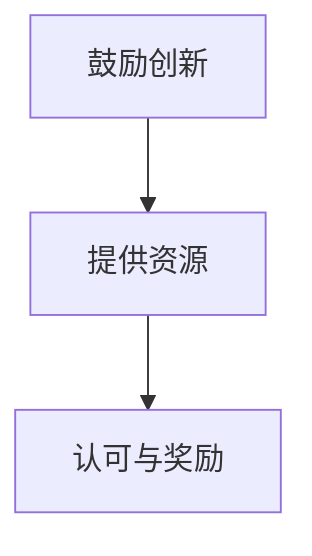

通过以上分析，我们可以看到，在不确定性环境中，领导者需要具备持续学习与适应能力、创新思维与问题解决能力、团队协作与沟通能力。领导者应通过建立明确的目标与愿景、制定灵活的战略与计划、激励与引导团队等措施，提升领导力，帮助组织在不确定的环境中把握方向，实现长期稳定发展。

---

### 第5章 风险管理在实践中的应用

在快速变化和不确定性的商业环境中，有效的风险管理对于企业的稳定发展和长期成功至关重要。本章将探讨风险管理在实践中的应用，通过实际案例研究，展示风险管理在企业管理、运营和企业文化等方面的作用。

#### 5.1 风险管理在企业管理中的角色

风险管理在企业管理中扮演着至关重要的角色。通过有效的风险管理，企业可以降低潜在风险对运营和财务的负面影响，同时抓住机遇，实现长期发展。

##### 5.1.1 风险管理与企业战略

风险管理与企业战略密切相关。企业应将风险管理纳入战略规划过程，确保企业的战略决策在考虑风险因素的基础上进行。

1. **战略风险识别**：企业应识别可能影响战略实施的风险，如市场风险、竞争风险和政策风险。
2. **风险评估与应对**：企业应对识别出的风险进行评估，并制定相应的应对策略，如风险规避、风险转移和风险减轻。
3. **战略调整**：在风险发生时，企业应灵活调整战略，以降低风险的影响。

**Mermaid 流程图：**

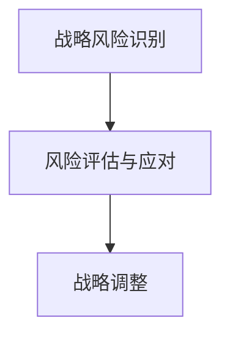

##### 5.1.2 风险管理与企业运营

风险管理在企业运营中同样重要。企业应通过有效的风险管理，确保运营的稳定性和效率。

1. **运营风险识别**：企业应识别可能影响运营的风险，如供应链风险、生产风险和质量风险。
2. **运营风险评估与应对**：企业应对运营风险进行评估，并制定相应的应对策略，如风险规避、风险转移和风险减轻。
3. **运营监控与改进**：企业应建立运营风险监控机制，定期评估风险状况，并根据实际情况进行改进。

**Mermaid 流程图：**

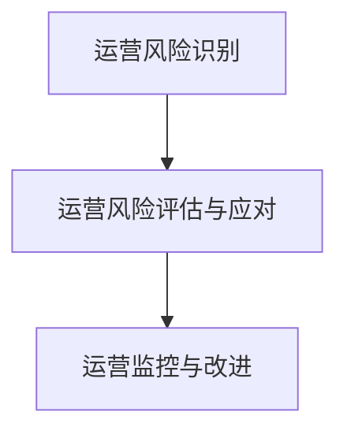

##### 5.1.3 风险管理与企业文化

风险管理与企业文化密切相关。企业应培养一种积极的风险管理文化，使员工认识到风险管理的重要性，并主动参与风险管理过程。

1. **风险管理意识**：企业应通过培训和教育，提高员工的风险管理意识，使他们能够识别和应对潜在风险。
2. **风险管理机制**：企业应建立完善的风险管理机制，确保风险管理的有效执行。
3. **风险管理考核**：企业应将风险管理纳入员工的绩效考核体系，激励员工积极参与风险管理。

**Mermaid 流程图：**

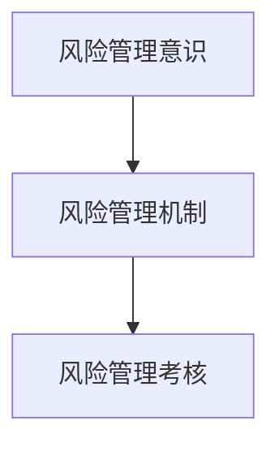

#### 5.2 实际案例研究

以下为两个实际案例研究，展示风险管理在企业管理、运营和企业文化中的应用。

##### 5.2.1 案例一：企业面对市场风险的管理策略

某企业在市场风险中面临重大挑战。为了应对市场风险，企业采取了以下风险管理策略：

1. **市场风险识别**：企业通过市场调研和数据分析，识别出市场风险，如市场需求下降、竞争对手崛起等。
2. **风险评估与应对**：企业对识别出的市场风险进行评估，并制定相应的应对策略，如市场多元化、产品创新和成本控制。
3. **市场监控与调整**：企业建立市场监控机制，定期评估市场风险状况，并根据实际情况进行调整。

通过有效的风险管理，企业成功应对了市场风险，保持了市场竞争力和业务稳定。

**Mermaid 流程图：**

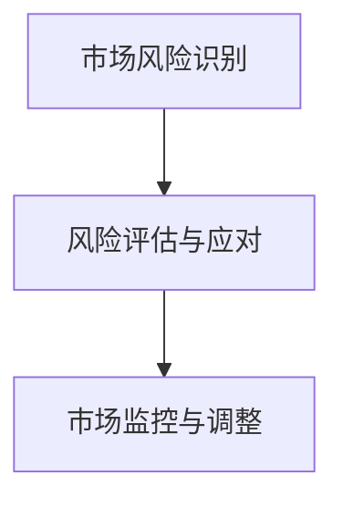

##### 5.2.2 案例二：企业应对供应链风险的管理实践

某企业在供应链风险中面临重大挑战。为了应对供应链风险，企业采取了以下风险管理策略：

1. **供应链风险识别**：企业通过供应商评估和供应链分析，识别出供应链风险，如供应商不稳定、物流延误等。
2. **风险评估与应对**：企业对识别出的供应链风险进行评估，并制定相应的应对策略，如多元化供应商、加强物流管理和库存管理。
3. **供应链监控与改进**：企业建立供应链监控机制，定期评估供应链风险状况，并根据实际情况进行改进。

通过有效的风险管理，企业成功降低了供应链风险，保证了生产运营的稳定性。

**Mermaid 流程图：**

```mermaid
graph TD
    A[供应链风险识别] --> B[风险评估与应对]
    B --> C[供应链监控与改进]
```

通过以上实际案例研究，我们可以看到风险管理在企业管理、运营和企业文化中的应用。有效的风险管理不仅能够帮助企业应对风险，还能推动企业的长期稳定发展。

---

### 第6章 领导力与风险管理的融合

领导力与风险管理是企业管理中不可或缺的两个方面。在快速变化和不确定性的商业环境中，将领导力与风险管理相结合，能够更好地应对挑战，实现企业的长期成功。本章将探讨领导力与风险管理的交叉作用，以及在团队管理中的实践。

#### 6.1 领导力与风险管理的交叉作用

领导力与风险管理之间存在密切的交叉作用。有效的领导力可以促进风险管理，而风险管理可以增强领导力。

##### 6.1.1 领导者如何平衡风险与机遇

领导者需要在平衡风险与机遇之间找到合适的平衡点。以下是一些策略：

1. **风险评估**：领导者应定期对风险进行评估，识别潜在的风险和机遇，并制定相应的应对策略。
2. **创新思维**：领导者应鼓励团队成员提出新的想法和建议，推动创新和变革。
3. **灵活应变**：领导者应具备灵活应变的能力，能够在不确定性环境中迅速做出决策。

**Mermaid 流程图：**

```mermaid
graph TD
    A[风险评估] --> B[创新思维]
    B --> C[灵活应变]
```

##### 6.1.2 风险管理在领导力发展中的应用

风险管理可以成为领导力发展的一个重要组成部分。以下是一些方法：

1. **领导力培训**：组织应提供领导力培训，包括风险管理知识和技能的培训。
2. **实战演练**：领导者应通过实际操作和演练，提升自己在风险管理方面的能力。
3. **反思与总结**：领导者应定期反思自己的风险管理实践，总结经验教训，不断改进。

**Mermaid 流程图：**

```mermaid
graph TD
    A[领导力培训] --> B[实战演练]
    B --> C[反思与总结]
```

#### 6.2 领导力与风险管理在团队管理中的实践

在团队管理中，领导力与风险管理相互融合，能够提高团队的整体绩效和稳定性。以下是一些建议：

##### 6.2.1 团队风险管理框架

为了有效地进行团队风险管理，领导者可以建立一套团队风险管理框架，包括以下步骤：

1. **风险识别**：领导者应与团队成员一起，识别可能影响团队目标的风险。
2. **风险评估**：领导者应评估识别出的风险，确定其可能性和影响。
3. **风险应对**：领导者应制定相应的风险应对策略，包括风险规避、风险转移和风险减轻。
4. **风险监控**：领导者应建立风险监控机制，定期评估风险状况，并根据实际情况进行调整。

**Mermaid 流程图：**

```mermaid
graph TD
    A[风险识别] --> B[风险评估]
    B --> C[风险应对]
    C --> D[风险监控]
```

##### 6.2.2 领导者如何培养风险管理意识

领导者可以通过以下方法培养团队成员的风险管理意识：

1. **沟通与教育**：领导者应通过培训和沟通，向团队成员传达风险管理的重要性，并分享风险管理的方法和技巧。
2. **实践机会**：领导者应提供团队成员参与风险管理实践的机会，使他们能够在实际工作中学习和提高。
3. **奖励与认可**：领导者应奖励和认可在风险管理中表现出色的团队成员，以激励他们积极参与风险管理。

**Mermaid 流程图：**

```mermaid
graph TD
    A[沟通与教育] --> B[实践机会]
    B --> C[奖励与认可]
```

##### 6.2.3 团队风险管理案例

以下是一个团队风险管理案例：

某公司在开发新产品时面临多个风险，如市场需求不确定、技术实现难度大、资源分配紧张等。为了有效管理这些风险，领导者采取了以下措施：

1. **风险识别**：领导者组织团队成员进行头脑风暴，识别出多个风险点。
2. **风险评估**：领导者对识别出的风险进行评估，确定其可能性和影响，并制定相应的应对策略。
3. **风险应对**：领导者根据风险评估结果，制定了多项风险应对策略，包括调整资源分配、增加团队成员、开展技术培训等。
4. **风险监控**：领导者建立风险监控机制，定期评估风险状况，并根据实际情况进行调整。

通过有效的团队风险管理，该公司成功应对了新产品开发过程中的各种风险，最终顺利推出新产品，获得了良好的市场反响。

**Mermaid 流程图：**

```mermaid
graph TD
    A[风险识别] --> B[风险评估]
    B --> C[风险应对]
    C --> D[风险监控]
```

通过以上分析，我们可以看到领导力与风险管理在团队管理中的重要性。领导者通过融合领导力和风险管理，能够更好地应对不确定性，提高团队的绩效和稳定性，从而实现企业的长期成功。

---

### 第7章 持续改进与未来展望

在快速变化和高度不确定的商业环境中，领导力和风险管理不仅需要及时应对当前的挑战，还要具备前瞻性，以适应未来的发展趋势。本章将探讨持续改进的策略与方法，以及领导力和风险管理在新兴技术和全球化背景下的未来展望。

#### 7.1 领导力与风险管理的发展趋势

随着技术的不断进步和全球化的深入，领导力和风险管理也在不断发展。

##### 7.1.1 新兴技术在风险管理中的应用

新技术，如人工智能、大数据、区块链等，正在逐渐改变风险管理的面貌。以下是一些新兴技术在风险管理中的应用：

1. **人工智能**：人工智能可以用于风险识别、风险评估和决策支持，提高风险管理的效率和准确性。
2. **大数据**：大数据技术可以帮助组织更好地理解风险模式和趋势，从而制定更有效的风险管理策略。
3. **区块链**：区块链技术可以提供透明的风险记录和不可篡改的审计跟踪，提高风险管理的可信度。

**Mermaid 流程图：**

```mermaid
graph TD
    A[人工智能] --> B[大数据]
    B --> C[区块链]
```

##### 7.1.2 全球化背景下的领导力挑战

全球化带来了更多的机会和挑战。领导者需要应对以下挑战：

1. **跨文化领导**：全球化意味着领导者需要具备跨文化沟通和协调能力，以应对不同文化背景的团队成员。
2. **全球协作**：全球化要求领导者建立高效的全球协作机制，确保团队在不同地区之间能够高效合作。
3. **全球市场风险**：全球化使得企业面临更多的市场风险，领导者需要具备全球视野，及时识别和应对这些风险。

**Mermaid 流程图：**

```mermaid
graph TD
    A[跨文化领导] --> B[全球协作]
    B --> C[全球市场风险]
```

#### 7.2 持续改进的策略与方法

持续改进是领导力和风险管理的重要组成部分。以下是一些持续改进的策略与方法：

##### 7.2.1 培养领导力与风险管理意识

领导者应通过以下方式培养团队成员的领导力与风险管理意识：

1. **培训与教育**：组织应提供定期的领导力和风险管理培训，帮助团队成员提升相关技能。
2. **实践机会**：领导者应鼓励团队成员参与实际项目，通过实践提升领导力和风险管理能力。
3. **反馈与改进**：领导者应定期与团队成员进行反馈，帮助他们识别自身优势和不足，并进行改进。

**Mermaid 流程图：**

```mermaid
graph TD
    A[培训与教育] --> B[实践机会]
    B --> C[反馈与改进]
```

##### 7.2.2 建立持续改进机制

为了实现持续改进，企业应建立以下机制：

1. **定期评估**：企业应定期对领导力和风险管理进行评估，识别问题并制定改进措施。
2. **持续学习**：企业应鼓励员工持续学习新知识、新技能，以适应不断变化的环境。
3. **创新文化**：企业应营造创新文化，鼓励员工提出新的想法和解决方案，推动持续改进。

**Mermaid 流程图：**

```mermaid
graph TD
    A[定期评估] --> B[持续学习]
    B --> C[创新文化]
```

#### 7.3 未来展望

在未来，领导力和风险管理将继续面临新的挑战和机遇。以下是一些未来展望：

##### 7.3.1 领导力的未来趋势

1. **数字化领导力**：随着数字化转型的加速，领导者需要具备数字素养，能够利用数字技术推动组织变革。
2. **可持续发展领导力**：领导者需要关注可持续发展，推动企业在经济、环境和社会责任方面的平衡发展。
3. **智能领导力**：随着人工智能的发展，领导者需要与智能系统协作，共同应对复杂的问题和挑战。

##### 7.3.2 风险管理的未来趋势

1. **动态风险管理**：未来风险管理将更加动态化，能够实时识别和应对风险变化。
2. **风险洞察**：通过大数据和人工智能等技术，组织将能够更深入地了解风险，提高风险预测的准确性。
3. **全球化风险管理**：随着全球化的发展，企业将需要建立更加完善的全球化风险管理框架，以应对跨国风险。

**Mermaid 流程图：**

```mermaid
graph TD
    A[数字化领导力] --> B[可持续发展领导力]
    B --> C[智能领导力]
```

通过持续改进和未来展望，领导者可以更好地应对不确定性，把握方向，推动企业实现长期成功。

---

### 附录

#### 附录A 领导力与风险管理资源指南

在本章节中，我们将推荐一些与领导力与风险管理相关的书籍、学术论文和在线课程，以供读者进一步学习和探索。

##### A.1 相关书籍推荐

1. **《领导力的五项修炼》** - 史蒂芬·柯维
   - 本书详细介绍了领导力的五项核心修炼，包括自我领导、团队领导、情感智力和长期思考。
2. **《风险管理》** - 约翰·J.凯瑟
   - 本书系统地介绍了风险管理的理论和方法，适合风险管理和企业管理人员阅读。
3. **《企业风险管理》** - 美国注册管理会计师协会
   - 本书涵盖了企业风险管理的各个层面，包括风险识别、风险评估、风险应对和风险监控。

##### A.2 学术论文精选

1. **“Leadership and Organizational Change: An Analysis of Transformative Leadership in High-Tech Firms”** - by James G. March and James G. Burns
   - 本文分析了在高科技企业中，超越型领导如何推动组织变革和创新发展。
2. **“Risk Management and Corporate Governance: An Integrated Approach”** - by David I. Macpherson and William R. Torrens
   - 本文探讨了风险管理和企业治理之间的联系，提出了一个综合性的风险管理框架。

##### A.3 在线课程与培训

1. **Coursera - "Introduction to Risk Management"** - by University of Geneva
   - 这门课程介绍了风险管理的核心概念、方法和实践，适合初学者。
2. **edX - "Leadership and Organizational Behavior"** - by Harvard University
   - 这门课程深入探讨了领导力的本质和组织行为，帮助领导者提升个人魅力和影响力。
3. **LinkedIn Learning - "Risk Management for Business Leaders"** - by Matt H. Evans, CPA
   - 这门课程提供了全面的风险管理知识和技能，适合企业高管和风险管理人员。

通过阅读这些书籍、学术论文和参加在线课程，读者可以进一步深入了解领导力与风险管理的理论和实践，提升自身的领导力和风险管理能力。希望这些资源能够为读者在领导力与风险管理领域的探索提供帮助。

---

### 总结与展望

在快速变化和不确定性的商业环境中，领导力和风险管理成为企业成功的关键因素。有效的领导力能够激发团队的潜能，推动组织实现目标；而全面的风险管理则能够降低潜在风险，确保企业的稳定发展。

本文从领导力的核心要素、风险管理的基本原理，到不确定环境下的领导力策略，以及风险管理在实践中的应用，全面探讨了领导力与风险管理的融合。同时，我们也对未来领导力和风险管理的发展趋势进行了展望，提出了持续改进的策略与方法。

读者可以通过以下步骤来提升领导力和风险管理能力：

1. **深入学习**：阅读相关的书籍、学术论文，参加在线课程，不断更新知识和技能。
2. **实践应用**：将所学知识应用到实际工作中，通过实践提升领导力和风险管理能力。
3. **持续反思**：定期反思自己的领导行为和风险管理实践，总结经验教训，不断改进。

在未来的商业环境中，领导者需要具备持续学习与适应能力、创新思维与问题解决能力，以及团队协作与沟通能力。同时，风险管理也应随着新兴技术和全球化的发展，不断优化和升级。

通过本文的探讨，希望读者能够更好地理解领导力与风险管理的核心概念和实践方法，把握不确定中的方向，推动企业实现长期成功。作者：AI天才研究院/AI Genius Institute & 禅与计算机程序设计艺术 /Zen And The Art of Computer Programming。

