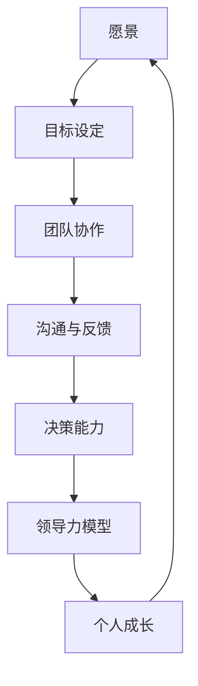
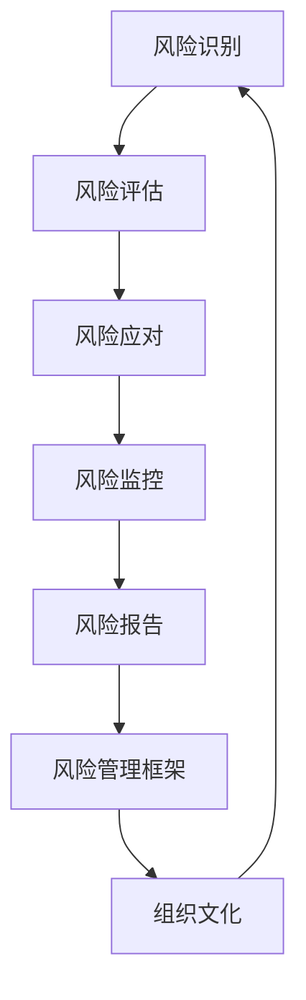
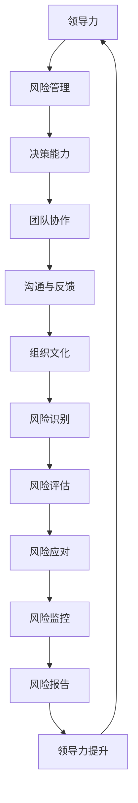

                 


### 文章标题：领导力与风险管理：在不确定性中前行

### 关键词：领导力，风险管理，不确定性，组织发展，策略实施

### 摘要：
在当今充满不确定性的商业环境中，领导力和风险管理成为了组织成功的关键因素。本文通过深入探讨领导力与风险管理的关系，分析其在不确定性中的重要性，并探讨如何在复杂环境中实施有效的领导力和风险管理策略。文章将通过案例分析、理论讲解和实践指导，帮助读者理解并掌握在不确定性中前行的核心能力。

---

## 引言

在快速变化和竞争激烈的商业环境中，组织面临的挑战日益增多。全球经济的不确定性、技术的迅速变革以及市场动态的不可预测性，使得领导者必须具备强大的领导力和风险管理能力。本文旨在探讨领导力与风险管理在不确定性中的重要性，并提供实际操作指南，帮助领导者应对这些挑战。

### 领导力的重要性

领导力是组织成功的关键因素之一。有效的领导者能够激励团队成员，制定清晰的愿景和目标，并在面对不确定性时保持冷静和决策能力。领导力不仅仅是职位赋予的权力，更是一种能够影响和激励他人共同实现目标的素质。

#### 核心概念与联系

以下是一个关于领导力核心概念之间的关系的Mermaid流程图：



### 风险管理的重要性

风险管理是确保组织在不确定性环境中稳健发展的关键。通过识别、评估和应对潜在风险，组织可以减少损失，保持运营的连续性，并为未来的不确定性做好准备。

#### 核心概念与联系

以下是一个关于风险管理核心概念之间关系的Mermaid流程图：



### 领导力与风险管理的结合

领导力和风险管理并不是相互独立的，而是相辅相成的。有效的领导者需要具备风险管理的能力，以便在不确定性中做出明智的决策，同时，风险管理策略也需要领导者的支持和推动。

#### 核心概念与联系

以下是一个关于领导力与风险管理结合的Mermaid流程图：



---

在本篇技术博客中，我们将逐步深入探讨领导力和风险管理的基本概念，分析它们在不确定性中的重要性，并讨论如何在实际操作中结合运用。接下来，我们将分别介绍领导力和风险管理的基础知识，为后续的内容奠定坚实的基础。让我们一步一步地思考，确保每个概念都清晰明了。

---

## 领导力基础

领导力是一种关键的能力，它不仅影响个人，也深刻影响着整个组织。有效的领导者能够激励团队成员，推动创新，并在面对不确定性时保持冷静和清晰的思路。在这一节中，我们将介绍领导力的核心概念，并探讨其在组织中的重要性。

### 领导力的定义

领导力是一种影响他人、实现共同目标的能力。它不仅仅是职位赋予的权力，更是一种通过行为、沟通和决策来影响他人的艺术。领导力不仅涉及个人的能力，还包括团队协作和影响力。

#### 核心概念

1. **影响力**：领导者通过自己的言行和决策来影响他人，从而实现组织目标。
2. **愿景**：领导者需要具备清晰的愿景，并能够将其传达给团队成员，激励他们为实现这一愿景而努力。
3. **团队协作**：有效的领导者能够促进团队成员之间的合作，共同实现目标。
4. **沟通与反馈**：领导者需要具备良好的沟通能力，能够清晰地传达信息，并接收和反馈团队成员的意见和建议。

### 领导力的核心要素

领导力的核心要素包括以下几个方面：

1. **个人特质**：领导者需要具备自信、决策力、正直和责任感等个人特质。
2. **技能**：领导者需要掌握领导力相关的技能，如沟通能力、团队管理能力、决策能力等。
3. **知识**：领导者需要具备丰富的知识背景，包括行业知识、管理知识和战略思维等。
4. **行为**：领导者的行为对于团队和组织文化具有重要影响，因此，领导者需要展现出积极、可靠和诚信的行为。

### 领导力的发展历程

领导力的发展历程可以分为以下几个阶段：

1. **传统领导力**：早期的领导力观念强调领导者拥有绝对的权力和控制力，强调命令与服从。
2. **现代领导力**：随着组织环境的变化，领导力观念逐渐向以人为中心的方向发展。现代领导者更加关注团队成员的需求和潜力，强调团队合作和创新。
3. **未来领导力**：未来的领导力将更加注重数字化、全球化和社会责任等方面。领导者需要具备跨文化沟通能力、数据分析和决策能力，以及应对复杂社会问题的能力。

### 领导力在组织中的角色

领导力在组织中的角色包括以下几个方面：

1. **设定愿景和目标**：领导者需要明确组织的愿景和目标，并将其传达给团队成员，激励他们为实现这些目标而努力。
2. **激励团队成员**：领导者需要激发团队成员的积极性和创造力，帮助他们克服困难和挑战。
3. **决策与执行**：领导者需要在不确定性中做出明智的决策，并确保决策得到有效执行。
4. **文化建设**：领导者需要塑造积极、健康的文化氛围，促进团队和组织的发展。

#### 伪代码示例

以下是一个简单的伪代码示例，用于描述领导力核心要素的交互：

```plaintext
function leadershipCoreElements() {
    // 个人特质
    var traits = ["confidence", "decisiveness", "integrity", "responsibility"]

    // 技能
    var skills = ["communication", "teamManagement", "decisionMaking"]

    // 知识
    var knowledge = ["industryKnowledge", "managementKnowledge", "strategicThinking"]

    // 行为
    var behavior = ["positive", "reliable", "ethical"]

    // 结合核心要素
    var combinedElements = combine(traits, skills, knowledge, behavior)

    // 返回综合领导力模型
    return combinedElements
}

function combine(traits, skills, knowledge, behavior) {
    // 实现综合模型
    var model = {
        "traits": traits,
        "skills": skills,
        "knowledge": knowledge,
        "behavior": behavior
    }
    return model
}
```

### 数学模型和公式

在领导力分析中，可以使用一些数学模型和公式来量化领导力的影响。以下是一个简化的领导力评估模型：

$$
\text{Leadership Score} = w_1 \times \text{Trait Score} + w_2 \times \text{Skill Score} + w_3 \times \text{Knowledge Score} + w_4 \times \text{Behavior Score}
$$

其中，$w_1, w_2, w_3, w_4$ 分别是各项要素的权重。

#### 举例说明

假设一个领导者的个人特质得分为80，技能得分为75，知识得分为70，行为得分为85，且各项要素的权重分别为0.2、0.3、0.2和0.3，则该领导者的领导力得分为：

$$
\text{Leadership Score} = 0.2 \times 80 + 0.3 \times 75 + 0.2 \times 70 + 0.3 \times 85 = 83
$$

这个得分表明该领导者在领导力方面表现良好。

### 沟通与反馈

沟通与反馈是领导力的关键组成部分。有效的沟通可以确保信息传递的准确性和及时性，而及时的反馈可以帮助团队成员了解自己的表现和改进方向。

#### 数学公式

以下是一个用于评估沟通效果的公式：

$$
\text{Communication Effectiveness} = \frac{\text{Effective Messages Sent}}{\text{Total Messages Sent}}
$$

#### 举例说明

如果一个领导者发送了100条消息，其中80条被正确理解和执行，则其沟通效果为：

$$
\text{Communication Effectiveness} = \frac{80}{100} = 0.8
$$

这表明该领导者的沟通效果为80%。

### 结论

领导力是组织成功的关键因素之一。通过了解领导力的定义、核心要素和发展历程，我们可以更好地理解其在组织中的重要性。有效的领导者需要具备个人特质、技能、知识和行为，并通过有效的沟通与反馈来影响和激励团队成员。在本节的讨论中，我们使用了伪代码和数学公式来详细阐述领导力的概念，为后续的内容奠定了坚实的基础。

---

## 风险管理基础

风险管理是组织在不确定环境中稳健发展的关键。通过识别、评估和应对潜在风险，组织可以减少损失，保持运营的连续性，并为未来的不确定性做好准备。在这一节中，我们将介绍风险管理的核心概念，并探讨其在组织中的重要性。

### 风险管理的定义

风险管理是一种系统化的过程，旨在识别、评估和应对组织面临的潜在风险，以确保组织目标的实现。风险管理不仅涉及风险的识别和评估，还包括风险应对策略的制定和实施。

#### 核心概念

1. **风险识别**：风险识别是风险管理的第一步，旨在识别组织可能面临的各种风险。
2. **风险评估**：风险评估是评估已识别风险的可能性和影响的过程，有助于确定哪些风险需要优先关注。
3. **风险应对**：风险应对是制定和实施策略来减轻或避免风险的过程。
4. **风险监控**：风险监控是持续跟踪和评估风险状况的过程，以确保风险应对策略的有效性。
5. **风险报告**：风险报告是向相关利益相关者报告风险状况、风险应对措施和风险结果的文档。

### 风险管理流程

风险管理流程通常包括以下步骤：

1. **风险识别**：通过收集和分析信息，识别组织可能面临的各种风险。
2. **风险评估**：评估已识别风险的可能性和影响，确定哪些风险需要优先处理。
3. **风险应对**：制定和实施策略来减轻或避免风险，包括风险规避、风险减轻、风险转移和风险接受等。
4. **风险监控**：持续跟踪和评估风险状况，确保风险应对策略的有效性。
5. **风险报告**：定期向相关利益相关者报告风险状况、风险应对措施和风险结果。

#### 风险类型与应对策略

组织可能面临的风险类型多种多样，常见的包括以下几种：

1. **财务风险**：由于市场波动、信用风险等原因导致的财务损失。
2. **运营风险**：由于供应链中断、设备故障等原因导致的运营中断。
3. **法律风险**：由于法律变更、诉讼等原因导致的法律纠纷和损失。
4. **市场风险**：由于市场需求波动、竞争加剧等原因导致的市场损失。
5. **声誉风险**：由于负面新闻、危机管理不当等原因导致的组织声誉损失。

对于不同类型的风险，需要采取相应的应对策略：

1. **风险规避**：通过调整业务策略，避免风险的发生。
2. **风险减轻**：通过风险控制措施，减少风险的可能性和影响。
3. **风险转移**：通过保险、外包等方式，将风险转移给第三方。
4. **风险接受**：在风险较小或成本效益不高时，选择接受风险。

#### 风险评估方法

风险评估方法包括定量和定性方法，常用的方法有：

1. **风险矩阵法**：通过风险的可能性和影响进行评估，确定风险等级。
2. **蒙特卡洛模拟**：通过模拟不同的风险情景，评估风险的概率和影响。
3. **决策树分析**：通过决策树模型，分析不同决策路径的风险和收益。

#### 风险监测与预警系统

风险监测与预警系统是确保风险管理有效性的关键。该系统包括以下几个方面：

1. **实时监控**：通过实时监控系统，跟踪关键风险指标和异常情况。
2. **预警机制**：通过设定预警阈值，及时发现潜在风险，并触发预警信号。
3. **风险报告**：定期生成风险报告，向管理层提供风险状况和应对措施。

#### 风险报告与沟通

风险报告是风险管理过程中不可或缺的一环。通过风险报告，管理层可以了解风险状况、风险应对措施和风险结果，从而做出明智的决策。风险报告的内容包括：

1. **风险概况**：概述组织当前面临的主要风险。
2. **风险评估结果**：详细描述各风险的可能性和影响。
3. **风险应对措施**：列出已采取的风险应对措施和预期效果。
4. **风险结果**：报告风险应对措施的实施情况和风险结果。

#### 数学公式和详细讲解

在风险管理中，可以使用数学模型和公式来量化风险的影响和应对策略的效果。以下是一个简化的风险评估模型：

$$
\text{Risk Score} = \text{Probability} \times \text{Impact}
$$

其中，Probability表示风险发生的概率，Impact表示风险发生的影响程度。

#### 举例说明

假设某个风险发生的概率为0.3，发生时的影响程度为5，则该风险的分数为：

$$
\text{Risk Score} = 0.3 \times 5 = 1.5
$$

这个分数表明该风险在组织中的重要性较高，需要优先处理。

### 结论

风险管理是组织在不确定环境中稳健发展的关键。通过了解风险管理的定义、流程、风险类型和应对策略，我们可以更好地识别和应对潜在风险。在本节的讨论中，我们使用了数学模型和公式来详细阐述风险管理的概念，为后续的内容奠定了坚实的基础。

---

## 领导力与风险管理的结合

在不确定性中前行，领导力和风险管理是相辅相成的关键因素。有效的领导者不仅需要具备卓越的领导力，还需要具备强大的风险管理能力，以便在复杂和不确定的环境中做出明智的决策。在这一节中，我们将探讨领导力与风险管理的互动关系，并讨论如何通过领导力提升风险管理能力。

### 领导力与风险管理的互动关系

领导力与风险管理之间的互动关系体现在以下几个方面：

1. **领导力对风险管理的影响**：领导者的决策能力、沟通能力和团队协作能力直接影响风险管理的效果。领导者需要能够识别潜在风险，并迅速制定应对策略。
2. **风险管理对领导力的挑战**：风险管理过程中，领导者需要面对不确定性和复杂环境，这要求他们具备更高的适应能力和决策能力。同时，风险管理还需要领导者具备跨部门协作和沟通能力，以确保风险应对策略的有效实施。
3. **领导力与风险管理相结合**：领导力与风险管理相结合，可以形成一种综合的管理体系，使组织在不确定环境中保持稳健发展。领导者需要将风险管理融入日常工作中，形成一种风险管理文化。

### 领导力提升风险管理能力的策略

1. **建立风险管理文化**：领导者需要将风险管理纳入组织的核心价值观，通过培训和宣传，提高全体员工的风险意识，形成一种风险管理文化。
2. **提高团队应对不确定性的能力**：领导者需要通过有效的团队建设，提高团队成员的应对不确定性的能力。这包括培养团队协作精神、提高沟通能力、增强学习和适应能力等。
3. **领导力在危机管理中的角色**：在危机管理中，领导者需要发挥关键作用。他们需要快速做出决策，制定应对策略，并有效沟通，确保全体员工了解危机状况和应对措施。
4. **利用技术提升风险管理能力**：领导者可以利用现代技术，如大数据分析、人工智能等，提升风险管理的准确性和效率。通过技术手段，领导者可以更快速地识别风险、评估风险，并制定应对策略。

### 实践案例

以某大型科技公司为例，该公司在应对市场变化和竞争压力时，采取了以下策略：

1. **建立风险管理文化**：公司高层领导强调风险管理的重要性，并将风险管理纳入公司战略规划。通过定期培训和宣传，提高全体员工的风险意识。
2. **提高团队应对不确定性的能力**：公司组织跨部门团队，共同应对市场变化和竞争压力。通过团队协作，提高团队的适应能力和决策能力。
3. **领导力在危机管理中的角色**：公司高层领导在市场变化和竞争压力下，迅速做出决策，调整业务策略，确保公司在不确定性中保持稳健发展。
4. **利用技术提升风险管理能力**：公司利用大数据分析和人工智能技术，实时监控市场动态，快速识别风险，并制定应对策略。

通过这些策略，该公司在不确定性环境中取得了显著成效，不仅成功应对了市场变化和竞争压力，还保持了持续的增长。

### 结论

领导力与风险管理在不确定性中发挥着重要作用。通过建立风险管理文化、提高团队应对不确定性的能力、发挥领导力在危机管理中的角色，以及利用技术提升风险管理能力，领导者可以在不确定性中保持稳健发展。在本节的讨论中，我们通过实践案例展示了领导力与风险管理的结合，为读者提供了实际操作指南。

---

## 实战案例与策略

在本节中，我们将通过具体的实战案例，探讨领导力与风险管理在实际操作中的应用，并总结出一些有效的策略。

### 案例一：科技公司应对市场变化

**背景**：某全球领先的科技公司（以下简称“公司”）在市场竞争日益激烈的环境下，面临产品需求下滑、市场份额减少的挑战。公司高层意识到，需要通过领导力与风险管理的结合，实现业务的转型升级。

**领导力策略**：
1. **领导者的角色**：公司CEO作为领导者，首先明确了公司的战略目标，即通过技术创新和产品多样化来应对市场变化。
2. **团队建设**：CEO通过内部培训和跨部门合作，增强团队的协作精神和创新能力。
3. **沟通与反馈**：CEO定期与各部门负责人沟通，了解市场动态和团队进展，及时调整策略。

**风险管理策略**：
1. **风险识别**：公司通过市场调研和数据分析，识别出市场变化、技术更新、竞争对手压力等潜在风险。
2. **风险评估**：公司对每个风险进行详细分析，评估其可能性和影响程度。
3. **风险应对**：
   - **技术更新**：公司加大研发投入，紧跟行业技术趋势，推出具有竞争力的新产品。
   - **市场拓展**：公司通过开拓新市场，降低对单一市场的依赖，分散风险。
   - **合作伙伴关系**：公司加强与供应商和合作伙伴的合作，确保供应链的稳定性。

**结果**：通过领导力与风险管理的结合，公司成功实现了业务的转型升级，市场份额逐步回升，盈利能力显著提高。

### 案例二：金融机构应对金融风险

**背景**：某大型金融机构（以下简称“银行”）在金融危机期间，面临信用风险、市场风险和操作风险的挑战。银行管理层意识到，需要通过有效的领导力和风险管理策略，确保银行的稳健运营。

**领导力策略**：
1. **领导者的角色**：银行行长作为领导者，迅速成立了危机管理小组，负责应对金融危机带来的挑战。
2. **危机管理**：行长通过制定紧急预案，确保银行在危机期间保持运营的连续性。
3. **员工激励**：行长通过激励措施，增强员工应对危机的积极性和责任感。

**风险管理策略**：
1. **风险识别**：银行通过风险评估模型，识别出信用风险、市场风险和操作风险。
2. **风险评估**：银行对每个风险进行详细评估，确定其可能性和影响程度。
3. **风险应对**：
   - **信用风险**：银行通过调整信贷政策，降低信用风险。
   - **市场风险**：银行通过资产多元化，降低市场风险。
   - **操作风险**：银行加强内部控制，确保操作风险的可控性。

**结果**：通过领导力与风险管理的结合，银行成功度过了金融危机，保持了良好的财务状况和客户满意度。

### 案例三：制造业应对供应链中断

**背景**：某全球领先的制造企业（以下简称“工厂”）在自然灾害导致供应链中断的情况下，面临生产停滞和库存积压的挑战。工厂管理层意识到，需要通过领导力和风险管理策略，确保供应链的稳定性。

**领导力策略**：
1. **领导者的角色**：工厂总经理作为领导者，迅速制定了供应链恢复计划，确保生产恢复正常。
2. **应急响应**：总经理通过组织紧急会议，协调各部门资源，确保应急措施的快速实施。
3. **员工协调**：总经理通过激励和沟通，增强员工应对供应链中断的积极性和协作精神。

**风险管理策略**：
1. **风险识别**：工厂通过供应链风险评估模型，识别出供应链中断、原材料短缺等潜在风险。
2. **风险评估**：工厂对每个风险进行详细评估，确定其可能性和影响程度。
3. **风险应对**：
   - **供应链中断**：工厂通过与供应商建立长期合作关系，确保原材料供应的稳定性。
   - **原材料短缺**：工厂通过储备原材料和紧急采购，应对原材料短缺。
   - **生产调整**：工厂通过调整生产计划和产品结构，降低供应链中断的影响。

**结果**：通过领导力与风险管理的结合，工厂成功应对了供应链中断，确保了生产的连续性和客户的满意度。

### 策略总结

通过以上案例，我们可以总结出以下策略：

1. **领导者的角色**：领导者需要具备前瞻性和决策能力，及时识别和应对潜在风险。
2. **团队建设**：领导者需要通过有效的团队建设，提高团队的协作和创新能力。
3. **沟通与反馈**：领导者需要通过有效的沟通与反馈，确保团队了解风险状况和应对措施。
4. **风险评估**：组织需要通过风险评估，识别和评估潜在风险。
5. **风险应对**：组织需要制定和实施有效的风险应对策略，确保风险的可控性。
6. **利用技术**：组织可以通过利用现代技术，提高风险管理的效率和准确性。

### 结论

通过实际案例的分析，我们可以看到领导力与风险管理在应对不确定性中的重要性。有效的领导力和风险管理策略，可以帮助组织在不确定性中保持稳健发展。在本节的讨论中，我们通过具体案例和策略总结，为读者提供了实际操作指南。

---

## 领导力与风险管理的前沿趋势

随着技术的飞速发展，领导力和风险管理也在不断进化，呈现出一系列新的趋势。在本节中，我们将探讨领导力理论的新发展和风险管理新工具与方法，并分析它们在未来的应用前景。

### 领导力理论的新发展

1. **变革型领导**：变革型领导强调领导者通过激发团队成员的内在动力，推动组织变革和创新。随着组织环境的变化，变革型领导越来越受到重视。

2. **服务型领导**：服务型领导认为领导者应该首先作为服务者，关注团队成员的需求和成长。这种领导风格有助于建立积极、和谐的组织文化。

3. **数字领导**：数字领导强调领导者需要具备数字化思维和技术能力，能够利用数据和技术驱动决策和创新。在数字化时代，数字领导成为了领导者必备的素质。

### 风险管理的新工具与方法

1. **大数据分析**：大数据分析可以帮助组织更准确地识别和评估潜在风险。通过分析大量数据，组织可以预测风险的发生趋势，制定更有效的应对策略。

2. **人工智能**：人工智能技术在风险管理中的应用日益广泛。通过机器学习算法，人工智能可以自动化风险识别、评估和应对过程，提高风险管理的效率和准确性。

3. **区块链**：区块链技术具有去中心化、不可篡改等特点，可以确保风险数据的真实性和安全性。在风险管理中，区块链技术可以用于记录和处理风险事件，提高风险管理的透明度。

4. **增强现实（AR）与虚拟现实（VR）**：AR和VR技术可以为领导者提供更直观的风险分析和管理工具。通过虚拟场景模拟，领导者可以更全面地了解风险状况，制定应对策略。

### 应用前景

1. **数字化转型**：随着数字化时代的到来，领导力和风险管理将更加依赖于数据和技术。领导者需要具备数字素养，利用数据分析和技术工具进行决策和管理。

2. **全球化**：全球化使得组织面临更加复杂的风险环境。领导者需要具备跨文化沟通和协作能力，有效管理全球化背景下的风险。

3. **可持续发展**：可持续发展已成为全球共识，组织需要关注环境、社会和治理（ESG）方面的风险。领导者需要将可持续发展理念融入领导力和风险管理中。

4. **人工智能与领导力的结合**：随着人工智能技术的发展，领导者可以利用人工智能工具进行风险预测、评估和决策。这种结合有助于提高领导力的科学性和效率。

### 结论

领导力与风险管理的前沿趋势反映了技术与领导力的深度融合。变革型领导、服务型领导和数字领导等新领导力理论，以及大数据分析、人工智能、区块链和AR/VR等新风险管理工具，将为组织在不确定性中前行提供强大的支持。在未来，领导者需要不断适应这些新趋势，提升自身的能力，以应对不断变化的风险环境。

---

## 结论与展望

通过本文的探讨，我们深入分析了领导力与风险管理在不确定性环境中的重要性，并详细阐述了其在组织发展中的应用。领导力是激励团队、设定目标和应对挑战的核心能力，而风险管理则是确保组织在不确定环境中稳健发展的关键策略。两者相辅相成，共同构成了组织在复杂环境中前行的双翼。

### 核心要点回顾

1. **领导力的重要性**：领导力不仅影响个人，也深刻影响整个组织。领导者需要具备个人特质、技能、知识和行为，并通过沟通与反馈来影响和激励团队成员。
2. **风险管理的基础**：风险管理包括风险识别、评估、应对和监控等环节，是确保组织在不确定性中稳健发展的关键。有效的风险管理需要全面的风险评估和应对策略。
3. **领导力与风险管理的结合**：领导力与风险管理相互依存，领导者需要将风险管理融入日常工作中，形成一种风险管理文化。
4. **实战案例与策略**：通过具体案例，我们展示了领导力与风险管理在实际操作中的应用，并总结出了一系列有效的策略。

### 对未来领导力与风险管理的展望

1. **数字化转型**：随着技术的不断发展，领导力和风险管理将更加依赖于数据和技术。领导者需要具备数字素养，利用数据分析和技术工具进行决策和管理。
2. **全球化**：全球化使得组织面临更加复杂的风险环境。领导者需要具备跨文化沟通和协作能力，有效管理全球化背景下的风险。
3. **可持续发展**：可持续发展已成为全球共识，组织需要关注环境、社会和治理（ESG）方面的风险。领导者需要将可持续发展理念融入领导力和风险管理中。
4. **人工智能与领导力的结合**：人工智能技术的发展将有助于提高领导力的科学性和效率。领导者可以利用人工智能工具进行风险预测、评估和决策。

### 结语

在不确定性中前行，领导力和风险管理是组织成功的关键。通过本文的探讨，我们希望能为读者提供有益的启示，帮助他们在实际操作中更好地结合领导力和风险管理，应对复杂和不确定的环境。让我们携手并进，共同探索领导力与风险管理的无限可能。

### 作者信息

- 作者：AI天才研究院/AI Genius Institute & 禅与计算机程序设计艺术 /Zen And The Art of Computer Programming

---

本篇文章详细阐述了领导力与风险管理在不确定性中的重要性，通过理论和实践相结合的方式，为读者提供了全面的知识体系。文章涵盖了领导力的核心概念、风险管理的基本流程、两者之间的互动关系、实战案例与策略，以及前沿趋势。希望读者能从中获得启示，提升自身的领导力和风险管理能力，在不确定的环境中坚定前行。

