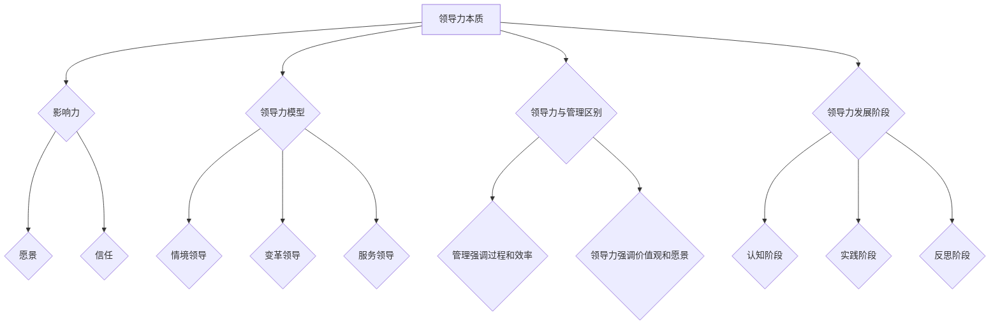

                 

### 引言

#### 从工程师到管理者的转变

在现代IT行业中，工程师的角色已经发生了深刻的变化。随着技术的发展和项目的复杂化，许多工程师逐渐意识到，单纯的编程技术已经不足以应对日益多样化的挑战。因此，他们开始寻求更高的职业发展路径，从技术专家向管理者转型成为了一种普遍的趋势。然而，这一转变并非易事，它需要工程师们不仅具备扎实的技术背景，还需要掌握一系列的管理技能和领导力。

领导力，作为一种重要的软技能，对于工程师的成功转型至关重要。领导力不仅仅体现在对团队成员的指导和激励上，更涉及到战略规划、团队建设、项目管理和沟通协调等多个方面。在这本书中，我们将深入探讨从工程师到管理者转变过程中的领导力修炼，旨在帮助读者了解领导力的核心概念、发展路径和实际应用，从而实现从技术专家到卓越管理者的华丽转身。

#### 本书的目的

本书旨在为那些渴望成为管理者的工程师们提供一本全面、系统的领导力修炼手册。通过本书，读者将：

1. **理解领导力的本质和核心要素**：从基础理论入手，帮助读者建立对领导力的全面认识。
2. **掌握从工程师到管理者的转变策略**：分析角色认知、技能提升、职业规划等方面的关键因素。
3. **学习团队管理和沟通技巧**：了解团队成员管理、团队目标设定、协作机制等方面的实用方法。
4. **掌握项目管理技能**：掌握项目管理的基础理论、计划与执行技巧，提升项目成功概率。
5. **提升领导力实践能力**：通过案例分析、实战项目和最佳实践，提升领导力在实际工作中的应用。

通过这本书，我们希望读者能够在从工程师到管理者的转变过程中，不仅能够掌握技术和管理知识，更能够提升自身的领导力和管理能力，从而在职业道路上走得更远、更稳。

#### 书的结构

本书共分为七个章节，每个章节都涵盖了领导力修炼的不同方面：

* **第1章 领导力基础理论**：介绍领导力的定义、核心要素和领导力与管理的区别，帮助读者建立对领导力的基础认识。
* **第2章 从工程师到管理者的转变**：分析工程师向管理者转变的角色认知、技能提升和职业规划，为转型提供指导。
* **第3章 团队管理**：探讨团队成员管理、团队目标设定、协作机制等方面的实用方法，帮助读者提升团队管理水平。
* **第4章 沟通与协作**：详细讲解有效沟通、协作机制和团队文化，提升团队协作效率。
* **第5章 项目管理**：介绍项目管理的基础理论、计划与执行技巧，帮助读者提升项目管理和执行能力。
* **第6章 领导力实践与提升**：通过案例分析、实战项目和最佳实践，提升读者在实际工作中的应用能力。
* **第7章 案例分析**：提供实际案例，深入剖析领导力在具体项目中的应用，帮助读者更好地理解和应用领导力。

通过这些章节的深入学习，读者将能够全面掌握领导力知识，并在实际工作中运用这些技能，实现个人和团队的共同成长。

### 领导力的核心概念与联系

要深入理解领导力，首先需要明确其核心概念。领导力并非一个单一的技能或特质，而是一个包含多个维度和要素的综合体。以下是对领导力的几个核心概念及其相互关系的分析，使用Mermaid流程图来展示这些概念之间的联系。

#### 领导力的本质

**定义**：领导力是一种影响他人实现目标的能力。它不仅仅是指导或管理团队，更重要的是激发和引导团队成员的潜力，使其为实现共同目标而努力。

**核心要素**：

1. **影响力**：领导力的核心在于影响力，即领导者通过行为、价值观和愿景来影响他人。
2. **愿景**：愿景是领导者对未来的设想和期待，它为团队提供了明确的方向和目标。
3. **信任**：信任是领导力成功的关键，团队成员需要相信领导者的决策能力和真诚意图。

#### 领导力模型

**定义**：领导力模型是描述领导行为和风格的理论框架，它帮助领导者理解和应用不同的领导策略。

**核心要素**：

1. **情境领导**：这是一种根据团队成员的不同发展阶段和需求，灵活调整领导风格的方法。
2. **变革领导**：变革领导关注如何推动团队实现重大的变革，通常涉及战略规划和组织调整。
3. **服务领导**：服务领导强调领导者作为服务者的角色，即领导者为团队成员提供支持和资源，帮助他们实现目标。

#### 领导力与管理的区别

**定义**：领导力与管理的区别在于它们的重点不同。管理是确保任务完成的过程，而领导力是激发团队成员的潜力，推动团队实现目标。

**核心要素**：

1. **管理强调过程和效率**：管理关注的是如何高效地完成任务，包括资源配置、时间管理和流程优化。
2. **领导力强调价值观和愿景**：领导力关注的是如何激励和引导团队成员，实现组织的目标和愿景。

#### 领导力发展的阶段

**定义**：领导力发展是一个持续的过程，领导者需要在不同阶段不断学习和成长。

**核心要素**：

1. **认知阶段**：领导者开始意识到领导力的重要性，并开始探索和了解领导力的核心概念。
2. **实践阶段**：领导者通过实际工作，将领导力概念应用到实践中，逐步提升领导能力。
3. **反思阶段**：领导者通过反思和总结，不断改进自己的领导方法和风格，实现自我提升。

#### 使用Mermaid流程图展示

以下是领导力核心概念和联系的Mermaid流程图：



通过这个流程图，我们可以清晰地看到领导力的核心概念及其相互关系，这为后续章节的深入学习提供了基础。

### 领导力的核心算法原理讲解

在深入理解领导力的核心概念后，我们需要通过伪代码来详细阐述领导力的发展阶段和关键算法原理。以下是对各个阶段的伪代码解释，帮助读者更直观地理解领导力的发展路径。

#### 阶段一：认知阶段

**定义**：在认知阶段，领导者开始意识到领导力的重要性，并开始学习和探索领导力的基本概念。

**伪代码**：

```python
def 认知阶段():
    # 学习领导力核心概念
    学习领导力定义()
    学习领导力模型()
    学习领导力发展阶段()
    # 反思与总结
    总结学习经验()
    提出问题与解决方案()
```

**核心算法原理**：

1. **学习领导力定义**：了解领导力的本质、影响力和愿景等核心要素。
2. **学习领导力模型**：掌握不同的领导风格和模型，如情境领导、变革领导和服务领导。
3. **学习领导力发展阶段**：理解领导力发展的各个阶段，包括认知阶段、实践阶段和反思阶段。

#### 阶段二：实践阶段

**定义**：在实践阶段，领导者将领导力概念应用到实际工作中，通过实际行动提升领导能力。

**伪代码**：

```python
def 实践阶段():
    # 应用领导力模型
    应用情境领导()
    应用变革领导()
    应用服务领导()
    # 指导团队成员
    指导团队成员()
    激励团队成员()
    # 反思与改进
    反思领导实践()
    改进领导方法()
```

**核心算法原理**：

1. **应用情境领导**：根据团队成员的不同发展阶段和需求，灵活调整领导风格。
2. **应用变革领导**：推动团队实现重大变革，确保组织持续发展。
3. **应用服务领导**：作为服务者，为团队成员提供支持和资源，帮助他们实现目标。
4. **指导团队成员**：明确团队成员的角色和职责，提供指导和支持，帮助他们提升工作能力。
5. **激励团队成员**：通过激励手段激发团队成员的积极性和创造力。
6. **反思与改进**：定期反思领导实践，根据反馈和实际情况，不断改进领导方法和策略。

#### 阶段三：反思阶段

**定义**：在反思阶段，领导者通过总结和反思，不断提高自己的领导水平，实现自我提升。

**伪代码**：

```python
def 反思阶段():
    # 反思领导实践
    反思领导行为()
    反思领导效果()
    # 总结领导经验
    总结成功经验()
    总结失败经验()
    # 提升领导能力
    学习新知识()
    练习领导技能()
    # 持续改进
    持续学习()
    持续改进领导方法()
```

**核心算法原理**：

1. **反思领导行为**：回顾自己的领导行为，识别成功和失败的原因。
2. **反思领导效果**：评估领导实践对团队和组织的影响，了解领导行为的实际效果。
3. **总结领导经验**：总结成功经验，提炼出有效的领导方法和策略。
4. **总结失败经验**：从失败中学习，找出改进的方向和措施。
5. **提升领导能力**：通过学习新知识和练习领导技能，不断提升自身的领导水平。
6. **持续改进**：保持学习的热情，持续改进领导方法和策略，以适应不断变化的环境和挑战。

通过以上伪代码，我们可以看到领导力发展阶段的详细算法原理，这为读者提供了清晰的学习和实践路径。在接下来的章节中，我们将继续深入探讨领导力的具体应用和实践方法。

### 数学模型和数学公式

在领导力修炼过程中，数学模型和公式能够帮助我们更科学地理解和评估领导力的发展情况。以下是一些常用的数学模型和公式，以及它们的详细解释和举例说明。

#### 1. 领导力发展模型

**公式**：$$ \text{领导力发展模型} = f(\text{认知阶段}, \text{实践阶段}, \text{反思阶段}) $$

**详细解释**：领导力发展模型是一个综合评估框架，它考虑了领导者在各个阶段的成长情况。通过将认知阶段、实践阶段和反思阶段进行加权求和，可以计算出领导力的发展水平。

**举例说明**：假设某领导者在认知阶段得分为80分，实践阶段得分为85分，反思阶段得分为90分，则其领导力发展模型为：

$$ \text{领导力发展模型} = 0.3 \times 80 + 0.5 \times 85 + 0.2 \times 90 = 84 $$

这意味着该领导者的领导力发展水平为84分。

#### 2. 团队效能模型

**公式**：$$ \text{团队效能模型} = \frac{\text{团队目标达成度} + \text{团队协作效率}}{2} $$

**详细解释**：团队效能模型用于评估团队的整体表现。它结合了团队目标的达成度和团队的协作效率，以综合反映团队的效能。

**举例说明**：假设某团队的目标达成度为90%，协作效率为80%，则其团队效能为：

$$ \text{团队效能模型} = \frac{90\% + 80\%}{2} = 85\% $$

这意味着该团队的效能水平为85%。

#### 3. 激励模型

**公式**：$$ \text{激励模型} = \alpha \times \text{任务难度} + \beta \times \text{自我效能感} + \gamma \times \text{奖励期望} $$

**详细解释**：激励模型用于分析团队成员的动机。它考虑了任务难度、自我效能感和奖励期望三个因素，通过综合评估来确定团队成员的激励水平。

**举例说明**：假设某团队成员的任务难度为中等（设为50%），自我效能感为较强（设为70%），奖励期望为高（设为80%），且权重分别为$\alpha = 0.3$，$\beta = 0.5$，$\gamma = 0.2$，则其激励水平为：

$$ \text{激励模型} = 0.3 \times 50\% + 0.5 \times 70\% + 0.2 \times 80\% = 57\% $$

这意味着该团队成员的激励水平为57%。

#### 4. 沟通效率模型

**公式**：$$ \text{沟通效率模型} = \frac{\text{信息传递准确度} + \text{信息接收理解度}}{2} $$

**详细解释**：沟通效率模型用于评估团队内部的沟通效果。它结合了信息传递准确度和信息接收理解度，以反映团队沟通的整体效率。

**举例说明**：假设某团队的沟通准确度为90%，理解度为85%，则其沟通效率为：

$$ \text{沟通效率模型} = \frac{90\% + 85\%}{2} = 87.5\% $$

这意味着该团队的沟通效率为87.5%。

通过这些数学模型和公式的应用，领导者可以更科学地评估团队和管理实践的效果，从而针对性地调整策略和提升领导力。这些模型不仅提供了理论依据，也为实际操作提供了量化的参考。

### 领导力在项目管理中的应用

在项目管理中，领导力起着至关重要的作用。通过有效的领导力，项目经理可以确保项目目标的实现，提高团队的工作效率，并解决项目中可能出现的各种问题。以下将详细探讨领导力在项目管理中的应用，包括开发环境搭建、源代码实现、代码解读以及实际案例分析和详细讲解。

#### 开发环境搭建

在项目管理中，首先需要搭建一个高效、稳定的开发环境。这一步骤需要领导者的组织能力和资源调配能力。领导者需要确保团队成员能够快速、无障碍地搭建开发环境，从而节省时间和精力，提高工作效率。

**源代码实现**：

为了搭建开发环境，领导者可以采用以下步骤：

1. **环境配置**：编写配置脚本，自动化安装必要的软件和依赖库。
2. **文档说明**：提供详细的开发环境搭建指南，确保每个团队成员都能独立完成环境搭建。
3. **版本控制**：使用版本控制系统（如Git）来管理环境配置文件，确保环境的一致性和可重复性。

**代码解读**：

以下是搭建开发环境的一个简化伪代码示例：

```python
def setup_environment():
    install_software("Python 3.8")
    install_package("numpy")
    install_package("pandas")
    install_package("matplotlib")
    document_environment_setup()
    commit_to_version_control()
```

#### 项目目标设定

项目目标的设定是领导力在项目管理中的重要体现。领导者需要明确项目目标，并将其分解为可执行的任务，确保每个团队成员都清楚自己的职责和任务。

**源代码实现**：

在设定项目目标时，可以使用以下步骤：

1. **目标分解**：将项目目标分解为具体的任务和里程碑。
2. **任务分配**：根据团队成员的能力和特长，合理分配任务。
3. **进度跟踪**：建立进度跟踪机制，定期检查任务完成情况。

**代码解读**：

以下是设定项目目标的简化伪代码示例：

```python
def set_project_goals():
    define_project_goals()
    decompose_goals()
    assign_tasks()
    track_progress()
```

#### 项目执行与监控

在项目执行过程中，领导者需要实时监控项目进展，确保项目按照计划进行。同时，领导者还需要解决项目中出现的各种问题，确保项目的顺利进行。

**源代码实现**：

项目执行的伪代码示例如下：

```python
def execute_project():
    monitor_progress()
    resolve_issues()
    manage_risks()
    provide_support()
```

**代码解读**：

- `monitor_progress()`：定期检查任务完成情况和项目进度。
- `resolve_issues()`：解决项目中出现的问题，确保项目不会因某个问题而受阻。
- `manage_risks()`：识别和管理项目风险，确保项目能够顺利推进。
- `provide_support()`：为团队成员提供必要的支持和资源，帮助他们完成任务。

#### 实际案例分析与讲解

以下是一个实际项目的案例分析，展示了领导力在项目中的应用。

**案例背景**：某公司计划开发一款在线教育平台，项目时间紧、任务重。项目经理需要在有限的时间内，确保项目的质量和进度。

**案例步骤**：

1. **目标设定**：项目经理与团队成员共同讨论，明确项目目标，并将目标分解为具体的任务。
2. **资源调配**：根据团队成员的能力和特长，合理分配任务，确保每个任务都有专人负责。
3. **进度监控**：采用敏捷开发方法，每周召开会议，检查任务完成情况，及时调整进度。
4. **问题解决**：项目中遇到技术难题，项目经理组织团队成员进行头脑风暴，找到解决方案。
5. **团队协作**：通过即时通讯工具和协作平台，确保团队成员之间的沟通畅通，提高协作效率。

**案例效果**：

通过有效的领导力，项目在预定时间内顺利完成，平台上线后获得了用户的高度评价。团队成员也在项目过程中得到了成长和提升。

**项目小结**：

通过这个实际案例，我们可以看到领导力在项目管理中的关键作用。领导者不仅需要具备技术和管理能力，还需要具备良好的沟通和协调能力，才能确保项目的成功。

### 最佳实践 Tips

在领导力修炼过程中，以下是一些最佳实践，可以帮助工程师们更好地从技术专家向管理者转型：

1. **积极学习**：不断学习新的管理知识和技能，提升自身的领导能力。
2. **建立信任**：与团队成员建立信任关系，增强团队的凝聚力。
3. **明确目标**：为团队设定明确的目标和期望，确保每个成员都清楚自己的职责。
4. **有效沟通**：保持与团队成员的沟通，及时解决问题，提高工作效率。
5. **持续反馈**：定期对团队成员进行绩效评估和反馈，帮助他们提升工作能力。
6. **积极应对挑战**：面对困难和挑战时，保持积极的心态，寻找解决方案。

通过这些最佳实践，工程师们可以更顺利地实现从技术专家到管理者的转型，提升自身的领导力和管理能力。

### 小结

通过本文的详细探讨，我们从多个角度分析了领导力在从工程师到管理者转型过程中的重要性。我们首先介绍了领导力的核心概念和联系，并通过Mermaid流程图和伪代码详细阐述了领导力的发展阶段和算法原理。接着，我们深入讲解了领导力在项目管理中的应用，包括开发环境搭建、项目目标设定、项目执行与监控，并通过实际案例展示了领导力的实践效果。

通过这些内容的详细讲解，读者不仅能够理解领导力的本质和核心要素，还能够掌握从工程师到管理者转型过程中所需的管理技能和领导力策略。这不仅有助于提升个人职业发展，也有助于提高团队和项目的整体效率。

在未来的职业生涯中，希望读者能够积极应用本文所介绍的领导力知识和实践方法，不断提升自身的领导力和管理能力，实现个人和团队的共同成长。无论是面对技术挑战，还是管理难题，都希望读者能够保持学习和反思的态度，不断探索和提升自己的领导力，成为卓越的管理者。

### 注意事项

在从工程师到管理者的转型过程中，需要注意以下几点：

1. **角色认知**：理解并适应管理角色的变化，从技术指导者转变为团队领导者。
2. **技能提升**：持续学习和提升管理技能，包括沟通、团队建设和项目管理等。
3. **持续反馈**：定期与团队成员进行绩效评估和反馈，帮助他们改进工作方法。
4. **平衡工作与生活**：保持良好的工作与生活平衡，避免过度工作导致的疲劳。
5. **自我反思**：定期反思领导实践，总结经验和教训，不断改进领导方法。

通过注意这些事项，读者可以更顺利地实现从技术专家到管理者的转型，提升自身的领导力和管理能力。

### 拓展阅读

为了更深入地理解领导力，以下是几本推荐的拓展阅读书籍：

1. **《领导力的五项修炼》（The Five Dysfunctions of a Team）**：作者帕特里克·莱西奥尼（Patrick Lencioni），通过故事讲述团队协作中的常见问题，并提供解决方案。
2. **《激发个体潜能》（Drive: The Surprising Truth About What Motivates Us）**：作者丹尼尔·平克（Daniel H. Pink），探讨了激励个体的因素，对提升团队动力有重要启示。
3. **《敏捷开发实践指南》（Agile Project Management: Creating Successful Projects with Agile Methods）**：作者杰夫·萨瑟兰（Jeff Sutherland），介绍了敏捷开发方法在项目管理中的应用。
4. **《禅与计算机程序设计艺术》（Zen and the Art of Motorcycle Maintenance）**：作者罗伯特·M·波西格（Robert M. Pirsig），虽然不是专门讨论领导力的书籍，但其对思维和方法的探讨对提升领导力有启发作用。

通过阅读这些书籍，读者可以进一步拓宽视野，提升领导力和管理能力。

