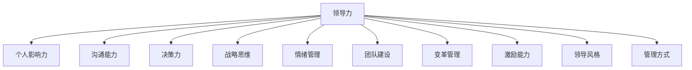

                 

### 文章标题: 领导力修炼手册：从工程总监到管理者的蜕变宝典

#### 关键词:
- **领导力修炼**
- **工程总监**
- **管理者蜕变**
- **团队领导**
- **战略规划**
- **影响力提升**

#### 摘要:
本文旨在为工程总监等中层管理者提供一本系统化的领导力修炼手册。全书围绕领导力的核心概念、实践方法、提升策略和变革管理展开，通过详细的案例分析和实战解析，帮助读者理解并掌握从技术专家向优秀管理者的转型路径。本文不仅阐述了领导力在组织管理中的关键作用，还探讨了如何通过个人成长、团队建设和影响力提升来实现领导力的全面提升。希望通过本书，读者能够找到自己的领导力发展之路，实现职业的蜕变和成长。

---

### 目录大纲

**第一部分: 引言**

- **第1章: 引言**
  - **1.1 领导力修炼的背景**
  - **1.2 书籍的目标和结构**
  - **1.3 阅读指南**

**第二部分: 领导力基础**

- **第2章: 领导力的核心概念**
  - **2.1 领导力的定义**
  - **2.2 领导力的关键要素**
  - **2.3 领导风格与管理方式**

**第三部分: 领导力实践**

- **第3章: 团队领导力**
  - **3.1 团队建设的原则**
  - **3.2 领导者与团队成员的互动**
  - **3.3 团队沟通与冲突管理**

- **第4章: 战略规划与决策**
  - **4.1 战略规划的重要性**
  - **4.2 决策过程中的领导力**
  - **4.3 战略目标与执行计划**

**第四部分: 领导力提升**

- **第5章: 个人领导力提升**
  - **5.1 自我认知与成长**
  - **5.2 情绪管理与压力应对**
  - **5.3 领导力发展计划**

- **第6章: 领导者的影响力**
  - **6.1 影响力的重要性**
  - **6.2 影响力提升策略**
  - **6.3 建立和维护人际关系网**

**第五部分: 领导力变革**

- **第7章: 领导力变革与管理创新**
  - **7.1 变革的驱动因素**
  - **7.2 变革过程中的领导力**
  - **7.3 管理创新的方法与案例**

**第六部分: 项目实战**

- **第8章: 领导力实践案例解析**
  - **8.1 案例背景与目标**
  - **8.2 领导力实践的具体操作**
  - **8.3 结果分析与总结**

**附录**

- **附录A: 领导力工具与方法**
  - **A.1 领导力评估工具**
  - **A.2 领导力发展计划模板**
  - **A.3 领导力模型图**

### 目录大纲设计过程

**1. 确定核心主题和目标读者群体**

首先，我们明确书籍的核心主题是“领导力修炼”，目标读者群体为工程总监等中层管理者。这一群体通常在技术领域有着深厚的背景，但随着职业生涯的发展，他们需要从技术专家向管理者转型，提升自己的领导力和管理能力。

**2. 设计1级目录**

在设计1级目录时，我们分为五个部分：引言、领导力基础、领导力实践、领导力提升和领导力变革。这五个部分构成了全书的基本框架，每个部分都有其独特的主题和目标。

**3. 设计2级目录**

在2级目录中，我们对每个部分进行了进一步细分。例如，在“领导力基础”部分，我们分为三个章节，分别是领导力的核心概念、关键要素和领导风格与管理方式。这样的设计有助于读者逐步深入理解领导力的各个方面。

**4. 设计3级目录**

在3级目录中，我们细化了每个章节的具体内容。例如，在“团队领导力”章节中，我们分为团队建设、领导者与团队成员互动和团队沟通与冲突管理三个部分。这样的设计确保了每个章节都有明确的主题和逻辑结构。

**5. 添加附录部分**

为了增加书籍的实用性和可操作性，我们在附录部分提供了领导力评估工具、发展计划模板和领导力模型图等资源。这些工具和资源可以帮助读者在实际工作中更好地应用领导力理论。

**6. 撰写概述和要点**

在撰写每个章节的概述和要点时，我们确保内容简洁、完整、逻辑清晰。每个章节都围绕着核心概念、算法原理、模型解析和实战案例展开，以确保读者能够全面掌握领导力的理论和实践。

**7. 检查目录结构**

在完成目录大纲后，我们对整个目录结构进行了仔细检查，确保每个章节的内容都符合核心概念、算法原理、模型解析、实战案例等的要求。同时，我们还关注了目录的简洁性、完整性和实用性。

**8. 最终确认**

在所有工作完成后，我们对目录大纲进行了最终确认，确保其简洁性、完整性、逻辑性和实用性。这样，读者在阅读本书时能够有一个清晰的思路，系统地掌握领导力的核心知识和实践方法。

### 第一部分: 引言

#### 第1章: 引言

**1.1 领导力修炼的背景**

在当今快速变化的世界中，领导力已经成为组织成功的关键因素。无论是企业、政府机构还是非营利组织，领导者都需要具备强大的领导力才能带领团队迎接挑战、实现目标。特别是对于工程总监等中层管理者来说，领导力的修炼不仅关乎个人职业发展，更是影响整个组织效率和效果的重要因素。

随着技术的飞速发展，企业面临的市场环境和竞争态势不断变化。中层管理者需要从技术专家转型为管理者，不仅需要掌握技术，还需要具备出色的领导力和管理能力。他们需要在复杂的业务环境中做出快速而明智的决策，有效地协调团队资源，激励团队成员发挥最大潜力。这种转型不仅需要理论知识的积累，更需要实践经验的积累和反思。

**1.2 书籍的目标和结构**

《领导力修炼手册：从工程总监到管理者的蜕变宝典》旨在为工程总监等中层管理者提供一本系统化的领导力修炼指南。本书的目标是帮助读者理解领导力的核心概念、掌握有效的领导力实践方法、提升个人领导力，并学会在变革中引领团队。通过本书，读者可以：

1. 系统学习领导力的基本概念和理论框架。
2. 掌握团队建设和团队沟通的技巧。
3. 学会战略规划与决策的领导力实践。
4. 提升个人情绪管理能力，增强领导力的可持续性。
5. 学会变革管理和创新能力，适应快速变化的环境。

本书的结构分为六个主要部分：

1. **引言**：介绍领导力修炼的背景和书籍的目标。
2. **领导力基础**：阐述领导力的核心概念、关键要素和领导风格。
3. **领导力实践**：讨论团队领导力、战略规划与决策。
4. **领导力提升**：探讨个人领导力提升的方法和策略。
5. **领导力变革**：介绍领导力变革的驱动因素和管理创新的方法。
6. **项目实战**：通过实际案例解析，展示领导力实践的具体操作。

**1.3 阅读指南**

为了帮助读者更好地阅读本书，我们提供以下指南：

1. **逐步阅读**：建议读者按照目录的结构逐步阅读，每章结束后进行回顾，加深理解。
2. **实践应用**：在阅读过程中，可以结合自己的实际工作情况，思考如何应用书中的方法和技巧。
3. **案例分析**：重点阅读案例章节，分析案例中的领导力实践，学习具体操作方法。
4. **反思总结**：在阅读过程中，及时进行反思和总结，形成自己的领导力认知和实践体系。
5. **持续学习**：领导力是一个持续发展的过程，建议读者在阅读完本书后，持续关注相关领域的最新动态，不断学习和提升。

通过以上指南，读者可以更好地利用本书，实现领导力的全面提升，从而在职业生涯中取得更大的成功。

---

### 第二部分: 领导力基础

#### 第2章: 领导力的核心概念

**2.1 领导力的定义**

领导力是指一个人在团队中影响和激励他人，实现共同目标的能力。它不仅仅是一种权力，更是一种技能和艺术。在组织管理中，领导力是推动团队前进、实现目标的关键因素。领导力不同于管理，虽然两者之间存在交集，但领导力更强调个人魅力、愿景和价值观的影响。

**领导力的基本特征：**
- **影响力**：领导者能够通过个人魅力和价值观影响他人，使他们愿意追随和共同努力。
- **愿景**：领导者能够清晰描述组织的愿景和目标，激发团队成员的激情和动力。
- **决策力**：领导者需要在复杂和不确定的环境中做出明智的决策，引导团队走向正确的方向。
- **沟通能力**：领导者需要有效地与团队成员沟通，理解他们的需求和期望，同时传达组织的愿景和目标。
- **激励能力**：领导者能够激励团队成员，激发他们的内在动机，实现个人和团队的共同成长。

**2.2 领导力的关键要素**

要成为一名成功的领导者，需要掌握以下几个关键要素：

**1. 个人影响力：**
个人影响力是领导者最核心的能力之一。它源于领导者的个人魅力、专业知识和价值观。领导者需要通过自身的言行树立榜样，赢得团队的尊重和信任。

**2. 沟通能力：**
沟通能力是领导者的另一个关键要素。领导者需要能够清晰地表达自己的想法，同时倾听团队成员的意见和反馈。有效的沟通能够减少误解，增强团队的凝聚力。

**3. 情绪管理能力：**
情绪管理能力是领导者需要具备的重要素质。在高压和复杂的业务环境中，领导者需要保持冷静，管理好自己的情绪，同时帮助团队成员应对压力和挑战。

**4. 决策能力：**
决策能力是领导者的核心能力之一。领导者需要在信息不完整和不确定的情况下做出明智的决策，并承担相应的责任。良好的决策能力能够帮助团队快速应对变化，抓住机遇。

**5. 战略思维：**
战略思维是指领导者具备的从宏观角度思考和规划组织发展的能力。领导者需要能够制定清晰的战略目标，并制定相应的执行计划，以实现组织的长期成功。

**6. 适应能力：**
适应能力是指领导者能够快速适应变化的环境，调整自己的领导风格和策略。在快速变化的市场和技术环境中，适应能力是领导者成功的关键。

**2.3 领导风格与管理方式**

领导风格是指领导者处理团队和管理事务的方式。不同的领导风格适用于不同的情境和团队。以下是几种常见的领导风格：

**1. �虎式领导：**
虎式领导以强硬和权威为特点，领导者通常采用严格的管理方式，对团队成员的要求非常严格。这种领导风格适用于需要高效率和高纪律性的团队。

**2. 豹式领导：**
豹式领导则更注重灵活性和创新，领导者鼓励团队成员提出新的想法，并支持他们进行实验。这种领导风格适用于需要快速适应市场变化和创新思维的团队。

**3. 鹰式领导：**
鹰式领导具有远见和战略思维，领导者能够从宏观角度规划组织的发展，并制定长期战略。这种领导风格适用于需要战略规划和长期发展的组织。

**4. 豹鹰式领导：**
豹鹰式领导结合了豹式和鹰式的特点，领导者既具备灵活性和创新精神，又具备战略思维和远见。这种领导风格适用于复杂多变的市场环境，能够带领团队在竞争中取得优势。

**管理方式**则是指领导者如何管理团队资源、分配任务和激励员工。有效的管理方式需要根据团队的实际情况和目标来定制。

**1. 目标管理：**
目标管理是一种以目标为导向的管理方式，领导者与团队成员共同设定明确的目标，并制定具体的行动计划。这种管理方式能够提高团队的效率和目标实现率。

**2. 情境管理：**
情境管理是一种根据不同情境和团队成员的需求调整管理方式的方法。领导者需要能够灵活应对不同的情况，采取最适合的管理策略。

**3. 人本管理：**
人本管理强调以人为中心的管理方式，领导者关注团队成员的需求和成长，通过建立信任和支持关系来提高团队的凝聚力和绩效。

通过理解和应用这些领导力和管理方式，工程总监等中层管理者可以提升自己的领导力，带领团队实现组织的战略目标。在下一章中，我们将进一步探讨领导力实践的具体方法和技巧。

---

### 第三部分: 领导力实践

#### 第3章: 团队领导力

**3.1 团队建设的原则**

团队建设是领导力实践中的核心内容之一。一个高效的团队可以显著提升组织的整体绩效。团队建设的目标是培养团队成员之间的信任、协作和共同目标感。以下是一些关键的团队建设原则：

**1. 明确目标和责任：** 团队成员需要清楚地了解组织的愿景和目标，以及自己在团队中的角色和责任。这有助于提高团队的工作效率和目标实现率。

**2. 建立信任：** 信任是团队协作的基础。领导者需要通过言行一致、透明沟通和公正处理冲突来建立和维护团队信任。

**3. 激励和认可：** 领导者需要激励团队成员，鼓励他们发挥潜力。通过认可和奖励团队和个人的成就，可以增强团队的凝聚力和积极性。

**4. 发展多样性和包容性：** 团队成员的多样性和包容性有助于激发创新和创造力。领导者应该鼓励团队成员分享不同的观点和经验，并尊重彼此的差异。

**5. 提供反馈和指导：** 领导者需要定期提供反馈和指导，帮助团队成员改进工作表现和提升技能。

**3.2 领导者与团队成员的互动**

领导者与团队成员的互动是团队领导力的关键组成部分。有效的互动能够促进团队沟通、增强团队凝聚力和提升团队绩效。以下是一些领导者与团队成员互动的技巧：

**1. 倾听：** 倾听是沟通的重要环节。领导者需要倾听团队成员的意见和反馈，了解他们的需求和期望，从而更好地理解团队动态。

**2. 透明沟通：** 领导者应该保持沟通的透明度，及时向团队成员传达信息、目标和决策。透明沟通有助于减少误解和猜疑，增强团队的信任感。

**3. 激励和支持：** 领导者需要激励团队成员，提供必要的支持和资源，帮助他们克服困难和挑战。领导者应该鼓励团队成员发挥自己的优势，共同实现团队目标。

**4. 解决冲突：** 团队内部难免会出现冲突。领导者需要具备有效的冲突解决能力，通过沟通和协商找到双方都能接受的解决方案，以维护团队的和谐与稳定。

**3.3 团队沟通与冲突管理**

有效的团队沟通和冲突管理是团队领导力的核心。以下是一些具体的技巧：

**1. 开放式沟通：** 开放式沟通鼓励团队成员自由表达观点和感受，而不是仅仅听取命令或指示。领导者应该营造一个开放、包容和尊重的环境，让团队成员感到安全和被重视。

**2. 正面反馈：** 正面反馈可以增强团队成员的自信和动力。领导者应该积极认可团队成员的贡献和进步，并提供具体的改进建议。

**3. 冲突预防：** 领导者应该在团队建设过程中预防冲突的发生。通过建立明确的规则和期望，提高团队成员之间的信任和透明度，可以减少潜在冲突。

**4. 冲突解决：** 当冲突发生时，领导者需要采取积极的态度来解决。解决冲突的方法包括直接对话、妥协和第三方调解等。领导者应该根据具体情况选择合适的解决策略。

通过以上团队领导力的实践，工程总监等中层管理者可以有效地提升团队绩效，实现组织的战略目标。在下一章中，我们将探讨战略规划与决策中的领导力实践。

---

### 第四部分: 领导力提升

#### 第5章: 个人领导力提升

**5.1 自我认知与成长**

自我认知是领导力提升的基础。一个优秀的领导者首先需要了解自己，包括自己的价值观、信念、动机、优势和劣势。通过自我认知，领导者可以更好地理解自己的行为和情感，从而更有效地管理团队和应对挑战。

**自我认知的方法：**

1. **反思日志**：通过记录每天的反思日志，领导者可以回顾自己的行为和决策，识别成功和失败的原因，并从中学习。
2. **360度反馈**：收集来自不同角度的反馈，包括上级、同事和下属的反馈，可以帮助领导者更全面地了解自己的行为和影响力。
3. **心理测试**：使用一些心理测试工具，如MBTI（迈尔斯-布里格斯类型指标）或DISC测评，可以帮助领导者了解自己的性格特点和优势。
4. **导师辅导**：找到一位经验丰富的导师，可以提供有价值的指导和反馈，帮助领导者加速成长。

**自我成长的步骤：**

1. **设定目标**：根据自我认知的结果，设定清晰的个人成长目标。这些目标应该具体、可衡量、可实现、相关性强和有时间限制。
2. **制定计划**：为了实现个人成长目标，需要制定详细的计划。这包括学习新技能、参加培训课程、阅读书籍和进行实践等。
3. **持续学习**：领导力是一个持续发展的过程。领导者需要保持好奇心和学习热情，不断更新知识和技能。
4. **实践应用**：将学到的知识和技能应用到实际工作中，通过实践来验证自己的成长和改进。

**5.2 情绪管理与压力应对**

情绪管理和压力应对是领导力提升的重要组成部分。领导者需要学会管理自己的情绪，应对工作压力，以保持良好的心理健康和工作效率。

**情绪管理的方法：**

1. **自我调节**：通过自我意识和自我调节，领导者可以控制自己的情绪反应。这包括学会放松技巧、正念练习和自我反思。
2. **积极心态**：保持积极的心态可以帮助领导者更好地应对挑战。通过积极思考、寻找解决方案和专注于目标，可以减少负面情绪的影响。
3. **有效沟通**：有效的沟通可以帮助领导者更好地表达自己的情感和需求，同时理解和尊重他人的情感。

**压力应对的方法：**

1. **时间管理**：合理安排工作时间，避免过度工作和加班，可以帮助领导者减少工作压力。
2. **放松和休息**：定期进行放松和休息，如进行体育锻炼、参加社交活动或进行冥想等，可以帮助领导者缓解压力。
3. **寻求支持**：在需要时，领导者可以寻求同事、家人或专业人士的支持和建议，以应对压力和困难。

**5.3 领导力发展计划**

为了提升个人领导力，制定一个系统化的领导力发展计划是非常重要的。以下是一个领导力发展计划的框架：

**1. 目标设定**：明确个人领导力发展的长期和短期目标。这些目标应该具体、可衡量、可实现、相关性强和有时间限制。

**2. 资源评估**：评估当前拥有的资源和所需资源，包括时间、资金、人力和知识资源。

**3. 计划制定**：根据目标和资源，制定具体的行动计划。这包括参加培训课程、阅读相关书籍、参加研讨会、寻求导师辅导等。

**4. 执行与监控**：按照行动计划执行，并定期监控进展。确保计划能够按期完成，并调整策略以应对变化。

**5. 反馈与调整**：在领导力发展过程中，收集反馈并进行调整。这有助于不断改进个人领导力，实现长期目标。

通过自我认知与成长、情绪管理与压力应对和领导力发展计划，工程总监等中层管理者可以不断提升自己的领导力，实现职业生涯的蜕变和成长。在下一章中，我们将探讨领导者的影响力及其提升策略。

---

### 第五部分: 领导者的影响力

#### 第6章: 领导者的影响力

**6.1 影响力的重要性**

在领导力实践中，影响力是领导者的一项核心能力。影响力不仅决定了领导者在团队中的地位和认可度，还直接影响着团队的绩效和目标实现。一个具有强大影响力的领导者能够激发团队成员的积极性和创造力，推动团队朝着共同目标前进。

**影响力在领导力中的作用：**

1. **促进团队协作**：领导者通过影响力可以促进团队成员之间的协作，建立互信和合作的关系，从而提高团队的效率和绩效。
2. **推动变革**：在组织变革中，领导者的影响力可以帮助团队成员接受和适应变革，克服变革中的阻力，确保变革的顺利进行。
3. **激励员工**：领导者通过影响力可以激发员工的内在动机，鼓励他们发挥潜力，追求卓越，从而提高员工的满意度和忠诚度。
4. **传递愿景和价值观**：领导者通过影响力可以有效地传递组织的愿景和价值观，确保团队成员理解和认同这些目标，形成共同的目标感。

**6.2 影响力提升策略**

要提升自己的影响力，领导者可以采取以下策略：

**1. 建立信任**：信任是影响力的基础。领导者需要通过言行一致、透明沟通和正直行为来建立和维护信任。只有当团队成员信任领导者时，他们才会愿意追随和接受领导。

**2. 展示专业能力**：领导者需要具备专业知识和技能，通过不断学习和实践提升自己的专业水平。专业能力的展示可以增加领导者在团队中的认可度和权威性。

**3. 激发员工潜力**：领导者需要关注团队成员的发展，发现和激发他们的潜力。通过提供挑战性任务、培训和指导，领导者可以帮助团队成员成长，增强他们对领导者的信任和依赖。

**4. 建立良好的人际关系**：领导者需要与团队成员建立良好的人际关系，了解他们的需求和期望，并提供支持和帮助。良好的人际关系可以增强领导者在团队中的影响力。

**5. 激励和认可**：领导者需要通过激励和认可来激发团队成员的积极性。这包括给予正面反馈、奖励优秀表现和提供职业发展机会等。

**6.3 建立和维护人际关系网**

建立和维护人际关系网是提升影响力的关键策略之一。人际关系网不仅可以帮助领导者获取资源和信息，还可以增强领导者的社会影响力。以下是一些具体的建议：

**1. 积极参与社交活动**：领导者需要积极参与各种社交活动，包括行业会议、社交聚会和团队建设活动等。这些活动可以帮助领导者扩展人际网络。

**2. 建立合作关系**：领导者可以通过建立合作关系来扩大自己的人际关系网。与同行业其他领导者、供应商、客户和合作伙伴建立良好的关系，可以为自己的事业提供更多的机会和支持。

**3. 保持沟通**：领导者需要定期与人际网络中的成员保持沟通，了解他们的最新动态和需求。通过保持联系，领导者可以巩固人际关系，增强彼此的信任。

**4. 提供帮助**：领导者可以在人际关系网中提供帮助，例如推荐合适的候选人、分享资源或提供咨询等。这种互惠互利的关系可以增强人际网络的稳定性和信任度。

**5. 保持诚信**：在建立和维护人际关系网时，领导者需要保持诚信。诚实和正直的行为可以赢得他人的尊重和信任，从而增强领导者的社会影响力。

通过上述策略和技巧，领导者可以提升自己的影响力，成为团队和组织中的核心人物。在下一章中，我们将探讨领导力变革和管理创新的方法。

---

### 第六部分: 领导力变革

#### 第7章: 领导力变革与管理创新

**7.1 变革的驱动因素**

在当今快速变化的世界中，变革已成为组织持续发展的关键。领导者需要具备变革驱动力，带领组织适应外部环境的变化，实现持续创新和成长。以下是驱动领导力变革的几个关键因素：

**1. 技术进步**：随着技术的飞速发展，新的工具、平台和解决方案不断涌现，这要求领导者不断更新自己的知识和技术，推动组织进行技术创新。

**2. 市场竞争**：激烈的市场竞争迫使组织必须不断改进产品和服务，提高效率和质量，以保持竞争优势。领导者需要通过变革来提高组织的竞争力。

**3. 客户需求**：客户需求的变化和多样化要求组织不断调整业务策略和运营模式，以更好地满足客户需求。领导者需要通过变革来适应客户需求的变革。

**4. 管理效率**：随着组织的规模扩大和业务复杂度增加，管理效率成为关键问题。领导者需要通过变革来优化管理流程，提高组织的运营效率。

**5. 社会责任**：社会责任和可持续发展的要求日益增加，组织需要承担更多的社会责任，实现可持续发展。领导者需要通过变革来推动组织履行社会责任。

**7.2 变革过程中的领导力**

在变革过程中，领导力发挥着至关重要的作用。领导者不仅需要具备敏锐的洞察力和战略思维，还需要具备强大的变革领导力，以确保变革的顺利进行。以下是变革过程中领导者需要具备的几个关键能力：

**1. 沟通与共识建设**：领导者需要与团队成员进行有效沟通，传达变革的愿景和目标，建立共识。这有助于减少变革过程中的阻力和误解。

**2. 激励与支持**：领导者需要激励团队成员积极参与变革，提供必要的支持和资源，帮助他们克服变革中的困难和挑战。

**3. 决策与执行**：领导者需要在变革过程中做出明智的决策，并确保决策的执行。这包括制定详细的变革计划、分配任务和监控进展。

**4. 风险管理**：领导者需要识别和管理变革过程中的风险，确保变革在可控范围内进行。这包括制定风险管理计划、建立应急机制和监控风险指标。

**5. 持续改进**：领导者需要推动组织的持续改进，通过反馈和评估来优化变革过程，确保变革达到预期目标。

**7.3 管理创新的方法与案例**

管理创新是提升组织竞争力的重要途径。以下是几种常见的管理创新方法及其案例：

**1. 平台化**：通过构建平台化组织架构，降低内部壁垒，提高资源利用效率。例如，谷歌的“20%时间”政策，允许员工在日常工作外探索自己的创新项目。

**2. 生态化**：通过建立生态系统，整合外部资源，共同创新和成长。例如，苹果公司通过构建开发者社区，推动iOS生态系统的繁荣发展。

**3. 平台化与生态化的结合**：通过结合平台化和生态化，实现更高效的创新和协作。例如，阿里巴巴通过构建电商生态平台，吸引大量第三方商家和开发者参与。

**4. 数据驱动**：通过数据分析和挖掘，实现精准管理和决策。例如，亚马逊通过大数据分析，优化库存管理和供应链，提高运营效率。

**5. 用户体验优化**：以用户为中心，不断优化产品和服务，提升用户体验。例如，特斯拉通过持续改进电动汽车设计和技术，提升用户体验。

通过以上变革和创新方法，领导者可以推动组织实现持续成长和竞争优势。在下一章中，我们将通过实际案例解析，展示领导力实践的具体操作。

---

### 第七部分：项目实战

#### 第8章：领导力实践案例解析

**8.1 案例背景与目标**

为了更好地理解领导力实践的具体操作，我们选择了一家名为“创新科技有限公司”的科技公司作为案例。该公司成立于2008年，主要业务包括软件开发、信息技术服务和系统集成。随着市场环境的不断变化和竞争的加剧，公司高层决定进行领导力提升，以推动企业的持续发展和创新。

案例目标主要包括：
1. 提升管理团队的整体领导力，增强团队的协作能力和创新能力。
2. 改善公司文化，培养积极向上的工作氛围，提高员工满意度和忠诚度。
3. 通过领导力提升，推动公司的战略转型和业务拓展，实现更高的市场占有率。

**8.2 领导力实践的具体操作**

为了实现上述目标，公司采取了一系列具体的领导力提升措施，包括以下几个方面：

**1. 领导力培训与学习：**
公司邀请专业培训机构为管理团队提供领导力培训，内容涵盖领导力核心概念、团队建设、战略规划与决策、情绪管理与压力应对等。此外，公司鼓励管理层成员参加行业会议、研讨会和公开课，不断更新知识，提升领导力。

**2. 内部分享与交流：**
公司定期举办内部分享会，让不同部门的管理者分享自己的领导经验和管理技巧。通过这种形式的交流，管理者可以相互学习，取长补短，提高整体领导力水平。

**3. 项目实战演练：**
公司设置了多个实战项目，让管理团队在实际操作中应用所学知识。例如，开展跨部门合作项目，要求团队成员共同解决问题、制定策略和执行计划。通过项目实战，管理者能够将理论应用到实际，提升自己的领导力和项目管理能力。

**4. 情绪管理与压力应对：**
公司重视员工情绪管理和压力应对，提供一系列心理健康支持和培训。例如，定期举办心理健康讲座、员工心理咨询和团队建设活动，帮助员工缓解压力，提高工作积极性和效率。

**5. 员工发展计划：**
公司制定了详细的员工发展计划，包括个人成长目标、培训计划和职业发展路径。通过这些计划，管理者可以更好地了解和指导团队成员的成长，提升团队的整体能力。

**8.3 结果分析与总结**

经过一年的领导力提升实践，公司取得了显著的效果：

1. **团队协作能力显著提升**：通过领导力培训和实践项目，团队成员之间的沟通和协作更加顺畅，项目的完成质量和效率得到了提高。

2. **公司文化积极向上**：通过内部分享和交流，公司内部形成了积极向上的工作氛围，员工的满意度和忠诚度显著提升。

3. **战略执行力增强**：管理团队在领导力提升过程中，战略规划和决策能力得到了显著提高，公司的战略执行力得到了加强，业务拓展顺利，市场占有率有所提升。

4. **员工情绪稳定**：通过情绪管理和压力应对措施，员工的情绪状态稳定，工作效率和创新能力得到提高。

总结来看，领导力实践对公司的发展起到了重要的推动作用。通过系统化的领导力提升，公司不仅增强了内部凝聚力，还提高了市场竞争力，实现了可持续发展的目标。这一案例表明，领导力提升是组织成功的关键因素，值得其他企业借鉴和实施。

---

### 附录A: 领导力工具与方法

#### A.1 领导力评估工具

领导力评估工具是衡量和管理领导者能力的重要手段。以下是几种常用的领导力评估工具：

**1. 360度反馈：**
360度反馈是一种通过多角度收集反馈的方式来评估领导力的方法。参与者包括领导者的直接上级、同事、下属和外部顾问等。反馈内容涵盖领导力各个方面，如沟通能力、决策能力、团队管理、战略规划等。

**2. 领导力量表：**
领导力量表是一种标准化的评估工具，通过一系列问题来衡量领导者的能力。常见的量表包括“领导力行为量表”（LBC）和“领导者能力量表”（LAI），它们分别从行为特征和能力特征两个维度进行评估。

**3. 自我评估问卷：**
自我评估问卷是领导者自我反思和自我提升的重要工具。通过填写问卷，领导者可以识别自己的优势和劣势，从而制定个人发展计划。

**4. 行为观察法：**
行为观察法通过直接观察领导者的行为和工作表现来评估其领导力。这种方法通常由第三方评估者进行，可以提供更客观、准确的评估结果。

#### A.2 领导力发展计划模板

一个有效的领导力发展计划可以帮助领导者系统性地提升自己的能力。以下是一个领导力发展计划的模板：

**1. 设定目标：**
明确领导力发展计划的目标，包括长期目标和短期目标。例如，提升战略规划能力、增强团队管理能力等。

**2. 分析现状：**
评估当前领导力水平，识别优势和劣势。这可以通过360度反馈、自我评估问卷等方法进行。

**3. 制定行动计划：**
根据现状分析，制定具体的行动计划。这包括参加培训课程、阅读相关书籍、寻求导师辅导、参加实践项目等。

**4. 资源分配：**
明确所需的资源，包括时间、资金、人力等。确保计划能够得到有效实施。

**5. 执行与监控：**
按照行动计划执行，并定期监控进展。确保计划能够按期完成，并调整策略以应对变化。

**6. 反馈与评估：**
在领导力发展过程中，收集反馈并进行评估。这有助于不断改进个人领导力，实现长期目标。

#### A.3 领导力模型图

以下是一个简化的领导力模型图，用于展示领导力的不同维度和要素：

这个模型图展示了领导力的核心要素和它们之间的关系，有助于领导者全面了解和提升自己的领导力。

---

### 文章总结与展望

通过《领导力修炼手册：从工程总监到管理者的蜕变宝典》，我们深入探讨了领导力的核心概念、实践方法、提升策略和变革管理。从明确领导力的定义和关键要素，到探讨团队领导力、战略规划与决策，再到提升个人领导力和影响力，以及管理变革与创新，本书为工程总监等中层管理者提供了一套系统化的领导力修炼指南。

本文的主要观点包括：

1. **领导力的核心在于影响力**：领导力不仅是一种权力，更是一种技能和艺术，它源于个人魅力、专业知识和价值观。一个成功的领导者能够通过个人影响力激励和引导团队。

2. **团队领导力是关键**：团队建设、团队沟通与冲突管理是领导力实践的核心。一个高效的团队可以显著提升组织的整体绩效。

3. **个人领导力的提升需要自我认知与成长、情绪管理与压力应对**：领导者需要不断反思自我，提升自身素质，以应对复杂多变的工作环境。

4. **影响力提升策略和管理创新**：通过建立良好的人际关系网、激励与认可等策略，领导者可以提升自己的影响力，推动组织实现创新和变革。

5. **变革管理是组织持续发展的关键**：领导者需要具备变革驱动力，带领组织适应外部环境的变化，实现持续创新和成长。

在未来的领导力研究和实践中，以下方向值得进一步探索：

1. **领导力的跨文化研究**：在全球化的背景下，领导力的跨文化研究变得尤为重要。了解不同文化背景下的领导力特点和应用策略，有助于提升领导者的全球视野。

2. **领导力与人工智能的结合**：随着人工智能技术的发展，领导力与人工智能的结合有望带来新的研究和应用方向。例如，利用人工智能技术进行领导力评估和优化，提高领导力的科学性和有效性。

3. **领导力与可持续发展的融合**：在可持续发展的背景下，领导者需要具备环境和社会责任意识。研究如何将领导力与可持续发展相结合，有助于推动组织的可持续发展战略。

4. **领导力培训与发展的创新方法**：随着社会和技术的不断发展，领导力培训和发展方法也需要不断创新。探索新的培训模式，如虚拟现实、增强现实和在线学习平台，可以提升领导力培训的互动性和实效性。

总之，《领导力修炼手册：从工程总监到管理者的蜕变宝典》为中层管理者提供了一套全面的领导力提升方案。通过不断学习和实践，读者可以提升自己的领导力，实现职业生涯的蜕变和成长。

### 作者信息

**作者：** AI天才研究院/AI Genius Institute & 禅与计算机程序设计艺术 /Zen And The Art of Computer Programming

AI天才研究院（AI Genius Institute）致力于推动人工智能技术的研发和应用，为全球企业提供智能解决方案。同时，我们关注人工智能领域的人才培养，致力于提升人工智能从业者的技术水平和管理能力。

《禅与计算机程序设计艺术》（Zen And The Art of Computer Programming）是作者Donald E. Knuth的经典著作，全面探讨了计算机程序设计的哲学和艺术。本书不仅为程序员提供了宝贵的编程经验和技巧，也为我们理解人工智能和领导力提供了深刻的启示。

在撰写《领导力修炼手册：从工程总监到管理者的蜕变宝典》的过程中，我们结合了最新的研究成果和实际案例，力求为中层管理者提供一本具有实用性和前瞻性的领导力指南。希望通过本书，能够帮助读者在职业生涯中实现领导力的全面提升，为组织的持续发展和创新贡献力量。

