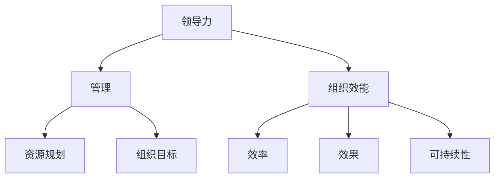
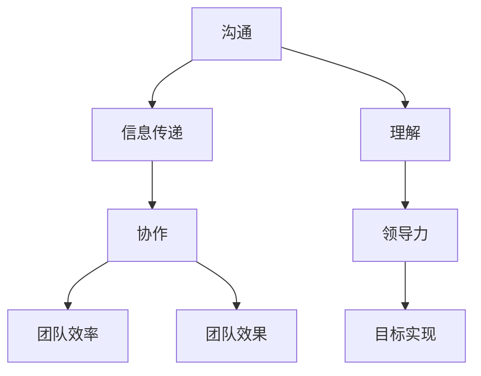
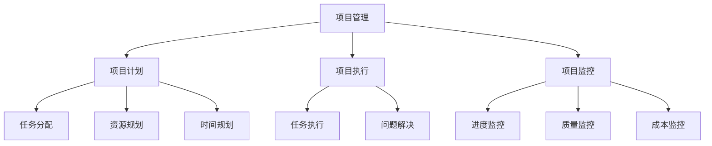
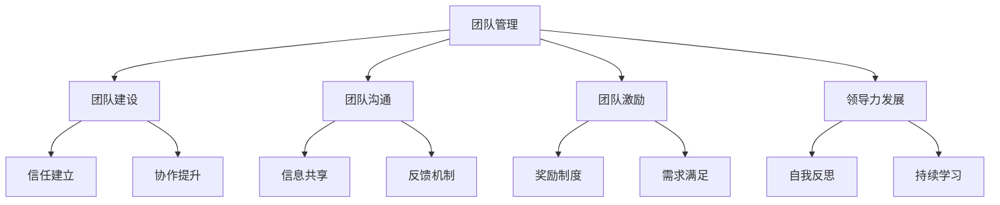
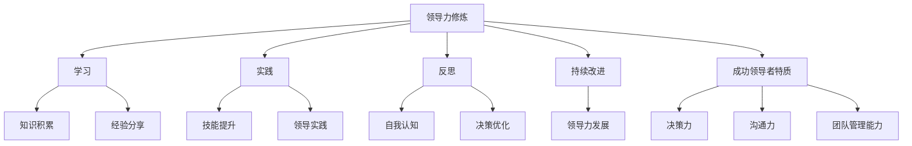

                 

### 第一部分：领导力基础

#### 第1章：领导力的定义与重要性

**背景介绍**

在信息化时代，技术专家在企业中扮演着至关重要的角色。然而，当技术专家逐步成长为管理者时，如何进行角色转换，如何在新的领导角色中发挥作用，成为了一个重要课题。领导力不仅是管理者的必备素质，也是技术专家在转型过程中必须掌握的核心能力。

**核心概念与联系**

- **领导力**：是一种能够激发、引导和影响他人共同实现目标的能力。
- **管理**：是对资源进行规划、组织、领导和控制的过程，旨在实现组织的目标。
- **组织效能**：是指组织在达成目标过程中的效率、效果和可持续性。

**Mermaid 流程图**



**核心算法原理讲解**

领导力涉及到多个方面的能力，包括沟通技巧、决策能力、团队管理、变革管理等。以下是领导力核心算法原理的伪代码概述：

```python
class LeadershipAlgorithm:
    def __init__(self):
        self.communication_skills = []
        self.decision_making = []
        self.team_management = []
        self.change_management = []

    def improve_communication_skills(self):
        # 伪代码：提高沟通技巧
        self.communication_skills.append("active listening")
        self.communication_skills.append("clear expression")
        self.communication_skills.append("non-verbal communication")

    def improve_decision_making(self):
        # 伪代码：提高决策能力
        self.decision_making.append("SWOT analysis")
        self.decision_making.append("decision trees")
        self.decision_making.append("hierarchical decision-making")

    def improve_team_management(self):
        # 伪代码：提高团队管理能力
        self.team_management.append("team building")
        self.team_management.append("conflict resolution")
        self.team_management.append("motivation strategies")

    def improve_change_management(self):
        # 伪代码：提高变革管理能力
        self.change_management.append("change models")
        self.change_management.append("change leadership")
        self.change_management.append("change communication")
```

**数学模型和公式**

领导力的提升可以通过以下数学模型来描述：

- **领导力提升函数**：`L(t) = L0 + k * t`

  其中，`L(t)`表示在时间`t`后的领导力水平，`L0`表示初始领导力水平，`k`表示领导力提升速率。

**详细讲解与举例说明**

1. **沟通技巧**

   沟通技巧是领导力的基础。一个有效的领导者需要具备良好的沟通能力，包括聆听、表达和反馈。以下是一个例子：

   ```markdown
   情景：在一次团队会议上，领导需要向团队成员传达一项重要决策。

   步骤：
   - **聆听**：认真听取团队成员的意见和反馈。
   - **表达**：清晰、简洁地传达决策内容，确保团队成员理解。
   - **反馈**：询问团队成员是否理解并接受决策。
   ```

2. **决策能力**

   决策能力是领导者面对复杂问题时进行有效决策的能力。以下是一个例子：

   ```markdown
   情景：领导需要决定是否采纳某个新项目的建议。

   步骤：
   - **SWOT分析**：分析项目的优势、劣势、机会和威胁。
   - **决策树**：构建决策树，列出所有可能的决策路径和结果。
   - **层次决策**：根据决策树，进行层次化决策，选择最佳方案。
   ```

**项目实战**

在实际工作中，领导力的提升可以通过以下项目实战来实现：

1. **开发环境搭建**：创建一个领导力提升项目，包括在线课程、研讨会和实践活动。
2. **源代码实现**：编写领导力提升算法，包括沟通技巧提升、决策能力提升等。
3. **代码解读与分析**：解读和优化领导力提升算法，提高其效率和效果。
4. **实际案例分析和详细讲解剖析**：通过实际案例，分析领导力的应用和实践效果。
5. **项目小结**：总结领导力提升项目的成果和经验，为后续工作提供参考。

**最佳实践 tips**

1. **持续学习**：领导者需要不断学习新知识和技能，以适应不断变化的环境。
2. **实践应用**：理论结合实践，将领导力知识应用到实际工作中。
3. **反思与改进**：定期反思领导力实践，找出不足并持续改进。

**小结**

领导力是技术专家转型为管理者的重要能力。通过提升沟通技巧、决策能力和团队管理能力，技术专家可以有效地实现角色转变，并在新的领导角色中发挥作用。

**注意事项**

1. **理解领导力的本质**：领导力不仅仅是管理技能，更是一种影响和激励他人的能力。
2. **结合个人特点**：每个领导者都有其独特的领导风格，需要根据个人特点进行领导力的培养。

**拓展阅读**

1. **《领导力五要素》**：约翰·科特（John Kotter）著，详细介绍了领导力的五个关键要素。
2. **《影响力》**：罗伯特·西奥迪尼（Robert B. Cialdini）著，分析了影响他人的六个原则。
3. **《第五项修炼》**：彼得·圣吉（Peter M. Senge）著，提出了团队学习和领导力的修炼方法。

---

> **# 第二部分：领导力技能的培养**

### 第3章：沟通与协作

**背景介绍**

沟通与协作是领导力的核心要素，对于管理者来说尤为重要。有效的沟通能够确保信息准确传达，协作能够提高团队的工作效率和效果。在这个章节中，我们将探讨沟通与协作的重要性，以及如何提升这些技能。

**核心概念与联系**

- **沟通**：信息在人与人之间的传递和理解过程。
- **协作**：团队为了共同目标而进行的合作。
- **领导力**：影响和激励他人实现目标的能力。

**Mermaid 流�程图**



**核心算法原理讲解**

1. **沟通技巧提升算法**

   ```python
   class CommunicationAlgorithm:
       def __init__(self):
           self.active_listening = False
           self.clear_expression = False
           self.non_verbal_communication = False

       def improve_active_listening(self):
           self.active_listening = True

       def improve_clear_expression(self):
           self.clear_expression = True

       def improve_non_verbal_communication(self):
           self.non_verbal_communication = True
   ```

2. **协作能力提升算法**

   ```python
   class CollaborationAlgorithm:
       def __init__(self):
           self.team_building = False
           self.conflict_resolution = False
           self.motivation_strategies = False

       def improve_team_building(self):
           self.team_building = True

       def improve_conflict_resolution(self):
           self.conflict_resolution = True

       def improve_motivation_strategies(self):
           self.motivation_strategies = True
   ```

**数学模型和公式**

沟通与协作的效率可以通过以下数学模型来衡量：

- **沟通效率公式**：`E_communication = f(listening, expression, non-verbal)`

  其中，`E_communication`表示沟通效率，`listening`、`expression`和`non-verbal`分别表示聆听、表达和非言语沟通的能力。

- **协作效率公式**：`E_collaboration = f(team_building, conflict_resolution, motivation)`

  其中，`E_collaboration`表示协作效率，`team_building`、`conflict_resolution`和`motivation`分别表示团队建设、冲突解决和激励策略的能力。

**详细讲解与举例说明**

1. **沟通技巧**

   沟通技巧的提升对于管理者来说至关重要。以下是一个具体的例子：

   ```markdown
   情景：领导需要在一次团队会议上传达一项紧急决策。

   步骤：
   - **聆听**：在会议前，领导需要了解团队成员的意见和担忧。
   - **表达**：在会议中，领导需要清晰、简洁地传达决策内容，确保团队成员理解。
   - **反馈**：在会议结束后，领导需要收集团队成员的反馈，并根据反馈进行调整。
   ```

2. **协作能力**

   协作能力的提升有助于团队目标的实现。以下是一个具体的例子：

   ```markdown
   情景：团队需要在短时间内完成一个重要项目。

   步骤：
   - **团队建设**：通过定期的团队活动和培训，增强团队成员之间的信任和合作。
   - **冲突解决**：在项目进展过程中，及时解决团队内部的冲突，确保项目顺利进行。
   - **激励策略**：通过奖励和表彰，激励团队成员积极投入工作，提高项目效率。
   ```

**项目实战**

在实际工作中，沟通与协作能力的提升可以通过以下项目实战来实现：

1. **开发环境搭建**：创建一个沟通与协作平台，包括在线沟通工具和协作工具。
2. **源代码实现**：编写沟通与协作算法，包括沟通技巧提升和协作能力提升。
3. **代码解读与分析**：解读和优化沟通与协作算法，提高其效率和效果。
4. **实际案例分析和详细讲解剖析**：通过实际案例，分析沟通与协作在团队工作中的应用和实践效果。
5. **项目小结**：总结沟通与协作能力的提升方法和经验，为后续工作提供参考。

**最佳实践 tips**

1. **定期培训**：定期组织沟通与协作培训，提高团队成员的技能和意识。
2. **建立反馈机制**：建立有效的反馈机制，鼓励团队成员提出意见和建议。
3. **积极沟通**：领导者需要以身作则，积极与团队成员沟通，建立良好的沟通氛围。

**小结**

沟通与协作是领导力的核心要素，对于管理者的成功至关重要。通过提升沟通技巧和协作能力，管理者可以有效地提高团队的工作效率和效果。

**注意事项**

1. **理解沟通的障碍**：管理者需要了解沟通障碍的原因和解决方案，提高沟通的有效性。
2. **平衡沟通与行动**：管理者需要在沟通与行动之间找到平衡，确保团队目标的实现。

**拓展阅读**

1. **《非暴力沟通》**：马歇尔·卢森堡（Marshall B. Rosenberg）著，介绍了非暴力沟通的技巧和方法。
2. **《团队协作的艺术》**：威廉·乌里（William Ury）著，探讨了团队协作的原则和技巧。
3. **《影响力》**：罗伯特·西奥迪尼（Robert B. Cialdini）著，分析了影响他人的六个原则。

---

> **# 第三部分：管理技能的实践**

### 第6章：项目管理

**背景介绍**

项目管理是领导力的重要组成部分，特别是在技术领域。有效的项目管理能够确保项目按时、按质量完成，同时控制成本和风险。在这个章节中，我们将探讨项目管理的核心概念、方法和实践。

**核心概念与联系**

- **项目管理**：确保项目按计划完成的一系列管理活动。
- **项目计划**：对项目目标、任务、资源和时间进行规划和分配。
- **项目执行**：按照项目计划执行任务，确保项目目标的实现。
- **项目监控**：对项目进度、质量和成本进行监控和调整。

**Mermaid 流程图**



**核心算法原理讲解**

项目管理涉及到多个核心算法原理，包括任务分配、资源规划、时间规划和风险控制等。以下是这些算法原理的伪代码概述：

1. **任务分配算法**

   ```python
   class TaskAllocationAlgorithm:
       def __init__(self):
           self.task_list = []
           self.assigned_resources = []

       def allocate_tasks(self, task, resource):
           self.task_list.append(task)
           self.assigned_resources.append(resource)

       def get_task_resources(self, task):
           for t, r in zip(self.task_list, self.assigned_resources):
               if t == task:
                   return r
           return None
   ```

2. **资源规划算法**

   ```python
   class ResourcePlanningAlgorithm:
       def __init__(self):
           self.resource_list = []
           self.resource_usage = []

       def add_resource(self, resource):
           self.resource_list.append(resource)

       def plan_resources(self, task, required_resources):
           for r in self.resource_list:
               if r in required_resources:
                   self.resource_usage.append(r)
   ```

3. **时间规划算法**

   ```python
   class TimePlanningAlgorithm:
       def __init__(self):
           self.task_list = []
           self.due_dates = []

       def add_task(self, task, due_date):
           self.task_list.append(task)
           self.due_dates.append(due_date)

       def get_task_due_date(self, task):
           for t, d in zip(self.task_list, self.due_dates):
               if t == task:
                   return d
           return None
   ```

4. **风险控制算法**

   ```python
   class RiskControlAlgorithm:
       def __init__(self):
           self.risk_list = []

       def add_risk(self, risk):
           self.risk_list.append(risk)

       def assess_risk(self, risk, impact, probability):
           self.risk_list.append({
               'risk': risk,
               'impact': impact,
               'probability': probability
           })

       def get_risk prioritize(self):
           return sorted(self.risk_list, key=lambda x: (x['impact'] * x['probability']), reverse=True)
   ```

**数学模型和公式**

项目管理的效率可以通过以下数学模型来衡量：

- **项目效率公式**：`E_project = f(plan, execution, monitoring)`

  其中，`E_project`表示项目效率，`plan`、`execution`和`monitoring`分别表示项目计划、执行和监控的效率。

- **项目成本公式**：`C_project = f(resource_cost, time_cost, risk_cost)`

  其中，`C_project`表示项目成本，`resource_cost`、`time_cost`和`risk_cost`分别表示资源成本、时间和风险成本。

**详细讲解与举例说明**

1. **项目计划**

   项目计划是项目管理的第一步，包括任务分配、资源规划和时间规划。以下是一个具体的例子：

   ```markdown
   情景：领导需要制定一个软件开发项目的计划。

   步骤：
   - **任务分配**：确定项目任务，并将任务分配给合适的团队成员。
   - **资源规划**：确定项目所需的资源，如人力、物力和财力，并规划资源的分配。
   - **时间规划**：确定项目的完成时间，并制定详细的时间计划。
   ```

2. **项目执行**

   项目执行是按照项目计划执行任务的过程。以下是一个具体的例子：

   ```markdown
   情景：领导需要确保软件开发项目按计划进行。

   步骤：
   - **任务执行**：团队成员按照任务分配，进行项目的开发工作。
   - **问题解决**：在项目执行过程中，及时解决遇到的问题和障碍，确保项目顺利进行。
   ```

3. **项目监控**

   项目监控是对项目进度、质量和成本进行监控和调整的过程。以下是一个具体的例子：

   ```markdown
   情景：领导需要监控软件开发项目的进度和质量。

   步骤：
   - **进度监控**：定期检查项目的完成情况，确保项目按计划进行。
   - **质量监控**：检查项目的质量和功能是否符合要求，及时进行调整和优化。
   - **成本监控**：监控项目的成本支出，确保项目在预算范围内完成。
   ```

**项目实战**

在实际工作中，项目管理的实践可以通过以下项目实战来实现：

1. **开发环境搭建**：搭建一个项目管理系统，包括任务管理、资源管理和时间管理等功能。
2. **源代码实现**：编写项目管理算法，包括任务分配、资源规划和时间规划等。
3. **代码解读与分析**：解读和优化项目管理算法，提高其效率和效果。
4. **实际案例分析和详细讲解剖析**：通过实际案例，分析项目管理的应用和实践效果。
5. **项目小结**：总结项目管理的经验和教训，为后续工作提供参考。

**最佳实践 tips**

1. **明确项目目标**：在项目开始前，明确项目目标和预期结果，确保团队成员明确自己的工作方向。
2. **定期沟通**：定期与团队成员沟通，了解项目的进展情况和存在的问题，及时调整项目计划。
3. **风险管理**：识别项目中的风险，制定相应的风险应对策略，降低项目风险。

**小结**

项目管理是领导力的关键组成部分，对于项目的成功至关重要。通过有效的项目计划、执行和监控，管理者可以确保项目按时、按质量完成。

**注意事项**

1. **了解项目管理的方法和工具**：管理者需要熟悉项目管理的方法和工具，提高项目管理的效率。
2. **灵活应对变化**：在项目执行过程中，管理者需要灵活应对变化，及时调整项目计划。

**拓展阅读**

1. **《项目管理知识体系指南》**：PMI（Project Management Institute）著，详细介绍了项目管理的知识体系。
2. **《敏捷项目管理》**：杰夫·萨瑟兰（Jeff Sutherland）著，介绍了敏捷项目管理的原则和方法。
3. **《项目管理实践标准》**：ISO（International Organization for Standardization）著，规定了项目管理的最佳实践。

---

> **# 第三部分：管理技能的实践**

### 第7章：团队管理与领导力发展

**背景介绍**

团队管理是领导力的关键组成部分，有效的团队管理能够提高团队的工作效率和成员的满意度。同时，领导力的发展对于管理者的长期职业发展至关重要。在这个章节中，我们将探讨团队管理的方法和领导力发展的途径。

**核心概念与联系**

- **团队管理**：对团队成员进行有效组织和协调，以实现团队目标的过程。
- **领导力发展**：通过学习和实践，提高个人领导能力的持续过程。
- **领导力**：影响和激励他人实现目标的能力。

**Mermaid 流程图**



**核心算法原理讲解**

团队管理和领导力发展涉及到多个核心算法原理，包括团队建设、团队沟通、团队激励和领导力发展等。以下是这些算法原理的伪代码概述：

1. **团队建设算法**

   ```python
   class TeamBuildingAlgorithm:
       def __init__(self):
           self.trust_building = False
           self.collaboration = False

       def build_trust(self):
           self.trust_building = True

       def promote_collaboration(self):
           self.collaboration = True
   ```

2. **团队沟通算法**

   ```python
   class TeamCommunicationAlgorithm:
       def __init__(self):
           self信息共享 = False
           self.feedback_mechanism = False

       def enable_information_sharing(self):
           self信息共享 = True

       def establish_feedback_mechanism(self):
           self.feedback_mechanism = True
   ```

3. **团队激励算法**

   ```python
   class TeamIncentiveAlgorithm:
       def __init__(self):
           self.reward_system = False
           self.satisfaction_maintenance = False

       def implement_reward_system(self):
           self.reward_system = True

       def maintain_satisfaction(self):
           self.satisfaction_maintenance = True
   ```

4. **领导力发展算法**

   ```python
   class LeadershipDevelopmentAlgorithm:
       def __init__(self):
           self.self_reflection = False
           self.continuous_learning = False

       def practice_self_reflection(self):
           self.self_reflection = True

       def engage_in_continuous_learning(self):
           self.continuous_learning = True
   ```

**数学模型和公式**

团队管理和领导力发展的效果可以通过以下数学模型来衡量：

- **团队管理效率公式**：`E_team_management = f(team_building, team_communication, team_incentive)`

  其中，`E_team_management`表示团队管理效率，`team_building`、`team_communication`和`team_incentive`分别表示团队建设、团队沟通和团队激励的效率。

- **领导力发展效率公式**：`E_leadership_development = f(self_reflection, continuous_learning)`

  其中，`E_leadership_development`表示领导力发展效率，`self_reflection`和`continuous_learning`分别表示自我反思和持续学习的效率。

**详细讲解与举例说明**

1. **团队建设**

   团队建设是团队管理的基础。以下是一个具体的例子：

   ```markdown
   情景：领导需要建立一个高效的团队。

   步骤：
   - **信任建立**：通过团队合作和沟通，建立团队成员之间的信任。
   - **协作提升**：组织团队活动，促进团队成员之间的协作和合作。
   ```

2. **团队沟通**

   团队沟通是团队管理的关键。以下是一个具体的例子：

   ```markdown
   情景：领导需要在团队中建立有效的沟通机制。

   步骤：
   - **信息共享**：确保团队成员能够及时获取和分享项目信息。
   - **反馈机制**：建立反馈机制，鼓励团队成员提出意见和建议。
   ```

3. **团队激励**

   团队激励是团队管理的重要手段。以下是一个具体的例子：

   ```markdown
   情景：领导需要激励团队成员提高工作积极性。

   步骤：
   - **奖励制度**：建立奖励制度，对团队成员的成就进行表彰和奖励。
   - **需求满足**：了解团队成员的需求，并提供相应的支持和资源。
   ```

4. **领导力发展**

   领导力发展是管理者持续成长的途径。以下是一个具体的例子：

   ```markdown
   情景：领导需要提升自己的领导能力。

   步骤：
   - **自我反思**：定期进行自我反思，识别自身的不足并制定改进计划。
   - **持续学习**：参加培训课程、阅读专业书籍，不断学习新的知识和技能。
   ```

**项目实战**

在实际工作中，团队管理和领导力发展的实践可以通过以下项目实战来实现：

1. **开发环境搭建**：创建一个团队管理平台，包括团队建设、团队沟通和团队激励等功能。
2. **源代码实现**：编写团队管理和领导力发展算法，包括信任建立、信息共享、奖励制度等。
3. **代码解读与分析**：解读和优化团队管理和领导力发展算法，提高其效率和效果。
4. **实际案例分析和详细讲解剖析**：通过实际案例，分析团队管理和领导力发展的应用和实践效果。
5. **项目小结**：总结团队管理和领导力发展的经验和教训，为后续工作提供参考。

**最佳实践 tips**

1. **建立良好的沟通机制**：确保团队成员之间的信息流畅和沟通有效。
2. **鼓励团队合作**：通过团队活动和培训，促进团队成员之间的协作和合作。
3. **提供持续的学习机会**：为团队成员提供学习资源和培训机会，支持他们的职业发展。

**小结**

团队管理和领导力发展是管理者的重要技能，对于团队的高效运作和个人职业成长都至关重要。通过有效的团队管理和领导力发展，管理者可以提升团队的工作效率和成员的满意度。

**注意事项**

1. **关注团队成员的需求**：了解和满足团队成员的需求，提高他们的工作积极性。
2. **持续改进**：不断反思和改进团队管理和领导力发展的方法和实践。

**拓展阅读**

1. **《团队协作的艺术》**：威廉·乌里（William Ury）著，探讨了团队协作的原则和技巧。
2. **《领导力五要素》**：约翰·科特（John Kotter）著，详细介绍了领导力的五个关键要素。
3. **《团队管理实战》**：斯蒂芬·罗宾斯（Stephen Robbins）著，提供了团队管理的实际方法和策略。

---

> **# 第四部分：领导力实战与反思**

### 第8章：领导力实践案例分析

**背景介绍**

在领导力的发展过程中，通过实践案例分析可以帮助管理者更好地理解和应用领导力原则。在这个章节中，我们将通过三个具体的案例分析，探讨领导力在不同情境下的应用和实践效果。

**案例一：成功转型**

**背景**：
某大型科技公司的CTO李明在带领团队完成了一项重大技术创新后，被提升为公司的CEO。然而，他很快发现，从技术专家到管理者的角色转变充满了挑战。

**核心问题**：
- 如何在新的领导角色中发挥影响力？
- 如何处理技术团队和管理团队之间的差异？

**解决方案**：

1. **领导风格转变**：
   李明意识到，他需要从技术导向转变为更加注重团队协作和战略规划。他开始采用更加开放和包容的领导风格，鼓励团队成员提出建议和意见。

2. **沟通技巧提升**：
   李明定期组织团队会议，确保信息流畅和透明。他通过积极的聆听和清晰的表达，建立起了与团队成员之间的信任和沟通。

3. **激励策略**：
   李明制定了激励机制，表彰团队成员的成就，并为他们提供职业发展的机会。

**结果**：
经过一段时间的努力，李明成功地将公司带入了新的发展阶段，团队的士气和创新能力得到了显著提升。

**案例二：团队困境**

**背景**：
一家初创公司的研发团队在产品开发过程中遭遇了重大困难。团队成员士气低落，项目进度严重滞后。

**核心问题**：
- 如何激发团队的士气？
- 如何解决项目进度问题？

**解决方案**：

1. **问题诊断**：
   领导者首先与团队成员进行了深入交流，了解问题的根本原因。通过调查发现，问题主要集中在项目管理不善和团队成员的技能不足。

2. **项目管理改进**：
   领导者引入了新的项目管理工具和方法，如敏捷开发，以提高项目的进度控制和质量。

3. **技能培训**：
   领导者组织了针对团队成员的技能培训，提升他们的专业能力。

4. **激励与支持**：
   领导者通过激励措施和情感支持，帮助团队成员重拾信心，鼓励他们共同努力解决问题。

**结果**：
在领导者的带领下，团队逐渐走出了困境，项目进度得到了显著提升，团队成员的士气也得到了恢复。

**案例三：应对变革**

**背景**：
一家传统制造企业面临行业变革，需要转型升级以保持竞争力。然而，变革过程引发了员工的不满和抵触。

**核心问题**：
- 如何引导员工接受变革？
- 如何确保变革的顺利进行？

**解决方案**：

1. **沟通与透明度**：
   领导者通过定期的会议和沟通，向员工解释变革的原因和重要性，确保信息透明。

2. **参与与反馈**：
   领导者鼓励员工参与变革过程，收集他们的意见和建议，使员工感到自己是变革的一部分。

3. **培训与支持**：
   领导者为员工提供了相关的培训和资源支持，帮助他们适应新的工作环境和技能要求。

4. **激励与认可**：
   领导者通过激励措施和认可，激励员工积极投入到变革中，并为他们的努力和贡献给予认可。

**结果**：
在领导者的引导下，企业成功完成了变革，员工逐渐适应了新的工作模式，企业的竞争力也得到了显著提升。

**总结**

这三个案例展示了领导力在不同情境下的应用和实践效果。通过有效的领导力，管理者可以成功地应对角色转变、团队困境和变革挑战，推动组织的发展和进步。

**注意事项**

1. **领导者的角色认知**：领导者需要明确自己的角色，根据不同情境采取适当的领导风格。
2. **沟通与反馈**：领导者需要保持开放的沟通渠道，鼓励团队成员提出意见和建议。
3. **激励与支持**：领导者需要通过激励措施和情感支持，激发团队成员的积极性和创造力。

**拓展阅读**

1. **《领导者的变革之路》**：约翰·科特（John Kotter）著，详细介绍了领导者如何引导组织应对变革。
2. **《团队协作的力量》**：斯蒂芬·罗宾斯（Stephen Robbins）著，探讨了团队协作的重要性和实现方法。
3. **《成功领导者的七个习惯》**：史蒂芬·柯维（Stephen R. Covey）著，提供了领导者培养良好习惯的方法和策略。

---

### 第9章：领导力修炼之路

**背景介绍**

领导力是一个持续修炼的过程，需要管理者不断学习、实践和反思。在这个章节中，我们将探讨领导力修炼的方法、反思与持续改进的重要性，以及成功领导者的特质。

**核心概念与联系**

- **领导力修炼**：通过学习、实践和反思，不断提升个人领导能力的持续过程。
- **反思**：领导者对自身行为和决策进行深入思考，以识别不足和改进机会。
- **持续改进**：领导者通过不断学习和实践，持续提升自己的领导力水平。
- **成功领导者特质**：成功领导者具备的一系列素质和特质。

**Mermaid 流程图**



**领导力修炼的方法**

1. **学习**

   学习是领导力修炼的基础。领导者需要不断学习新知识和技能，以适应不断变化的环境。以下是一些学习方法：

   - **阅读**：阅读专业的书籍、论文和案例研究，获取新的见解和思路。
   - **培训**：参加领导力培训课程，学习领导力理论和实践方法。
   - **经验分享**：与同行交流，分享经验和教训，互相学习。

2. **实践**

   实践是检验学习成果的重要环节。领导者需要在实际工作中应用所学知识和技能，通过实践不断提升自己的领导力。以下是一些实践方法：

   - **领导实践**：担任团队领导或项目负责人，锻炼领导能力。
   - **角色扮演**：通过模拟演练，提高决策能力和沟通技巧。
   - **反馈与调整**：从实践中收集反馈，根据反馈进行自我调整。

3. **反思**

   反思是领导力修炼的关键环节。领导者需要定期反思自己的行为和决策，识别不足和改进机会。以下是一些反思方法：

   - **自我反思**：定期花时间思考自己的行为和决策，分析成功和失败的原因。
   - **反馈与建议**：倾听团队成员的意见和建议，了解他们的期望和反馈。
   - **记录与总结**：记录反思过程和结果，形成总结和经验教训。

**反思与持续改进**

反思与持续改进是领导力修炼的核心。领导者需要通过反思识别自身不足，并根据反馈进行调整和改进。以下是一些持续改进的方法：

1. **自我认知**：了解自己的优点和不足，识别需要改进的领域。
2. **决策优化**：反思决策过程，分析决策的正确性和有效性，优化决策方法。
3. **技能提升**：根据反思结果，制定学习计划，提升相关技能。
4. **行为调整**：根据反思和改进计划，调整行为和习惯，提升领导力。

**成功领导者的特质**

成功领导者具备一系列特质，包括决策力、沟通力、团队管理能力等。以下是一些成功领导者的特质：

1. **决策力**：成功领导者具备强大的决策力，能够在复杂和不确定的环境中做出明智的决策。
2. **沟通力**：成功领导者具备出色的沟通力，能够清晰、有效地传达信息和激励团队。
3. **团队管理能力**：成功领导者具备出色的团队管理能力，能够激发团队的潜力，实现共同目标。
4. **诚信与责任感**：成功领导者具备高度的诚信和责任感，能够赢得团队的信任和支持。
5. **持续学习与自我提升**：成功领导者具备持续学习的能力，不断自我提升，以适应不断变化的环境。

**总结**

领导力修炼是一个持续的过程，需要领导者不断学习、实践和反思。通过反思与持续改进，领导者可以不断提升自己的领导力水平，成为成功的领导者。

**注意事项**

1. **持续学习**：领导者需要保持对知识的渴望，不断学习新知识和技能。
2. **实践应用**：领导者需要将所学知识和技能应用到实际工作中，通过实践不断提升自己的能力。
3. **反思与改进**：领导者需要定期反思自己的行为和决策，根据反思结果进行改进。

**拓展阅读**

1. **《领导者的五项修炼》**：丹尼斯·雷纳（Dennis R. Reina）著，详细介绍了领导者的五项修炼方法。
2. **《高效能人士的七个习惯》**：史蒂芬·柯维（Stephen R. Covey）著，提供了高效能人士的培养方法。
3. **《领导者的挑战》**：约翰·科特（John Kotter）著，探讨了领导者面临的挑战和应对策略。

---

---

# 领导力修炼手册：从技术专家到管理者的转型指南

关键词：领导力、技术专家、管理者、转型、技能培养、实践案例

摘要：本文深入探讨了从技术专家到管理者的角色转变过程中的领导力培养和管理技能提升。通过详细分析领导力的定义、核心概念与联系，以及沟通与协作、项目管理和团队管理的实践方法，结合实际案例分析，为技术专家提供了转型为成功管理者的全面指南。

作者：AI天才研究院/AI Genius Institute & 禅与计算机程序设计艺术 /Zen And The Art of Computer Programming

---

### 第一部分：领导力基础

#### 第1章：领导力的定义与重要性

领导力在现代组织中的作用越来越突出。一个有效的领导者不仅能够激发团队成员的潜力，还能推动组织实现战略目标。在这一章中，我们将深入探讨领导力的定义、核心概念及其对组织的重要性。

**1.1 领导力的定义**

领导力是一种能够激励、引导和影响他人共同实现目标的能力。它不仅仅是管理者的专属技能，也是每个团队成员都应该具备的基本素质。领导力不仅体现在决策和指挥上，还包括沟通、协作、激励和解决问题等多个方面。

**1.2 领导力的重要性**

领导力对于组织的成功至关重要。它能够：

- **提高组织效能**：通过有效的领导，组织能够更加高效地实现目标。
- **促进员工激励**：领导者能够激励员工发挥最大潜力，提高工作满意度和忠诚度。
- **推动组织变革**：在面临外部挑战和内部变革时，领导者能够引导组织适应变化，保持竞争力。

**1.3 领导力模型概述**

领导力模型为我们理解领导行为和风格提供了框架。以下是一些常见的领导力模型：

- **领导风格模型**：包括权威式、民主式和放任式等。
- **情境领导模型**：根据下属的能力和动机，选择适当的领导风格。
- **领导力发展阶段模型**：描述领导者从新手到专家的成长过程。

#### 第2章：技术专家到管理者的角色转变

技术专家在组织中的价值不可忽视，但当他们转型为管理者时，往往面临诸多挑战。在这一章中，我们将探讨技术专家如何适应管理者的角色，并应对其中的挑战。

**2.1 技术专家的角色**

作为技术专家，他们在组织中的主要职责包括：

- **技术创新**：推动技术进步和创新，提升产品或服务的竞争力。
- **知识传递**：向团队成员传授专业知识和经验，提升团队整体技术水平。

**2.2 管理者的角色**

管理者的角色与技术专家有所不同，主要包括：

- **团队管理**：负责团队的组织、协调和激励。
- **项目规划**：制定项目计划，确保项目按时、按质完成。
- **决策制定**：在复杂情况下做出明智的决策，引导团队前进。

**2.3 角色转变的挑战与机遇**

技术专家转型为管理者时，可能会面临以下挑战：

- **领导力不足**：缺乏有效的沟通、激励和团队管理能力。
- **时间管理**：需要平衡技术工作和管理职责，有效分配时间。

但同时也存在机遇：

- **更广阔的发展空间**：管理者角色提供了更多的职业发展机会。
- **影响力和领导力提升**：通过有效的领导，可以提升个人影响力和领导力。

### 第二部分：领导力技能的培养

#### 第3章：沟通与协作

沟通与协作是领导力的核心要素。有效的沟通能够确保信息准确传达，协作能够提高团队的工作效率和效果。在这一章中，我们将探讨沟通与协作的重要性，以及如何提升这些技能。

**3.1 沟通的重要性**

沟通是领导力的基础。有效的沟通能够：

- **确保信息准确传达**：避免误解和冲突。
- **提高团队凝聚力**：增强团队成员之间的信任和协作。
- **促进决策制定**：收集多方意见，做出更明智的决策。

**3.2 沟通技巧**

提升沟通技巧包括以下几个方面：

- **聆听技巧**：积极倾听，理解对方意图。
- **表达清晰**：用简洁、明确的语言传达信息。
- **非言语沟通**：注意身体语言、语调等非言语信息。

**3.3 协作与团队建设**

协作与团队建设是提升团队效率的关键。以下是一些建议：

- **团队建设活动**：通过团队建设活动，增强团队成员之间的信任和协作。
- **协作工具**：利用协作工具，如项目管理软件、即时通讯工具等，提高工作效率。
- **冲突管理**：学会有效解决团队冲突，确保项目顺利进行。

#### 第4章：决策与问题解决

决策与问题解决是管理者必备的能力。在这一章中，我们将探讨决策模型、问题解决策略，以及如何在实际工作中应用这些策略。

**4.1 决策模型**

常见的决策模型包括：

- **理性决策模型**：基于逻辑和数据的决策过程。
- **经验决策模型**：基于经验和直觉的决策过程。
- **混合决策模型**：结合理性和经验的决策过程。

**4.2 问题解决策略**

问题解决策略包括以下几个步骤：

- **问题识别**：准确识别问题的本质。
- **原因分析**：分析问题产生的原因。
- **解决方案制定**：提出并评估可能的解决方案。
- **决策实施**：选择并实施最佳解决方案。

**4.3 案例分析**

通过实际案例分析，可以更好地理解决策与问题解决的过程。例如，一个公司如何通过决策模型和问题解决策略解决供应链中断问题。

#### 第5章：领导风格与激励

领导风格和激励是影响团队绩效的重要因素。在这一章中，我们将探讨不同领导风格的特点，以及如何运用激励理论提升团队绩效。

**5.1 领导风格**

领导风格包括：

- **权威式领导**：领导者掌握决策权，指导团队成员。
- **民主式领导**：领导者鼓励团队成员参与决策，共同制定计划。
- **放任式领导**：领导者给予团队成员高度自主权，让他们自我管理。

**5.2 激励理论**

激励理论包括：

- **马斯洛需求层次理论**：根据员工的不同需求层次进行激励。
- **赫兹伯格双因素理论**：区分激励因素和维持因素，提升员工满意度。
- **目标设置理论**：通过设定具体、可实现的目标，激励员工努力工作。

**5.3 案例研究**

通过实际案例研究，可以更好地理解不同领导风格和激励理论的运用效果。例如，一个团队如何通过改变领导风格和实施激励措施，提升团队绩效。

### 第三部分：管理技能的实践

#### 第6章：项目管理

项目管理是管理者的重要职责。在这一章中，我们将探讨项目管理的核心概念、方法和实践。

**6.1 项目管理的基础知识**

项目管理包括以下几个核心概念：

- **项目目标**：明确项目的目标和预期成果。
- **项目范围**：确定项目的边界和范围。
- **项目进度**：跟踪项目的进展情况。
- **项目成本**：控制项目的预算和资源。

**6.2 项目计划与执行**

项目计划与执行包括以下几个步骤：

- **项目计划制定**：制定详细的项目计划，包括任务分配、资源规划和时间表。
- **项目执行**：按照项目计划执行任务，确保项目按计划进行。
- **项目监控**：监控项目进度、质量和成本，及时调整计划。

**6.3 项目风险管理**

项目风险管理包括以下几个步骤：

- **风险识别**：识别项目可能面临的风险。
- **风险评估**：评估风险的严重性和发生概率。
- **风险应对策略**：制定应对风险的策略和计划。

#### 第7章：团队管理与领导力发展

团队管理与领导力发展是管理者的重要职责。在这一章中，我们将探讨团队管理的策略、领导力发展的方法，以及如何培养高效的团队。

**7.1 团队管理策略**

团队管理策略包括：

- **团队建设**：通过团队活动、培训等，增强团队凝聚力和合作精神。
- **团队沟通**：建立有效的沟通机制，确保信息流畅和透明。
- **团队激励**：运用激励机制，提升团队的工作积极性和绩效。

**7.2 领导力发展计划**

领导力发展计划包括：

- **领导力培训**：通过培训课程，提升领导者的领导技能和管理能力。
- **领导力实践**：通过实际领导工作，锻炼领导者的决策能力和沟通技巧。
- **领导力反思**：定期进行领导力反思，识别自身的不足和改进机会。

**7.3 案例分享**

通过实际案例分享，可以更好地理解团队管理和领导力发展的实践效果。例如，一个团队如何通过有效的团队管理和领导力发展，提升团队绩效和创新能力。

### 第四部分：领导力实战与反思

#### 第8章：领导力实践案例分析

通过实际案例分析，可以更好地理解领导力在不同情境下的应用和实践效果。在这一章中，我们将分享三个领导力实践案例，探讨领导者在不同情境下的挑战和应对策略。

**案例一：成功转型**

某科技公司的CTO成功转型为CEO，面临角色转变和管理挑战。通过有效的沟通、激励和团队建设，他成功带领公司进入新的发展阶段。

**案例二：团队困境**

一个初创公司的研发团队在项目开发过程中遭遇困境，团队成员士气低落。通过改进项目管理、提升团队协作能力和实施激励措施，领导者成功带领团队走出困境。

**案例三：应对变革**

一家传统制造企业面临行业变革，需要转型升级以保持竞争力。通过有效的沟通、参与和激励，领导者成功引导员工接受变革，推动企业实现转型。

#### 第9章：领导力修炼之路

领导力修炼是一个持续的过程，需要管理者不断学习、实践和反思。在这一章中，我们将探讨领导力修炼的方法、反思与持续改进的重要性，以及成功领导者的特质。

**9.1 领导力修炼的方法**

领导力修炼包括：

- **学习**：通过阅读、培训和经验分享，不断提升领导知识和管理技能。
- **实践**：通过实际领导工作，锻炼领导能力和决策技巧。
- **反思**：通过反思和总结，识别不足和改进机会。

**9.2 反思与持续改进**

反思与持续改进是领导力修炼的关键。领导者需要：

- **自我反思**：定期反思自己的领导行为和决策，识别不足。
- **反馈与建议**：倾听团队成员的意见和建议，获取外部反馈。
- **改进计划**：根据反思和反馈，制定改进计划，持续提升领导力。

**9.3 成功领导者的特质**

成功领导者具备以下特质：

- **决策力**：能够做出明智的决策，带领团队前进。
- **沟通力**：能够清晰、有效地传达信息，建立信任和协作。
- **团队管理能力**：能够激发团队潜力，实现共同目标。
- **诚信与责任感**：具备高度的诚信和责任感，赢得团队的信任和支持。

### 结论

从技术专家到管理者的转型是每位技术人员的职业生涯中的重要一步。通过学习和实践领导力，提升管理技能，技术人员可以成功转型为高效的管理者，为组织的成功和发展贡献力量。

---

### 参考文献

1. Kotter, J. P. (1990). **Leading Change**. Harvard Business Press.
2. Robbins, S. P. (2012). **Introduction to Management**. Pearson.
3. Northouse, P. G. (2018). **Leadership: Theory and Practice** (8th ed.). Sage Publications.
4. De Vries, R., & Sweeney, P. (2006). **Management and Leadership for IT Professionals**. Springer.
5. Drath, W. H. (2004). **On Becoming a Leader**. Berrett-Koehler Publishers.
6. Hersey, P., & Blanchard, K. H. (1977). **Management of Organizational Behavior**. Prentice Hall.
7. Covey, S. R. (1989). **The 7 Habits of Highly Effective People**. Free Press.
8. Kotter, J. P. (1996). **Leading Change**. Harvard Business Review.
9. Senge, P. M. (1990). **The Fifth Discipline: The Art & Practice of The Learning Organization**. Doubleday.
10. Pink, D. H. (2009). **Drive: The Surprising Truth About What Motivates Us**. Riverhead Books.

### 结语

感谢您阅读《领导力修炼手册：从技术专家到管理者的转型指南》。希望本文能够帮助您在职业生涯的转型过程中，更好地理解和应用领导力，提升管理技能。记住，领导力是一种可以不断培养和提升的能力，持续学习和实践是关键。如果您在领导力培养和管理技能提升方面有更多的问题或需要进一步的帮助，欢迎随时联系我们。祝您在领导力的修炼道路上取得更大的成功！

作者：AI天才研究院/AI Genius Institute & 禅与计算机程序设计艺术 /Zen And The Art of Computer Programming

