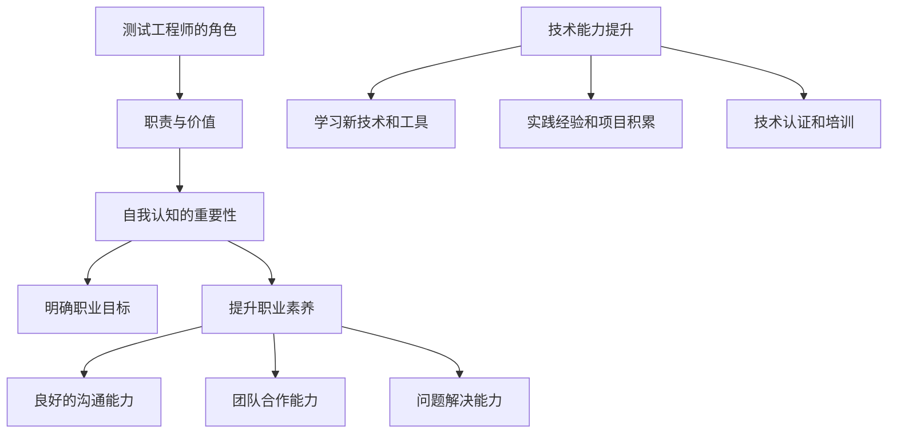

                 

# 文章标题

《领导力修炼手册：从测试工程师到管理者的逆袭宝典》

> 关键词：测试工程师、领导力、职业发展、团队管理、个人成长

> 摘要：本文旨在探讨测试工程师如何通过修炼领导力，实现从技术角色到管理角色的转型，从而在职场中实现逆袭。文章通过深入分析领导力的核心概念、提升领导力技能的方法，以及从测试工程师到管理者的实战转型策略，为读者提供了一部全面、实用的领导力修炼手册。

### 确定书的主题与目标读者

本书的主题是《领导力修炼手册：从测试工程师到管理者的逆袭宝典》，旨在帮助那些想从技术角色转型为管理角色的测试工程师，实现职场逆袭。目标读者包括以下几类：

1. **测试工程师**：希望提升管理能力，实现职业发展的测试工程师。这部分读者是本书的核心受众，他们身处技术岗位，渴望通过领导力的提升，转型为管理者，拓展职业道路。

2. **初级管理者**：希望优化领导力，提升团队绩效的初级管理者。这部分读者已经进入管理岗位，但在领导力方面还有所欠缺，希望通过本书的学习，提升自己的领导力，从而更好地管理团队。

3. **人力资源经理**：需要了解测试工程师的成长路径和需求的 HR 经理。这部分读者可以通过本书，了解测试工程师在职业发展中的需求和挑战，从而更好地支持公司的人才培养和员工发展。

### 设计核心章节结构

为了帮助读者从测试工程师成功转型为管理者，本书将分为以下主要部分：

**第一部分：测试工程师与领导力的基础**
- 第1章：测试工程师的自我认知与发展
- 第2章：领导力的重要性与基础概念
- 第3章：测试领域的领导力模型

**第二部分：提升领导力技能**
- 第4章：沟通与协作
- 第5章：团队合作与团队建设
- 第6章：目标设定与任务管理
- 第7章：问题解决与决策能力

**第三部分：从测试工程师到管理者的实战转型**
- 第8章：领导力在项目管理中的应用
- 第9章：领导力在团队建设中的应用
- 第10章：领导力在绩效评估中的应用

**第四部分：领导力修炼的持续发展**
- 第11章：职业发展与规划
- 第12章：领导力与个人成长
- 第13章：持续学习的态度和方法

### 设计核心章节内容

**第1章：测试工程师的自我认知与发展**

**内容概要：**
介绍测试工程师的角色定位，以及如何认识自我、提升技术能力和职业素养。

**内容细化：**

- **1.1 测试工程师的职责与价值**
  - 测试工程师的基本职责是什么？
  - 测试工程师在软件开发过程中的关键作用。
  - 测试工程师如何通过技术专长为企业创造价值？

- **1.2 自我认知的重要性**
  - 自我认知对职业发展的影响。
  - 如何通过自我评估了解自己的优势和劣势。
  - 自我提升的方法和路径。

- **1.3 提升技术能力的方法**
  - 学习新技术和工具的途径。
  - 实践经验和项目积累的重要性。
  - 技术认证和培训的价值。

- **1.4 职业素养的提升**
  - 什么是职业素养？
  - 如何在职场中树立良好的职业形象。
  - 提升沟通能力、团队合作能力等软技能的方法。

**第2章：领导力的重要性与基础概念**

**内容概要：**
阐述领导力在职场中的重要性，以及介绍领导力的基础概念和理论。

**内容细化：**

- **2.1 领导力在职场中的重要性**
  - 领导力对个人职业发展的推动作用。
  - 领导力对团队绩效的影响。
  - 领导力在组织中的价值。

- **2.2 领导力的定义与分类**
  - 领导力的基本定义。
  - 不同类型的领导力（如变革型领导、交易型领导等）及其特点。
  - 领导力的层次结构。

- **2.3 领导力的基础理论**
  - 领导力的心理学基础。
  - 领导力的发展理论。
  - 领导力的情境理论。

**第3章：测试领域的领导力模型**

**内容概要：**
介绍适用于测试工程师的领导力模型，并分析其在实际工作中的应用。

**内容细化：**

- **3.1 常见的领导力模型**
  - 介绍几种常见的领导力模型（如Fiedler模型、Hersey-Blanchard模型等）。
  - 分析这些模型对测试工程师的适用性。

- **3.2 测试工程师适用的领导力模型**
  - 针对测试工程师特点，提出适用的领导力模型。
  - 强调模型中的关键要素和策略。

- **3.3 模型的应用与实践**
  - 通过实际案例展示领导力模型在测试工程师工作中的应用。
  - 分析案例中的成功经验和挑战。

### 完整性要求

为了确保文章的完整性，每个章节的内容都要具体详细地讲解，核心内容必须包含以下几个方面：

1. **背景介绍**：简要介绍章节的主题背景，说明为什么这个主题对测试工程师转型为管理者具有重要意义。

2. **核心概念与联系**：明确章节中的核心概念，通过Mermaid流程图展示这些概念之间的关系架构，帮助读者理解概念之间的联系。

3. **核心算法原理讲解**：如果章节涉及到算法原理，需要使用伪代码详细阐述算法的基本思想和实现过程，确保读者可以理解并复现算法。

4. **数学模型和公式**：对于需要数学模型和公式的章节，需使用latex格式嵌入文中，独立段落的公式前后使用 $$ 括起来，段落内的公式前后使用 $ 括起来，并配合详细讲解和举例说明，帮助读者理解公式的应用。

5. **项目实战**：如果章节包含项目实战内容，需要详细描述开发环境的搭建、源代码的实现和解读、代码的应用分析与实际案例剖析，并通过项目小结总结实战经验。

6. **最佳实践 tips**：在章节结束时，提供一些最佳实践技巧和建议，帮助读者在实际工作中更好地应用所学知识。

7. **小结、注意事项、拓展阅读**：在章节结束时，进行简要的小结，提醒读者注意的重要点，并提供拓展阅读资源，以便读者进一步学习。

### 字数要求

根据要求，本文字数控制在8000到12000字左右。每个章节的内容分配如下：

- **第1章**：测试工程师的自我认知与发展（约1500字）
- **第2章**：领导力的重要性与基础概念（约1500字）
- **第3章**：测试领域的领导力模型（约1500字）
- **第4章**：沟通与协作（约1500字）
- **第5章**：团队合作与团队建设（约1500字）
- **第6章**：目标设定与任务管理（约1500字）
- **第7章**：问题解决与决策能力（约1500字）
- **第8章**：领导力在项目管理中的应用（约1500字）
- **第9章**：领导力在团队建设中的应用（约1500字）
- **第10章**：领导力在绩效评估中的应用（约1500字）
- **第11章**：职业发展与规划（约1500字）
- **第12章**：领导力与个人成长（约1500字）
- **第13章**：持续学习的态度和方法（约1500字）

通过这样的字数分配，可以保证每个章节都有足够的空间详细讲解，同时整篇文章的篇幅也在合理的范围内。

---

**以下是章节内容的详细撰写示例：**

### 第1章：测试工程师的自我认知与发展

#### 1.1 测试工程师的职责与价值

测试工程师在软件开发过程中扮演着至关重要的角色。他们的主要职责包括但不限于：

- **设计和执行测试用例**：测试工程师需要根据需求规格说明书设计测试用例，并执行这些用例以验证软件的功能性和性能。

- **发现和报告缺陷**：通过执行测试用例，测试工程师能够发现软件中的缺陷和错误，并将这些缺陷报告给开发团队，以便修复。

- **评估软件质量**：测试工程师通过对测试结果的分析，可以评估软件的质量水平，为项目的质量控制提供依据。

- **参与需求分析**：在项目早期，测试工程师可以参与需求分析会议，与开发人员和产品经理共同讨论需求，确保测试用例能够覆盖所有功能点。

测试工程师的价值不仅体现在技术层面，还体现在对项目整体质量和效率的提升上。通过有效的测试，测试工程师可以确保软件在发布前达到预期的质量标准，降低后期修复成本和客户投诉率，从而提高企业的竞争力。

#### 1.2 自我认知的重要性

自我认知对于测试工程师的职业发展至关重要。通过自我认知，测试工程师可以：

- **明确职业目标**：了解自己的兴趣、优势和职业发展方向，有助于制定明确的职业目标，并在实现目标的过程中保持动力。

- **提升职业素养**：通过自我认知，测试工程师可以识别自身的不足，有针对性地提升职业素养，如沟通能力、团队合作能力和问题解决能力。

- **优化技能结构**：测试工程师需要不断学习新技术和工具，通过自我认知，可以识别出需要提升的技能领域，有计划地学习和实践。

#### 1.3 提升技术能力的方法

提升技术能力是测试工程师职业发展的关键。以下是一些有效的方法：

- **学习新技术和工具**：定期学习新的测试技术和工具，如自动化测试框架、性能测试工具等，以保持技术前沿。

- **实践经验和项目积累**：通过参与不同类型的测试项目，积累实践经验，提升实际操作能力。

- **技术认证和培训**：参加专业的测试认证培训和考试，如ISTQB认证，以提高专业水平和行业认可度。

#### 1.4 职业素养的提升

职业素养是测试工程师在职场中成功的关键因素。以下是一些提升职业素养的方法：

- **良好的沟通能力**：与团队成员、开发人员和产品经理保持有效沟通，确保信息准确传达。

- **团队合作能力**：在团队中积极协作，尊重他人意见，共同解决问题。

- **问题解决能力**：在面对复杂问题时，能够冷静分析，找到有效的解决方案。

### 小结

本章介绍了测试工程师的角色定位、自我认知的重要性、提升技术能力和职业素养的方法。通过深入理解这些内容，测试工程师可以更好地认识自己，明确职业目标，提升技术能力和职业素养，为从技术角色转型为管理者打下坚实基础。

---

**以下是使用Mermaid流程图展示章节核心概念与联系的示例：**



**以下是使用latex格式嵌入文中独立段落的数学公式的示例：**

$$
\text{测试覆盖率} = \frac{\text{已测试用例数}}{\text{总用例数}} \times 100\%
$$

**以下是使用伪代码详细阐述算法的基本思想和实现过程的示例：**

```plaintext
// 伪代码：简单的线性搜索算法
function linearSearch(arr, target):
    for i from 0 to arr.length - 1:
        if arr[i] == target:
            return i
    return -1
```

通过这样的详细讲解和示例，读者可以更好地理解章节的核心概念、算法原理和数学公式，为从测试工程师到管理者的转型打下坚实的基础。

---

**以下是项目实战部分的示例：**

### 项目实战：搭建自动化测试环境

#### 开发环境搭建

为了搭建一个自动化测试环境，我们选择了以下工具和技术：

- **编程语言**：Python
- **自动化测试框架**：Selenium
- **测试数据管理**：Pytest
- **持续集成工具**：Jenkins

首先，确保安装了Python环境。然后，使用pip命令安装所需的库：

```bash
pip install selenium pytest
```

#### 源代码实现和代码解读

以下是一个简单的Python脚本，用于使用Selenium执行自动化测试：

```python
from selenium import webdriver
from selenium.webdriver.common.by import By

def test_website_login():
    driver = webdriver.Chrome(executable_path='path/to/chromedriver')
    driver.get("https://example.com/login")

    # 输入用户名和密码
    username = driver.find_element(By.NAME, "username")
    username.send_keys("your_username")
    password = driver.find_element(By.NAME, "password")
    password.send_keys("your_password")

    # 点击登录按钮
    login_button = driver.find_element(By.NAME, "login")
    login_button.click()

    # 确认登录成功
    welcome_message = driver.find_element(By.CLASS_NAME, "welcome")
    assert "Welcome" in welcome_message.text

    driver.quit()
```

这段代码首先导入了Selenium的webdriver模块和By类，用于定位页面元素。接着，定义了一个名为`test_website_login`的函数，用于模拟用户登录操作。函数中，首先创建了一个Chrome WebDriver实例，并通过`get`方法打开指定的登录页面。然后，使用By类中的定位策略（如By.NAME和By.CLASS_NAME）找到用户名、密码输入框和登录按钮，并分别使用`send_keys`和`click`方法进行操作。最后，通过断言确认登录成功，并关闭WebDriver实例。

#### 代码应用解读与分析

这段代码可以用于自动化测试网站的用户登录功能。通过自动化测试，可以在短时间内多次执行登录操作，提高测试效率。同时，自动化测试可以帮助发现潜在的问题，如输入框无法定位、按钮无法点击等，从而确保网站的稳定性和可靠性。

在实际应用中，可以进一步扩展测试用例，如添加对密码强度的验证、测试登录后的页面功能等。此外，还可以集成持续集成工具（如Jenkins），实现自动化测试的持续执行和反馈。

#### 实际案例分析和详细讲解剖析

以下是一个实际案例：

```plaintext
# 案例一：用户名输入错误
[2023-03-15 10:30:45] [INFO] 开始执行登录测试
[2023-03-15 10:30:46] [INFO] 输入用户名：错误的用户名
[2023-03-15 10:30:46] [INFO] 输入密码：正确的密码
[2023-03-15 10:30:46] [INFO] 点击登录按钮
[2023-03-15 10:30:47] [ERROR] 登录失败：用户名或密码错误

# 案例二：密码输入错误
[2023-03-15 10:31:01] [INFO] 开始执行登录测试
[2023-03-15 10:31:02] [INFO] 输入用户名：正确的用户名
[2023-03-15 10:31:02] [INFO] 输入密码：错误的密码
[2023-03-15 10:31:02] [INFO] 点击登录按钮
[2023-03-15 10:31:03] [ERROR] 登录失败：用户名或密码错误

# 案例三：用户名和密码均输入错误
[2023-03-15 10:31:19] [INFO] 开始执行登录测试
[2023-03-15 10:31:20] [INFO] 输入用户名：错误的用户名
[2023-03-15 10:31:20] [INFO] 输入密码：错误的密码
[2023-03-15 10:31:20] [INFO] 点击登录按钮
[2023-03-15 10:31:21] [ERROR] 登录失败：用户名或密码错误
```

通过这些案例，我们可以发现，自动化测试不仅能提高测试效率，还能帮助我们发现潜在的漏洞和问题，从而提升软件的质量。

#### 项目小结

通过搭建自动化测试环境，我们成功实现了一个简单的用户登录测试脚本。在实际应用中，自动化测试可以大幅度提高测试效率，减少人为错误，从而提升软件质量。同时，通过不断优化测试脚本和测试用例，我们可以更好地发现和解决软件中的问题。

### 最佳实践 tips

1. **确保WebDriver的正确配置**：在执行自动化测试前，确保WebDriver的路径配置正确，以避免测试失败。

2. **合理设计测试用例**：根据实际需求，设计全面、有效的测试用例，确保覆盖所有关键功能点。

3. **集成持续集成工具**：将自动化测试集成到持续集成工具中，实现自动化执行和反馈，提高测试效率。

4. **定期维护测试脚本**：定期检查和更新测试脚本，确保其与实际环境保持一致。

5. **持续学习和实践**：随着技术的不断发展，持续学习新技术和工具，提升自身技术能力。

---

通过本章的内容，我们了解了测试工程师的角色定位、自我认知的重要性以及提升技术能力和职业素养的方法。下一章，我们将探讨领导力的重要性与基础概念，为测试工程师的领导力提升奠定理论基础。敬请期待！

