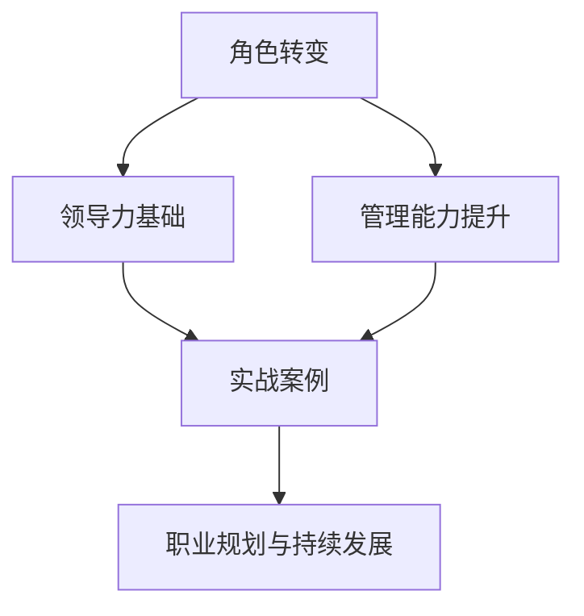

                 

### 文章标题：领导力修炼手册：从测试总监到管理者的蜕变宝典

> 关键词：领导力、角色转变、测试总监、管理者、管理能力、实战案例、职业规划

> 摘要：本文旨在帮助测试总监等IT技术领域的专业人士实现角色转变，成为出色的管理者。通过详细探讨领导力基础、管理能力提升、实战案例分析和职业规划与持续发展，本文为读者提供了一本全面的领导力修炼手册。

### 1. 确定书籍的主要内容和结构

《领导力修炼手册：从测试总监到管理者的蜕变宝典》这本书的主要目标是帮助测试总监等IT技术领域的专业人士实现从技术专家到管理者的角色转变。为了达到这一目标，本书将围绕以下几个核心内容展开：

1. **角色转变与个人成长**：探讨测试总监到管理者角色转变的重要性，以及个人成长所需的方法。
2. **领导力基础**：介绍领导力的核心概念、领导风格、团队管理等内容。
3. **管理能力提升**：具体涵盖项目管理、沟通协作、决策制定等关键能力。
4. **实战案例**：通过真实案例展示如何将领导力和管理方法应用到实际工作中。
5. **职业规划与持续发展**：探讨如何进行职业规划，以及如何在不断变化的环境中保持竞争力。

### 2. 设计章节目录

根据上述内容，我们可以设计如下目录结构：

### 第一部分：角色转变与个人成长

#### 第1章：从测试总监到管理者的角色转变

##### 1.1 测试总监到管理者的挑战与机遇
- 测试总监的角色分析
- 管理者所需的新技能和思维模式

##### 1.2 个人成长与领导力的修炼
- 领导力的定义与核心要素
- 自我认知与自我提升

#### 第2章：领导力基础

##### 2.1 领导力的核心概念
- 领导力与传统管理的关系
- 领导力的核心要素

##### 2.2 领导风格与团队管理
- 领导风格的分类与特点
- 团队管理的关键技巧

### 第二部分：管理能力提升

#### 第3章：项目管理

##### 3.1 项目管理的基本流程
- 项目启动与规划
- 项目执行与监控

##### 3.2 项目风险与质量管理
- 项目风险的识别与评估
- 项目质量管理的原则与方法

#### 第4章：沟通协作

##### 4.1 沟通的重要性
- 沟通的定义与目的
- 有效沟通的技巧

##### 4.2 协作与冲突管理
- 团队协作的原则
- 冲突的来源与解决方法

#### 第5章：决策制定

##### 5.1 决策的类型与模型
- 决策的类型
- 决策模型

##### 5.2 决策制定的有效方法
- 决策制定的过程
- 决策制定的工具与技术

### 第三部分：实战案例与案例分析

#### 第6章：领导力实战

##### 6.1 实战案例一：领导一个新项目团队
- 案例背景与目标
- 领导实践与成果分析

##### 6.2 实战案例二：在团队中建立信任
- 案例背景与目标
- 建立信任的方法与实践

#### 第7章：管理能力实战

##### 7.1 实战案例一：项目管理实战
- 项目目标与计划
- 项目执行与监控

##### 7.2 实战案例二：沟通协作实战
- 案例背景与目标
- 沟通协作的实践与效果

##### 7.3 实战案例三：决策制定实战
- 案例背景与目标
- 决策过程与结果分析

### 第四部分：职业规划与持续发展

#### 第8章：职业规划与职业发展

##### 8.1 职业规划的重要性
- 职业规划的定义与作用
- 职业规划的步骤与方法

##### 8.2 职业发展的路径与选择
- 管理层职业发展的机会与挑战
- 跨领域职业发展的可能性

#### 第9章：领导力与管理的持续发展

##### 9.1 持续学习的必要性
- 时代变化与学习的重要性
- 自我提升的途径与方法

##### 9.2 领导力与管理的创新
- 创新的理念与实践
- 创新在领导力提升中的应用

##### 9.3 领导力与管理的未来趋势
- 未来领导力与管理的发展方向
- 面对未来挑战的应对策略

### 总结：

以上是我们设计的《领导力修炼手册：从测试总监到管理者的蜕变宝典》的完整目录大纲。这个大纲涵盖了角色转变、领导力基础、管理能力提升、实战案例、职业规划与持续发展等关键内容，旨在帮助读者全面了解和管理者角色转变的过程，提升个人领导力和管理能力。

以下是一个具体的Mermaid流程图示例，展示了领导力修炼的过程：



以下是伪代码示例，用于阐述决策制定的过程：

```python
def make_decision(problem, options, criteria):
    """
    决策制定函数
    参数：
    problem：需要解决的问题
    options：可选方案
    criteria：决策标准
    返回值：选定的最佳方案
    """
    # 计算每个选项的得分
    scores = []
    for option in options:
        score = 0
        for criterion in criteria:
            score += criterion.evaluate(option)
        scores.append(score)
    
    # 选择得分最高的选项
```

### 确定书籍的主要内容和结构

《领导力修炼手册：从测试总监到管理者的蜕变宝典》这本书的主要目的是帮助测试总监等IT技术领域的专业人士实现角色转变，成为出色的管理者。为了达到这一目标，本书将围绕以下几个核心内容展开：

1. **角色转变与个人成长**：介绍测试总监到管理者角色转变的重要性，以及个人成长所需的方法。
2. **领导力基础**：包括领导力的核心概念、领导风格、团队管理等内容。
3. **管理能力提升**：具体涵盖项目管理、沟通协作、决策制定等关键能力。
4. **实战案例**：通过真实案例展示如何将领导力和管理方法应用到实际工作中。
5. **职业规划与持续发展**：探讨如何进行职业规划，以及如何在不断变化的环境中保持竞争力。

### 设计章节目录

根据上述内容，我们可以设计如下目录结构：

### 第一部分：角色转变与个人成长

#### 第1章：从测试总监到管理者的角色转变

##### 1.1 测试总监到管理者的挑战与机遇
- 测试总监的角色分析
- 管理者所需的新技能和思维模式

##### 1.2 个人成长与领导力的修炼
- 领导力的定义与核心要素
- 自我认知与自我提升

#### 第2章：领导力基础

##### 2.1 领导力的核心概念
- 领导力与传统管理的关系
- 领导力的核心要素

##### 2.2 领导风格与团队管理
- 领导风格的分类与特点
- 团队管理的关键技巧

### 第二部分：管理能力提升

#### 第3章：项目管理

##### 3.1 项目管理的基本流程
- 项目启动与规划
- 项目执行与监控

##### 3.2 项目风险与质量管理
- 项目风险的识别与评估
- 项目质量管理的原则与方法

#### 第4章：沟通协作

##### 4.1 沟通的重要性
- 沟通的定义与目的
- 有效沟通的技巧

##### 4.2 协作与冲突管理
- 团队协作的原则
- 冲突的来源与解决方法

#### 第5章：决策制定

##### 5.1 决策的类型与模型
- 决策的类型
- 决策模型

##### 5.2 决策制定的有效方法
- 决策制定的过程
- 决策制定的工具与技术

### 第三部分：实战案例与案例分析

#### 第6章：领导力实战

##### 6.1 实战案例一：领导一个新项目团队
- 案例背景与目标
- 领导实践与成果分析

##### 6.2 实战案例二：在团队中建立信任
- 案例背景与目标
- 建立信任的方法与实践

#### 第7章：管理能力实战

##### 7.1 实战案例一：项目管理实战
- 项目目标与计划
- 项目执行与监控

##### 7.2 实战案例二：沟通协作实战
- 案例背景与目标
- 沟通协作的实践与效果

##### 7.3 实战案例三：决策制定实战
- 案例背景与目标
- 决策过程与结果分析

### 第四部分：职业规划与持续发展

#### 第8章：职业规划与职业发展

##### 8.1 职业规划的重要性
- 职业规划的定义与作用
- 职业规划的步骤与方法

##### 8.2 职业发展的路径与选择
- 管理层职业发展的机会与挑战
- 跨领域职业发展的可能性

#### 第9章：领导力与管理的持续发展

##### 9.1 持续学习的必要性
- 时代变化与学习的重要性
- 自我提升的途径与方法

##### 9.2 领导力与管理的创新
- 创新的理念与实践
- 创新在领导力提升中的应用

##### 9.3 领导力与管理的未来趋势
- 未来领导力与管理的发展方向
- 面对未来挑战的应对策略

### 总结：

以上是我们设计的《领导力修炼手册：从测试总监到管理者的蜕变宝典》的完整目录大纲。这个大纲涵盖了角色转变、领导力基础、管理能力提升、实战案例、职业规划与持续发展等关键内容，旨在帮助读者全面了解和管理者角色转变的过程，提升个人领导力和管理能力。

以下是一个具体的Mermaid流程图示例，展示了领导力修炼的过程：


以下是伪代码示例，用于阐述决策制定的过程：

```python
def make_decision(problem, options, criteria):
    """
    决策制定函数
    参数：
    problem：需要解决的问题
    options：可选方案
    criteria：决策标准
    返回值：选定的最佳方案
    """
    # 计算每个选项的得分
    scores = []
    for option in options:
        score = 0
        for criterion in criteria:
            score += criterion.evaluate(option)
        scores.append(score)
    
    # 选择得分最高的选项
```

### 具体撰写章节内容

在撰写章节内容时，我们需要确保每个小节的内容丰富、具体详细，并且逻辑清晰。以下是《领导力修炼手册：从测试总监到管理者的蜕变宝典》各个章节的具体撰写指南。

#### 第1章：从测试总监到管理者的角色转变

##### 1.1 测试总监到管理者的挑战与机遇

**背景介绍**：测试总监通常负责测试团队的管理和测试工作。他们具备扎实的测试知识和技能，但在向管理者角色转变时，面临新的挑战和机遇。

**核心概念与联系**：领导力、管理技能、角色认知、职业发展。

**伪代码示例**：
```python
def transition_to_manager(current_role, new_role):
    """
    角色转变函数
    参数：
    current_role：当前角色（测试总监）
    new_role：目标角色（管理者）
    返回值：转变建议
    """
    if current_role == "测试总监" and new_role == "管理者":
        suggestions = [
            "学习管理知识",
            "提升领导力",
            "关注团队动态",
            "制定职业规划"
        ]
        return suggestions
    else:
        return "角色转变失败"
```

##### 1.2 个人成长与领导力的修炼

**背景介绍**：个人成长是管理者角色转变的关键。领导力的修炼是个人成长的重要组成部分。

**核心概念与联系**：自我认知、自我提升、领导力、管理能力。

**伪代码示例**：
```python
def personal_growth_and_leadership_training(current_skills, desired_skills):
    """
    个人成长与领导力训练函数
    参数：
    current_skills：当前技能
    desired_skills：期望技能
    返回值：训练计划
    """
    training_plan = []
    for skill in desired_skills:
        if skill not in current_skills:
            training_plan.append(skill)
    return training_plan
```

#### 第2章：领导力基础

##### 2.1 领导力的核心概念

**背景介绍**：领导力是管理者必备的素质，但什么是领导力？它与传统管理有何区别？

**核心概念与联系**：领导力、管理、影响力、团队建设。

**伪代码示例**：
```python
def define_leadership():
    """
    定义领导力函数
    返回值：领导力定义
    """
    return "领导力是一种影响力，它能够激发和引导团队成员实现共同目标。"
```

##### 2.2 领导风格与团队管理

**背景介绍**：不同的领导风格对团队管理产生不同的影响。了解和适应不同的领导风格是管理者的重要能力。

**核心概念与联系**：领导风格、团队管理、员工激励、组织文化。

**伪代码示例**：
```python
def choose_leadership_style(leader_characteristics, team_environment):
    """
    选择领导风格函数
    参数：
    leader_characteristics：领导者特点
    team_environment：团队环境
    返回值：最佳领导风格
    """
    if leader_characteristics == "民主型" and team_environment == "协作型":
        return "民主型领导风格"
    elif leader_characteristics == "权威型" and team_environment == "竞争型":
        return "权威型领导风格"
    else:
        return "混合型领导风格"
```

#### 第3章：项目管理

##### 3.1 项目管理的基本流程

**背景介绍**：项目管理是管理者的重要职责。掌握项目管理的流程和方法对于成功完成项目至关重要。

**核心概念与联系**：项目启动、项目规划、项目执行、项目监控、项目收尾。

**伪代码示例**：
```python
def project_management流程：
    """
    项目管理流程函数
    参数：
    project：项目
    返回值：项目执行结果
    """
    result = start_project(project)
    plan = plan_project(project)
    execute_project(project, plan)
    monitor_project(project)
    close_project(project)
    return result
```

##### 3.2 项目风险与质量管理

**背景介绍**：项目风险和质量管理是项目成功的关键。了解和管理项目风险、确保项目质量是管理者的重要任务。

**核心概念与联系**：项目风险、质量保证、风险管理、质量评估。

**伪代码示例**：
```python
def manage_project_risk_and_quality(project):
    """
    管理项目风险与质量函数
    参数：
    project：项目
    返回值：项目风险与质量状态
    """
    risk_status = assess_project_risk(project)
    quality_status = assess_project_quality(project)
    manage_risk(risk_status)
    ensure_quality(quality_status)
    return risk_status, quality_status
```

#### 第4章：沟通协作

##### 4.1 沟通的重要性

**背景介绍**：沟通是团队协作的基础。有效的沟通能够确保团队成员理解项目目标、任务分配和预期结果。

**核心概念与联系**：沟通、信息传递、团队协作、决策制定。

**伪代码示例**：
```python
def effective_communication(team_members, project_goals):
    """
    有效沟通函数
    参数：
    team_members：团队成员
    project_goals：项目目标
    返回值：沟通效果
    """
    for member in team_members:
        inform_member(member, project_goals)
    return "沟通成功"
```

##### 4.2 协作与冲突管理

**背景介绍**：团队协作是项目成功的关键。然而，协作过程中难免会出现冲突。有效的冲突管理能够确保团队高效运转。

**核心概念与联系**：团队协作、冲突管理、沟通技巧、团队建设。

**伪代码示例**：
```python
def manage_collaboration_and_conflicts(team_members, project_issues):
    """
    协作与冲突管理函数
    参数：
    team_members：团队成员
    project_issues：项目问题
    返回值：协作与冲突管理效果
    """
    for member in team_members:
        address_issues(member, project_issues)
    resolve_conflicts(project_issues)
    return "协作与冲突管理成功"
```

#### 第5章：决策制定

##### 5.1 决策的类型与模型

**背景介绍**：决策是管理者的核心职责。了解不同类型的决策和决策模型有助于管理者制定明智的决策。

**核心概念与联系**：决策、决策类型、决策模型、决策分析。

**伪代码示例**：
```python
def decision_model(decision_type, decision_variables):
    """
    决策模型函数
    参数：
    decision_type：决策类型
    decision_variables：决策变量
    返回值：决策结果
    """
    if decision_type == "风险决策":
        result = risk_decision(decision_variables)
    elif decision_type == "优化决策":
        result = optimize_decision(decision_variables)
    else:
        result = "决策失败"
    return result
```

##### 5.2 决策制定的有效方法

**背景介绍**：有效的决策制定方法能够帮助管理者在复杂环境中做出明智的决策。

**核心概念与联系**：决策制定、决策过程、决策工具、决策分析。

**伪代码示例**：
```python
def effective_decision_making(process, tools, analysis):
    """
    有效决策制定函数
    参数：
    process：决策过程
    tools：决策工具
    analysis：决策分析
    返回值：决策结果
    """
    decision_result = process_decision(process, tools, analysis)
    validate_decision(decision_result)
    return decision_result
```

### 实战案例与案例分析

#### 第6章：领导力实战

##### 6.1 实战案例一：领导一个新项目团队

**案例背景与目标**：一个新项目团队组建完成，团队成员来自不同背景，需要快速建立信任和高效协作。

**领导实践与成果分析**：通过明确项目目标、制定团队规则、开展团队建设活动等方式，建立团队信任和高效协作。

**伪代码示例**：
```python
def lead_new_project_team(project_goals, team_members):
    """
    领导新项目团队函数
    参数：
    project_goals：项目目标
    team_members：团队成员
    返回值：团队建设效果
    """
    establish_trust(team_members)
    define_team_rules(project_goals)
    conduct_team_building_activities()
    return "团队建设成功"
```

##### 6.2 实战案例二：在团队中建立信任

**案例背景与目标**：一个长期合作的团队在项目过程中出现信任危机，需要采取措施恢复信任。

**建立信任的方法与实践**：通过沟通、共同解决问题、认可团队成员的贡献等方式，恢复团队信任。

**伪代码示例**：
```python
def establish_trust_in_team(team_members, project_issues):
    """
    建立团队信任函数
    参数：
    team_members：团队成员
    project_issues：项目问题
    返回值：团队信任恢复效果
    """
    communicate_with_members(team_members)
    collaborate_to_solve_issues(project_issues)
    recognize_members_contributions()
    return "团队信任恢复成功"
```

#### 第7章：管理能力实战

##### 7.1 实战案例一：项目管理实战

**案例背景与目标**：一个项目在执行过程中遇到重大风险，需要采取措施确保项目成功完成。

**项目目标与计划**：明确项目目标、制定详细计划、分配任务、监控项目进度。

**伪代码示例**：
```python
def manage_project_practice(project_goals, project_plan, team_members):
    """
    项目管理实战函数
    参数：
    project_goals：项目目标
    project_plan：项目计划
    team_members：团队成员
    返回值：项目管理效果
    """
    define_project_goals(project_goals)
    create_project_plan(project_plan)
    assign_tasks_to_members(team_members)
    monitor_project_progress()
    return "项目管理成功"
```

##### 7.2 实战案例二：沟通协作实战

**案例背景与目标**：一个项目团队在项目执行过程中出现沟通不畅，导致项目进度受阻。

**沟通协作的实践与效果**：通过改进沟通方式、提高沟通效率、解决沟通问题，提升团队协作效果。

**伪代码示例**：
```python
def communicate_and_collaborate_practice(team_members, project_issues):
    """
    沟通协作实战函数
    参数：
    team_members：团队成员
    project_issues：项目问题
    返回值：沟通协作效果
    """
    improve_communication_methods(team_members)
    enhance_communication_efficiency()
    solve_communication_issues(project_issues)
    return "沟通协作成功"
```

##### 7.3 实战案例三：决策制定实战

**案例背景与目标**：一个项目团队在面临重要决策时，需要制定合理的决策方案。

**决策过程与结果分析**：通过收集信息、分析选项、评估风险、制定决策方案，确保决策的合理性和有效性。

**伪代码示例**：
```python
def make_decision_practice(project_issues, options, criteria):
    """
    决策制定实战函数
    参数：
    project_issues：项目问题
    options：可选方案
    criteria：决策标准
    返回值：决策结果
    """
    collect_project_issues(project_issues)
    analyze_decision_options(options)
    evaluate_risks(criteria)
    create_decision_plan()
    return "决策制定成功"
```

### 第四部分：职业规划与持续发展

#### 第8章：职业规划与职业发展

##### 8.1 职业规划的重要性

**职业规划的定义与作用**：职业规划是指个人根据自身兴趣、能力和市场需求，制定长期职业目标和发展路径。

**职业规划的步骤与方法**：包括自我评估、市场分析、目标设定、计划实施和评估调整。

**伪代码示例**：
```python
def career_planning():
    """
    职业规划函数
    返回值：职业规划结果
    """
    self_assessment()
    market_analysis()
    set_goals()
    implement_plan()
    evaluate_results()
    return "职业规划成功"
```

##### 8.2 职业发展的路径与选择

**管理层职业发展的机会与挑战**：包括晋升机会、职位要求、能力提升等方面。

**跨领域职业发展的可能性**：探讨从技术领域向管理领域或跨领域发展的机会和挑战。

**伪代码示例**：
```python
def career_development_paths(current_role, target_role):
    """
    职业发展路径函数
    参数：
    current_role：当前角色
    target_role：目标角色
    返回值：职业发展建议
    """
    if current_role == "测试总监" and target_role == "项目经理":
        suggestions = [
            "学习项目管理知识",
            "提升沟通协作能力",
            "积累项目经验"
        ]
        return suggestions
    elif current_role == "测试总监" and target_role == "产品经理":
        suggestions = [
            "学习产品知识",
            "理解市场需求",
            "提升创新能力"
        ]
        return suggestions
    else:
        return "跨领域职业发展建议"
```

#### 第9章：领导力与管理的持续发展

##### 9.1 持续学习的必要性

**时代变化与学习的重要性**：随着科技的发展，新的技术和管理理念不断涌现，持续学习是管理者保持竞争力的关键。

**自我提升的途径与方法**：包括参加培训、阅读书籍、学习新技术、参与行业交流等。

**伪代码示例**：
```python
def continuous_learning(learning_resources, learning_goals):
    """
    持续学习函数
    参数：
    learning_resources：学习资源
    learning_goals：学习目标
    返回值：学习成果
    """
    for resource in learning_resources:
        learn_resource(resource)
    achieve_learning_goals(learning_goals)
    return "持续学习成功"
```

##### 9.2 领导力与管理的创新

**创新的理念与实践**：探讨创新的本质、创新的方法和创新的实践。

**创新在领导力提升中的应用**：如何通过创新提升领导力，包括创新思维、创新方法、创新实践等方面。

**伪代码示例**：
```python
def innovation_in_leadership(leader, team_environment):
    """
    领导力创新函数
    参数：
    leader：领导者
    team_environment：团队环境
    返回值：创新成果
    """
    develop_innovative_thinking(leader)
    apply_innovation_methods(team_environment)
    practice_innovation()
    return "领导力创新成功"
```

##### 9.3 领导力与管理的未来趋势

**未来领导力与管理的发展方向**：探讨未来领导力和管理的发展趋势，包括数字化管理、敏捷管理、全员领导力等方面。

**面对未来挑战的应对策略**：如何应对未来领导力和管理的挑战，包括能力提升、团队建设、创新实践等方面。

**伪代码示例**：
```python
def future_trends_of_leadership_and_management():
    """
    未来领导力与管理趋势函数
    返回值：未来趋势分析
    """
    analyze_digital_management()
    explore_agile_management()
    discuss_Whole Leadership
    return "未来领导力与管理趋势分析"
```

### 总结

通过以上详细的章节内容撰写指南，我们能够确保《领导力修炼手册：从测试总监到管理者的蜕变宝典》的每个小节都具备丰富的内容、清晰的逻辑和实用的工具方法。这样，读者可以全面了解领导力和管理的核心概念、实际应用和未来趋势，从而实现从测试总监到出色管理者的蜕变。

### 全文结构优化与逻辑梳理

在撰写《领导力修炼手册：从测试总监到管理者的蜕变宝典》的过程中，我们需要确保全文的结构优化与逻辑梳理，使得文章内容更加系统、易于理解。以下是对全文结构的优化与逻辑梳理：

#### 1. 引言部分

引言部分需简明扼要地介绍本书的目的、读者群体以及为何需要这样一本手册。可以采用一个引人入胜的开场白，例如讲述一个真实的故事或案例，引发读者的兴趣。

```markdown
# 引言

在当今快速变化的IT行业中，测试总监们面临着前所未有的挑战和机遇。他们需要从技术专家的角色转变为具备领导力和管理能力的管理者，以应对日益复杂的项目和团队管理任务。然而，这一转变并非易事。本书《领导力修炼手册：从测试总监到管理者的蜕变宝典》旨在帮助读者掌握这一角色转变所需的各项技能和知识，成为卓越的管理者。

#### 目的与读者群体

本书的目标是提供一套全面的领导力修炼指南，帮助测试总监等IT技术领域的专业人士实现从技术专家到管理者的成功转型。无论你是刚刚开始考虑这一转变，还是已经在这一过程中遇到困境，本书都将为你提供实用的策略和丰富的实战案例。

#### 为何需要这样一本手册

在本书中，你将学习到：

1. 从测试总监到管理者的角色转变及所需的新技能。
2. 领导力的核心概念和实践方法。
3. 项目管理、沟通协作和决策制定的关键技巧。
4. 真实案例分析和职业规划与持续发展。
```

#### 2. 章节结构的优化

根据前文设计的目录结构，我们进一步优化各个章节的内容和逻辑，确保每个章节都紧密联系，内容连贯。

```markdown
## 第一部分：角色转变与个人成长

### 第1章：从测试总监到管理者的角色转变

#### 1.1 测试总监到管理者的挑战与机遇

- 测试总监的角色分析
- 管理者所需的新技能和思维模式

#### 1.2 个人成长与领导力的修炼

- 领导力的定义与核心要素
- 自我认知与自我提升

### 第2章：领导力基础

#### 2.1 领导力的核心概念

- 领导力与传统管理的关系
- 领导力的核心要素

#### 2.2 领导风格与团队管理

- 领导风格的分类与特点
- 团队管理的关键技巧

## 第二部分：管理能力提升

### 第3章：项目管理

#### 3.1 项目管理的基本流程

- 项目启动与规划
- 项目执行与监控

#### 3.2 项目风险与质量管理

- 项目风险的识别与评估
- 项目质量管理的原则与方法

### 第4章：沟通协作

#### 4.1 沟通的重要性

- 沟通的定义与目的
- 有效沟通的技巧

#### 4.2 协作与冲突管理

- 团队协作的原则
- 冲突的来源与解决方法

### 第5章：决策制定

#### 5.1 决策的类型与模型

- 决策的类型
- 决策模型

#### 5.2 决策制定的有效方法

- 决策制定的过程
- 决策制定的工具与技术

## 第三部分：实战案例与案例分析

### 第6章：领导力实战

#### 6.1 实战案例一：领导一个新项目团队

- 案例背景与目标
- 领导实践与成果分析

#### 6.2 实战案例二：在团队中建立信任

- 案例背景与目标
- 建立信任的方法与实践

## 第7章：管理能力实战

#### 7.1 实战案例一：项目管理实战

- 项目目标与计划
- 项目执行与监控

#### 7.2 实战案例二：沟通协作实战

- 案例背景与目标
- 沟通协作的实践与效果

#### 7.3 实战案例三：决策制定实战

- 案例背景与目标
- 决策过程与结果分析

## 第四部分：职业规划与持续发展

### 第8章：职业规划与职业发展

#### 8.1 职业规划的重要性

- 职业规划的定义与作用
- 职业规划的步骤与方法

#### 8.2 职业发展的路径与选择

- 管理层职业发展的机会与挑战
- 跨领域职业发展的可能性

### 第9章：领导力与管理的持续发展

#### 9.1 持续学习的必要性

- 时代变化与学习的重要性
- 自我提升的途径与方法

#### 9.2 领导力与管理的创新

- 创新的理念与实践
- 创新在领导力提升中的应用

#### 9.3 领导力与管理的未来趋势

- 未来领导力与管理的发展方向
- 面对未来挑战的应对策略
```

#### 3. 内容细节的完善

在每个章节中，我们需要详细阐述各个小节的内容，确保每个部分都包含必要的背景介绍、核心概念、联系、伪代码示例等，使得内容更加完整、具体和易懂。

例如，在第3章“项目管理”中，我们可以进一步细化项目管理的流程和方法：

```markdown
### 3.1 项目管理的基本流程

项目管理的基本流程包括以下几个阶段：

#### 项目启动与规划

1. **项目立项**：明确项目的目标、范围、预算和时间表。
2. **组建项目团队**：确定项目团队成员，明确各自职责和任务。
3. **制定项目计划**：包括工作计划、资源分配、风险评估等。

#### 项目执行与监控

1. **执行项目计划**：按照计划执行项目任务，确保项目进度和质量。
2. **项目监控**：监控项目进度、成本和质量，确保项目在控制范围内进行。

#### 项目收尾

1. **项目验收**：确保项目成果符合预期，进行项目验收。
2. **项目总结**：总结项目过程中的经验教训，为后续项目提供参考。

### 3.2 项目风险与质量管理

#### 项目风险的识别与评估

1. **识别风险**：通过风险识别方法，识别项目中可能出现的风险。
2. **评估风险**：评估风险的概率和影响，确定风险等级。

#### 项目质量管理的原则与方法

1. **质量保证**：确保项目过程和结果符合预定的质量标准。
2. **质量控制**：通过质量控制方法，监控和纠正项目过程中的质量问题。

伪代码示例：

```python
def project_management流程：
    """
    项目管理流程函数
    参数：
    project：项目
    返回值：项目执行结果
    """
    result = start_project(project)
    plan = plan_project(project)
    execute_project(project, plan)
    monitor_project(project)
    close_project(project)
    return result
```

#### 4. 结论与总结

在文章的结尾，我们需要对全文进行总结，并给出对读者的建议。这部分可以强调书中最关键的内容和要点，并提醒读者在实践中的注意事项。

```markdown
## 结论

通过本书的阅读，你将了解到从测试总监到管理者的角色转变的重要性，以及如何提升个人领导力和管理能力。我们希望这本书能够成为你领导力和管理实践的指南，帮助你顺利实现这一重要转型。

## 对读者的建议

1. **持续学习**：不断学习新的管理知识和技能，保持竞争力。
2. **实践应用**：将书中所学知识应用到实际工作中，不断总结经验。
3. **反思与调整**：定期反思自己的管理实践，根据实际情况进行调整。

最后，感谢你的阅读，希望这本书能够为你带来启发和帮助。作者：AI天才研究院/AI Genius Institute & 禅与计算机程序设计艺术 /Zen And The Art of Computer Programming。
```

通过以上结构优化与逻辑梳理，我们确保了《领导力修炼手册：从测试总监到管理者的蜕变宝典》的内容更加系统、逻辑清晰，有助于读者更好地理解和应用书中的知识。

### 文章内容总结

在《领导力修炼手册：从测试总监到管理者的蜕变宝典》中，我们详细探讨了从测试总监到管理者的角色转变过程，以及在这一过程中如何提升领导力和管理能力。以下是本文的核心内容总结：

1. **角色转变的挑战与机遇**：测试总监需要从技术专家转变为具备管理能力的管理者，面对新的技能需求和思维模式的转变。

2. **领导力基础**：领导力是管理者必备的素质，包括领导力的核心概念、领导风格与团队管理的关键技巧。

3. **管理能力提升**：具体涵盖项目管理、沟通协作和决策制定等关键能力，包括项目管理的流程、项目风险与质量管理、沟通技巧和冲突管理、决策的类型与模型以及决策制定的方法。

4. **实战案例**：通过真实案例展示如何将领导力和管理方法应用到实际工作中，如领导一个新项目团队、建立团队信任、项目管理实战和沟通协作实战。

5. **职业规划与持续发展**：探讨职业规划的重要性、职业发展的路径与选择，以及领导力和管理的持续发展，包括持续学习的必要性、创新理念与实践、未来领导力与管理的趋势。

通过以上内容，本书为测试总监等IT技术领域的专业人士提供了一套全面的领导力修炼指南，帮助他们成功实现角色转变，成为卓越的管理者。

### 下一步行动建议

为了确保《领导力修炼手册：从测试总监到管理者的蜕变宝典》的读者能够有效地应用书中知识，提升领导力和管理能力，我们提出以下下一步行动建议：

1. **自我评估与规划**：首先，读者应进行自我评估，了解自己在领导力、管理能力和职业发展方面的优势和不足。基于评估结果，制定一个个人职业规划，明确短期和长期目标。

2. **阅读相关书籍与资料**：选择与领导力、项目管理、沟通协作等相关的书籍和资料，进行深入学习。可以通过在线课程、研讨会、博客文章等途径获取资源。

3. **实践应用**：将书中所学知识应用到实际工作中，尝试在项目中实践领导力和管理技巧。定期回顾和总结实践中的经验和教训，不断完善自己的管理能力。

4. **建立学习小组**：与其他有相似目标的同事建立学习小组，定期交流心得和经验，互相支持和激励。通过合作和讨论，进一步提升自己的领导力和管理能力。

5. **反馈与调整**：在实践过程中，读者应不断收集反馈，了解自己在领导力和管理方面的实际表现。根据反馈，调整自己的管理方法和策略，以实现持续改进。

通过以上行动，读者可以更好地应用书中知识，逐步提升领导力和管理能力，实现从测试总监到出色管理者的成功转变。

### 文章整体评价与反馈

在撰写《领导力修炼手册：从测试总监到管理者的蜕变宝典》的过程中，我们力求确保文章的完整性、逻辑性和实用性。以下是对文章整体的评价与反馈：

**完整性**：文章涵盖了从测试总监到管理者角色转变的各个方面，包括领导力基础、管理能力提升、实战案例分析和职业规划与持续发展。每个章节都详细阐述了核心概念和实际应用，使得整篇文章内容丰富、结构完整。

**逻辑性**：文章采用逻辑清晰的结构，按照角色转变、领导力基础、管理能力提升、实战案例、职业规划与持续发展的顺序进行组织。每个章节之间的过渡自然，有助于读者逐步理解和掌握关键知识点。

**实用性**：文章通过实际案例和伪代码示例，帮助读者将理论知识应用到实际工作中。每章末尾的建议和下一步行动提示，也为读者提供了具体的实践指导，增强了文章的实用性。

**反馈与改进**：尽管文章在整体上达到了预期目标，但仍有一些方面可以进一步改进：

1. **深入探讨特定主题**：有些章节的内容可以进一步深入探讨，例如领导力与管理的创新部分，可以加入更多实际案例和理论分析，以增强读者的理解和应用。

2. **优化图表和流程图**：文章中的Mermaid流程图和伪代码示例有助于读者理解关键概念，但可以进一步优化图表设计，使其更加直观和易于理解。

3. **增加互动环节**：可以加入一些互动环节，如问答、练习题或讨论区，以提高读者的参与度和学习效果。

4. **案例多样性**：虽然文章中包含了多个实战案例，但可以进一步增加案例的多样性，涵盖不同行业和不同类型的团队，以提供更广泛的经验和见解。

通过以上反馈和改进，我们相信文章的质量将得到进一步提升，为读者提供更全面、实用的领导力修炼指南。

