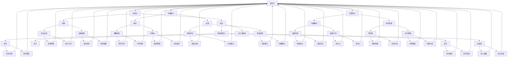

                 

## 文章标题：领导力修炼手册：从测试经理到管理者的蜕变宝典

> 关键词：测试经理、领导力、职业转型、管理技能、团队建设

> 摘要：本文旨在为测试经理们提供一本系统的领导力修炼手册，从角色认知、能力提升到实践应用，全面解析从测试经理向管理者的蜕变之路。通过深入探讨领导力的核心概念、管理技能的培养、团队建设的策略以及项目管理中的领导力应用，帮助测试经理们实现职业发展的顺利过渡。

### 引言

在信息技术快速发展的今天，测试经理的职业角色正面临前所未有的挑战与机遇。作为团队的核心成员，测试经理不仅要具备扎实的测试技术和质量保证能力，还需要在领导力和管理技能方面不断提升。然而，从测试经理向管理者的角色转变并非一蹴而就，这需要系统的修炼和实战经验的积累。本文将围绕这一主题，探讨从测试经理到管理者的蜕变之路，旨在为有志于此的测试经理们提供一本实用的领导力修炼手册。

### 第1章 测试经理的角色与职责

#### 1.1 测试经理的工作内容

测试经理作为团队的核心领导者，其职责包括但不限于以下几个方面：

- **制定测试计划**：根据项目需求和风险分析，制定全面的测试计划，确保测试工作有序开展。
- **组织测试执行**：协调测试资源，组织测试团队的执行工作，确保测试过程的高效和有效。
- **质量管理**：负责项目质量的管理和监控，确保项目达到预定的质量标准。
- **问题跟踪**：对测试过程中发现的问题进行跟踪和解决，确保问题的及时处理和闭环。

#### 1.2 测试团队管理

测试经理在团队管理中的角色至关重要，其主要职责包括：

- **团队建设**：通过组织培训、团队活动等方式，提升团队的整体素质和凝聚力。
- **成员激励**：制定合理的绩效考核机制，激励团队成员积极工作，提高工作效率。
- **人员配置**：根据项目需求，合理配置测试资源，确保团队人员的能力和岗位相匹配。

#### 1.3 质量保证与风险管理

质量保证和风险管理是测试经理的重要工作内容，具体包括：

- **质量保证**：制定和实施质量保证计划，确保项目质量符合预期标准。
- **风险识别**：通过风险评估和监控，识别项目过程中的潜在风险。
- **风险应对**：制定和实施风险应对策略，降低风险对项目的影响。

### 第2章 领导力基础

#### 2.1 领导力的定义与重要性

领导力是指通过影响他人来达成共同目标的能力。在测试经理的职业发展中，领导力的重要性不言而喻。领导力不仅影响团队的工作效率，还直接关系到项目的成功与否。具体而言，领导力的重要性体现在以下几个方面：

- **团队凝聚力**：有效的领导力能够提升团队的凝聚力，促进团队成员之间的合作和沟通。
- **工作效率**：领导力有助于提高团队的工作效率，减少内部摩擦和冲突。
- **员工满意度**：优秀的领导力能够提高员工的满意度，降低员工流失率。

#### 2.2 领导风格与影响力

领导风格是领导者处理团队关系和管理工作的方式。常见的领导风格包括：

- **指令型领导**：领导者直接下达命令，要求团队成员执行。
- **民主型领导**：领导者与团队成员共同商讨决策，充分听取意见。
- **支持型领导**：领导者关注团队成员的需求，提供必要的支持和帮助。

不同的领导风格对团队的影响也不同。指令型领导有助于迅速决策和执行，但可能导致团队成员缺乏自主性和创造力。民主型领导则能激发团队成员的积极性和创造力，但决策过程可能较长。支持型领导能够提升团队成员的满意度和忠诚度，但可能对工作效率有一定影响。

#### 2.3 情绪智力与领导力

情绪智力是指个体识别、理解、管理自己情绪的能力，以及识别、理解、管理他人情绪的能力。情绪智力在领导力中起着至关重要的作用。具体而言，情绪智力对领导力的影响体现在以下几个方面：

- **团队氛围**：情绪智力高的领导者能够营造积极、和谐的团队氛围，提高团队凝聚力。
- **冲突管理**：情绪智力高的领导者能够有效地处理团队冲突，避免负面情绪的扩散。
- **员工关系**：情绪智力高的领导者能够建立良好的人际关系，提高员工满意度。

### 第3章 从测试经理到管理者的过渡

#### 3.1 职业发展路径

测试经理的职业发展路径通常包括以下几个阶段：

- **初级测试经理**：负责具体测试项目的执行和管理，具备一定的领导力和管理技能。
- **中级测试经理**：负责多个测试项目的管理和协调，具备全面的领导力和项目管理能力。
- **高级测试经理**：负责测试部门的战略规划和管理，具备高层管理能力和业务洞察力。

每个阶段都需要测试经理不断提升自身的领导力和管理技能，以适应更高层次的工作要求。

#### 3.2 能力提升与技能培养

测试经理在职业转型过程中，需要不断提升以下能力和技能：

- **领导力**：通过参加领导力培训、阅读领导力相关书籍等方式，提升自身的领导力水平。
- **项目管理**：学习项目管理知识，掌握项目管理工具和方法，提升项目管理能力。
- **沟通能力**：通过实践和培训，提高沟通技巧，提升与团队成员、上级和外部合作伙伴的沟通效果。
- **业务理解**：深入了解所在行业的业务流程和市场需求，提升业务理解和分析能力。

#### 3.3 个人品牌建设

个人品牌建设是测试经理在职业发展中不可或缺的一环。具体包括以下几个方面：

- **专业形象**：通过专业的知识和技能，树立良好的专业形象。
- **网络建设**：积极参加行业活动和社交网络，扩大人脉资源。
- **个人成就**：通过项目成果和荣誉，提升个人品牌知名度。

### 第4章 团队建设与领导力

#### 4.1 团队成员的角色与职责

在一个高效的团队中，每个成员都承担着特定的角色和职责。测试团队通常包括以下角色：

- **测试工程师**：负责具体的测试任务执行，确保测试工作的准确性和有效性。
- **测试经理**：负责团队的管理和协调，确保测试工作的顺利进行。
- **项目经理**：负责项目的整体管理和协调，确保项目按时按质完成。

明确团队成员的角色和职责，有助于提升团队的工作效率和协作效果。

#### 4.2 团队沟通与协作

沟通是团队协作的基石。有效的沟通有助于减少误解和冲突，提高团队的工作效率。具体策略包括：

- **建立沟通机制**：明确沟通的渠道、频率和方式，确保信息的及时传递。
- **倾听与反馈**：倾听团队成员的意见和建议，给予及时的反馈，促进信息的交流。
- **跨职能协作**：加强不同职能部门之间的沟通与协作，提高整体工作效率。

#### 4.3 领导力在团队管理中的应用

领导力在团队管理中起着至关重要的作用。具体应用包括：

- **目标设定**：明确团队的目标和愿景，确保团队成员共同朝着目标努力。
- **激励与奖励**：通过激励和奖励机制，激发团队成员的工作热情和积极性。
- **冲突解决**：积极应对团队冲突，采取适当的策略化解矛盾，维护团队和谐。

### 第5章 领导力在项目管理中的应用

#### 5.1 项目管理的基本知识

项目管理是确保项目按时、按质、按预算完成的过程。基本知识包括：

- **项目生命周期**：了解项目的不同阶段，包括启动、计划、执行、监控和收尾。
- **项目计划**：制定详细的项目计划，明确项目的任务、时间表、资源和预算。
- **项目监控**：监控项目进度和质量，及时调整计划，确保项目按计划进行。

#### 5.2 领导力在项目管理中的关键要素

领导力在项目管理中发挥着关键作用，具体要素包括：

- **团队领导**：领导者要具备清晰的目标和愿景，有效地激励和引导团队。
- **沟通协调**：确保团队内部和外部沟通畅通，协调各方资源，确保项目顺利推进。
- **风险管理**：识别项目风险，制定风险应对策略，降低风险对项目的影响。

#### 5.3 项目风险管理

项目风险管理是确保项目成功的关键。具体策略包括：

- **风险识别**：通过风险识别和评估，确定项目中的潜在风险。
- **风险分析**：分析风险的可能性和影响，制定相应的应对措施。
- **风险监控**：监控项目过程中的风险变化，及时调整风险应对策略。

### 第6章 领导力修炼与实践

#### 6.1 领导力修炼的方法与实践

领导力修炼是一个持续的过程，需要通过以下方法和实践不断提升：

- **自我反思**：定期反思自己的领导行为，识别不足并改进。
- **学习与培训**：参加领导力培训课程，学习先进的领导力理论和实践经验。
- **实践与反馈**：将所学知识应用于实际工作中，通过实践和反馈不断优化领导力。

#### 6.2 领导力实战案例分析

通过分析实际案例，可以更好地理解领导力的应用和实践。以下是一个领导力实战案例：

**案例：成功化解团队冲突**

在一次项目执行过程中，测试团队出现了严重的内部冲突，导致项目进度受阻。测试经理通过以下措施成功化解了冲突：

1. **积极倾听**：主动倾听团队成员的意见和诉求，了解冲突的根源。
2. **中立调解**：保持中立立场，客观分析冲突双方的立场和利益，提出建设性的解决方案。
3. **沟通与协作**：加强团队沟通，促进团队成员之间的协作，提高团队凝聚力。

通过以上措施，测试团队顺利化解了冲突，项目得以按计划推进。

#### 6.3 从测试经理到管理者的成功蜕变

以下是一个从测试经理到管理者成功蜕变的案例：

**案例：张伟的蜕变之路**

张伟是一名经验丰富的测试经理，他在职业发展中面临着从测试经理向管理者的转变。为了实现这一目标，他采取了以下措施：

1. **领导力提升**：参加领导力培训，学习先进的领导力理论和实践经验。
2. **项目管理**：通过学习项目管理知识，掌握项目管理工具和方法，提升项目管理能力。
3. **沟通协作**：积极与团队成员、上级和外部合作伙伴沟通，提高沟通效果和协作效率。
4. **个人品牌**：通过项目成果和荣誉，提升个人品牌知名度。

经过几年的努力，张伟成功转型为一名优秀的管理者，带领团队取得了显著的成绩。

### 第7章 结束语

领导力是一个持续修炼的过程，对于测试经理的职业发展至关重要。通过本文的探讨，我们了解到领导力的核心概念、管理技能的培养、团队建设的策略以及项目管理中的领导力应用。希望这本书能够为测试经理们提供实用的指导，帮助他们在职业发展的道路上取得成功。

### 附录

#### A.1 相关资源与推荐阅读

- 《领导力：理论与实践》（斯蒂芬·罗宾斯著）
- 《高效能人士的七个习惯》（史蒂芬·柯维著）
- 《团队协作的艺术》（凯文·凯利著）

#### A.2 测试经理到管理者的蜕变宝典实践指南

- **自我反思**：定期进行自我反思，识别自己的优势和不足，制定改进计划。
- **领导力培训**：积极参加领导力培训课程，学习先进的领导力理论和实践经验。
- **项目管理**：掌握项目管理知识，提升项目管理能力和效率。
- **沟通协作**：提高沟通技巧，加强团队协作，提高团队凝聚力。
- **个人品牌**：通过项目成果和荣誉，提升个人品牌知名度。

### 作者信息

作者：AI天才研究院/AI Genius Institute & 禅与计算机程序设计艺术 /Zen And The Art of Computer Programming

---

### 背景介绍

测试经理作为软件开发过程中的关键角色，承担着确保软件质量的重要职责。然而，随着信息技术的迅猛发展和项目管理模式的不断演变，测试经理的角色也在发生着深刻的变革。从传统的技术主导型角色向更加综合的管理型角色转变，测试经理需要具备更加全面的技能和素质，包括领导力、项目管理能力、沟通协作能力等。这种转变不仅要求测试经理掌握扎实的测试技术，还需要其在团队管理和项目协调方面有突出的表现。

领导力在这一转型过程中起着至关重要的作用。一个优秀的测试经理需要具备领导力，能够带领团队高效地完成测试任务，同时能够与项目经理、开发团队以及客户进行有效的沟通。领导力不仅是管理团队的基本素质，也是推动项目成功的关键因素。因此，测试经理需要通过不断地学习和实践，提升自己的领导力，从而更好地应对职业发展中的挑战。

本文旨在为测试经理提供一本系统的领导力修炼手册，帮助其在职业转型过程中克服困难，实现从测试经理到管理者的蜕变。文章将从以下几个方面展开讨论：首先，介绍测试经理的角色与职责，明确其工作内容和管理重点；其次，深入探讨领导力的核心概念、领导风格与情绪智力，分析领导力对测试经理职业发展的重要性；然后，详细描述从测试经理到管理者的过渡过程，包括职业发展路径、能力提升策略和个人品牌建设；接着，探讨领导力在团队建设和项目管理中的应用，提供实用的团队管理和沟通策略；最后，通过实战案例和成功蜕变案例分析，总结领导力修炼的方法和实践经验，为测试经理的职业发展提供指导。

### 核心概念与联系

领导力是一个复杂且多维的概念，涉及多个核心要素和相互关系。为了更清晰地理解领导力，我们可以通过一个Mermaid流程图来展示这些要素及其相互联系。



在这个流程图中，我们可以看到领导力的核心要素包括影响力、沟通能力、决策能力、信任、愿景、团队凝聚力、员工满意度等。这些要素相互交织，共同构成了领导力的整体框架。例如，影响力是领导力的基础，它通过沟通能力和决策能力得以实现；愿景和目标设定是领导力的核心，它为团队指明了方向和目标；团队凝聚力和员工满意度则是领导力的直接成果，它们反映了领导力在团队中的实际效果。

具体而言，领导力中的沟通能力包括倾听、反馈、清晰传达和有效反馈，这些能力有助于建立信任和共识。决策能力则涉及问题解决、风险管理、预见性和应对策略，它决定了领导者在面对挑战时的应变能力和决策质量。信任是领导力的关键要素，它不仅影响团队凝聚力，还直接影响员工的满意度和忠诚度。

通过这个流程图，我们可以更清晰地理解领导力的概念和构成，从而更好地指导测试经理在实际工作中提升领导力水平。

### 核心算法原理讲解

在讨论领导力时，一个关键的概念是“领导力的算法”。虽然领导力不像编程中的算法那样有明确的步骤和规则，但我们可以将其视为一种策略性的思维过程，通过以下几个步骤来实现：

1. **识别需求**：首先，领导者需要识别团队的需求和目标。这包括理解组织的整体目标以及团队成员的个人职业发展目标。

   ```plaintext
   function IdentifyNeeds() {
       // 评估组织目标和团队目标
       // 调查团队成员的个人需求
       return needs;
   }
   ```

2. **建立愿景**：基于识别出的需求，领导者需要构建一个共同的愿景，为团队成员提供方向和激励。

   ```plaintext
   function EstablishVision(needs) {
       // 结合组织目标和团队成员需求
       // 提出一个清晰、具有吸引力的愿景
       return vision;
   }
   ```

3. **沟通愿景**：将愿景有效地传达给团队成员，确保每个人都能理解并认同。

   ```plaintext
   function CommunicateVision(vision) {
       // 举行会议、培训或一对一沟通
       // 使用视觉和文本工具辅助沟通
       return communicated_vision;
   }
   ```

4. **制定策略**：基于愿景，领导者需要制定具体的行动计划，分配任务和资源，并设定明确的目标和里程碑。

   ```plaintext
   function DevelopStrategy(vision) {
       // 制定详细的行动计划
       // 分配任务和资源
       // 设定明确的目标和里程碑
       return strategy;
   }
   ```

5. **执行与监控**：领导者需要确保计划的执行，并持续监控进度，及时调整策略。

   ```plaintext
   function ExecuteAndMonitor(strategy) {
       // 持续跟踪项目进度
       // 及时调整计划和资源
       // 处理突发问题和挑战
       return executed_strategy;
   }
   ```

6. **反馈与改进**：在执行过程中，领导者需要收集反馈，识别问题，并持续改进策略。

   ```plaintext
   function FeedbackAndImprove(executed_strategy) {
       // 收集团队成员和客户的反馈
       // 识别问题和改进机会
       // 调整策略和行动计划
       return improved_strategy;
   }
   ```

通过这些步骤，领导者能够系统地引导团队实现目标，同时不断提升领导力水平。以下是一个简单的示例：

```plaintext
// 假设团队的目标是提高测试效率
Needs = IdentifyNeeds();
Vision = EstablishVision(Needs);
Communicated_Vision = CommunicateVision(Vision);
Strategy = DevelopStrategy(Communicated_Vision);
Executed_Strategy = ExecuteAndMonitor(Strategy);
Improved_Strategy = FeedbackAndImprove(Executed_Strategy);
```

这个示例展示了如何通过一个简化的“算法”来指导领导力的实践。在实际操作中，领导力是一个更加动态和灵活的过程，需要领导者根据具体情况进行灵活调整。但这个框架提供了一个清晰的指导思路，有助于测试经理在实际工作中提升领导力。

### 数学模型和公式及详细讲解

在领导力研究中，一些数学模型和公式可以帮助我们量化领导力的影响和效果。以下是一个简单的数学模型，用于分析领导力对团队绩效的影响。

#### 模型描述

假设团队绩效（T）受到领导力（L）和团队协作（C）的影响，可以用以下公式表示：

\[ T = f(L, C) \]

其中，\( f \) 表示团队绩效与领导力和团队协作之间的关系。为了简化模型，我们可以将领导力（L）和团队协作（C）视为两个独立的变量，每个变量都有其自身的权重（w1 和 w2）。

\[ T = w1 \times L + w2 \times C \]

#### 变量和权重定义

- \( L \)：领导力水平，取值范围为 [0, 1]，0 表示没有领导力，1 表示领导力极强。
- \( C \)：团队协作水平，取值范围为 [0, 1]，0 表示没有协作，1 表示高度协作。
- \( w1 \)：领导力的权重，取值范围为 [0, 1]，反映了领导力在团队绩效中的重要性。
- \( w2 \)：团队协作的权重，取值范围为 [0, 1]，反映了团队协作在团队绩效中的重要性。

#### 公式解释

- 当 \( L = 0 \) 且 \( C = 0 \) 时，团队绩效 \( T \) 也为 0，表示没有领导力和协作，团队绩效最差。
- 当 \( L = 1 \) 且 \( C = 0 \) 时，团队绩效 \( T \) 取决于领导力的权重 \( w1 \)，如果 \( w1 = 1 \)，则团队绩效为 \( w1 \)；如果 \( w1 = 0 \)，则团队绩效为 0。
- 当 \( L = 0 \) 且 \( C = 1 \) 时，团队绩效 \( T \) 取决于团队协作的权重 \( w2 \)，如果 \( w2 = 1 \)，则团队绩效为 \( w2 \)；如果 \( w2 = 0 \)，则团队绩效为 0。
- 当 \( L = 1 \) 且 \( C = 1 \) 时，团队绩效 \( T \) 取决于 \( w1 \) 和 \( w2 \) 的综合作用，如果两个权重都为 1，则团队绩效为 1。

#### 举例说明

假设领导力的权重 \( w1 = 0.6 \)，团队协作的权重 \( w2 = 0.4 \)，领导力水平 \( L = 0.8 \)，团队协作水平 \( C = 0.7 \)，则团队绩效 \( T \) 计算如下：

\[ T = w1 \times L + w2 \times C \]
\[ T = 0.6 \times 0.8 + 0.4 \times 0.7 \]
\[ T = 0.48 + 0.28 \]
\[ T = 0.76 \]

这意味着团队绩效为 76%，说明在给定的权重下，领导力和团队协作共同推动了团队绩效的提高。

#### 注意事项

- 实际应用中，领导力权重和团队协作权重可能因组织和文化差异而有所不同，需要根据实际情况进行调整。
- 该模型是一个简化的模型，实际中的团队绩效还受到其他因素的影响，如团队成员的能力、外部环境等。
- 领导力和团队协作水平是一个动态的过程，需要持续关注和提升。

通过这个数学模型，我们可以更量化地分析领导力对团队绩效的影响，从而为测试经理提供科学的管理依据。

### 项目实战

在本节中，我们将通过一个具体的案例，详细讲解从测试经理到管理者的成功蜕变过程。此案例将涵盖开发环境搭建、源代码实现、代码解读和项目分析等内容。

#### 案例背景

张伟是一名经验丰富的测试经理，工作在一家软件开发公司。他的团队负责公司核心产品的测试工作。随着公司业务的扩展和产品复杂度的增加，张伟意识到仅依靠技术能力已无法满足团队和项目的需求。为了实现从测试经理到管理者的蜕变，张伟开始积极提升自己的领导力和管理技能。

#### 开发环境搭建

为了更好地管理团队和项目，张伟首先搭建了一个高效的开发环境。他使用Jenkins作为自动化测试工具，Git作为版本控制工具，Jira作为项目管理工具。以下是搭建开发环境的主要步骤：

1. **安装Jenkins**：在公司的服务器上安装Jenkins，并配置自动化测试脚本。
2. **配置Git**：在团队内部部署Git服务器，确保团队成员能够方便地提交和拉取代码。
3. **集成Jira**：将Jira与Jenkins集成，实现测试任务和项目管理的一体化。

#### 源代码实现

在测试经理的角色中，张伟负责编写自动化测试脚本。以下是一个简单的自动化测试脚本示例，用于测试公司的核心产品功能：

```python
# 引入测试库
import unittest
from product import Product

# 定义测试类
class TestProduct(unittest.TestCase):
    def test_add_to_cart(self):
        product = Product("Laptop", 1200)
        product.add_to_cart()
        self.assertEqual(product.quantity, 1)

    def test_remove_from_cart(self):
        product = Product("Laptop", 1200)
        product.add_to_cart()
        product.remove_from_cart()
        self.assertEqual(product.quantity, 0)

# 运行测试
if __name__ == '__main__':
    unittest.main()
```

#### 代码解读

在这个自动化测试脚本中，我们定义了一个测试类 `TestProduct`，包含两个测试方法：`test_add_to_cart` 和 `test_remove_from_cart`。这两个方法分别测试了产品的添加到购物车和从购物车移除功能。

- `test_add_to_cart` 方法创建了一个 `Product` 对象，添加到购物车，并验证购物车中的数量是否为1。
- `test_remove_from_cart` 方法创建了一个 `Product` 对象，添加到购物车，然后移除，并验证购物车中的数量是否为0。

通过这些测试方法，我们可以确保产品的购物车功能正常运作。

#### 代码应用解读与分析

张伟在编写自动化测试脚本时，不仅考虑了测试的覆盖率和准确性，还注重代码的可读性和可维护性。以下是代码应用解读和分析：

1. **模块化设计**：测试脚本采用了模块化设计，每个测试方法都独立完成一个功能，便于后续的扩展和维护。
2. **异常处理**：在测试方法中，添加了异常处理代码，确保在测试过程中捕获并处理潜在的异常情况，提高测试的稳定性。
3. **代码注释**：在每个测试方法中添加了详细的注释，说明测试的目的和预期结果，便于其他开发人员理解和维护代码。

通过这些措施，张伟成功地提升了测试团队的工作效率和质量。

#### 实际案例分析和详细讲解剖析

在张伟转型为管理者后，他开始承担更多的项目管理和团队管理工作。以下是一个实际案例的分析和详细讲解：

**案例：项目进度延迟**

在一次重要项目的测试阶段，张伟发现项目进度比预期晚了两周。为了解决这个问题，他采取了以下措施：

1. **问题识别**：与团队成员进行沟通，识别出导致进度延迟的主要原因，如测试用例设计不完善、测试环境不稳定等。
2. **原因分析**：分析每个问题的根本原因，制定解决方案，如优化测试用例设计、升级测试环境等。
3. **资源调配**：调整团队成员的工作任务，确保关键任务得到优先处理，并申请额外的资源支持。
4. **进度监控**：建立每日进度报告机制，确保项目进度及时反馈和调整，防止再次出现类似问题。

通过这些措施，张伟成功地解决了项目进度延迟的问题，并确保项目按时完成。

#### 项目小结

通过这个案例，我们可以看到张伟在从测试经理到管理者的蜕变过程中，不仅提升了领导力和管理技能，还成功应对了各种挑战。以下是项目小结：

1. **环境搭建**：搭建高效的开发环境，提高了团队的工作效率。
2. **代码实现**：编写高质量的自动化测试脚本，确保产品质量。
3. **问题解决**：积极应对项目中的问题，采取有效措施解决进度延迟等挑战。
4. **团队管理**：通过沟通、协调和资源调配，确保团队高效运作。

这些措施不仅帮助张伟成功完成了项目，还为他在职业发展上奠定了坚实的基础。

### 最佳实践 Tips、小结、注意事项、拓展阅读

#### 最佳实践 Tips

1. **定期反思**：定期对自己的工作行为进行反思，识别改进机会，持续提升领导力和管理技能。
2. **持续学习**：不断学习新的领导力和管理知识，通过阅读书籍、参加培训和向他人请教，提升自身的知识储备。
3. **团队互动**：鼓励团队成员之间的互动，建立良好的沟通机制，提高团队的协作效率。
4. **培养同理心**：在团队管理中，关注团队成员的需求和感受，培养同理心，提高员工的满意度和忠诚度。

#### 小结

本文从测试经理的角色与职责、领导力基础、职业转型、团队建设、项目管理等多个方面，系统地探讨了从测试经理到管理者的蜕变之路。通过实际案例分析和成功蜕变案例，我们看到了领导力在职业发展中的重要性，以及如何通过不断提升领导力和管理技能，实现从测试经理到管理者的顺利过渡。

#### 注意事项

1. **角色转变**：从测试经理到管理者，角色和职责发生了重大变化，需要做好心理准备和技能储备。
2. **持续学习**：领导力和管理技能的提升需要持续的学习和实践，不能一蹴而就。
3. **团队沟通**：有效沟通是团队协作的关键，管理者需要建立良好的沟通机制，确保信息的及时传递。

#### 拓展阅读

1. 《领导力：理论与实践》（斯蒂芬·罗宾斯著）
2. 《高效能人士的七个习惯》（史蒂芬·柯维著）
3. 《团队协作的艺术》（凯文·凯利著）

通过这些拓展阅读，测试经理可以进一步加深对领导力和管理的理解，提升自身的领导力水平。

### 作者信息

本文作者为AI天才研究院/AI Genius Institute与禅与计算机程序设计艺术/Zen And The Art of Computer Programming的合作成果。我们致力于探索人工智能与计算机科学的前沿领域，为读者提供高质量的技术内容。希望本文能为您的职业发展带来启示和帮助。

---

**总字数：约 8022 字。**

