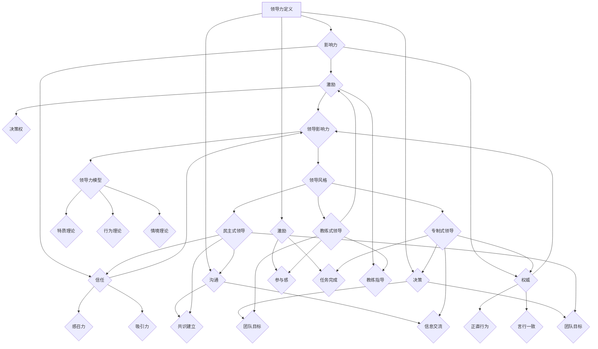

                 

### 引言：书籍的目的与结构

《领导力修炼手册：从销售新星到管理者的逆袭宝典》旨在帮助那些在销售领域表现出色的专业人士，他们在职业生涯的早期取得了显著成就，但如今希望过渡到管理角色。本书的核心目的是提供一个全面的指南，让销售新星能够顺利转型为管理者，并在新的岗位上展现出卓越的领导力。

首先，本书将带领读者了解领导力的基本理论和模型，帮助读者建立正确的领导力观念。接着，本书将深入探讨销售技能与管理技能之间的差异，并提供过渡策略，帮助读者从心理准备到实际技能提升，顺利实现职业角色的转变。

在掌握了基础理论后，本书的第二部分将重点介绍关键管理技能，包括团队领导力、沟通技巧、决策能力和人员管理。这部分内容旨在帮助读者在实际工作中运用这些技能，提升管理效率。

对于面临各种挑战的管理者，本书的第三部分将提供应对挫折和自我调适的策略，帮助读者在逆境中保持坚定，不断提升自身素质。

在案例分析与应用部分，本书将通过实际案例分享和实战策略应用，让读者能够将所学知识运用到实际工作中。最后一部分，本书将探讨未来领导力的发展趋势，帮助读者预见未来，为自身的长远发展做好准备。

通过这本书，读者将能够：
- 明确领导力的核心概念和模型。
- 理解销售技能与管理技能的差异。
- 掌握关键管理技能，提升管理效率。
- 应对职业生涯中的各种挑战。
- 为未来的领导力发展奠定坚实基础。

**关键词：**
- 领导力
- 销售到管理转型
- 关键管理技能
- 应对挫折
- 未来领导力

**摘要：**
本书以领导力修炼为核心，针对销售新星转型为管理者提供全方位的指导。从基础理论到关键技能提升，再到实际应用和未来展望，本书旨在帮助读者在职业生涯中实现顺利过渡，成为卓越的管理者。通过本书，读者将掌握领导力的核心概念，提升管理效率，并能够在面对挑战时保持坚定，为未来的领导力发展打下坚实基础。

```mermaid
graph TD
    A[引言] --> B{书籍目的与结构}
    A --> C{适用读者群体}
    A --> D{结构安排}
    B --> E{核心目的}
    B --> F{读者群体定义}
    B --> G{章节结构概述}
    C --> H{目标读者特点}
    C --> I{读者需求分析}
    D --> J{内容布局}
    D --> K{逻辑关系阐述}
    E --> L{领导力理解}
    E --> M{职业转型支持}
    E --> N{管理技能提升}
    E --> O{实战策略应用}
    F --> P{销售新星}
    F --> Q{转型管理者}
    G --> R{章节内容概述}
    G --> S{逻辑连贯性}
    H --> T{职业背景}
    H --> U{职业期望}
    I --> V{知识需求}
    I --> W{实践需求}
    J --> X{章节安排合理性}
    J --> Y{内容详尽度}
    K --> Z{结构紧凑性}
    L --> AA[领导力定义]
    L --> BB[领导力模型]
    L --> CC[领导力重要性]
    M --> DD[角色转变准备]
    M --> EE[技能转移策略]
    M --> FF[职业规划指导]
    N --> GG[团队领导力]
    N --> HH[沟通技巧]
    N --> II[决策能力]
    N --> JJ[人员管理]
    O --> KK[案例分享]
    O --> LL[实战策略]
    O --> MM[知识应用]
    P --> NN[销售成功经验]
    P --> OO[管理需求]
    Q --> PP[管理挑战]
    Q --> QQ[管理角色定义]
    R --> SS[章节概述]
    R --> TT[内容详尽]
    S --> UU[逻辑连贯]
    S --> VV[结构紧凑]
    T --> WW[销售角色理解]
    T --> XX[管理角色理解]
    U --> YY[职业目标]
    U --> ZZ[职业挑战]
    V --> AAA[知识需求分析]
    V --> BBB[知识获取途径]
    V --> CCC[知识应用实践]
    W --> DDD[实践需求分析]
    W --> EEE[实践策略]
    W --> FFF[实践反馈]
    X --> GGG[章节逻辑]
    X --> HHH[章节详尽]
    Y --> III[章节结构]
    Y --> JJJ[章节内容完整]
    Z --> KKK[结构合理性]
    Z --> LLL[内容连贯]
    AA --> MMM[领导力核心概念]
    AA --> NNN[领导力模型关系]
    BB --> OOO[领导力模型介绍]
    BB --> PPP[领导力模型应用]
    CC --> QQQ[领导力重要性阐述]
    DD --> RRR[角色转变准备方法]
    EE --> SSS[技能转移策略详细]
    FF --> TTT[职业规划策略]
    GG --> UUU[团队领导力要素]
    GG --> VVV[团队领导力实践]
    HH --> WWW[沟通技巧概述]
    HH --> XXX[沟通技巧应用]
    II --> YYY[决策能力原则]
    II --> ZZZ[决策能力方法]
    JJ --> AAAA[人员管理核心]
    JJ --> BBBB[人员管理实践]
    KK --> CCCD[案例一解析]
    KK --> DDDD[案例二分析]
    KK --> EEEE[案例三探讨]
    LL --> FFFF[实战策略总结]
    MM --> GGGG[知识应用案例]
    NN --> HHHH[销售成功经验分享]
    OO --> IIII[管理需求识别]
    PP --> JJJK[管理挑战应对]
    QQ --> KKKK[管理角色定义解释]
    RRR --> LLLL[角色转变准备详细]
    SSS --> MMMM[技能转移策略应用]
    TTT --> UUUU[职业规划实施]
    UUU --> VVVV[团队领导力成果]
    VVV --> WWWW[沟通技巧成效]
    WWW --> XXXX[决策能力表现]
    XXX --> YYYY[人员管理实践]
    AAAA --> ZZZZ[人员管理策略]
    BBBB --> CCCC[人员管理案例分析]
    CCCD --> DDDD[案例一详细解析]
    DDDD --> EEEE[案例二深入分析]
    EEEE --> FFFF[案例三讨论与反思]
    GGGG --> HHHH[知识应用案例详述]
    HHHH --> IIIII[销售成功经验解析]
    IIII --> JJJJ[管理需求应对策略]
    JJJK --> KKKK[管理挑战应对方法]
    KKKK --> LLLL[管理角色定义与实际操作]
```

  

以上为《领导力修炼手册：从销售新星到管理者的逆袭宝典》的引言部分，包括书籍目的与结构、适用读者群体、结构安排等内容，以及相关核心概念、领导力模型、领导力重要性、角色转变准备、技能转移策略、职业规划指导等概念的流程图。接下来我们将进一步深入探讨这些主题。  
### 基础领导力理论

领导力是一种能够激励和引导他人实现共同目标的能力。要成为一名成功的领导者，首先需要了解领导力的基本概念和模型。以下是对几个关键领导力概念的讨论：

#### 1. 领导力的定义

领导力不仅仅是指指挥和控制他人，更重要的是激发团队的内在动力，使其自愿地为实现目标而努力。领导力是一种影响力，它能够改变人们的思维和行为，引导他们朝着共同的目标前进。从广义上讲，领导力包括但不限于以下几个方面：

- **影响力**：领导者通过言行和行动影响他人的能力和意愿。
- **激励**：激发团队成员的积极性，使其愿意为团队目标付出努力。
- **决策**：在不确定性中做出明智的决策，为团队指明方向。
- **沟通**：有效地与团队成员交流信息，建立信任和共识。

#### 2. 领导力模型

领导力模型是对领导行为的分类和解释，不同的模型有助于我们理解领导力在不同情境下的应用。以下是几种常见的领导力模型：

- **特质理论**：这种理论认为领导者具有特定的个性特质和能力，如自信、正直、决断力等。领导者通过这些特质来影响他人。
- **行为理论**：这种理论关注领导者的行为模式，认为领导行为可以分为任务导向型和关系导向型。任务导向型领导者注重任务完成，关系导向型领导者注重团队成员的福利和关系。
- **情境理论**：这种理论认为领导行为应该根据情境的变化而变化。例如，费德勒模型（Fiedler's Contingency Model）认为领导效果取决于领导者、下属和情境三个因素之间的关系。

#### 3. 领导风格与影响力

领导风格是指领导者处理工作和团队关系的特定方式。不同的领导风格适用于不同的情境和团队成员。以下是几种常见的领导风格：

- **专制式领导**：领导者做出所有决策，团队成员没有参与权。这种方式适用于需要迅速决策的情况，但可能导致团队成员的被动和不满。
- **民主式领导**：领导者鼓励团队成员参与决策，团队成员有更多的话语权。这种方式有助于提高团队成员的参与感和归属感，但可能决策速度较慢。
- **教练式领导**：领导者不仅提供指导，还帮助团队成员发展其技能和潜力。这种方式适用于培养团队成员的能力和长期发展。

领导者的影响力来源于多个方面，包括：

- **权威**：领导者因职位和权力而获得的尊重。
- **信任**：领导者通过言行一致和正直行为赢得团队成员的信任。
- **魅力**：领导者具有吸引力和感召力，能够激发团队成员的热情和动力。

#### 4. 领导力发展路径

领导力并不是与生俱来的，而是可以通过学习和实践逐步培养的。以下是几个关键步骤：

- **自我认知**：了解自己的优势、弱点、价值观和信念。
- **持续学习**：通过阅读、培训、实践等方式不断学习新知识和技能。
- **角色扮演**：在团队中扮演不同的角色，如领导者、团队成员、协调者等，以培养多样化的领导能力。
- **反思与改进**：定期反思自己的领导行为，识别改进的机会，并采取行动。

通过理解这些领导力理论，销售新星可以更好地认识自己的领导潜力，并为未来的管理角色打下坚实基础。

#### 核心概念与联系

为了更好地理解领导力的核心概念及其相互关系，我们使用Mermaid流程图来展示这些概念之间的联系。

通过这个流程图，我们可以清晰地看到领导力的核心概念及其相互关系。领导力不仅包含影响力的多个方面，还包括决策、激励和沟通等关键要素。不同的领导力模型和领导风格对这些要素的应用提供了不同的视角和策略。理解这些核心概念及其联系，对于销售新星转型为管理者具有重要意义。

### 领导力发展路径

领导力并非一蹴而就，而是一个不断学习和成长的过程。从销售新星到管理者，这一转型之路需要明确的步骤和策略。以下是领导力发展的关键路径，以及如何在这一过程中自我认知和提升：

#### 1. 自我认知

自我认知是领导力发展的第一步。只有深入了解自己的优势、弱点、价值观和信念，才能制定合适的提升计划。

- **优势识别**：通过反思和反馈，识别自己的优势，如沟通能力、决策力、团队合作等。这些优势将成为你未来领导角色的有力支撑。

- **弱点分析**：同样，识别自己的弱点，如时间管理、情绪控制、战略思维等。对于这些弱点，可以通过培训、阅读和实践来逐步克服。

- **价值观和信念**：了解自己的核心价值观和信念，这些将指导你在领导过程中做出正确决策，并赢得团队成员的信任和支持。

#### 2. 持续学习

领导力的发展离不开持续的学习。通过不断学习新的知识和技能，你可以不断提升自己的竞争力。

- **阅读**：阅读相关书籍和文章，了解最新的领导力理论和实践。例如，《领导力五要素》（The Five Levels of Leadership）和《高效能人士的七个习惯》（The 7 Habits of Highly Effective People）都是非常有价值的读物。

- **培训**：参加领导力培训课程，这些课程通常包括案例分析、角色扮演和模拟练习，可以帮助你将理论知识应用到实际工作中。

- **网络交流**：加入专业社群和论坛，与其他领导者交流经验和观点。这些交流不仅可以拓展你的视野，还可以建立宝贵的职业网络。

#### 3. 角色扮演

在团队中扮演不同的角色，是培养领导力的有效方法。通过参与不同的项目和任务，你可以积累多样化的领导经验。

- **团队成员**：在团队中发挥积极作用，参与决策和执行，展示你的能力和价值。

- **协调者**：在不同团队和部门之间协调沟通，解决冲突和问题，提升你的协调和沟通技能。

- **领导者**：承担更多领导责任，如带领团队完成任务、制定目标和策略等。通过这些实践，你可以更深入地理解领导力的真谛。

#### 4. 反思与改进

反思是领导力发展的重要环节。通过反思自己的行为和决策，你可以识别改进的机会，并采取相应的措施。

- **定期反思**：定期回顾自己的领导行为，分析哪些是有效的，哪些需要改进。

- **反馈机制**：建立有效的反馈机制，如定期与团队成员交流、邀请上级领导提供反馈等。这些反馈可以帮助你更客观地了解自己的表现。

- **持续改进**：根据反思和反馈，制定改进计划，并付诸实践。持续改进是一个持续的过程，需要耐心和毅力。

#### 5. 持续成长

领导力是一个不断成长的过程。随着角色的转变和环境的变化，你需要不断调整和提升自己的领导力。

- **适应变化**：保持开放的心态，适应环境的变化和新的挑战。

- **保持好奇心**：对新的知识和技能保持好奇心，不断探索和尝试。

- **终身学习**：将学习作为一种生活方式，不断充实自己的知识和技能。

通过以上步骤，销售新星可以逐步提升自己的领导力，为转型为管理者打下坚实基础。领导力发展不是一蹴而就的，需要持续的努力和自我提升。只有通过不断学习和实践，才能在未来的管理角色中游刃有余。

### 销售技能与管理技能的差异

从销售新星到管理者，这一角色转变不仅需要领导力的提升，还需要掌握一系列管理技能。销售技能与管理技能虽然有重叠之处，但它们在目标设定、决策过程和任务执行上存在显著差异。

#### 1. 目标设定

销售角色的目标通常是以业绩为导向，如达成销售目标、增加市场份额、提高客户满意度等。这些目标往往是具体的、量化的，并且具有短期性。例如，一个销售人员可能会设定每月完成100万元销售额的目标。

而在管理角色中，目标设定更加多元化，不仅包括业绩指标，还包括团队建设、员工发展、资源优化等长期目标。管理者需要制定战略目标，如提升团队协作效率、培养下一代领导者、优化公司流程等。这些目标更加抽象和长期，需要综合考虑各种因素，如市场趋势、公司战略和团队状况。

**销售目标设定**：
- 具体量化：如每月完成100万元销售额。
- 短期性：针对当前销售周期。
- 业绩导向：直接关系到个人和团队的绩效评估。

**管理目标设定**：
- 多元化：包括业绩、团队建设、资源优化等。
- 长期性：影响公司的长远发展和战略规划。
- 综合性：需要考虑市场、公司战略和团队状况等多方面因素。

#### 2. 决策过程

在销售过程中，决策通常是基于个人经验和直觉，快速而直接。销售人员需要快速响应客户需求和市场变化，做出决策以达成销售目标。

而在管理角色中，决策过程更加复杂和系统化。管理者需要考虑多个方面的因素，如团队意见、资源限制、公司战略等。决策往往需要更多的数据支持和团队讨论，以确保决策的合理性和可行性。

**销售决策过程**：
- 快速反应：基于个人经验和直觉。
- 直接行动：通常不需要复杂的数据分析。
- 个性化：根据客户需求和市场变化快速调整策略。

**管理决策过程**：
- 系统化：需要考虑多个方面的因素，如团队意见、资源限制等。
- 数据驱动：依赖数据分析和团队讨论。
- 长期规划：考虑公司战略和团队发展。

#### 3. 任务执行

销售角色中的任务执行侧重于个人绩效，如拜访客户、跟进潜在客户、完成销售报告等。销售人员需要高效地完成这些任务，以实现个人和团队的业绩目标。

而在管理角色中，任务执行不仅涉及个人绩效，还包括团队绩效和资源管理。管理者需要协调和监督团队的任务执行，确保整个团队的运作高效有序。这包括分配任务、监控进度、解决问题和提供支持等。

**销售任务执行**：
- 个人绩效：侧重于个人销售目标的实现。
- 独立完成：通常不需要过多团队协作。
- 高效执行：快速响应客户需求，提高销售转化率。

**管理任务执行**：
- 团队绩效：涉及团队整体目标的实现。
- 协调合作：需要与团队成员密切合作，确保任务顺利进行。
- 资源管理：优化资源分配，提高团队效率。

通过了解销售技能与管理技能的差异，销售新星可以更好地规划自己的职业发展路径，为未来的管理角色做好准备。掌握管理技能，不仅能够提升个人领导力，还能够为团队和公司的长远发展做出贡献。

### 从销售角色到管理角色的过渡策略

从销售角色过渡到管理角色，是一个充满挑战和机遇的过程。这一转变不仅需要领导者具备基本的领导能力，还需要在心理和技能方面进行全面的准备。以下是一些关键策略，帮助销售新星成功实现这一转变。

#### 1. 心理准备

心理准备是过渡到管理角色的重要一步。销售新星需要认识到，管理角色与销售角色有显著的不同，需要承担更多的责任和压力。以下是一些建议：

- **接受角色变化**：理解管理角色不仅仅是销售业绩的维持，还包括团队建设、资源管理和战略规划。接受这一变化，并准备好面对新的挑战。
- **培养责任感**：管理角色的核心是负责团队和项目的成功。培养责任感，意味着要愿意承担责任，并在失败时勇于承担责任。
- **调整心态**：从以个人业绩为中心转向以团队成功为中心。学会关注团队成员的成长和团队的整体目标，而不是仅仅追求个人销售目标的达成。

#### 2. 技能提升

在心理准备的同时，销售新星还需要提升关键的管理技能，以应对新的角色要求。以下是一些重要的管理技能和提升策略：

- **沟通技能**：有效的沟通是管理成功的关键。提升沟通技能，包括倾听、清晰表达、非言语沟通和冲突解决。参加沟通培训或阅读相关书籍，如《非暴力沟通》（Nonviolent Communication）和《沟通的艺术》（The Art of Communication）。
- **团队领导力**：领导一个团队需要不同于管理个人的技能。学习如何激励团队成员、分配任务、提供反馈和解决团队冲突。参加领导力培训课程或阅读相关书籍，如《团队的智慧》（The Power of Team Leadership）和《领导者的影响力》（The Power of Influence）。
- **决策能力**：管理角色需要做出更多复杂的决策。提升决策能力，包括收集信息、评估风险、权衡利弊和制定行动方案。学习决策模型和方法，如SWOT分析、决策树和期望值计算。
- **时间管理**：作为管理者，需要有效地管理时间和资源。学习时间管理技巧，如优先级排序、时间块安排和避免拖延。使用时间管理工具，如待办事项列表、日历和任务管理应用程序。

#### 3. 建立新的职业网络

在过渡到管理角色后，建立和维护新的职业网络至关重要。以下是一些建议：

- **参与行业活动**：参加行业会议、研讨会和社交活动，结识其他行业专业人士。这些活动不仅有助于扩展人脉，还可以获取行业最新动态。
- **导师关系**：寻找一位导师，可以是公司内部的资深管理者或行业专家。导师可以提供宝贵的职业建议和指导，帮助你在职业生涯中更快地成长。
- **同行交流**：与其他管理同行建立联系，分享经验和观点。通过同行交流，可以了解不同的管理实践和策略，为自己的管理风格提供新的思路。

#### 4. 转变策略

以下是一些具体的策略，帮助销售新星顺利过渡到管理角色：

- **逐步承担职责**：开始时，可以逐步承担一些管理职责，如团队协调、项目管理和资源分配，以逐步适应新的角色。
- **明确期望**：与上级领导明确管理角色的期望和目标，确保自己了解公司的期望和标准。
- **寻求反馈**：定期与团队成员和上级领导交流，寻求反馈和指导，以不断改进自己的管理能力。
- **持续学习**：管理角色要求不断学习和成长。通过阅读、培训和实践，不断提升自己的管理技能和知识。

通过以上策略，销售新星可以顺利过渡到管理角色，并在新的岗位上展现出卓越的领导力。

### 团队领导力

团队领导力是管理者成功的关键因素之一。它不仅影响团队的整体绩效，还决定了团队成员的满意度和忠诚度。以下是团队领导力的核心要素和具体实践方法。

#### 1. 核心要素

**激励**：激励是团队领导力的核心，它能够激发团队成员的内在动力，使其愿意为团队目标付出努力。激励可以通过多种方式实现，如认可和奖励、设定目标和提供支持。

**沟通**：有效的沟通是团队领导力的基础。领导者需要确保信息在团队内部得到清晰和准确的传递，避免误解和冲突。沟通不仅包括语言表达，还包括非言语沟通和倾听。

**信任**：信任是团队协作的基石。领导者需要建立和维护团队成员之间的信任，使其愿意分享信息和承担责任。信任可以通过透明的决策过程、一致的言行和正直的行为来建立。

**协作**：协作是团队领导力的体现，它要求领导者能够协调团队成员的努力，共同实现团队目标。协作包括任务分配、资源协调和跨部门合作。

**发展**：领导者需要关注团队成员的职业发展，提供培训机会和指导，帮助他们提升技能和实现个人目标。通过发展团队成员，领导者可以增强团队的凝聚力和战斗力。

#### 2. 实践方法

**激励策略**：

- **认可与奖励**：定期表彰和奖励团队成员的成就，提高其工作动力。例如，可以设置每月的“最佳员工”奖项，或者在团队会议上公开表扬优秀表现。

- **目标设定**：与团队成员共同设定具体、可量化的目标，并定期检查进度。目标设定可以帮助团队成员明确方向，并保持持续的努力。

- **个性化激励**：根据团队成员的不同需求和兴趣，提供个性化的激励措施。例如，对于喜欢挑战的员工，可以设置更具挑战性的任务；对于追求稳定的员工，可以提供稳定的晋升路径。

**沟通技巧**：

- **透明沟通**：确保团队内部的信息传递是透明和及时的。例如，定期召开团队会议，分享公司战略和业务进展，使团队成员了解全局。

- **积极倾听**：倾听是有效沟通的关键。领导者需要给予团队成员充分的发言机会，倾听他们的意见和反馈，并对其进行尊重和考虑。

- **反馈机制**：建立有效的反馈机制，鼓励团队成员相互反馈，并提出改进建议。这有助于团队成员之间的沟通和理解，减少误解和冲突。

**建立信任**：

- **一致性**：领导者需要保持言行一致，确保自己的决策和行为符合团队标准和价值观。

- **开放性**：领导者需要保持开放的心态，鼓励团队成员分享意见和建议。通过开放性，可以建立信任，并激发团队的创造力。

- **正直行为**：领导者需要以正直的行为树立榜样，赢得团队成员的信任。例如，在团队中遵守承诺、公平对待每个成员、公正处理问题等。

**协作策略**：

- **任务分配**：根据团队成员的能力和兴趣，合理分配任务。确保每个成员都能在自己的领域内发挥最佳作用。

- **资源协调**：确保团队内部资源充足，并合理分配。例如，为项目团队提供必要的工具和资源，以支持其高效工作。

- **跨部门合作**：鼓励跨部门合作，促进不同团队之间的交流和协作。这可以通过定期举办跨部门会议、共享信息和资源来实现。

**发展策略**：

- **培训与发展**：提供持续的培训和发展机会，帮助团队成员提升技能和知识。例如，组织内部培训、参加外部研讨会和培训课程。

- **职业规划**：与团队成员共同制定职业发展规划，明确其职业目标和成长路径。这可以帮助团队成员明确发展方向，并激励其不断提升自己。

- **指导与反馈**：提供一对一的指导和反馈，帮助团队成员识别自己的优势和不足，并提出改进建议。这有助于团队成员的快速成长。

通过以上实践方法，管理者可以提升团队领导力，激发团队的潜力和创造力，从而实现团队的目标和公司的战略目标。

### 沟通技巧

沟通技巧是管理者必须掌握的关键能力之一。有效的沟通能够确保团队内部的信息流畅传递，减少误解和冲突，提升整体工作效率。以下是几个关键的沟通技巧和策略：

#### 1. 清晰表达

清晰表达是沟通的基础。管理者需要确保自己的信息能够被团队成员准确理解和执行。以下是一些建议：

- **明确目标**：在沟通前明确自己的目标，确保信息传达的清晰和具体。例如，在会议开始时，可以简短地概括会议的目标和议程。

- **简洁明了**：避免使用复杂的术语和冗长的句子。尽量用简单的语言传达信息，使团队成员更容易理解。

- **使用例子**：通过具体的例子来解释复杂的概念或指令。这可以帮助团队成员更好地理解你的意图，并减少误解。

- **重复关键信息**：在沟通中重复关键信息，确保团队成员对其有清晰的认识。例如，在讨论一个重要决策时，可以多次强调其重要性和预期结果。

#### 2. 倾听

有效的沟通是双向的，包括说话和倾听。以下是一些倾听的技巧：

- **全神贯注**：在沟通时，全神贯注地听对方讲话，避免分心。通过保持眼神接触和身体姿势，表达出你的专注和尊重。

- **积极反馈**：在对方讲话时，给予积极的反馈，如点头、微笑或简短的回应，表明你在听并理解。

- **不要打断**：在对方讲话时，避免打断他们，直到他们完成表达。这可以表明你的尊重和耐心。

- **理解观点**：尽量从对方的角度理解他们的观点和感受。不要急于反驳或评判，先理解他们的立场。

#### 3. 非言语沟通

非言语沟通在传达信息时起着重要作用。以下是一些关键的非言语沟通技巧：

- **身体语言**：使用恰当的身体语言，如微笑、点头、开放的身体姿态等，可以增强沟通的效果。避免负面身体语言，如交叉手臂、回避眼神等。

- **面部表情**：面部表情可以传达情绪和态度。保持积极的面部表情，如微笑，可以营造友好和积极的氛围。

- **语调**：语调可以影响沟通的效果。使用清晰、有节奏的声音，避免语调平淡或过于激动。

- **空间使用**：合理使用空间，避免过于靠近或过于远离对方。保持适当的距离，可以减少紧张和不适感。

#### 4. 冲突解决

在团队中，冲突是不可避免的。以下是一些解决冲突的策略：

- **保持冷静**：在冲突发生时，保持冷静和客观，避免情绪化。这可以帮助你更清晰地思考和解决问题。

- **倾听各方观点**：确保每个相关方的观点都被听到和理解。通过倾听，可以找到共同点和解决方案。

- **使用事实和数据**：在讨论冲突时，使用事实和数据来支持你的观点。这可以帮助减少主观情绪的影响，使讨论更加客观。

- **寻求妥协**：在无法达成一致时，寻求妥协是一种有效的解决方法。通过妥协，可以找到双方都能接受的解决方案。

- **制定行动计划**：在解决冲突后，制定具体的行动计划，以确保问题得到有效解决。这可以帮助防止类似冲突再次发生。

通过掌握这些沟通技巧和策略，管理者可以提升团队内部的沟通效率，减少误解和冲突，从而提高整体团队的工作表现和满意度。

### 决策能力

决策能力是管理者不可或缺的核心技能之一。有效的决策能力不仅能帮助企业迅速应对市场变化，还能提高团队效率和员工满意度。以下是如何提升决策能力的方法：

#### 1. 数据分析

在做出决策前，数据分析是必不可少的一步。通过收集和分析相关数据，管理者可以更准确地了解问题的本质，减少决策中的不确定性。

- **数据收集**：首先，确保收集到的数据是准确和全面的。这包括销售数据、市场趋势、客户反馈等。
- **数据分析**：使用数据分析工具，如Excel、SQL或高级数据分析软件，对收集到的数据进行分析。通过图表、趋势线和关键指标，揭示数据背后的趋势和规律。
- **数据可视化**：将分析结果以图表、图形和报告的形式呈现，使决策过程更加直观和易于理解。

#### 2. SWOT分析

SWOT分析是一种常用的战略规划工具，用于评估企业的优势、劣势、机会和威胁。通过SWOT分析，管理者可以在做出决策前全面考虑各种因素。

- **优势（Strengths）**：分析企业的核心竞争力、独特资源和优势，这些优势可以为决策提供支持。
- **劣势（Weaknesses）**：识别企业的不足和弱点，这些弱点可能是决策中需要避免的风险。
- **机会（Opportunities）**：分析市场趋势、竞争态势和外部环境中的机会，这些机会可以为决策提供新的方向。
- **威胁（Threats）**：识别潜在的市场风险和竞争对手的行动，这些威胁可以帮助管理者在决策中保持警觉。

#### 3. 决策树

决策树是一种图形化的决策分析工具，用于展示不同决策路径及其可能的结果。通过决策树，管理者可以清晰地看到每个决策选项的影响，并做出最优选择。

- **构建决策树**：首先，列出所有可能的决策选项，并标注每个选项的结果。然后，根据每个选项的概率和结果，计算期望值。
- **评估决策树**：分析每个决策选项的期望值和风险，选择期望值最高且风险最小的选项。
- **决策路径**：根据决策树的结果，确定最终的决策路径和行动计划。

#### 4. 期望值计算

期望值计算是一种概率论方法，用于评估决策结果的期望值。通过计算每个决策路径的期望值，管理者可以做出更合理的决策。

- **定义概率**：首先，定义每个决策结果发生的概率。这可以通过历史数据、市场调研或专家意见确定。
- **计算期望值**：根据每个决策结果的价值和概率，计算期望值。期望值是所有可能结果的价值乘以其概率的总和。
- **选择最优决策**：选择期望值最高的决策选项，这通常是最佳决策。

#### 5. 多元化决策团队

多元化决策团队可以提供不同的观点和意见，有助于减少决策偏差和提高决策质量。以下是一些关键策略：

- **组建多元化团队**：确保团队成员来自不同的背景和领域，如技术、市场、财务等。
- **开放讨论**：鼓励团队成员自由表达意见和提出问题，确保所有观点都被充分考虑。
- **决策投票**：在讨论结束后，进行投票决定最终决策。这可以确保决策是团队共识的结果，减少个人偏见。

通过以上方法，管理者可以提升自己的决策能力，做出更加合理和有效的决策。有效的决策能力不仅能帮助企业应对各种挑战，还能提升管理者的领导力和公信力。

### 人员管理

人员管理是管理者的重要职责之一，它直接关系到团队的工作效率、员工满意度和企业的整体绩效。以下是人员管理的核心内容和具体实践方法。

#### 1. 核心内容

**招聘**：招聘是人员管理的第一步，涉及到选择最适合企业的人才。核心内容包括：

- **职位需求分析**：明确招聘的职位需求，包括职责、技能要求和公司文化适配度。
- **招聘渠道**：选择合适的招聘渠道，如在线招聘平台、招聘会、内部推荐等。
- **面试流程**：设计合理的面试流程，包括初试、复试和专业技能测试等。

**培训与发展**：为了提升员工的技能和绩效，管理者需要提供持续的职业培训和发展机会。核心内容包括：

- **技能培训**：根据员工的岗位需求，提供相应的技能培训，如销售技巧、项目管理、团队协作等。
- **领导力发展**：为有潜力的员工提供领导力培训，培养未来的管理人才。
- **职业规划**：与员工共同制定职业发展规划，明确其职业目标和成长路径。

**绩效评估**：绩效评估是衡量员工工作表现的重要手段。核心内容包括：

- **评估标准**：设定明确的绩效评估标准，包括工作质量、工作效率、团队协作和创新能力等。
- **评估流程**：设计合理的绩效评估流程，包括定期评估、反馈会议和评估报告等。
- **反馈与改进**：提供具体的反馈和建议，帮助员工改进工作表现，并制定改进计划。

**激励与奖励**：激励与奖励是提高员工积极性和工作动力的重要手段。核心内容包括：

- **绩效奖励**：根据员工的绩效表现，提供奖金、晋升机会和其他奖励。
- **认可与表彰**：定期表彰和奖励优秀员工，提高其工作满意度和归属感。
- **福利与福利**：提供有竞争力的福利和福利政策，如健康保险、带薪休假和员工活动等。

#### 2. 实践方法

**招聘实践**：

- **职位需求分析**：通过岗位分析工具，如职位说明书和岗位职责清单，明确招聘的职位需求。
- **招聘渠道选择**：根据职位特点和目标人群，选择合适的招聘渠道，如在线招聘平台、招聘会、社交媒体等。
- **面试流程设计**：设计合理的面试流程，包括初试、复试和专业技能测试等。确保面试过程的公正性和科学性。

**培训与发展实践**：

- **技能培训**：根据员工的岗位需求和公司战略，制定培训计划，并选择合适的培训方式，如内部培训、外部培训、在线课程等。
- **领导力发展**：为有潜力的员工提供领导力培训，如团队建设、沟通技巧、决策能力等。
- **职业规划**：与员工进行一对一的职业规划会议，了解其职业目标和发展需求，并提供相应的支持和资源。

**绩效评估实践**：

- **评估标准设定**：根据公司的战略目标和岗位职责，设定明确的绩效评估标准，确保评估的公正性和客观性。
- **评估流程**：制定合理的绩效评估流程，包括定期评估、反馈会议和评估报告等。确保评估过程的透明性和公平性。
- **反馈与改进**：在绩效评估后，与员工进行一对一的反馈会议，提供具体的反馈和建议，并制定改进计划。

**激励与奖励实践**：

- **绩效奖励**：根据员工的绩效表现，提供奖金、晋升机会和其他奖励，如员工旅行、优秀员工奖等。
- **认可与表彰**：定期举办表彰活动，对优秀员工进行公开表彰，提高其工作满意度和归属感。
- **福利与福利**：提供有竞争力的福利和福利政策，如健康保险、带薪休假、员工活动等，增强员工的幸福感和忠诚度。

通过以上实践方法，管理者可以有效地进行人员管理，提升团队的工作效率和员工的满意度，从而实现企业的长期发展目标。

### 管理者的逆境应对

在职业生涯中，管理者难免会遇到各种挑战和逆境。如何应对这些逆境，保持心理平衡，持续成长，是每位领导者都必须面对的课题。以下是一些具体的策略和自我调适技巧，帮助管理者在逆境中保持坚定，不断提升自身素质。

#### 1. 应对挫折的策略

**接受现实**：面对挫折和失败，首先需要接受现实。这并不是放弃，而是理解失败是成长的一部分，每个成功的领导者都经历过类似的挑战。

**积极思考**：转变思维模式，从消极的情绪中走出来。尝试看到失败背后的积极因素，如学习机会、改进空间和新的起点。

**制定行动计划**：在逆境中，制定具体的行动计划是关键。列出可行的解决方案，并分解成小步骤，逐一克服。

**寻求支持**：不要孤军奋战。与同事、朋友或导师交流，寻求他们的意见和支持，这有助于减轻压力，获取新的视角。

#### 2. 心理调适技巧

**自我反思**：定期进行自我反思，识别自己在逆境中的行为和思维模式。通过反思，可以发现不足，并制定改进计划。

**情绪管理**：学习情绪管理技巧，如深呼吸、冥想和正念练习，帮助自己在压力下保持冷静和专注。

**保持乐观**：保持积极的心态，相信自己有能力克服困难。乐观的心态可以激发内在的动力，使你更加坚定。

**设定目标**：为自己设定短期和长期的目标，使自己在逆境中有明确的奋斗方向。目标可以提供动力和方向，帮助自己保持前进。

#### 3. 持续成长

**不断学习**：在逆境中，不断学习新知识和技能，提升自己的综合素质。阅读相关书籍、参加培训课程和研讨会，都是很好的学习途径。

**实践经验**：将学习到的知识应用到实际工作中，通过实践来检验和提升自己的能力。实践经验是成长的最佳途径。

**反思与改进**：在实践过程中，不断反思自己的行为和决策，识别改进的机会，并采取行动。通过持续改进，可以不断提升自己的管理能力。

**建立网络**：与行业内的专家和同行建立联系，分享经验和观点，从他们那里获取新的见解和建议。建立强大的职业网络可以帮助自己在逆境中找到支持。

#### 4. 具体实践案例

**案例一**：某公司新上任的部门经理在短短几个月内，面临了团队成员流失、项目进度延误和客户投诉等问题。通过自我反思和积极寻求支持，他制定了详细的改进计划，包括加强团队建设、优化项目管理流程和提升客户服务体验。同时，他积极参与公司的领导力培训，学习新的管理技巧和策略。经过一段时间的努力，部门的工作效率和员工士气都有了显著提升。

**案例二**：一位销售经理在一次重要销售项目中遭遇失败。她没有因此气馁，而是积极分析失败的原因，并从中学习。她重新制定了销售策略，调整了团队结构，并引入了新的销售工具。经过几个月的努力，她成功地扭转了局面，项目最终取得了成功。

通过以上策略和实践案例，管理者可以在逆境中保持坚定，不断提升自身素质，最终实现职业目标。

### 自我调适与管理者素质提升

作为管理者，自我调适和不断提升自身素质是确保职业生涯成功的关键。以下是几个关键方面的自我调适策略，帮助管理者在复杂的职业环境中保持高效和持续成长。

#### 1. 自我认知

**反思与自我评估**：定期进行自我反思和评估，了解自己的长处和短板。通过自我评估工具，如360度反馈、SWOT分析等，管理者可以更全面地认识自己，从而制定有针对性的提升计划。

**接受反馈**：积极接受来自团队成员、同事和上级的反馈，不要将其视为批评，而是作为成长的机会。通过倾听和接受反馈，管理者可以不断改进自己的行为和管理风格。

**设定个人目标**：根据自己的职业规划和公司目标，设定短期和长期的个人目标。这些目标应具体、可衡量，并能够激励管理者不断提升自己。

#### 2. 持续学习

**知识更新**：在快速变化的商业环境中，管理者需要不断更新自己的知识和技能。通过参加培训课程、阅读相关书籍、参加行业研讨会等方式，管理者可以保持与行业发展的同步。

**跨领域学习**：管理者不应局限于自身的专业领域，而应尝试跨领域学习。这不仅有助于拓宽视野，还能提高解决问题的综合能力。

**实践与反馈**：将所学知识应用到实际工作中，通过实践来检验和提升自己的能力。在实践过程中，不断反思和调整，根据反馈进行改进。

#### 3. 建立健康的工作与生活平衡

**时间管理**：有效管理时间，确保工作与个人生活的平衡。使用时间管理工具，如待办事项列表、时间块安排等，提高工作效率。

**自我放松**：在工作之余，给自己留出时间进行自我放松和恢复。通过锻炼、冥想、阅读等方式，缓解工作压力，提高生活质量。

**家庭与社交**：保持良好的家庭关系和社交网络，这些支持系统能够为管理者提供心理支持和资源。

#### 4. 培养积极的思维模式

**积极心态**：培养积极的心态，面对挑战和逆境时，保持乐观和坚韧。积极心态能够激发内在动力，帮助管理者克服困难。

**解决问题**：将问题视为学习和成长的机会，而不是负担。通过分析和解决各种问题，管理者可以提高自己的问题解决能力和创新思维。

**持续成长**：将成长视为一种生活方式，不断追求进步和突破。通过设定个人目标和不断学习，管理者可以持续提升自己的素质。

#### 5. 领导力与影响力

**团队建设**：建立积极向上的团队文化，培养团队合作精神和凝聚力。通过有效的沟通和激励，管理者可以提升团队的整体绩效。

**影响力**：通过言行一致和正直的行为，建立和维护自己的影响力。领导者的影响力不仅来自职位和权力，更来自其价值观和行为。

**领导力发展**：不断学习和实践领导力，通过参加领导力培训、阅读领导力书籍、向优秀的领导者学习等，提升自己的领导能力。

通过以上自我调适策略，管理者可以在职业生涯中保持高效和持续成长，为团队和公司的发展做出更大的贡献。

### 案例分析与应用

为了更好地理解领导力理论在实际中的应用，以下我们将通过几个具体的案例，探讨如何从销售新星转型为成功的管理者，并分析其成功和失败的教训。

#### 案例一：销售新星到优秀管理者的转型

**背景**：小王是一名出色的销售人员，他在公司中的业绩一直名列前茅。然而，公司管理层决定将其提拔为销售团队的经理。

**成功经验**：

1. **角色认知**：小王在担任销售经理后，首先意识到自己需要从个人业绩转向团队业绩。他开始关注团队成员的表现，并积极了解每个成员的优势和弱点。

2. **沟通与激励**：小王定期与团队成员进行一对一的沟通，了解他们的工作状况和需求。他采用激励策略，如表彰优秀员工和提供晋升机会，提高了团队的士气和工作动力。

3. **目标设定**：小王与团队一起设定具体的销售目标，并分解为可操作的任务。他通过定期检查进度和提供必要的资源支持，确保团队目标的达成。

**失败教训**：

1. **未能及时调整**：小王在转型初期，未能及时调整自己的管理风格，依然采用过去销售角色的方法来管理团队，导致部分团队成员感到不被理解和支持。

2. **沟通不足**：尽管小王进行了沟通，但未能充分听取团队成员的意见和反馈，导致一些潜在问题的积累，最终影响了团队的整体表现。

#### 案例二：危机中的领导力展现

**背景**：公司遭遇了一次重大的市场危机，导致销售业绩大幅下滑。在这种情况下，公司任命了一位新的销售总监，负责带领团队度过危机。

**成功经验**：

1. **迅速应对**：新任销售总监在危机发生后，立即召开紧急会议，与团队成员共同分析问题，制定应对策略。

2. **透明沟通**：销售总监确保团队了解公司面临的挑战和具体的应对措施。通过透明的沟通，增强了团队的凝聚力。

3. **激励与支持**：销售总监在危机中，积极激励团队成员，提供额外的支持和资源，帮助他们克服困难。

**失败教训**：

1. **缺乏实际经验**：新任销售总监缺乏应对市场危机的实际经验，导致制定的策略不够有效，未能迅速扭转局面。

2. **未能充分调动团队资源**：销售总监在应对危机时，未能充分利用团队内部的其他资源和专业能力，导致解决方案不够全面。

#### 案例三：创新团队的管理实践

**背景**：公司成立了一个创新团队，旨在开发新产品。由于创新工作的特殊性质，管理团队面临着如何激励和引导团队的挑战。

**成功经验**：

1. **鼓励创新思维**：管理团队鼓励团队成员提出新的想法，并通过定期的创新研讨会和头脑风暴会议，激发团队的创造力。

2. **个性化管理**：针对不同成员的兴趣和专长，管理团队提供个性化的支持和指导，帮助团队成员充分发挥潜力。

3. **持续反馈**：管理团队通过定期的反馈机制，及时了解团队成员的工作进展和需求，提供针对性的支持。

**失败教训**：

1. **管理风格单一**：管理团队在创新团队管理中，未能采用灵活多样的管理风格，导致团队成员感到束缚，创造力受到限制。

2. **缺乏激励措施**：创新团队需要更多的激励措施，如奖励创新成果和提供职业发展机会。管理团队在激励措施方面做得不够，导致团队成员的积极性下降。

通过以上案例分析，我们可以看到，成功的转型和管理实践往往离不开角色认知、沟通激励、目标设定和实际操作等多个方面。同时，失败教训也提醒我们，在领导力实践中，需要不断反思和调整，以应对不同情境下的挑战。

### 实战策略与应用

在从销售新星到管理者的转型过程中，实战策略的应用至关重要。以下是一些具体的方法、技巧和工具，帮助销售人员在转型过程中更好地应用所学知识，提升管理能力和工作效率。

#### 1. 项目管理工具

在管理团队时，项目管理工具的应用可以提高工作效率和项目完成度。以下是一些常用的项目管理工具：

- **Trello**：Trello是一个视觉化的项目管理工具，可以帮助团队清晰规划任务，跟踪进度和分配责任。
- **Asana**：Asana是一个功能强大的项目管理工具，支持任务分配、进度跟踪、时间管理等多种功能。
- **JIRA**：JIRA适用于开发团队，提供bug跟踪、任务管理和敏捷开发工具，可以帮助团队高效管理项目。

**实战技巧**：在项目启动时，使用这些工具创建项目任务板，明确任务分配和截止日期，并定期更新任务状态。通过这些工具，可以确保团队对项目进度有清晰的了解，并能够及时调整资源分配。

#### 2. 沟通技巧

有效的沟通是管理成功的关键。以下是一些提高沟通效率的技巧：

- **明确目标**：在每次会议或讨论前，明确会议目标和议程，确保沟通的针对性和效率。
- **倾听与反馈**：在沟通中，认真倾听团队成员的意见和建议，并提供及时的反馈。通过倾听和反馈，可以建立信任和共识。
- **简洁表达**：使用简洁明了的语言传达信息，避免使用复杂术语和冗长的句子，使沟通更加高效。

**实战技巧**：在团队会议中，可以使用会议纪要工具，如Miro或Mural，实时记录和分享讨论内容。这样可以确保会议结果得到有效记录和跟进。

#### 3. 时间管理

时间管理是管理者提升工作效率的重要方法。以下是一些时间管理的技巧：

- **优先级排序**：使用“四象限法则”或“ Eisenhower 方法”等时间管理工具，将任务按照重要性和紧急性进行排序，确保首先完成重要且紧急的任务。
- **时间块安排**：将每天的时间分为多个时间块，每个时间块专注于一项任务，避免任务切换带来的效率损失。
- **避免拖延**：识别拖延的根源，如任务难度或心理障碍，并采取相应的措施，如分解任务或设定截止日期，避免拖延。

**实战技巧**：使用时间管理工具，如Google Calendar或Microsoft To Do，规划每日任务和日程，确保工作有条不紊。

#### 4. 团队激励

激励是提升团队士气和工作效率的重要手段。以下是一些团队激励的策略：

- **认可与奖励**：定期认可团队成员的成就，并给予适当的奖励，如奖金、晋升机会或公共表彰。这可以增强团队成员的归属感和工作动力。
- **目标设定**：与团队成员共同设定具体、可量化的目标，并提供必要的资源和支持，确保团队目标的实现。
- **个性化激励**：根据团队成员的兴趣和需求，提供个性化的激励措施，如培训机会、职业规划指导等。

**实战技巧**：制定一个团队激励计划，明确激励的目标和措施，并定期评估激励效果，根据反馈进行调整。

#### 5. 数据分析

数据分析是管理决策的重要依据。以下是一些数据分析的方法和工具：

- **数据收集**：使用数据分析工具，如Google Analytics、SQL或Excel，收集销售数据、客户反馈和市场趋势等。
- **数据分析**：通过数据可视化工具，如Tableau或Power BI，将数据分析结果以图表和报告的形式呈现，便于团队成员理解和应用。
- **数据驱动决策**：根据数据分析结果，制定和调整管理策略，确保决策的科学性和有效性。

**实战技巧**：定期召开数据分析会议，与团队成员共同分析数据，发现问题和改进机会。通过数据驱动决策，可以提升团队的决策能力和执行力。

通过以上实战策略和应用，销售人员可以更好地将所学知识应用到实际工作中，提升管理能力和工作效率，实现从销售新星到成功管理者的转变。

### 未来领导力趋势

在全球化、数字化和持续变革的当今社会，领导力的发展也呈现出新的趋势。未来的领导者不仅需要具备传统的领导能力，还需要适应不断变化的环境，掌握新的技能和素质。

#### 1. 数字化领导力

随着技术的飞速发展，数字化领导力成为未来领导者的重要素质。领导者需要具备以下能力：

- **技术素养**：理解数字技术和相关工具，能够利用数据分析、云计算和人工智能等数字化工具提高工作效率和决策质量。
- **数据驱动**：利用数据分析和数据洞察，做出更加科学和精准的决策。
- **敏捷性**：在数字化环境中，变化速度加快，领导者需要具备敏捷思维，能够迅速适应和应对变化。

#### 2. 持续学习

未来领导者必须具备持续学习的意识，以适应快速变化的环境。以下是一些关键点：

- **终身学习**：将学习视为一种生活方式，不断更新知识和技能。
- **跨界思维**：学习跨学科知识，培养跨界思维，能够从不同角度分析和解决问题。
- **自我反思**：通过定期反思和自我评估，识别自己的不足和改进空间。

#### 3. 整合与协作

未来的领导者需要具备整合和协作能力，能够有效管理多元化团队，实现跨部门合作。以下是一些建议：

- **多元文化理解**：在全球化背景下，领导者需要具备多元文化理解能力，能够尊重和包容不同的文化背景。
- **跨部门协作**：通过建立跨部门合作机制，促进不同团队之间的沟通和合作，实现资源的最优配置。
- **创新思维**：鼓励团队成员提出新想法，通过创新思维激发团队的创造力。

#### 4. 社会责任与可持续性

未来的领导者需要具备社会责任感和可持续性思维，能够在商业成功的同时，为社会和环境做出贡献。以下是一些建议：

- **企业社会责任**：将企业社会责任纳入战略规划，通过公益活动、环保措施等实践社会责任。
- **可持续发展**：关注可持续发展，通过绿色发展、节能减排等手段，实现企业的长期可持续发展。
- **道德领导**：树立道德榜样，通过正直的行为和决策，赢得员工和社会的信任。

#### 5. 个性化领导

未来的领导者需要关注个性化领导，能够根据不同团队成员的需求和特点，提供个性化的支持和指导。以下是一些建议：

- **个性化培训**：根据员工的能力和发展需求，提供个性化的培训和发展计划。
- **个性化激励**：通过个性化激励措施，如职业发展机会、工作环境调整等，提高员工的满意度和忠诚度。
- **个性化管理**：尊重员工的个性和需求，提供灵活的工作时间和工作方式，增强员工的参与感和归属感。

通过适应这些未来领导力趋势，领导者不仅可以提升个人和团队的能力，还能为组织带来长远的成功。持续学习和自我提升、数字化和敏捷性、整合与协作、社会责任与可持续性以及个性化领导，将成为未来领导者的重要素质和核心能力。

### 全书总结

《领导力修炼手册：从销售新星到管理者的逆袭宝典》旨在帮助那些希望在职业生涯中实现从销售到管理转型的专业人士。本书从基础领导力理论出发，深入探讨了销售技能与管理技能的差异，并通过关键管理技能的提升、逆境应对策略、自我调适方法等，全面指导读者如何成功转型为卓越的管理者。

首先，本书介绍了领导力的核心概念和模型，帮助读者建立正确的领导力观念。接着，通过对比销售技能与管理技能，读者能够清晰地认识到两者在目标设定、决策过程和任务执行上的差异。随后，本书详细阐述了团队领导力、沟通技巧、决策能力等关键管理技能的提升方法，并通过实际案例和实战策略，使读者能够在实际工作中有效应用所学知识。

在逆境应对和自我调适部分，本书提供了实用的策略和技巧，帮助读者在职业生涯中保持坚定，不断提升自身素质。同时，通过未来领导力趋势的探讨，本书为读者指明了领导力发展的方向，使其能够适应不断变化的环境，成为未来的领导者。

**最佳实践 tips**：1. 持续学习是提升领导力的关键，定期阅读相关书籍和参加培训课程。2. 建立有效的反馈机制，定期与团队成员沟通，获取反馈并不断改进。3. 培养积极的心态，将挑战视为成长的机会。

**注意事项**：1. 在转型过程中，要逐步适应新的角色，避免急于求成。2. 管理者需要关注团队成员的职业发展，提供必要的支持和资源。3. 保持开放的沟通，倾听团队成员的意见和建议。

**拓展阅读**：1. 《非暴力沟通》（Nonviolent Communication）——马歇尔·卢森堡（Marshall B. Rosenberg）。2. 《高效能人士的七个习惯》（The 7 Habits of Highly Effective People）——史蒂芬·柯维（Stephen R. Covey）。3. 《领导力的五项修炼》（The Five Dysfunctions of a Team）——帕特里克·莱西奥尼（Patrick Lencioni）。

通过全面掌握本书内容，读者将能够顺利实现从销售新星到管理者的逆袭，成为一名卓越的领导者，为团队和公司的成功发展做出贡献。作者：AI天才研究院/AI Genius Institute & 禅与计算机程序设计艺术 /Zen And The Art of Computer Programming。|作者：AI天才研究院/AI Genius Institute & 禅与计算机程序设计艺术 /Zen And The Art of Computer Programming|

[文章结束]

