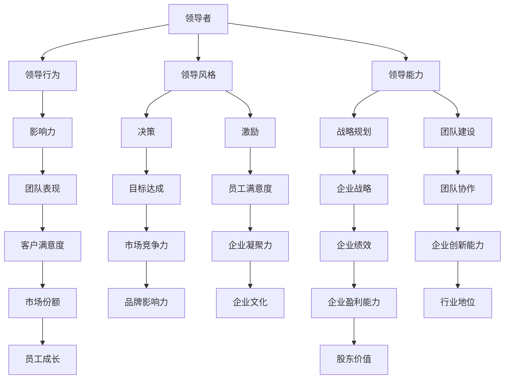
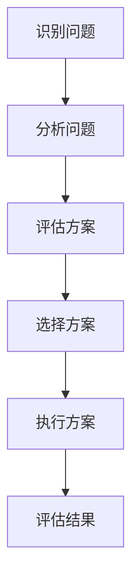
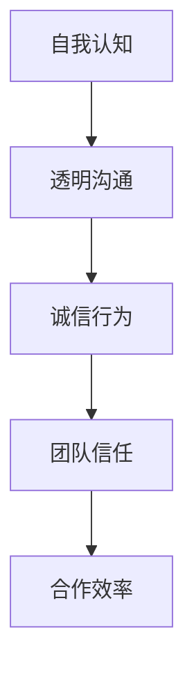
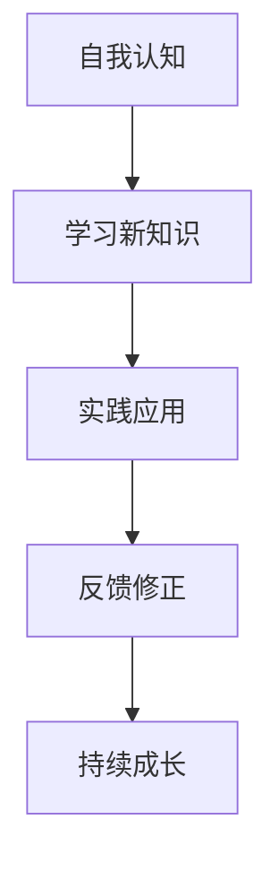
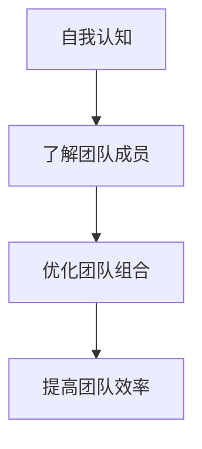
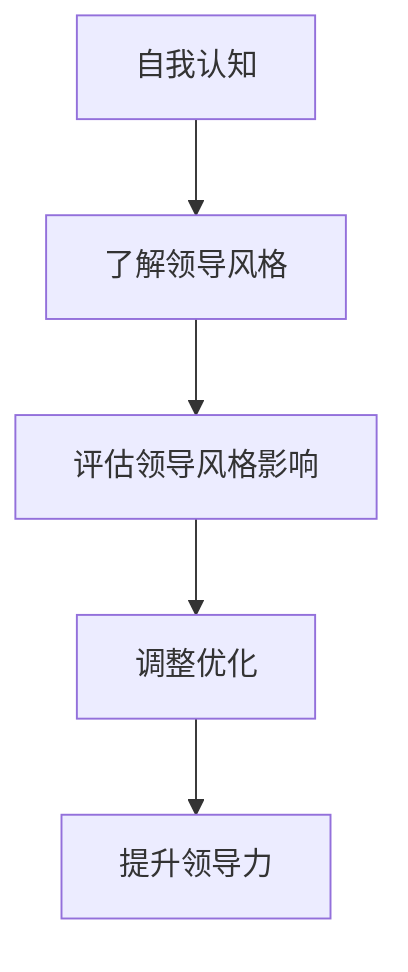

                 


## 引言：销售经理的角色与挑战

销售经理在现代企业中扮演着至关重要的角色，他们是连接市场和公司内部的关键桥梁。销售经理不仅需要具备出色的销售技巧，还要具备卓越的管理能力。从销售经理到管理者的转型，对于个人职业发展和企业成长都具有重要意义。

### 背景介绍

在传统的销售模式中，销售经理的主要任务是达成销售目标，通过个人或团队的努力实现业绩的增长。然而，随着市场环境的变化和企业竞争的加剧，销售经理的角色逐渐发生了转变。现代销售经理不仅要关注销售业绩，还要关注团队管理、市场分析、客户关系管理等全方位的工作。

### 挑战与机遇

从销售经理到管理者的转型过程中，销售经理将面临一系列挑战。首先是角色的转变，从单纯的业绩推动者转变为团队的领导者。其次是管理能力的提升，需要掌握团队管理、员工激励、目标设定等管理技能。此外，销售经理还需要具备良好的沟通协调能力和战略规划能力。

然而，这些挑战也带来了新的机遇。通过提升管理能力和领导力，销售经理可以更好地推动团队业绩的提升，为企业创造更大的价值。同时，成功转型也为销售经理个人的职业发展打开了新的空间，可以更上一层楼。

### 文章核心目标

本文旨在为销售经理提供一份全面的领导力修炼手册，帮助他们顺利实现从销售经理到管理者的转型。通过本文，读者将了解到领导力的重要性、领导力的三个层次、自我认知的方法与工具、团队建设的关键要素、销售团队管理与销售策略执行等关键内容。同时，本文还将通过案例分析、实战技巧等环节，帮助销售经理在实践中提升领导力。

### 关键词

- 销售经理
- 领导力
- 转型
- 团队管理
- 沟通协调
- 战略规划

### 摘要

本文将深入探讨销售经理从销售岗位到管理岗位的转型之路。通过分析领导力的核心概念、领导者的自我认知、团队建设与管理、销售策略与执行等方面的内容，本文旨在为销售经理提供一套系统的领导力修炼方法，帮助他们应对转型过程中的挑战，实现个人与企业的共同成长。

## 第1章：领导力概述

### 1.1 领导力的定义与重要性

领导力是一个广泛而复杂的概念，它涉及领导者的行为、态度、能力和影响力。在销售经理的职业发展中，领导力的重要性尤为突出。首先，领导力是推动团队实现目标的核心动力。一个出色的销售经理，不仅需要具备出色的销售技能，还需要具备卓越的领导力，以激励和引导团队实现业绩目标。

**核心概念与联系**

领导力不仅仅是个人的特质，更是一个组织层面的系统。以下是一个使用Mermaid绘制的领导力概念关系图：



在这个图中，我们可以看到领导力与多个关键因素之间存在紧密的联系。领导者的行为、风格和能力直接影响团队的表现、企业的绩效和员工的满意度，进而影响企业的战略规划、创新能力、品牌影响力、企业文化和行业地位。

### 领导力的三个层次

领导力可以分为三个层次：反应型领导者、学习型领导者和发展型领导者。每个层次都代表着领导者在不同阶段的发展水平。

#### 反应型领导者

反应型领导者主要依赖于个人的经验和直觉。他们在面对问题时，往往能够迅速作出反应，但缺乏系统的思考和长期规划。这种领导风格在快速变化的销售环境中可能具有一定的优势，但在长期发展中，可能无法有效应对复杂的市场环境。

#### 学习型领导者

学习型领导者注重知识和技能的积累，通过不断学习和实践提升自己的领导能力。他们不仅能够快速响应变化，还能够通过分析和总结，找出问题的根本原因，并采取有效的解决方案。这种领导风格在销售经理的转型过程中尤为重要。

#### 发展型领导者

发展型领导者具有前瞻性和战略性，他们不仅能够应对当前的问题，还能够预见未来的趋势，并制定长期的发展规划。他们注重团队建设和人才培养，通过激励和引导，推动团队实现共同的目标。

### 领导力与管理的区别

领导力和管理是两个紧密相关但又有所区别的概念。领导力更注重激励和引导，而管理则更侧重于规划和执行。

- **领导力**：领导力是一种影响力，通过激励、引导和榜样作用，影响团队成员的行为和态度。
- **管理**：管理是一种规划、组织、协调和控制的过程，旨在确保目标的实现。

在实际工作中，销售经理需要将领导力和管理结合起来，既要激励团队，又要确保团队的工作高效有序。

### 本章小结

通过本章的学习，我们了解了领导力的定义、重要性以及三个层次，还分析了领导力与管理的区别。在接下来的章节中，我们将进一步探讨销售经理的转型路径、团队建设与管理、销售策略与执行等方面的内容，帮助销售经理在领导力的修炼之路上走得更远。

## 1.2 自我认知的重要性

领导力的提升首先离不开自我认知。自我认知是指领导者对自己性格、能力、价值观等方面的深入了解。一个优秀的销售经理需要具备良好的自我认知，这不仅能帮助他们更好地理解自己和团队，还能在领导过程中作出更明智的决策。

### 自我认知的重要性

自我认知对于领导力提升的重要性体现在以下几个方面：

1. **明确个人优势与劣势**：通过自我认知，销售经理可以明确自己的优势领域和需要改进的方面，从而在团队管理和决策中更好地发挥自己的长处，规避短板。

2. **提高决策效率**：自我认知使领导者能够从自身角度出发，更准确地评估问题和制定解决方案，减少决策失误。

3. **促进团队协作**：了解团队成员的性格和需求，销售经理可以更好地进行团队搭配和任务分配，提高团队协作效率。

4. **增强自信心**：自我认知有助于销售经理树立自信心，在面对困难和挑战时保持冷静和坚定。

### 领导风格与自我认知的关系

领导风格是领导者处理团队和事务的方式，它受到个人性格、价值观和经历等多方面因素的影响。以下是一些常见的领导风格及其与自我认知的关系：

1. **权威型领导风格**：权威型领导者通常具有较强的自我认知，他们知道自己在团队中的角色和责任，并能够通过严格的纪律和制度来管理团队。

2. **民主型领导风格**：民主型领导者通常具有较高的自我认知和沟通能力，他们能够倾听团队成员的意见，并在决策过程中充分考虑到不同观点。

3. **变革型领导风格**：变革型领导者具有较强的自我认知和创新意识，他们能够预见市场变化，推动团队进行变革和改进。

### 自我认知的方法与工具

要提升自我认知，销售经理可以采用以下几种方法和工具：

1. **心理测试**：通过心理测试（如MBTI、DISC等），销售经理可以了解自己的性格类型和行为倾向，从而更好地理解自己和他人。

2. **反思日志**：定期记录自己的行为和思考，分析成功和失败的原因，有助于销售经理深入反思和自我提升。

3. **360度反馈**：邀请团队成员、上级和下属对销售经理的工作进行评价，从不同角度了解自己的优点和不足。

4. **教练辅导**：通过与专业教练的互动，销售经理可以更深入地了解自己的潜力和发展空间，并获得有效的指导和建议。

### 本章小结

通过本章的学习，我们认识到自我认知对于领导力提升的重要性。销售经理需要通过多种方法和工具，深入挖掘自己的潜力和不足，从而在领导过程中作出更明智的决策，提升团队绩效和自身职业发展。在接下来的章节中，我们将进一步探讨团队建设与管理、销售策略与执行等方面的内容。

## 1.3 团队建设的关键要素

团队建设是销售经理成功转型为管理者的重要环节。一个高效的团队不仅能够提高销售业绩，还能够增强员工的满意度和企业的竞争力。团队建设的关键要素包括团队组建、团队发展和团队管理。

### 团队组建

团队组建是团队建设的第一步。一个高效的团队需要具备以下几个特征：

1. **共同的目标**：团队成员应该明确团队的目标，并认同这个目标。只有当团队成员对目标有共同的理解和认同时，才能协同工作，共同推进团队的发展。

2. **合适的成员**：团队成员应该具备与团队目标相匹配的技能和经验。此外，团队成员之间的性格互补也是团队组建的重要考虑因素。

3. **明确的角色和责任**：每个团队成员都应该清楚自己的角色和责任，避免职责重叠和责任不清的情况。

4. **有效的沟通机制**：建立良好的沟通机制，确保团队成员之间能够顺畅地交流信息，共同解决问题。

### 团队发展

团队发展是指通过不断的学习和改进，提升团队的整体能力和协作效率。以下是一些关键步骤：

1. **培训与发展**：为团队成员提供必要的培训和发展机会，帮助他们提升专业技能和管理能力。

2. **建立反馈机制**：定期收集团队成员的反馈，了解团队在日常工作中的问题和改进点，及时进行调整和优化。

3. **团队文化建设**：通过团队文化建设，塑造团队的价值观和行为规范，增强团队成员的归属感和认同感。

4. **激励与奖励**：制定合理的激励和奖励机制，鼓励团队成员积极参与团队建设，提高团队的整体绩效。

### 团队管理

团队管理是团队建设中的关键环节，它关系到团队的稳定和高效运行。以下是一些团队管理的最佳实践：

1. **目标设定**：与团队成员共同设定清晰、具体的团队目标，并确保每个成员都了解自己的职责和目标。

2. **绩效评估**：建立科学的绩效评估体系，定期对团队成员的工作进行评估，并提供反馈和建议。

3. **沟通与协调**：保持与团队成员的沟通，及时解决问题和冲突，确保团队工作的顺利进行。

4. **激励与支持**：关注团队成员的需求，提供必要的支持和资源，鼓励他们在工作中发挥潜力。

### 案例分析

以一家中型企业的销售团队为例，该团队在组建初期面临成员技能参差不齐、目标不明确、沟通不畅等问题。通过以下措施，该团队逐步实现了高效运营：

1. **明确目标**：团队领导与全体成员共同制定了短期和长期的销售目标，并明确了每个成员的具体职责。

2. **技能培训**：为团队成员提供了一系列销售技能和管理技能的培训，帮助他们提升专业能力。

3. **改善沟通**：引入了定期团队会议和一对一沟通机制，确保信息流畅和及时反馈。

4. **激励措施**：建立了绩效奖金和晋升机制，激励团队成员积极参与团队建设，提高整体绩效。

通过这些措施，该销售团队逐步摆脱了初期的困境，实现了业绩的稳步提升。

### 本章小结

团队建设是销售经理成功转型为管理者的重要一环。通过合理的团队组建、有效的团队发展和科学的团队管理，销售经理可以打造一支高效、团结的团队，实现业绩的持续增长。在接下来的章节中，我们将进一步探讨销售经理在团队管理中的具体实践和策略。

## 1.4 团队管理与团队发展的阶段

团队管理与团队发展是一个动态的过程，分为组建阶段、成长阶段、成熟阶段和衰退阶段。每个阶段都有其独特的特点和挑战，销售经理需要根据不同阶段的特点采取相应的管理策略。

### 组建阶段

组建阶段是团队发展的起点，这一阶段的重点是确定团队目标和组建合适的团队成员。

- **团队目标**：团队领导需要明确团队的目标和愿景，确保所有成员对团队的目标有共同的理解和认同。

- **成员选择**：选择具有互补技能、性格和谐、具备共同价值观的成员。同时，要确保成员了解自己的角色和职责。

- **沟通机制**：建立初步的沟通机制，确保团队成员之间的信息交流顺畅。

### 成长阶段

成长阶段是团队逐渐走向成熟的阶段，这一阶段的关键是提升团队协作能力和解决内部冲突。

- **培训与发展**：为团队成员提供必要的培训和发展机会，帮助他们提升专业技能和管理能力。

- **反馈与改进**：定期收集团队成员的反馈，了解团队在日常工作中的问题和改进点，及时进行调整和优化。

- **激励与支持**：通过激励措施和资源支持，鼓励团队成员积极参与团队建设，提高团队的整体绩效。

### 成熟阶段

成熟阶段是团队运作最稳定、最高效的阶段。这一阶段的重点是保持团队的高效运营和创新能力。

- **目标实现**：确保团队目标得到有效实现，并定期评估团队绩效。

- **持续学习**：鼓励团队成员持续学习和自我提升，保持团队的活力和创新力。

- **文化建设**：通过团队文化建设，增强团队成员的归属感和认同感，塑造积极向上的团队氛围。

### 军衰阶段

衰退阶段是团队发展的转折点，这一阶段可能面临成员流失、士气低落等问题。

- **问题诊断**：对团队面临的挑战进行深入分析，找出导致团队衰退的根本原因。

- **改革与创新**：采取有效的改革措施，引入新的管理方法和技术，激发团队的活力。

- **人才引进与培养**：通过引进新成员和培养内部人才，为团队注入新的活力。

### 案例分析

以一家初创企业的销售团队为例，该团队在组建阶段由于成员不熟悉业务、沟通不畅，导致销售业绩不佳。在成长阶段，通过定期的培训、有效的反馈和激励措施，团队逐渐提升了协作能力和业绩。在成熟阶段，团队保持了稳定的销售业绩，并通过持续学习和文化建设，保持了团队的活力。然而，在衰退阶段，由于市场竞争加剧和内部管理问题，团队业绩下滑，士气低落。通过引入新成员和进行组织改革，团队逐渐恢复了活力，实现了业绩的反弹。

### 本章小结

团队管理与团队发展是一个持续的过程，每个阶段都有其独特的特点和挑战。销售经理需要根据团队的发展阶段采取相应的管理策略，确保团队始终处于高效运转状态。在接下来的章节中，我们将进一步探讨销售经理在团队管理中的具体实践和策略。

## 第2章：领导者的自我认知

领导者的自我认知是领导力提升的关键要素之一。它不仅关乎领导者的个人成长，也直接影响团队的整体表现。自我认知包括对自己的性格、价值观、能力和弱点的了解，这对于领导者制定战略、管理团队以及应对挑战至关重要。

### 自我认知的重要性

自我认知在领导力中的重要性体现在以下几个方面：

1. **明确个人优势**：领导者通过自我认知，可以明确自己的优势，从而在团队中发挥最大的价值。这有助于提升团队的整体效能。

2. **提升决策质量**：自我认知使领导者能够从多个角度审视问题，避免片面决策，提高决策的准确性和有效性。

3. **增强团队信任**：领导者通过自我认知，展现真诚和透明，增强团队成员对领导者的信任和尊重。

4. **促进个人成长**：自我认知激发领导者不断学习和提升，以适应不断变化的市场环境。

### 领导风格与自我认知的关系

领导风格是领导者处理团队和事务的方式，它受到个人性格、价值观和经历等多方面因素的影响。以下是一些常见的领导风格及其与自我认知的关系：

1. **权威型领导风格**：权威型领导者通常具有较强的自我认知，他们知道自己在团队中的角色和责任，并能够通过严格的纪律和制度来管理团队。然而，如果过度依赖权威，可能会导致团队缺乏创新和自主性。

2. **民主型领导风格**：民主型领导者通常具有较高的自我认知和沟通能力，他们能够倾听团队成员的意见，并在决策过程中充分考虑到不同观点。这种风格有利于团队凝聚力和创新力的提升。

3. **变革型领导风格**：变革型领导者具有较强的自我认知和创新意识，他们能够预见市场变化，推动团队进行变革和改进。这种风格有助于激发团队的活力和创造力。

### 自我认知的方法与工具

要提升自我认知，领导者可以采用以下几种方法和工具：

1. **心理测试**：通过心理测试（如MBTI、DISC等），领导者可以了解自己的性格类型和行为倾向，从而更好地理解自己和他人。

2. **反思日志**：定期记录自己的行为和思考，分析成功和失败的原因，有助于领导者深入反思和自我提升。

3. **360度反馈**：邀请团队成员、上级和下属对领导者的工作进行评价，从不同角度了解自己的优点和不足。

4. **教练辅导**：通过与专业教练的互动，领导者可以更深入地了解自己的潜力和发展空间，并获得有效的指导和建议。

### 案例分析

以某互联网公司的产品经理为例，他在自我认知的过程中，通过MBTI测试了解到自己是“INTJ”性格类型，具有强烈的逻辑思维和创新意识。他意识到，自己的优点在于能够迅速把握市场趋势和用户需求，提出创新的解决方案。然而，他也发现自己的弱点在于对人际关系的处理不够细腻，容易在团队内部引起矛盾。通过定期反思日志和360度反馈，他逐步改进了自己的领导风格，学会了更加关注团队成员的感受和需求，从而提高了团队的协作效率和业绩。

### 本章小结

通过本章的学习，我们认识到自我认知对于领导者的重要性，以及领导风格与自我认知之间的密切关系。领导者需要通过多种方法和工具，不断提升自我认知，从而在团队管理中作出更明智的决策，提升团队绩效和个人职业发展。在接下来的章节中，我们将进一步探讨团队建设与管理、销售策略与执行等方面的内容。

## 2.1 自我认知的重要性

在领导力的发展过程中，自我认知起着至关重要的作用。它不仅帮助领导者更好地理解自己，还能提升决策质量、增强团队信任和个人成长。

### 自我认知提升决策质量

自我认知可以帮助领导者更全面地审视问题，从而作出更为明智的决策。以下是一个简化的决策流程：



**伪代码示例：**

```python
def make_decision(issue, alternatives, criteria):
    # 分析问题
    analyzed_issue = analyze_issue(issue)
    # 评估方案
    evaluated_alternatives = evaluate_alternatives(alternatives, criteria)
    # 选择最佳方案
    selected_alternative = select_best_alternative(evaluated_alternatives)
    # 执行方案
    execute_plan(selected_alternative)
    # 评估结果
    result = evaluate_result(selected_alternative)
    return result
```

### 自我认知增强团队信任

自我认知使领导者能够展现真诚和透明，从而赢得团队成员的信任和尊重。以下是一个简化的团队信任建立模型：



**伪代码示例：**

```python
def build_trust(self_awareness, transparent_communication, honest_actions):
    trust_level = 0
    if self_awareness and transparent_communication and honest_actions:
        trust_level = 100
    else:
        trust_level = calculate_trust_level(self_awareness, transparent_communication, honest_actions)
    return trust_level
```

### 自我认知促进个人成长

自我认知促使领导者不断学习和提升，以适应快速变化的市场环境。以下是一个简化的个人成长模型：



**伪代码示例：**

```python
def personal_growth(self_awareness, learning_new_knowledge, practical_application, feedback_correction):
    growth_level = 0
    if self_awareness and learning_new_knowledge and practical_application and feedback_correction:
        growth_level = max_growth_level
    else:
        growth_level = calculate_growth_level(self_awareness, learning_new_knowledge, practical_application, feedback_correction)
    return growth_level
```

### 自我认知提升团队协作

自我认知不仅有助于提升个人领导力，还能促进团队协作。以下是一个简化的团队协作模型：



**伪代码示例：**

```python
def improve_team_collaboration(self_awareness, team_members):
    team_combination = optimize_team_combination(team_members, self_awareness)
    efficiency = calculate_team_efficiency(team_combination)
    return efficiency
```

### 本章小结

通过本章的探讨，我们认识到自我认知在领导力发展中的重要性。领导者需要通过自我认知提升决策质量、增强团队信任、促进个人成长和提升团队协作。在实际应用中，领导者可以结合上述模型和伪代码示例，逐步提升自我认知，从而实现更高效的团队管理和领导力提升。

## 2.2 领导风格与自我认知的关系

领导风格是领导者处理团队和事务的方式，它直接影响团队的表现和领导者的个人成长。不同的领导风格与自我认知有着紧密的关系，通过自我认知，领导者可以更好地理解自己的风格，并在实践中不断调整和优化。

### 自我认知与领导风格

自我认知是指领导者对自己性格、价值观、能力和弱点的深入了解。一个具有良好自我认知的领导者，能够更准确地识别自己的领导风格，并了解这种风格对团队的影响。以下是一些常见的领导风格与自我认知的关系：

1. **权威型领导风格**：权威型领导者通常具有较强的自我认知，他们知道自己在团队中的角色和责任，并能够通过严格的纪律和制度来管理团队。然而，如果过度依赖权威，可能会导致团队缺乏创新和自主性。

    ```mermaid
    graph TD
        A[权威型领导风格] --> B[自我认知]
        B --> C[明确角色与责任]
        C --> D[严格纪律与制度]
        D --> E[团队依赖性]
    ```

2. **民主型领导风格**：民主型领导者通常具有较高的自我认知和沟通能力，他们能够倾听团队成员的意见，并在决策过程中充分考虑到不同观点。这种风格有利于团队凝聚力和创新力的提升。

    ```mermaid
    graph TD
        A[民主型领导风格] --> B[自我认知]
        B --> C[倾听团队成员意见]
        C --> D[考虑不同观点]
        D --> E[团队凝聚力与创新能力]
    ```

3. **变革型领导风格**：变革型领导者具有较强的自我认知和创新意识，他们能够预见市场变化，推动团队进行变革和改进。这种风格有助于激发团队的活力和创造力。

    ```mermaid
    graph TD
        A[变革型领导风格] --> B[自我认知]
        B --> C[预见市场变化]
        C --> D[推动变革与改进]
        D --> E[团队活力与创造力]
    ```

### 自我认知与领导风格的影响

通过自我认知，领导者可以更好地理解自己的领导风格，并在实践中不断调整和优化。以下是一个简化的自我认知与领导风格影响模型：



**伪代码示例：**

```python
def leadership_style_adjustment(self_awareness, current_style, team_performance):
    assessed_impact = assess_style_impact(current_style, team_performance)
    if assessed_impact < optimal_impact:
        suggested_changes = suggest_style_adjustments(self_awareness, current_style)
        updated_style = apply_changes(current_style, suggested_changes)
    else:
        updated_style = current_style
    return updated_style
```

### 案例分析

以一位销售经理为例，他通过自我认知了解到自己更倾向于权威型领导风格，这使他的团队在短期内取得了显著的销售业绩。然而，随着市场竞争的加剧，他意识到团队需要更多的创新和自主性。通过反思和360度反馈，他决定调整自己的领导风格，更多地采用民主型和变革型领导风格。在调整过程中，他不断收集团队成员的反馈，并根据反馈结果进行优化。最终，他的团队在创新能力和协作效率方面都有了显著提升。

### 本章小结

通过本章的探讨，我们认识到自我认知在领导风格调整和优化中的重要性。领导者需要通过自我认知，了解自己的领导风格，并在实践中不断调整和优化，以提升团队绩效和领导力。在实际应用中，领导者可以结合上述模型和伪代码示例，逐步提升自我认知，实现更高效的团队管理和领导力提升。

## 2.3 自我认知的方法与工具

要提升自我认知，领导者可以采用多种方法和工具，这些工具不仅能帮助领导者更好地了解自己，还能促进自我反思和持续成长。以下是几种常见的方法和工具：

### 1. 心理测试

心理测试是了解自己性格和特质的有效工具。常见的心理测试包括：

- **MBTI（Myers-Briggs Type Indicator）**：通过了解个体的性格类型，帮助领导者理解自己和他人的行为模式。
- **DISC（Diplomatic, Inspiring, Stable, Cautious）**：评估个体的行为风格，帮助领导者识别团队成员的个性特征。

**案例分析**：

某销售经理通过MBTI测试发现自己是“INTJ”性格类型，这使他对自己的逻辑思维和创新意识有了更深的理解。在团队管理中，他能够更好地发挥自己的优势，并在必要时寻求其他成员的帮助，以弥补自己的不足。

### 2. 反思日志

反思日志是领导者自我反思和成长的重要工具。通过记录每天的经历、思考和行为，领导者可以更好地了解自己的情绪变化和行为模式。

**步骤**：

- 每天结束时，记录当天的重要事件和感受。
- 每周进行一次深度反思，分析成功和失败的原因。
- 每月总结反思，制定改进计划。

**案例分析**：

一位销售经理通过定期记录反思日志，发现了自己在决策过程中过于依赖直觉的问题。通过反思和调整，他开始更加重视数据分析和团队意见，从而提高了决策质量。

### 3. 360度反馈

360度反馈是一种全面的评价方法，通过邀请团队成员、上级和下属对领导者的工作表现进行评价，提供多角度的反馈。

**优点**：

- 帮助领导者了解自己在团队中的表现和影响。
- 提供具体的改进建议。

**案例分析**：

一位销售经理通过360度反馈，了解到了团队成员对他沟通方式的反馈。他意识到自己有时过于直接，容易引起误会。通过调整沟通方式，他提高了团队的协作效率。

### 4. 教练辅导

专业教练可以提供个性化的指导和反馈，帮助领导者提升自我认知和领导力。

**优势**：

- 提供专业的视角和经验。
- 定制化的培训计划。

**案例分析**：

一位销售经理通过教练辅导，发现了自己在团队管理中的盲点。教练帮助他制定了一个改进计划，包括提升沟通能力和建立更有效的反馈机制。经过一段时间的实践，他的团队表现显著提升。

### 本章小结

通过以上方法和工具，领导者可以系统地提升自我认知，从而在团队管理和个人成长中取得更好的成果。在实际应用中，领导者应根据个人情况选择合适的工具，并结合实践进行持续的自我提升。通过不断学习和反思，领导者能够更好地应对挑战，提升团队绩效和个人职业发展。

## 第3章：团队建设与管理

团队建设是销售经理成功转型为管理者的重要任务之一。一个高效的团队不仅能够提升销售业绩，还能增强员工的满意度和企业的竞争力。本章将探讨团队建设与管理的关键要素，包括团队目标设定、角色分配、沟通与协作、团队激励和绩效管理。

### 3.1 团队目标设定

团队目标设定是团队建设的第一步，它为团队提供了明确的方向和动力。一个有效的团队目标应具备以下特点：

1. **明确性**：目标应具体、可测量，确保团队成员能够清晰地了解目标的内容和标准。

2. **挑战性**：目标应具有一定的挑战性，激发团队成员的潜力和积极性。

3. **可达成性**：目标应在现实情况下可实现，避免设定过高的目标导致团队失去信心。

4. **相关性**：目标应与团队的整体战略和企业目标保持一致。

**示例**：假设一个销售团队的目标是“在未来三个月内，将销售额提高20%”。这是一个明确、具有挑战性且与团队整体战略相关的目标。

### 3.2 角色分配

角色分配是确保团队高效运作的基础。每个团队成员都应清楚自己的角色和责任，避免职责重叠和责任不清的情况。

**步骤**：

1. **识别角色需求**：根据团队目标和工作内容，明确每个角色所需的核心能力和技能。

2. **分配角色**：将合适的成员分配到相应的角色，确保角色之间的互补性和协同性。

3. **明确责任**：为每个角色设定明确的职责和目标，确保团队成员对自身的责任有清晰的认识。

**案例分析**：在一个销售团队中，销售经理可能需要识别以下角色：

- **销售代表**：负责直接与客户沟通，完成销售任务。
- **市场分析师**：负责市场调研和数据分析，为销售策略提供支持。
- **客户支持**：负责处理客户的售后服务和投诉。

通过明确每个角色的责任，团队成员可以更加专注于自己的工作，提高团队的整体效率。

### 3.3 沟通与协作

沟通与协作是团队成功的关键。一个高效的团队需要建立良好的沟通机制，确保信息流畅和及时反馈。

**方法**：

1. **定期会议**：通过定期会议，团队可以分享进展、讨论问题、制定解决方案。

2. **即时沟通工具**：使用即时通讯工具（如Slack、Telegram等）确保团队成员能够快速沟通和协作。

3. **反馈机制**：建立反馈机制，鼓励团队成员提出意见和建议，促进团队创新和改进。

**案例分析**：在一个跨部门的团队中，销售经理可以每周召开一次团队会议，讨论销售策略和市场动态。同时，通过即时沟通工具，团队成员可以随时交流，确保信息的及时传递和问题的快速解决。

### 3.4 团队激励

团队激励是提高团队士气和工作动力的重要手段。有效的激励机制可以激发团队成员的积极性，提高团队的整体绩效。

**方法**：

1. **物质激励**：通过奖金、提成、晋升等物质激励，奖励表现出色的团队成员。

2. **精神激励**：通过认可、表扬、团队建设活动等精神激励，提升团队成员的归属感和成就感。

3. **个性化激励**：根据团队成员的个人需求和兴趣，制定个性化的激励计划。

**案例分析**：一个销售团队可以通过定期的绩效评估和奖金发放，激励团队成员追求卓越。同时，销售经理可以组织团队活动，增强团队凝聚力，提升团队成员的士气。

### 3.5 绩效管理

绩效管理是确保团队目标实现的重要环节。通过科学的绩效管理，销售经理可以及时了解团队和个人的表现，并提供改进建议。

**步骤**：

1. **设定绩效目标**：与团队成员共同设定明确的绩效目标，确保目标与团队目标一致。

2. **监控绩效进展**：定期跟踪团队成员的绩效进展，及时发现问题和瓶颈。

3. **提供反馈和指导**：对团队成员的表现进行评估，提供具体、及时的反馈和指导。

4. **绩效改进**：根据反馈结果，制定改进计划，帮助团队成员提升绩效。

**案例分析**：销售经理可以每月进行一次绩效评估会议，与团队成员讨论绩效目标达成情况，并根据评估结果提供针对性的指导和支持。通过持续的绩效管理，团队可以不断提升业绩，实现长期发展目标。

### 本章小结

团队建设与管理是销售经理成功转型为管理者的重要任务。通过设定明确的团队目标、合理分配角色、建立良好的沟通机制、实施有效的激励机制和科学的绩效管理，销售经理可以打造一支高效、团结的团队，实现销售目标和企业的发展。在接下来的章节中，我们将进一步探讨销售经理在战略规划与执行方面的关键技能。

## 3.2 销售团队管理

销售团队管理是销售经理在从销售经理到管理者转型过程中不可或缺的一部分。有效的销售团队管理不仅能提高团队的整体绩效，还能增强团队的凝聚力和市场竞争力。以下是销售团队管理的几个关键方面。

### 3.2.1 团队组建

团队组建是销售团队管理的第一步。一个高效的销售团队需要具备以下特征：

1. **成员技能匹配**：确保团队成员的技能和经验与团队目标和职责相匹配。例如，销售经理应招聘有销售经验、市场分析能力和客户管理技能的成员。

2. **角色明确**：为每个团队成员分配明确的角色和职责，确保每个成员都知道自己的任务和期望。

3. **团队文化**：建立积极的团队文化，鼓励合作、创新和相互支持。这有助于提升团队的整体士气和绩效。

### 3.2.2 销售目标设定

设定明确的销售目标是销售团队管理的重要环节。以下是一些设定销售目标的最佳实践：

1. **具体可衡量**：目标应具体、可衡量，如“在接下来的三个月内，将销售额提高15%”。

2. **挑战性**：目标应具有一定的挑战性，激励团队成员发挥潜力，但也要确保目标在现实条件下可实现。

3. **与团队和个人目标一致**：确保销售目标与团队整体战略和个人发展目标相一致。

4. **定期回顾和调整**：定期回顾销售目标，根据市场变化和团队表现进行调整，以确保目标的实现。

### 3.2.3 绩效评估

绩效评估是衡量销售团队和个体表现的重要手段。以下是一些关键绩效指标（KPI）和评估方法：

1. **销售额**：销售额是最直接的绩效指标，反映团队的总体业绩。

2. **客户满意度**：通过调查客户满意度，了解销售团队的服务质量和市场竞争力。

3. **销售周期**：销售周期从首次接触客户到完成销售的时间，反映团队的效率。

4. **新客户开发率**：衡量团队在新客户开发方面的表现，影响企业的长期增长。

**评估方法**：

- **定量评估**：通过数据和分析工具对销售额、客户满意度等指标进行定量评估。
- **定性评估**：通过观察、面谈和反馈等方式对团队成员的表现进行定性评估。

### 3.2.4 激励与支持

激励与支持是提升销售团队绩效的关键。以下是一些有效的激励和支持方法：

1. **物质激励**：通过奖金、提成、福利等物质激励，奖励表现优秀的团队成员。

2. **精神激励**：通过表扬、认可和团队建设活动等精神激励，提升团队成员的士气和工作动力。

3. **个性化支持**：根据团队成员的个人需求和职业发展目标，提供个性化的支持和指导。

### 3.2.5 沟通与协作

沟通与协作是销售团队高效运作的基础。以下是一些关键沟通与协作的最佳实践：

1. **定期会议**：定期召开团队会议，分享销售策略、讨论市场动态和客户反馈。

2. **即时沟通**：使用即时通讯工具（如Slack、Microsoft Teams等）确保团队成员之间的沟通畅通。

3. **信息共享**：建立信息共享平台，确保团队成员能够及时获取重要信息和资源。

4. **反馈机制**：建立反馈机制，鼓励团队成员提出建议和意见，促进团队创新和改进。

### 3.2.6 应对挑战

销售团队管理过程中，销售经理可能会遇到各种挑战，如市场变化、竞争压力、团队士气低落等。以下是一些应对策略：

1. **市场分析**：定期进行市场分析，了解市场趋势和竞争对手动态，制定应对策略。

2. **培训与发展**：为团队成员提供必要的培训和职业发展机会，提升团队的整体素质。

3. **激励与支持**：通过激励和及时的支持，帮助团队成员克服困难，提升士气。

4. **团队建设**：通过团队建设活动，增强团队凝聚力和协作精神。

### 案例分析

以一家高科技企业的销售团队为例，该团队在组建初期由于成员技能不匹配和沟通不畅，导致销售业绩不佳。销售经理通过以下措施进行了改进：

1. **重新分配角色**：根据团队成员的技能和兴趣，重新分配角色，确保每个成员都能发挥最大的价值。

2. **设定明确目标**：与团队成员共同设定具体、可衡量的销售目标，并定期进行绩效评估。

3. **培训与发展**：组织销售技能培训和管理技能培训，提升团队的整体能力。

4. **改善沟通机制**：建立定期会议和即时沟通工具，确保团队成员之间的信息传递畅通。

通过这些措施，该销售团队的业绩逐渐提升，团队凝聚力也得到了显著增强。

### 本章小结

通过本章的探讨，我们了解了销售团队管理的关键要素，包括团队组建、销售目标设定、绩效评估、激励与支持、沟通与协作以及应对挑战的策略。在实际工作中，销售经理需要根据团队的具体情况，灵活运用这些方法，提升团队绩效，实现个人和企业的共同成长。

## 3.3 销售策略与执行

销售策略与执行是销售团队实现目标的关键。一个有效的销售策略不仅能够帮助团队在市场中占据有利位置，还能提升客户满意度和市场份额。以下是构建和执行销售策略的步骤。

### 3.3.1 市场分析

市场分析是制定销售策略的基础。通过分析市场趋势、竞争对手、客户需求和潜在机会，销售经理可以制定更具针对性的销售策略。

**步骤**：

1. **市场趋势分析**：了解行业的发展趋势、技术进步和消费者行为变化，为销售策略提供方向。

2. **竞争对手分析**：研究竞争对手的市场策略、产品特点、优势和劣势，找出差距和机会。

3. **客户需求分析**：通过调查问卷、访谈等方式了解客户的需求和痛点，为产品定位和销售策略提供依据。

**伪代码示例**：

```python
def market_analysis(trends, competitors, customers):
    market_trends = analyze_trends(trends)
    competitor_strategies = analyze_competitors(competitors)
    customer_needs = analyze_customers(customers)
    strategy_inputs = {
        'market_trends': market_trends,
        'competitor_strategies': competitor_strategies,
        'customer_needs': customer_needs
    }
    return strategy_inputs
```

### 3.3.2 产品定位

产品定位是销售策略的核心。通过明确产品的特点和优势，销售经理可以更好地吸引目标客户，提高市场竞争力。

**步骤**：

1. **识别产品特点**：分析产品的功能、技术特点和独特卖点。

2. **确定目标客户**：根据市场分析结果，明确目标客户群体。

3. **制定定位策略**：根据产品特点和目标客户，制定具有竞争力的定位策略。

**伪代码示例**：

```python
def product_positioning(product_features, target_customers):
    unique_selling_points = identify_unique_selling_points(product_features)
    customer_segment = determine_target_customer_segment(target_customers)
    positioning_strategy = create_positioning_strategy(unique_selling_points, customer_segment)
    return positioning_strategy
```

### 3.3.3 销售渠道选择

选择合适的销售渠道是销售策略成功的关键。销售经理应根据产品特点、目标市场和资源状况，选择最有效的销售渠道。

**步骤**：

1. **评估销售渠道**：分析不同销售渠道的优点和局限性，如直销、分销、电商等。

2. **选择最佳渠道**：根据市场分析结果和产品定位，选择最合适的销售渠道。

3. **渠道整合**：整合不同渠道的资源，实现渠道协同，提高销售效率。

**伪代码示例**：

```python
def select_sales_channel(assess_channels, product定位策略):
    best_channel = evaluate_channels(assess_channels, product_positioning)
    integrated_channel_strategy = integrate_channels(best_channel)
    return integrated_channel_strategy
```

### 3.3.4 销售策略制定

销售策略制定是销售策略与执行的核心环节。销售经理应根据市场分析结果、产品定位和销售渠道选择，制定具体的销售策略。

**步骤**：

1. **制定销售目标**：根据市场分析和产品定位，设定明确的销售目标。

2. **制定销售策略**：确定销售方法、销售目标和销售任务的实施计划。

3. **销售策略优化**：根据市场反馈和执行情况，不断调整和优化销售策略。

**伪代码示例**：

```python
def create_sales_strategy(sales_objectives, product_positioning, sales_channel):
    sales_methods = define_sales_methods(sales_objectives)
    execution_plan = create_execution_plan(sales_methods)
    optimized_strategy = optimize_sales_strategy(execution_plan)
    return optimized_strategy
```

### 3.3.5 销售执行与跟进

销售执行与跟进是确保销售策略有效实施的关键。销售经理需要制定详细的执行计划，并对销售过程进行持续监控和调整。

**步骤**：

1. **执行计划**：制定详细的销售执行计划，明确销售任务、时间表和责任人。

2. **销售跟进**：通过电话、邮件、会议等方式，持续跟进销售进展，解决客户问题。

3. **销售分析**：定期分析销售数据，评估销售策略的有效性，提供改进建议。

**伪代码示例**：

```python
def sales_execution_and_follow_up(execution_plan, customer_interactions):
    sales_progress = monitor_sales_progress(execution_plan)
    customer_issues = handle_customer_issues(customer_interactions)
    sales_analysis = analyze_sales_data(sales_progress, customer_issues)
    return sales_analysis
```

### 案例分析

以一家智能家居设备公司为例，该公司在制定销售策略时，首先进行了市场分析，了解到智能家居市场正处于快速增长期，年轻消费者对智能家居产品的需求日益增加。基于这些信息，公司明确了产品定位为“智能、便捷、时尚的智能家居设备”，并选择了线上和线下相结合的销售渠道。

在制定销售策略时，公司设定了明确的销售目标，如“在接下来六个月内，将销售额提高30%”。销售经理制定了详细的执行计划，包括市场推广、产品展示、客户跟进等具体措施。在执行过程中，销售经理通过定期分析销售数据，不断调整和优化销售策略，最终实现了销售目标的超额完成。

### 本章小结

通过本章的探讨，我们了解了销售策略与执行的关键步骤和最佳实践。销售经理需要根据市场分析结果、产品定位和销售渠道选择，制定具体的销售策略，并通过有效的执行和跟进，实现销售目标。在实际工作中，销售经理应根据实际情况灵活调整策略，不断提升团队绩效和市场竞争力。

## 第4章：销售经理的角色转变

从销售经理到管理者的转型，是许多销售专业人士的职业发展目标。这种转型不仅仅是职位名称的改变，更是角色、职责和工作方式的全面升级。销售经理需要从单一的业绩驱动者转变为全面的团队领导者，才能在新的职位上取得成功。

### 4.1 销售经理的职责

销售经理的职责主要包括以下几个方面：

1. **销售策略制定**：销售经理需要制定具体的销售策略，包括市场定位、目标设定、销售渠道选择等，以确保团队的销售活动有序进行。

2. **团队管理**：销售经理需要管理销售团队，包括招聘、培训、绩效评估和激励等，确保团队成员能够在最佳状态下工作。

3. **业绩监控**：销售经理需要监控团队的销售业绩，确保销售目标得到实现，并及时调整销售策略。

4. **客户关系维护**：销售经理需要与重要客户保持良好的关系，解决客户问题，提升客户满意度。

### 4.2 从销售到管理的过渡

从销售到管理的过渡是一个复杂的过程，涉及技能、心态和角色的转变。以下是一些关键的过渡步骤：

1. **技能提升**：销售经理需要提升管理技能，包括团队沟通、冲突解决、目标设定和激励等。可以通过参加管理培训、阅读管理书籍和向经验丰富的管理者请教来提升这些技能。

2. **角色转变**：销售经理需要从单纯的业绩驱动者转变为团队领导者。这意味着他们需要更多地关注团队的整体表现和成员的个人发展。

3. **心态调整**：从销售到管理，销售经理需要从以自我为中心转变为以团队为中心。他们需要学会倾听、支持和激励团队成员，而不是单打独斗。

### 4.3 销售经理的能力提升

要成功地从销售经理转型为管理者，销售经理需要提升以下几个方面的能力：

1. **战略规划能力**：销售经理需要具备战略规划能力，能够制定长期和短期的销售计划，确保团队的长期发展。

2. **领导力**：领导力是管理者的核心能力。销售经理需要通过建立信任、激励团队成员和培养领导潜力，提升团队的凝聚力和执行力。

3. **沟通能力**：有效的沟通是管理者的重要技能。销售经理需要能够清晰地表达自己的想法，同时也能够倾听和理解团队成员的意见和需求。

4. **决策能力**：销售经理需要具备快速决策的能力，能够在面对复杂问题和不确定性时，做出明智的决策。

### 4.4 成功案例与经验分享

以下是一个成功案例，分享一位销售经理转型为管理者的经验：

**案例**：李明是一位有着丰富销售经验的销售经理。在转型过程中，他采取了以下措施：

1. **参加管理培训**：李明参加了公司提供的管理培训，学习了团队管理、领导力和战略规划等关键技能。

2. **建立沟通机制**：他建立了定期的团队会议和一对一沟通机制，确保团队成员的意见和需求能够得到及时反馈和解决。

3. **培养团队成员**：李明注重团队成员的个人发展，为他们提供培训机会和职业规划指导，鼓励他们不断提升。

4. **制定明确目标**：他制定了一系列明确、具体的销售目标，并确保团队成员都清楚自己的职责和目标。

通过这些措施，李明成功地转型为管理者，并在新的职位上取得了显著的成绩。

### 本章小结

从销售经理到管理者的转型，不仅需要技能的提升，还需要心态和角色的调整。销售经理需要通过不断的努力和学习，提升自己的管理能力，才能在新的职位上取得成功。在接下来的章节中，我们将进一步探讨沟通与协调、领导力提升和战略规划等方面的内容，帮助销售经理在转型过程中走得更远。

## 4.1 沟通与协调

在从销售经理到管理者的转型过程中，沟通与协调能力是至关重要的。有效的沟通不仅能够确保信息的准确传递，还能提升团队的协作效率和士气。以下是一些关键的沟通与协调策略：

### 4.1.1 有效沟通的要素

1. **明确目标**：在沟通前，明确沟通的目标和期望结果，确保双方对沟通的目的有共同的理解。

2. **倾听**：倾听是有效沟通的关键。通过倾听，销售经理能够了解团队成员的需求和意见，更好地理解问题的本质。

3. **清晰表达**：销售经理需要用简洁、明确的语言表达自己的观点和意见，避免产生误解和歧义。

4. **反馈**：在沟通过程中，及时给予反馈，确保信息被正确理解和接受。

### 4.1.2 内部沟通与外部沟通

1. **内部沟通**：内部沟通主要指团队内部的沟通，如团队会议、一对一沟通、邮件等。有效的内部沟通可以确保团队目标一致、协作顺畅。

2. **外部沟通**：外部沟通主要指与客户、合作伙伴、供应商等外部利益相关者的沟通。良好的外部沟通有助于建立良好的客户关系和合作伙伴关系。

### 4.1.3 协调与冲突管理

1. **协调**：协调是指通过合理安排资源和任务，确保团队工作顺利进行。有效的协调可以减少资源浪费和工作重复，提升团队效率。

2. **冲突管理**：冲突是团队工作中不可避免的现象。销售经理需要掌握冲突管理的技巧，通过沟通、协商和调解，解决团队内部的冲突，维护团队的稳定和和谐。

### 案例分析

以下是一个关于沟通与协调的案例分析：

**背景**：某销售团队在项目执行过程中，由于内部沟通不畅，导致项目进度延误。团队成员之间存在意见分歧，工作氛围紧张。

**措施**：

1. **定期会议**：销售经理组织了定期的团队会议，确保每个成员都能及时了解项目进展和任务分配。

2. **一对一沟通**：销售经理与每个团队成员进行了一对一沟通，了解他们的工作进展和困难，并提供针对性的支持。

3. **设立反馈机制**：销售经理建立了反馈机制，鼓励团队成员提出问题和建议，及时解决问题。

4. **调解冲突**：当团队成员之间出现冲突时，销售经理通过沟通和调解，找到了解决问题的方法，维护了团队的稳定和和谐。

**结果**：通过有效的沟通与协调，团队项目最终按时完成，团队成员之间的关系也得到了改善。

### 本章小结

沟通与协调是销售经理在从销售经理到管理者转型过程中必须掌握的关键技能。通过有效的沟通，销售经理可以确保团队目标一致、工作高效；通过协调与冲突管理，可以维护团队的稳定和和谐。在实际工作中，销售经理应根据团队的具体情况，灵活运用这些策略，提升团队绩效和整体效能。

## 4.2 领导力提升

领导力是销售经理在转型过程中不可或缺的核心能力。提升领导力不仅有助于销售经理更好地管理团队，还能增强团队凝聚力和市场竞争力。以下是一些关键策略和方法，帮助销售经理提升领导力。

### 4.2.1 领导力的发展路径

1. **基础阶段**：在这个阶段，销售经理需要掌握基本的管理知识和技能，包括团队管理、目标设定和绩效评估等。这一阶段的关键是通过学习和实践，建立管理基础。

2. **进阶阶段**：在基础阶段的基础上，销售经理需要提升战略规划能力、决策能力和领导风格。这一阶段的关键是通过深度学习和案例分析，提升领导能力。

3. **成熟阶段**：在这个阶段，销售经理需要成为具有高度战略思维和领导魅力的领导者。这一阶段的关键是通过不断反思和自我提升，实现领导力的全面成熟。

### 4.2.2 领导者的领导艺术

1. **愿景领导**：领导者需要具备清晰的战略愿景，能够激发团队成员的创造力和执行力。通过愿景领导，领导者可以引导团队朝着共同的目标前进。

2. **文化领导**：领导者需要塑造积极向上的团队文化，鼓励创新、合作和成长。通过文化领导，领导者可以培养团队的凝聚力和归属感。

3. **变革领导**：在快速变化的市场环境中，领导者需要具备变革领导能力，能够推动团队进行创新和变革。通过变革领导，领导者可以确保团队在竞争激烈的市场中保持领先地位。

### 4.2.3 领导力的持续修炼

1. **自我反思**：领导者需要定期进行自我反思，分析成功和失败的原因，寻找改进的机会。通过自我反思，领导者可以不断提升自己的领导能力。

2. **持续学习**：领导者需要保持学习的热情，不断更新知识和技能，适应市场的变化。通过持续学习，领导者可以保持自己的竞争优势。

3. **建立反馈机制**：领导者需要建立有效的反馈机制，通过定期的绩效评估和团队反馈，了解自己的领导表现和改进方向。通过建立反馈机制，领导者可以更好地提升领导能力。

### 案例分析

以下是一个关于领导力提升的案例分析：

**背景**：某销售团队的领导力水平相对较低，团队缺乏凝聚力，销售业绩不理想。

**措施**：

1. **领导力培训**：销售经理参加了公司提供的领导力培训，学习了愿景领导、文化领导和变革领导等关键技能。

2. **建立反馈机制**：销售经理建立了定期的绩效评估和团队反馈机制，通过反馈了解团队的期望和建议，不断改进自己的领导方式。

3. **文化塑造**：销售经理通过团队活动和文化建设，塑造了积极向上的团队文化，增强了团队的凝聚力和归属感。

4. **持续学习**：销售经理通过阅读领导力书籍、参加行业会议等方式，不断更新知识和技能，提升自己的领导能力。

**结果**：通过这些措施，销售团队的领导力水平显著提升，团队凝聚力增强，销售业绩逐渐改善。

### 本章小结

领导力提升是销售经理在转型过程中至关重要的一环。通过明确领导力的发展路径、掌握领导艺术和持续修炼，销售经理可以不断提升自己的领导能力，打造高效、团结的团队。在实际工作中，销售经理应根据团队的具体情况，灵活运用这些策略，实现个人与团队的共同成长。

## 4.3 战略规划与执行

战略规划是销售经理成功转型为管理者的重要能力之一。有效的战略规划能够帮助销售经理明确团队目标，制定合理的行动计划，并在执行过程中进行有效的监控和调整。以下是战略规划与执行的关键步骤和方法。

### 4.3.1 战略规划的重要性

战略规划是指为了实现企业的长期目标和愿景，制定的一系列具体目标和行动计划。对于销售经理来说，战略规划具有以下几个重要意义：

1. **明确方向**：战略规划能够为销售团队提供明确的发展方向和目标，帮助团队成员理解企业的愿景和使命，从而更好地为实现共同目标而努力。

2. **资源优化**：通过战略规划，销售经理可以合理配置资源，包括人力、物力和财力，确保团队能够高效地完成销售任务。

3. **提高竞争力**：战略规划有助于销售团队在激烈的市场竞争中找到自己的优势，制定针对性的市场策略，从而提高市场占有率和客户满意度。

### 4.3.2 战略规划的步骤与方法

1. **市场分析**：进行市场分析是制定战略规划的第一步。销售经理需要收集和分析市场数据，了解行业趋势、竞争对手和客户需求，为战略规划提供基础。

2. **确定目标**：在市场分析的基础上，销售经理需要明确团队的短期和长期目标。目标应具体、可衡量，并与企业的整体战略保持一致。

3. **制定策略**：根据确定的目标，销售经理需要制定具体的销售策略，包括产品定位、市场拓展、客户关系管理等。策略应具有可操作性和灵活性，能够根据市场变化进行调整。

4. **行动计划**：制定详细的行动计划，明确每个团队成员的职责和任务，设定时间表和里程碑，确保战略规划能够有效实施。

5. **资源分配**：在制定行动计划的同时，销售经理需要合理分配资源，确保团队能够在执行过程中得到充分的支持。

6. **风险与挑战评估**：评估战略规划实施过程中可能遇到的风险和挑战，制定相应的应对措施，确保战略规划的顺利实施。

### 4.3.3 战略执行的保障与监控

1. **执行监控**：在战略执行过程中，销售经理需要建立有效的监控机制，定期检查团队的任务完成情况和绩效指标，确保战略规划得到有效执行。

2. **反馈机制**：建立反馈机制，通过定期会议、报告和反馈问卷等方式，收集团队成员的意见和建议，及时发现问题和改进点。

3. **调整与优化**：根据监控和反馈结果，销售经理需要及时调整战略规划，优化行动计划，确保团队能够在动态市场中保持竞争力。

4. **持续学习与改进**：战略执行是一个持续的过程，销售经理需要不断学习和改进，根据市场变化和团队表现，调整战略规划和执行方法。

### 案例分析

以下是一个关于战略规划与执行的案例分析：

**背景**：某销售团队在市场竞争中面临压力，销售业绩不理想。团队缺乏明确的目标和战略规划，执行过程中也缺乏有效的监控和反馈机制。

**措施**：

1. **市场分析**：销售经理进行了全面的市场分析，了解了行业趋势、竞争对手和客户需求，为战略规划提供了基础。

2. **目标设定**：销售经理与团队共同设定了明确的短期和长期目标，包括提高市场占有率、提升客户满意度和实现业绩增长。

3. **制定策略**：根据目标，销售经理制定了具体的销售策略，包括产品定位、市场拓展和客户关系管理。

4. **行动计划**：销售经理制定了详细的行动计划，明确了每个团队成员的职责和任务，并设定了时间表和里程碑。

5. **资源分配**：销售经理合理分配了资源，确保团队能够在执行过程中得到充分的支持。

6. **风险与挑战评估**：销售经理评估了战略规划实施过程中可能遇到的风险和挑战，并制定了相应的应对措施。

**结果**：

1. **执行监控**：销售经理建立了定期监控机制，检查团队的任务完成情况和绩效指标，确保战略规划得到有效执行。

2. **反馈机制**：销售经理建立了反馈机制，通过定期会议和反馈问卷，收集团队成员的意见和建议，及时解决问题和改进点。

3. **调整与优化**：根据监控和反馈结果，销售经理及时调整战略规划和执行方法，确保团队能够在动态市场中保持竞争力。

4. **持续学习与改进**：销售经理通过学习和反思，不断提升自己的战略规划能力，并根据市场变化和团队表现，持续优化战略规划。

**效果**：通过这些措施，销售团队的市场占有率和客户满意度显著提升，销售业绩实现了快速增长。

### 本章小结

战略规划与执行是销售经理在转型过程中必须掌握的关键能力。通过明确战略规划的重要性、掌握战略规划的步骤和方法，以及建立有效的执行监控和反馈机制，销售经理可以确保战略规划的顺利实施，从而实现团队目标和企业愿景。在实际工作中，销售经理应根据团队的具体情况，灵活运用这些策略，不断提升战略规划和执行能力。

## 第5章：销售策略与执行

销售策略是销售经理在实现销售目标过程中的重要工具。一个有效的销售策略能够帮助团队在市场中找到突破口，提升销售额和客户满意度。本章将探讨销售策略的制定过程、销售目标的设定、销售策略的执行步骤以及监控与调整。

### 5.1 制定销售策略

制定销售策略是销售经理的首要任务。一个有效的销售策略应考虑市场环境、竞争对手、客户需求和企业资源等多方面因素。

**步骤**：

1. **市场分析**：对市场进行深入分析，了解行业趋势、客户需求和竞争状况。市场分析可以通过数据分析、市场调研和竞争对手分析等方式进行。

2. **产品定位**：根据市场分析结果，确定产品的独特卖点和目标客户群体。产品定位应与市场趋势和客户需求相匹配。

3. **目标设定**：根据市场分析和产品定位，设定明确的销售目标。目标应具体、可衡量，如“在未来三个月内，将销售额提高20%”。

4. **策略制定**：制定具体的销售策略，包括销售渠道、促销活动、定价策略和客户关系管理等方面。策略应具有可操作性，能够实际实施。

**伪代码示例**：

```python
def create_sales_strategy(market_analysis, product_positioning, sales_goals):
    channel_strategy = define_channel_strategy(market_analysis)
    promotion_strategy = define_promotion_strategy(market_analysis)
    pricing_strategy = define_pricing_strategy(product_positioning)
    CRM_strategy = define_CRM_strategy(product_positioning)
    sales_strategy = {
        'market_analysis': market_analysis,
        'product_positioning': product_positioning,
        'sales_goals': sales_goals,
        'channel_strategy': channel_strategy,
        'promotion_strategy': promotion_strategy,
        'pricing_strategy': pricing_strategy,
        'CRM_strategy': CRM_strategy
    }
    return sales_strategy
```

### 5.2 销售目标的设定

销售目标的设定是销售策略的核心。一个有效的销售目标应具备以下特点：

1. **明确性**：目标应具体、可测量，如“在下一季度内，实现100万元的销售额”。

2. **挑战性**：目标应具有一定的挑战性，以激励团队成员发挥潜力。

3. **相关性**：目标应与企业的整体战略和市场需求相一致。

4. **可达成性**：目标应在现实情况下可实现，避免设定过高的目标导致团队失去信心。

**示例**：

“在未来三个月内，将销售额提高15%”。

### 5.3 销售策略的执行步骤

销售策略的执行是销售经理的关键任务。以下是一些关键的执行步骤：

1. **任务分解**：将销售策略分解为具体的任务，明确每个任务的责任人和完成时间。

2. **资源分配**：根据任务需求，合理分配资源，包括人力、物力和财力。

3. **培训与指导**：为团队成员提供必要的培训和支持，确保他们能够正确执行销售策略。

4. **执行监控**：建立监控机制，定期检查任务进度和销售业绩，确保销售策略得到有效执行。

**伪代码示例**：

```python
def execute_sales_strategy(sales_strategy):
    task_list = decompose_sales_strategy(sales_strategy)
    resource_allocation = allocate_resources(task_list)
    training_program = define_training_program(resource_allocation)
    execution_monitor = monitor_sales_progress(task_list)
    return execution_monitor
```

### 5.4 监控与调整

销售策略的监控与调整是确保销售目标实现的关键。以下是一些关键的监控与调整方法：

1. **数据收集**：定期收集销售数据，包括销售额、客户反馈和市场动态。

2. **分析评估**：对收集的数据进行分析和评估，了解销售策略的有效性。

3. **调整策略**：根据评估结果，及时调整销售策略，优化执行方案。

4. **反馈机制**：建立反馈机制，收集团队成员的意见和建议，为策略调整提供参考。

**伪代码示例**：

```python
def monitor_and_adjust_sales_strategy(sales_strategy, sales_data):
    analyzed_data = analyze_sales_data(sales_data)
    strategy_evaluation = evaluate_sales_strategy(sales_strategy, analyzed_data)
    adjusted_strategy = adjust_sales_strategy(strategy_evaluation)
    feedback Mechanism = collect_team_feedback(adjusted_strategy)
    return adjusted_strategy, feedback_mechanism
```

### 案例分析

以下是一个关于销售策略与执行的案例分析：

**背景**：某销售团队在上一季度未能实现销售目标，团队士气低落。

**措施**：

1. **市场分析**：销售经理进行了市场分析，发现市场趋势和客户需求发生了变化。

2. **目标设定**：销售经理与团队共同设定了新的销售目标，如“在未来三个月内，将销售额提高10%”。

3. **策略制定**：销售经理制定了新的销售策略，包括增加线上营销活动、调整定价策略和优化客户关系管理。

4. **任务分解**：将销售策略分解为具体的任务，明确每个任务的责任人和完成时间。

5. **资源分配**：销售经理根据任务需求，合理分配了资源。

6. **培训与指导**：为团队成员提供了必要的培训和支持。

7. **执行监控**：销售经理建立了监控机制，定期检查任务进度和销售业绩。

8. **调整策略**：根据监控结果，销售经理及时调整了销售策略。

**结果**：

1. **销售业绩提升**：在新的销售策略下，团队的销售业绩显著提升，实现了销售目标。

2. **团队士气提升**：团队成员的士气得到提升，工作积极性增加。

### 本章小结

通过本章的探讨，我们了解了销售策略与执行的关键步骤和最佳实践。销售经理需要通过制定合理的销售策略、设定明确的销售目标、执行有效的销售策略和持续监控与调整，确保销售目标的实现。在实际工作中，销售经理应根据市场变化和团队表现，灵活运用这些策略，提升团队绩效和市场竞争力。

## 5.4 销售执行与跟进

销售执行与跟进是确保销售策略成功实施的关键环节。有效的销售执行与跟进不仅能提高销售业绩，还能增强团队的合作精神和执行力。以下是一些关键步骤和方法，帮助销售经理确保销售执行与跟进的有效性。

### 5.4.1 销售执行的关键步骤

1. **制定详细的执行计划**：在销售策略制定完成后，销售经理需要将策略分解为具体的执行计划，明确每个团队成员的任务、时间表和责任人。执行计划的详细程度直接影响销售执行的效果。

2. **资源分配**：根据执行计划，销售经理需要合理分配资源，包括人力、物力和财力，确保团队成员在执行过程中能够得到充分的支持。

3. **培训与指导**：为团队成员提供必要的培训和支持，确保他们具备执行销售策略所需的技能和知识。培训内容应包括销售技巧、产品知识、市场分析等。

4. **建立沟通机制**：建立有效的沟通机制，确保团队成员在执行过程中能够及时沟通和协调，解决遇到的问题和挑战。

5. **执行监控**：通过定期检查任务进度和销售业绩，销售经理可以及时发现和解决问题，确保销售执行计划的顺利进行。

### 5.4.2 销售跟进的方法

1. **电话跟进**：通过电话与客户进行沟通，了解客户的购买意愿、需求和反馈。电话跟进可以及时解决客户问题，提高客户满意度。

2. **邮件跟进**：通过发送邮件与客户保持联系，传递重要信息、跟进订单进展和邀请参加活动。邮件跟进是一种高效且礼貌的沟通方式。

3. **面对面跟进**：在合适的情况下，销售经理可以与客户面对面沟通，深入了解客户需求，提供个性化服务。面对面跟进有助于建立深厚的客户关系。

4. **反馈机制**：建立反馈机制，鼓励团队成员和客户提出意见和建议，收集反馈信息，用于改进销售策略和执行过程。

### 5.4.3 销售执行与跟进的最佳实践

1. **定期会议**：定期召开销售执行会议，讨论执行进度、问题和改进措施。会议应包括销售经理和团队成员，确保信息的共享和协作。

2. **绩效评估**：通过绩效评估，了解团队成员的表现和销售业绩，提供反馈和激励。绩效评估应包括定量和定性的评估指标，如销售额、客户满意度和市场占有率等。

3. **持续学习与改进**：鼓励团队成员不断学习和提升自己的销售技能，通过培训、研讨会和经验分享，提高整体销售能力。同时，销售经理应根据市场变化和团队表现，持续改进销售策略和执行方法。

### 案例分析

以下是一个关于销售执行与跟进的案例分析：

**背景**：某销售团队在实施新的销售策略时，遇到了一系列问题，如客户沟通不畅、任务进度延误等。

**措施**：

1. **制定详细的执行计划**：销售经理与团队成员一起制定了详细的执行计划，明确了每个任务的责任人和完成时间。

2. **资源分配**：销售经理根据任务需求，合理分配了资源，确保团队成员在执行过程中能够得到充分的支持。

3. **培训与指导**：销售经理为团队成员提供了销售技巧和产品知识培训，提高了团队成员的技能和信心。

4. **建立沟通机制**：销售经理建立了定期会议和即时通讯工具沟通机制，确保团队成员能够及时沟通和协调。

5. **执行监控**：销售经理定期检查任务进度和销售业绩，及时发现和解决问题。

6. **电话和邮件跟进**：销售经理通过电话和邮件与客户进行跟进，了解客户的购买意愿和需求，解决客户问题。

7. **反馈机制**：销售经理建立了反馈机制，收集团队成员和客户的意见和建议，用于改进销售策略和执行过程。

**结果**：

1. **销售业绩提升**：在有效的销售执行和跟进下，销售团队的销售业绩显著提升，实现了销售目标。

2. **客户满意度提高**：通过有效的客户跟进和沟通，客户满意度得到显著提高。

3. **团队协作增强**：团队成员之间的沟通和协作增强，工作氛围更加和谐。

### 本章小结

通过本章的探讨，我们了解了销售执行与跟进的关键步骤和方法。销售经理需要通过制定详细的执行计划、合理分配资源、培训与指导、建立沟通机制、定期监控和跟进等方法，确保销售策略的有效实施。在实际工作中，销售经理应根据团队的具体情况，灵活运用这些策略，不断提升销售执行和跟进的能力，实现销售目标和企业愿景。

## 5.5 销售策略与执行中的最佳实践与注意事项

在销售策略的制定与执行过程中，遵循最佳实践和注意事项是确保销售目标实现的重要保障。以下是一些关键的最佳实践和注意事项：

### 5.5.1 最佳实践

1. **客户细分与定位**：在制定销售策略时，对客户进行细分和定位，确保销售资源能够更有效地分配到最具潜力的客户群体。

2. **数据驱动决策**：利用数据分析工具，对销售数据进行深入分析，从而制定更加精准的销售策略和执行计划。

3. **定期回顾与调整**：定期对销售策略和执行效果进行回顾，及时调整策略，以适应市场变化和客户需求。

4. **激励机制**：建立合理的激励机制，鼓励团队成员积极参与销售活动，提高销售业绩。

5. **跨部门协作**：促进销售部门与其他部门（如市场部、产品部等）之间的协作，确保销售策略能够与整体企业战略保持一致。

6. **持续培训与学习**：为团队成员提供持续的销售技能培训和知识更新，提升团队整体销售能力。

### 5.5.2 注意事项

1. **避免目标设定过高**：目标设定应合理，避免设定过高导致团队成员失去信心或产生不必要的压力。

2. **确保资源匹配**：在制定销售策略时，确保有足够的资源支持执行，包括人力、物力和财力。

3. **关注客户体验**：在销售策略执行过程中，关注客户的体验和需求，提供优质的客户服务。

4. **有效沟通**：确保团队成员之间、团队成员与客户之间以及团队与上级之间有有效的沟通，避免信息不对称。

5. **避免频繁调整**：在销售策略执行过程中，避免频繁调整，确保策略的连续性和稳定性。

6. **监测与反馈**：定期监测销售执行情况，收集团队成员和客户的反馈，及时调整和优化销售策略。

### 本章小结

通过最佳实践和注意事项的遵循，销售经理可以在销售策略的制定与执行过程中，更好地实现销售目标。在实际操作中，销售经理应根据企业实际情况和市场需求，灵活运用这些策略，不断提升销售团队的绩效和竞争力。

## 第6章：沟通与协调

在从销售经理到管理者的转型过程中，沟通与协调能力是至关重要的。有效的沟通与协调不仅能提高团队的工作效率，还能增强团队凝聚力和执行力。本章将探讨沟通与协调的基本原则、方法以及在实际工作中的应用。

### 6.1 沟通的基本原则

1. **明确性**：沟通内容应具体、明确，避免产生误解和歧义。在传达信息时，应使用简洁、易懂的语言。

2. **准确性**：确保信息准确无误地传递。在发送信息前，应进行反复确认，确保信息的准确性和完整性。

3. **及时性**：及时沟通能够确保信息在需要的时候被传递和处理。在紧急情况下，应立即进行沟通，避免延误。

4. **适应性**：根据不同的沟通对象和情境，采用适当的沟通方式。例如，面对面的沟通适合复杂、重要的问题，而书面沟通则适合记录和确认。

5. **双向性**：鼓励团队成员在沟通中积极参与，表达自己的观点和需求。双向沟通有助于增强团队的互动和合作。

### 6.2 协调的方法

1. **任务分配**：在项目启动前，明确每个团队成员的任务和职责，确保任务分配合理、责任明确。

2. **进度同步**：定期召开进度会议，了解项目进展，确保团队成员的工作进度同步，及时发现和解决问题。

3. **资源协调**：合理分配和协调资源，确保团队成员在执行任务时能够得到必要的支持。

4. **冲突解决**：在团队工作中，难免会出现冲突。销售经理需要掌握冲突解决的技巧，通过沟通和协商，找到解决问题的方法。

### 6.3 沟通与协调的实际应用

1. **定期团队会议**：定期召开团队会议，分享项目进展、讨论问题和制定解决方案。会议应注重双向沟通，确保信息畅通。

2. **即时沟通工具**：利用即时沟通工具（如Slack、Telegram等），确保团队成员能够快速沟通和协作。即时沟通工具适用于日常交流和紧急情况。

3. **文档管理**：建立文档管理系统，记录重要信息和决策，确保团队成员能够随时获取和查阅。

4. **反馈机制**：建立反馈机制，鼓励团队成员提出意见和建议，及时解决问题。反馈机制可以通过定期调查、一对一反馈等方式进行。

### 案例分析

以下是一个关于沟通与协调的实际案例分析：

**背景**：某销售团队在执行一个新项目时，由于沟通不畅和任务分配不合理，导致项目进展缓慢，团队成员间出现矛盾。

**措施**：

1. **明确任务分配**：销售经理重新分配任务，确保每个团队成员都清楚自己的职责和任务。

2. **召开进度会议**：销售经理每周召开进度会议，了解项目进展，协调团队成员的工作。

3. **即时沟通**：销售经理鼓励团队成员使用即时沟通工具进行日常交流，确保信息畅通。

4. **建立文档管理系统**：销售经理建立了文档管理系统，记录项目进展、决策和问题，确保团队成员能够随时查阅。

5. **冲突解决**：销售经理及时解决团队成员之间的冲突，通过沟通和协商，找到解决问题的方法。

**结果**：

1. **项目进度加快**：通过有效的沟通与协调，项目进度加快，团队工作效率显著提高。

2. **团队凝聚力提升**：团队成员之间的沟通和协作增强，团队凝聚力得到提升。

3. **工作氛围改善**：团队工作氛围改善，团队成员间的关系更加和谐。

### 本章小结

通过本章的探讨，我们了解了沟通与协调的基本原则和方法，以及在实际工作中的应用。有效的沟通与协调是销售经理成功转型为管理者的重要保障。在实际工作中，销售经理应根据团队的具体情况，灵活运用这些方法和原则，提升团队沟通和协作效率，实现销售目标和企业愿景。

## 第7章：领导力提升

在从销售经理到管理者的转型过程中，领导力的提升是至关重要的。领导力不仅决定了个人在团队中的影响力，还直接影响到团队的整体绩效和企业的发展。本章将探讨领导力提升的方法、领导者的领导艺术以及领导力的持续修炼。

### 7.1 领导力提升的方法

1. **自我认知**：自我认知是提升领导力的基础。通过反思、反馈和心理测试等方法，了解自己的性格、优势和弱点，从而制定个性化的提升计划。

2. **持续学习**：领导力是一个不断发展的过程。销售经理应保持学习的热情，通过阅读、培训、参加研讨会等方式，不断更新知识和技能。

3. **实践锻炼**：领导力需要在实践中不断锻炼和提升。销售经理可以通过参与项目、承担更多责任和挑战自己的舒适区，来提高领导力。

4. **学习借鉴**：向优秀的领导者学习，了解他们的领导方法和艺术，结合自身实际情况进行借鉴和应用。

### 7.2 领导者的领导艺术

1. **愿景领导**：领导者应具备清晰的愿景，能够激发团队成员的创造力和执行力。通过愿景领导，将团队成员引导到共同的目标上。

2. **文化领导**：建立积极向上的团队文化，鼓励创新、合作和成长。文化领导有助于提升团队的凝聚力和执行力。

3. **变革领导**：在快速变化的市场环境中，领导者需要具备变革领导能力，能够推动团队进行创新和变革。通过变革领导，确保团队在竞争激烈的市场中保持领先地位。

### 7.3 领导力的持续修炼

1. **自我反思**：领导者应定期进行自我反思，分析成功和失败的原因，寻找改进的机会。通过自我反思，不断提升自己的领导能力。

2. **反馈与改进**：建立有效的反馈机制，通过团队成员、上级和下属的反馈，了解自己的领导表现和改进方向。根据反馈进行改进，提升领导力。

3. **持续学习**：领导力是一个持续的过程，领导者应保持学习的态度，不断更新知识和技能。通过学习新的管理理念、领导方法和市场动态，提升领导力。

4. **培养他人**：领导者不仅要提升自己的领导力，还要培养团队成员的领导潜力。通过培训、指导和鼓励，帮助团队成员提升领导力。

### 案例分析

以下是一个关于领导力提升的案例分析：

**背景**：某销售经理在转型过程中，发现自己的领导力不足，团队绩效不佳。

**措施**：

1. **自我认知**：销售经理通过反思和反馈，认识到自己在沟通和团队管理方面的不足。

2. **持续学习**：销售经理参加了领导力培训课程，学习了愿景领导、文化领导和变革领导等关键技能。

3. **实践锻炼**：销售经理参与了一个新项目的管理，承担了更多责任，通过实践提升自己的领导力。

4. **反馈与改进**：销售经理建立了反馈机制，定期收集团队成员的反馈，根据反馈进行改进。

5. **培养他人**：销售经理开始关注团队成员的个人发展，提供培训机会和职业规划指导，提升团队的整体领导力。

**结果**：

1. **团队绩效提升**：通过领导力提升，销售团队的绩效显著提升，实现了销售目标。

2. **团队凝聚力增强**：团队成员之间的沟通和协作增强，团队凝聚力得到提升。

3. **个人成长**：销售经理在领导力提升过程中，也实现了个人成长，成为了一位更加优秀的领导者。

### 本章小结

通过本章的探讨，我们了解了领导力提升的方法、领导者的领导艺术以及领导力的持续修炼。销售经理应通过自我认知、持续学习、实践锻炼和反馈改进等方法，不断提升领导力，成为一位优秀的领导者。在实际工作中，销售经理应根据团队的具体情况，灵活运用这些方法和策略，实现个人和团队的共同成长。

## 7.4 战略规划与执行中的领导力应用

在战略规划与执行过程中，领导力的应用至关重要。有效的领导力不仅能够确保战略规划的科学性和可行性，还能在执行过程中推动团队克服困难，实现战略目标。以下是领导力在战略规划与执行中的应用方法。

### 7.4.1 领导力在战略规划中的应用

1. **愿景领导**：领导者需要明确企业的愿景和目标，并将其传达给团队成员。通过愿景领导，激发团队成员的创造力和执行力，确保团队成员对战略规划有共同的理解和认同。

2. **文化领导**：领导者需要塑造积极的团队文化，鼓励创新、合作和成长。团队文化是战略规划成功实施的重要保障，通过文化领导，领导者可以确保团队成员在战略执行过程中保持一致的目标和行为。

3. **变革领导**：在战略规划过程中，领导者需要具备变革领导能力，推动团队进行创新和变革。通过变革领导，领导者可以确保战略规划能够适应市场变化和外部环境。

### 7.4.2 领导力在战略执行中的应用

1. **目标设定**：领导者需要与团队成员共同设定具体的执行目标，确保目标与战略规划相一致。通过目标设定，领导者可以明确团队成员的职责和任务，提高执行效率。

2. **团队协作**：领导者需要通过沟通和协调，促进团队成员之间的协作。有效的团队协作是战略执行成功的关键，通过团队协作，领导者可以确保团队成员共同推进战略实施。

3. **激励与支持**：领导者需要通过激励和支持，激发团队成员的工作动力和潜力。通过激励与支持，领导者可以确保团队成员在战略执行过程中保持积极的心态和高效的工作状态。

### 7.4.3 领导力在战略调整中的应用

1. **适应变化**：在战略执行过程中，领导者需要具备适应变化的能力。通过及时调整战略规划和执行计划，领导者可以确保企业能够应对市场变化和外部挑战。

2. **持续改进**：领导者需要推动团队进行持续改进，不断提升战略执行的效果。通过持续改进，领导者可以确保战略规划能够更好地适应企业发展的需求。

3. **反馈与调整**：领导者需要建立有效的反馈机制，及时收集团队成员和客户的反馈，并根据反馈结果进行调整。通过反馈与调整，领导者可以确保战略规划能够持续优化，提高执行效果。

### 案例分析

以下是一个关于领导力在战略规划与执行中应用的案例分析：

**背景**：某企业制定了一个新的市场扩张战略，计划在一年内将销售额提高30%。

**措施**：

1. **愿景领导**：企业领导者通过内部会议和邮件，向全体员工传达了新的市场扩张战略，明确了企业的愿景和目标。

2. **文化领导**：企业领导者强调了创新、合作和成长的重要性，通过团队建设活动和培训，塑造了积极向上的团队文化。

3. **变革领导**：企业领导者推动团队进行组织变革，调整了组织结构，优化了资源配置，确保战略规划能够顺利实施。

4. **目标设定**：企业领导者与销售团队共同设定了具体的执行目标，如每月销售额目标、客户满意度目标等，确保团队成员对战略规划有清晰的认识。

5. **团队协作**：企业领导者通过定期会议和即时沟通工具，促进团队成员之间的协作，确保战略执行过程中信息畅通。

6. **激励与支持**：企业领导者通过绩效奖金、晋升机会和培训支持，激励团队成员积极参与战略执行。

7. **适应变化**：在战略执行过程中，企业领导者根据市场反馈和团队表现，及时调整战略规划和执行计划，确保战略能够适应市场变化。

8. **反馈与调整**：企业领导者建立了有效的反馈机制，定期收集团队成员和客户的反馈，并根据反馈结果进行调整，确保战略规划能够持续优化。

**结果**：

1. **销售额提升**：通过有效的领导力和战略执行，企业成功将销售额提高了30%，实现了市场扩张目标。

2. **团队凝聚力增强**：团队成员之间的协作和沟通增强，团队凝聚力得到提升。

3. **个人成长**：企业领导者在战略规划与执行过程中，通过实践和反思，不断提升自己的领导力，成为了一位更加优秀的领导者。

### 本章小结

通过本章的探讨，我们了解了领导力在战略规划与执行中的应用方法。领导者需要通过愿景领导、文化领导、变革领导等方法，确保战略规划的科学性和可行性；在战略执行过程中，领导者需要通过目标设定、团队协作、激励与支持等方法，推动团队实现战略目标。在实际工作中，领导者应根据具体情况灵活运用这些方法，不断提升领导力，实现企业的持续发展。

## 7.5 领导力提升的最佳实践与注意事项

在领导力的提升过程中，遵循最佳实践和注意事项是确保领导力持续提升的关键。以下是一些关键的实践和注意事项：

### 7.5.1 最佳实践

1. **持续学习**：领导力是一个不断发展的过程，领导者应保持学习的态度，通过阅读书籍、参加培训、学习同行经验等方式，不断更新知识和技能。

2. **自我反思**：领导者应定期进行自我反思，分析成功和失败的原因，寻找改进的机会。通过自我反思，领导者可以不断提升自己的领导能力。

3. **反馈与改进**：建立有效的反馈机制，通过团队成员、上级和下属的反馈，了解自己的领导表现和改进方向。根据反馈进行改进，提升领导力。

4. **培养他人**：领导者不仅要提升自己的领导力，还要培养团队成员的领导潜力。通过培训、指导和鼓励，帮助团队成员提升领导力。

5. **跨部门协作**：领导者应促进不同部门之间的协作，确保团队整体目标的实现。通过跨部门协作，领导者可以提升团队的整体效能。

### 7.5.2 注意事项

1. **避免盲目跟风**：在提升领导力时，领导者应避免盲目跟风，应根据自身情况和团队特点，选择合适的领导方法和策略。

2. **平衡工作与生活**：领导者应平衡工作与生活，避免过度劳累和压力。通过合理安排工作和休息时间，保持身心健康。

3. **关注团队成员需求**：领导者应关注团队成员的需求，了解他们的困难和挑战，提供必要的支持和帮助。

4. **避免独断专行**：领导者应避免独断专行，应充分听取团队成员的意见和建议，通过民主决策，提升团队的凝聚力和执行力。

5. **持续改进**：领导力提升是一个持续的过程，领导者应不断改进自己的领导方法和策略，以适应不断变化的市场环境。

### 本章小结

通过本章的探讨，我们了解了领导力提升的最佳实践和注意事项。领导者应通过持续学习、自我反思、反馈与改进、培养他人和跨部门协作等方法，不断提升自己的领导力。同时，领导者应避免盲目跟风、平衡工作与生活、关注团队成员需求和避免独断专行等注意事项，确保领导力提升的可持续性和有效性。在实际工作中，领导者应根据具体情况，灵活运用这些方法和策略，不断提升领导力，实现个人和团队的共同成长。

## 第8章：战略规划与执行

战略规划与执行是销售经理成功转型为管理者的重要任务之一。有效的战略规划能够为销售团队提供明确的发展方向和行动指南，而战略执行则是实现这些目标的关键环节。本章将深入探讨战略规划与执行的过程、关键步骤和最佳实践。

### 8.1 战略规划的重要性

战略规划对于企业的长期发展具有重要意义。它不仅能够帮助销售经理明确团队的目标和愿景，还能优化资源配置，提高团队的整体效能。以下是一些战略规划的重要方面：

1. **明确企业愿景和使命**：战略规划应首先明确企业的愿景和使命，这为团队提供了明确的方向和目标。

2. **市场分析**：通过市场分析，了解行业趋势、竞争对手和客户需求，从而制定出符合市场需求的战略。

3. **目标设定**：根据市场分析结果，设定具体、可衡量的销售目标，如销售额、市场份额等。

4. **资源配置**：合理分配资源，包括人力、物力和财力，以确保战略规划能够得到有效实施。

### 8.2 战略规划的步骤

1. **愿景和使命**：明确企业的愿景和使命，这是战略规划的基础。愿景和使命应具有长远性和指导性，能够激励团队成员为之努力。

2. **市场分析**：进行市场分析，包括行业趋势、竞争对手分析、客户需求分析等，为战略规划提供数据支持。

3. **目标设定**：根据市场分析结果，设定具体的销售目标。目标应具有挑战性，同时也要确保在现实条件下可实现。

4. **策略制定**：制定具体的销售策略，包括市场定位、产品策略、定价策略、促销策略等。

5. **资源分配**：根据目标设定和策略制定，合理分配资源，确保团队能够在执行过程中得到充分的支持。

6. **风险评估**：评估战略规划实施过程中可能遇到的风险和挑战，制定相应的应对措施。

### 8.3 战略执行的关键步骤

1. **任务分解**：将战略目标分解为具体的任务，明确每个任务的责任人和完成时间。

2. **资源分配**：根据任务需求，合理分配资源，确保团队成员在执行过程中能够得到必要支持。

3. **执行监控**：建立监控机制，定期检查任务进度和绩效指标，确保战略规划得到有效执行。

4. **反馈机制**：建立反馈机制，通过定期评估和团队反馈，及时调整战略规划和执行方案。

5. **持续改进**：根据监控和反馈结果，不断调整和优化战略规划和执行方案，确保战略能够适应市场变化。

### 8.4 战略执行的最佳实践

1. **目标明确**：确保战略目标具体、可衡量，团队成员对目标有共同的理解和认同。

2. **任务分解**：将战略目标分解为具体的任务，明确每个任务的责任人和完成时间，确保任务的执行有明确的方向。

3. **资源合理分配**：根据任务需求，合理分配资源，确保团队成员在执行过程中能够得到充分的支持。

4. **执行监控**：建立监控机制，定期检查任务进度和绩效指标，及时发现和解决问题。

5. **反馈机制**：建立反馈机制，通过定期评估和团队反馈，及时调整战略规划和执行方案。

6. **持续改进**：根据监控和反馈结果，不断调整和优化战略规划和执行方案，确保战略能够持续优化。

### 8.5 战略执行中的注意事项

1. **避免目标设定过高**：目标应具有挑战性，但也要确保在现实条件下可实现，避免设定过高导致团队失去信心。

2. **确保资源匹配**：在战略执行过程中，确保有足够的资源支持执行，包括人力、物力和财力。

3. **关注客户体验**：在战略执行过程中，关注客户的体验和需求，提供优质的客户服务。

4. **有效沟通**：确保团队成员之间、团队成员与客户之间以及团队与上级之间有有效的沟通，避免信息不对称。

5. **持续监控与反馈**：定期监控战略执行情况，收集团队成员和客户的反馈，及时调整和优化战略规划和执行方案。

### 案例分析

以下是一个关于战略规划与执行的实际案例分析：

**背景**：某销售团队在实施新的市场扩张战略时，由于缺乏明确的执行计划和有效的监控机制，导致战略执行不力，销售业绩不佳。

**措施**：

1. **明确目标**：销售经理与团队成员共同设定了具体的销售目标，如“在未来六个月内，将销售额提高20%”。

2. **任务分解**：将战略目标分解为具体的任务，明确每个任务的责任人和完成时间，确保任务的执行有明确的方向。

3. **资源合理分配**：根据任务需求，合理分配资源，确保团队成员在执行过程中能够得到充分的支持。

4. **执行监控**：建立监控机制，定期检查任务进度和绩效指标，及时发现和解决问题。

5. **反馈机制**：建立反馈机制，通过定期评估和团队反馈，及时调整战略规划和执行方案。

6. **持续改进**：根据监控和反馈结果，不断调整和优化战略规划和执行方案，确保战略能够适应市场变化。

**结果**：

1. **销售业绩提升**：通过有效的战略规划和执行，销售团队的销售业绩显著提升，实现了销售目标。

2. **团队凝聚力增强**：团队成员之间的协作和沟通增强，团队凝聚力得到提升。

3. **个人成长**：销售经理在战略规划与执行过程中，通过实践和反思，不断提升自己的领导能力和战略管理能力。

### 本章小结

通过本章的探讨，我们了解了战略规划与执行的重要性、步骤和最佳实践。有效的战略规划与执行是销售经理成功转型为管理者的重要保障。在实际工作中，销售经理应根据具体情况，灵活运用这些策略和方法，不断提升战略规划和执行能力，实现团队目标和企业愿景。

## 第9章：领导力实践

领导力不仅仅是理论，更需要在实践中不断运用和提升。本章将通过具体案例，展示领导力在实际工作中的应用，并提供实用的技巧和经验，帮助销售经理在实际工作中提升领导力。

### 9.1 领导力实践案例分析

**案例背景**：某销售团队在市场拓展中遇到困境，销售业绩下滑，团队成员士气低落。

**解决方案**：

1. **明确目标**：销售经理与团队共同设定了明确、可衡量的目标，如“在未来三个月内，将销售额提高10%”。

2. **沟通与协调**：销售经理定期召开团队会议，与团队成员进行一对一沟通，了解他们的工作进展和困难，确保信息畅通。

3. **激励与支持**：销售经理通过设立激励机制，如绩效奖金和晋升机会，激励团队成员努力工作。

4. **培训与发展**：销售经理组织了销售技能和心态调整的培训，提升团队成员的能力和自信心。

5. **反馈与改进**：销售经理建立了反馈机制，定期收集团队成员的反馈，并根据反馈进行调整，确保战略规划和执行的有效性。

**结果**：通过有效的领导力实践，销售团队的业绩逐步提升，团队士气得到显著改善。

### 9.2 领导力实践技巧

1. **建立信任**：信任是领导力的基石。通过透明沟通、公正处理问题和兑现承诺，建立和维护团队成员的信任。

2. **激励与支持**：了解团队成员的需求，提供有针对性的激励和支持，如奖金、晋升机会、培训等，激发他们的工作动力。

3. **培养他人**：通过培训和指导，帮助团队成员提升技能和能力，培养他们的领导潜力。

4. **有效沟通**：倾听团队成员的意见和需求，确保信息传递准确无误，避免误解和冲突。

5. **适应变化**：在快速变化的市场环境中，领导者需要具备灵活应变的能力，及时调整战略规划和执行方案。

### 9.3 领导力实践经验分享

**经验分享**：一位成功的销售经理分享了他的领导力实践经验：

1. **持续学习**：我始终保持着对新的管理理念和领导方法的兴趣，通过阅读书籍、参加培训和与同行交流，不断提升自己的领导能力。

2. **关注团队成员**：我关注团队成员的个人发展，定期与他们交流，了解他们的需求和困难，提供必要的支持和帮助。

3. **激励与支持**：我设立了多种激励机制，如绩效奖金、团队竞赛和团队活动，激发团队成员的积极性。

4. **透明沟通**：我努力保持与团队成员的沟通透明，及时分享团队进展和战略调整，确保团队成员对团队的现状和目标有清晰的认识。

5. **培养他人**：我注重培养团队成员的领导潜力，通过培训和指导，帮助他们提升领导能力，为团队的长期发展奠定基础。

### 9.4 领导力实践总结

通过领导力实践，销售经理可以不断提升自己的领导能力，实现个人和团队的共同成长。以下是一些关键要点：

1. **持续学习与反思**：领导力需要不断学习和反思，通过实践和反思，不断提升自己的能力和认知。

2. **关注团队成员**：关注团队成员的需求和成长，提供必要的支持和激励。

3. **透明沟通与反馈**：建立透明、有效的沟通机制，及时反馈和调整，确保团队的协作和执行力。

4. **激励与支持**：通过多种激励机制，激发团队成员的积极性，提升团队的整体绩效。

5. **培养他人**：培养团队成员的领导潜力，为团队的长期发展奠定基础。

### 本章小结

通过本章的探讨，我们了解了领导力在实际工作中的重要性、实践方法和实践经验。销售经理应通过持续学习、关注团队成员、透明沟通与反馈、激励与支持以及培养他人等方法，不断提升自己的领导力。在实际工作中，销售经理应根据具体情况灵活运用这些方法和策略，实现个人和团队的共同成长。

## 第10章：领导力案例分析

在领导力的实际应用中，案例分析是一种非常有价值的学习和参考方式。通过分析成功和失败的领导力案例，我们可以深入了解领导行为如何影响团队绩效和业务成果。本章将探讨几个典型的领导力案例，并从中提取关键的教训和启示。

### 10.1 成功领导力案例

**案例一：苹果公司的史蒂夫·乔布斯**

**背景**：史蒂夫·乔布斯是苹果公司的联合创始人，他在公司的崛起和成功中发挥了关键作用。

**领导力特点**：

1. **愿景领导**：乔布斯具有强烈的愿景，他通过独特的视角和创新的产品理念，引领苹果公司成为行业领袖。

2. **文化塑造**：乔布斯致力于塑造苹果公司的独特企业文化，鼓励创新和追求卓越。

3. **变革领导**：在面对市场和技术变革时，乔布斯敢于挑战现状，推动产品创新和公司变革。

**教训和启示**：

- 领导者应具备清晰的愿景，并能够激励团队成员为之努力。
- 塑造积极向上的企业文化，鼓励团队成员发挥潜力。
- 在面对变化时，领导者应具备变革领导力，推动团队适应新环境。

**案例二：谷歌的拉里·佩奇和谢尔盖·布林**

**背景**：拉里·佩奇和谢尔盖·布林是谷歌的联合创始人，他们的领导风格和战略决策帮助谷歌成为全球领先的科技公司。

**领导力特点**：

1. **扁平化管理**：谷歌采用了扁平化的组织结构，鼓励员工之间的沟通和合作。

2. **创新文化**：佩奇和布林鼓励创新，允许员工自由探索新项目，并提供了充足的资源支持。

3. **人才发展**：他们注重员工的发展，提供丰富的培训和学习机会。

**教训和启示**：

- 采用扁平化的组织结构，促进团队成员之间的沟通和协作。
- 建立创新文化，鼓励团队成员发挥创造力和想象力。
- 注重人才发展，为团队成员提供成长和晋升的机会。

### 10.2 领导力失败案例

**案例三：诺基亚的前任CEO史蒂夫·埃洛普**

**背景**：史蒂夫·埃洛普在诺基亚的领导下，未能及时应对智能手机市场的变革，导致诺基亚在市场上的地位大幅下滑。

**领导力问题**：

1. **战略失误**：埃洛普在任期间未能制定有效的战略，忽视了智能手机市场的发展趋势。

2. **变革滞后**：尽管诺基亚在技术上有一定优势，但埃洛普在推动产品创新和公司变革方面明显滞后。

3. **缺乏愿景**：埃洛普在领导过程中缺乏清晰的愿景，未能为团队成员提供明确的方向。

**教训和启示**：

- 领导者应具备前瞻性，及时制定并调整战略，以应对市场变化。
- 在面对变革时，领导者应具备快速行动的能力，推动团队适应新环境。
- 领导者需要具备清晰的愿景，为团队成员提供明确的目标和方向。

**案例四：通用电气的杰克·韦尔奇**

**背景**：杰克·韦尔奇在通用电气的领导下，通过一系列改革措施，使公司成为全球领先的工业巨头。

**领导力问题**：

1. **权力集中**：韦尔奇在领导过程中过度集中权力，导致决策过程缓慢，缺乏灵活性。

2. **忽视市场反馈**：韦尔奇在改革过程中，未能充分考虑市场反馈和客户需求，导致一些产品策略失败。

3. **缺乏人文关怀**：韦尔奇在追求业绩和效率的过程中，忽视了员工的需求和情感。

**教训和启示**：

- 领导者应避免过度集中权力，确保决策过程高效和灵活。
- 充分重视市场反馈和客户需求，确保产品策略符合市场趋势。
- 领导者应关注员工的需求和情感，建立积极向上的企业文化。

### 10.3 案例分析总结

通过以上成功和失败的领导力案例，我们可以总结出以下几点关键教训和启示：

1. **愿景与战略**：领导者应具备清晰的愿景，并能够制定并实施有效的战略，以引领团队实现目标。

2. **变革与创新**：领导者应具备变革领导力，推动团队在市场和技术变革中保持竞争力。

3. **沟通与协作**：领导者应建立有效的沟通机制，促进团队成员之间的协作，提高团队效能。

4. **人才发展**：领导者应注重人才发展，为团队成员提供成长和晋升的机会，激发他们的潜力。

5. **平衡效率与人文关怀**：在追求效率和业绩的同时，领导者应关注员工的需求和情感，建立积极向上的企业文化。

### 本章小结

通过本章的案例分析，我们了解了成功和失败的领导力案例，从中提取了关键教训和启示。销售经理可以通过这些案例，反思自己的领导行为，不断提升领导能力，为团队和企业的成功奠定基础。

## 第11章：领导力修炼与实践

领导力是一项需要不断修炼和实践的重要能力。通过系统的学习和实践，销售经理可以不断提升自己的领导力，从而在职业发展中取得更大的成就。本章将探讨领导力修炼的方法、实践的关键以及领导力修炼的心得与总结。

### 11.1 领导力修炼的方法

1. **自我反思**：自我反思是领导力修炼的基础。通过定期反思自己的行为和决策，销售经理可以发现问题，找到改进的方向。自我反思可以通过写日记、记录工作日志或与教练进行反思会议等方式进行。

2. **学习与实践**：学习是提升领导力的关键。销售经理可以通过阅读领导力书籍、参加培训课程、观看相关视频和听取专家讲座等方式，不断更新自己的知识体系。同时，实践是检验学习成果的重要手段，通过在实际工作中运用所学知识，销售经理可以不断提升自己的领导能力。

3. **反馈与评估**：建立有效的反馈机制，通过定期收集团队成员、上级和下属的反馈，销售经理可以了解自己的领导表现，发现不足之处。反馈可以是正式的绩效评估，也可以是非正式的一对一交流。

4. **角色扮演**：通过角色扮演，销售经理可以模拟不同的领导场景，练习应对各种挑战和问题的能力。这种练习有助于提升销售经理的决策能力和应变能力。

### 11.2 领导力实践的关键

1. **建立信任**：信任是领导力的基石。销售经理需要通过透明沟通、兑现承诺和公正处理问题等方式，建立和维护与团队成员之间的信任。

2. **激励与支持**：了解团队成员的需求，提供有针对性的激励和支持，如奖励、晋升机会和培训等，激发团队成员的工作动力。

3. **有效沟通**：沟通是领导力的核心。销售经理需要掌握有效的沟通技巧，包括倾听、表达和反馈等，确保信息准确传递和团队协作顺畅。

4. **团队协作**：通过促进团队成员之间的协作，销售经理可以提升团队的整体效能。这可以通过建立团队合作机制、组织团队建设活动和鼓励跨部门协作等方式实现。

5. **持续改进**：领导力是一个持续改进的过程。销售经理需要不断反思和调整自己的领导行为，以适应不断变化的市场环境。

### 11.3 领导力修炼的心得与总结

1. **领导力不是天生的，而是可以培养的**：通过系统的学习和实践，销售经理可以不断提升自己的领导力。领导力不仅包括技术和管理技能，还涉及人际沟通、团队建设和战略规划等多方面能力。

2. **反思是提升领导力的关键**：通过自我反思，销售经理可以深入分析自己的行为和决策，找到不足之处，从而进行改进。

3. **学习与实践相结合**：学习是提升领导力的基础，但只有将所学知识运用到实际工作中，才能真正做到学以致用。

4. **信任和沟通是领导力的基石**：建立信任和有效沟通是领导力的核心要素。只有当团队成员对领导有信任，并能够顺畅沟通时，团队才能高效运作。

5. **持续改进是领导力的追求**：市场环境在不断变化，销售经理需要不断反思和调整自己的领导方式，以适应新的挑战。

### 案例分析

**案例**：一位销售经理通过系统的领导力修炼，取得了显著的进步。以下是他的领导力修炼心得：

1. **自我反思**：他定期写反思日记，分析自己的优点和不足，并制定改进计划。通过反思，他发现自己在决策过程中过于依赖直觉，缺乏数据支持。为此，他开始学习数据分析方法，并在决策过程中引入数据支持，提高了决策的准确性。

2. **学习与实践**：他参加了多个领导力培训课程，学习了领导力模型、团队建设和沟通技巧等知识。通过实践，他逐渐将这些知识应用到实际工作中，提高了团队的整体绩效。

3. **建立信任**：他通过透明沟通、兑现承诺和公正处理问题，建立了与团队成员之间的信任。团队成员对他的决策和指导更加信任，团队协作效率显著提升。

4. **激励与支持**：他了解团队成员的需求，提供个性化的激励和支持。例如，为有潜力的成员提供晋升机会和培训资源，激励他们不断提升。

5. **持续改进**：他始终保持学习的心态，不断反思和调整自己的领导行为。通过不断改进，他逐渐成为了一位更加优秀的领导者。

### 本章小结

通过本章的探讨，我们了解了领导力修炼的方法和实践的关键，以及领导力修炼的心得与总结。销售经理应通过自我反思、学习与实践、建立信任、激励与支持和持续改进等方式，不断提升自己的领导力。在实际工作中，销售经理应根据具体情况灵活运用这些方法和策略，实现个人和团队的共同成长。

## 附录A：领导力相关资源与工具

为了帮助销售经理在提升领导力的过程中更好地利用资源和工具，以下推荐了一些书籍、课程和工具，这些资源将有助于销售经理在领导力修炼之路上取得进展。

### 书籍推荐

1. **《领导力五要素》**（作者：约翰·麦克斯韦尔）
   - 这本书详细介绍了领导力的五个核心要素：身份、关系、优先级、价值观和行动。通过这些要素，读者可以系统地理解和提升自己的领导力。

2. **《高效能人士的七个习惯》**（作者：史蒂芬·柯维）
   - 这本书提供了七个实用的习惯，帮助读者提升个人和团队效能。柯维博士的理论在全球范围内得到广泛应用，对于销售经理具有极高的参考价值。

3. **《影响力》**（作者：罗伯特·西奥迪尼）
   - 这本书详细分析了影响他人的六大原则，帮助销售经理在销售和团队管理中更好地运用影响力，提升领导效果。

### 课程推荐

1. **“领导力与影响力课程”**（提供商：哈佛大学继续教育）
   - 这门课程涵盖了领导力的核心概念和实践方法，通过案例分析、互动讨论和实战练习，帮助销售经理提升领导力和影响力。

2. **“销售经理领导力培训”**（提供商：领教工坊）
   - 这门培训课程专注于销售经理在实际工作中的领导力提升，包括销售策略、团队管理和客户关系等方面的内容。

3. **“领导力发展计划”**（提供商：谷歌）
   - 谷歌的领导力发展计划提供了一系列在线课程和资源，帮助销售经理学习领导力理论和实践，提升领导能力。

### 工具推荐

1. **“Slack”**（一款团队协作工具）
   - Slack是一款功能强大的团队协作工具，可以帮助销售经理和团队成员之间保持高效沟通，协调工作进度，提升团队协作效率。

2. **“Asana”**（一款项目管理工具）
   - Asana是一款专业的项目管理工具，可以帮助销售经理更好地规划任务、跟踪进度和分配资源，确保项目按时完成。

3. **“Trello”**（一款项目管理工具）
   - Trello是一款简单易用的项目管理工具，通过看板和卡片的形式，帮助销售经理直观地管理和跟踪项目进度，提高团队协作效率。

### 最佳实践、小结、注意事项、拓展阅读

**最佳实践**：销售经理应结合自己的实际情况，有选择性地运用上述资源和工具，通过持续学习和实践，不断提升领导力。

**小结**：领导力提升是一个长期的过程，需要销售经理保持学习的热情和行动力。通过利用书籍、课程和工具，销售经理可以系统性地提升自己的领导力，为团队和企业的成功奠定基础。

**注意事项**：

- 选择适合自己的资源和工具，避免盲目跟风。
- 定期进行自我反思，结合实践不断改进自己的领导方式。
- 保持学习和实践的结合，确保领导力提升的实效性。

**拓展阅读**：

- **《领导力的五个层次》**（作者：约翰·麦克斯韦尔）
- **《领导力：一个实践者的手册》**（作者：沃伦·本尼斯）
- **《领导力与决策》**（作者：彼得·德鲁克）

通过这些书籍和文章，销售经理可以进一步深入了解领导力的理论和实践，为自己的领导力提升之路提供更多的启示和指导。

### 附录小结

附录部分为销售经理提供了丰富的领导力相关资源与工具，通过书籍、课程和工具的推荐，帮助销售经理在领导力提升的过程中找到合适的学习和实践途径。在实际应用中，销售经理应根据自身需求和团队特点，灵活选择和运用这些资源，持续提升自己的领导力，为个人和团队的成长贡献力量。

