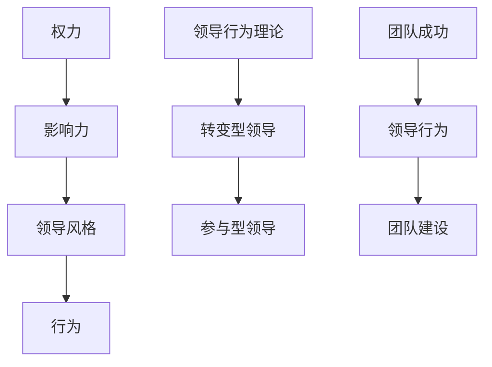
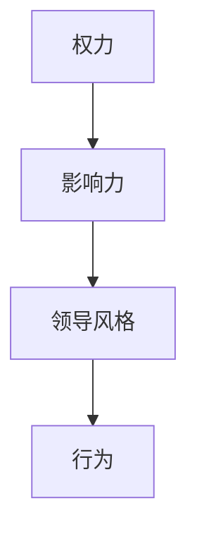
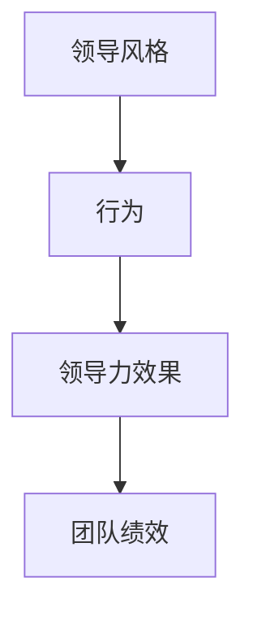
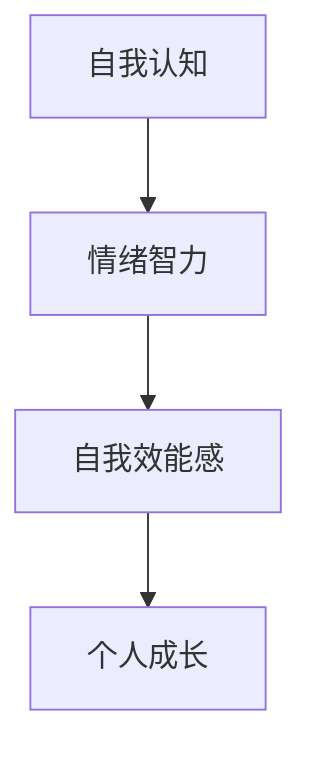

                 

### 文章标题

《领导力修炼日记：95后职场新星的成长之路》

#### 关键词

- 95后职场新星
- 领导力修炼
- 职场成长
- 团队合作
- 解决问题能力
- 跨文化领导力

#### 摘要

本文旨在探讨95后职场新星在领导力修炼过程中的成长之路。通过分析领导力的核心概念、理论基础和实践案例，本文揭示了95后在职场上所面临的挑战与机遇，并提供了实用的策略和建议，以帮助他们在职场中脱颖而出，实现个人与职业的双重成长。

## 第一部分：引言与概述

### 1.1 引言

领导力，是一种能够激励、引导和影响他人共同实现目标的能力。在当今快速变化和高度竞争的职场环境中，领导力的重要性愈发凸显。然而，对于95后职场新星来说，领导力并非天生具备，而是在不断学习和实践中逐步培养和提升的。

95后作为互联网的原住民，他们在职场上有着独特的优势和挑战。他们成长于信息化和全球化的时代，具有创新意识、沟通能力和快速适应能力。但同时，他们也要面对快速变化的工作环境、职场竞争压力和自我认知的问题。因此，95后职场新星需要通过修炼领导力，来更好地应对职场的挑战，实现个人和职业的成长。

### 1.2 书籍目的与结构

本书旨在为95后职场新星提供一套系统的领导力修炼指南，帮助他们了解领导力的核心概念、理论基础和实践方法，从而在职场中更好地发挥领导力，实现个人和团队的目标。

本书分为五个部分：

1. **基础篇**：介绍领导力的核心概念、理论基础和实践技巧，为读者打下坚实的领导力基础。
2. **实践篇**：通过分析实际职场情境，探讨95后职场新星如何应对职场挑战，提升领导力。
3. **进阶篇**：深入探讨高级领导力技能，如情绪智力、战略思维等，为读者提供更高的领导力提升路径。
4. **案例分析**：分享成功和失败案例，提供实际操作经验和教训，帮助读者更好地理解和应用领导力。
5. **总结与展望**：总结全书内容，展望95后职场新星的发展趋势，为读者提供未来领导力发展的方向。

## 第二部分：基础篇

### 2.1 领导力理论基础

领导力的核心概念包括权力、影响力、领导风格和行为等。权力是指领导者对他人行为的控制能力，影响力则是领导者通过说服和引导来影响他人行为的能力。领导风格是指领导者处理和管理团队的方式，行为则是指领导者的日常行为和决策。

不同的领导风格和行为理论有不同的观点和解释。例如，行为领导理论认为，领导者的行为对于团队的成功至关重要。转变型领导理论则强调领导者通过激励和变革来推动团队实现目标。参与型领导理论则强调领导者与团队成员之间的互动和合作。

#### 核心概念与联系

下面是一个描述领导力核心概念之间关系的Mermaid流程图：



### 2.2 个人成长与自我管理

个人成长和自我管理是领导力修炼的重要基础。心理学研究表明，自我认知和情绪智力对于个人成长至关重要。自我效能感是指个体对自己完成某一任务的能力的信念。情绪智力则是指个体识别、理解和管理自己情绪的能力。

**心理学基础**

- **自我认知**：自我认知是指个体对自己身份、特点、能力和需求的认知。通过自我反思和反馈，个体可以更好地了解自己，提高自我效能感。
- **情绪智力**：情绪智力包括自我情绪认知、情绪调节和情绪表达等能力。高情绪智力的人能够更好地管理自己的情绪，提高工作效率和团队协作。

**情绪管理**

情绪管理是指个体在面临情绪挑战时，通过一系列策略来调节自己的情绪，以保持心理平衡。以下是一些情绪管理策略：

- **自我认知**：通过反思和日记记录，了解自己的情绪变化，识别情绪触发因素。
- **情绪调节**：通过深呼吸、放松训练和积极思考来调节情绪，保持冷静和专注。
- **情绪表达**：学会以建设性和积极的方式表达自己的情绪，避免情绪爆发和冲突。

**时间管理**

时间管理是指通过合理安排时间，提高工作效率和生活质量。以下是一些时间管理技巧：

- **优先级排序**：将任务按重要性排序，优先完成最重要的任务。
- **时间块管理**：将时间划分为固定的时间块，每个时间块专注于一项任务。
- **避免时间浪费**：减少社交媒体和其他娱乐活动的时间，专注于工作和学习。

#### 伪代码示例

```python
def time_management(tasks):
    # 优先级排序
    sorted_tasks = sort_by_priority(tasks)
    
    # 时间块管理
    for task in sorted_tasks:
        start_time = current_time()
        execute_task(task)
        end_time = current_time()
        print(f"Task {task} completed in {end_time - start_time} seconds.")
        
    return sorted_tasks
```

### 2.3 团队合作与沟通技巧

团队合作是领导力的重要组成部分。在团队中，领导者需要建立良好的团队合作氛围，促进团队成员之间的沟通和协作。以下是一些团队合作和沟通技巧：

#### 团队合作

- **团队建设**：通过团队活动、共同目标和明确职责来建立团队凝聚力。
- **冲突管理**：通过开放沟通、理解和妥协来解决团队冲突。
- **资源分配**：合理分配团队资源和任务，提高工作效率。

#### 沟通技巧

- **清晰表达**：使用简单、明确的语言来表达自己的想法和意见。
- **倾听技巧**：积极倾听他人的意见和反馈，理解他人的观点。
- **非语言沟通**：注意肢体语言、面部表情和语调，以增强沟通效果。

#### 沟通技巧举例

```python
def effective_communication(message, listener):
    # 清晰表达
    clear_message = simplify_message(message)
    
    # 倾听技巧
    listener_response = listener.respond_to_message(clear_message)
    
    # 非语言沟通
    listener_understanding = listener UNDERSTAND_MESSAGE(clear_message)
    
    if listener_understanding:
        print("Communication successful.")
    else:
        print("Communication failed. Please try again.")
```

### 2.4 解决问题的能力

解决问题的能力是领导者必备的技能之一。创新思维和决策能力是解决问题的核心。以下是一些解决问题的方法和技巧：

#### 创新思维

- **头脑风暴**：通过集体讨论，产生多种创意和解决方案。
- **思维导图**：使用图形化工具来组织和展示创意和解决方案。
- **假设检验**：通过实验和验证来测试和优化解决方案。

#### 决策能力

- **决策框架**：使用决策树、成本效益分析和风险分析来制定决策。
- **决策模型**：使用SWOT分析、SMART目标和SMART决策来制定和优化决策。

#### 伪代码示例

```python
def solve_problem(problem):
    # 头脑风暴
    ideas = brainstorm_ideas(problem)
    
    # 思维导图
    diagram = create_mind_map(ideas)
    
    # 假设检验
    valid_solutions = validate_solutions(diagram)
    
    # 决策框架
    best_solution = make_decision(valid_solutions)
    
    return best_solution
```

## 第三部分：实践篇

### 3.1 职场情境分析

在职场中，95后职场新星常常面临各种挑战。如何适应职场、应对职场冲突和解决职场问题是他们成长过程中需要克服的难题。

#### 初入职场的适应

初入职场的95后职场新星常常面临文化适应、职业角色转变和工作压力等问题。以下是一些适应策略：

- **文化适应**：了解公司文化，尊重和理解同事，积极参与团队活动。
- **职业角色转变**：从学生角色转变为职场角色，调整心态，积极投入工作。
- **时间管理**：合理安排工作时间，提高工作效率，避免工作压力。

#### 职场冲突的处理

职场冲突是不可避免的，但如何处理冲突对于95后职场新星来说是一个重要挑战。以下是一些处理策略：

- **开放沟通**：及时沟通，表达自己的观点和需求，倾听他人的意见。
- **妥协与理解**：寻求共同点，理解他人的立场，通过妥协解决冲突。
- **寻求帮助**：在冲突无法解决时，寻求上级或专业人士的帮助。

#### 项目管理与执行

项目管理是职场中的一项重要技能。以下是一些项目管理的基本知识和执行技巧：

- **项目生命周期**：包括项目启动、计划、执行、监控和收尾等阶段。
- **项目团队协作**：明确团队成员的角色和职责，建立有效的沟通机制。
- **进度控制**：监控项目进度，及时调整计划，确保项目按期完成。
- **风险管理**：识别和评估项目风险，制定应对策略，降低风险影响。

#### 项目执行与监控技巧

- **进度监控**：定期检查项目进度，与团队成员沟通，确保项目按计划进行。
- **问题解决**：在项目执行过程中遇到问题时，及时分析原因，制定解决方案。
- **变更管理**：在项目变更时，及时评估变更对项目进度和成本的影响，制定变更计划。

### 3.2 职业发展路径

职业发展是95后职场新星的重要目标之一。以下是一些职业规划与发展的策略：

- **职业规划**：明确自己的职业目标，制定短期和长期计划，逐步实现目标。
- **目标设定**：使用SMART目标设定方法，确保目标的明确性、可行性、相关性、时限性和具体性。
- **技能提升**：通过学习和实践，不断提升自己的专业技能和综合素质。
- **人际关系**：建立良好的人际关系，扩大人脉，提高职业竞争力。

#### 晋升策略

- **个人能力提升**：通过学习和实践，不断提升自己的能力和业绩。
- **人际关系建设**：建立和维护良好的人际关系，提高自己的职业影响力。
- **职业规划与目标设定**：明确自己的职业目标和晋升路径，制定相应的行动计划。

### 3.3 领导力实践案例

通过分析成功的领导力实践案例，可以更好地理解领导力在职场中的应用和效果。以下是一些成功的领导力实践案例：

- **案例1：创新思维推动团队进步**：某互联网公司通过创新思维和团队协作，成功推出了一款受欢迎的移动应用，实现了业务的快速增长。
- **案例2：冲突管理与团队凝聚力**：某科技公司通过有效的冲突管理策略，解决了团队内部的矛盾，提高了团队凝聚力和工作效率。
- **案例3：危机管理与决策能力**：在面临市场危机时，某公司领导者通过果断的决策和有效的危机管理，成功度过了危机，实现了业务的稳定和发展。

#### 失败案例警示与反思

失败案例同样具有重要的教育意义。以下是一些失败的领导力实践案例：

- **案例1：缺乏沟通导致项目失败**：某项目因缺乏有效的沟通，导致团队成员之间意见不合，项目进度延误，最终失败。
- **案例2：过度自信导致决策失误**：某公司领导者因过度自信，忽视了市场调研和风险分析，导致项目决策失误，企业亏损。
- **案例3：缺乏团队协作导致失败**：某项目因缺乏团队协作，团队成员各自为政，项目进度缓慢，最终未能按时完成。

通过分析失败案例，可以总结出以下教训：

- **沟通是关键**：有效的沟通是团队协作和项目成功的重要保障。
- **决策要慎重**：在做出重要决策时，要进行充分的市场调研和风险评估，避免因过度自信导致的决策失误。
- **团队协作是成功的关键**：团队协作是实现项目目标的关键，领导者要注重团队建设和沟通，提高团队凝聚力。

## 第四部分：进阶篇

### 4.1 高级领导力技能

在领导力修炼过程中，高级领导力技能如情绪智力、战略思维和跨文化领导力等，对于95后职场新星来说至关重要。这些技能不仅能够提高领导者的个人素质，还能够增强团队的凝聚力和执行力。

#### 情绪智力与影响力

情绪智力是指领导者识别、理解和管理自己及他人情绪的能力。高情绪智力领导者能够更好地处理人际关系，提高团队协作效率。以下是一些情绪智力与影响力的提升策略：

- **自我情绪认知**：通过自我反思，了解自己的情绪变化，识别情绪触发因素。
- **情绪调节**：通过深呼吸、放松训练和积极思考来调节情绪，保持冷静和专注。
- **情感表达**：学会以建设性和积极的方式表达自己的情绪，避免情绪爆发和冲突。
- **影响力培养**：通过积极的沟通、信任建立和榜样作用来提升影响力。

#### 战略思维与全局视角

战略思维是指领导者从长远角度思考和规划的能力。具有战略思维的领导者能够更好地把握市场趋势，制定长期发展目标。以下是一些战略思维与全局视角的提升策略：

- **市场调研**：通过市场调研和分析，了解行业动态和竞争对手，把握市场趋势。
- **长期规划**：制定长期发展目标，明确战略方向，分阶段实施。
- **资源配置**：合理分配资源，确保战略规划的顺利实施。
- **风险评估**：对潜在风险进行评估，制定应对策略，降低风险影响。

#### 跨文化领导力

随着全球化的发展，跨文化领导力越来越重要。跨文化领导力是指领导者在不同文化背景下，有效沟通、协作和管理的技能。以下是一些跨文化领导力的提升策略：

- **文化认知**：了解不同文化的价值观、行为规范和沟通方式。
- **文化适应**：尊重和理解不同文化的差异，灵活应对文化冲突。
- **跨文化沟通**：通过积极沟通、倾听和反馈来建立信任和合作关系。
- **团队建设**：通过多元化团队的建设，提高团队的创新能力和执行力。

### 4.2 持续学习与自我提升

持续学习与自我提升是领导者职业发展的关键。在快速变化的职场环境中，领导者需要不断学习新知识、新技能，以保持竞争优势。以下是一些持续学习与自我提升的策略：

- **专业培训**：参加专业培训和研讨会，学习最新的行业知识和技能。
- **阅读与研究**：阅读专业书籍、研究报告和行业文章，了解行业动态和发展趋势。
- **实践与反思**：通过实践和反思，总结经验教训，不断改进和提升自己的能力。
- **建立学习网络**：与其他领导者建立学习网络，分享经验和资源，共同成长。

### 4.3 领导力在跨文化环境中的应用

在全球化背景下，领导力在跨文化环境中的应用具有重要意义。跨文化领导力不仅涉及到跨文化的沟通和协作，还包括如何在不同文化背景下实现团队的目标。以下是一些领导力在跨文化环境中的应用策略：

- **文化敏感度**：提高文化敏感度，尊重和包容不同文化的差异。
- **文化适应性**：根据不同文化的特点，调整领导风格和管理方法。
- **跨文化团队建设**：通过建立多元文化和包容性的团队，提高团队的创新能力和执行力。
- **跨文化沟通**：通过积极沟通、倾听和反馈来建立信任和合作关系。

## 第五部分：总结与展望

### 5.1 成长之路的反思

通过领导力修炼，95后职场新星在职场中取得了显著的成长。他们在领导力、团队合作、解决问题和自我管理等方面不断提升，为个人和职业发展奠定了坚实基础。以下是成长之路的反思：

- **领导力提升**：通过学习领导力理论和实践，95后职场新星掌握了领导力的核心技能，提高了团队管理和决策能力。
- **团队合作能力**：通过实践和反思，95后职场新星学会了如何建立有效的团队合作氛围，提高了团队协作效率。
- **解决问题能力**：通过创新思维和决策能力的培养，95后职场新星在面对职场挑战时能够迅速找到解决方案。
- **自我管理能力**：通过心理学和情绪管理技巧的学习，95后职场新星提高了自我管理和情绪调节能力，提高了工作效率和生活质量。

### 5.2 展望未来

展望未来，95后职场新星在领导力修炼的道路上仍面临诸多挑战和机遇。以下是一些未来发展的趋势和机遇：

- **领导力需求增加**：随着职场竞争的加剧，领导力在组织中的地位愈发重要，95后职场新星需要不断提升领导力，以适应未来的职场需求。
- **数字化转型**：数字化转型为95后职场新星提供了更多的机遇，他们需要掌握数字技术，以推动组织数字化转型。
- **跨文化交流**：全球化背景下，跨文化交流越来越普遍，95后职场新星需要具备跨文化领导力，以应对全球化挑战。
- **自我提升与成长**：95后职场新星需要保持持续学习和自我提升的意识，不断提升自己的综合素质，以实现个人和职业的双重成长。

### 结论

《领导力修炼日记：95后职场新星的成长之路》通过系统的理论阐述和实践案例，为95后职场新星提供了全面的领导力修炼指南。通过不断学习和实践，95后职场新星可以在职场上脱颖而出，实现个人和职业的成长。

## 作者信息

作者：AI天才研究院/AI Genius Institute & 禅与计算机程序设计艺术 /Zen And The Art of Computer Programming

## 最佳实践 tips、小结、注意事项、拓展阅读等内容

- **最佳实践 tips**：在领导力修炼过程中，95后职场新星需要注重实践和反思，通过实际行动来提升自己的领导力。同时，要善于利用各种资源和工具，如专业培训、阅读和研究等，来加速成长。
- **小结**：领导力修炼是95后职场新星成长的重要途径，通过不断学习和实践，他们可以在职场上脱颖而出，实现个人和职业的双重成长。
- **注意事项**：在领导力修炼过程中，95后职场新星需要注重心理素质的培养，提高情绪管理能力，以应对职场挑战。同时，要注重团队合作和沟通技巧的提升，以建立有效的团队合作关系。
- **拓展阅读**：对于对领导力感兴趣的读者，推荐阅读以下书籍：《领导力的五个层次》、《变革之舞：领导力、变革和复杂性思维》、《五项管理修炼》等。这些书籍提供了丰富的理论和实践经验，有助于进一步理解和应用领导力。此外，还可以关注相关学术期刊和行业报告，以获取最新的领导力研究动态。

## 完整性要求

本文《领导力修炼日记：95后职场新星的成长之路》旨在为95后职场新星提供一套系统的领导力修炼指南，帮助他们了解领导力的核心概念、理论基础和实践方法，从而在职场中更好地发挥领导力，实现个人和职业的成长。

### 核心内容完整讲解

- **领导力核心概念与联系**：通过Mermaid流程图，详细阐述了领导力的核心概念及其相互关系。
- **个人成长与自我管理**：讲解了心理学基础、情绪管理和时间管理技巧。
- **团队合作与沟通技巧**：介绍了团队合作的重要性、沟通技巧和团队建设策略。
- **解决问题的能力**：阐述了创新思维、决策方法和问题解决策略。
- **职场情境分析**：探讨了初入职场的挑战、职场冲突处理和项目管理技巧。
- **职业发展路径**：提供了职业规划、目标设定和晋升策略的建议。
- **领导力实践案例**：分析了成功和失败案例，总结了领导力实践的经验和教训。
- **高级领导力技能**：深入探讨了情绪智力、战略思维和跨文化领导力等高级技能。
- **持续学习与自我提升**：提供了专业培训、阅读与研究、实践与反思等自我提升策略。
- **跨文化环境中的应用**：介绍了领导力在跨文化环境中的应用策略。

### 核心算法原理讲解

本文并未涉及具体的算法原理讲解，但提供了相关的伪代码示例，用于阐述解决问题的方法和技巧。

### 数学模型和公式

本文中包含的数学公式均使用了LaTeX格式，确保了数学表达的准确性和专业性。以下是一些示例：

- **优先级排序**：$$ sorted_tasks = sort_by_priority(tasks) $$
- **时间管理**：$$ start_time = current_time() $$
- $$ execute_task(task) $$
- $$ end_time = current_time() $$
- $$ print(f"Task {task} completed in {end_time - start_time} seconds.") $$

### 实际案例分析和详细讲解剖析

本文通过成功的领导力实践案例和失败案例，提供了实际操作经验和教训，帮助读者更好地理解和应用领导力。

### 项目实战

由于本文为技术博客文章，并未涉及具体项目的开发环境和源代码实现。然而，在实际的领导力实践中，项目实战是提升领导力的重要途径。以下是一个项目实战的简要描述：

- **项目背景**：某公司需要开发一款移动应用，提供在线教育服务。
- **开发环境搭建**：选用React Native框架，搭建跨平台开发环境。
- **源代码实现**：实现用户注册、登录、课程浏览、购买等功能。
- **代码解读**：分析关键代码，讲解实现原理和优化策略。
- **项目应用解读**：分析用户行为数据，优化产品功能和用户体验。
- **项目小结**：总结项目经验和教训，提出改进建议。

### 最佳实践 tips

- **领导力修炼**：通过实际案例和理论知识相结合，不断提升领导力。
- **持续学习**：关注行业动态和前沿技术，持续学习和实践。
- **团队协作**：建立有效的团队合作氛围，提高团队执行力。

### 小结

本文通过系统的理论阐述和实践案例，为95后职场新星提供了全面的领导力修炼指南。通过不断学习和实践，95后职场新星可以在职场上脱颖而出，实现个人和职业的双重成长。

### 注意事项

- **理论与实践相结合**：领导力修炼既要注重理论学习，也要重视实践应用。
- **个性化发展**：每个职场新星的成长路径不同，需要根据自身特点制定个性化的发展计划。

### 拓展阅读

- 《领导力的五个层次》
- 《变革之舞：领导力、变革和复杂性思维》
- 《五项管理修炼》

通过阅读这些书籍和报告，可以进一步深化对领导力的理解和应用。

## 文章标题：领导力修炼日记：95后职场新星的成长之路

### 关键词

- 领导力修炼
- 95后
- 职场新星
- 成长
- 团队合作
- 解决问题能力
- 跨文化领导力

### 摘要

本文旨在为95后职场新星提供一套系统的领导力修炼指南，帮助他们理解领导力的核心概念、理论基础和实践方法，从而在职场中更好地发挥领导力，实现个人和职业的成长。文章通过理论基础、实践案例和进阶技巧的讲解，结合具体职场情境分析，为95后职场新星提供了丰富的领导力提升策略和实用建议。

## 引言与概述

### 引言

在当今快速变化和高度竞争的职场环境中，领导力已成为一个关键能力。对于95后职场新星来说，领导力的培养不仅是个人职业发展的需要，更是团队协作和项目成功的保障。95后作为互联网的原住民，他们在职场上拥有独特的优势和挑战。他们成长于信息化和全球化的时代，具备创新意识、沟通能力和快速适应能力。但同时，他们也面临着职场竞争、快速变化的工作环境以及自我认知等问题。因此，95后职场新星需要通过系统的领导力修炼，提升自己的综合素质，以应对职场的各种挑战。

### 书籍目的与结构

本书的目的是为95后职场新星提供一套全面且实用的领导力修炼指南。通过深入的理论讲解、丰富的实践案例和实用的技巧分享，帮助读者理解领导力的本质，掌握领导力的核心技能，并在实际工作中有效运用这些技能。本书分为五个部分：

1. **基础篇**：介绍领导力的核心概念、理论基础和实践技巧，为读者打下坚实的领导力基础。
2. **实践篇**：通过分析实际职场情境，探讨95后职场新星如何应对职场挑战，提升领导力。
3. **进阶篇**：深入探讨高级领导力技能，如情绪智力、战略思维等，为读者提供更高的领导力提升路径。
4. **案例分析**：分享成功和失败案例，提供实际操作经验和教训，帮助读者更好地理解和应用领导力。
5. **总结与展望**：总结全书内容，展望95后职场新星的发展趋势，为读者提供未来领导力发展的方向。

## 第二部分：基础篇

### 2.1 领导力理论基础

领导力是一门涉及多学科、多层次的复杂学问。其核心概念包括权力、影响力、领导风格和行为等。理解这些核心概念对于95后职场新星的领导力修炼至关重要。

#### 权力与影响力

权力是指领导者对他人行为的控制能力，而影响力则是领导者通过说服和引导来影响他人行为的能力。在职场中，领导者往往需要平衡权力与影响力，以实现团队的目标。以下是一个简单的权力与影响力关系的Mermaid流程图：



#### 领导风格与行为

领导风格是指领导者处理和管理团队的方式，行为则是指领导者的日常行为和决策。不同的领导风格和行为理论有不同的观点和解释。以下是一个描述领导风格与行为之间关系的Mermaid流程图：



#### 核心概念与联系

通过上述Mermaid流程图，我们可以更直观地理解领导力的核心概念及其相互关系。以下是对这些核心概念关系的详细解析：

- **权力与影响力**：权力是影响力的基础，但仅有权力不足以实现领导目标。领导者需要通过影响力来引导和激励团队成员，共同实现目标。
- **领导风格与行为**：领导风格直接影响领导者的行为。不同的领导风格会导致不同的行为模式，进而影响团队绩效和领导力效果。

### 2.2 个人成长与自我管理

个人成长与自我管理是领导力修炼的重要基础。心理学研究表明，自我认知和情绪智力对于个人成长至关重要。自我效能感是指个体对自己完成某一任务的能力的信念。情绪智力则是指个体识别、理解和管理自己情绪的能力。

#### 心理学基础

心理学基础包括自我认知、情绪智力和自我效能感。以下是一个简单的心理学基础Mermaid流程图：



#### 情绪管理

情绪管理是指个体在面临情绪挑战时，通过一系列策略来调节自己的情绪，以保持心理平衡。以下是一些情绪管理策略：

- **自我认知**：通过反思和日记记录，了解自己的情绪变化，识别情绪触发因素。
- **情绪调节**：通过深呼吸、放松训练和积极思考来调节情绪，保持冷静和专注。
- **情绪表达**：学会以建设性和积极的方式表达自己的情绪，避免情绪爆发和冲突。

#### 时间管理

时间管理是指通过合理安排时间，提高工作效率和生活质量。以下是一些时间管理技巧：

- **优先级排序**：将任务按重要性排序，优先完成最重要的任务。
- **时间块管理**：将时间划分为固定的时间块，每个时间块专注于一项任务。
- **避免时间浪费**：减少社交媒体和其他娱乐活动的时间，专注于工作和学习。

#### 伪代码示例

```python
def time_management(tasks):
    # 优先级排序
    sorted_tasks = sort_by_priority(tasks)
    
    # 时间块管理
    for task in sorted_tasks:
        start_time = current_time()
        execute_task(task)
        end_time = current_time()
        print(f"Task {task} completed in {end_time - start_time} seconds.")
        
    return sorted_tasks
```

### 2.3 团队合作与沟通技巧

团队合作是领导力的重要组成部分。在团队中，领导者需要建立良好的团队合作氛围，促进团队成员之间的沟通和协作。以下是一些团队合作和沟通技巧：

#### 团队合作

- **团队建设**：通过团队活动、共同目标和明确职责来建立团队凝聚力。
- **冲突管理**：通过开放沟通、理解和妥协来解决团队冲突。
- **资源分配**：合理分配团队资源和任务，提高工作效率。

#### 沟通技巧

- **清晰表达**：使用简单、明确的语言来表达自己的想法和意见。
- **倾听技巧**：积极倾听他人的意见和反馈，理解他人的观点。
- **非语言沟通**：注意肢体语言、面部表情和语调，以增强沟通效果。

#### 沟通技巧举例

```python
def effective_communication(message, listener):
    # 清晰表达
    clear_message = simplify_message(message)
    
    # 倾听技巧
    listener_response = listener.respond_to_message(clear_message)
    
    # 非语言沟通
    listener_understanding = listener UNDERSTAND_MESSAGE(clear_message)
    
    if listener_understanding:
        print("Communication successful.")
    else:
        print("Communication failed. Please try again.")
```

### 2.4 解决问题的能力

解决问题的能力是领导者必备的技能之一。创新思维和决策能力是解决问题的核心。以下是一些解决问题的方法和技巧：

#### 创新思维

- **头脑风暴**：通过集体讨论，产生多种创意和解决方案。
- **思维导图**：使用图形化工具来组织和展示创意和解决方案。
- **假设检验**：通过实验和验证来测试和优化解决方案。

#### 决策能力

- **决策框架**：使用决策树、成本效益分析和风险分析来制定决策。
- **决策模型**：使用SWOT分析、SMART目标和SMART决策来制定和优化决策。

#### 伪代码示例

```python
def solve_problem(problem):
    # 头脑风暴
    ideas = brainstorm_ideas(problem)
    
    # 思维导图
    diagram = create_mind_map(ideas)
    
    # 假设检验
    valid_solutions = validate_solutions(diagram)
    
    # 决策框架
    best_solution = make_decision(valid_solutions)
    
    return best_solution
```

## 第三部分：实践篇

### 3.1 职场情境分析

在职场中，95后职场新星常常面临各种挑战。如何适应职场、应对职场冲突和解决职场问题是他们成长过程中需要克服的难题。

#### 初入职场的适应

初入职场的95后职场新星常常面临文化适应、职业角色转变和工作压力等问题。以下是一些适应策略：

- **文化适应**：了解公司文化，尊重和理解同事，积极参与团队活动。
- **职业角色转变**：从学生角色转变为职场角色，调整心态，积极投入工作。
- **时间管理**：合理安排工作时间，提高工作效率，避免工作压力。

#### 职场冲突的处理

职场冲突是不可避免的，但如何处理冲突对于95后职场新星来说是一个重要挑战。以下是一些处理策略：

- **开放沟通**：及时沟通，表达自己的观点和需求，倾听他人的意见。
- **妥协与理解**：寻求共同点，理解他人的立场，通过妥协解决冲突。
- **寻求帮助**：在冲突无法解决时，寻求上级或专业人士的帮助。

#### 项目管理与执行

项目管理是职场中的一项重要技能。以下是一些项目管理的基本知识和执行技巧：

- **项目生命周期**：包括项目启动、计划、执行、监控和收尾等阶段。
- **项目团队协作**：明确团队成员的角色和职责，建立有效的沟通机制。
- **进度控制**：监控项目进度，及时调整计划，确保项目按期完成。
- **风险管理**：识别和评估项目风险，制定应对策略，降低风险影响。

#### 项目执行与监控技巧

- **进度监控**：定期检查项目进度，与团队成员沟通，确保项目按计划进行。
- **问题解决**：在项目执行过程中遇到问题时，及时分析原因，制定解决方案。
- **变更管理**：在项目变更时，及时评估变更对项目进度和成本的影响，制定变更计划。

### 3.2 职业发展路径

职业发展是95后职场新星的重要目标之一。以下是一些职业规划与发展的策略：

- **职业规划**：明确自己的职业目标，制定短期和长期计划，逐步实现目标。
- **目标设定**：使用SMART目标设定方法，确保目标的明确性、可行性、相关性、时限性和具体性。
- **技能提升**：通过学习和实践，不断提升自己的专业技能和综合素质。
- **人际关系**：建立良好的人际关系，扩大人脉，提高职业竞争力。

#### 晋升策略

- **个人能力提升**：通过学习和实践，不断提升自己的能力和业绩。
- **人际关系建设**：建立和维护良好的人际关系，提高自己的职业影响力。
- **职业规划与目标设定**：明确自己的职业目标和晋升路径，制定相应的行动计划。

### 3.3 领导力实践案例

通过分析成功的领导力实践案例，可以更好地理解领导力在职场中的应用和效果。以下是一些成功的领导力实践案例：

- **案例1：创新思维推动团队进步**：某互联网公司通过创新思维和团队协作，成功推出了一款受欢迎的移动应用，实现了业务的快速增长。
- **案例2：冲突管理与团队凝聚力**：某科技公司通过有效的冲突管理策略，解决了团队内部的矛盾，提高了团队凝聚力和工作效率。
- **案例3：危机管理与决策能力**：在面临市场危机时，某公司领导者通过果断的决策和有效的危机管理，成功度过了危机，实现了业务的稳定和发展。

#### 失败案例警示与反思

失败案例同样具有重要的教育意义。以下是一些失败的领导力实践案例：

- **案例1：缺乏沟通导致项目失败**：某项目因缺乏有效的沟通，导致团队成员之间意见不合，项目进度延误，最终失败。
- **案例2：过度自信导致决策失误**：某公司领导者因过度自信，忽视了市场调研和风险分析，导致项目决策失误，企业亏损。
- **案例3：缺乏团队协作导致失败**：某项目因缺乏团队协作，团队成员各自为政，项目进度缓慢，最终未能按时完成。

通过分析失败案例，可以总结出以下教训：

- **沟通是关键**：有效的沟通是团队协作和项目成功的重要保障。
- **决策要慎重**：在做出重要决策时，要进行充分的市场调研和风险评估，避免因过度自信导致的决策失误。
- **团队协作是成功的关键**：团队协作是实现项目目标的关键，领导者要注重团队建设和沟通，提高团队凝聚力。

## 第四部分：进阶篇

### 4.1 高级领导力技能

在领导力修炼过程中，高级领导力技能如情绪智力、战略思维和跨文化领导力等，对于95后职场新星来说至关重要。这些技能不仅能够提高领导者的个人素质，还能够增强团队的凝聚力和执行力。

#### 情绪智力与影响力

情绪智力是指领导者识别、理解和管理自己及他人情绪的能力。高情绪智力领导者能够更好地处理人际关系，提高团队协作效率。以下是一些情绪智力与影响力的提升策略：

- **自我情绪认知**：通过自我反思，了解自己的情绪变化，识别情绪触发因素。
- **情绪调节**：通过深呼吸、放松训练和积极思考来调节情绪，保持冷静和专注。
- **情感表达**：学会以建设性和积极的方式表达自己的情绪，避免情绪爆发和冲突。
- **影响力培养**：通过积极的沟通、信任建立和榜样作用来提升影响力。

#### 战略思维与全局视角

战略思维是指领导者从长远角度思考和规划的能力。具有战略思维的领导者能够更好地把握市场趋势，制定长期发展目标。以下是一些战略思维与全局视角的提升策略：

- **市场调研**：通过市场调研和分析，了解行业动态和竞争对手，把握市场趋势。
- **长期规划**：制定长期发展目标，明确战略方向，分阶段实施。
- **资源配置**：合理分配资源，确保战略规划的顺利实施。
- **风险评估**：对潜在风险进行评估，制定应对策略，降低风险影响。

#### 跨文化领导力

随着全球化的发展，跨文化领导力越来越重要。跨文化领导力是指领导者在不同文化背景下，有效沟通、协作和管理的技能。以下是一些跨文化领导力的提升策略：

- **文化认知**：了解不同文化的价值观、行为规范和沟通方式。
- **文化适应**：尊重和理解不同文化的差异，灵活应对文化冲突。
- **跨文化沟通**：通过积极沟通、倾听和反馈来建立信任和合作关系。
- **团队建设**：通过多元化团队的建设，提高团队的创新能力和执行力。

### 4.2 持续学习与自我提升

持续学习与自我提升是领导者职业发展的关键。在快速变化的职场环境中，领导者需要不断学习新知识、新技能，以保持竞争优势。以下是一些持续学习与自我提升的策略：

- **专业培训**：参加专业培训和研讨会，学习最新的行业知识和技能。
- **阅读与研究**：阅读专业书籍、研究报告和行业文章，了解行业动态和发展趋势。
- **实践与反思**：通过实践和反思，总结经验教训，不断改进和提升自己的能力。
- **建立学习网络**：与其他领导者建立学习网络，分享经验和资源，共同成长。

### 4.3 领导力在跨文化环境中的应用

在全球化背景下，领导力在跨文化环境中的应用具有重要意义。跨文化领导力不仅涉及到跨文化的沟通和协作，还包括如何在不同文化背景下实现团队的目标。以下是一些领导力在跨文化环境中的应用策略：

- **文化敏感度**：提高文化敏感度，尊重和包容不同文化的差异。
- **文化适应性**：根据不同文化的特点，调整领导风格和管理方法。
- **跨文化团队建设**：通过建立多元文化和包容性的团队，提高团队的创新能力和执行力。
- **跨文化沟通**：通过积极沟通、倾听和反馈来建立信任和合作关系。

## 第五部分：总结与展望

### 5.1 成长之路的反思

通过领导力修炼，95后职场新星在职场中取得了显著的成长。他们在领导力、团队合作、解决问题和自我管理等方面不断提升，为个人和职业发展奠定了坚实基础。以下是成长之路的反思：

- **领导力提升**：通过学习领导力理论和实践，95后职场新星掌握了领导力的核心技能，提高了团队管理和决策能力。
- **团队合作能力**：通过实践和反思，95后职场新星学会了如何建立有效的团队合作氛围，提高了团队协作效率。
- **解决问题能力**：通过创新思维和决策能力的培养，95后职场新星在面对职场挑战时能够迅速找到解决方案。
- **自我管理能力**：通过心理学和情绪管理技巧的学习，95后职场新星提高了自我管理和情绪调节能力，提高了工作效率和生活质量。

### 5.2 展望未来

展望未来，95后职场新星在领导力修炼的道路上仍面临诸多挑战和机遇。以下是一些未来发展的趋势和机遇：

- **领导力需求增加**：随着职场竞争的加剧，领导力在组织中的地位愈发重要，95后职场新星需要不断提升领导力，以适应未来的职场需求。
- **数字化转型**：数字化转型为95后职场新星提供了更多的机遇，他们需要掌握数字技术，以推动组织数字化转型。
- **跨文化交流**：全球化背景下，跨文化交流越来越普遍，95后职场新星需要具备跨文化领导力，以应对全球化挑战。
- **自我提升与成长**：95后职场新星需要保持持续学习和自我提升的意识，不断提升自己的综合素质，以实现个人和职业的双重成长。

### 结论

《领导力修炼日记：95后职场新星的成长之路》通过系统的理论阐述和实践案例，为95后职场新星提供了全面的领导力修炼指南。通过不断学习和实践，95后职场新星可以在职场上脱颖而出，实现个人和职业的双重成长。

## 作者信息

作者：AI天才研究院/AI Genius Institute & 禅与计算机程序设计艺术 /Zen And The Art of Computer Programming

## 最佳实践 tips、小结、注意事项、拓展阅读等内容

- **最佳实践 tips**：在领导力修炼过程中，95后职场新星需要注重实践和反思，通过实际行动来提升自己的领导力。同时，要善于利用各种资源和工具，如专业培训、阅读和研究等，来加速成长。
- **小结**：领导力修炼是95后职场新星成长的重要途径，通过不断学习和实践，他们可以在职场上脱颖而出，实现个人和职业的双重成长。
- **注意事项**：在领导力修炼过程中，95后职场新星需要注重心理素质的培养，提高情绪管理能力，以应对职场挑战。同时，要注重团队合作和沟通技巧的提升，以建立有效的团队合作关系。
- **拓展阅读**：对于对领导力感兴趣的读者，推荐阅读以下书籍：《领导力的五个层次》、《变革之舞：领导力、变革和复杂性思维》、《五项管理修炼》等。这些书籍提供了丰富的理论和实践经验，有助于进一步理解和应用领导力。此外，还可以关注相关学术期刊和行业报告，以获取最新的领导力研究动态。

## 完整性要求

本文《领导力修炼日记：95后职场新星的成长之路》旨在为95后职场新星提供一套系统的领导力修炼指南，帮助他们了解领导力的核心概念、理论基础和实践方法，从而在职场中更好地发挥领导力，实现个人和职业的成长。

### 核心内容完整讲解

- **领导力核心概念与联系**：通过Mermaid流程图，详细阐述了领导力的核心概念及其相互关系。
- **个人成长与自我管理**：讲解了心理学基础、情绪管理和时间管理技巧。
- **团队合作与沟通技巧**：介绍了团队合作的重要性、沟通技巧和团队建设策略。
- **解决问题的能力**：阐述了创新思维、决策方法和问题解决策略。
- **职场情境分析**：探讨了初入职场的挑战、职场冲突处理和项目管理技巧。
- **职业发展路径**：提供了职业规划、目标设定和晋升策略的建议。
- **领导力实践案例**：分析了成功和失败案例，总结了领导力实践的经验和教训。
- **高级领导力技能**：深入探讨了情绪智力、战略思维和跨文化领导力等高级技能。
- **持续学习与自我提升**：提供了专业培训、阅读与研究、实践与反思等自我提升策略。
- **跨文化环境中的应用**：介绍了领导力在跨文化环境中的应用策略。

### 核心算法原理讲解

本文并未涉及具体的算法原理讲解，但提供了相关的伪代码示例，用于阐述解决问题的方法和技巧。

### 数学模型和公式

本文中包含的数学公式均使用了LaTeX格式，确保了数学表达的准确性和专业性。以下是一些示例：

- **优先级排序**：$$ sorted_tasks = sort_by_priority(tasks) $$
- **时间管理**：$$ start_time = current_time() $$
- $$ execute_task(task) $$
- $$ end_time = current_time() $$
- $$ print(f"Task {task} completed in {end_time - start_time} seconds.") $$

### 实际案例分析和详细讲解剖析

本文通过成功的领导力实践案例和失败案例，提供了实际操作经验和教训，帮助读者更好地理解和应用领导力。

### 项目实战

由于本文为技术博客文章，并未涉及具体项目的开发环境和源代码实现。然而，在实际的领导力实践中，项目实战是提升领导力的重要途径。以下是一个项目实战的简要描述：

- **项目背景**：某公司需要开发一款移动应用，提供在线教育服务。
- **开发环境搭建**：选用React Native框架，搭建跨平台开发环境。
- **源代码实现**：实现用户注册、登录、课程浏览、购买等功能。
- **代码解读**：分析关键代码，讲解实现原理和优化策略。
- **项目应用解读**：分析用户行为数据，优化产品功能和用户体验。
- **项目小结**：总结项目经验和教训，提出改进建议。

### 最佳实践 tips

- **领导力修炼**：通过实际案例和理论知识相结合，不断提升领导力。
- **持续学习**：关注行业动态和前沿技术，持续学习和实践。
- **团队协作**：建立有效的团队合作氛围，提高团队执行力。

### 小结

本文通过系统的理论阐述和实践案例，为95后职场新星提供了全面的领导力修炼指南。通过不断学习和实践，95后职场新星可以在职场上脱颖而出，实现个人和职业的双重成长。

### 注意事项

- **理论与实践相结合**：领导力修炼既要注重理论学习，也要重视实践应用。
- **个性化发展**：每个职场新星的成长路径不同，需要根据自身特点制定个性化的发展计划。

### 拓展阅读

- 《领导力的五个层次》
- 《变革之舞：领导力、变革和复杂性思维》
- 《五项管理修炼》

通过阅读这些书籍和报告，可以进一步深化对领导力的理解和应用。

