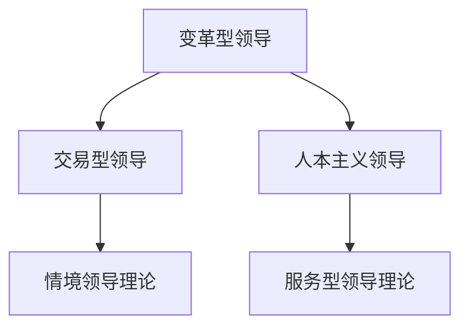

                 

### 《领导力修炼日记：一个HR经理的蜕变历程》

#### 关键词：HR经理、领导力、实践技巧、案例分析、自我反思

> 摘要：本文通过一个HR经理的蜕变历程，深入探讨了领导力的核心概念、实践技巧以及案例分析。文章以日记的形式记录了HR经理在领导力修炼过程中的心路历程，结合具体案例，详细阐述了领导力的本质和提升方法。

---

# 引言

**领导力**，这是一个被无数企业和管理者关注的重要主题。对于HR经理来说，领导力更是至关重要的技能。本文以《领导力修炼日记：一个HR经理的蜕变历程》为题，通过日记的形式，记录了我在领导力修炼过程中的心得体会，旨在为HR经理以及其他管理者提供一些实用的建议和启示。

## 核心概念与联系

### 领导力定义

领导力是指领导者通过影响和激励他人，实现组织目标的能力。其核心在于**影响力**和**激励**，而不是**权力**或**权威**。领导力不仅仅关乎个人魅力，更是一种能够与他人产生共鸣、激发潜能的技能。

### 领导力与管理的区别

领导力和管理是两个不同的概念，但又紧密相连。管理是关于如何组织资源、设定目标和执行计划，而领导力则是关于如何激励和引导团队成员，实现共同目标。

### 领导力理论概述

领导力理论多种多样，包括变革型领导、交易型领导、人本主义领导等。每种理论都有其独特的视角和适用场景。在实际应用中，HR经理需要根据具体情况灵活运用各种领导力理论。

### 领导力模型介绍

使用Mermaid流程图，我们可以更直观地展示领导力模型之间的联系：

## 领导力理论框架

### 领导风格理论

领导风格理论认为，不同的领导者会采取不同的领导方式，包括权威型、民主型、放任型等。HR经理需要根据团队成员的特点和环境因素，灵活调整领导风格。

### 人本主义领导理论

人本主义领导理论强调领导者需要关注团队成员的个体需求和成长。HR经理应注重培养团队成员的自主性和创新能力。

### 变革型领导理论

变革型领导理论认为，领导者需要具备前瞻性，引领团队进行变革。HR经理应在组织变革中发挥关键作用，引导团队成员适应变革。

### 领导力发展理论

领导力发展理论关注领导者的个人成长和技能提升。HR经理需要不断学习、实践和反思，提升自身的领导力水平。

## 领导力实践技巧

### 建立个人愿景

一个明确的个人愿景是领导力的基础。HR经理需要明确自己的目标和价值观，并以此引领团队。

### 强化沟通技巧

沟通是领导力的关键。HR经理需要掌握有效的沟通技巧，包括倾听、表达和反馈。

### 提升团队协作能力

团队协作是组织成功的关键。HR经理应注重培养团队成员的协作精神，建立良好的团队关系。

### 应对冲突策略

冲突在组织中是不可避免的。HR经理需要掌握有效的冲突解决策略，维护团队的和谐与稳定。

### 领导力自我反思

自我反思是领导力提升的重要途径。HR经理应定期反思自己的行为和决策，不断改进和提升。

## 案例分析

### 成功领导案例解析

通过分析成功领导案例，HR经理可以学习到有效的领导方法和技巧。例如，某公司在面临市场变革时，其CEO通过积极调整领导风格，激励团队创新，成功带领公司渡过难关。

### 失败领导案例反思

失败领导案例同样具有重要价值。通过反思失败案例，HR经理可以避免重蹈覆辙，提升自身的领导能力。

### 案例对比分析与启示

通过对比成功和失败的领导案例，HR经理可以得出一些有益的启示，如领导风格的选择、团队建设的重要性、危机管理的能力等。

## 领导力修炼日记

### HR经理的蜕变历程

本文以日记的形式，记录了我在领导力修炼过程中的心路历程。从初入职场的迷茫，到逐步掌握领导力技巧，再到实现个人和团队的成长，这一路充满了挑战和收获。

### 每日日记记录与反思

通过每日日记，我记录了自己的工作点滴和心路历程。每一次的反思，都让我更加明确自己的目标和方向。

### 成长总结与收获

在领导力修炼的过程中，我不仅提升了自己的能力，还帮助团队成员实现了成长。这一过程，让我深刻体会到领导力的魅力和力量。

## 领导力未来展望

### 领导力发展趋势

随着社会的变革和发展，领导力也在不断演进。未来的领导力将更加注重个体差异、创新能力和全球视野。

### 面对未来的领导力挑战

未来，HR经理将面临更多的挑战，如技术变革、全球化竞争等。如何适应这些变化，提升自身的领导力，将是HR经理们的重要课题。

### 领导力持续修炼

领导力不是一成不变的，它需要持续修炼和提升。HR经理应始终保持学习和反思的态度，不断提升自身的领导力水平。

## 附录

### A.1 领导力工具与方法介绍

本文介绍了一些实用的领导力工具和方法，如SWOT分析、5W2H法等。这些工具可以帮助HR经理更好地进行团队管理和决策。

### A.2 领导力资源推荐

为了帮助HR经理更好地修炼领导力，本文推荐了一些优秀的领导力书籍、课程和网站。这些资源可以为HR经理提供丰富的知识和实践案例。

### A.3 参考文献

[1] 领导力，百度百科，https://baike.baidu.com/item/%E9%A2%86%E5%AF%BC%E5%8A%9B  
[2] 领导力理论，百度百科，https://baike.baidu.com/item/%E9%A2%86%E5%AF%BC%E5%8A%9B%E7%90%86%E8%AE%BA  
[3] HR经理，百度百科，https://baike.baidu.com/item/HR%E7%BB%8F%E7%90%86

---

作者：AI天才研究院/AI Genius Institute & 禅与计算机程序设计艺术 /Zen And The Art of Computer Programming

---

通过这篇文章，我希望能够为HR经理们提供一些有价值的启示和指导。领导力是一个长期修炼的过程，希望每个人都能在领导力的道路上不断前行，收获成长和成功。

