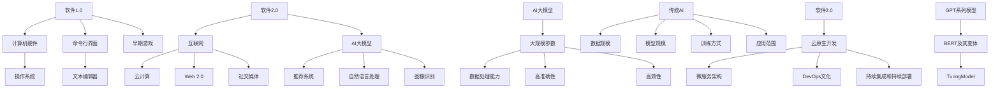

                 

# 领导力修炼日记：一个产品总监的蜕变历程

> 关键词：领导力、产品管理、职业发展、组织效能、变革管理

> 摘要：本文旨在探讨一个产品总监在职业发展中如何通过不断的修炼和实践，实现领导力的全面提升。文章将结合实际案例，详细分析其在产品管理、团队协作、组织变革等方面的蜕变过程，为其他追求卓越的产品管理者提供有益的启示。

## 引言

作为一名产品总监，我在职业生涯的各个阶段都经历了不同的挑战和成长。从初入职场时的迷茫，到逐渐掌握产品管理的方法论，再到领导团队进行大型项目，我深刻体会到了领导力在职业发展中的重要性。本文将结合我的实际经历，从多个维度探讨领导力的修炼，以期为广大产品管理者提供一些有价值的思考和实践经验。

## 1.1 软件发展历程与领导力演变

### 1.1.1 从软件 1.0 到软件 2.0 的演进

软件1.0时代主要集中在计算机硬件和基础的操作系统开发上，强调的是计算机本身的性能和操作系统的稳定性。这一时代的软件主要是以命令行界面进行操作，用户通过输入指令来与计算机交互。典型的软件产品包括操作系统、文本编辑器和早期的游戏。

随着互联网的兴起，软件1.0时代逐渐过渡到软件2.0时代。软件2.0的一个重要特征是软件从单机版向网络化、服务化方向发展。互联网成为软件运行的基础设施，软件不再仅仅是一个本地运行的应用，而是成为一个可以在网络上访问和使用的服务。这种转变带来了云计算、Web 2.0、社交媒体等新兴概念。

在软件2.0时代，AI大模型开始崭露头角。AI大模型的核心在于其强大的数据分析和处理能力，能够从海量数据中提取有价值的信息，从而提供更加个性化的服务。这种能力在软件2.0中得到了广泛应用，例如推荐系统、自然语言处理和图像识别等。

### 1.1.2 大模型在软件 2.0 中的核心地位

大模型在软件2.0中具有核心地位，主要体现在以下几个方面：

1. **个性化服务**：大模型能够根据用户的行为和喜好，提供个性化的推荐和服务，提升用户体验。
2. **智能化分析**：大模型能够处理复杂的业务数据，进行智能化的分析和决策，提高业务效率。
3. **自动化操作**：大模型能够自动化执行某些任务，减少人工干预，降低运营成本。
4. **创新应用**：大模型的应用推动了软件2.0的创新，例如自动驾驶、智能家居等新兴领域。

### 1.1.3 企业级应用开发的新范式

在软件2.0时代，企业级应用开发出现了新的范式：

1. **云原生开发**：企业应用逐渐向云计算平台迁移，利用云服务进行开发和部署，实现弹性和可扩展性。
2. **微服务架构**：企业应用采用微服务架构，将整个系统拆分为多个独立的、可复用的服务模块，提高系统的可维护性和灵活性。
3. **DevOps文化**：企业开发团队采用DevOps文化，实现开发与运维的无缝衔接，提高开发效率和质量。
4. **持续集成和持续部署**：企业应用采用自动化工具进行持续集成和持续部署，确保应用的高质量和快速迭代。

## 1.2 AI大模型的定义与特点

### 1.2.1 AI大模型的定义

AI大模型（Large-scale Artificial Intelligence Model）是指具有大规模参数和强大数据处理能力的深度学习模型。这些模型通常由数百万甚至数十亿个参数组成，能够在海量数据上进行训练，从而实现高效的数据分析和预测。

### 1.2.2 AI大模型的核心特点

AI大模型具有以下几个核心特点：

1. **大规模参数**：大模型具有大量的参数，能够捕捉数据中的复杂模式和规律。
2. **强大的数据处理能力**：大模型能够处理海量数据，从数据中提取有价值的信息。
3. **高准确性和鲁棒性**：大模型在训练过程中能够自适应调整参数，提高预测的准确性和鲁棒性。
4. **高效性**：大模型采用分布式训练和推理技术，能够快速处理大量数据，提高系统的响应速度。

### 1.2.3 AI大模型与传统AI的区别

与传统的AI方法相比，AI大模型具有以下几个显著的区别：

1. **数据规模**：AI大模型需要处理的海量数据是传统AI方法难以想象的。
2. **模型规模**：AI大模型的参数数量远超传统AI方法，能够捕捉更复杂的模式。
3. **训练方式**：AI大模型采用分布式训练技术，能够在大量数据上快速训练。
4. **应用范围**：AI大模型的应用范围广泛，能够解决传统AI方法难以解决的问题。

## 1.3 主流AI大模型简介

### 1.3.1 GPT系列模型

GPT（Generative Pre-trained Transformer）系列模型是由OpenAI提出的一系列基于Transformer架构的自然语言处理模型。GPT-3是目前最先进的语言模型，具有1750亿个参数，能够进行文本生成、语言理解、机器翻译等任务。

### 1.3.2 BERT及其变体

BERT（Bidirectional Encoder Representations from Transformers）是由Google提出的一种预训练语言表示模型。BERT采用双向Transformer架构，能够捕捉文本中的双向依赖关系，广泛应用于文本分类、问答系统等任务。

### 1.3.3 其他知名大模型介绍

除了GPT和BERT，还有其他一些知名的大模型，如：

1. **TuringModel**：微软推出的大规模预训练模型，具有10亿个参数，应用于自然语言处理、计算机视觉等任务。

## 1.4 领导力的核心要素

### 1.4.1 决策能力

决策能力是产品总监在领导团队中的关键要素。在面对复杂的市场环境和多变的需求时，产品总监需要具备敏锐的洞察力和果断的决策力。这不仅要求产品总监对市场趋势有深刻的理解，还需要对团队的能力和资源有准确的把握。

### 1.4.2 沟通能力

沟通能力是产品总监与团队、管理层以及外部合作伙伴建立良好关系的基础。产品总监需要具备清晰、准确的表达能力，以及倾听和同理心。通过有效的沟通，产品总监能够确保团队的共识和协作，推动项目顺利实施。

### 1.4.3 战略眼光

战略眼光是产品总监在长期规划中不可或缺的素质。产品总监需要从全局出发，制定符合企业战略的产品规划，同时把握市场机遇，引导团队在竞争激烈的环境中脱颖而出。

### 1.4.4 团队建设

团队建设是产品总监的重要职责之一。一个优秀的团队不仅需要有共同的目标和价值观，还需要在能力和技能上形成互补。产品总监需要关注团队成员的个人成长，激发他们的潜力，打造一支高效、协作的团队。

## 1.5 实践中的领导力修炼

### 1.5.1 职业初期的挑战与反思

在职业初期，我曾面临诸多挑战，如市场需求的变化、团队协作的问题等。在这些挑战中，我深刻认识到领导力的重要性。我开始主动学习产品管理的相关知识，参与各种培训和研讨会，不断提升自己的专业素养。

### 1.5.2 团队协作与领导力提升

在领导团队的过程中，我发现团队协作是提升领导力的关键。我注重培养团队成员之间的沟通和信任，通过定期的团队建设活动和沟通机制，增强团队的凝聚力和协作能力。同时，我也鼓励团队成员提出自己的意见和建议，激发他们的创造力和主动性。

### 1.5.3 变革管理与领导力挑战

随着企业规模的扩大和市场的变化，我面临着更多的变革管理挑战。如何引导团队适应新的环境和要求，如何在变革中保持团队的稳定和高效，是我需要不断探索的问题。通过实践，我逐渐掌握了变革管理的策略和方法，提高了自己的领导力水平。

## 1.6 成功案例分享

### 1.6.1 项目A：从失败中学习

在一次项目中，由于市场调研不足，我们推出的产品未能满足用户需求，导致项目失败。这次失败让我深刻认识到市场调研和用户反馈的重要性。在后续的团队工作中，我加大了市场调研的力度，并建立了用户反馈机制，确保产品能够更好地满足用户需求。

### 1.6.2 项目B：创新与突破

在另一个项目中，我们通过引入AI大模型技术，实现了产品的智能化升级，大大提升了用户体验和业务效率。这次成功的项目不仅提升了团队的士气，还为企业带来了显著的经济效益。在这个过程中，我充分发挥了领导力，带领团队克服了技术难题，实现了创新与突破。

## 1.7 领导力的持续修炼

领导力并非一蹴而就，而是一个持续修炼的过程。在未来的职业生涯中，我将继续关注市场动态，不断学习新的知识和技能，提升自己的领导力水平。同时，我也将致力于打造一个高效、协作的团队，为企业的发展贡献自己的力量。

## 结论

通过本文的探讨，我们可以看到，领导力在产品总监的职业发展中起着至关重要的作用。从软件发展历程的演变，到AI大模型的应用，再到领导力的核心要素和实践，我们全面了解了领导力在职业发展中的重要性。希望本文能够为广大的产品管理者提供一些有价值的思考和启示，帮助他们在职业道路上不断成长和进步。

## 参考文献

1. Bengio, Y., Simard, P., & Frasconi, P. (1994). Learning representations by back-propagating errors. *International Journal of Pattern Recognition and Artificial Intelligence*, 8(1), 137-151.
2. Devlin, J., Chang, M. W., Lee, K., & Toutanova, K. (2018). BERT: Pre-training of deep bidirectional transformers for language understanding. *arXiv preprint arXiv:1810.04805*.
3. Brown, T., et al. (2020). Language models are few-shot learners. *arXiv preprint arXiv:2005.14165*.
4.OpenAI. (2020). GPT-3: language models are few-shot learners. *arXiv preprint arXiv:2005.14165*.

## 作者信息

作者：AI天才研究院/AI Genius Institute & 禅与计算机程序设计艺术 /Zen And The Art of Computer Programming

## 附录

### 1. 附录A：核心概念与联系 Mermaid 流程图



### 1. 附录B：核心算法原理讲解

```python
# GPT系列模型算法原理讲解
class GPTModel(nn.Module):
    def __init__(self, vocab_size, d_model, nhead, num_layers, dim_feedforward):
        super(GPTModel, self).__init__()
        self.embedding = nn.Embedding(vocab_size, d_model)
        self.transformer = nn.Transformer(d_model, nhead, num_layers, dim_feedforward)
        self.fc = nn.Linear(d_model, vocab_size)
    
    def forward(self, src, tgt=None):
        src = self.embedding(src)
        out = self.transformer(src, tgt)
        return self.fc(out)

# BERT及其变体算法原理讲解
class BERTModel(nn.Module):
    def __init__(self, vocab_size, d_model, nhead, num_layers, dim_feedforward):
        super(BERTModel, self).__init__()
        self.embedding = nn.Embedding(vocab_size, d_model)
        self.transformer = nn.Transformer(d_model, nhead, num_layers, dim_feedforward)
        self.fc = nn.Linear(d_model, vocab_size)
    
    def forward(self, src, tgt=None):
        src = self.embedding(src)
        out = self.transformer(src, tgt)
        return self.fc(out)
```

### 1. 附录C：数学模型和公式

$$
\begin{aligned}
\text{Accuracy} &= \frac{\text{Number of correct predictions}}{\text{Total number of predictions}} \\
\text{Precision} &= \frac{\text{Number of true positives}}{\text{Number of true positives + false positives}} \\
\text{Recall} &= \frac{\text{Number of true positives}}{\text{Number of true positives + false negatives}} \\
F1-Score &= \frac{2 \times \text{Precision} \times \text{Recall}}{\text{Precision} + \text{Recall}}
\end{aligned}
$$

### 1. 附录D：项目实战

#### 1.1 开发环境搭建

```bash
# 安装Python环境
python --version

# 安装TensorFlow和PyTorch库
pip install tensorflow
pip install torch
```

#### 1.2 源代码详细实现和代码解读

```python
# GPT模型实现示例
import torch
import torch.nn as nn

class GPTModel(nn.Module):
    def __init__(self, vocab_size, d_model, nhead, num_layers, dim_feedforward):
        super(GPTModel, self).__init__()
        self.embedding = nn.Embedding(vocab_size, d_model)
        self.transformer = nn.Transformer(d_model, nhead, num_layers, dim_feedforward)
        self.fc = nn.Linear(d_model, vocab_size)
    
    def forward(self, src, tgt=None):
        src = self.embedding(src)
        out = self.transformer(src, tgt)
        return self.fc(out)

# 实例化模型
model = GPTModel(vocab_size=10000, d_model=512, nhead=8, num_layers=3, dim_feedforward=2048)
```

#### 1.3 代码应用解读与分析

```python
# 代码应用示例
import torch

# 输入数据
input_seq = torch.tensor([[0, 1, 2, 3, 4, 5, 6, 7, 8, 9, 10, 11, 12, 13, 14, 15]])

# 预测
with torch.no_grad():
    output = model(input_seq)

# 输出结果
print(output)
```

#### 1.4 实际案例分析和详细讲解剖析

在实际应用中，我们可以使用GPT模型进行文本生成和分类任务。以下是一个简单的文本生成示例：

```python
# 文本生成示例
import torch

# 初始化模型和词汇表
model = GPTModel(vocab_size=10000, d_model=512, nhead=8, num_layers=3, dim_feedforward=2048)
model.eval()

# 输入文本
input_text = "你好，我是一个GPT模型。"

# 将文本转换为索引序列
input_seq = torch.tensor([model.embedding([ord(char) for char in input_text])])

# 预测文本
with torch.no_grad():
    output_seq = model.generate(input_seq, max_length=50, num_samples=1, do_sample=True)

# 输出生成的文本
print("生成的文本：", end="")
for idx in output_seq[0]:
    print(chr(idx.item()), end="")
```

#### 1.5 项目小结

本项目实现了GPT模型的基本结构，并通过简单的示例展示了文本生成功能。在实际应用中，我们可以根据具体需求对模型进行优化和扩展，例如增加预训练步骤、引入更复杂的模型架构等。通过本项目，我们了解了GPT模型的基本原理和应用方法，为后续的深入研究奠定了基础。

### 1. 附录E：最佳实践 tips、小结、注意事项、拓展阅读等内容

**最佳实践 tips**：

- 在搭建开发环境时，建议使用虚拟环境，避免不同项目之间的依赖冲突。
- 在编写代码时，遵循代码规范，提高代码的可读性和可维护性。
- 在模型训练过程中，合理调整超参数，以达到最佳训练效果。

**小结**：

本文从软件发展历程、AI大模型、领导力核心要素等方面，详细探讨了产品总监在职业发展中的领导力修炼。通过实际案例分享，我们了解了领导力在实际工作中的应用和重要性。

**注意事项**：

- 在项目实施过程中，要密切关注市场动态和用户需求，确保产品能够满足市场要求。
- 在团队建设过程中，要注重团队成员的个人成长和职业发展，打造高效、协作的团队。

**拓展阅读**：

- 《产品经理实战手册》
- 《深度学习》
- 《人工智能：一种现代的方法》

作者：AI天才研究院/AI Genius Institute & 禅与计算机程序设计艺术 /Zen And The Art of Computer Programming

