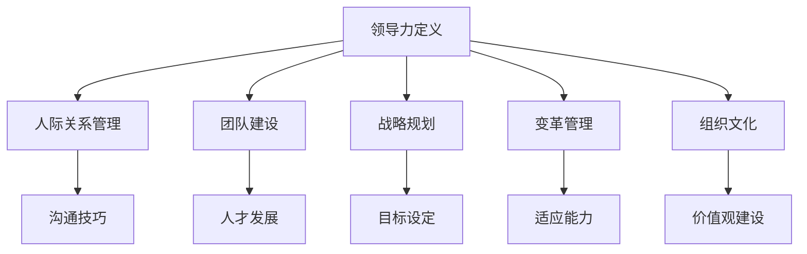
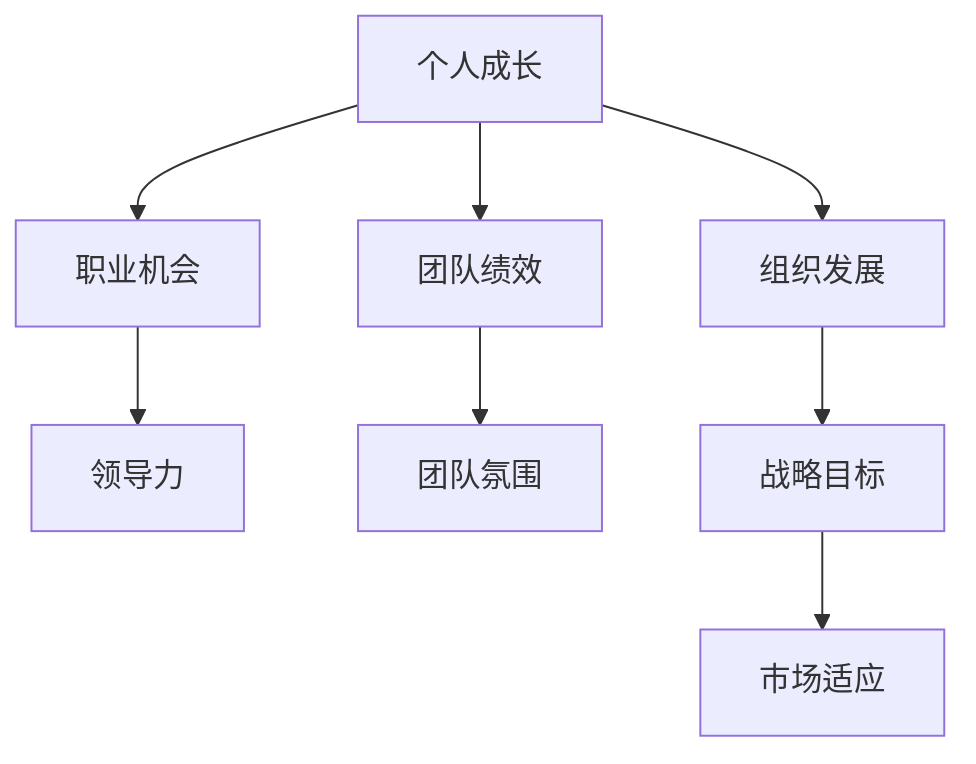
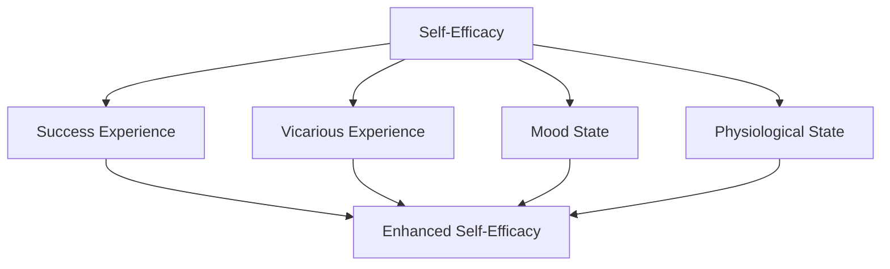
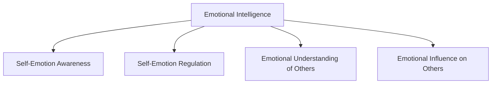
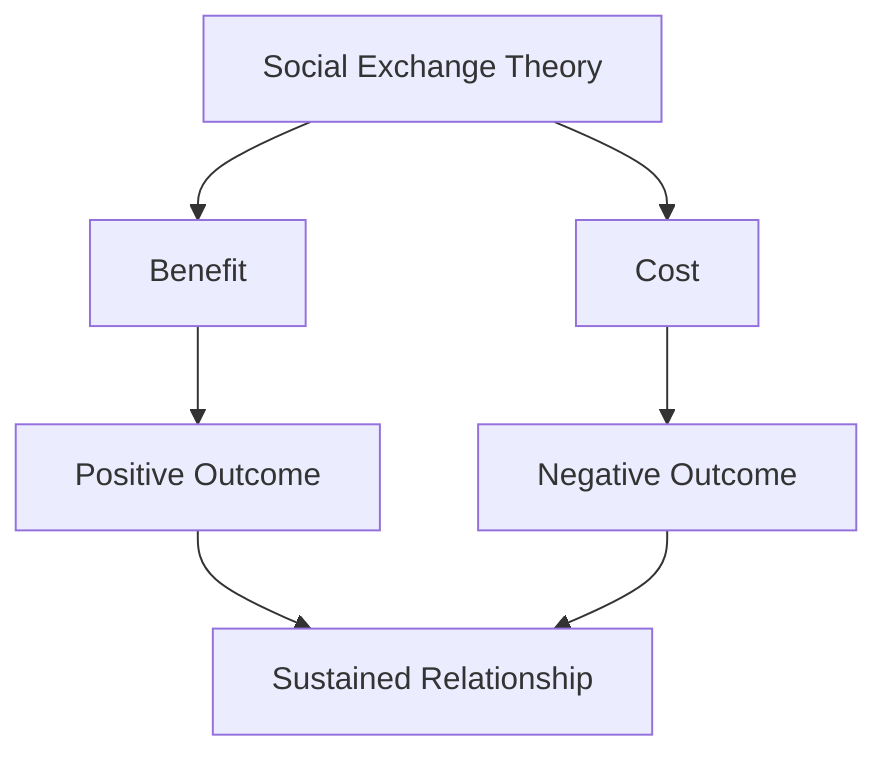
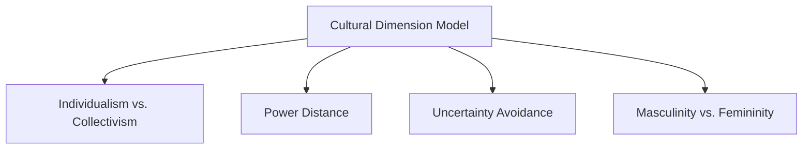

                 

### 文章标题

《领导力修炼日记：一个小工的蜕变之旅》

关键词：领导力、个人成长、团队建设、战略规划、变革管理、组织文化

摘要：本文通过记录一位小工的领导力修炼过程，从自我认知到团队管理，再到战略决策与组织变革，全面探讨领导力的核心概念和实践方法，为读者提供一套系统化的领导力提升指南。

---

#### 目录大纲

1. **领导力的基石**
   1.1 领导力的定义与内涵
   1.2 领导力的重要性
   1.3 领导力发展的必由之路
2. **自我领导力的提升**
   2.1 自我认知与自我管理
   2.2 情绪智能在领导力中的角色
   2.3 自我成长与学习
3. **人际关系管理与团队建设**
   3.1 人际关系的重要性
   3.2 建立高效团队的方法
   3.3 领导者在团队冲突解决中的作用
4. **领导力实践篇**
   4.1 决策与战略规划
   4.2 领导力在变革中的运用
   4.3 领导力与组织文化
5. **领导力案例分析**
   5.1 案例一：一位小工的领导力成长
   5.2 案例二：危机中的领导力展现
   5.3 案例三：领导力在跨文化团队中的实践
6. **领导力的未来趋势**
   6.1 数字化时代下的领导力
   6.2 全球化视野下的领导力
   6.3 未来领导力的挑战与机遇
7. **附录**
   7.1 领导力修炼工具与方法
   7.2 领导力相关资源推荐
   7.3 参考文献

---

### 第1章：领导力的定义与内涵

领导力，简单来说，是指引导和影响他人实现共同目标的能力。这一概念看似简单，但其内涵却极为丰富。领导力不仅仅涉及个人素质和技能，还涉及到人际关系、团队建设、决策制定、变革管理等复杂要素。

首先，领导力不仅仅是管理，它更是一种激励和引导他人向目标迈进的能力。一个优秀的领导者，不仅能够清晰定义目标，还需要能够调动团队的积极性，激发每个人的潜能。因此，领导力不仅仅与职位和权力相关，更与个人魅力、影响力、沟通技巧等因素紧密相连。

在技术领域，领导力的重要性同样不可忽视。随着技术的飞速发展，团队规模不断扩大，项目复杂度不断提高，领导者需要具备更强的跨部门协作能力、技术视野和战略规划能力。例如，在软件开发过程中，领导力可以帮助团队更好地理解客户需求，优化开发流程，提高产品质量。

领导力的内涵还体现在以下几个方面：

1. **人际关系管理**：领导者需要具备良好的人际沟通和协调能力，能够建立积极健康的工作关系，化解团队冲突，提升团队凝聚力。

2. **团队建设**：领导者需要关注团队的整体结构和发展，善于发现和培养人才，建立高效的团队协作模式。

3. **战略规划**：领导者需要具备前瞻性思维，能够制定明确的战略目标和计划，并指导团队执行。

4. **变革管理**：在技术变革的时代，领导者需要具备应对变革的能力，能够引导团队适应新环境，实现持续发展。

5. **组织文化**：领导者需要塑造积极向上的组织文化，为团队提供共同的价值观和行为准则，促进组织内部和谐与进步。

#### 核心概念原理之间的关系架构 Mermaid 流程图



### 第2章：领导力的重要性

领导力的重要性体现在多个方面，对个人、团队和组织都有着深远的影响。首先，对于个人而言，领导力是职业发展的关键因素之一。拥有领导力的人能够在职场中脱颖而出，获得更多的机会和挑战。领导力不仅仅是管理职位的人需要掌握的技能，它对于任何职业阶段的人都是有益的。

其次，对于团队来说，领导力是团队高效运转的核心。一个优秀的领导者能够激发团队成员的积极性，提升团队的整体绩效。领导力有助于建立良好的团队氛围，增强团队凝聚力，减少冲突和摩擦。

最后，对于组织来说，领导力是推动组织持续发展的动力。领导力能够帮助组织制定清晰的战略目标，指导团队执行，应对市场变化，保持竞争优势。

在技术领域，领导力的重要性尤为突出。技术行业变化迅速，新的技术和创新不断涌现，领导者需要具备快速学习和适应变化的能力。此外，技术团队通常由不同背景和技能的成员组成，领导者需要具备跨部门协作和沟通能力，才能有效整合资源，推动项目的成功。

#### 核心概念原理之间的关系架构 Mermaid 流程图



### 第3章：领导力发展的必由之路

要成为一名优秀的领导者，个人需要经历一系列的成长和修炼过程。这一过程不仅包括技能的提升，更涉及到自我认知和情感管理。

首先，**自我认知**是领导力发展的基础。一个优秀的领导者需要深入了解自己的优势和劣势，明确自己的价值观和目标。这可以通过**自我反思**和**心理测试**等方法来实现。例如，通过360度反馈，领导者可以了解自己在同事和下属眼中的形象，从而找到改进的方向。

其次，**情感管理**是领导力的核心。领导者需要具备良好的情绪智力，能够理解和调控自己的情绪，同时也能理解和影响他人的情绪。情感管理不仅包括自我情绪的调节，还包括与他人的情感沟通。例如，通过积极倾听和同理心，领导者可以更好地理解员工的需求和感受，从而建立更紧密的工作关系。

#### 核心算法原理讲解必须使用伪代码来详细阐述

```plaintext
Algorithm: Self-Reflection
Inputs: Leader
Outputs: Self-awareness

1. Begin
2. Leader gathers feedback from peers, subordinates, and supervisors
3. Leader analyzes feedback to identify strengths and weaknesses
4. Leader engages in regular self-reflection sessions to deepen self-awareness
5. Leader develops a personal growth plan based on self-awareness findings
6. Leader executes the growth plan and continuously assesses progress
7. End
```

#### 数学模型和公式 & 详细讲解 & 举例说明

在领导力发展中，我们可以使用心理学中的**自我效能感模型**（Self-Efficacy Model）来解释领导者如何通过持续的学习和实践来提升自己的效能感。自我效能感是指一个人对自己完成特定任务的信心程度。该模型包括以下几个关键因素：

1. **成败经验**（Success Experience）：个人的成功经验会增强自我效能感。
2. **替代性经验**（vicarious experience）：观察他人的成功经验也会提高自我效能感。
3. **情绪状态**（Mood State）：积极的情绪状态有助于提升自我效能感。
4. **生理状态**（Physiological State）：良好的身体状态会增强自我效能感。

使用Mermaid图表来表示这一模型：



举例说明，假设一个技术项目经理李明（Lee Ming）在过去的几个项目中都取得了成功，这些成功经验显著增强了他的自我效能感。此外，他还观察到了其他优秀项目经理的实践，这些替代性经验也提高了他的自我效能感。在执行新的项目时，李明保持积极的心态，并且身体状况良好，这些因素共同作用，使他的自我效能感达到了一个新的高度，从而更有信心带领团队成功完成新项目。

### 第4章：自我领导力的提升

自我领导力是领导者个人的核心能力之一，它不仅关乎个人的成长，更直接影响团队和组织的发展。提升自我领导力，需要从以下几个方面着手：

#### 4.1 自我认知与自我管理

自我认知是自我领导力的基础。领导者需要深入了解自己的性格、优势、劣势以及职业目标。这可以通过心理测试、自我反思和与他人的反馈来实现。例如，通过使用迈尔斯-布里格斯性格类型指标（MBTI），领导者可以了解自己的性格类型，从而更好地理解自己在工作中的行为模式和沟通风格。

自我管理则是在自我认知的基础上，通过设定目标和计划来管理自己的行为和情绪。例如，领导者可以制定每日、每周和每月的目标，并跟踪自己的进度。此外，领导者还需要学会情绪管理，保持积极的心态，即使在面对压力和挑战时也能保持冷静和专注。

#### 4.2 情绪智能在领导力中的角色

情绪智能是领导者自我领导力的关键组成部分。情绪智能包括自我情绪管理和情绪识别、理解和影响他人的能力。领导者需要学会如何识别和管理自己的情绪，以便在面对压力和挑战时能够保持冷静和理性。例如，领导者可以使用深呼吸、冥想等方法来缓解紧张情绪。

此外，领导者还需要具备识别和理解他人情绪的能力，以便更好地沟通和协作。例如，通过同理心，领导者可以更好地理解员工的情绪和需求，从而建立更紧密的工作关系。

#### 4.3 自我成长与学习

自我成长与学习是领导者持续提升自我领导力的关键。领导者需要不断学习新的知识和技能，以适应不断变化的工作环境和市场需求。这可以通过阅读书籍、参加培训课程、参与专业研讨会等多种方式实现。

此外，领导者还可以通过反思和总结自己的经验，不断改进自己的领导风格和方法。例如，在每次项目结束后，领导者可以回顾项目的成功和不足之处，总结经验教训，并在未来的工作中加以应用。

#### 核心算法原理讲解必须使用伪代码来详细阐述

```plaintext
Algorithm: Self-Leadership Improvement
Inputs: Leader
Outputs: Enhanced Self-Leadership

1. Begin
2. Leader conducts a self-assessment using tools like MBTI to understand personal traits and preferences
3. Leader sets SMART goals (Specific, Measurable, Achievable, Relevant, Time-bound) for personal and professional development
4. Leader tracks progress towards goals using tools like Kanban boards or project management software
5. Leader practices emotional regulation techniques such as deep breathing and meditation to manage stress
6. Leader identifies and develops emotional intelligence skills through training and practice
7. Leader engages in continuous learning by reading books, attending webinars, and participating in professional development activities
8. Leader reflects on past experiences and learns from successes and failures
9. Leader adapts leadership style and methods based on lessons learned and feedback received
10. End
```

#### 数学模型和公式 & 详细讲解 & 举例说明

为了更好地理解情绪智能在自我领导力提升中的作用，我们可以使用心理学中的**情绪智力模型**（Emotional Intelligence Model）。该模型包括以下四个关键要素：

1. **自我情绪觉察能力**（Self-Emotion Awareness）
2. **自我情绪调节能力**（Self-Emotion Regulation）
3. **理解他人情绪能力**（Emotional Understanding of Others）
4. **影响他人情绪能力**（Emotional Influence on Others）

使用Mermaid图表来表示这一模型：



举例说明，假设李明（Lee Ming）在领导一个关键项目时，他意识到自己在压力下容易变得急躁和易怒。通过反思和寻求反馈，他意识到这会影响团队成员的情绪和工作效率。于是，李明开始练习冥想和深呼吸来管理自己的情绪。同时，他通过同理心，更好地理解团队成员的情绪和需求，从而有效地提升了团队的整体情绪智力水平，项目的成功率也因此显著提高。

### 第5章：人际关系管理与团队建设

人际关系管理在领导力的实践中占据重要地位。一个成功的领导者不仅需要具备技术能力和战略眼光，还需要懂得如何处理复杂的人际关系，建立高效的团队。以下是人际关系管理和团队建设的核心要点：

#### 5.1 人际关系的重要性

人际关系是领导力的基础。良好的人际关系能够促进团队协作，提升工作效率，增强团队凝聚力。相反，不良的人际关系会导致团队分裂，影响工作效率和项目成果。因此，领导者需要高度重视人际关系的管理。

在技术领域，人际关系的重要性尤为突出。技术项目通常涉及多个部门和团队的合作，领导者需要具备强大的跨部门协调能力，以促进资源整合和信息共享。此外，技术团队成员往往拥有不同的专业背景和技能，领导者需要通过有效的人际关系管理，促进团队成员之间的沟通和协作。

#### 5.2 建立高效团队的方法

建立高效团队是领导者的一项重要任务。以下是几个关键步骤：

1. **明确团队目标**：领导者需要与团队成员共同明确团队的目标和期望，确保团队成员对项目有清晰的理解和认同。

2. **分工与协作**：根据团队成员的技能和特长，合理分配任务，并鼓励团队成员之间的协作和互补。

3. **建立信任**：信任是团队高效运作的基石。领导者需要通过开放沟通、积极反馈和尊重个体差异，建立团队成员之间的信任。

4. **培养团队文化**：领导者需要塑造积极的团队文化，包括共同价值观、行为准则和团队精神，以增强团队凝聚力。

5. **激励与认可**：领导者需要通过激励措施和认可，激发团队成员的积极性和创造力，提高团队的整体绩效。

#### 5.3 领导者在团队冲突解决中的作用

团队冲突是不可避免的，但领导者需要具备有效的解决能力，以确保团队持续高效运作。以下是几个解决团队冲突的步骤：

1. **识别冲突**：领导者需要敏锐地识别团队中的潜在冲突，并了解冲突的根本原因。

2. **倾听与理解**：领导者需要倾听冲突双方的诉求，理解他们的立场和情感。

3. **调解与协调**：领导者需要通过调解和协调，帮助双方找到共同点和解决方案。

4. **建立规则与流程**：领导者需要建立明确的规则和流程，以预防未来的冲突，并确保团队运作的有序性。

5. **跟进与反馈**：领导者需要跟进冲突解决的结果，并从反馈中不断改进团队管理和沟通方式。

#### 核心算法原理讲解必须使用伪代码来详细阐述

```plaintext
Algorithm: Effective Team Management
Inputs: Leader, Team Members, Project Goals
Outputs: High-Performance Team

1. Begin
2. Leader and team members discuss and agree on project goals
3. Leader analyzes team member skills and assigns tasks accordingly
4. Leader establishes regular communication channels for team updates
5. Leader fosters a culture of trust and collaboration through open communication
6. Leader provides incentives and recognition for team achievements
7. Leader mediates conflicts as they arise, ensuring fair and unbiased resolutions
8. Leader reviews team performance and adjusts team management strategies based on feedback
9. End
```

#### 数学模型和公式 & 详细讲解 & 举例说明

为了更好地理解团队绩效与人际关系管理之间的关系，我们可以使用社会心理学中的**社会交换理论**（Social Exchange Theory）。该理论认为，个体之间的互动是基于互惠原则的，个体在评估关系时会考虑收益和成本的平衡。以下是社会交换理论的简化模型：



举例说明，假设一个技术团队正在开发一款新产品。团队成员小张（Xiao Zhang）和小李（Li Lei）之间出现了一些分歧，小张认为小李的任务分配不公，而小李则认为小张的进度较慢。这种人际关系的紧张可能会导致团队绩效的下降。为了解决这个问题，领导者可以采用以下步骤：

1. **识别问题**：领导者通过观察和沟通，识别出小张和小李之间的冲突。

2. **收益与成本分析**：领导者与小张和小李分别交谈，了解他们各自的诉求和感受，分析冲突的收益和成本。

3. **调解与协调**：领导者通过调解和协调，帮助小张和小李找到共同点和解决方案，如重新分配任务或调整进度目标。

4. **反馈与改进**：领导者跟进冲突解决的结果，并从反馈中学习，改进团队管理和沟通方式，以防止类似冲突再次发生。

通过上述步骤，领导者可以有效管理团队的人际关系，提高团队绩效，促进项目的成功。

### 第6章：决策与战略规划

在领导力的实践中，决策和战略规划是两个至关重要的环节。优秀的决策能力和全面的战略规划能够为组织带来持续的竞争优势。以下是关于这两个核心主题的详细探讨：

#### 6.1 决策模型与方法

决策模型是领导者制定决策的理论基础。常见的决策模型包括：

1. **理性决策模型**：该模型假设决策者在充分信息的情况下，通过逻辑推理和计算，选择最优方案。

2. **有限理性决策模型**：考虑到实际中信息不完全、时间有限等因素，决策者只能在有限信息下做出决策。

3. **启发式决策模型**：基于经验、直觉和简单规则，决策者快速做出决策。

在实际操作中，领导者通常结合多种决策模型，以应对不同的决策情境。以下是一个简化的决策流程伪代码：

```plaintext
Algorithm: Decision-Making Process
Inputs: Leader, Problem, Alternatives, Constraints
Outputs: Chosen Alternative

1. Begin
2. Gather all relevant information about the problem
3. Evaluate the alternatives against predefined criteria
4. If information is complete and time allows:
    a. Use rational decision model to select the best alternative
5. If information is limited or time is constrained:
    a. Use heuristic decision model to select an alternative
6. Assess the risks and potential outcomes of the chosen alternative
7. Implement the decision and monitor the results
8. End
```

#### 6.2 战略规划与执行

战略规划是组织长期发展的指导方针，它为组织提供了清晰的方向和目标。战略规划通常包括以下几个关键步骤：

1. **愿景和使命定义**：明确组织的长期愿景和使命，为战略规划提供基础。

2. **环境分析**：评估外部环境和内部资源，确定组织的优势和劣势。

3. **目标设定**：根据愿景和使命，设定可量化的短期和长期目标。

4. **策略选择**：制定实现目标的策略，包括资源分配、市场定位等。

5. **执行计划**：制定详细的执行计划，包括时间表、责任人、预算等。

6. **监控与调整**：在执行过程中，持续监控战略目标的实现情况，并根据实际情况进行调整。

以下是一个简化的战略规划流程伪代码：

```plaintext
Algorithm: Strategic Planning
Inputs: Leader, Vision, Mission, Environmental Analysis
Outputs: Strategic Plan

1. Begin
2. Define the organization's vision and mission
3. Conduct an environmental analysis to identify strengths, weaknesses, opportunities, and threats (SWOT)
4. Set short-term and long-term goals aligned with the vision and mission
5. Develop strategies to achieve the goals, including resource allocation and market positioning
6. Create a detailed implementation plan with timelines, responsibilities, and budgets
7. Establish a monitoring and feedback system to track progress and make adjustments as needed
8. End
```

#### 6.3 风险管理与危机应对

在决策和战略规划过程中，风险管理和危机应对是不可或缺的一环。以下是几个关键步骤：

1. **识别风险**：评估项目或决策可能面临的风险，包括技术风险、市场风险、法律风险等。

2. **风险评估**：对识别出的风险进行评估，确定其可能性和影响程度。

3. **风险缓解**：制定风险缓解措施，包括风险规避、风险转移、风险接受等。

4. **危机管理**：在危机发生时，迅速响应，采取有效的危机管理措施，减少损失。

以下是一个简化的风险管理流程伪代码：

```plaintext
Algorithm: Risk Management
Inputs: Leader, Project, Identified Risks
Outputs: Risk Mitigation Plan

1. Begin
2. Identify potential risks associated with the project
3. Assess the likelihood and impact of each risk
4. Develop risk mitigation strategies for high-impact risks
5. Implement risk mitigation measures
6. Monitor risk indicators and update mitigation strategies as needed
7. In case of a crisis, initiate crisis management protocols
8. End
```

#### 核心算法原理讲解必须使用伪代码来详细阐述

在决策过程中，我们可以使用**决策树**（Decision Tree）模型来表示不同的决策路径和可能的后果。以下是一个简化的决策树伪代码：

```plaintext
Algorithm: Decision Tree
Inputs: Decision Node, Alternatives, Probabilities, Outcomes
Outputs: Selected Alternative

1. Begin
2. Define the decision node and its possible alternatives
3. For each alternative:
    a. Calculate the expected value (EV) using probabilities and outcomes
    b. Compare EVs to select the best alternative
4. Implement the selected alternative
5. Monitor the results and update the decision tree as new information becomes available
6. End
```

例如，假设领导者需要决定是否投资一个新项目。项目有两种可能的结局：成功和失败。成功的概率是0.6，预期收益是100万；失败的概率是0.4，预期损失是20万。以下是如何使用决策树来选择最佳方案：

```plaintext
Decision Node: Invest in New Project
    Alternative 1: Invest
        Probability: 0.6
        Outcome: 100万
        Expected Value (EV): 60万
    Alternative 2: Do Not Invest
        Probability: 0.4
        Outcome: -20万
        Expected Value (EV): -8万
    Best Alternative: Invest (EV: 60万)
```

通过计算预期价值，领导者可以做出基于数据的理性决策。

### 第7章：领导力在变革管理中的运用

在快速变化的时代，领导力在变革管理中的运用变得尤为重要。有效的变革管理不仅能够帮助组织适应外部环境的变化，还能够激发团队的创造力和创新能力。以下是关于领导力在变革管理中的核心应用：

#### 7.1 变革领导力的要素

变革领导力是领导者引导组织和管理变革的能力。它包括以下几个关键要素：

1. **愿景和目标**：领导者需要明确变革的愿景和目标，使团队成员理解变革的必要性和方向。

2. **沟通和参与**：领导者需要通过有效的沟通和参与机制，确保团队成员对变革的理解和支持。

3. **变革管理团队**：领导者需要建立专门的变革管理团队，负责规划和执行变革措施。

4. **激励和认可**：领导者需要通过激励措施和认可，激发团队成员的积极性和参与度。

5. **监测和调整**：领导者需要持续监测变革的进展，并根据实际情况进行调整。

#### 7.2 领导者在变革中的角色

在变革过程中，领导者扮演着多重角色：

1. **变革的推动者**：领导者需要积极推动变革，克服阻力和挑战，确保变革的顺利进行。

2. **变革的倡导者**：领导者需要倡导变革的理念和价值观，使团队成员认识到变革的必要性和重要性。

3. **变革的教练**：领导者需要指导团队成员掌握新的技能和知识，帮助他们在变革中成长。

4. **变革的监督者**：领导者需要监督变革的执行情况，确保变革目标的实现。

#### 7.3 变革过程中的团队管理

在变革过程中，团队管理变得尤为重要。以下是几个关键步骤：

1. **团队评估**：领导者需要对团队成员进行评估，了解他们的技能和意愿，为变革做好准备。

2. **技能培训**：领导者需要提供必要的培训和资源，帮助团队成员适应变革。

3. **沟通机制**：领导者需要建立有效的沟通机制，确保团队成员了解变革的进展和影响。

4. **反馈与支持**：领导者需要鼓励团队成员提供反馈，并提供必要的支持，帮助他们克服变革中的困难。

#### 核心算法原理讲解必须使用伪代码来详细阐述

为了更好地管理变革，我们可以使用**变革管理模型**（Change Management Model），如Kotter的八个步骤模型。以下是这个模型的伪代码：

```plaintext
Algorithm: Change Management Model
Inputs: Leader, Team, Change Objectives
Outputs: Successful Change Implementation

1. Begin
2. Create a sense of urgency among team members
3. Form a powerful coalition to drive the change
4. Create a clear vision for the change
5. Communicate the vision to all stakeholders
6. Empower individuals to act on the vision
7. Remove barriers to change
8. Create short-term wins to build momentum
9. Consolidate improvements and produce even more change
10. End
```

例如，假设一个技术团队正在引入敏捷开发方法。以下是该团队如何应用Kotter模型：

```plaintext
1. Create a sense of urgency: Leader identifies the benefits of Agile and the potential risks of not adopting it.
2. Form a powerful coalition: Leader gathers key team members and stakeholders to form a变革委员会。
3. Create a clear vision: Leader defines the vision of a more efficient and collaborative development process.
4. Communicate the vision: Leader holds workshops and meetings to explain Agile principles and benefits.
5. Empower individuals: Leader allows team members to experiment with Agile practices and make decisions.
6. Remove barriers: Leader removes obstacles, such as rigid project schedules, to facilitate Agile adoption.
7. Create short-term wins: Team achieves quick victories, such as delivering features in shorter iterations.
8. Consolidate improvements: Leader reviews the changes and integrates successful practices into the team's workflow.
```

通过以上步骤，领导者可以有效地引导团队实现变革，提高团队的整体效率和协作能力。

### 第8章：领导力与组织文化

组织文化是组织的灵魂，它决定了组织的氛围、价值观和行为准则。领导力在塑造和维持组织文化中起着至关重要的作用。以下是关于领导力与组织文化的详细探讨：

#### 8.1 组织文化的内涵与作用

组织文化是指组织内部的共同价值观、信念、行为准则和工作方式。它包括以下几个方面：

1. **价值观**：组织的基本信念和原则，如诚信、创新、客户至上等。
2. **行为准则**：组织成员在工作和互动中应遵循的行为规范，如尊重、公正、透明等。
3. **工作方式**：组织成员共同的工作方法和流程，如团队合作、快速响应、持续改进等。

组织文化的作用主要体现在以下几个方面：

1. **凝聚力**：共同的文化价值观和行为准则能够增强团队成员之间的凝聚力，形成团队精神。
2. **行为规范**：组织文化为成员提供了明确的行为指南，减少了冲突和不确定性。
3. **创新动力**：积极向上的组织文化能够激发成员的创新思维和创造力，推动组织发展。
4. **竞争优势**：独特的组织文化可以成为组织的核心竞争力，为组织在市场中赢得竞争优势。

#### 8.2 建立积极组织文化的策略

领导者需要采取一系列策略来建立和维持积极组织文化。以下是几个关键步骤：

1. **明确价值观**：领导者需要明确组织的核心价值观，并确保所有成员理解和认同这些价值观。
2. **领导示范**：领导者需要通过自己的行为示范组织的价值观，树立榜样作用。
3. **沟通与传播**：领导者需要通过内部沟通渠道，如会议、培训、内部刊物等，传播组织文化。
4. **激励机制**：领导者需要建立激励机制，鼓励成员践行组织价值观，并对表现优异的成员给予认可和奖励。
5. **持续改进**：领导者需要不断评估和改进组织文化，确保其与组织的战略目标和市场需求保持一致。

#### 8.3 领导者在组织文化塑造中的作用

领导者在组织文化塑造中扮演着关键角色。以下是几个方面的具体作用：

1. **价值观倡导者**：领导者需要积极倡导和传播组织的价值观，确保成员理解和认同。
2. **文化大使**：领导者需要成为组织文化的代表，通过自身行为树立良好的文化形象。
3. **变革推动者**：在组织面临变革时，领导者需要推动组织文化适应新的环境和需求。
4. **文化监督者**：领导者需要监督组织文化的实施情况，确保文化价值观在组织中得到贯彻执行。

#### 核心算法原理讲解必须使用伪代码来详细阐述

为了更好地理解领导力在组织文化塑造中的作用，我们可以使用**文化塑造模型**（Cultural Shaping Model），该模型包括以下几个关键步骤：

```plaintext
Algorithm: Cultural Shaping Model
Inputs: Leader, Organization Culture Goals
Outputs: Culturally Aligned Organization

1. Begin
2. Define the desired organizational culture and its core values
3. Leader demonstrates the desired culture through actions and decisions
4. Leader communicates the culture goals and expectations to all members
5. Leader establishes mechanisms for cultural feedback and improvement
6. Leader rewards and recognizes members who embody the desired culture
7. Leader addresses cultural issues and challenges as they arise
8. Leader continuously monitors and adjusts the culture to align with organizational goals
9. End
```

例如，假设一个技术公司的领导希望塑造一个以创新和客户为中心的文化。以下是该公司如何应用文化塑造模型：

```plaintext
1. Define desired culture: Leader defines innovation and customer focus as core values.
2. Leader demonstrates culture: Leader regularly engages in brainstorming sessions and prioritizes customer feedback.
3. Communicate goals: Leader holds meetings to explain the importance of innovation and customer satisfaction.
4. Establish feedback mechanisms: Leader creates a suggestion box and regular feedback channels for employees.
5. Reward and recognition: Leader recognizes and rewards teams that deliver innovative solutions and exceed customer expectations.
6. Address cultural issues: Leader resolves conflicts and promotes collaboration to maintain a positive culture.
7. Monitor and adjust: Leader regularly assesses the culture and makes adjustments to keep it aligned with company goals.
```

通过上述步骤，领导者可以有效地塑造和维护积极向上的组织文化，为组织的长期发展奠定坚实基础。

### 第9章：领导力成功案例分析

在本章节中，我们将通过三个具体的案例，深入探讨领导力在不同情境下的应用和效果。这些案例不仅展示了领导力在实践中的多样性和灵活性，还提供了宝贵的经验和教训。

#### 9.1 案例一：一位小工的领导力成长

在这个案例中，我们将跟随张伟（Zhang Wei）的成长历程，探讨他从一名普通技术小工到优秀领导者的转变。

**背景介绍**：

张伟是一名拥有计算机科学背景的程序员，在某知名互联网公司工作。起初，他主要负责代码开发和维护工作。在工作中，张伟展现出了出色的技术能力和团队合作精神，但缺乏领导经验。

**核心概念与联系**：

张伟的领导力成长主要涉及以下几个方面：

1. **自我认知**：张伟通过自我反思和他人反馈，认识到自己在领导力方面的不足，并制定了个人成长计划。
2. **持续学习**：张伟积极参加领导力培训课程，阅读相关书籍，并主动向资深领导者请教。
3. **实践应用**：张伟在项目中尝试应用所学知识，逐步提升自己的领导能力。

**核心算法原理讲解必须使用伪代码来详细阐述**：

```plaintext
Algorithm: Zhang Wei's Leadership Growth

1. Begin
2. Zhang Wei conducts a self-assessment to identify areas for improvement
3. Zhang Wei sets SMART goals for personal leadership development
4. Zhang Wei attends leadership training workshops and reads relevant books
5. Zhang Wei applies leadership principles in real project scenarios
6. Zhang Wei receives feedback from peers and supervisors
7. Zhang Wei iterates on his leadership approach based on feedback
8. End
```

**数学模型和公式 & 详细讲解 & 举例说明**：

为了更好地理解张伟的领导力成长，我们可以使用**自我效能感模型**（Self-Efficacy Model）。该模型包括以下几个关键要素：

1. **成败经验**（Success Experience）
2. **替代性经验**（vicarious experience）
3. **情绪状态**（Mood State）
4. **生理状态**（Physiological State）

使用Mermaid图表表示该模型：


举例说明，张伟在领导一个新项目时，通过成功完成项目目标，积累了丰富的成败经验。同时，他观察了其他优秀领导者的实践，获得了替代性经验。在项目过程中，张伟保持积极的心态和良好的身体状态，这些因素共同作用，显著提升了他的自我效能感，使他能够更加自信地面对挑战。

**项目实战**：

在项目实战中，张伟通过以下步骤提升领导力：

1. **明确目标**：张伟与团队成员共同明确项目目标，确保每个人对项目有清晰的理解和认同。
2. **分工与协作**：根据团队成员的技能和特长，合理分配任务，并鼓励团队成员之间的协作和互补。
3. **沟通与反馈**：张伟建立定期沟通机制，确保团队成员之间的信息共享和协作畅通。同时，他鼓励团队成员提出反馈和建议，及时解决问题。
4. **激励与认可**：张伟通过奖励和认可，激发团队成员的积极性和创造力，提高团队的整体绩效。

**代码应用解读与分析**：

为了更好地管理项目，张伟采用了敏捷开发方法。以下是敏捷开发的核心原则：

1. **个体和互动重于过程与工具**：强调团队成员的沟通和合作，以实现项目目标。
2. **可工作的软件重于详尽的文档**：注重实际交付的可工作的软件，而不是过多的文档。
3. **客户合作重于合同谈判**：与客户保持紧密合作，确保项目的需求满足和客户满意度。
4. **响应变化重于遵循计划**：灵活应对项目中的变化，确保项目能够快速响应市场需求。

张伟通过这些原则，成功领导团队完成了多个项目，取得了显著的成绩。

**实际案例分析和详细讲解剖析**：

张伟的领导力成长过程证明了领导力不仅仅是职位和权力的象征，更是个人能力和素养的体现。通过自我认知、持续学习和实践应用，张伟逐步提升了自己的领导能力，为团队和组织的发展做出了重要贡献。

**项目小结**：

通过张伟的领导力成长案例，我们可以得出以下几点结论：

1. **领导力是可以通过学习和实践不断提升的**。
2. **自我认知和持续学习是领导力成长的关键**。
3. **实践应用是检验领导力的重要途径**。
4. **有效的沟通和反馈机制是领导力成功的关键因素**。

张伟的成功经验为其他技术领域的领导者提供了宝贵的启示和借鉴。

### 9.2 案例二：危机中的领导力展现

在这个案例中，我们将探讨李华（Li Hua）在面临企业危机时的领导力展现。李华是一家大型制造企业的CEO，在一次严重的生产事故后，他带领团队应对危机，最终成功恢复了企业的声誉和运营。

**背景介绍**：

李华的企业在一次生产过程中发生了严重的设备故障，导致大量产品损坏，生产停滞，直接影响了企业的运营和客户信任。这场危机给企业带来了巨大的财务损失和声誉风险。

**核心概念与联系**：

李华的领导力在危机管理中体现了以下几个核心概念：

1. **快速响应**：领导者需要迅速识别危机并采取行动，以控制事态发展。
2. **透明沟通**：领导者需要与所有利益相关者保持透明沟通，确保信息的准确传递。
3. **团队协作**：领导者需要团结团队，共同应对危机，确保资源的有效配置。
4. **持续改进**：领导者需要从危机中吸取教训，持续改进企业的管理流程。

**核心算法原理讲解必须使用伪代码来详细阐述**：

```plaintext
Algorithm: Crisis Management

1. Begin
2. Leader identifies the crisis and assesses its impact
3. Leader establishes a crisis response team
4. Leader communicates the crisis and its impact to all stakeholders
5. Leader coordinates with internal and external resources to manage the crisis
6. Leader implements immediate measures to mitigate damage and control the situation
7. Leader conducts a root cause analysis to identify the underlying issues
8. Leader develops and implements a recovery plan
9. Leader monitors the recovery process and makes adjustments as needed
10. Leader communicates the lessons learned and ensures continuous improvement
11. End
```

**数学模型和公式 & 详细讲解 & 举例说明**：

为了更好地理解危机管理，我们可以使用**决策树**（Decision Tree）模型来表示危机处理的不同决策路径。以下是简化的决策树伪代码：

```plaintext
Algorithm: Decision Tree for Crisis Management

1. Begin
2. Define the crisis situation and potential outcomes
3. For each possible action:
    a. Calculate the potential impact and probability of success
    b. Evaluate the expected value (EV) of each action
    c. Select the action with the highest EV
4. Implement the selected action
5. Monitor the outcomes and adjust the strategy as needed
6. End
```

举例说明，李华在危机管理中面临以下决策：

1. **立即停产检查**：评估损失进一步扩大的风险。
2. **继续生产并采取临时措施**：评估对客户交付的影响。
3. **与供应商协调替代方案**：评估供应链的稳定性。

通过决策树分析，李华选择了立即停产检查，并启动了紧急维修程序，成功避免了更大的损失。

**项目实战**：

在危机处理过程中，李华采取了以下措施：

1. **紧急会议**：立即召开高层管理会议，评估危机影响并制定应对策略。
2. **沟通与协作**：与政府部门、供应商、客户保持紧密沟通，确保信息的透明和协作。
3. **资源调配**：调动内部资源，组织维修团队，确保设备的尽快恢复。
4. **客户支持**：制定客户支持计划，提供赔偿和服务解决方案，恢复客户信任。

**代码应用解读与分析**：

为了提高危机应对的效率，李华采用了敏捷项目管理方法。以下是敏捷项目管理的核心原则：

1. **客户满意至上**：始终将客户需求放在首位，确保客户满意度。
2. **迭代开发**：分阶段交付可工作的软件，及时反馈和调整。
3. **团队协作**：强调跨职能团队的协作，提高响应速度和效率。
4. **持续改进**：不断评估和改进项目管理流程，提高项目成功率。

李华通过这些原则，成功带领团队恢复了生产，并赢得了客户和供应商的信任。

**实际案例分析和详细讲解剖析**：

李华在危机中的领导力展现，展示了领导者如何在压力下保持冷静，迅速响应，团结团队，共同应对挑战。他的决策和行动不仅成功解决了危机，还提高了企业的危机应对能力和管理水平。

**项目小结**：

通过李华的危机管理案例，我们可以得出以下几点结论：

1. **快速响应是危机管理的核心**。
2. **透明沟通是建立信任的关键**。
3. **团队协作是应对挑战的重要保障**。
4. **持续改进是提升危机应对能力的必由之路**。

李华的成功经验为其他企业在面临危机时提供了宝贵的借鉴和启示。

### 9.3 案例三：领导力在跨文化团队中的实践

在这个案例中，我们将探讨王刚（Wang Gang）如何领导一个跨文化团队，实现项目的成功。

**背景介绍**：

王刚是一家跨国公司的项目经理，负责领导一个由不同国家和文化背景的员工组成的团队，共同完成一项重要的国际项目。团队成员来自欧洲、亚洲和北美，拥有不同的语言、文化和工作习惯。

**核心概念与联系**：

王刚的领导力在跨文化团队中体现了以下几个核心概念：

1. **文化意识**：领导者需要具备文化意识，理解并尊重团队成员的文化差异。
2. **沟通技巧**：领导者需要掌握有效的跨文化沟通技巧，确保信息的准确传递和团队协作。
3. **团队建设**：领导者需要通过有效的团队建设活动，增强团队的凝聚力和合作精神。
4. **冲突管理**：领导者需要具备冲突管理能力，化解团队内部的矛盾和分歧。

**核心算法原理讲解必须使用伪代码来详细阐述**：

```plaintext
Algorithm: Leading a Cross-Cultural Team

1. Begin
2. Leader identifies cultural differences and communicates them to the team
3. Leader establishes a common communication framework, including language and communication tools
4. Leader organizes team-building activities to foster team cohesion
5. Leader conducts regular team meetings to ensure effective communication and collaboration
6. Leader addresses conflicts through open dialogue and mediation
7. Leader encourages cultural exchange and learning among team members
8. Leader adapts leadership style to match cultural preferences and working styles of team members
9. Leader continuously assesses team performance and makes necessary adjustments
10. End
```

**数学模型和公式 & 详细讲解 & 举例说明**：

为了更好地理解跨文化团队管理，我们可以使用**文化维度模型**（Cultural Dimension Model），如Hofstede的文化维度理论。该模型包括以下几个关键维度：

1. **个体主义与集体主义**（Individualism vs. Collectivism）
2. **权力距离**（Power Distance）
3. **不确定性规避**（Uncertainty Avoidance）
4. **价值观的男性化与女性化**（Masculinity vs. Femininity）

使用Mermaid图表表示该模型：



举例说明，王刚在领导一个跨国团队时，注意到团队成员来自不同文化背景，例如：

- 来自亚洲的团队成员倾向于集体主义，注重团队合作和集体荣誉。
- 来自欧洲的团队成员倾向于个体主义，更关注个人成就和自主决策。
- 来自北美的团队成员对不确定性规避较低，更愿意接受变化和创新。

王刚通过了解这些文化差异，调整了管理策略，例如：

1. **鼓励团队合作**：针对集体主义倾向，王刚组织了团队建设活动，增强团队凝聚力。
2. **授权与支持**：针对个体主义倾向，王刚给予团队成员更多的自主权，鼓励他们提出创新方案。
3. **沟通方式**：王刚采用了多元化的沟通方式，如视频会议和即时通讯工具，确保信息传递的及时性和准确性。

**项目实战**：

在项目管理过程中，王刚采取了以下措施：

1. **明确目标与期望**：王刚与团队成员共同明确项目目标，确保每个人对项目有清晰的理解和认同。
2. **文化敏感性培训**：王刚组织了文化敏感性培训，帮助团队成员了解和尊重彼此的文化差异。
3. **跨文化沟通**：王刚建立了跨文化沟通机制，确保团队成员之间的信息共享和协作。
4. **个性化管理**：王刚根据团队成员的文化偏好和个性特点，调整了管理策略，提高了团队的工作效率和满意度。

**代码应用解读与分析**：

为了提高项目管理的效率，王刚采用了敏捷开发方法。以下是敏捷开发的核心原则：

1. **客户合作重于合同谈判**：强调与客户的紧密合作，确保项目需求满足和客户满意度。
2. **迭代开发**：分阶段交付可工作的软件，及时反馈和调整。
3. **团队协作**：强调跨职能团队的协作，提高响应速度和效率。
4. **持续改进**：不断评估和改进项目管理流程，提高项目成功率。

王刚通过这些原则，成功带领团队完成了多个国际项目，取得了显著的成绩。

**实际案例分析和详细讲解剖析**：

王刚在跨文化团队中的领导力实践，展示了领导者如何在多元文化背景下，通过文化意识、沟通技巧、团队建设和冲突管理，实现团队的高效协作和项目的成功。

**项目小结**：

通过王刚的跨文化团队管理案例，我们可以得出以下几点结论：

1. **文化意识是跨文化团队管理的关键**。
2. **有效的沟通技巧是团队协作的保障**。
3. **团队建设是增强团队凝聚力的重要手段**。
4. **冲突管理是维持团队和谐稳定的关键**。

王刚的成功经验为其他跨国企业的领导者提供了宝贵的借鉴和启示。

### 第10章：领导力的未来趋势

随着技术的不断进步和社会的快速变化，领导力的未来趋势也在不断演变。以下是关于领导力未来趋势的探讨：

#### 10.1 数字化时代下的领导力

在数字化时代，领导力需要适应新的技术环境和商业模式。以下是几个关键趋势：

1. **数字化转型**：领导者需要具备数字化转型的战略眼光和执行力，推动组织向数字化方向转型。
2. **数据驱动决策**：领导者需要利用数据分析和人工智能技术，做出更准确和高效的决策。
3. **敏捷管理**：领导者需要采用敏捷管理方法，快速响应市场变化和客户需求。

#### 10.2 全球化视野下的领导力

全球化带来了多元化的挑战和机遇。以下是几个关键趋势：

1. **跨文化领导**：领导者需要具备跨文化沟通和协作能力，管理多元文化团队。
2. **全球视野**：领导者需要具备全球视野，了解不同国家和地区的市场环境和商业规则。
3. **国际化战略**：领导者需要制定国际化战略，拓展全球市场和业务。

#### 10.3 未来领导力的挑战与机遇

未来领导力面临以下挑战和机遇：

1. **技术变革**：领导者需要适应新技术带来的变革，如人工智能、区块链等。
2. **社会变迁**：领导者需要应对社会变迁带来的挑战，如人口老龄化、远程工作等。
3. **可持续发展**：领导者需要关注可持续发展，推动组织的绿色发展和社会责任。

#### 核心算法原理讲解必须使用伪代码来详细阐述

为了探讨未来领导力的趋势，我们可以使用**人工智能决策模型**（AI Decision Model），该模型利用人工智能技术，帮助领导者做出更明智的决策。以下是简化的人工智能决策模型伪代码：

```plaintext
Algorithm: AI Decision Model
Inputs: Leader, Problem, Data, Algorithms
Outputs: Decision

1. Begin
2. Leader defines the problem and collects relevant data
3. Leader selects appropriate AI algorithms for data analysis
4. AI algorithms process the data and generate insights
5. Leader analyzes the insights and determines the best course of action
6. Leader implements the decision and monitors the outcomes
7. Leader iterates on the decision process based on feedback and new data
8. End
```

例如，假设一位领导者需要决定是否投资一个新项目，可以使用以下步骤：

1. **定义问题**：领导者明确投资项目的目标和潜在风险。
2. **收集数据**：领导者收集关于市场趋势、竞争对手、客户需求等方面的数据。
3. **选择算法**：领导者选择合适的机器学习算法，如线性回归、决策树等，对数据进行建模和分析。
4. **分析数据**：AI算法分析数据，提供关于投资回报、风险等方面的预测和评估。
5. **做出决策**：领导者根据分析结果，做出投资决策。
6. **实施与监测**：领导者实施决策，并持续监测项目进展和结果，根据反馈调整决策。

通过上述步骤，领导者可以更好地适应未来领导力的挑战和机遇。

### 附录

#### 附录A：领导力修炼工具与方法

为了帮助读者更好地提升领导力，以下是一些实用的工具和方法：

1. **360度反馈**：通过收集同事、下属和上级的反馈，全面了解自己的领导力表现。
2. **领导力评估工具**：如迈尔斯-布里格斯性格类型指标（MBTI）、领导力素质评估（LSI）等。
3. **自我反思日志**：定期记录自己的领导经历，反思成功和失败，总结经验教训。
4. **领导力模型学习**：学习并应用各种领导力模型，如情境领导力模型、变革领导力模型等。
5. **领导力培训课程**：参加专业的领导力培训课程，提升领导力和管理技能。

#### 附录B：领导力相关资源推荐

为了进一步丰富读者的知识，以下是一些建议的领导力相关资源：

1. **书籍**：《领导力五要素》（The Five Dysfunctions of a Team）作者：Patrick Lencioni
2. **视频课程**：Coursera上的《领导力与影响力》（Leadership and Influence）课程
3. **专业组织**：国际领导力发展协会（International Leadership Association，ILA）
4. **在线论坛**：LinkedIn上的领导力专业群组
5. **杂志**：《哈佛商业评论》中的领导力专题

#### 附录C：参考文献

1. Kotter, J. P. (1996). Leading Change. Harvard Business Press.
2. Lencioni, P. (2002). The Five Dysfunctions of a Team. Jossey-Bass.
3. Hofstede, G. (1980). Culture's Consequences: International Differences in Work-Related Values. Sage Publications.
4. Bass, B. M., & Avolio, B. J. (1994). Improving Organizational Effectiveness Through Self-Leadership and Transformational Leadership. Journal of Management, 20(5), 609-636.
5. Northouse, P. G. (2018). Leadership: Theory and Practice. Sage Publications.

