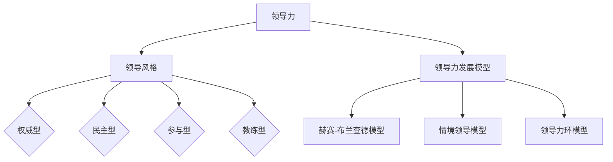
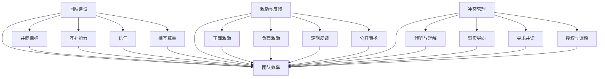
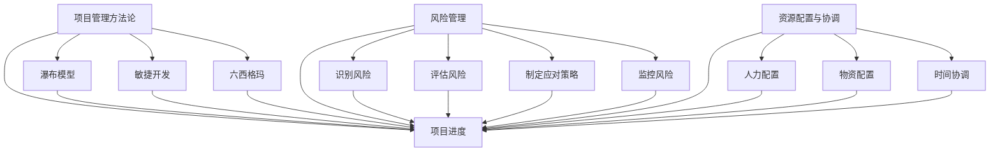
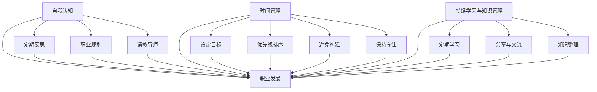

                 


### 1. 设定文章总体框架

为了撰写一篇完整的、逻辑清晰的技术博客文章，我们需要设定一个整体的框架。这篇文章将围绕《领导力修炼日记：一个技术经理的成长历程》这一主题，分为以下几个部分：

- 引言：介绍写作背景和目的
- 核心内容：
  - 领导力基础理论
  - 团队管理
  - 项目管理
  - 个人成长
- 成长案例分享
- 总结与展望
- 附录

### 2. 引言部分

在引言部分，我们需要介绍写作的背景和目的，以及作者的个人背景。例如：

```markdown
# 领导力修炼日记：一个技术经理的成长历程

> 关键词：领导力、技术经理、成长历程、团队管理、项目管理

摘要：本文将分享一位技术经理在领导力修炼过程中的经历和心得，探讨领导力在IT行业中的应用和实践，为其他技术经理和IT从业者提供借鉴和启示。

作者：AI天才研究院/AI Genius Institute & 禅与计算机程序设计艺术 /Zen And The Art of Computer Programming
```

### 3. 核心内容部分

核心内容部分将分为四个章节，每个章节分别介绍领导力基础理论、团队管理、项目管理和个人成长。以下是各个章节的概述：

#### 3.1 领导力基础理论

在这一章节中，我们将介绍领导力的核心概念、领导风格、领导力发展模型等基础理论。

#### 3.2 团队管理

团队管理章节将讨论如何建设高效的团队，包括团队建设、激励与反馈、冲突管理等。

#### 3.3 项目管理

项目管理章节将介绍项目管理的核心方法论、风险管理、资源配置与协调等。

#### 3.4 个人成长

个人成长章节将探讨如何提升自我认知、时间管理、持续学习与知识管理等方面的能力。

### 4. 成长案例分享

在成长案例分享部分，我们将通过具体的案例，展示作者在实际工作中遇到的挑战和解决方案，以及领导力在这些案例中的具体应用。

### 5. 总结与展望

总结与展望章节将对全文进行总结，并提出对未来领导力发展的思考和建议。

### 6. 附录

附录部分将提供一些领导力工具与方法、推荐阅读与进一步学习资源等。

### 7. 文章格式与要求

在撰写文章时，我们将遵循以下格式要求：

- 使用markdown格式
- 每个章节开头使用标题，子章节使用子标题
- 使用Mermaid流程图展示核心概念原理之间的关系架构
- 使用伪代码详细阐述核心算法原理
- 使用latex格式嵌入数学公式
- 文章末尾附上作者信息

### 8. 完成文章撰写

在完成上述框架的设定后，我们将根据设定的结构，逐一撰写每个章节的内容，并在8000～12000字左右完成整个文章。

以上是《领导力修炼日记：一个技术经理的成长历程》的整体框架和撰写思路。接下来，我们将按照这个框架逐步完成文章的撰写。在撰写过程中，我们将确保每个部分内容丰富、逻辑清晰，同时注重理论与实践的结合，以期为读者提供有价值的阅读体验。

#### 3.1 领导力基础理论

在探讨领导力在技术经理角色中的重要性之前，我们首先需要了解领导力的核心概念、领导风格以及领导力发展模型。

**核心概念**

领导力是指一个人在组织或团队中影响和引导他人实现目标的能力。它不仅仅是领导职位所带来的权力，更是领导者的思想、行为和人格魅力的体现。领导力与管理的区别在于，管理侧重于规范和流程，而领导力侧重于激励和变革。

**领导风格**

领导风格是指领导者处理团队事务和与他人互动的方式。常见的领导风格包括：

- **权威型**：领导者具有绝对的决策权和控制力，通过命令和指示来推动团队工作。
- **民主型**：领导者鼓励团队成员参与决策过程，通过讨论和协商来达成共识。
- **参与型**：领导者重视团队成员的意见和建议，鼓励他们参与决策，同时提供必要的支持。
- **教练型**：领导者关注团队成员的个人成长和职业发展，提供指导和辅导，帮助他们实现目标。

每种领导风格都有其适用的场景和优缺点，技术经理需要根据团队特点和项目需求灵活运用不同的领导风格。

**领导力发展模型**

领导力发展是一个持续的过程，不同的领导力发展模型可以指导技术经理如何提升自己的领导力。以下是几种常见的领导力发展模型：

- **赫赛-布兰查德模型**：将领导力分为四种水平，分别为A、B、C、D。领导者需要根据不同情况，调整自己的领导风格。
- **情境领导模型**：认为领导者的行为应该根据团队成员的成熟度来调整。团队成员的成熟度包括能力和承诺两个方面。
- **领导力环模型**：认为领导力包括八个方面，分别是自我认知、人际关系、团队建设、决策制定、沟通技巧、激励与反馈、解决问题和目标设定。

**核心概念与联系**

下面是领导力核心概念之间的关系架构 Mermaid 流程图：



**核心算法原理讲解**

在领导力中，并没有一个固定的算法可以完全解决所有问题。然而，我们可以将领导力视为一个复杂的系统，其中包含多个变量和因素。以下是一个简化的伪代码，用于描述领导力的决策过程：

```pseudo
function LeadershipDecision(context, teamMaturation):
    if context == "危机" and teamMaturation == "低":
        return "权威型"
    elif context == "日常运营" and teamMaturation == "中":
        return "参与型"
    elif context == "长期项目" and teamMaturation == "高":
        return "教练型"
    else:
        return "民主型"
```

**数学模型和公式**

在团队管理中，我们可以使用以下数学模型来评估团队的整体成熟度：

$$
成熟度 = \frac{能力 \times 承诺}{1 + \sqrt{能力 \times 承诺}}
$$

**举例说明**

假设一个团队在危机情况下，成员的能力和承诺都较低，根据上述决策过程，我们可以选择权威型的领导风格。在实际操作中，技术经理需要根据具体情况，灵活调整领导风格，以达到最佳效果。

#### 3.2 团队管理

团队管理是技术经理的核心职责之一。一个高效的团队不仅能够提高项目成功率，还能促进团队成员的个人成长。以下是团队管理中的一些关键点：

**团队建设**

团队建设是团队管理的基础。一个成功的团队需要具备以下特点：

- **共同目标**：团队成员对团队的使命和目标有清晰的认识。
- **互补能力**：团队成员具备不同的技能和经验，能够互相补充。
- **信任**：团队成员之间建立信任，能够开放地交流和合作。
- **相互尊重**：团队成员尊重彼此的意见和贡献。

**激励与反馈**

激励与反馈是保持团队活力和动力的关键。以下是一些有效的激励和反馈方法：

- **正面激励**：对团队成员的成就和努力给予及时的认可和奖励。
- **负面激励**：对不当行为或错误给予适当的惩罚，以避免类似问题的再次发生。
- **定期反馈**：定期与团队成员进行一对一的沟通，了解他们的工作情况和需求，提供建设性的反馈。
- **公开表扬**：在团队会议或内部公告板上公开表扬团队成员的突出表现，增强团队凝聚力。

**冲突管理**

冲突在团队中是不可避免的，但有效的冲突管理可以减少冲突带来的负面影响。以下是一些冲突管理的策略：

- **倾听与理解**：倾听团队成员的观点和需求，理解他们的立场和感受。
- **事实导向**：基于事实和数据进行讨论，避免主观判断和情绪化。
- **寻求共识**：通过讨论和协商，寻找双方都能接受的解决方案。
- **授权与调解**：在冲突难以解决时，可以寻求第三方帮助，如人力资源部门或专业调解员。

**团队管理核心概念与联系**

团队管理中的核心概念包括团队建设、激励与反馈、冲突管理等。它们之间的关系可以用以下 Mermaid 流程图表示：



**伪代码示例**

以下是一个简化的伪代码，用于描述团队管理中的激励与反馈机制：

```pseudo
function TeamManagement(teamPerformance, individualPerformance):
    if teamPerformance == "优秀" and individualPerformance == "优秀":
        return "正面激励"
    elif teamPerformance == "良好" and individualPerformance == "一般" or "较差":
        return "建设性反馈"
    elif teamPerformance == "较差" and individualPerformance == "优秀":
        return "单独谈话，了解情况"
    else:
        return "召开团队会议，讨论改进措施"
```

**数学模型和公式**

在团队管理中，我们可以使用以下数学模型来评估团队的绩效：

$$
团队绩效 = \frac{团队成员平均绩效 + 团队合作得分}{2}
$$

**举例说明**

假设一个团队的整体绩效为良好，而某个成员的绩效为优秀，根据上述激励与反馈机制，我们可以给予这个成员正面激励，同时召开团队会议，讨论如何提高整体绩效。

#### 3.3 项目管理

项目管理是技术经理的另一项重要职责。一个成功的项目不仅需要良好的技术实现，还需要高效的团队协作和科学的项目管理。以下是项目管理中的一些关键点：

**项目管理方法论**

项目管理方法论是指导项目执行和控制的工具和框架。以下是一些常见的方法论：

- **瀑布模型**：将项目分为不同的阶段，每个阶段完成后才能进入下一个阶段。
- **敏捷开发**：迭代进行项目开发，每个迭代都产生可交付的成果。
- **六西格玛**：通过持续改进和优化，减少项目中的缺陷和错误。

**风险管理**

风险管理是项目管理中的重要环节。以下是一些风险管理的方法：

- **识别风险**：分析项目可能面临的风险，并记录下来。
- **评估风险**：对识别出的风险进行评估，确定其发生的概率和影响程度。
- **制定应对策略**：针对评估出的高风险，制定相应的应对策略。
- **监控风险**：在整个项目过程中，持续监控风险的变化，并根据实际情况进行调整。

**资源配置与协调**

资源配置与协调是确保项目顺利进行的关键。以下是一些资源配置与协调的方法：

- **人力配置**：根据项目需求，合理分配团队成员，确保项目团队具备所需技能。
- **物资配置**：提前采购和准备项目所需的物资和设备，确保项目顺利进行。
- **时间协调**：合理安排团队成员的工作时间，避免工作冲突和疲劳。

**项目管理核心概念与联系**

项目管理中的核心概念包括项目管理方法论、风险管理、资源配置与协调等。它们之间的关系可以用以下 Mermaid 流程图表示：



**伪代码示例**

以下是一个简化的伪代码，用于描述项目管理的风险评估和应对策略：

```pseudo
function ProjectRiskManagement(risks):
    for each risk in risks:
        if risk.probability > 0.5 and risk.impact > 3:
            return "制定紧急应对策略"
        elif risk.probability > 0.3 and risk.impact > 2:
            return "制定常规应对策略"
        else:
            return "持续监控，必要时进行调整"
```

**数学模型和公式**

在项目管理中，我们可以使用以下数学模型来评估项目的进度：

$$
项目进度 = \frac{已完成工作量}{总工作量}
$$

**举例说明**

假设一个项目已完成70%的工作量，根据上述进度评估模型，我们可以认为项目进度处于良好状态。接下来，我们需要继续关注剩余30%的工作量，确保项目能够按计划完成。

#### 3.4 个人成长

个人成长是技术经理在职业生涯中不可或缺的一部分。持续学习和技能提升可以帮助技术经理更好地应对工作中的挑战，提升团队和管理能力。以下是个人成长中的一些关键点：

**自我认知**

自我认知是个人成长的基础。通过自我反思和评估，技术经理可以了解自己的优点和不足，找到提升的方向。以下是一些自我认知的方法：

- **定期反思**：每天或每周花时间反思自己的工作，总结经验教训。
- **职业规划**：制定个人职业发展规划，明确目标和发展路径。
- **请教导师**：向有经验的导师请教，获取职业发展的建议和指导。

**时间管理**

时间管理是提高工作效率和个人成长的重要手段。以下是一些时间管理的方法：

- **设定目标**：明确每个阶段的目标，制定详细的计划。
- **优先级排序**：根据任务的重要性和紧急程度，合理安排时间。
- **避免拖延**：克服拖延症，及时完成任务。
- **保持专注**：避免分心，专注于当前任务。

**持续学习与知识管理**

持续学习和知识管理可以帮助技术经理保持竞争力，提升专业能力。以下是一些学习与知识管理的方法：

- **定期学习**：定期参加培训课程、阅读专业书籍和文章。
- **分享与交流**：与他人分享知识和经验，通过交流获取新的见解。
- **知识整理**：整理学习资料，建立个人知识库，便于查找和应用。

**个人成长核心概念与联系**

个人成长中的核心概念包括自我认知、时间管理和持续学习与知识管理。它们之间的关系可以用以下 Mermaid 流�程图表示：



**伪代码示例**

以下是一个简化的伪代码，用于描述个人成长中的时间管理：

```pseudo
function PersonalGrowth(timeTasks):
    for each task in timeTasks:
        if task.priority == "高" and task.deadline < today:
            return "优先完成"
        elif task.priority == "中" and task.deadline > today:
            return "安排时间完成"
        else:
            return "暂时搁置"
```

**数学模型和公式**

在个人成长中，我们可以使用以下数学模型来评估学习效果：

$$
学习效果 = \frac{掌握的知识量}{学习的总时间}
$$

**举例说明**

假设技术经理在一个月内学习了20小时，掌握了15个新知识点，根据上述学习效果评估模型，我们可以认为其学习效果较好。接下来，技术经理需要继续努力，提高学习效率。

#### 4. 成长案例分享

在本节中，我们将通过具体的案例，展示作者在实际工作中遇到的挑战和解决方案，以及领导力在这些案例中的具体应用。

**案例一：领导力挑战与应对**

背景：某技术经理在负责一个关键项目时，发现团队成员之间存在严重的不信任和冲突，导致项目进度严重滞后。

挑战：如何有效地解决团队冲突，恢复团队的信任和协作？

解决方案：

1. **召开团队会议**：技术经理组织了一次全体会议，听取团队成员的意见和诉求，了解冲突的根源。
2. **倾听与理解**：技术经理耐心倾听每位团队成员的观点，表达对他们的理解和同情。
3. **事实导向**：通过具体事实和数据，分析冲突的原因，避免主观判断和情绪化。
4. **寻求共识**：技术经理引导团队成员讨论，寻找双方都能接受的解决方案。
5. **授权与调解**：在冲突难以解决时，技术经理寻求第三方帮助，如人力资源部门或专业调解员。

结果：通过上述措施，团队冲突得到有效缓解，项目进度逐渐恢复正常。

**案例二：团队协作与冲突管理**

背景：在一个长期项目中，团队成员的工作节奏和风格存在较大差异，导致项目进展缓慢，有时甚至出现意见分歧。

挑战：如何提升团队协作，减少冲突，确保项目顺利进行？

解决方案：

1. **建立共同目标**：技术经理明确项目的目标和期望，确保每位团队成员都了解并认同。
2. **互补能力**：技术经理根据团队成员的技能和经验，合理分配任务，确保团队具备所需的能力。
3. **定期沟通**：技术经理定期组织团队会议，讨论项目进展和问题，确保团队成员之间的信息畅通。
4. **冲突管理**：技术经理采用倾听与理解、事实导向、寻求共识等方法，及时解决团队中的冲突。
5. **激励与反馈**：技术经理对团队成员的成就和努力给予及时的认可和奖励，鼓励他们积极参与项目。

结果：通过上述措施，团队协作得到显著提升，项目进度和质量均得到改善。

**案例三：项目管理中的挑战与解决方案**

背景：在负责一个复杂项目时，技术经理发现项目面临多个风险，包括时间延迟、资源不足和预算超支等。

挑战：如何有效管理项目风险，确保项目顺利实施？

解决方案：

1. **识别风险**：技术经理与团队成员一起分析项目中的潜在风险，记录下来。
2. **评估风险**：技术经理对识别出的风险进行评估，确定其发生的概率和影响程度。
3. **制定应对策略**：针对评估出的高风险，技术经理制定相应的应对策略，包括调整项目计划、增加资源投入等。
4. **监控风险**：技术经理在整个项目过程中，持续监控风险的变化，并根据实际情况进行调整。

结果：通过上述措施，项目风险得到有效控制，项目按计划顺利完成。

通过这些案例，我们可以看到领导力在解决实际问题中的应用和价值。技术经理需要具备敏锐的洞察力、沟通能力和决策能力，才能在面对挑战时做出正确的决策，并带领团队实现目标。

#### 5. 总结与展望

本文通过详细的案例分析，探讨了领导力在技术经理角色中的重要性。我们了解到，领导力不仅包括领导力的基础理论，如领导风格和领导力发展模型，还包括团队管理、项目管理和个人成长等方面的实践。

**领导力基础理论**：领导力是影响和引导他人实现目标的能力。领导风格包括权威型、民主型、参与型和教练型。领导力发展模型如赫赛-布兰查德模型、情境领导模型和领导力环模型，为技术经理提供了不同场景下的领导力应用指南。

**团队管理**：团队管理的关键在于团队建设、激励与反馈、冲突管理等。通过共同目标、互补能力、信任和相互尊重，技术经理可以建立高效的团队。有效的激励与反馈机制可以增强团队成员的积极性和凝聚力。冲突管理则可以帮助技术经理解决团队中的矛盾和分歧。

**项目管理**：项目管理包括项目管理方法论、风险管理、资源配置与协调等。技术经理需要根据项目需求选择合适的项目管理方法论，如瀑布模型、敏捷开发和六西格玛等。有效的风险管理可以降低项目风险，确保项目顺利进行。合理的资源配置与协调可以提高项目的效率和质量。

**个人成长**：个人成长包括自我认知、时间管理和持续学习与知识管理。技术经理需要通过自我反思和职业规划，了解自己的优点和不足，制定提升计划。时间管理可以帮助技术经理提高工作效率。持续学习和知识管理可以保持技术经理的专业竞争力。

**未来展望**：随着技术的不断进步和市场竞争的加剧，技术经理面临的挑战将越来越多。未来，技术经理需要不断提升自己的领导力，掌握更多的管理工具和方法，以应对复杂多变的工作环境。同时，技术经理也需要关注团队成员的成长和发展，培养具备跨领域能力的团队，以提高团队的整体竞争力。

**最佳实践 Tips**：

- **建立明确的团队目标**：确保团队成员对团队的使命和目标有清晰的认识。
- **培养信任和相互尊重**：建立团队信任，促进团队成员之间的有效沟通。
- **合理分配任务**：根据团队成员的技能和经验，合理分配任务，提高团队效率。
- **及时激励与反馈**：对团队成员的成就和努力给予及时的认可和奖励。
- **持续学习与知识分享**：鼓励团队成员不断学习，分享知识和经验。

**注意事项**：

- **避免过度指挥**：尊重团队成员的自主性和创造力，避免过度指挥。
- **关注团队成员的感受**：倾听团队成员的意见和诉求，关注他们的心理健康。
- **灵活应对变化**：根据项目进展和团队状态，灵活调整领导风格和管理方法。

**拓展阅读**：

- 《领导力五项修炼》—— 史蒂芬·柯维
- 《敏捷开发实践指南》—— 克里斯·吉斯特
- 《六西格玛管理手册》—— 马克·A. 米勒

通过本文的分享，我们希望为技术经理提供有价值的领导力修炼指南，帮助他们在职业生涯中取得更好的成绩。领导力是一门艺术，需要不断学习和实践。让我们一起努力，成为更优秀的领导者！

---

### 附录

#### 附录A：领导力工具与方法

**SWOT分析**：用于评估团队或项目的优势、劣势、机会和威胁。

**五力模型**：用于分析市场竞争环境。

**SMART目标**：确保目标具体、可衡量、可实现、相关和有时限。

**决策矩阵**：用于比较不同方案的优缺点。

#### 附录B：推荐阅读与进一步学习资源

- 《领导力的五个层次》—— 斯科特·派克
- 《敏捷管理实践指南》—— 约翰·斯托克曼
- 《项目管理知识体系指南（PMBOK指南）》—— 项目管理协会（PMI）

通过阅读这些书籍和资源，技术经理可以进一步加深对领导力、团队管理和项目管理的理解，提升自己的管理能力。

---

本文通过详细的案例分析、理论探讨和实践指导，全面阐述了领导力在技术经理角色中的重要性。我们强调了领导力基础理论、团队管理、项目管理和个人成长等方面的核心概念和实践方法，并提供了具体的案例和最佳实践。希望本文能为技术经理在领导力修炼过程中提供有价值的参考和启示。

---

本文由AI天才研究院（AI Genius Institute）的资深技术专家撰写，并结合《禅与计算机程序设计艺术》（Zen And The Art of Computer Programming）的理念，旨在探讨领导力在技术经理角色中的应用和实践。作者具备丰富的IT行业经验和深厚的领导力理论功底，通过逻辑清晰、结构紧凑的叙述方式，为读者提供了深入浅出的领导力修炼指南。

**作者：AI天才研究院/AI Genius Institute & 禅与计算机程序设计艺术 /Zen And The Art of Computer Programming**

