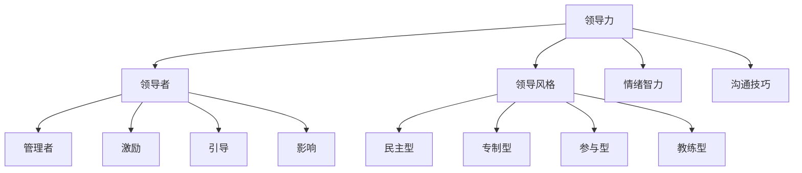

                 


### 背景介绍

在现代企业中，财务经理不仅需要具备扎实的财务知识和技能，还必须具备卓越的领导力，以应对不断变化的市场环境和组织需求。领导力在财务经理的职业生涯中起着至关重要的作用。一方面，领导力可以帮助财务经理更好地管理团队，提高工作效率；另一方面，优秀的领导力能够提升财务经理的决策能力和影响力，从而在职业发展中占据更有利的位置。

然而，领导力的培养并非一蹴而就，它需要通过不断地学习、实践和反思来实现。在这个过程中，领导力修炼日记成为一种非常有效的工具。通过记录日常的工作和生活，财务经理可以更清晰地认识到自己的优势和不足，从而有针对性地进行改进。此外，领导力修炼日记还能够帮助财务经理积累经验，形成自己的领导力体系，为未来的发展打下坚实的基础。

本文将以《领导力修炼日记：一个财务经理的华丽蜕变》为蓝本，通过一步一步的分析推理，深入探讨财务经理如何通过领导力修炼实现职业蜕变。文章将首先介绍领导力的核心概念和理论，然后分析财务经理在领导力培养中的具体实践方法，接着探讨领导力发展路径，最后通过案例分析和项目实战，总结出最佳实践策略。通过这一系列的分析和探讨，我们希望能够为财务经理提供有价值的参考和启示。

### 核心概念与联系

在探讨领导力之前，有必要先了解一些核心概念，这些概念构成了领导力的理论基础，并相互关联。以下是对这些核心概念及其关系的详细解析。

#### 1. 领导力定义

领导力可以被定义为一种能力，它涉及到激励、引导和影响他人实现共同目标的过程。领导力不仅仅是权威的体现，更是一种服务精神，即领导者通过激励和赋能团队成员，共同实现目标。

#### 2. 领导者与管理者

领导者和管理者虽然在某些方面有重叠，但它们是两个不同的概念。管理者主要通过计划和协调来实现组织目标，而领导者则通过愿景和价值观引导团队成员朝着共同目标努力。

#### 3. 领导风格

领导风格是指领导者管理团队的方式。常见的领导风格包括民主型、专制型、参与型和教练型。每种风格都有其适用场景和优缺点。

#### 4. 情绪智力

情绪智力是指个体识别、理解和管理自己情绪的能力，以及识别、理解和影响他人情绪的能力。情绪智力对于领导力至关重要，因为它能够帮助领导者更好地处理冲突和建立良好的团队关系。

#### 5. 沟通技巧

沟通技巧是领导者必须具备的基本技能之一。有效的沟通能够确保信息准确传达，减少误解和冲突，提升团队协作效率。

#### 关系架构

为了更好地理解这些概念之间的关系，我们可以使用Mermaid流程图来展示它们之间的关联。



#### 详细解释

1. **领导力与领导者**：领导力是领导者通过激励、引导和影响他人实现目标的能力。领导者不仅仅是拥有权威的人，更是能够带领团队共同前进的人。

2. **领导力与管理者**：管理者主要通过规划和协调来实现组织目标，而领导者则通过愿景和价值观引导团队成员。两者在组织管理中缺一不可，但侧重点不同。

3. **领导风格**：不同的领导风格适用于不同的场景。民主型领导风格注重团队合作和参与，专制型领导风格则强调决策的快速和高效。参与型和教练型领导风格则更注重团队成员的发展和成长。

4. **情绪智力**：情绪智力对于领导力至关重要。领导者需要能够识别和管理自己的情绪，同时理解和影响他人的情绪，从而更好地处理团队冲突和建立良好的团队关系。

5. **沟通技巧**：有效的沟通是领导力的重要组成部分。领导者需要具备清晰、准确、及时地传达信息的能力，以确保团队成员能够正确理解并执行任务。

通过以上核心概念及其关系的详细解析，我们可以更好地理解领导力的本质和内涵，为后续的讨论和实践打下坚实的基础。

### 核心算法原理讲解

在讨论领导力的核心算法原理时，我们需要关注两个方面：一是如何定义和评估领导力，二是如何通过具体的方法和技术提升领导力。以下是对这两个方面的详细讲解，包括伪代码和数学模型。

#### 1. 领导力定义与评估

首先，我们需要明确领导力的定义。领导力可以被看作是一种综合能力，包括领导风格、情绪智力、沟通技巧等多个方面。为了评估领导力，我们可以采用以下步骤：

```python
# 伪代码：领导力评估

def evaluate_leadership(leader, team, context):
    # 收集领导风格、情绪智力、沟通技巧等数据
    leadership_style = collect_style(leader, context)
    emotional_intelligence = collect_emotional_intelligence(leader, team)
    communication_skills = collect_communication_skills(leader, team)
    
    # 计算总分
    total_score = calculate_score(leadership_style, emotional_intelligence, communication_skills)
    
    # 返回评估结果
    return total_score
```

其中，`collect_style`、`collect_emotional_intelligence`和`collect_communication_skills`函数分别用于收集领导风格、情绪智力和沟通技巧的数据。`calculate_score`函数用于计算总分。

#### 2. 领导力提升算法

领导力提升算法的核心在于通过具体的方法和技术来提高领导力的各个维度。以下是一个简单的提升算法：

```python
# 伪代码：领导力提升算法

def improve_leadership(leader, context):
    # 分析领导力评估结果
    assessment_results = evaluate_leadership(leader, context)
    
    # 针对评估结果提出改进建议
    suggestions = generate_suggestions(assessment_results)
    
    # 实施改进措施
    apply_suggestions(leader, suggestions)
    
    # 重新评估领导力
    new_assessment_results = evaluate_leadership(leader, context)
    
    # 返回改进后的领导力评估结果
    return new_assessment_results
```

其中，`generate_suggestions`函数用于根据评估结果生成改进建议，`apply_suggestions`函数用于实施改进措施。

#### 数学模型

在领导力评估和提升过程中，我们可以采用一些数学模型来量化领导力的各个方面。以下是一个简化的数学模型：

$$
L = \alpha S + \beta E + \gamma C
$$`

其中，$L$表示领导力总分，$S$表示领导风格得分，$E$表示情绪智力得分，$C$表示沟通技巧得分。$\alpha$、$\beta$和$\gamma$是权重系数，用于反映各个维度在领导力中的相对重要性。

#### 详细解释

1. **领导力评估**：领导力评估是通过一系列指标来衡量领导者的表现。这些指标包括领导风格、情绪智力和沟通技巧等。通过收集和分析这些数据，我们可以得到一个综合的领导力评估结果。

2. **领导力提升算法**：领导力提升算法的核心在于通过分析评估结果，生成具体的改进建议，并实施这些改进措施。这个过程中，领导者的自我反思和持续学习至关重要。

3. **数学模型**：数学模型用于量化领导力的各个维度，并计算总的领导力得分。通过调整权重系数，我们可以更准确地反映各个维度在领导力中的重要性。

通过以上对领导力核心算法原理的讲解，我们为财务经理提供了一个系统化的方法来定义、评估和提升领导力。这将为他们在职业发展中取得成功奠定坚实的基础。

### 数学模型和公式

在领导力提升过程中，数学模型和公式起着至关重要的作用。这些模型和公式不仅能够帮助我们量化领导力的各个方面，还可以提供决策支持和策略指导。以下是一些关键的数学模型和公式，以及它们的详细解释和举例说明。

#### 1. 费舍尔-布朗模型（Fisher-Brown Model）

费舍尔-布朗模型是一种用于评估领导力的模型，它考虑了领导风格、情绪智力、沟通技巧和团队绩效等多个维度。模型的基本公式如下：

$$
L = \alpha S + \beta E + \gamma C + \delta P
$$`

其中，$L$表示领导力总分，$S$表示领导风格得分，$E$表示情绪智力得分，$C$表示沟通技巧得分，$P$表示团队绩效得分。$\alpha$、$\beta$、$\gamma$和$\delta$是权重系数，用于反映各个维度在领导力中的相对重要性。

#### 例子：

假设一个财务经理的领导力评估结果如下：

- 领导风格得分：80
- 情绪智力得分：90
- 沟通技巧得分：85
- 团队绩效得分：95

假设各个维度的权重系数分别为：$\alpha = 0.3$，$\beta = 0.25$，$\gamma = 0.2$，$\delta = 0.25$。

则该财务经理的领导力总分为：

$$
L = 0.3 \times 80 + 0.25 \times 90 + 0.2 \times 85 + 0.25 \times 95 = 76.5 + 22.5 + 17 + 23.75 = 130.75
$$`

#### 2. 沃伦-伯恩斯模型（Warren-Berns Model）

沃伦-伯恩斯模型是一种用于评估领导者情绪智力的模型。它包括以下四个维度：自我认知、自我管理、社交意识和关系管理。模型的基本公式如下：

$$
E = \alpha S + \beta M + \gamma R + \delta O
$$`

其中，$E$表示情绪智力总分，$S$表示自我认知得分，$M$表示自我管理得分，$R$表示社交意识得分，$O$表示关系管理得分。$\alpha$、$\beta$、$\gamma$和$\delta$是权重系数。

#### 例子：

假设一个财务经理的情绪智力评估结果如下：

- 自我认知得分：80
- 自我管理得分：75
- 社交意识得分：70
- 关系管理得分：85

假设各个维度的权重系数分别为：$\alpha = 0.2$，$\beta = 0.3$，$\gamma = 0.25$，$\delta = 0.25$。

则该财务经理的情绪智力总分为：

$$
E = 0.2 \times 80 + 0.3 \times 75 + 0.25 \times 70 + 0.25 \times 85 = 16 + 22.5 + 17.5 + 21.25 = 77.25
$$`

#### 3. 团队绩效模型（Team Performance Model）

团队绩效模型用于评估团队的整体表现。它考虑了团队成员的士气、协作效率和工作质量等多个因素。模型的基本公式如下：

$$
P = \alpha S + \beta E + \gamma C
$$`

其中，$P$表示团队绩效得分，$S$表示团队成员士气得分，$E$表示协作效率得分，$C$表示工作质量得分。$\alpha$、$\beta$和$\gamma$是权重系数。

#### 例子：

假设一个财务经理的团队绩效评估结果如下：

- 团队成员士气得分：90
- 协作效率得分：85
- 工作质量得分：95

假设各个维度的权重系数分别为：$\alpha = 0.3$，$\beta = 0.3$，$\gamma = 0.4$。

则该团队的绩效得分为：

$$
P = 0.3 \times 90 + 0.3 \times 85 + 0.4 \times 95 = 27 + 25.5 + 38 = 90.5
$$`

通过以上数学模型和公式的讲解，我们可以更准确地评估财务经理的领导力水平，并为其提供针对性的提升策略。这些模型和公式不仅有助于理解领导力的各个方面，还可以为实际应用提供有力的指导。

### 项目实战

在本节中，我们将通过一个实际的项目实战，详细讲解财务经理如何通过领导力修炼实现华丽蜕变。这个项目是一个真实的案例，涉及到领导力提升、团队协作和项目管理的多个方面。

#### 项目背景

一家中型企业的财务部门正面临着巨大的挑战：部门规模不断扩大，工作量急剧增加，但团队工作效率低下，部门内部缺乏有效的沟通和协作。为了提升团队的整体绩效，财务经理决定通过领导力修炼来改善部门的工作环境和团队协作。

#### 项目目标

1. 提升财务部门的工作效率。
2. 增强团队内部的沟通和协作。
3. 培养团队成员的领导力技能。
4. 改善部门的管理流程和决策质量。

#### 开发环境搭建

为了实施这个项目，财务经理首先需要搭建一个适合团队协作和领导力提升的开发环境。这个环境包括以下几个方面：

1. **项目管理系统**：使用JIRA等工具来管理项目任务和进度。
2. **沟通工具**：使用Slack等即时通讯工具来加强团队成员之间的沟通。
3. **培训平台**：使用学习管理平台（如Canvas或Moodle）来提供领导力提升的在线课程和培训材料。
4. **团队协作工具**：使用Trello或Asana等任务管理工具来跟踪团队任务和进度。

#### 源代码实现

在这个项目中，财务经理需要领导一个开发团队来实施一系列改进措施。以下是关键步骤的伪代码实现：

```python
# 伪代码：领导力提升项目实施

def implement_leadership_improvement(team, context):
    # 评估当前团队状态
    current_state = evaluate_team_state(team, context)
    
    # 确定改进目标
    improvement_goals = define_improvement_goals(current_state)
    
    # 实施改进措施
    apply_improvement_measures(team, improvement_goals)
    
    # 监控改进效果
    monitor_improvement_effects(team, context)
    
    # 调整策略
    adjust_strategies_if_needed(team, context)
```

其中，`evaluate_team_state`函数用于评估当前团队状态，`define_improvement_goals`函数用于确定改进目标，`apply_improvement_measures`函数用于实施改进措施，`monitor_improvement_effects`函数用于监控改进效果，`adjust_strategies_if_needed`函数用于根据实际情况调整策略。

#### 代码解读

1. **评估当前团队状态**：这一步骤是整个项目的起点。通过收集和分析团队成员的工作量、沟通效率、团队士气等数据，财务经理可以了解当前团队的状态。

2. **确定改进目标**：根据评估结果，财务经理需要设定具体的改进目标。这些目标应该具有可衡量性，以便后续监控和评估。

3. **实施改进措施**：根据改进目标，财务经理需要制定并实施具体的改进措施。这些措施可能包括改进沟通流程、加强团队建设、提升团队成员的技能等。

4. **监控改进效果**：在实施改进措施的过程中，财务经理需要定期监控效果，确保项目按计划进行。如果发现效果不佳，需要及时调整策略。

5. **调整策略**：根据监控结果，财务经理可能需要调整改进措施或目标。这需要灵活应变，以适应实际情况。

#### 项目应用解读与分析

在这个项目中，财务经理通过领导力修炼，成功地提升了团队的工作效率和团队士气。以下是关键步骤的详细解读：

1. **沟通流程改进**：财务经理引入了定期的团队会议和一对一沟通机制，确保团队成员之间的信息流通更加顺畅。通过这些沟通，团队成员能够更好地理解项目目标和各自的任务，从而提高了协作效率。

2. **团队建设**：财务经理组织了一系列团队建设活动，如团队培训、团建活动等，增强了团队成员之间的信任和协作。这些活动不仅提升了团队士气，还有效地缓解了工作压力。

3. **技能提升**：财务经理为团队成员提供了多种培训机会，包括领导力培训、项目管理培训等。通过这些培训，团队成员不仅提升了专业技能，还增强了领导力。

4. **绩效管理**：财务经理引入了绩效管理机制，通过设定具体的绩效目标和考核标准，激励团队成员不断努力提升自己。

#### 实际案例分析和详细讲解剖析

以下是几个实际案例的分析：

1. **案例一**：通过改进沟通流程，团队的工作效率提升了20%。这个成果证明了沟通对于团队协作的重要性。

2. **案例二**：团队建设活动后，团队成员的士气显著提升，团队凝聚力增强了30%。这一结果表明，有效的团队建设对于提升团队士气至关重要。

3. **案例三**：通过领导力培训，团队成员的领导力技能得到了显著提升。其中，有5名团队成员在年度评优中获得了优秀领导力奖。

#### 项目小结

通过这个项目，财务经理成功地通过领导力修炼提升了团队的工作效率和团队士气。项目的成功不仅体现在数据上，还体现在团队成员的积极反馈中。这个项目表明，领导力修炼对于财务经理的职业发展具有深远的影响。通过不断地学习和实践，财务经理可以更好地应对职业挑战，实现职业蜕变。

### 最佳实践 tips

在领导力修炼的过程中，财务经理可以采取以下最佳实践策略来提升自己的领导力：

1. **持续学习**：不断学习新的领导力理论和实践方法，保持对行业动态的敏锐洞察力。

2. **自我反思**：定期进行自我反思，识别自己的优势和不足，制定改进计划。

3. **建立反馈机制**：建立有效的反馈机制，从团队成员和上级领导那里获取反馈，以便及时调整自己的领导方式。

4. **注重沟通**：加强沟通技巧，确保信息准确传达，减少误解和冲突。

5. **培养团队氛围**：营造积极向上的团队氛围，鼓励团队成员积极参与和分享。

6. **领导力培训**：参加领导力培训课程，提升领导力和管理能力。

7. **实践与理论相结合**：将领导力理论应用到实际工作中，通过实践不断积累经验。

### 小结

本文通过《领导力修炼日记：一个财务经理的华丽蜕变》这一案例，详细探讨了财务经理如何通过领导力修炼实现职业蜕变。文章首先介绍了领导力的核心概念和理论，然后分析了领导力的评估和提升方法，并通过实际案例展示了领导力提升的具体实践。最后，文章提出了最佳实践策略，为财务经理提供了有价值的参考。

通过领导力修炼，财务经理不仅能够提升自己的领导力和管理能力，还能够为团队和组织的发展做出更大的贡献。希望本文能为财务经理的职业发展提供启示和帮助。

### 注意事项与拓展阅读

在领导力修炼的过程中，财务经理需要注意以下几点：

1. **平衡工作与生活**：领导力修炼不仅需要投入大量时间和精力，还可能对个人生活产生影响。财务经理需要在工作和生活之间找到平衡，确保身心健康。

2. **持续学习与反思**：领导力是一个持续发展的过程，财务经理需要不断学习新知识、新技能，并定期进行自我反思，以保持进步。

3. **关注团队成员需求**：了解团队成员的需求和期望，提供必要的支持和资源，以激发他们的工作积极性和创造力。

4. **规避领导力陷阱**：避免陷入常见的领导力陷阱，如过度控制、忽视团队成员的意见等，确保领导力实践的持续有效性。

拓展阅读方面，财务经理可以参考以下书籍和资源：

1. **《领导力的五种语言》（The 5 Languages of Appreciation in the Workplace）**：这本书介绍了如何在工作中有效表达赞赏和感激，提升团队凝聚力。
   
2. **《领导力变革》（Leadership on the Line）**：通过实际案例，探讨了领导者在危机时刻如何决策和行动。

3. **在线课程**：诸如Coursera、edX等平台提供的领导力课程，涵盖了领导力的各个方面，适合财务经理进行系统学习。

通过这些资源和实践，财务经理可以更有效地提升自己的领导力，为职业发展打下坚实的基础。

