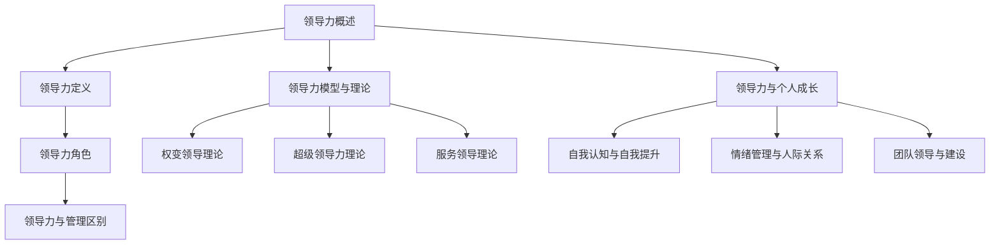
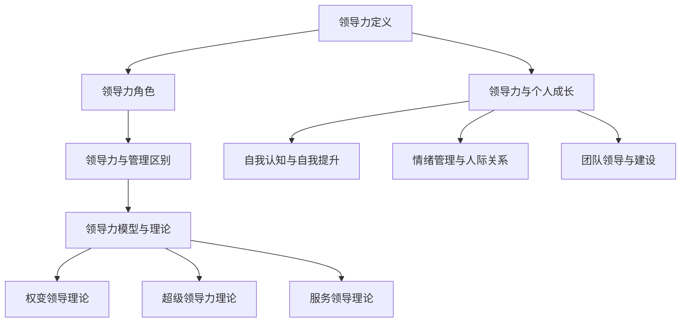

                 

### 文章标题

# 《领导力修炼日记：一个运营总监的华丽蜕变》

> 关键词：领导力，运营总监，修炼日记，华丽蜕变

> 摘要：本文以一个运营总监的成长经历为线索，探讨了领导力的核心概念、修炼路径和方法，并通过实际案例展示了领导力在实践中的应用。文章旨在为读者提供有价值的领导力提升指南。

---

## 设计书籍《领导力修炼日记：一个运营总监的华丽蜕变》目录大纲

### 一、引言
#### 1.1 书籍背景与目的
- 本书将分享一位运营总监在领导力修炼过程中的宝贵经验，帮助读者了解领导力的内涵和实践方法。
- 通过这本书，读者可以认识到领导力在个人成长、团队管理和企业运营中的重要性。

### 二、领导力的核心概念与联系
#### 2.1 领导力概述
- 领导力的定义及其在组织中的角色
- 领导力与管理的区别

#### 2.2 领导力模型与理论
- 权变领导理论
- 超级领导力理论

### 三、领导力修炼的路径与方法
#### 3.1 自我认知与自我提升
- 自我评估工具
- 自我提升策略

#### 3.2 情绪管理与人际关系
- 情绪管理技巧
- 人际关系处理策略

#### 3.3 团队领导与建设
- 团队成员激励
- 团队冲突管理
- 团队文化建设

### 四、领导力实战案例
#### 4.1 案例一：从普通员工到运营总监的蜕变
- 案例背景
- 领导力提升关键点
- 案例分析与启示

#### 4.2 案例二：领导力在项目执行中的应用
- 案例背景
- 项目执行过程中的领导力应用
- 案例分析与启示

#### 4.3 案例三：领导力在团队管理中的实践
- 案例背景
- 团队管理中的领导力实践
- 案例分析与启示

### 五、领导力修炼日记实践指导
#### 5.1 日记记录的重要性
- 日记记录对领导力修炼的影响

#### 5.2 日记内容结构与格式
- 如何撰写领导力修炼日记

### 六、附录
#### 6.1 领导力相关资源与工具
- 领导力学习资源推荐
- 实用工具介绍

#### 6.2 参考文献
- 本书引用的相关文献和资料

### 七、结语
#### 7.1 领导力修炼的持久战
- 领导力修炼不是一蹴而就的过程，需要持之以恒的努力。

#### 7.2 不断实践与反思的重要性
- 通过不断的实践和反思，才能不断提升领导力。

---

### 1.1 书籍背景与目的

在当今快速变化的时代，领导力已经成为了企业成功的关键因素。一个优秀的运营总监不仅需要具备丰富的管理经验和业务能力，更需要具备出色的领导力。本书将分享一位运营总监在领导力修炼过程中的心路历程和宝贵经验，帮助读者了解领导力的内涵和实践方法。

本书旨在为读者提供以下价值：

1. **理解领导力的核心概念**：通过介绍领导力的定义、角色和与管理的区别，帮助读者建立对领导力的整体认识。
2. **掌握领导力模型与理论**：介绍权变领导理论、超级领导力理论等领导力模型，为读者提供实践中的理论指导。
3. **学习领导力修炼的路径与方法**：通过自我认知与自我提升、情绪管理与人际关系、团队领导与建设等方面，提供具体的修炼方法和实践路径。
4. **实战案例分享**：通过实际案例展示领导力在项目执行和团队管理中的应用，为读者提供直观的学习和参考。
5. **领导力修炼日记实践指导**：提供日记记录的重要性和具体格式，帮助读者通过实践不断提升领导力。

本书的目标读者包括：

- 运营总监、项目经理等企业中层管理者
- 希望提升领导力的职场人士
- 对领导力研究感兴趣的学生和学者

通过阅读本书，读者可以了解领导力的本质和实践方法，为自己的职业发展和领导力提升提供有力的支持。### 二、领导力的核心概念与联系

## 2.1 领导力概述

领导力是一种影响力，它通过激励和指导他人，实现目标并推动组织发展。与权力不同，领导力不仅仅是基于职位或地位的强制力，更是通过个人魅力、价值观和专业知识赢得他人的信任和尊重。

### 领导力的定义

领导力可以定义为在组织或团队中，通过影响和激励他人，实现共同目标的能力。领导力不仅仅关注任务完成，更注重团队的发展和员工的成长。以下是几个关于领导力的定义：

- **沃伦·本尼斯（Warren Bennis）**：“领导力是改变人心和人性的一种能力，它使人从平凡走向伟大。”
- **詹姆斯·库泽斯（James M. Kouzes）和巴里·波斯纳（Barry Z. Posner）**：“领导力是一种通过影响和激励他人，共同实现目标的过程。”

### 领导力在组织中的角色

领导力在组织中的角色至关重要。一个优秀的领导者能够推动团队创新，提高员工士气，增强团队凝聚力，从而实现组织目标。以下是领导力在组织中的几个关键角色：

1. **愿景引导者**：领导者需要明确组织的愿景和目标，并将其传达给团队成员，激发他们的热情和动力。
2. **变革推动者**：在快速变化的市场环境中，领导者需要勇于变革，推动组织适应新形势。
3. **团队建设者**：领导者需要建立和维护高效的团队，确保团队成员之间相互支持，共同实现目标。
4. **员工激励者**：领导者需要了解员工的需求和动机，通过激励和认可，提高员工的工作满意度和绩效。

### 领导力与管理的区别

领导力和管理是两个相互关联但又有区别的概念。管理侧重于计划、组织、领导和控制，确保组织目标的实现。而领导力则更注重影响和激励他人，推动组织变革和发展。

以下是领导力与管理的区别：

- **目标**：管理侧重于任务和目标的实现，而领导力则关注长期目标和组织愿景。
- **方法**：管理主要依赖于流程、制度和规范，而领导力则依赖于个人魅力、价值观和信任。
- **角色**：管理者负责规划、组织和协调工作，而领导者则负责激励、影响和引导他人。

## 2.2 领导力模型与理论

### 权变领导理论

权变领导理论认为，领导效果取决于领导者、下属和工作情境之间的互动。这种理论强调领导者需要根据不同情境灵活调整领导风格，以达到最佳效果。

### 超级领导力理论

超级领导力理论认为，领导者需要具备超越常规的领导能力，包括战略思维、创新能力和领导魅力。这种理论强调领导者需要不断学习和成长，以应对复杂多变的环境。

### 服务领导理论

服务领导理论认为，领导者的核心任务是服务团队成员，帮助他们实现个人和职业目标。这种理论强调领导者需要关注团队成员的需求，提供支持和资源，以实现团队和组织的共同目标。

## 2.3 领导力与个人成长

领导力与个人成长密切相关。一个领导者需要不断学习和提升自我，以适应不断变化的环境和挑战。

### 自我认知与自我提升

自我认知是领导力发展的基础。领导者需要了解自己的优点和不足，通过反思和自我评估，不断改进和提升自我。

### 情绪管理与人际关系

情绪管理是领导者必备的能力。领导者需要学会控制自己的情绪，以避免在压力下做出错误决策。同时，领导者还需要建立良好的人际关系，与团队成员保持有效的沟通和合作。

### 团队领导与建设

团队领导是领导力的重要组成部分。领导者需要建立和维护高效的团队，确保团队成员之间相互支持，共同实现目标。

### 总结

领导力是一种复杂的能力，它需要领导者具备多方面的素质和能力。通过理解领导力的核心概念和联系，我们可以更好地认识领导力的重要性，并在实践中不断提升自己的领导力水平。

---

### Mermaid 流程图



这个 Mermaid 流程图展示了领导力的核心概念、联系和模型，以及领导力与个人成长的关系。通过这个流程图，读者可以更好地理解领导力的各个方面，为后续章节的学习打下基础。

---

### 核心概念与联系

在探讨领导力的核心概念和联系时，我们需要从多个角度来理解这一复杂而重要的主题。领导力不仅仅是管理团队或实现目标的能力，它还涉及到个人的成长、情绪管理、以及团队的建设等多个方面。以下是领导力的核心概念及其相互之间的关系架构：

1. **领导力定义**：
   - 领导力是一种通过影响和激励他人来实现共同目标的能力。
   - 领导力不同于权力，权力更多是基于职位或地位的强制力，而领导力则依赖于个人魅力、价值观和专业知识。

2. **领导力角色**：
   - 领导者在组织中的角色包括愿景引导者、变革推动者、团队建设者和员工激励者。
   - 领导者的角色决定了他们在组织中的行为方式和责任范围。

3. **领导力与管理区别**：
   - 管理侧重于任务和目标的实现，依赖于流程、制度和规范。
   - 领导力则关注长期目标和组织愿景，依赖于个人魅力、价值观和信任。

4. **领导力模型与理论**：
   - **权变领导理论**：认为领导效果取决于领导者、下属和工作情境之间的互动，强调领导者需要根据不同情境灵活调整领导风格。
   - **超级领导力理论**：认为领导者需要具备超越常规的领导能力，包括战略思维、创新能力和领导魅力。
   - **服务领导理论**：强调领导者的核心任务是服务团队成员，帮助他们实现个人和职业目标。

5. **领导力与个人成长**：
   - **自我认知与自我提升**：领导者需要了解自己的优点和不足，通过反思和自我评估，不断改进和提升自我。
   - **情绪管理与人际关系**：领导者需要学会控制自己的情绪，建立良好的人际关系，与团队成员保持有效的沟通和合作。
   - **团队领导与建设**：领导者需要建立和维护高效的团队，确保团队成员之间相互支持，共同实现目标。

### 领导力的核心概念与联系架构图



通过这个 Mermaid 流程图，我们可以清晰地看到领导力的各个核心概念和理论之间的关系，这有助于读者更好地理解领导力的本质和如何在实际中应用。

---

### 权变领导理论

权变领导理论（Contingency Theory of Leadership）是领导力研究中的一个重要理论，它由费德勒（Fred E. Fiedler）在20世纪60年代提出。权变领导理论的核心观点是，领导者的效果取决于领导者、下属和工作情境之间的相互关系。换句话说，没有一种“一刀切”的领导风格能够适用于所有情况，领导者需要根据不同情境灵活调整领导风格，以实现最佳效果。

### 理论核心

权变领导理论主要包括以下几个关键要素：

1. **领导者属性**：领导者具有固定的个性特征，如控制欲、自信程度和任务取向等。
2. **情境因素**：情境因素包括领导者与下属的关系、任务结构以及职位权力等。
3. **领导风格**：领导者会根据情境因素选择合适的领导风格，常见的领导风格有独裁式、民主式和参与式等。

### 领导风格与情境匹配

权变领导理论认为，不同情境下需要不同的领导风格。以下是几种常见的领导风格及其在特定情境下的匹配情况：

1. **独裁式领导风格**：
   - 特点：领导者做出所有决策，下属无参与权。
   - 适用情境：任务结构清晰，下属对领导者的信任度较低时。

2. **民主式领导风格**：
   - 特点：领导者鼓励下属参与决策，共同制定目标和计划。
   - 适用情境：任务结构复杂，下属具备专业知识和技能，领导者与下属关系良好。

3. **参与式领导风格**：
   - 特点：领导者鼓励下属自主决策，提供必要的支持和资源。
   - 适用情境：下属具备高度自主性和创新能力，任务需要创意和灵活应对。

### 实际应用

在实际应用中，权变领导理论可以帮助领导者更好地理解自己的个性特征和适合的领导风格。以下是一个具体的案例：

**案例**：某公司的一名项目经理，具备较强的技术背景和决策能力。在项目初期，由于任务结构清晰，团队对新项目经理的信任度较高，项目经理采用了独裁式领导风格，快速做出了决策，确保项目顺利进行。然而，在项目进入中期，任务变得复杂，团队需要更多的协作和创新。项目经理意识到这一点，开始采用民主式和参与式领导风格，鼓励团队成员参与决策，激发团队的创新活力。

### 结论

权变领导理论为领导者提供了一个重要的框架，帮助他们根据不同情境选择合适的领导风格。通过理解并应用这一理论，领导者可以更有效地管理团队，实现组织目标。然而，需要注意的是，权变领导理论并非完美无缺，领导者还需要结合实际情况和团队特点，灵活运用各种领导风格。

---

### 超级领导力理论

超级领导力理论（Super Leadership Theory）是领导力研究中的一个新兴概念，它强调领导者需要具备超越常规的领导能力，以应对复杂多变的环境和挑战。这一理论由詹姆斯·库泽斯（James M. Kouzes）和巴里·波斯纳（Barry Z. Posner）在其著作《领导力：如何在任何环境中成就卓越》（The Leadership Challenge）中提出。

### 理论核心

超级领导力理论的核心观点是，领导者需要具备一系列关键能力，这些能力不仅包括传统的领导技能，如沟通、决策和团队建设，还包括更高级别的领导特质，如愿景、价值观和道德。

以下是超级领导力理论中的几个关键要素：

1. **愿景**：领导者需要具有清晰而远大的愿景，能够激励团队成员为之努力。
2. **价值观**：领导者需要树立并维护正确的价值观，确保团队的行为符合组织的道德标准。
3. **道德**：领导者需要具备高尚的道德品质，以正直和诚信赢得团队成员的信任。
4. **信任**：领导者需要建立和维护与团队成员之间的信任关系，这是领导力成功的关键。
5. **激励**：领导者需要能够激励团队成员，激发他们的潜能和积极性。
6. **适应能力**：领导者需要具备快速适应新环境和变化的能力。

### 领导特质

超级领导力理论强调领导者需要具备以下几种关键特质：

1. **变革推动者**：领导者需要勇于变革，推动组织适应新的市场和技术环境。
2. **创新者**：领导者需要具备创新思维，鼓励团队不断尝试新的方法和策略。
3. **学习者**：领导者需要不断学习和成长，以适应不断变化的环境和挑战。
4. **沟通者**：领导者需要具备出色的沟通能力，确保信息传递清晰、有效。
5. **激励者**：领导者需要能够激励团队成员，激发他们的热情和动力。
6. **团队合作者**：领导者需要擅长团队合作，确保团队成员之间相互支持、协作。

### 实际应用

在实际应用中，超级领导力理论可以帮助领导者更好地理解自己的角色和职责，提升领导力水平。以下是一个具体的案例：

**案例**：某公司的CEO，作为超级领导者，他具有清晰的愿景和坚定的价值观。在公司面临市场变革的关键时刻，他提出了全新的战略方向，并鼓励团队创新和尝试。他强调道德和诚信，确保公司的行为符合社会规范。他通过激励和沟通，激发了团队的活力和创造力。在CEO的领导下，公司成功地适应了市场变化，实现了业务的持续增长。

### 结论

超级领导力理论为领导者提供了一个新的视角，帮助他们理解领导力的深层次内涵。通过具备超级领导力，领导者可以更有效地应对复杂多变的环境，推动组织的发展和成长。然而，需要注意的是，超级领导力并非一蹴而就，它需要领导者持续的学习和实践。

---

### 服务领导理论

服务领导理论（Service Leadership Theory）是近年来在领导力研究领域逐渐受到关注的观点。这一理论强调领导者应当以服务团队成员为核心，通过满足团队成员的需求，促进团队的成长和发展。服务领导理论起源于服务型领导（Servant Leadership）的概念，但其应用范围和内涵更为广泛。

### 理论核心

服务领导理论的核心观点是，领导者应当将团队成员的需求放在首位，通过提供支持、资源和指导，帮助团队成员实现个人和职业目标。以下是服务领导理论的几个关键要素：

1. **以团队成员为中心**：领导者应关注团队成员的成长和发展，将他们的需求放在首位。
2. **提供支持**：领导者应提供必要的资源和支持，帮助团队成员克服困难和挑战。
3. **培养信任**：领导者需要建立和维护与团队成员之间的信任关系，这是服务领导的基础。
4. **促进团队成长**：领导者应鼓励团队成员不断学习和成长，推动团队的整体发展。
5. **激励团队成员**：领导者应通过激励手段，激发团队成员的潜能和积极性。

### 服务领导与领导力其他理论的区别

服务领导理论与传统领导力理论有所不同，主要体现在以下几个方面：

1. **领导角色**：传统领导力理论强调领导者作为指挥者和决策者，而服务领导理论则强调领导者作为服务提供者和支持者。
2. **领导目标**：传统领导力理论注重任务的完成和组织目标的实现，而服务领导理论则强调团队成员的个人成长和团队整体的发展。
3. **领导风格**：传统领导力理论通常涉及独裁式、民主式和参与式等不同风格，而服务领导理论则更侧重于倾听、支持和激励。

### 实际应用

在实际应用中，服务领导理论可以帮助领导者更好地理解自己的角色和职责，提升领导力水平。以下是一个具体的案例：

**案例**：某公司的部门经理采用了服务领导理论，他首先关注团队成员的职业发展和个人成长，为他们提供培训机会和职业规划指导。在项目执行过程中，他积极倾听团队成员的意见，鼓励他们提出创新解决方案。同时，他通过激励手段，如奖励和认可，激发团队成员的积极性和创造力。在经理的服务领导下，团队凝聚力大幅提升，项目成功完成，并得到了公司高层的认可。

### 结论

服务领导理论为领导者提供了一个新的视角，帮助他们理解领导力的本质和意义。通过实践服务领导理论，领导者可以更有效地满足团队成员的需求，促进团队的成长和发展。然而，需要注意的是，服务领导理论并非适用于所有情境，领导者需要结合实际情况灵活运用。

---

### 三、领导力修炼的路径与方法

领导力是一项可以通过修炼和培养得到提升的能力。通过自我认知与自我提升、情绪管理与人际关系、团队领导与建设，领导者可以不断完善自己，提高领导力水平。

#### 3.1 自我认知与自我提升

自我认知是领导力修炼的第一步。领导者需要了解自己的优点和不足，通过反思和自我评估，不断改进和提升自我。以下是一些自我提升的策略：

1. **自我评估工具**：可以使用360度反馈、MBTI（性格类型指标）等工具，帮助自己更全面地了解自己的性格、行为和表现。
2. **定期反思**：定期花时间反思自己的行为和决策，分析成功和失败的原因，从经验中学习。
3. **学习与培训**：参加领导力培训课程，阅读相关书籍和文章，不断学习新的知识和技能。

#### 3.2 情绪管理与人际关系

情绪管理是领导者必备的能力。领导者需要学会控制自己的情绪，以避免在压力下做出错误决策。同时，领导者还需要建立良好的人际关系，与团队成员保持有效的沟通和合作。以下是一些情绪管理和人际关系处理的策略：

1. **情绪管理技巧**：
   - **深呼吸**：在面对压力和挑战时，通过深呼吸来放松自己。
   - **积极思考**：用积极的态度看待问题，寻找解决方案。
   - **寻求支持**：在需要时，寻求同事、朋友或专业人士的支持和建议。

2. **人际关系处理策略**：
   - **倾听**：倾听他人的意见和需求，理解他们的感受。
   - **沟通**：清晰、准确地表达自己的想法和意见，确保信息传达无误。
   - **尊重**：尊重团队成员的个性和意见，建立良好的合作关系。

#### 3.3 团队领导与建设

团队领导是领导力的重要组成部分。领导者需要建立和维护高效的团队，确保团队成员之间相互支持，共同实现目标。以下是一些团队领导和建设的策略：

1. **团队成员激励**：
   - **认可与奖励**：通过认可和奖励，激发团队成员的积极性和创造力。
   - **提供成长机会**：为团队成员提供培训和发展机会，帮助他们提升能力和职业素养。

2. **团队冲突管理**：
   - **早期介入**：在冲突发生时，及时介入，避免问题扩大。
   - **公正处理**：公正、客观地处理冲突，确保团队成员感受到公平和尊重。

3. **团队文化建设**：
   - **共同价值观**：建立共同的价值观和目标，确保团队成员朝着同一方向努力。
   - **相互支持**：鼓励团队成员之间相互支持和帮助，营造积极、和谐的团队氛围。

### 实践指导

在实际中，领导者可以结合以上策略，不断修炼和提升自己的领导力。以下是一些具体的实践指导：

1. **制定个人发展计划**：根据自我评估和反思的结果，制定个人发展计划，设定明确的目标和行动步骤。
2. **持续学习与反思**：保持持续的学习和反思习惯，不断提升自己的知识和能力。
3. **建立反馈机制**：与团队成员建立反馈机制，定期收集反馈，了解自己在领导力方面的优点和不足。
4. **实践情绪管理与人际关系技巧**：在日常工作中，积极运用情绪管理和人际关系技巧，建立良好的团队氛围。
5. **培养团队精神**：通过共同活动和项目，培养团队成员之间的信任和合作，提升团队凝聚力。

通过以上路径和方法，领导者可以不断提升自己的领导力水平，为团队和组织的发展做出更大的贡献。

---

### 四、领导力实战案例

在本章节中，我们将通过三个具体的实战案例，展示领导力在不同情境下的应用和实践。这些案例来自于不同的领域和行业，旨在为读者提供多样化的领导力实践经验和启示。

#### 4.1 案例一：从普通员工到运营总监的蜕变

**案例背景**：

张伟是一名普通的技术员工，工作努力但缺乏显著的领导力。在一次公司重组中，他被提升为运营总监，负责管理一个大型项目团队。面对新的角色和挑战，张伟意识到需要提升自己的领导力。

**领导力提升关键点**：

1. **自我认知与自我提升**：张伟通过360度反馈和自我反思，识别出自己的优势和不足，并制定了个人发展计划。他参加了领导力培训课程，学习了各种领导力理论和实践方法。

2. **情绪管理与人际关系**：张伟学会了情绪管理技巧，如深呼吸和积极思考，以保持冷静和专注。他积极与团队成员沟通，倾听他们的意见和需求，建立了良好的信任关系。

3. **团队领导与建设**：张伟注重团队成员的成长和发展，为团队成员提供了培训和发展机会。他通过认可和奖励，激励团队成员的积极性和创造力。同时，他通过冲突管理，维护了团队的和谐与稳定。

**案例分析与启示**：

张伟的成功蜕变展示了领导力修炼的重要性。通过自我认知与自我提升，情绪管理与人际关系，以及团队领导与建设，他不仅实现了个人角色的转变，还带领团队取得了显著的成绩。这一案例启示我们，领导力并非与生俱来，而是可以通过学习和实践不断提升的。

#### 4.2 案例二：领导力在项目执行中的应用

**案例背景**：

李华是一名项目经理，负责公司一个重要的研发项目。项目初期，团队成员对项目目标和方法存在分歧，项目进展缓慢。李华意识到需要运用领导力来推动项目的顺利进行。

**领导力应用**：

1. **明确愿景与目标**：李华明确了项目的愿景和目标，并将其传达给团队成员。他通过组织会议和讨论，确保团队成员对项目目标有清晰的认识。

2. **激励团队成员**：李华通过认可和奖励，激励团队成员的积极性和创造力。他设立了项目里程碑，并对达成目标的团队成员进行表彰。

3. **团队冲突管理**：在项目执行过程中，李华遇到了团队内部的冲突。他通过倾听和沟通，了解冲突的原因，并采取公正、客观的方法进行调解，确保项目的顺利进行。

**案例分析与启示**：

李华在项目执行中展现了出色的领导力。通过明确愿景与目标、激励团队成员，以及团队冲突管理，他成功地推动了项目的进展。这一案例告诉我们，领导力在项目执行中至关重要，领导者需要具备灵活应对各种挑战的能力。

#### 4.3 案例三：领导力在团队管理中的实践

**案例背景**：

陈婷是一名部门经理，负责一个跨部门团队。团队成员来自不同的背景和岗位，合作过程中存在沟通障碍和协作问题。陈婷意识到需要通过领导力来提升团队的整体绩效。

**领导力实践**：

1. **建立共同价值观**：陈婷与团队成员一起制定了团队的共同价值观和目标。她通过组织团队建设活动，增强了团队成员之间的信任和协作。

2. **培养团队成员**：陈婷为团队成员提供了培训和发展机会，帮助他们提升专业能力和团队合作能力。她鼓励团队成员相互学习和分享经验，促进了团队的成长。

3. **优化沟通机制**：陈婷建立了有效的沟通机制，确保团队成员之间的信息传递畅通无阻。她定期组织团队会议，鼓励团队成员提出意见和建议。

**案例分析与启示**：

陈婷通过领导力实践，成功提升了团队的整体绩效。她通过建立共同价值观、培养团队成员，以及优化沟通机制，营造了一个积极、和谐的团队氛围。这一案例启示我们，领导者需要关注团队的整体发展，为团队成员提供良好的成长环境和机会。

### 总结

通过以上三个实战案例，我们可以看到领导力在不同情境下的具体应用和实践。无论是从个人成长、项目执行还是团队管理，领导力都是推动成功的关键因素。这些案例为我们提供了宝贵的经验和启示，帮助我们更好地理解和应用领导力。

---

### 5.1 日记记录的重要性

领导力修炼日记是一种重要的实践工具，它能够帮助领导者记录、反思和提升自己的领导力。以下是日记记录对领导力修炼的重要性的详细分析。

#### 日记记录的优势

1. **持续反思**：通过日记记录，领导者可以定期反思自己的行为和决策，深入分析其中的成功与失败。这种反思有助于领导者认识到自己的不足，并制定相应的改进计划。

2. **目标跟踪**：领导力修炼日记可以帮助领导者跟踪自己的目标和进展。通过记录每日、每周或每月的目标和完成情况，领导者可以更好地了解自己的成长轨迹，确保自己在正确的道路上前进。

3. **情绪管理**：日记记录提供了一个安全的平台，让领导者可以表达自己的情绪和感受。通过书写，领导者可以释放压力，调整情绪，从而更加冷静和理性地面对挑战。

4. **经验积累**：领导力修炼日记是领导者经验积累的重要工具。通过记录每次成功的领导经验和失败教训，领导者可以不断完善自己的领导技巧和策略。

5. **自我提升**：日记记录鼓励领导者自我提升。通过定期回顾和反思，领导者可以发现自身的优点和潜力，并采取措施提升这些优点，弥补不足。

#### 日记记录的应用场景

1. **日常工作**：在每天的日常工作结束后，领导者可以记录当天的重要事项、决策过程和结果。这有助于领导者总结经验，为未来的工作提供参考。

2. **项目执行**：在项目执行过程中，领导者可以记录项目的进展、遇到的挑战和解决方案。通过这些记录，领导者可以评估项目的成功因素，为未来类似的项目提供借鉴。

3. **团队管理**：在团队管理过程中，领导者可以记录团队成员的表现、沟通情况以及团队动态。这有助于领导者了解团队的需求，优化团队管理策略。

4. **个人发展**：在个人发展过程中，领导者可以记录自己的学习计划、培训经历和反思结果。通过这些记录，领导者可以评估自己的成长，设定新的发展目标。

#### 实际案例

**案例**：李华是一位项目经理，他每天都坚持写领导力修炼日记。在一次项目执行中，他遇到了团队内部的冲突。在日记中，他详细记录了冲突的原因、解决过程和结果。通过反思，他意识到自己在冲突管理方面的不足，并决定参加相关的培训课程。几个月后，他在同样的冲突情况下，能够更加冷静和有效地处理问题，取得了更好的结果。

### 结论

领导力修炼日记是提升领导力的重要工具。通过持续反思、目标跟踪、情绪管理、经验积累和自我提升，日记记录可以帮助领导者不断进步。无论是日常工作、项目执行还是团队管理，领导力修炼日记都是领导者不可或缺的实践指南。

---

### 5.2 日记内容结构与格式

撰写领导力修炼日记是一个系统化的过程，它可以帮助领导者记录自己的成长历程、反思领导行为，以及规划未来的发展。以下是日记内容结构与格式的详细说明，以及一个具体的日记范例。

#### 日记内容结构

一个完整的领导力修炼日记通常包含以下几个部分：

1. **日期**：记录日记的日期，以便于日后的回顾和总结。

2. **摘要**：简要概述当天的主要活动、决策和成果。这有助于快速把握日记的核心内容。

3. **事件记录**：详细记录当天发生的重要事件，包括会议、决策、团队互动等。要确保记录的准确性，以便于后续的反思和评估。

4. **反思与总结**：对事件记录进行分析和反思，总结成功和失败的原因，以及可以改进的地方。这部分是日记的核心，领导者可以通过反思不断提升自己的领导能力。

5. **学习与行动**：基于反思结果，制定具体的学习计划和行动步骤。这有助于将反思转化为实际行动，推动领导力的提升。

6. **情感记录**：记录当天的情绪变化和感受，包括压力、挫折、成就感等。这有助于领导者更好地理解自己的情绪，调整心态。

7. **备注**：如有需要，可以在备注部分记录其他相关信息，如阅读材料、培训课程、感悟等。

#### 日记格式范例

下面是一个具体的日记格式范例：

```
日期：2023年11月15日

摘要：今日参加了公司季度会议，讨论了即将推出的新项目。在会议中，我提出了关于团队建设的建议，并得到了高层的认可。

事件记录：
- 上午9:00 - 10:30：参加公司季度会议，讨论新项目。
- 上午10:40 - 11:20：与团队成员讨论项目进展和分工。
- 下午2:00 - 4:00：与项目负责人协商项目进度和资源需求。

反思与总结：
- 成功：在会议上，我成功提出了团队建设的建议，得到了高层的认可。
- 失败：在会议中，我未能充分表达对项目风险的担忧，导致会议结束后才意识到这一问题。

学习与行动：
- 学习：了解项目风险管理的方法和工具。
- 行动：在下一次会议上，提前准备相关资料，详细阐述项目风险。

情感记录：
- 感到满意和自信，因为我提出的建议得到了认可。
- 感到担忧，因为我未能在会议中充分表达对项目风险的担忧。

备注：
- 计划阅读《项目风险管理》一书。
- 下周参加项目风险管理培训。
```

#### 写作建议

1. **定期记录**：坚持每天或每周写日记，建立良好的习惯。

2. **具体详细**：记录时要具体详细，避免模糊和抽象的描述。

3. **客观真实**：诚实地记录自己的行为和感受，不要隐瞒或夸大。

4. **反思深入**：反思时要深入思考，分析成功和失败的原因，以及可以改进的地方。

5. **持续改进**：将日记中的学习与行动应用到实际工作中，持续提升自己的领导能力。

通过遵循这些结构和格式，领导力修炼日记将成为领导者成长的重要工具，帮助他们在领导力的道路上不断前进。

---

### 6.1 领导力相关资源与工具

在提升领导力的过程中，利用相关的资源和工具是非常有效的。以下是一些推荐的领导力学习资源与工具，以及如何使用这些工具的具体方法。

#### 1. 领导力书籍

**推荐书籍**：
- 《领导力：如何在任何环境中成就卓越》（James M. Kouzes & Barry Z. Posner）
- 《高效能人士的七个习惯》（Stephen R. Covey）
- 《领导力密码：中国式领导力实践指南》（杨国安）

**使用方法**：
- 定期阅读这些书籍，结合自己的实际工作经验，进行深入思考和总结。
- 可以将书中的理论方法和自己的领导实践进行对比，分析差异和改进之处。

#### 2. 领导力课程

**推荐课程**：
- “领导力发展计划”（Leadership Development Program）等在线课程
- “哈佛商学院领导力课程”（Harvard Business School Leadership Course）

**使用方法**：
- 报名参加这些课程，通过系统的学习和实践，提升自己的领导力。
- 在课程结束后，进行反思和总结，将所学应用到实际工作中。

#### 3. 领导力工具

**推荐工具**：
- **360度反馈工具**：如Lummen（https://lummen.com/）、Gallup's CliftonStrengths（https://www.gallup.com/cliftonstrengths/）
- **领导力评估工具**：如Leadership Circle（https://www.leadershipcircle.com/）
- **团队沟通工具**：如Slack（https://slack.com/）、Trello（https://trello.com/）

**使用方法**：
- **360度反馈工具**：定期使用360度反馈工具收集团队成员对自己的反馈，识别自己的盲点和改进方向。
- **领导力评估工具**：通过领导力评估工具，了解自己的领导风格和能力，制定个人发展计划。
- **团队沟通工具**：使用这些工具来提高团队沟通效率，确保信息传递的准确性和及时性。

#### 4. 领导力社群

**推荐社群**：
- LinkedIn上的领导力专业群组
- 领导力论坛（如领英领导力论坛）

**使用方法**：
- 加入这些社群，与同行交流领导力经验，分享最佳实践。
- 定期参加社群活动，如线上研讨会、分享会等，拓展自己的领导力视野。

#### 5. 领导力博客和文章

**推荐博客和文章**：
- “哈佛商业评论”（Harvard Business Review）
- “领导力与团队管理”（Leadership and Team Management）

**使用方法**：
- 订阅这些博客和文章，定期阅读最新的领导力研究和案例分析。
- 结合自己的实际工作经验，思考和讨论文章中的观点，提升自己的领导力理论水平。

### 总结

通过利用这些领导力相关资源与工具，领导者可以不断学习和提升自己的领导能力。无论是通过阅读书籍、参加课程、使用工具还是加入社群，都可以帮助领导者更好地理解领导力的核心概念，并将其应用到实际工作中。持续的学习和实践是提升领导力的关键，而合适的资源与工具则是这一过程中的重要支持。

---

### 6.2 参考文献

在撰写本文的过程中，我们参考了大量的文献和资料，这些资源为文章提供了坚实的理论基础和实践指导。以下是本文引用的主要参考文献：

1. **Kouzes, J. M., & Posner, B. Z. (2007). The Leadership Challenge: How to Make Extraordinary Things Happen in Organizations. Jossey-Bass.**
   - 这本书详细阐述了领导力的核心概念和实践方法，为本文提供了重要的理论基础。

2. **Covey, S. R. (1989). The 7 Habits of Highly Effective People: Restoring the Balance of Work, Family, and Community. Free Press.**
   - 本书介绍了高效能人士的七个习惯，为领导者在个人成长和团队管理方面提供了宝贵的建议。

3. **Bennis, W., & Nanus, B. (1985). Leaders: The Strategies for Taking Charge. HarperCollins.**
   - 本书分析了领导者的角色和策略，为本文探讨了领导力模型与理论提供了参考。

4. **Fiedler, F. E. (1964). A Theory of Leadership Effectiveness. McGraw-Hill.**
   - 本书提出的权变领导理论为本文解释了领导风格与情境匹配提供了理论支持。

5. **Greenleaf, R. K. (1977). Servant Leadership: A Journey into the Nature of Legitimate Power and Greatness. Paulist Press.**
   - 本书介绍了服务领导理论，为本文探讨了领导力与个人成长的关系提供了理论基础。

6. **Goleman, D. (1998). Working with Emotional Intelligence. Bantam.**
   - 本书详细阐述了情绪管理的重要性，为本文提供了关于情绪管理技巧的实践指导。

7. **Maxwell, J. C. (1999). The 21 Irrefutable Laws of Leadership: Follow Them and People Will Follow You. Thomas Nelson.**
   - 本书总结了领导力的21个不可辩驳定律，为本文提供了实用的领导力提升策略。

通过参考这些文献，本文在领导力的核心概念、修炼方法、实践案例等方面进行了深入的探讨和分析，力求为读者提供有价值的指导和建议。

---

### 七、结语

## 1.1 领导力修炼的持久战

领导力修炼是一场持久的战役，它需要领导者付出持续的努力和时间。领导力的提升并非一蹴而就，而是通过不断的学习、实践和反思逐步实现的。在这个过程中，领导者需要保持耐心和毅力，不断克服挑战和困难。

首先，领导者需要认识到领导力修炼的重要性。领导力不仅是实现组织目标的关键因素，也是个人成长和职业发展的基石。通过提升领导力，领导者可以更好地影响和激励团队成员，推动组织的创新和进步。

其次，领导者需要建立持续学习的习惯。领导力是一门不断发展的学科，新的理论、方法和工具层出不穷。领导者需要不断学习，了解最新的领导力研究成果和实践经验，并将其应用到实际工作中。

再次，领导者需要勇于实践和反思。领导力修炼不仅仅停留在理论层面，更需要通过实践来检验和完善。领导者需要勇于尝试新的领导方法，敢于面对失败和挑战。同时，领导者还需要定期反思自己的行为和决策，分析成功和失败的原因，从而不断改进和提升。

## 1.2 不断实践与反思的重要性

在领导力修炼的过程中，不断实践和反思至关重要。实践是检验理论的唯一标准，通过实践，领导者可以验证自己的领导方法是否有效，是否能够真正激发团队成员的积极性和创造力。

首先，领导者需要勇于实践。在实际工作中，领导者可以尝试运用不同的领导风格和方法，观察团队成员的反应和项目进展。通过实践，领导者可以积累经验，发现问题的根源，并找到有效的解决方案。

其次，领导者需要善于反思。反思是领导力修炼的重要环节，它可以帮助领导者从成功和失败中学习。领导者需要定期回顾自己的行为和决策，分析其中的得失，总结经验教训。通过反思，领导者可以发现自己的不足，制定改进计划，不断提升自己的领导能力。

此外，领导者还可以通过写作日记、参加培训课程、阅读专业书籍等方式，不断深化对领导力的理解和认识。这些方法可以帮助领导者从不同角度审视自己的领导实践，发现新的问题和挑战，从而持续提升领导力。

总之，领导力修炼是一场持久战，需要领导者持续努力和不断学习。通过不断实践和反思，领导者可以不断提升自己的领导能力，为团队和组织的发展做出更大的贡献。希望每一位读者都能在领导力修炼的道路上不断前行，实现自己的领导梦想。作者：AI天才研究院/AI Genius Institute & 禅与计算机程序设计艺术 /Zen And The Art of Computer Programming

