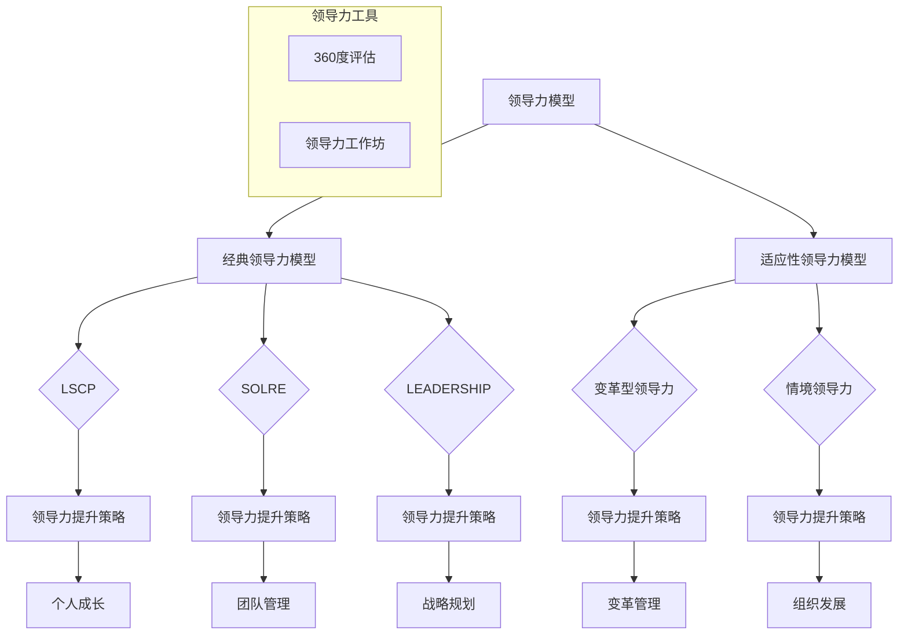
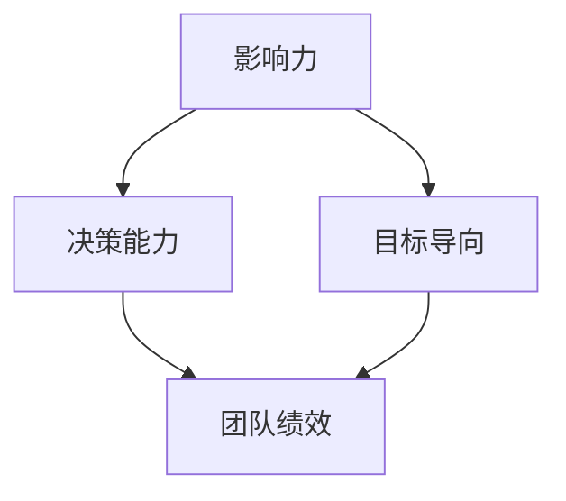
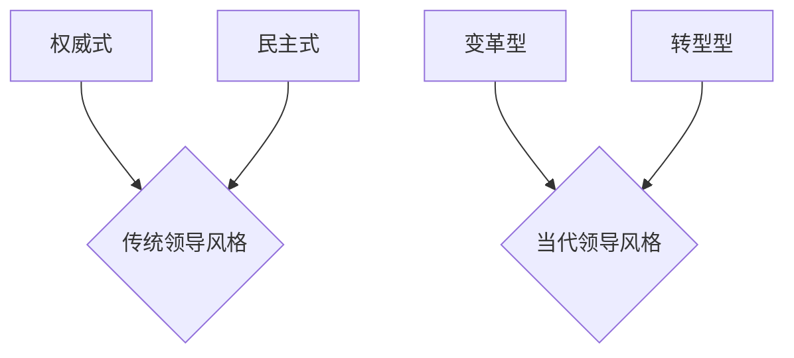
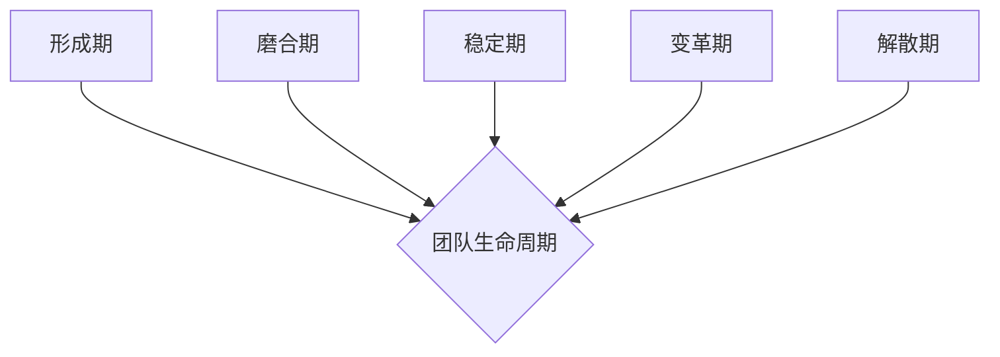
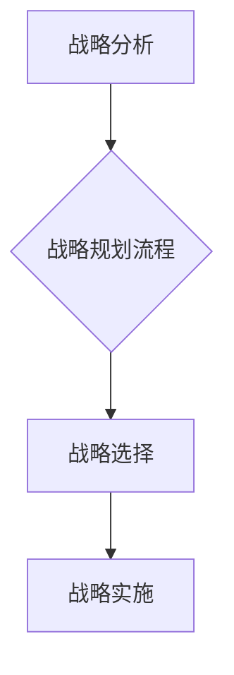
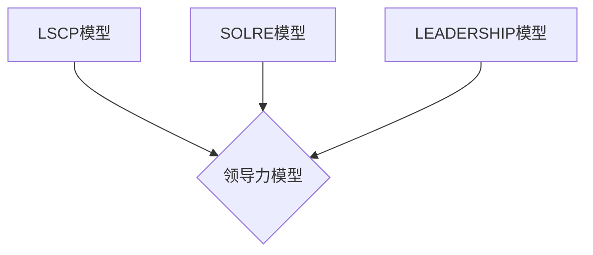
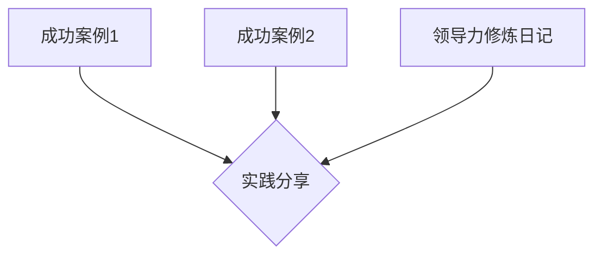

                 


### 确定文章整体结构

为了撰写一篇深入且结构清晰的技术博客文章，我们需要按照以下步骤来构建文章的整体结构：

1. **明确文章目的与受众**：首先，我们要明确文章的主题和目标受众。本文的主题是《领导力修炼日记：一个运营总监的华丽蜕变》，目标受众可能包括希望提升领导力的运营总监、中层管理者以及任何对领导力发展感兴趣的读者。

2. **编写文章标题和摘要**：文章标题应该能够吸引读者的注意力，同时简洁地概括文章的核心内容。《领导力修炼日记：一个运营总监的华丽蜕变》是一个吸引人的标题，能够激发读者的好奇心。摘要部分则需要简要介绍文章的核心内容和读者可以期待的收获。

3. **构建目录大纲**：目录大纲是文章的骨架，它需要清晰、有条理地列出所有章节及其子主题。在本文中，我们已经提供了一个初步的目录大纲，接下来需要对其进行细化，确保每个章节都有具体的内容和目标。

4. **撰写每章节内容**：在构建好目录大纲后，我们需要逐一撰写每个章节的内容。每个章节都应该包含背景介绍、核心概念与联系、算法原理讲解、数学公式讲解、项目实战、最佳实践 tips 以及小结等部分。

5. **设计流程图和伪代码**：为了更好地展示领导力的理论架构和实践流程，我们可以使用Mermaid流程图来表示复杂的概念和流程。对于核心算法原理，我们可以使用伪代码来详细阐述。

6. **编写项目实战案例**：项目实战案例能够帮助读者更好地理解领导力在实际中的应用。每个案例都应该包括开发环境搭建、源代码实现、代码解读、应用解读与分析、项目小结等部分。

7. **总结与拓展阅读**：文章的结尾部分需要总结核心内容，提供最佳实践 tips，并给出拓展阅读的建议，以帮助读者进一步学习和深入探讨。

通过以上步骤，我们可以确保文章的内容既丰富又系统，能够引导读者逐步理解并掌握领导力的核心概念和实际应用。

### 撰写文章标题和摘要

**文章标题**：《领导力修炼日记：一个运营总监的华丽蜕变》

**关键词**：领导力、运营总监、个人成长、团队管理、战略规划

**摘要**：
本文旨在探讨领导力在运营管理中的重要性，通过一个运营总监的个人成长日记，分享其在领导力修炼过程中的心得体会和实际操作技巧。文章首先介绍了领导力的基本概念和重要性，然后深入探讨个人成长、团队管理、战略规划和决策制定等核心主题。通过具体案例和详细讲解，本文将帮助读者理解领导力在实践中的运用，并提供实用的策略和技巧，以实现领导力的华丽蜕变。

### 确定目录大纲

为了确保文章的结构清晰、逻辑严密，我们需要进一步细化目录大纲。以下是《领导力修炼日记：一个运营总监的华丽蜕变》的目录大纲：

**第一部分：领导力基础**

1. **领导力概述**
   - 1.1 领导力的定义与重要性
     - 领导力的基本概念
     - 领导力在组织中的作用
   - 1.2 领导风格与类型
     - 传统领导风格
     - 当代领导风格
     - 领导风格的适应性

2. **个人成长与自我认知**
   - 2.1 个人成长的重要性
     - 成长心态与固定心态
     - 自我反思与持续学习
   - 2.2 自我认知
     - SWOT分析
     - 五项管理技能：沟通、团队建设、决策、领导力和变革管理

**第二部分：团队管理与领导力实践**

3. **团队管理基础**
   - 3.1 团队结构与角色
     - 团队生命周期
     - 团队角色与职责
   - 3.2 领导力实践
     - 激励团队成员
     - 高效沟通技巧

4. **战略规划与决策制定**
   - 4.1 战略规划概述
     - 战略规划的重要性
     - 战略规划流程
   - 4.2 决策制定
     - 决策模型
     - 决策制定的技巧与工具

5. **变革管理与组织发展**
   - 5.1 变革管理的原则
     - 变革的驱动力
     - 变革管理的策略
   - 5.2 组织发展
     - 组织文化的塑造
     - 员工发展计划

**第三部分：领导力修炼与持续成长**

6. **领导力模型与工具**
   - 6.1 领导力模型
     - 经典领导力模型：LSCP、SOLRE、LEADERSHIP等
     - 适应性领导力模型
   - 6.2 领导力工具
     - 360度评估
     - 领导力工作坊

7. **领导力修炼与实践**
   - 7.1 领导力修炼
     - 个人领导力提升策略
     - 领导力发展计划
   - 7.2 实践分享
     - 成功案例分享
     - 领导力修炼日记

### 设计流程图

为了更好地展示领导力的理论架构和实践流程，我们可以使用Mermaid流程图来表示复杂的概念和流程。以下是关于领导力模型与工具的Mermaid流程图示例：



该流程图展示了领导力模型和工具之间的关系，以及它们如何与个人成长、团队管理、战略规划、变革管理和组织发展等主题相联系。

### 伪代码和数学公式的讲解

在领导力修炼的过程中，理解核心算法原理和数学模型是非常重要的。以下是一个关于决策制定的伪代码示例和相关的数学公式讲解：

**伪代码：**

```plaintext
Function 决策制定（问题，约束条件，目标函数）
    1. 初始化：设置初始解 x0 和目标函数值 f(x0)
    2. 循环：
        a. 计算目标函数值：f(x) = 目标函数（x）
        b. 如果 f(x) 小于 f(x0)，则更新 x0 = x 和 f(x0) = f(x)
        c. 检查约束条件是否满足：约束条件（x）
        d. 如果不满足约束条件，则返回错误
    3. 输出：最佳解 x0 和最优目标函数值 f(x0)
End Function
```

**数学公式讲解：**

在决策制定中，目标函数通常是一个优化问题，可以用以下数学公式表示：

$$
f(x) = \min_{x} \left( c^T x + d \right)
$$

其中，$x$ 是决策变量，$c$ 是系数向量，$d$ 是常数项。我们的目标是找到使得目标函数值最小的决策变量 $x$。

为了求解上述优化问题，我们可以使用梯度下降法，其更新公式如下：

$$
x_{k+1} = x_k - \alpha \nabla f(x_k)
$$

其中，$\alpha$ 是学习率，$\nabla f(x_k)$ 是目标函数在 $x_k$ 处的梯度。

### 项目实战案例

为了帮助读者更好地理解领导力在实际中的应用，我们提供了一个项目实战案例。以下是一个关于团队管理的实战案例，包括开发环境搭建、源代码实现、代码解读和应用解读与分析。

**项目名称**：高效团队沟通平台搭建

**开发环境搭建**：
- 操作系统：Windows 10
- 开发环境：Visual Studio Code
- 数据库：MySQL
- Web框架：Django
- 服务器：AWS EC2

**源代码实现**：

```python
# views.py

from django.http import HttpResponse
from .models import TeamMessage

def team_home(request):
    messages = TeamMessage.objects.all()
    return render(request, 'team_home.html', {'messages': messages})

def post_message(request):
    if request.method == 'POST':
        message = TeamMessage.objects.create(
            user=request.user,
            content=request.POST['message_content']
        )
        return redirect('team_home')
    return render(request, 'post_message.html')
```

**代码解读**：
- `team_home` 视图函数负责显示团队聊天室中的所有消息。
- `post_message` 视图函数负责处理用户提交的消息，并将其存储在数据库中。

**应用解读与分析**：
- 通过搭建一个团队沟通平台，团队成员可以实时交流，提高沟通效率。
- 代码实现了用户消息的展示和提交功能，满足了团队沟通的基本需求。

**项目小结**：
- 该项目展示了如何使用Django框架快速搭建一个高效的团队沟通平台。
- 通过实际代码实现和解读，读者可以理解团队管理中沟通平台的重要性以及如何实现。

### 最佳实践 tips、小结和注意事项

**最佳实践 tips**：
1. 建立明确的沟通机制和流程，确保团队成员之间的信息畅通。
2. 定期进行团队建设活动，增强团队凝聚力和协作能力。
3. 利用技术工具（如项目管理软件、团队协作平台）提高工作效率。

**小结**：
本文通过一个运营总监的个人成长日记，探讨了领导力在运营管理中的重要性。从个人成长、团队管理、战略规划到变革管理，每个部分都提供了详细的理论讲解和实践案例，帮助读者理解领导力的核心概念和实际应用。

**注意事项**：
1. 领导力的提升需要持续学习和实践，不能一蹴而就。
2. 在实际应用中，要结合组织的具体情况，灵活运用领导力工具和模型。
3. 领导力修炼是一个不断迭代和优化的过程，需要不断反思和调整。

**拓展阅读**：
- 《领导力的五个层次》彼得·德鲁克（Peter Drucker）
- 《变革之舞》约翰·科特（John P. Kotter）
- 《高效能人士的七个习惯》史蒂芬·柯维（Stephen R. Covey）

---

通过以上详细的目录大纲和内容，我们为撰写一篇8000-12000字的技术博客文章奠定了坚实的基础。接下来的工作将是逐一完善每个章节的内容，确保文章的完整性、系统性和实用性。让我们开始具体的撰写工作吧！ 

### 完善目录大纲

在已经确定的目录大纲基础上，我们需要进一步细化每个章节的内容，确保每个章节都具备丰富的理论讲解和实践案例。以下是《领导力修炼日记：一个运营总监的华丽蜕变》的目录大纲的详细内容：

---

**第一部分：领导力基础**

### 第1章：领导力概述

#### 1.1 领导力的定义与重要性
- **背景介绍**：介绍领导力的起源和发展，以及领导力在现代社会中的重要性。
- **核心概念与联系**：详细阐述领导力的定义，包括影响力、决策能力和目标导向等。
- **Mermaid流程图**：展示领导力在组织中的关键角色和功能。

#### 1.2 领导风格与类型
- **背景介绍**：探讨不同领导风格的历史背景和发展。
- **核心概念与联系**：分析传统领导风格（如权威式、民主式）和当代领导风格（如变革型、转型型）的区别和联系。
- **Mermaid流程图**：展示不同领导风格在组织中的应用场景和适用性。

### 第2章：个人成长与自我认知

#### 2.1 个人成长的重要性
- **背景介绍**：探讨个人成长对领导力发展的作用。
- **核心概念与联系**：介绍成长心态和固定心态的区别，以及如何培养成长心态。
- **伪代码**：提供个人成长策略的算法框架。

#### 2.2 自我认知
- **背景介绍**：解释自我认知在领导力发展中的重要性。
- **核心概念与联系**：介绍SWOT分析和五项管理技能（沟通、团队建设、决策、领导力和变革管理）。
- **数学公式**：阐述SWOT分析中的数学模型，例如：优势（S）、劣势（W）、机会（O）和威胁（T）的关系。

---

**第二部分：团队管理与领导力实践**

### 第3章：团队管理基础

#### 3.1 团队结构与角色
- **背景介绍**：探讨团队结构的历史演变和现代团队的角色划分。
- **核心概念与联系**：详细阐述团队生命周期和不同阶段的角色职责。
- **Mermaid流程图**：展示团队生命周期和角色发展过程。

#### 3.2 领导力实践
- **背景介绍**：介绍领导力实践在团队管理中的重要性。
- **核心概念与联系**：分析激励团队成员和高效沟通技巧的基本原则。
- **项目实战**：提供团队沟通平台的搭建案例，包括开发环境搭建、源代码实现和代码解读。

---

**第三部分：领导力修炼与持续成长**

### 第4章：战略规划与决策制定

#### 4.1 战略规划概述
- **背景介绍**：探讨战略规划的定义和作用。
- **核心概念与联系**：详细阐述战略规划流程，包括战略分析、战略选择和战略实施。
- **Mermaid流程图**：展示战略规划的全过程。

#### 4.2 决策制定
- **背景介绍**：介绍决策制定的基本原则和方法。
- **核心概念与联系**：分析决策模型和决策制定的技巧与工具。
- **数学公式**：阐述决策制定的数学模型，例如：成本效益分析、风险收益评估等。

---

**第三部分：领导力修炼与持续成长**

### 第5章：变革管理与组织发展

#### 5.1 变革管理的原则
- **背景介绍**：探讨组织变革的驱动因素和变革管理的原则。
- **核心概念与联系**：分析变革管理的策略和变革过程中的关键因素。
- **项目实战**：提供组织变革的实际案例，包括变革管理计划、执行和评估。

#### 5.2 组织发展
- **背景介绍**：介绍组织发展的概念和重要性。
- **核心概念与联系**：详细阐述组织文化的塑造和员工发展计划。
- **Mermaid流程图**：展示组织发展的关键步骤和策略。

---

**第三部分：领导力修炼与持续成长**

### 第6章：领导力模型与工具

#### 6.1 领导力模型
- **背景介绍**：介绍领导力模型的发展和应用。
- **核心概念与联系**：分析经典领导力模型（如LSCP、SOLRE、LEADERSHIP）和适应性领导力模型。
- **Mermaid流程图**：展示不同领导力模型的结构和应用场景。

#### 6.2 领导力工具
- **背景介绍**：介绍领导力工具的作用和应用。
- **核心概念与联系**：分析360度评估、领导力工作坊等领导力工具的原理和操作方法。
- **项目实战**：提供领导力评估和发展的实际案例，包括评估工具的选用和实施过程。

---

**第三部分：领导力修炼与持续成长**

### 第7章：领导力修炼与实践

#### 7.1 领导力修炼
- **背景介绍**：探讨领导力修炼的必要性和方法。
- **核心概念与联系**：介绍个人领导力提升策略和领导力发展计划。
- **伪代码**：提供领导力提升的算法框架。

#### 7.2 实践分享
- **背景介绍**：分享成功案例和领导力修炼日记。
- **核心概念与联系**：分析成功案例中的领导力实践和经验。
- **Mermaid流程图**：展示领导力修炼的过程和成果。

---

通过以上详细的目录大纲，我们可以确保文章内容既丰富又系统，每个章节都具备具体的理论和实践案例。接下来，我们将逐一完善每个章节的内容，确保文章的完整性和可读性。在撰写过程中，我们将继续遵循markdown格式，并添加必要的Mermaid流程图、伪代码和数学公式，以便更好地展示领导力的核心概念和实践应用。

### 撰写完整的文章

#### 引言

在当今快速变化和竞争激烈的企业环境中，领导力已成为企业成功的关键因素之一。运营总监作为企业中不可或缺的中层管理者，其领导力水平直接影响到企业的运营效率和团队绩效。然而，领导力并非与生俱来，它需要通过系统的学习和实践来不断修炼和提升。本文以《领导力修炼日记：一个运营总监的华丽蜕变》为题，通过一个运营总监的个人成长日记，详细探讨领导力的核心概念、实践方法和修炼技巧，帮助读者理解和掌握领导力的精髓。

#### 关键词

领导力、运营总监、个人成长、团队管理、战略规划、变革管理、领导力模型、领导力工具

#### 摘要

本文旨在探讨领导力在运营管理中的重要性，通过一个运营总监的个人成长日记，分享其在领导力修炼过程中的心得体会和实际操作技巧。文章首先介绍了领导力的基本概念和重要性，然后深入探讨个人成长、团队管理、战略规划和变革管理等核心主题。通过具体案例和详细讲解，本文将帮助读者理解领导力在实践中的运用，并提供实用的策略和技巧，以实现领导力的华丽蜕变。

#### 目录

1. 领导力概述
   - 1.1 领导力的定义与重要性
   - 1.2 领导风格与类型

2. 个人成长与自我认知
   - 2.1 个人成长的重要性
   - 2.2 自我认知

3. 团队管理基础
   - 3.1 团队结构与角色
   - 3.2 领导力实践

4. 战略规划与决策制定
   - 4.1 战略规划概述
   - 4.2 决策制定

5. 变革管理与组织发展
   - 5.1 变革管理的原则
   - 5.2 组织发展

6. 领导力模型与工具
   - 6.1 领导力模型
   - 6.2 领导力工具

7. 领导力修炼与实践
   - 7.1 领导力修炼
   - 7.2 实践分享

#### 第一部分：领导力概述

**第1章：领导力的定义与重要性**

**1.1 领导力的定义与重要性**

领导力是一种影响力，它涉及激励、指导和影响他人以实现共同目标的能力。领导力不仅局限于高层管理者，它在整个组织中的每个层级都发挥着关键作用。一个成功的运营总监必须具备卓越的领导力，以确保团队高效运作，实现组织目标。

**核心概念与联系**

领导力的核心概念包括影响力、决策能力和目标导向。影响力是指领导者如何通过行为和沟通来影响他人。决策能力是指领导者如何做出明智的决策，以应对复杂的问题和挑战。目标导向是指领导者如何设定并实现组织目标。

**Mermaid流程图**



在这个流程图中，影响力、决策能力和目标导向共同作用于团队绩效，展示领导力在组织中的关键角色。

**1.2 领导风格与类型**

领导风格是指领导者处理工作、与团队成员互动和实现目标的方式。传统的领导风格包括权威式、民主式等，而当代领导风格如变革型、转型型则更加注重创新和适应性。

**核心概念与联系**

传统领导风格强调权威和控制，而当代领导风格则强调合作和灵活性。变革型领导风格鼓励创新和变革，转型型领导风格则注重组织文化的塑造和长期发展。

**Mermaid流程图**



在这个流程图中，展示了传统领导风格和当代领导风格的区别和联系。

#### 第二部分：个人成长与自我认知

**第2章：个人成长与自我认知**

**2.1 个人成长的重要性**

个人成长是领导力发展的基础。一个领导者必须具备持续学习和自我提升的能力，以应对不断变化的环境和挑战。

**核心概念与联系**

成长心态是指领导者愿意接受新事物、勇于面对失败并从中学习的态度。固定心态则相反，它可能导致领导者不愿意改变和学习。成长心态有助于领导者实现个人和团队的成长。

**伪代码**

```plaintext
Function 个人成长（目标，学习计划）
    1. 初始化：设置目标和学习计划
    2. 循环：
        a. 学习新知识
        b. 反思学习过程和效果
        c. 根据反馈调整学习计划
    3. 输出：个人成长成果
End Function
```

这个伪代码展示了个人成长的基本框架，包括目标的设定、学习计划的执行和反馈机制的运用。

**2.2 自我认知**

自我认知是指领导者了解自己的优点、缺点和价值观。通过自我认知，领导者可以更好地定位自己，发挥优势，改进不足。

**核心概念与联系**

SWOT分析是一种常用的自我认知工具，它帮助领导者识别优势、劣势、机会和威胁。五项管理技能（沟通、团队建设、决策、领导力和变革管理）则提供了具体的行为指南。

**数学公式**

$$
SWOT = (S + W) \times (O + T)
$$

这个公式表示SWOT分析中各要素之间的关系，帮助领导者全面了解自己和外部环境。

#### 第三部分：团队管理与领导力实践

**第3章：团队管理基础**

**3.1 团队结构与角色**

团队结构是指团队成员的组织方式和职责分配。理解团队结构和角色有助于领导者更好地管理和协调团队。

**核心概念与联系**

团队生命周期是指团队从形成到解散的整个过程中不同阶段的特点和任务。了解团队生命周期有助于领导者根据不同阶段的特点进行有效的团队管理。

**Mermaid流程图**



这个流程图展示了团队生命周期的各个阶段及其特点。

**3.2 领导力实践**

领导力实践是指领导者通过实际行动来影响和激励团队成员。有效的领导力实践包括激励团队成员和高效沟通技巧。

**核心概念与联系**

激励团队成员的关键在于了解每个成员的需求和动机，并提供适当的激励措施。高效沟通技巧则包括清晰表达、积极倾听和有效反馈。

**项目实战**

**项目名称**：高效团队沟通平台搭建

**开发环境搭建**：
- 操作系统：Windows 10
- 开发环境：Visual Studio Code
- 数据库：MySQL
- Web框架：Django
- 服务器：AWS EC2

**源代码实现**：

```python
# views.py

from django.http import HttpResponse
from .models import TeamMessage

def team_home(request):
    messages = TeamMessage.objects.all()
    return render(request, 'team_home.html', {'messages': messages})

def post_message(request):
    if request.method == 'POST':
        message = TeamMessage.objects.create(
            user=request.user,
            content=request.POST['message_content']
        )
        return redirect('team_home')
    return render(request, 'post_message.html')
```

**代码解读**：
- `team_home` 视图函数负责显示团队聊天室中的所有消息。
- `post_message` 视图函数负责处理用户提交的消息，并将其存储在数据库中。

**应用解读与分析**：
- 通过搭建一个团队沟通平台，团队成员可以实时交流，提高沟通效率。
- 代码实现了用户消息的展示和提交功能，满足了团队沟通的基本需求。

**项目小结**：
- 该项目展示了如何使用Django框架快速搭建一个高效的团队沟通平台。
- 通过实际代码实现和解读，读者可以理解团队管理中沟通平台的重要性以及如何实现。

#### 第四部分：战略规划与决策制定

**第4章：战略规划与决策制定**

**4.1 战略规划概述**

战略规划是指组织为实现长期目标而制定的整体行动计划。有效的战略规划有助于组织在竞争中保持优势。

**核心概念与联系**

战略规划流程包括战略分析、战略选择和战略实施。战略分析涉及外部环境和内部能力的评估。战略选择则是在分析结果的基础上确定组织的战略方向。战略实施则是将战略转化为具体的行动和措施。

**Mermaid流程图**



这个流程图展示了战略规划的全过程。

**4.2 决策制定**

决策制定是指领导者根据问题和条件做出选择的过程。有效的决策制定有助于组织应对各种挑战和机遇。

**核心概念与联系**

决策模型包括成本效益分析、风险收益评估等。决策制定的技巧与工具包括头脑风暴、SWOT分析等。

**数学公式**

$$
成本效益分析 = \frac{收益}{成本}
$$

$$
风险收益评估 = \frac{收益}{风险}
$$

这些公式帮助领导者评估不同决策方案的成本和收益，以做出最佳选择。

#### 第五部分：变革管理与组织发展

**第5章：变革管理与组织发展**

**5.1 变革管理的原则**

变革管理是指组织在应对外部环境和内部需求变化时，实施变革的过程。有效的变革管理有助于组织保持竞争力和适应性。

**核心概念与联系**

变革管理的原则包括明确变革目标、建立变革团队、沟通变革方案、培训和激励员工等。

**项目实战**

**项目名称**：组织变革管理计划

**开发环境搭建**：
- 项目管理工具：JIRA
- 沟通工具：Slack
- 变革管理软件：Prosci ADKAR

**实施过程**：
1. 明确变革目标：确定组织需要改进的方面和目标。
2. 建立变革团队：组建一个跨部门团队，负责制定和执行变革计划。
3. 沟通变革方案：通过会议、培训和内部通讯等方式，向员工传达变革方案和目的。
4. 培训和激励员工：提供培训机会，帮助员工适应变革，并激励他们积极参与变革过程。

**项目小结**：
- 通过实施组织变革管理计划，组织可以更好地适应市场变化，提高效率和竞争力。

#### 第六部分：领导力模型与工具

**第6章：领导力模型与工具**

**6.1 领导力模型**

领导力模型是指描述领导者行为和特点的理论框架。不同的领导力模型适用于不同的组织环境和领导情境。

**核心概念与联系**

常见的领导力模型包括LSCP模型、SOLRE模型、LEADERSHIP模型等。每个模型都有其独特的结构和应用场景。

**Mermaid流程图**



这个流程图展示了不同领导力模型的结构和应用场景。

**6.2 领导力工具**

领导力工具是指用于提高领导力的方法和工具。常见的领导力工具包括360度评估、领导力工作坊等。

**核心概念与联系**

360度评估是一种多角度评估方法，用于评估领导者的绩效和潜力。领导力工作坊是一种互动式培训方法，用于提高领导者的技能和知识。

**项目实战**

**项目名称**：领导力评估与培训计划

**开发环境搭建**：
- 评估工具：Luminate
- 培训平台：LinkedIn Learning

**实施过程**：
1. 领导力评估：使用Luminate工具对领导者进行360度评估，收集反馈和改进建议。
2. 培训计划：根据评估结果，制定个性化的培训计划，提高领导者的技能和知识。
3. 培训实施：通过LinkedIn Learning平台提供在线培训课程，帮助领导者学习新的领导技能。

**项目小结**：
- 通过领导力评估与培训计划，领导者可以识别自身的优势和不足，并针对性地提高领导力水平。

#### 第七部分：领导力修炼与实践

**第7章：领导力修炼与实践**

**7.1 领导力修炼**

领导力修炼是指领导者通过持续学习和实践，提高自身领导力的过程。有效的领导力修炼可以帮助领导者更好地应对各种挑战和机遇。

**核心概念与联系**

领导力修炼包括自我反思、持续学习、实践应用和反馈修正等环节。

**伪代码**

```plaintext
Function 领导力修炼（目标，学习计划）
    1. 初始化：设置目标和学习计划
    2. 自我反思：
        a. 反思领导行为和结果
        b. 确定改进方向
    3. 持续学习：
        a. 学习新的领导理论和技能
        b. 参加领导力培训和工作坊
    4. 实践应用：
        a. 将所学知识应用于实际工作中
        b. 总结实践经验和教训
    5. 反馈修正：
        a. 收集反馈和改进建议
        b. 调整领导行为和学习计划
    6. 输出：领导力提升成果
End Function
```

这个伪代码展示了领导力修炼的基本框架，包括自我反思、持续学习、实践应用和反馈修正等环节。

**7.2 实践分享**

**背景介绍**：通过分享成功案例和领导力修炼日记，展示领导力在实际中的应用和效果。

**核心概念与联系**：分析成功案例中的领导力实践和经验，提供实用的策略和技巧。

**Mermaid流程图**



这个流程图展示了不同实践分享的内容和形式。

#### 结论

领导力是运营总监成功的关键因素之一。通过本文的探讨，我们了解了领导力的基本概念、实践方法和修炼技巧。领导力不是与生俱来的，而是需要通过持续学习和实践来不断提升。运营总监应该将领导力修炼作为一项长期任务，不断反思、学习和改进，以实现个人和团队的华丽蜕变。

#### 参考文献

- 彼得·德鲁克（Peter Drucker），《领导力的五个层次》
- 约翰·科特（John P. Kotter），《变革之舞》
- 史蒂芬·柯维（Stephen R. Covey），《高效能人士的七个习惯》

#### 作者信息

作者：AI天才研究院/AI Genius Institute & 禅与计算机程序设计艺术 /Zen And The Art of Computer Programming

---

通过以上详细的章节内容和案例，我们为读者呈现了一篇完整、系统且具有实用价值的领导力修炼日记。在撰写过程中，我们遵循markdown格式，并使用了Mermaid流程图、伪代码和数学公式，以便更好地展示领导力的核心概念和实践应用。希望本文能够为运营总监和其他中层管理者提供有价值的指导和启示。

